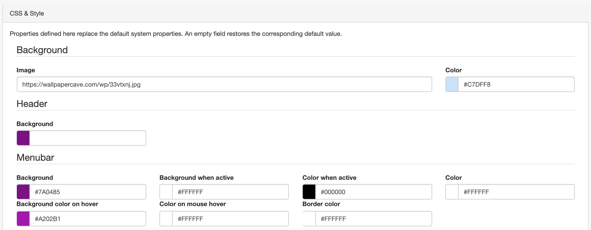
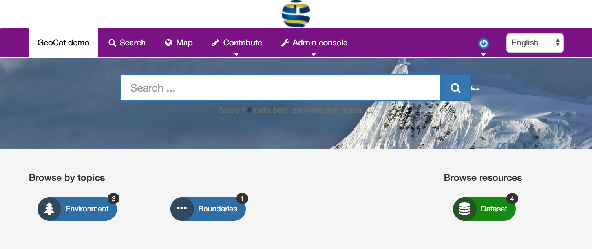

# Наладка CSS і стыляў {#css-configuration}

Каб перайсці да наладкі CSS і стыляў, трэба ўвайсці ў сістэму як адміністратар і 
адкрыць `Панэль адміністратара` --> `Наладкі` --> `CSS і стылі`.

На гэтай старонцы вы можаце змяняць розныя колеры элементаў старонкі (па змаўчанні, большасць з іх белыя). 
Звярніце ўвагу, што "фон" адносіцца да колеру фону элементаў, а "колер" - да колеру шрыфта, які выкарыстоўваецца ў элеменце. 
Прыведзеная вышэй наладка прывядзе да візуалізацыі, прадстаўленай ніжэй:

Таксама ёсць магчымасць стварыць спасылку на фонавую выяву. 
Пры стварэнні спасылкі на выяву варта выкарыстоўваць вэб-адрас выявы з крыніцы https, 
калі GeoNetwork выкарыстоўваецца па пратаколе https. Размяшчэнне выявы (якая загружаецца ў выглядзе лагатыпа) на тым жа серверы - 
лепшы спосаб прадухіліць магчымыя блакіроўкі браўзера.

!!! note "Заўвага"
    Можна захаваць канфігурацыю лакальна для наступнага выкарыстання або на альтэрнатыўных серверах. 
    Захаванне канфігурацыі зойме шмат часу, паколькі ўсе скрыпты і стылі будуць адноўлены з зыходных тэкстаў. 
    Часовыя файлы захоўваюцца на серверы ў папцы прыкладання і магчыма спатрэбіцца вярнуцца 
    на гэту старонку пасля абнаўлення сістэмы (або паўторнага разгортвання кантэйнера docker).