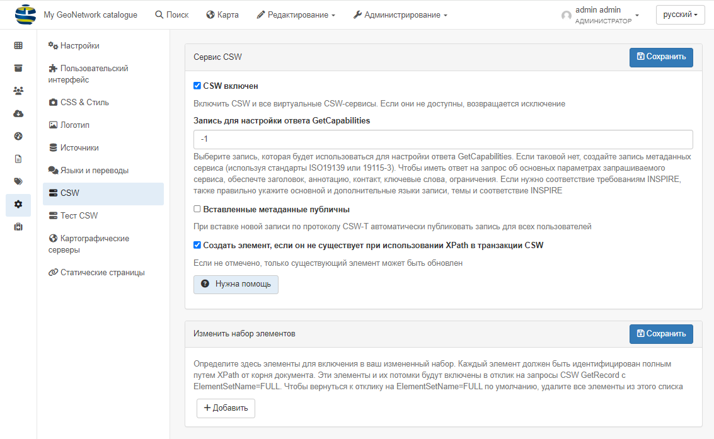
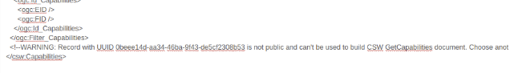

# Наладка CSW

Каб перайсці да наладкі сервера CSW, трэба ўвайсці ў сістэму як адміністратар і 
адкрыць `Панэль адміністратара` --> `Наладкі` --> `CSW`.



Служба CSW прадастаўляе апісанне інфармацыі пра свае наладкі з дапамогай запыту `es` 
(напрыклад, <http://localhost:8080/geonetwork/srv/en/csw?request=GetCapabilities&service=CSW&version=2.0.2>). 
Такі спосаб дазваляе наладзіць сервер CSW і запоўніць некаторыя ўласцівасці, якія вяртаюцца ў адказ на запыт GetCapabilities.

## Параметры канфігурацыі

- **CSW уключаны**: Па змаўчанні канчатковая кропка CSW уключана, але яе можна адключыць.

- **Запіс для наладкі адказу GetCapabilities**: Выберыце запіс, які будзе выкарыстоўвацца для наладкі адказу GetCapabilities. 
  Калі такога няма, стварыце запіс метаданых сэрвісу (выкарыстоўваючы стандарты ISO19139 або 19115-3). 
  Каб мець адказ на запыт пра асноўныя параметры запытанага сэрвісу, забяспечце загаловак, анатацыю, кантакт, ключавыя словы, абмежаванні. 
  Калі патрэбна адпаведнасць патрабаванням INSPIRE, таксама правільна ўкажыце асноўную і дадатковыя мовы запісу, тэмы і адпаведнасць INSPIRE

- **Устаўленыя метаданыя з'яўляюцца агульнадаступнымі**: Па змаўчанні метаданыя, устаўленыя з дапамогай аперацый збору даных CSW і транзакцый CSW, 
  недаступныя для публічнага прагляду. Карыстальнік з адпаведнымі правамі доступу можа зрабіць гэта пасля аперацый збору даных CSW і транзакцый CSW, 
  але гэта не заўсёды зручна. Калі гэты параметр усталяваны, усе метаданыя, устаўленыя з дапамогай аперацый збору даных CSW і транзакцыі CSW, 
  будуць даступныя для агульнага прагляду.

- **Стварыць элемент, калі ён не існуе пры выкарыстанні XPath у транзакцыі CSW**: Калі сцяжок не ўсталяваны, можна абнаўляць толькі існуючыя элементы.

## Запіс сэрвісных метаданых 

Для стварэння карыстальніцкіх магчымасцей рэкамендуецца стварыць спецыяльны запіс службовых метаданых (выкарыстоўваючы стандарты ISO19115-3 або ISO19139). 
Гэты запіс выкарыстоўваецца для стварэння дакумента пра магчымасці з выкарыстаннем шаблона `web/src/main/webapp/xml/csw/capabilities.xml`.

Пры стварэнні такога запісу для стварэння магчымасцей будзе выкарыстоўвацца наступная інфармацыя:

- назва
- анатацыя
- ключавыя словы
- зборы (з поля "Размеркаванне" -> "Інструкцыі па заказе")
- Абмежаванні доступу (з поля Абмежаванні доступу -> Іншыя абмежаванні)
- Кантакт (з поля Ідэнтыфікацыя -> Першы кантакт)

Службовы запіс ПАВІНЕН быць агульнадаступным.

Калі пры стварэнні дакумента пра магчымасці са службовага запісу адбылася памылка, выдаецца папярэджанне з каментарыем і выкарыстоўваюцца магчымасці па змаўчанні.:



## Наладка CSW для INSPIRE {#csw-канфігурацыя_inspire}

Калі каталог таксама арыентаваны на INSPIRE (гл. [Наладка для дырэктывы INSPIRE](inspire-configuration.md)), 
можа быць мэтазгодным таксама запоўніць наступныя палі, каб правільна наладзіць службу выяўлення:

- мова метаданых (+ дадатковыя мовы, калі такія ёсць) (выкарыстоўваецца для падтрымліваемых моў, мова па змаўчанні)
- Тэмы для натхнення
- часавы ахоп
- кантакты па метаданых
- адпаведнасць метаданых рэгламенту Камісіі 1089/2010

З дапамогай гэтай інфармацыі CSW можа быць правераны з дапамогай сродку праверкі INSPIRE.

## Наступная апрацоўка CSW

У нейкай сітуацыі карыстальнік можа захацець змяніць XML-кадзіроўку запісаў пры выманні з дапамогай CSW. Напрыклад:

- каб зрабіць запіс больш узгодненым
- адаптаваць кадзіроўку для праверкі запісаў з дапамогай правілаў INSPIRE 
  (напрыклад, у якасці абыходнага шляху для <https://github.com/inspire-eu-validation/community/issues/95>)

Для гэтага карыстальнік можа дадаць дадатковы крок пераўтварэння падчас вываду аперацый GetRecords і GetRecordById:

- Даданне працэсу post у srv/eng/csw шляхам стварэння для кожнай выходнай схемы файла. 
  Напрыклад для gmd укажыце/csw/gmd-csw-postprocessing.xsl
- Даданне постапрацоўкі на партал inspire/eng/csw шляхам стварэння файла для кожнай выходнай схемы. 
  Напрыклад, для gmd /csw/gmd-inspire-postprocessing.xsl

Для стварэння партала INSPIRE стварыце партал "inspire" у раздзеле `Панэль адміністратара` --> `Наладкі` --> `Крыніцы`. 
Затым карыстальнік можа наладзіць этап наступнай апрацоўкі для CSW партала INSPIRE. 
Стварыце файл постапрацоўкі gmd-inspire-postprocessing.xsl у вашай папцы schema/present/csw. 
У наступным прыкладзе выдаліце кантакт без электроннай пошты і спасылку, якая пачынаецца не з HTTP, каб адпавядаць правілам праверкі INSPIRE.

``` xml
<?xml version="1.0" encoding="UTF-8"?>
<xsl:stylesheet version="2.0" xmlns:xsl="http://www.w3.org/1999/XSL/Transform"
                xmlns:gn="http://www.fao.org/geonetwork"
                xmlns:gmd="http://www.isotc211.org/2005/gmd"
                xmlns:gco="http://www.isotc211.org/2005/gco"
                xmlns:srv="http://www.isotc211.org/2005/srv"
                exclude-result-prefixes="#all">

  <!-- Remove all contact not having an email -->
  <xsl:template match="*[gmd:CI_ResponsibleParty
                         and count(gmd:CI_ResponsibleParty/gmd:contactInfo/*/gmd:address/*/gmd:electronicMailAddress[*/text() != '']) = 0]"
                priority="2"/>

  <!-- Remove all online source not using HTTP to conform with
  https://github.com/inspire-eu-validation/community/issues/95
  -->
  <xsl:template match="*[gmd:CI_OnlineResource
                         and count(gmd:CI_OnlineResource/gmd:linkage/gmd:URL[not(starts-with(text(), 'http'))]) > 0]"
                priority="2"/>


  <!-- Remove geonet:* elements. -->
  <xsl:template match="gn:*" priority="2"/>

  <!-- Copy everything. -->
  <xsl:template match="@*|node()">
    <xsl:copy>
      <xsl:apply-templates select="@*|node()"/>
    </xsl:copy>
  </xsl:template>
</xsl:stylesheet>
```

Сэрвіс можа быць пратэставаны з дапамогай bash-скрыпта:

``` shell
curl 'http://localhost:8080/geonetwork/inspire/eng/csw' \
  -H 'Content-type: application/xml' \
  --data-binary $'<csw:GetRecordById xmlns:csw="http://www.opengis.net/cat/csw/2.0.2" service="CSW" version="2.0.2"                   outputSchema="http://www.isotc211.org/2005/gmd"><csw:ElementSetName>full</csw:ElementSetName><csw:Id>3de9790e-529f-431f-ac4f-e86d827bde8e</csw:Id>\n</csw:GetRecordById>'
```