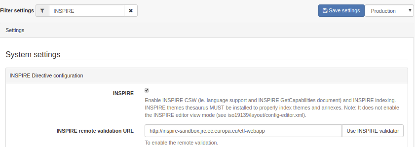
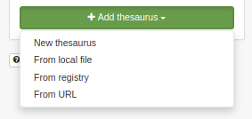
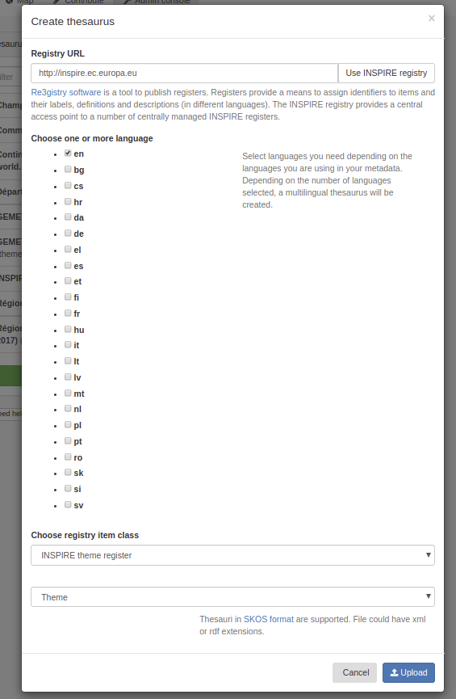
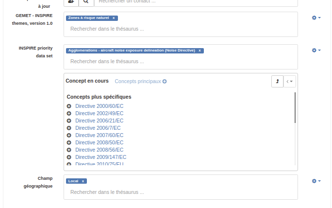
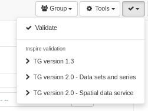
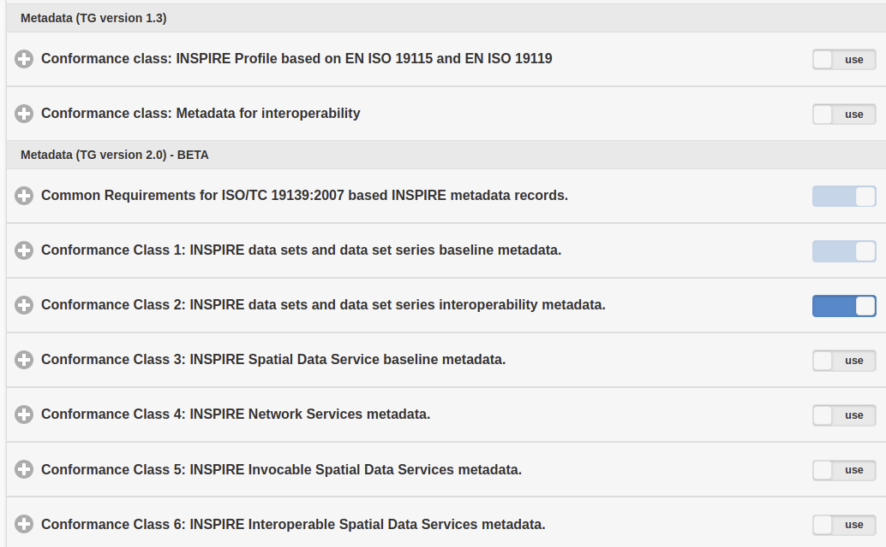
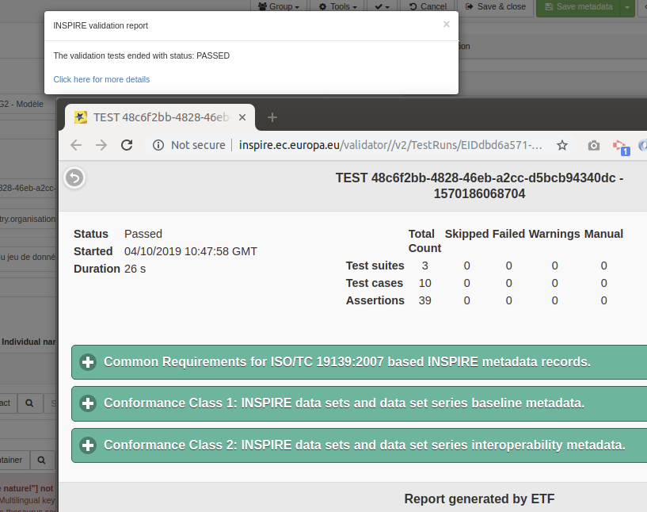
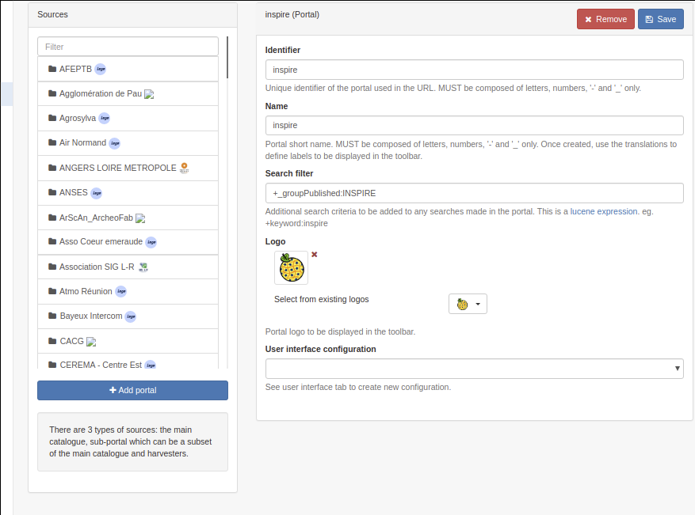

# Наладка для дырэктывы INSPIRE {#inspire-configuration}

## Уключэнне INSPIRE

У **Панэлі адміністратара --> Наладкі** карыстальнік можа наладзіць падтрымку дырэктывы INSPIRE.

Пры ўключэнні падтрымка INSPIRE актывуе наступнае:

- Уключыць індэксацыю тэм і прыкладанняў INSPIRE 
  (тэзаўрус тэм INSPIRE ПАВІНЕН быць дададзены ў спіс тэзаўрусаў з рэестра INSPIRE - 
  гл. [Кіраванне тэзаўрусам](../managing-classification-systems/managing-thesaurus.md)).

  

Для наладкі службы выяўлення НЕАБХОДНА стварыць спецыяльны запіс метададзеных службы, 
каб прадаставіць поўны дакумент GetCapabilities ([Канфігурацыя CSW для INSPIRE](csw-configuration.md)).

## Загрузка спісаў кодаў INSPIRE

Для апісання набораў дадзеных і серый INSPIRE рэкамендуецца загружаць адпаведныя спісы кодаў 
з [Рэестра INSPIRE](https://inspire.ec.europa.eu/registry/), наступныя спісы кодаў адпавядаюць патрабаванням кіраўніцтва па метададзеных версіі 2.0:

- [Тэма INSPIRE](https://inspire.ec.europa.eu/theme)
- [Схема прыкладання](https://inspire.ec.europa.eu/applicationschema)
- [Тыпы носьбітаў](https://inspire.ec.europa.eu/media-types)
- Рэестр кодавых дадзеных-> [Пратаколы](https://inspire.ec.europa.eu/metadata-codelist/ProtocolValue)
- Рэестр кодавых дадзеных-> [Прасторавы ахоп](https://inspire.ec.europa.eu/metadata-codelist/SpatialScope)
- Рэестр кодавых спісаў метададзеных --> [Набор прыярытэтных дадзеныхINSPIRE](https://inspire.ec.europa.eu/metadata-codelist/PriorityDataset)
- Рэестр кодавых дадзеных метададзеных -> [Катэгорыя службы прасторавых дадзеных](https://inspire.ec.europa.eu/metadata-codelist/SpatialDataServiceCategory)
- Рэестр кодавых дадзеных метададзеных -> [Умовы доступу і выкарыстання](https://inspire.ec.europa.eu/metadata-codelist/ConditionsApplyingToAccessAndUse)
- Рэестр кодавых дадзеных метададзеных -> [Абмежаванні на публічны доступ](https://inspire.ec.europa.eu/metadata-codelist/LimitationsOnPublicAccess)
- Зарэгістраваць спіс кодаў метададзеных --> [Анлайн-код апісання](https://inspire.ec.europa.eu/metadata-codelist/OnLineDescriptionCode)
- Рэестр кодавых спісаў метададзеных -> [Крытэрыі якасці абслугоўвання](https://inspire.ec.europa.eu/metadata-codelist/QualityOfServiceCriteria)

Адміністратары могуць кіраваць тэзаўрусамі з "Панэлі адміністратара" -> "Сістэмы класіфікацыі" -> "Тэзаўрус". 
Адным з варыянтаў з'яўляецца загрузка тэзаўруса непасрэдна з рэестра.



Націсніце "Выкарыстоўваць рэестр INSPIRE", каб выкарыстоўваць рэестр INSPIRE па змаўчанні, 
але можна выкарыстоўваць любы экзэмпляр [праграмнага забеспячэння для вядзення рэестра](https://joinup.ec.europa.eu/solution/re3gistry).



Выберыце адну або некалькі моў у залежнасці ад патрэб. 
Выберыце катэгорыю або непасрэдна тэзаўрус, у залежнасці ад тэматыкі тэзаўруса. 
Па змаўчанні тып тэзаўруса - "Тэма", але пры неабходнасці вы можаце адаптаваць яго.

Націснуўшы на кнопку "Загрузіць", каталог звяжацца з рэестрам, загрузіць файлы для кожнай мовы і 
аб'яднае іх у тэзаўрус у фармаце SKOS, які падтрымліваецца каталогам.

Карыстальнік таксама можа выкарыстоўваць добра вядомы [тэзаўрус GEMET](https://www.eionet.europa.eu/gemet/en/themes/). 
Некаторыя версіі тэзаўруса ў фармаце SKOS даступныя [тут](https://github.com/geonetwork/util-gemet/tree/master/thesauri).

Пасля загрузкі тэзаўрус можна выкарыстоўваць у запісах метададзеных для выбару ключавых слоў з:



Тып кадзіроўкі ключавых слоў можна вызначыць з дапамогай значка шасцярэнькі (дадатковую інфармацыю глядзіце ў раздзеле праверка):


З дапамогай формы наладкі плагіна schema можна наладзіць тэзаўрус, які будзе выкарыстоўвацца для пэўнага элемента "або". 
Паняцці тэзаўруса выкарыстоўваюцца для запаўнення тэкставага поля аўтазапаўнення для гэтага элемента.


## Праверка INSPIRE

Праверка запісаў метададзеных INSPIRE даступная па адрасе [the INSPIRE Validator](https://inspire.ec.europa.eu/validator/about/). 
У ім выкарыстоўваецца [ETF, які з'яўляецца платформай тэсціравання прасторавых дадзеных і сэрвісаў з адкрытым зыходным кодам](https://github.com/etf-validator/etf-webapp). Каталог метададзеных можа "апрацаваць" любы запіс, выкарыстоўваючы сэрвіс, які прадастаўляецца экзэмплярам ETF. Каб наладзіць аддаленую праверку, перайдзіце ў "Кансоль адміністратара" -> "Наладкі" і ўкажыце URL-адрас сродку праверкі. URL-адрас асноўнага сродку праверкі INSPIRE - гэта `https://inspire.ec.europa.eu/validator/`.


Пасля ўключэння рэдактар адлюструе опцыю аддаленай праверкі ў меню:



Стандартная опцыя праверкі будзе выкарыстоўваць унутраную сістэму праверкі 
(г.зн. XSD, правілы Schematron для ISO, INSPIRE, \... у залежнасці ад канфігурацыі). 
Ва ўнутранай сістэме праверка INSPIRE заснавана на тэхнічным кіраўніцтве INSPIRE версіі 1.3, і вынікі будуць адрознівацца ад справаздач ETF.

Пры аддаленай праверцы INSPIRE ва ўсплывальным акне адкрыецца сродак праверкі. 
Выберыце адзін з варыянтаў у залежнасці ад узроўню праверкі і тыпу рэсурсу для праверкі. 
Спіс параметраў можна наладзіць у [гэтай канфігурацыі file](https://github.com/geonetwork/core-geonetwork/blob/master/services/src/main/resources/config-spring-geonetwork.xml#L61-L94). Наладка ажыццяўляецца шляхам выбару аднаго або некалькіх набораў тэстаў з параметраў ETF:



Падчас праверкі запіс адпраўляецца ў службу ETF і апрацоўваецца. Як толькі ETF завершыць праверку, у каталогу з'явіцца спасылка на справаздачу аб праверцы.



Звярніце ўвагу, што калі вы правяраеце асабісты запіс, гэты запіс будзе перададзены ў сродак праверкі. 
Для забеспячэння бяспекі гэтага працэсу мы рэкамендуем наладзіць лакальную (прыватную) ўстаноўку сродку праверкі.

### Наладка набораў тэстаў для праверкі

Набор тэстаў, якія выконваюцца для кожнай схемы, 
можна наладзіць з дапамогай файла [WEB-INF/config-etf-validator.xml](https://github.com/geonetwork/core-geonetwork/blob/5156bae32d549e6d09cd6a86065791265eb09027/web/src/main/webapp/WEB-INF/config-etf-validator.xml).

Спіс даступных набораў тэстаў вызначаны ў кампаненце inspireEtfValidatorTestsuites. 
Гэта карта з запісам для кожнага набору тэстаў. Атрыбут `key` - гэта назва набору тэстаў. 
Кожны запіс карты ўяўляе сабой "масіў" з тэстамі, якія неабходна выканаць у наборы тэстаў. 
Значэнне кожнага элемента масіва ("<значэнне>") - гэта назва тэсту, запісаная ў дакладнасці так, як вызначана ў сэрвісе аддаленай праверкі INSPIRE. Напрыклад:

``` xml
<util:map id="inspireEtfValidatorTestsuites" key-type="java.lang.String" value-type="java.lang.String[]">
 <entry key="TG version 1.3">
   <array value-type="java.lang.String">
     <value>Conformance class: INSPIRE Profile based on EN ISO 19115 and EN ISO 19119</value>
     <value>Conformance class: XML encoding of ISO 19115/19119 metadata</value>
     <value>Conformance class: Conformance class: Metadata for interoperability</value>
   </array>
 </entry>
 <entry key="TG version 2.0 - Data sets and series">
   <array value-type="java.lang.String">
     <value>Common Requirements for ISO/TC 19139:2007 based INSPIRE metadata records.</value>
     <value>Conformance Class 1: INSPIRE data sets and data set series baseline metadata.</value>
     <value>Conformance Class 2: INSPIRE data sets and data set series interoperability metadata.</value>
   </array>
 </entry>
 <entry key="TG version 2.0 - Network services">
   <array value-type="java.lang.String">
     <value>Common Requirements for ISO/TC 19139:2007 based INSPIRE metadata records.</value>
     <!--<value>Conformance Class 1: INSPIRE data sets and data set series baseline metadata.</value>
     <value>Conformance Class 2: INSPIRE data sets and data set series interoperability metadata.</value>-->
     <value>Conformance Class 3: INSPIRE Spatial Data Service baseline metadata.</value>
     <value>Conformance Class 4: INSPIRE Network Services metadata.</value>
     <!--<value>Conformance Class 5: INSPIRE Invocable Spatial Data Services metadata.</value>
     <value>Conformance Class 6: INSPIRE Interoperable Spatial Data Services metadata.</value>
     <value>Conformance Class 7: INSPIRE Harmonised Spatial Data Services metadata.</value>-->
   </array>
 </entry>
</util:map>
```

Атрыбут `value-type` масіва павінен быць вызначаны як Java strings: `<тып значэння масіва="java.lang.String">`.

Каб вызначыць, якія наборы тэстаў будуць выконвацца пры выкарыстанні опцыі праверкі INSPIRE на панэлі інструментаў рэдактара, 
вы можаце змяніць кампанент inspireEtfValidatorTestsuitesConditions. Гэта карта з запісам для кожнай схемы і набору тэстаў, якія неабходна выканаць. 
Атрыбут ключа ўводу карты павінен быць у фармаце `SCHEMA_ID::TEST_SUITE_NAME`, 
дзе `TEST_SUITE_NAME` з'яўляецца адным з ключоў уводу карты `inspireEtfValidatorTestsuites`. 
Для кожнага запісу вы можаце вызначыць умову XPath, якую павінны выконваць метададзеныя для адпраўкі валідатару.

!!! info "Увага"

    Калі схема метададзеных не адпавядае, правяраецца іерархія залежнасцей схемы, 
    каб праверыць, ці адпавядае якая-небудзь бацькоўская схема якім-небудзь правілам.


!!! warning "Папярэджанне"

    Xpath павінен вяртаць набор вузлоў або node для працы. XPaths, які вяртае лагічнае значэнне `true` або `false`, 
    будзе інтэрпрэтавацца каталогам метададзеных як заўсёды супадаючы.

``` xml
<util:map id="inspireEtfValidatorTestsuitesConditions">
  <!--
     key format:
     SCHEMAID::TG_RULE_NAME
     If a metadata schema doesn't match, the schema dependency hierarchy
     is checked to verify if any parent schema matches any rules.
    -->
  <entry key="iso19139::TG version 2.0 - Data sets and series"
         value="gmd:hierarchyLevel[*/@codeListValue = 'dataset' or */@codeListValue = 'series']"/>
  <entry key="iso19139::TG version 2.0 - Network services" value=".//srv:SV_ServiceIdentification"/>
  <entry key="iso19115-3.2018::TG version 2.0 - Data sets and series"
         value="mdb:metadataScope[*/mdb:resourceScope/*/@codeListValue = 'dataset' or */mdb:resourceScope/*/@codeListValue = 'series']"/>
  <entry key="iso19115-3.2018::TG version 2.0 - Network services" value=".//srv:SV_ServiceIdentification"/>
</util:map>
```

## Кропка доступу INSPIRE

У многіх выпадках толькі частка запісаў метададзеных у каталогу звязана з дырэктывай INSPIRE. 
У гэтым выпадку можа апынуцца мэтазгодным адфільтраваць набор запісаў, якія падпадаюць пад дзеянне Дырэктывы, і прасоўваць іх праз дапаможны партал. 
Такім чынам, еўрапейскі партал можа лёгка збіраць запісы, якія адносяцца да INSPIRE.

Спачатку вызначыце механізм фільтрацыі, каб ідэнтыфікаваць запісы, якія падпадаюць пад дзеянне дырэктывы. Часта выкарыстоўваецца метад:

- Стварыце групу "INSPIRE" і апублікуйце гэтыя запісы ў гэтай групе (або катэгорыі).
- Дадайце канкрэтнае ключавое слова ў запіс метададзеных.
- Выканайце фільтрацыю на аснове справаздачы аб якасці адпаведнасці, якая змяшчае спасылку на дырэктыву ЕС.

У "Кансолі адміністратара" -> "Наладкі" -> "Крыніцы" адміністратар можа стварыць дадатковы партал. 
Стварыце субпартал `inspire` і ўсталюйце фільтр для выбару толькі запісаў, звязаных з INSPIRE (напрыклад, "+_group Published:INSPIRE", 
каб выбраць усе запісы, апублікаваныя ў групе "INSPIRE").



Пасля захавання партал будзе даступны па адрасе <http://localhost:8080/geonetwork/inspire>, 
а служба CSW - па адрасе <http://localhost:8080/geonetwork/inspire/eng/csw>.

## INSPIRE спасылкі

-   [INSPIRE IR](https://inspire.ec.europa.eu/)
-   [INSPIRE Technical Guidelines Metadata v2.0.1](https://inspire.ec.europa.eu/sites/default/files/documents/metadata/inspire-tg-metadata-iso19139-2.0.1.pdf)
-   [INSPIRE validator](https://inspire.ec.europa.eu/validator/)
-   [GeoNetwork at the INSPIRE forum](https://inspire.ec.europa.eu/forum/search?q=geonetwork)