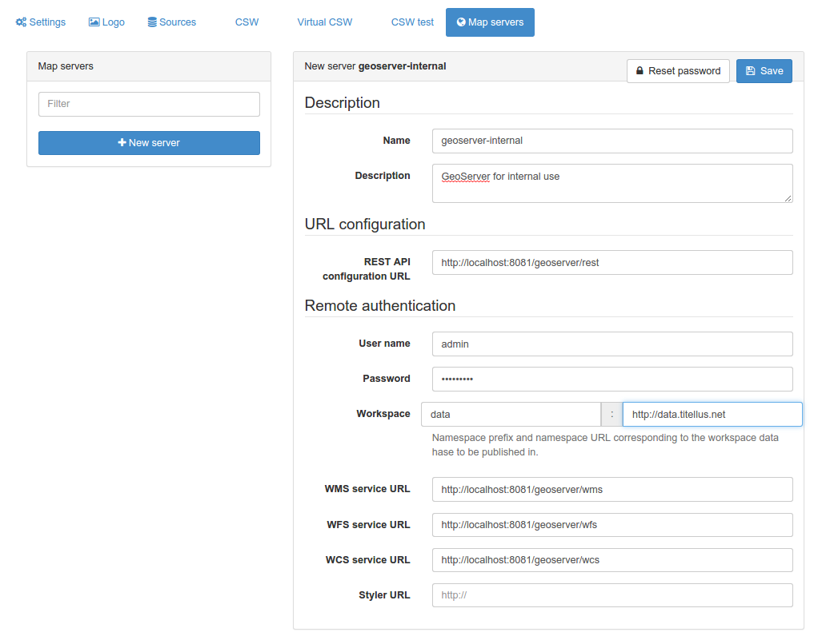

# Наладка картаграфічных сервераў для публікацыі

Каб апублікаваць інфармацыю з каталога ў выглядзе сэрвісаў OGC (WMS, WFS, WCS), 
адміністратару каталога неабходна зарэгістраваць адзін або некалькі картаграфічных сервераў для публікацыі. 
Картаграфічныя серверы ПАВІННЫ падтрымліваць GeoServer REST API для працы з каталогам. Былі пратэставаны 2 наступныя рэалізацыі:

- [GeoServer](https://geoserver.org)
- [Mapserver](https://mapserver.org) і [Mapserver REST API](https://github.com/neogeo-technologies/mra).

Наладзьце свой картаграфічны сервер, а затым зарэгіструйце яго ў адміністрацыйным інтэрфейсе:

Неабходныя наступныя параметры:

- Назва: Метка картаграфічнага сервера, якая будзе адлюстроўвацца пры публікацыі інфармацыі аб геапублікацыях.
- Апісанне: Апісанне картаграфічнага сервера.
- Канфігурацыя REST API: URL-адрас службы, якая прадстаўляе доступ да аддаленай канфігурацыі з выкарыстаннем REST API.
- Імя карыстальніка і пароль, якія будуць выкарыстоўвацца для падключэння да REST API.
- Прэфікс працоўнай вобласці і URL-адрас: інфармацыя аб працоўнай вобласці, у якую будуць змяшчацца даныя.
- URL сэрвісу WMS/WFS/WCS: URL-адрасы сэрвісаў, якія будуць выкарыстоўвацца пры даданні спасылак на сэрвісы ў запіс метаданых пасля публікацыі.

Глядзіце [Публікацыя ГІС-даных на картаграфічным серверы](../../user-guide/workflow/geopublication.md).