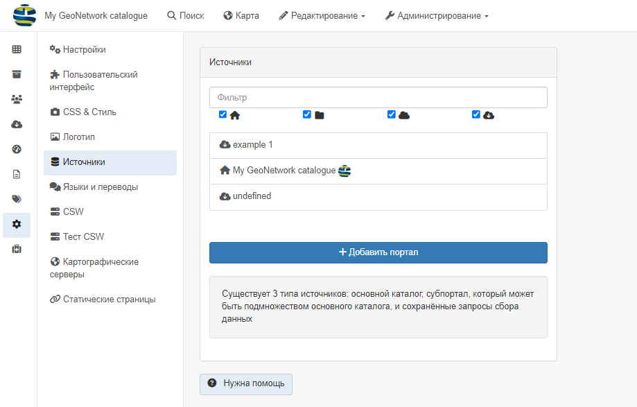
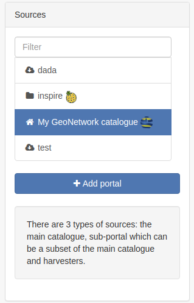
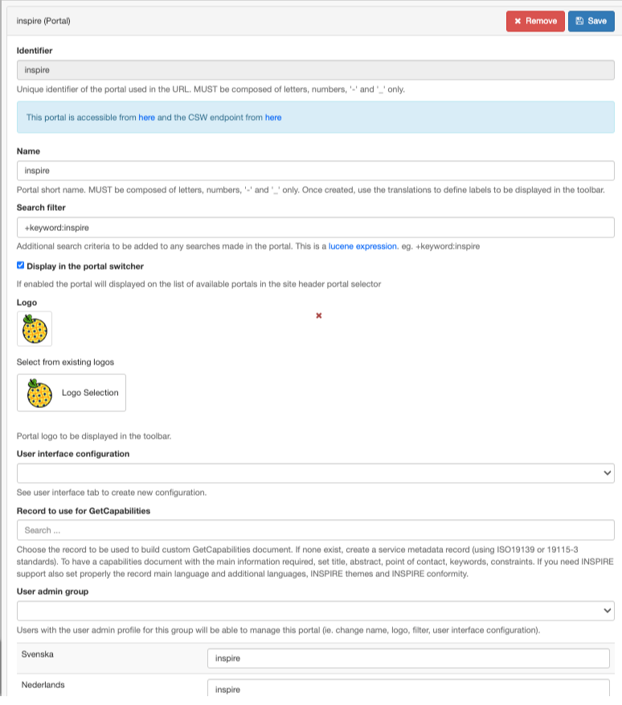
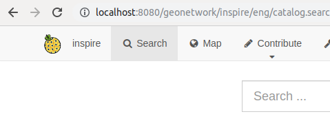
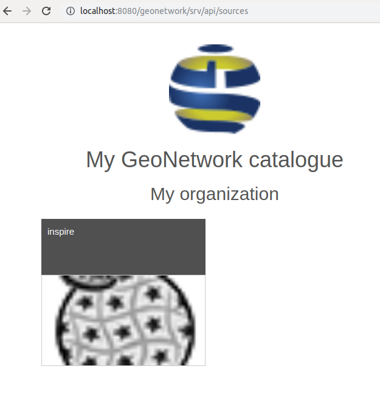
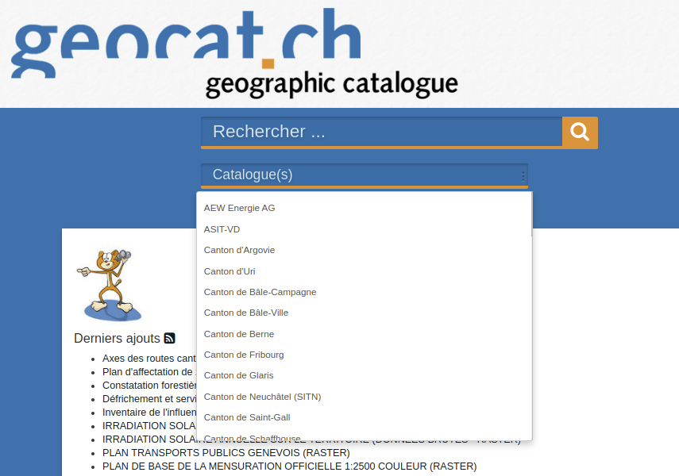
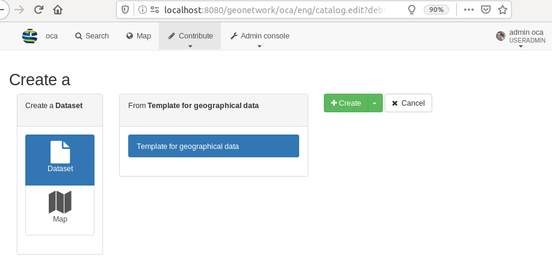
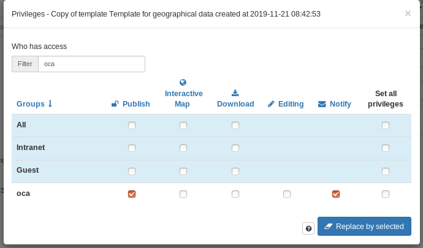

# Наладка парталаў

Парталы можна наладзіць у `Панэль адміністратара` --> `Наладкі` --> `Крыніцы`.

Існуе 3 тыпы крыніц:

- Асноўны каталог (адпавядае бягучай устаноўцы). 

- Зборшчыкі дадзеных(харвестары). Пры зборы дадзеных з іншага вузла парталаў на аснове GeoNetwork таксама збіраюцца дадзеныя з мэтавага каталога, 
  каб адсочваць сапраўднае паходжанне запісаў. Гэта адносіцца толькі да пратаколаў GeoNetwork, 
  якія выкарыстоўваюць MEF ([Фармат абмену метададзенымі (MEF)](../../annexes/mef-format.md)), якія ўтрымліваюць інфармацыю зыходнага каталога.

- Субпартал, які можа быць часткай асноўнага каталога. Яго наладка апісана ніжэй.

## Стварэнне субпартала

Субпарталы можна выкарыстоўваць арыентуючыся толькі на падмноства пэўных запісаў.

Выберыце `+ Дадаць партал `, каб стварыць новы субпартал. Адкрыецца акно:

Напрыклад, пры стварэнні субпартала з ідэнтыфікатарам "inspire" будзе даступная новая кропка ўваходу ў каталог: <http://localhost:8080/geonetwork/inspire/>. 
Доступ да каталога праз яго забяспечыць доступ толькі да запісаў, якія адпавядаюць фільтру, вызначанаму для гэтага падпартала. 
Значэнне параметра "фільтр пошуку" выкарыстоўвае сінтаксіс аналізатара запытаў Lucene (гл. <http://lucene.apache.org/java/2_9_1/queryparsersyntax.html>) 
і прымяняецца да ўсіх пошукавых запытаў.

Правы карыстальніка прымяняюцца гэтак жа, як і ў асноўным экземпляры.

Лагатып і назва субпартала будуць адлюстроўвацца замест асноўнай інфармацыі аб экземпляры, калі выбрана опцыя "Адлюстроўваць у пераключальніку партала":

Для гэтага субпартала таксама даступная служба CSW <http://localhost:8080/geonetwork/inspire/eng/csw> (якая замяняе функцыю віртуальнай CSW).

Субпартал таксама можа выкарыстоўваць пэўную канфігурацыю карыстальніцкага інтэрфейсу.

Спіс даступных субпарталаў прыведзены па адрасе <http://localhost:8080/geonetwork/srv/api/sources>

## Прыклад выкарыстання

### Стварэнне субпартала дырэктывы INSPIRE

Для дырэктывы INSPIRE адміністратару каталога неабходна апублікаваць кропку ўваходу, якая прадастаўляе доступ толькі да звязаных з INSPIRE запісаў. 
Субпартал INSPIRE можна стварыць з дапамогай фільтра па ключавых словах "+назва тэзаўруса: "Тэмы GEMET - INSPIRE, версія 1.0"".

### Стварэнне падпартала для партнёраў

Некаторым арганізацыям неабходна адкрыць каталог для некалькіх партнёраў. 
У такіх выпадках кожны партнёр, як правіла, атрымлівае доступ да каталога і стварае свае запісы ў спецыяльных групах. 
Добрым прыкладам з'яўляецца <https://www.geocat.ch/> прадастаўленне асноўнага пошукавага фільтра `каталог`.

Канцэпцыя субпартала прадугледжвае магчымасць стварэння спецыяльнага URL-адраса для кожнага партнёра. 
Загаловак можа змяшчаць ідэнтыфікацыю партнёра з указаннем імя і лагатыпа. 
Пры жаданні карыстальніцкі інтэрфейс таксама можа быць наладжаны (гл. [Наладка карыстальніцкага інтэрфейсу](user-interface-configuration.md)).

Каб наладзіць такую канфігурацыю, асноўным прынцыпам з'яўляецца наяўнасць:

- Адной групы для кожнага партнёра з адным або некалькімі карыстальнікамі
- Аднаго субпартала для кожнага партнёра з фільтрам, які адпавядае запісам у гэтай групе

Каб наладзіць гэта, выканайце наступныя дзеянні:

- Стварыце групу для партнёра, напрыклад група `A` (гл. [Стварэнне групы](../managing-users-and-groups/creating-group.md)).

- Стварыце хаця б аднаго карыстальніка для партнёра (гл. [Стварэнне карыстальніка](../managing-users-and-groups/creating-user.md)). 
  Карыстальнік павінен быць членам групы `A`. Калі трэба, каб карыстальнік мог наладжваць падпартал (напрыклад, змяняць назву, выбіраць лагатып), 
  у карыстальніка павінен быць як мінімум профіль "UserAdmin" для групы `A`.
 
- Стварыце субпартал. Ён можа мець тую ж назву, што і група, напрыклад, "A", але гэта не абавязкова. 
  Фільтр можна стварыць, выкарыстоўваючы той факт, што запіс, апублікаваны ў групе "A", павінен быць на гэтым падпартале, 
  выкарыстоўваючы сінтаксіс "+_groupPublished:A". Пасля стварэння падпартал даступны па адрасе <http://localhost:8080/geonetwork/oca>.

- (Неабавязкова) Звяжыце падпартал з групай адміністратараў карыстальнікаў, каб дазволіць "UserAdmin" наладжваць свой субпартал.

Пры такой канфігурацыі, г.зн. адзін партнёр = адна група = адзін субпартал, і
карыстальнікі з'яўляюцца членамі толькі адной групы, тады пры падключэнні да субпартала партнёра:

- карыстальнік будзе бачыць толькі запісы, апублікаваныя ў гэтай групе, ва ўсім прыкладанні
- пры стварэнні новых запісаў выбар групы не прадугледжаны, паколькі карыстальнік з'яўляецца членам толькі адной групы

Памятайце, што запіс бачны на субпартале "A", таму што ён апублікаваны ў групе "A":

Калі аперацыя "публікацыя" будзе выдалена з групы "A", то запісы больш не будуць адлюстроўвацца на гэтым субпартале.

У некаторых сітуацыях ёсць неабходнасць падзяліцца шаблонамі паміж партнёрамі. Для гэтага ёсць 2 варыянты:

- Апублікаваць шаблон ва ўсіх групах партнёраў. 
  Асноўным недахопам у гэтым выпадку з'яўляецца тое, што пры даданні новай групы шаблоны павінны быць апублікаваныя ў гэтай новай групе.

- Стварыце спецыяльную групу для агульных запісаў, напрыклад. `sharedGroup`. 
  Апублікуйце шаблоны ў гэтай агульнай прасторы. Зменіце фільтр субпартала, каб ён адпавядаў альбо партнёрскай групе,
  альбо агульнай групе. `+_groupPublished:(A АБО sharedGroup)`.