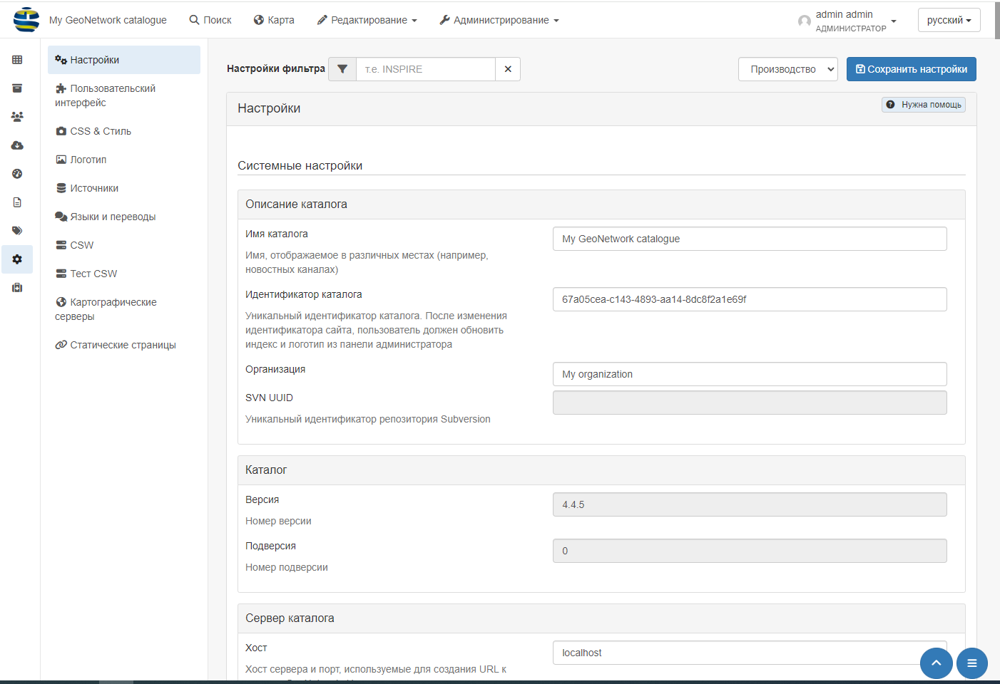
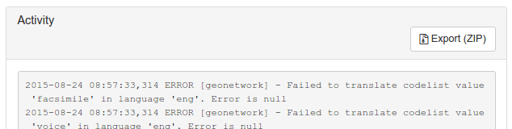
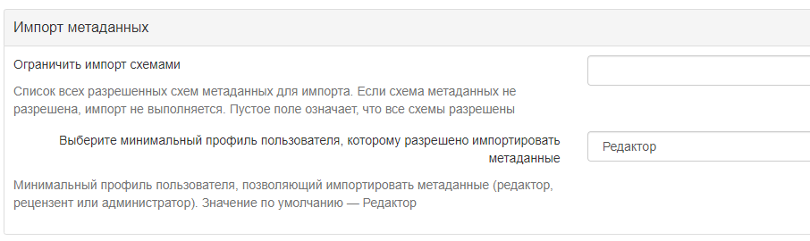
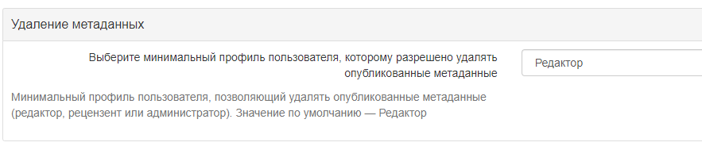
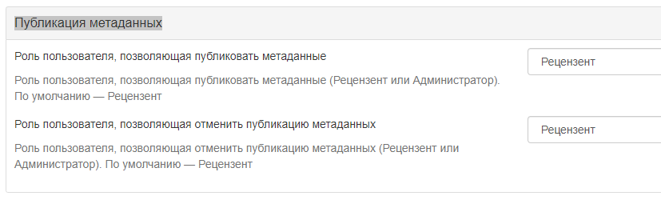
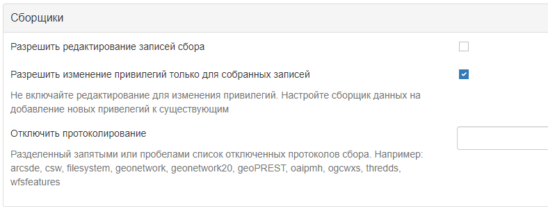

# Наладка сістэмы

Большасць наладжвальных параметраў сістэмы могуць быць зменены карыстальнікамі-адміністратарамі з дапамогай вэб-інтэрфейсу ў `Адміністраванне` -> `Наладкі`.

!!! info "Важна"

    Змена сістэмных параметраў істотна ўплывае на працу каталога. 
    Няправільнае выкарыстанне некаторых наладак можа прывесці да таго, што сістэма будзе працаваць не так, як чакалася. 
    

Паколькі старонка сістэмных наладак адносна доўгая, кнопка `Захаваць наладкі` можа паўтарацца паміж раздзеламі.

## Апісанне каталога

-    **Назва каталога** - Назва вузла. Інфармацыя, якая дапамагае карыстальніку ідэнтыфікаваць каталог.

-    **Ідэнтыфікатар каталога** - Універсальны ўнікальны ідэнтыфікатар (uuid), які адрознівае каталог ад любога іншага каталога. 
      Рэкамендуецца пакінуць яго ў выглядзе uuid. Ён будзе выкарыстоўвацца зборшчыкам даных для ідэнтыфікацыі зыходнага каталога.

-    **Арганізацыя** - Арганізацыя, да якой належыць вузел. Гэта таксама інфармацыя, якая дапамагае ідэнтыфікаваць каталог звычайнаму карыстальніку.

-    **SVN UUID** - Рэпазітар [Subversion](https://ru.wikipedia.org/wiki/Subversion), прымацаваны да вузла. 
     Рэпазітар выкарыстоўваецца для кіравання версіямі метаданых.

## Каталог

-    **Версія** - Версія сістэмы каталога метададзеных (толькі для чытання). 
-    **Падверсія** - Дадатковая версія каталога (толькі для чытання).

## Сервер каталога {#system-config-server}

-    **Хост** - Назва або IP-адрас вузла (без <http://>). Назва выкарыстоўваецца пры рэдагаванні метаданых для стварэння спасылак на рэсурсы.
     -    Калі вузел агульнадаступны з Інтэрнэту, вы павінны выкарыстоўваць даменнае імя.
     -    Калі вузел схаваны ў вашай прыватнай сетцы і ў вас ёсць брандмаўэр або вэб-сервер, які перанакіроўвае ўваходныя запыты на гэты вузел, вам неабходна ўвесці агульнадаступны адрас брандмаўэра або вэб-сервера. Тыповая канфігурацыя - гэта вэб-сервер Apache па адрасе A, які з'яўляецца агульнадаступным і перанакіроўвае запыты на сервер Tomcat па прыватным адрасе B. У гэтым выпадку вам неабходна ўвесці A ў параметры host.
-    **Порт** - Нумар порта сервера (звычайна 80 або 8080). Калі выкарыстоўваецца пратакол HTTP, усталюйце яго роўным 80.

-    **Пераважны пратакол** - Вызначае пратакол для доступу да каталога. 
     Пратакол HTTP, які выкарыстоўваецца для доступу да сервера. Выбар http азначае, што ўсе паведамленні з каталогам будуць бачныя ўсім, хто выкарыстоўвае гэты пратакол. 
     Паколькі гэта ўключае імёны карыстальнікаў і паролі, гэта небяспечна. Выбар https азначае, што ўся сувязь з каталогам будзе зашыфравана.

-    **Узровень логаў** - Вызначае ўзровень лагіравання ў журнале прыкладання. 
     Пасля ўнясення змяненняў у журнал можна будзе праверыць у раздзеле "Статыстыка і статус" у раздзеле `Актыўнасць`.

-    **Часавы пояс** - Часавы пояс задаецца для карэктнай працы часу ў каталогу. Калі не ўсталяваны, будзе выкарыстоўвацца часавы пояс JVM па змаўчанні.

## Параметры "Інтранэта" (унутранай сеткі)

Часта арганізацыі патрабуецца наладзіць працэс аўтаматычнага распазнавання ананімных унутраных карыстальнікаў, 
якія атрымліваюць доступ да вузла ўнутры арганізацыі (Інтранэт), і ананімных знешніх карыстальнікаў з Інтэрнэту. 
Каталог вызначае ананімных карыстальнікаў унутры арганізацыі як тых, што належаць да групы *Інтранэт*, 
у той час як ананімныя карыстальнікі за межамі арганізацыі вызначаюцца групай *Усе*. 
Каб аўтаматычна распазнаваць карыстальнікаў, якія належаць да групы Інтранэт, неабходна ўказаць каталогу IP-адрас інтрасеткі і сеткавую маску.

-    **Сетка** - Адрас унутранай сеткі ў выглядзе IP-адраса (напрыклад, 147.109.100.0). Гэта можа быць спіс IP-адрасоў, падзеленых коскамі.
-    **Маска сеткі** - Маска сеткі інтрасеткі (напрыклад, 255.255.255.0). Укажыце як мага больш масак сеткі і IP-адрасоў.

Калі параметры ўнутранай сеткі не зададзены, група *Інтранэт* не будзе адлюстроўвацца на панэлі агульнага доступу.

## Проксі-сервер

На старонцы наладак прапануецца задаць канфігурацыю проксі-сервера. 
Гэтая канфігурацыя выкарыстоўваецца прыкладаннем для доступу да Інтэрнэту для атрымання анлайн-рэсурсаў, напрыклад, у рамках працэсу збору ўраджаю.

-    **Выкарыстоўваць проксі** - Уключыце проксі-сервер, калі каталог выкарыстоўваецца ў звязку з проксі-серверам і калі неабходна выкарыстоўваць яго для доступу да аддаленых рэсурсаў.
-    **Хост проксі** - IP-адрас або назва проксі-сервера.
-    **Порт проксі** - Порт проксі-сервера.
-    **Імя карыстальніка проксі** - Імя карыстальніка на проксі-серверы.
-    **Пароль карыстальніка проксі** - Пароль карыстальніка проксі. 
-    **Ігнараваць спіс хостаў** - Каб абыйсці пэўныя хосты, трэба ўвесці IP-адрас або назву хоста, напрыклад www.mydomain.com, або дыяпазон адрасоў, выкарыстоўваючы падстаноўныя знакі, напрыклад 192.168.2.*. Сімвал | выкарыстоўваецца для падзелу значэнняў розных хостаў.

Параметры проксі-сервера JVM таксама могуць спатрэбіцца для правільнай наладкі проксі-сервера для ўсяго аддаленага доступу.

## Зваротная сувязь

Пры неабходнасці каталог можа адпраўляць электронныя лісты. Гэта магчыма, калі:

- выкарыстоўваецца сістэма рэгістрацыі карыстальнікаў
- выкарыстоўваюцца статусы стану працоўнага працэсу (гл. [Жыццёвы цыкл](../../user-guide/workflow/life-cycle.md))
- загружаны файл з запісам метаданых і абрана прывілей апавяшчаць

У гэтым раздзеле наладжваецца выкарыстоўваемы паштовы сервер.

-    **Электронная пошта** - Гэта адрас электроннай пошты адміністратара, які выкарыстоўваецца для адпраўкі паведамленняў.
-    **SMTP хост** - Назва паштовага сервера або IP-адрас, якія выкарыстоўваюцца для адпраўкі электронных лістоў.
-    **SMTP-порт** - SMTP-порт.
-    **Выкарыстоўваць SSL** - Выкарыстоўваць SSL-верыфікацыю.
-    **Імя карыстальніка** - Імя карыстальніка на SMTP-серверы, калі ён падключаны.
-    **Пароль** - Пароль карыстальніка на SMTP-серверы, калі ён падключаны.

## Вынікі пошуку метаданых

Параметры пошуку метаданых вызначаюць абмежаванні на вынікі пошуку для карыстальніка.

-    **Максімум выбраных запісаў** - Максімальная колькасць вынікаў пошуку, якія карыстальнік можа выбраць і апрацаваць з дапамогай пакетных аперацый, 
     напрыклад, усталяваць правы доступу, катэгорыі і г. д. Гэты параметр дазваляе пазбегнуць працяглых дзеянняў, якія могуць прывесці да памылкі недахопу памяці.

## Служба каталогаў Web (CSW)

Гл. раздзел [Наладка CSW](csw-configuration.md).

## Самастойная рэгістрацыя карыстальнікаў

Гл. раздзел [Самарэгістрацыя карыстальнікаў](../managing-users-and-groups/user-self-registration.md).

## Зваротная сувязь карыстальнікаў

-    **Уключыць зваротную сувязь прыкладання** - Уключэнне гэтай опцыі дазваляе адпраўляць водгук пра прыкладанне сістэмнаму адміністратару. 
     Для гэтага таксама неабходна наладзіць паштовы сервер.

-    **Уключыць зваротную сувязь па метаданых** - Уключэнне гэтай опцыі дазваляе пакінуць водгук уладальніку метаданых і сістэмнаму адміністратару пра запіс метаданых. 
     Для гэтага неабходна, каб паштовы сервер таксама быў наладжаны.

## Спасылка ў запісах метаданых

-    **Актыўныя гіперспасылкі** - Калі сцяжок пастаўлены, каталог метададзеных будзе паказваць актыўныя гіперспасылкі ў метаданых.

## Рэйтынг метаданых

-    **Лакальны рэйтынг** - Калі гэты параметр уключаны, каталог будзе разлічваць ацэнкі карыстальнікаў толькі для метаданых з бягучага вузла 
     (не размеркаваных паміж іншымі вузламі каталога метададзеных). Гэта адносіцца толькі да запісаў, сабраных з выкарыстаннем пратакола GeoNetwork.
-    **Узровень апавяшчэння аб рэйтынгу** - Вызначае, якіх карыстальнікаў варта апавяшчаць у выпадку змены рэйтынгу.
-    **Групы для апавяшчэння ў выпадку змены рэйтынгу** - Спіс груп, падзеленых сімвалам |, 
     для апавяшчэння ў выпадку змены ацэнкі (для ўзроўню апавяшчэння «Апавясціць групу(ы) па электроннай пошце»).

# XLink метаданых {#xlink_config}

Распазнавальнік XLink замяняе змесціва элементаў з атрыбутам @xlink:href (за выключэннем некаторых элементаў, такіх як srv:operatesOn) змесцівам, 
атрыманым са змесціва URL-адраса @xlink:href. Распазнавальнік XLink павінен быць уключаны, калі трэба збіраць фрагменты метаданых 
або паўторна выкарыстоўваць фрагменты метаданых у сваіх запісах метаданых (напр. пры выкарыстанні даведніка кантактаў).

-    **Уключыць аналіз XLink**: - Калі ўключана, будуць аналізавацца XLinks да фрагментаў метаданых у запісах
-    **Уключыць лакальныя XLink** - Лакальныя спасылкі XLinks выкарыстоўваюць URL-адрас local://<land>/<service> для стварэння спасылак на адпаведныя раздзелы замест URL-адраса HTTP. Лакальныя спасылкі звычайна працуюць хутчэй, чым HTTP-спасылкі.
-    **Пры аналізе XLink прапускаць элементы** - Спіс элементаў для пропуску пры аналізе XLink праз коску.
-    **Дазволіць выдаленне падшаблонаў, на якія спасылаецца xlink** - Калі адзначана, то дазволіць.

!!! info "Глядзець таксама"

    Для павышэння прадукцыйнасці каталог будзе кэшаваць змесціва, якога няма ў лакальным каталогу. 
    Каб ачысціць кэш XLink, трэба зайсці ў `Адміністраванне` -> `Інструменты`, калі фрагменты былі абноўлены.

## Абнаўленне метаданых

Для кожнай схемы метаданых у каталогу ёсць пераўтварэнне XSL (`update-fixed-info.xsl`), якое можна прымяніць да запісу метаданых, які належыць да гэтай схемы. 
Мэта гэтага пераўтварэння - забяспечыць магчымасць прымянення пэўнай схемы, інфармацыі пра сайт і каталог 
да запісу метаданых пры кожным захаванні запісу метаданых у рэдактары. 
У якасці прыкладу, гэта пераўтварэнне выкарыстоўваецца для стварэння і захавання URL-адраса любых файлаў, 
загружаных і захаваных разам з запісам метаданых у рэдактары.

-    **Аўтаматычныя праўкі**: Уключана па змаўчанні. Рэкамендуецца не выкарыстоўваць рэдактар метаданых, калі аўтаматычнае выпраўленне адключана. 
     Больш падрабязную інфармацыю глядзіце ў раздзеле <http://trac.osgeo.org/geonetwork/ticket/368>.

## Статыстыка пошуку {#search_stats_config}

Калі ўключана, пошукавая статыстыка будзе збірацца і захоўвацца ў базе даных. 
Статыстыка пошуку захоўваецца ў базе даных і можа быць запытана з дапамогай старонкі `Статыстыка пошуку`.

## Адкрыць правайдэр Archive Initiative (OAI-PMH)

Опцыі ў гэтай групе кіруюць тым, як сервер OAI адказвае на OAIPMH-запыты з аддаленых рэсурсаў.

- **Пошук па даце**: Зборшчыкі OAI могуць запытваць у GeoNetwork запісы ў пэўным дыяпазоне дат. 
  GeoNetwork можа выкарыстоўваць адно з двух палёў даты з метаданых для праверкі супадзення з гэтым дыяпазонам дат. 
  Па змаўчанні выкарыстоўваецца поле *Працягласць у часе*, якая ўяўляе сабой часовую працягласць з запісу метаданых. 
  Іншы варыянт, *Дата мадыфікацыі*, выкарыстоўвае дату мадыфікацыі запісу метаданых у базе даных GeoNetwork. Дата мадыфікацыі - гэта апошні раз, калі запіс метаданых абнаўляўся або збіраўся ў GeoNetwork.

- **Ліміт часу ResumptionToken**: Запісы метаданых, якія адпавядаюць пошукаваму запыту OAI-зборшчыка, 
  звычайна вяртаюцца зборшчыку ў групах з фіксаваным памерам (напрыклад, у групах па 10 запісаў). 
  У кожную групу ўключаецца маркер аднаўлення, каб зборшчык мог запытаць наступную групу запісаў. 
  Таймаўт маркера аднаўлення - гэта час (у секундах), на працягу якога сервер GeoNetwork OAI будзе чакаць выкарыстання маркера аднаўлення. 
  Калі таймаўт перавышаны, сервер GeoNetwork OAI адкіне вынікі пошуку і адмовіцца распазнаваць маркер аднаўлення. 
  Мэта гэтай функцыі - забяспечыць вызваленне рэсурсаў на серверы GeoNetwork OAI.

- **Памер кэша**: Максімальная колькасць адначасовых збораў OAI, якія могуць захоўвацца ў кэшы.

Перазапусціце каталог, каб запусціць наладкі OAI.

## Канфігурацыя дырэктывы INSPIRE

Глядзець [Наладка дырэктывы INSPIRE](inspire-configuration.md).

## Індэксацыя

Дадзены параметр вызначае, колькі працэсарных патокаў выдзелена для задач індэксацыі ў GeoNetwork. 
Калі на камп'ютары, на якім запушчаны GeoNetwork, шмат працэсарных ядраў, то магчыма вызначыць, 
колькі з іх будзе ўдзельнічаць у індэксацыі. Гэта можа значна паскорыць выкананне буйных задач індэксацыі 
(напрыклад, змяненне прывілеяў для 20 000 запісаў), паколькі GeoNetwork можа падзяліць задачу індэксацыі на некалькі частак 
і прызначыць іх розным працэсарным ядрам.

**Колькасць патокаў апрацоўкі** - Максімальная колькасць патокаў апрацоўкі, якая можа быць выдзелена для задачы індэксацыі.

Заўвага: гэты параметр даступны толькі для правераных баз даных. 
Гэта базы даных PostGIS і Oracle. Таксама варта старанна прадумаць, колькі падключэнняў да базы даных будзе выдзелена ў канфігурацыі, 
паколькі кожны паток можа ўсталяваць адно падключэнне да базы даных на час працяглага сеансу індэксацыі. 
Больш падрабязную інфармацыю пра тое, як наладзіць колькасць падключэнняў у пуле падключэнняў да базы даных, глядзіце ў раздзеле **Пашыраная канфігурацыя**.

## Старонка правоў на метаданыя

**Адлюстроўваць толькі групы, да якіх належыць карыстальнік**: калі ўключана, то на старонцы правоў доступу метаданых будуць адлюстроўвацца толькі тыя групы, 
да якіх належыць карыстальнік (калі карыстальнік не з'яўляецца адміністратарам). На дадзены момант гэтая опцыя не можа быць адключана і, верагодна, 
будзе прызнана састарэлай у наступнай версіі GeoNetwork.

## Імпарт метаданых

- **Абмежаваць імпарт схемамі**: Спіс усіх дазволеных схем для імпарту метаданых. Калі схема метаданых не дазволена, імпарт не выконваецца. Выкарыстоўвайце пустое значэнне, каб дазволіць усе схемы.
- **Выберыце мінімальны профіль карыстальніка, якому дазволена імпартаваць метаданыя**: Мінімальны профіль карыстальніка, дазволены для імпарту метаданых ("Рэдактар", `Рэцэнзент` або `Адміністратар`). Значэнне па змаўчанні - `Рэдактар`.

## Выдаленне метаданых

Дазваляе выбраць тып карыстальніка, якому дазволена выдаляць апублікаваныя метаданыя.

## Публікацыя метаданых

Дазваляе выбраць карыстальніка, якому дазволена публікаваць і адмяняць публікацыю метаданых.

## Зборшчыкі

- **Дазволіць рэдагаванне запісаў збору**: Уключае/выключае рэдагаванне сабраных запісаў у каталогу. Па змаўчанні сабраныя запісы не могуць быць адрэдагаваныя.
- **Дазволіць змяненне прывілеяў толькі для сабраных запісаў**: Не ўключайце рэдагаванне для змены прывілеяў. Наладзьце зборшчык даных на даданне новых прывілеяў да існуючых
- **Адключыць пратакаляванне**: Падзелены коскамі або прабеламі спіс адключаных пратаколаў збору. Напрыклад: arcsde, csw, filesystem, geonetwork, geonetwork20, geoPREST, oaipmh, ogcwxs, thredds, wfsfeatures

