# Наладка карыстальніцкага інтэрфейсу

Большасць параметраў канфігурацыі карыстальніцкага інтэрфейсу могуць быць зменены адміністратарам 
з дапамогай вэб-інтэрфейсу ў `Панэлі адміністратара` --> `Наладкі` --> `Карыстальніцкі інтэрфейс`.

!!! info "Заўвага"

    Наладка гэтых параметраў крытычна важная для працы каталога. 
    Няправільнае выкарыстанне некаторых наладак можа прывесці да таго, што сістэма будзе працаваць не так, як чакалася.

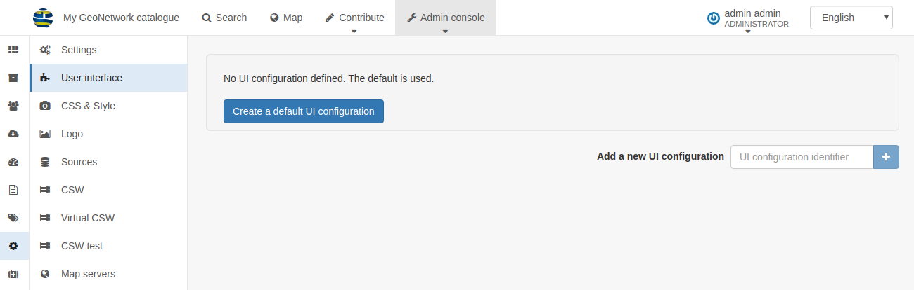

Па змаўчанні ў каталогу будзе выкарыстоўвацца канфігурацыя карыстальніцкага інтэрфейсу з назвай "srv". 
Каб прагледзець і адрэдагаваць наладкі для гэтай канфігурацыі, выберыце `Задаць параметры карыстальніцкага інтэрфейсу па змаўчанні`.

Каб дадаць новую канфігурацыю, напрыклад, для партала (гл. [Канфігурацыя партала](portal-configuration.md)), 
у форме `Дадаць новую канфігурацыю інтэрфейсу` трэба альбо стварыць новую канфігурацыю (увесці назву і націснуць `+`), 
альбо выбраць ужо існуючую канфігурацыю з выпадальнага спіса.

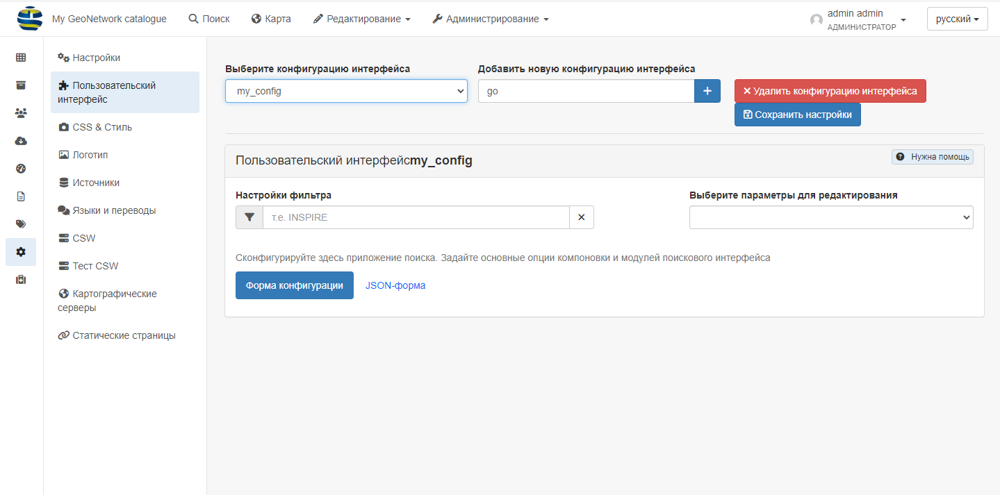

Параметраў карыстальніцкага інтэрфейсу даволі шмат. У выпадальным спісе `Выберыце параметры для рэдагавання` адміністратар можа:

- Адкрыць усе параметры адразу (пункт `Усе параметры`)

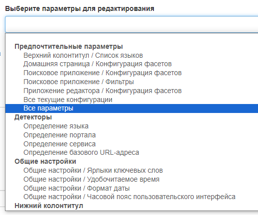

- Адкрыць патрэбны параметр асобна ад усіх

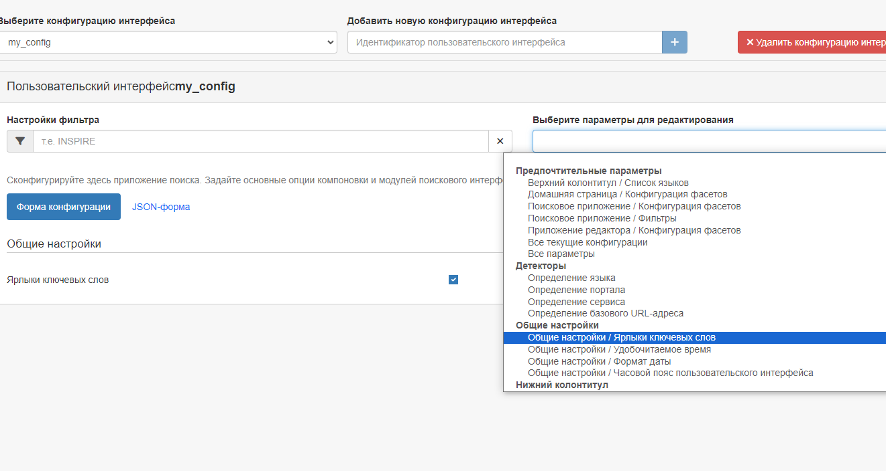

Дадатковыя канфігурацыі таксама могуць быць выкарыстаны для стварэння знешняга прыкладання на JS, якое можа загружаць пэўную канфігурацыю.

- **Наладкі фільтра**: Гэта поле пошуку можна выкарыстоўваць для фільтрацыі наладак у форме, 
  напрыклад, пры пошуку "сацыяльныя сеткі" будуць адлюстроўвацца толькі наладкі, якія адносяцца да сацыяльнай панэлі.

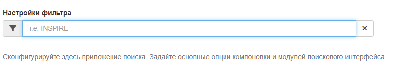

## Агульныя параметры

- **Ярлыкі ключавых слоў**: калі абрана, у ключавых слоў будуць створаны ярлыкі.
- **Зручны для чытання час**: калі абрана, даты будуць адлюстраваны ў зручным для карыстальніка фармаце. Калі ён не ўсталяваны, будзе адлюстроўвацца поўная дата.
- **Фармат даты**: поле, дзе можна задаць фармат даты.
- **Часавы пояс карыстальніцкага інтэрфейсу**: Часавы пояс, які будзе выкарыстоўвацца для адлюстравання даты.
  Калі няма неабходнасці апрацоўваць некалькі часавых паясоў у каталогу, усталюйце для гэтага значэння часавы пояс сервера. 
  Значэнне `Browser` (па змаўчанні) указвае на выкарыстанне часавога пояса браўзера.

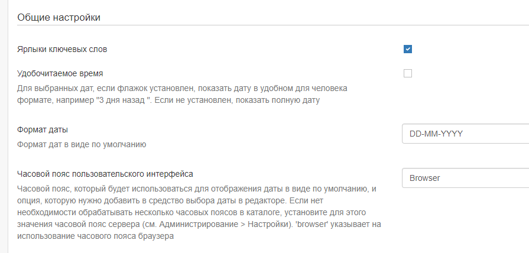

## Футар (ніжні калантытул)

- **Ніжні калантытул**: Усталюйце гэты сцяжок, каб вызначыць, ці адлюстроўваецца ніжні калантытул GeoNetwork. 
   Калі ён не ўсталяваны, ніжні калантытул адлюстроўвацца не будзе.
- **Панэль сацыяльных сетак**: Усталюйце гэты сцяжок, каб адлюстроўваць панэль сацыяльных сетак (спасылкі на twitter, facebook, linkedin і г.д.) у ніжнім калантытуле.
- **Паказваць версію GeoNetwork і спасылкі**: Паказваць версію прыкладання і спасылкі ў ніжнім калантытуле старонкі каталога.
- **Пункты карыстальніцкага меню ў ніжнім калантытуле**
- **Спіс RSS-каналаў**

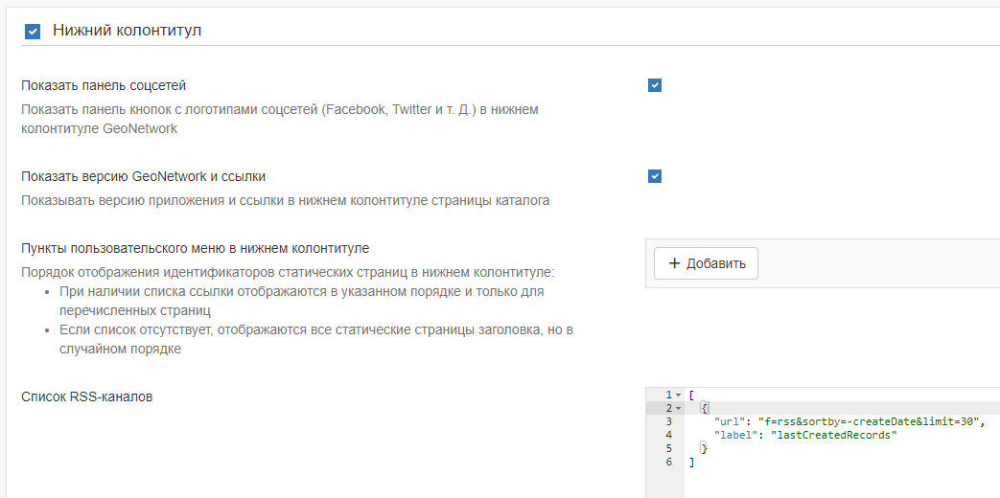

## Хэдэр (верхні калантытул) 
- **Верхні калантытул**: Усталюйце гэты сцяжок, каб вызначыць, ці будзе адлюстроўвацца верхняя панэль інструментаў GeoNetwork. 
  Калі гэты параметр не зададзены, панэль інструментаў адлюстроўвацца не будзе.
- **Спіс моў**: Выберыце мовы са спіса, якія павінны быць даступныя для перакладу радкоў інтэрфейсу. 
  Калі застанецца толькі адна мова, то выпадальны спіс адлюстроўвацца не будзе. 
  Звярніце ўвагу, што пры наяўнасці перакладу можна дадаць дадатковыя мовы, націснуўшы кнопку "+" пад спісам і дадаўшы адпаведныя ISO-коды.

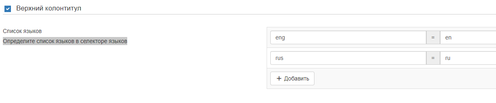

- **Паказваць лагатып у загалоўку**: Гэты параметр вызначае, дзе павінен размяшчацца лагатып каталога. 
  Калі абраны гэты параметр, лагатып будзе размешчаны ў верхнім калантытуле над верхняй панэллю інструментаў, 
  а лагатып панэлі інструментаў (па змаўчанні) будзе выдалены. Калі гэты параметр не ўсталяваны, лагатып будзе адлюстроўвацца на верхняй панэлі інструментаў.
- **Размяшчэнне лагатыпа**: Гэтыя параметры вызначаюць, у якім месцы загалоўка будзе размешчаны лагатып.
- **Кантэйнер раздзела Галаўнога меню**: Калі ўключана, шаблон старонкі распаўсюджваецца на ўсю шырыню экрана, у адваротным выпадку, мае фіксаваную шырыню.
- **Паказваць назву каталога ў Галаўным меню**: Калі ўключана, назва GeoNetwork будзе адлюстроўвацца ў Галаўным меню, калі адключана, назва будзе схавана.
- **Фіксаваць загаловак**: Загаловак фіксаваны і застаецца ўверсе старонкі. 
- **Адлюстроўваць меню партала ўверсе**: па змаўчанні true.

## Хатняя старонка

- **Хатняя старонка**: Усталюйце гэты сцяжок, каб вызначыць, ці адлюстроўваюцца лагатып і спасылка на хатнюю старонку на верхняй панэлі інструментаў. 
  Калі сцяжок не ўсталяваны, лагатып і спасылка не адлюстроўваюцца.
- **URL прыкладання**: Укажыце URL для хатняй старонкі. У большасці выпадкаў гэта можна пакінуць па змаўчанні.
- **Кантэйнер галоўнай старонкі**: Усталюйце гэты сцяжок, каб вызначыць, ці будзе поле пошуку на старонцы браўзера мець поўную шырыню або фіксаваную шырыню і цэнтравацца.

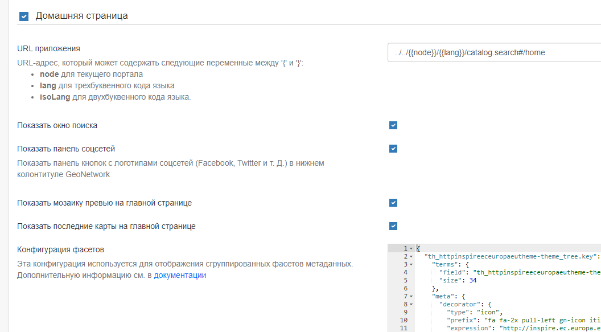

## Пошукавае прыкладанне

- **Прыкладанне для пошуку**: Усталюйце гэты сцяжок, каб вызначыць, ці адлюстроўваецца прыкладанне для пошуку на верхняй панэлі інструментаў. 
  Калі ён не ўсталяваны, спасылка не адлюстроўваецца.
- **URL прыкладання**: Укажыце URL для прыкладання для пошуку. У большасці выпадкаў гэта значэнне можна пакінуць па змаўчанні.
- **Колькасць запісаў на старонцы**: Укажыце параметры для вызначэння колькасці запісаў, якія адлюстроўваюцца на старонцы вынікаў, і значэння па змаўчанні.
- **Базавы запыт**: Задайце фільтр па змаўчанні для пошуку.

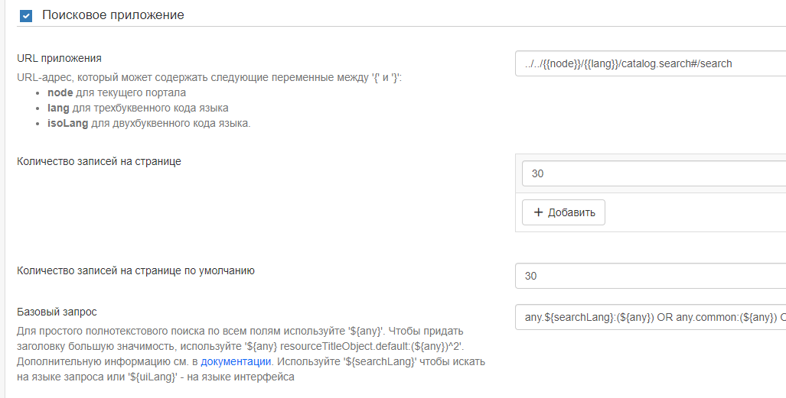

- **Фасетны фільтр для адлюстравання з дапамогай укладак**: Гэта опцыя стварае ўкладку для кожнага наладжанага фасета над вынікамі пошуку. 
  Гэта можа быць выкарыстана для далейшага звужэння вынікаў пошуку. 
  Спіс назваў фасетаў можна знайсці па адрасе <https://github.com/geonetwork/core-geonetwork/blob/master/web/src/main/webapp/WEB-INF/config-summary.xml#L82>. 
  Напрыклад, каб уключыць фільтр тэматычных катэгорый над вынікамі пошуку, адміністратар павінен дадаць "topicCat" у якасці поля для адлюстравання аспекта.

- **Канфігурацыя фасетаў**: Вызначае набор фасетаў пошуку, якія павінны быць бачныя на старонцы пошуку. 
  Па змаўчанні выкарыстоўваецца "падрабязнасці", але можна выкарыстоўваць "менеджар" для адлюстравання фасетаў, якія часцей за ўсё выкарыстоўваюцца на старонцы рэдактара.

- **Фільтры**: Вызначаюць дадатковыя крытэрыі пошуку, якія дадаюцца да ўсіх пошукавых запытаў 
  і зноў выкарыстоўваюцца ў асноўным для знешніх прыкладанняў і падпарталаў.

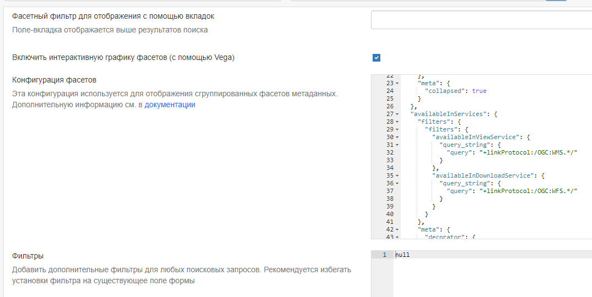

- **Варыянты сартавання**: Вызначае розныя спосабы, з дапамогай якіх карыстальнік можа сартаваць набор вынікаў пошуку. 
  Ніжэй прыведзены параметр сартавання па змаўчанні. Звярніце ўвагу, што для пошуку, напрыклад, па "назве" ў алфавітным парадку 
  неабходна ўсталяваць парадак "у адваротным парадку".

- **Шаблоны вынікаў пошуку**: Гэта наладка дазваляе адміністратару наладжваць шаблоны для афармлення вынікаў пошуку. 
  Па змаўчанні выкарыстоўваецца "Grid", у той час як для панэлі рэдагавання выкарыстоўваецца "List".

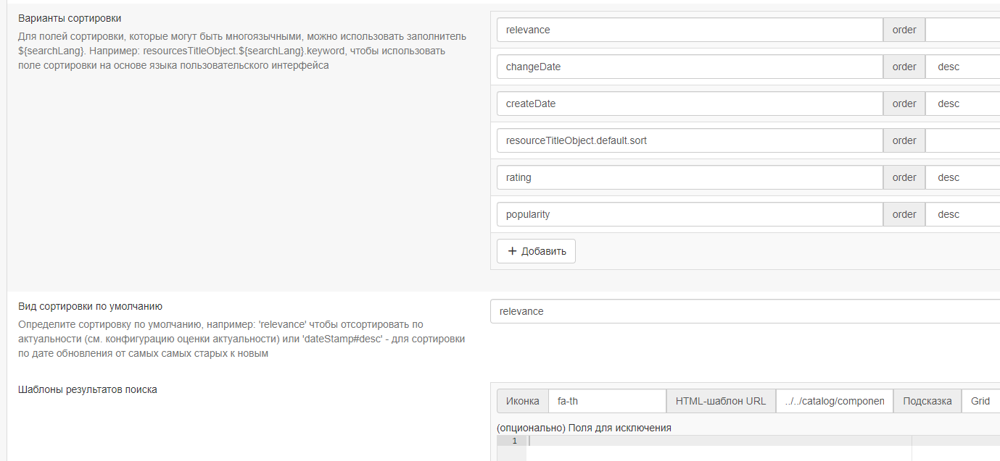

- **Шаблон выніку пошуку па змаўчанні**: Вызначае старонку шаблона для пошуку. Як правіла, гэта можна пакінуць па змаўчанні.
- **Спіс formatter'аў для экспарту запісаў**: Вызначае фарматаванне, якое выкарыстоўваецца для адлюстравання вынікаў пошуку. 
  Глядзіце [Наладка праглядаў метаданых](../../customizing-application/creating-custom-view.md) для атрымання інфармацыі 
  пра стварэнне новага сродку фарматавання. Каб дадаць дадатковы прагляд, націсніце сінюю кнопку "+" пад спісам і ўкажыце назву і URL-адрас.

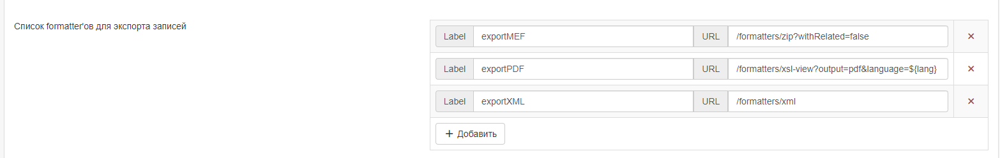

### Наладка вынікаў пошуку

- **Адпаведныя тыпы метаданых запыту**: Выкарыстоўвайце гэты раздзел для вызначэння тыпаў метаданых, якія адлюстроўваюцца пры адлюстраванні вынікаў пошуку ў табліцы. 
  Фармат для дадання дадатковых тыпаў націсніце сінюю кнопку `+`. Магчымыя тыпы ўказаны пад формай.

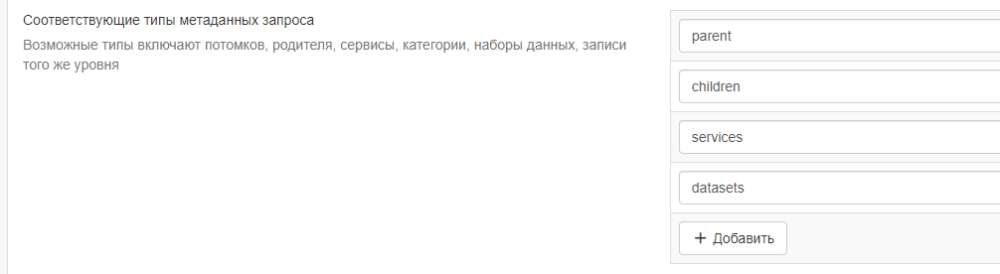

### Спіс тыпаў спасылак

- **Спасылкі**: У гэтым раздзеле вызначаюцца тыпы спасылак, якія адлюстроўваюцца пры адлюстраванні вынікаў пошуку ў фармаце табліцы. 
  Яны падзелены на "спасылкі" (links), "спампоўкі" (downloads), "слаі" (layers) і "карты" (maps), і для кожнага тыпу можна дадаць новы запіс, 
  націснуўшы сінюю кнопку "+" пад спісам.

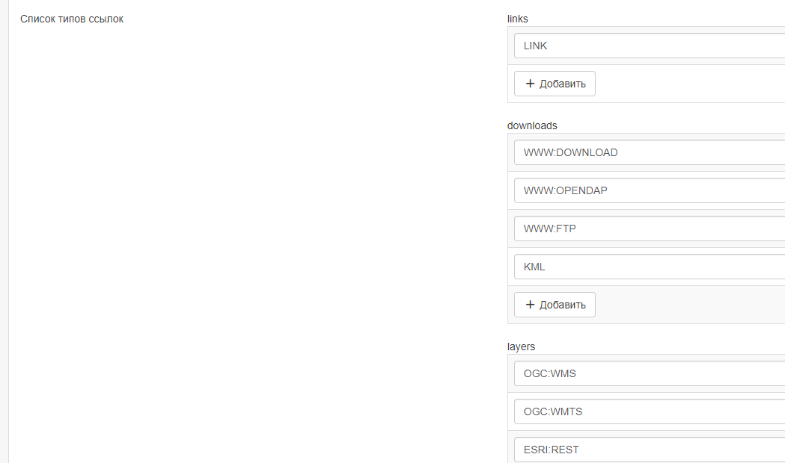

- **Адлюстроўваць тэгі фільтраў у выніках пошуку**: Калі сцяжок усталяваны, тэгі фільтраў адлюстроўваюцца над вынікамі пошуку. Па змаўчанні яны не адлюстроўваюцца.

### Карыстальніцкі пошук

- **Уключана**: Калі гэты сцяжок усталяваны, карыстальнік зможа ствараць і захоўваць карыстальніцкія пошукавыя запыты на ўкладцы "Пошук". 
  Гэта функцыя будзе адлюстроўвацца над спісам аспектаў злева.

- **Адлюстраванне панэлі папулярных пошукаў на галоўнай старонцы**: 
  Калі гэтая функцыя таксама ўключана, на хатняй старонцы будзе адлюстроўвацца дадатковая ўкладка побач з "Апошнімі навінамі" і "Найбольш папулярнымі".

### Захаваныя выбаркі

- **Уключана**: Калі сцяжок усталяваны, у карыстальніка будзе магчымасць захоўваць выбраныя запісы на ўкладцы пошуку.

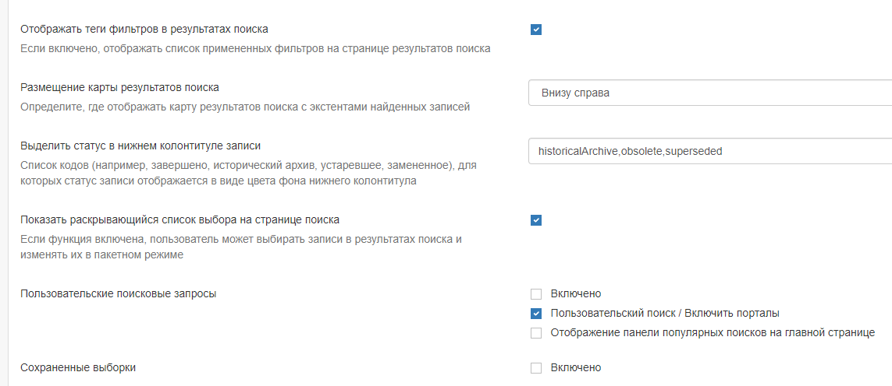


## Картаграфічнае прыкладанне

У гэтым раздзеле апісваецца, як адміністратар можа наладзіць розныя карты ў карыстальніцкім інтэрфейсе: 
асноўную карту, міні-карту, якая адлюстроўваецца на старонцы вынікаў пошуку, і карту, якая выкарыстоўваецца ў рэдактары для пабудовы экстэнту.

- **Картаграфічнае прыкладанне**: Пачатковы сцяжок дазваляе адключыць асноўную ўкладку "Карта". 
  У гэтым выпадку ўкладка "карта" не будзе адлюстроўвацца на верхняй панэлі інструментаў, але міні-карта і карта-экстэнт, апісаныя вышэй, па-ранейшаму будуць бачныя.
- **URL прыкладання**: Вызначае URL-адрас для ўкладкі "Карта". У большасці выпадкаў гэта значэнне можна пакінуць па змаўчанні.

### Знешні праглядчык

- **Выкарыстоўваць знешні праглядчык**: Гэты параметр дазваляе выкарыстоўваць іншае картаграфічнае прыкладанне замест карты Геасеткі па змаўчанні. 
  У гэтым выпадку большасць прыведзеных ніжэй наладак больш выкарыстоўвацца не будуць.

- **Дазволіць 3D-рэжым**: Калі ён уключаны, у карыстальніка ёсць магчымасць пераключыцца ў 3D-рэжым на галоўнай карце 
  (гл. [Хуткі запуск] (../../user-guide/quick-start/index.md)).

- **Дазволіць карыстальнікам захоўваць карты як запіс метаданых**: Гэта опцыя дазваляе карыстальнікам захоўваць слаі 
  і канфігурацыю базавых карт у выглядзе запісаў у каталогу. Пры жаданні карыстальнікі могуць дадаць назву і анатацыю.

- **Экспарт карты як выявы**: Калі гэтая опцыя ўключана, карыстальнікі могуць экспартаваць карту ў выглядзе выявы, 
  але для любых знешніх сэрвісаў WMS, якія адлюстроўваюцца на карце, патрабуецца ўключыць CORS. Па змаўчанні гэтая опцыя адключана, каб пазбегнуць праблем са слаямі WMS.

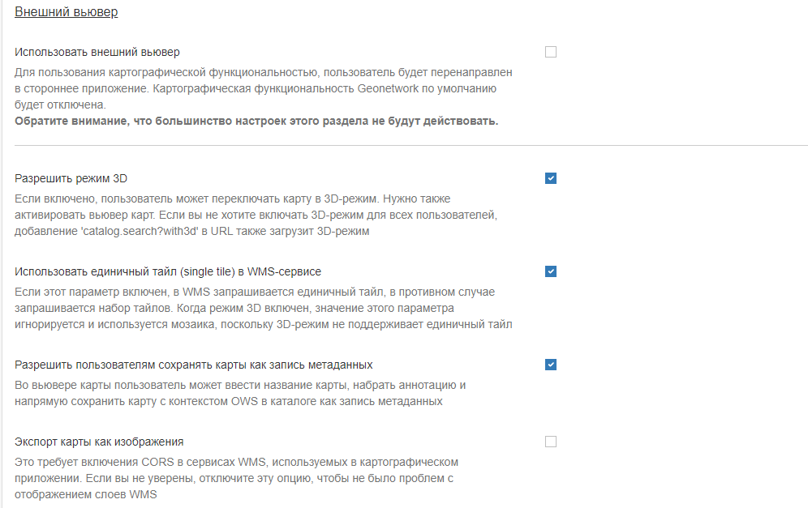

- **Захоўванне пераваг карыстальніка**: Гэты параметр вызначае паводзіны файлаў cookie, звязаных з картай. Ніжэй пералічаны розныя параметры.
- **Ключ Bing Map**: Калі гэты параметр зададзены, то можна выкарыстоўваць карты Bing у якасці базавых слаёў у картаграфічным прыкладанні. 
  Каб гэта спрацавала, вы павінны атрымаць свой уласны ключ.

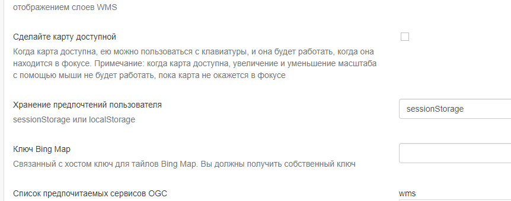

### Спіс пераважных службаў OGC

Тут можна вызначыць службы па змаўчанні **wms** і **wmts**, якія будуць даступныя канчатковаму карыстальніку па змаўчанні. 
Новыя службы можна дадаць, націснуўшы сінюю кнопку `+` пад спісам пратаколаў.

Вы можаце наладзіць для кожнай карты розныя слаі і праекцыі.

- **Праекцыя карты** Гэта праекцыя карты па змаўчанні. Пераканайцеся, што праекцыя вызначана ў **Праекцыі для адлюстравання карт**, прыведзеным ніжэй.

- **Спіс праекцый карты для адлюстравання абмежавальных рамак**: Выкарыстоўваецца на карце пры рэдагаванні запісу 
  і вызначэнні экстэнту абмежавальнага прамавугольніка. Звярніце ўвагу, што каардынаты будуць захаваны ў WGS84 незалежна ад таго, 
  якая праекцыя выкарыстоўвалася для іх адлюстравання.

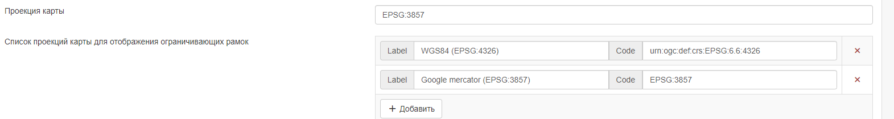

- **Праекцыі для адлюстравання карт**: Тут вызначаюцца розныя праекцыі, даступныя для карты. 
  Усе праекцыі будуць адлюстроўвацца ў інструменце `Пераключальнік праекцый` карты.

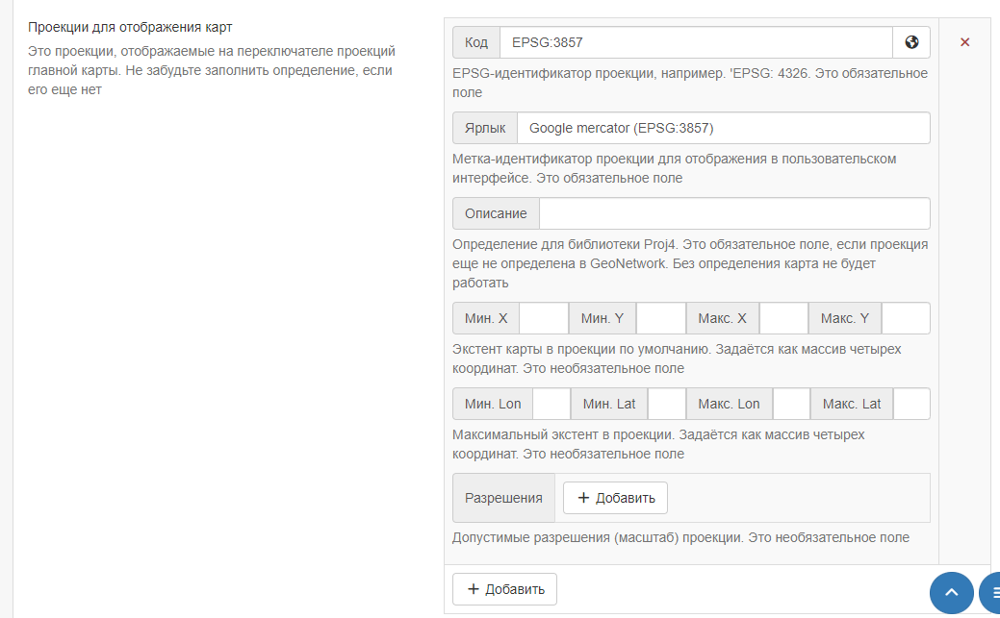

Каб уключыць новую праекцыю, яе неабходна вызначыць тут, выкарыстоўваючы сінтаксіс **proj4js**, 
які можна знайсці па адрасе <https://proj4js.io>. Дадаткова можна вызначыць памер абмежавальнага прамавугольніка па змаўчанні, 
максімальны памер абмежавальнага прамавугольніка і дапушчальныя раздзяляльнасці (калі патрабуецца).

Пераканайцеся, што ўведзеныя каардынаты ўказаны ў правільных адзінках вымярэння і з'яўляюцца лакальнымі для праекцыі. 
Спіс раздзяляльнасцей актуальны толькі ў тым выпадку, калі асноўны слой карты мае крыніцу XYZ, якая не адпавядае агульнапрынятаму шаблону лістоў.

Праверце правільнасць гэтай канфігурацыі, адкрыўшы карту.

!!! info "Заўвага"

    Калі канфігурацыя праекцыі з'яўляецца няпоўнай або няправільнай, карта можа не загрузіцца.

Калі вызначана праекцыя, якая не падтрымліваецца крыніцай картаграфічнага слоя, 
картаграфічнае прыкладанне перапраектуе выявы карты на баку кліента. 
Гэта можа прывесці да нечаканых паводзін, напрыклад, да павароту або скажэння надпісаў.

- **Дадатковыя інструменты праглядчыка карт**: Сцяжкі ў гэтым раздзеле вызначаюць інструменты, даступныя карыстальніку на правай панэлі інструментаў галоўнай карты. 
  Элементы, якія не адзначаны, не адлюстроўваюцца.

- **Сэрвіс OGC для выкарыстання ў якасці сеткі**: Гэта неабавязкова і дазваляе выкарыстоўваць знешнюю службу для адлюстравання сеткі на карце.

### Параметры праглядчыка карт

Гэты раздзел прызначаны для наладкі карты, якая адлюстроўваецца пры праглядзе запісу.

- **Шлях да XML-файла кантэксту**: Неабавязковы шлях да XML-файла, які вызначае базавыя слаі і іншыя параметры канфігурацыі. 
  Прыклад глядзіце ў раздзеле `web/src/main/webapp/WEB-INF/data/data/resources/map/config-viewer.xml`.

- **Экстэнт у бягучай праекцыі**: Выкарыстоўвайце гэтую опцыю, каб перавызначыць экстэнт, вызначаны ў кантэкстным файле.

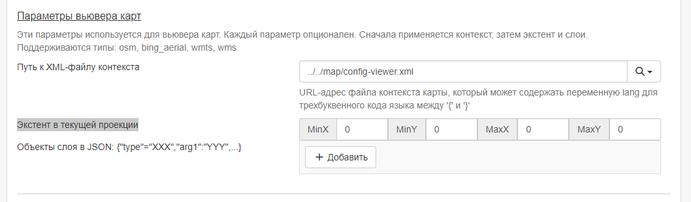

- **Аб'екты слаёў у JSON**: Вызначаюць дадатковыя слаі, якія будуць адлюстроўвацца на карце, выкарыстоўваючы сінтаксіс JSON. Падтрымліваюцца тыпы:
    - **wms**: агульны слой WMS, абавязковыя ўласцівасці: `назва, URL`.
    - **wmts**: агульны слой WMTS, абавязковыя ўласцівасці: "назва, url".
    - **tms**: агульны слой TMS, абавязковая ўласцівасць: `url`.
    - **osm**: слой OpenStreetMap па змаўчанні, ніякіх іншых уласцівасцей не патрабуецца.
    - **stamen**: Слаі з тычынкамі, абавязковая ўласцівасць: "назва".
    - **bing_aerial**: фон з паветранымі выявамі Bing, абавязковая ўласцівасць: "ключ", які змяшчае ліцэнзійны ключ.

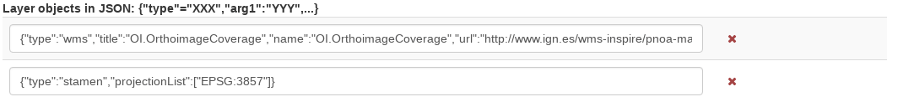

Усе слаі таксама могуць мець некаторыя неабавязковыя дадатковыя ўласцівасці:

- **загаловак** Загаловак/метка слоя.
- **ProjectionList** Масіў праекцый, які дазваляе абмежаваць гэты слой пэўнымі праекцыямі на карце.

Прыклады слаёў:

У гэтым слоі будзе выкарыстоўвацца стыль OpenStreetMap Stamen, але толькі калі карта знаходзіцца ў фармаце `EPSG:3857`:

``` json
{"type":"stamen","projectionList":["EPSG:3857"]}
```

Гэты WMS-слой будзе паказаны, але толькі калі на карце пазначаны `EPSG:4326`:

``` json
{"type":"wms","title":"OI.OrthoimageCoverage","name":"OI.OrthoimageCoverage",
"url":"http://www.ign.es/wms-inspire/pnoa-ma?request=GetCapabilities&service=WMS",
"projectionList":["EPSG:4326"]}
```

### Параметры карты пошуку

У гэтым раздзеле вызначаецца канфігурацыя міні-карты, якая адлюстроўваецца на старонцы пошуку. 
У ёй выкарыстоўваюцца тыя ж параметры, што і ў [Наладка карты прагляду](user-interface-configuration.md).

### Наладка карты рэдактара

У гэтым раздзеле вызначаецца канфігурацыя карты, якая адлюстроўваецца пры рэдагаванні запісу. 
У ім выкарыстоўваюцца тыя ж параметры, што і ў [Наладка карты для прагляду](user-interface-configuration.md).

## Газетыр (геаграфічны даведнік)

- **Газетыр**: Калі ён уключаны, геаграфічны даведнік будзе адлюстроўвацца ў левым верхнім куце галоўнай карты.
- **URL прыкладання**: Укажыце URL прыкладання, які выкарыстоўваецца для даведніка. 
  У агульным выпадку, гэта варта пакінуць па змаўчанні, але можна прымяніць дадатковую фільтрацыю, 
  выкарыстоўваючы сінтаксіс, апісаны ў <https://www.geonames.org/export/geonames-search.html>, 
  напрыклад, для абмежавання вынікаў па канкрэтнай краіне (`country=FR`).

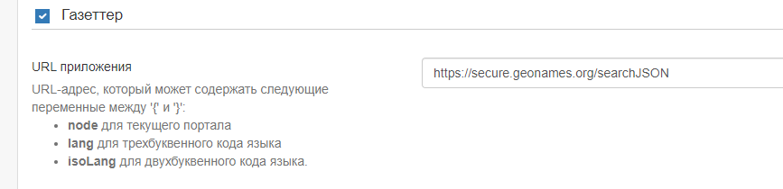

## Прагляд запісаў

- **Паказваць панэль сацыяльных сетак**: Калі ўключана функцыя, 
  у рэжыме прагляду запісаў адлюстроўваецца панэль сацыяльных сетак (спасылкі на facebook, Twitter і г.д.).

## Прыкладанне-рэдактар

- **Прыкладанне рэдактара**: Калі яно ўключана, старонка "Рэдактар" або ўкладка "Удзел" даступныя карыстальнікам з адпаведнымі прывілеямі. 
  Калі не ўключана, укладка "Удзел" не адлюстроўваецца на верхняй панэлі інструментаў.

- **URL прыкладання**: Гэта URL-адрас прыкладання editor, які звычайна можна пакінуць па змаўчанні.

- **Толькі мае запісы**: Калі гэты сцяжок усталяваны, то сцяжок "Толькі мае запісы" на панэлі інструментаў рэдактара будзе ўсталяваны па змаўчанні.

- **Адлюстроўваць тэгі фільтраў у панэлі**: Калі ўключана, выбраныя ў дадзены момант фасеты будуць адлюстроўвацца над вынікамі пошуку 
  як на панэлі інструментаў рэдактара, так і на старонцы пакетнага рэдактара.

- **Кантэйнер старонкі Рэдактар**: Калі ўключана, прыкладанне editor будзе мець поўнапамерны кантэйнер. 
  Калі гэты параметр адключаны, ён будзе мець фіксаваную шырыню і цэнтраваны кантэйнер.

- **Арыентацыя старонкі**: Выберыце адзін з варыянтаў макета старонкі `дадаць новыя метаданыя`. 
  Па змаўчанні выкарыстоўваецца "Гарызантальны", але можна выбраць вертыкальны макет або карыстальніцкі макет на аснове прадастаўленага шаблона.

- **Абзац старонкі рэдактара**: Выберыце адзін з варыянтаў стылю водступу пры рэдагаванні запісу. 
  Па змаўчанні выкарыстоўваюцца мінімальныя водступы.

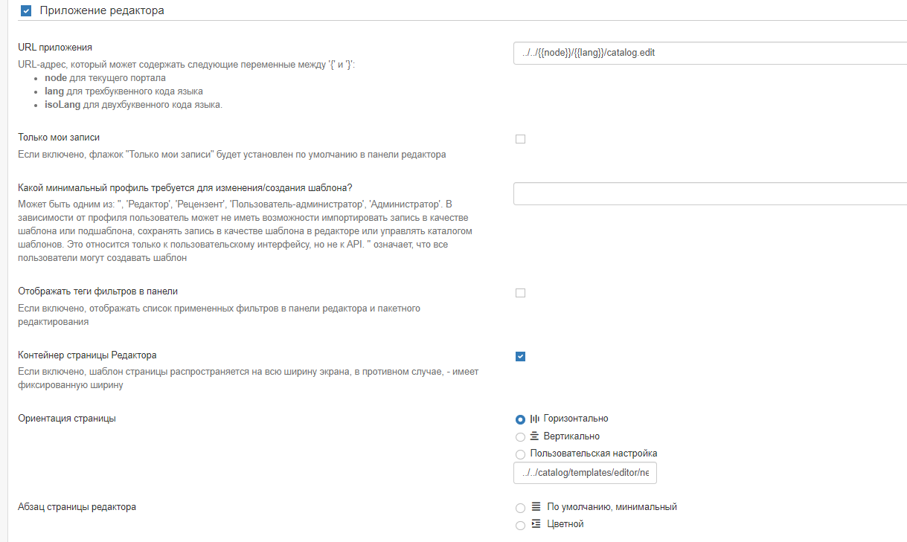

## Кансоль адміністратара

- **Кансоль адміністратара**:
- **URL прыкладання**: Задайце URL прыкладання для кансолі адміністратара. Увогуле, гэта варта пакінуць па змаўчанні.
- **Канфігурацыя фасетаў**: Гэта канфігурацыя выкарыстоўваецца для адлюстравання згрупаваных фасетаў метаданых. 

## Аўтэнтыфікацыя

- **Аўтэнтыфікацыя**:
- **URL-адрас прыкладання для ўваходу ў каталог**: Укажыце URL прыкладання для старонкі ўваходу. У цэлым, гэта значэнне варта пакінуць па змаўчанні.
- **URL-адрас прыкладання для выхаду з каталога**: Укажыце URL прыкладання для выхаду з сістэмы. Як правіла, гэта значэнне варта пакінуць па змаўчанні.

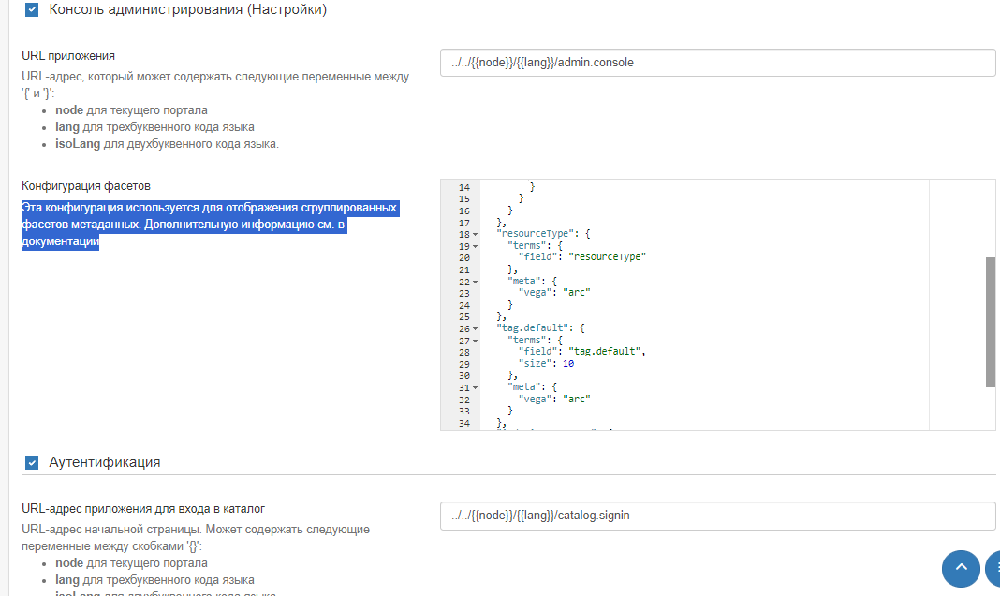