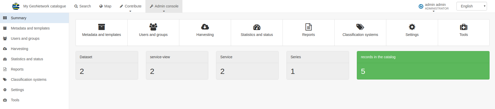

# Кіраўніцтва для адміністратараў

-   [Канфігурацыя каталога](configuring-the-catalog/index.md)
-   [Кіраванне тыпамі карыстальнікаў і групамі](managing-users-and-groups/index.md)
-   [Кіраванне сістэмамі класіфікацый](managing-classification-systems/index.md)
-   [Кіраванне метаданымі і шаблонамі](managing-metadata-standards/index.md)

Усе функцыі адміністратара даступныя ў `Панэлі адміністратара` ў галоўным меню.
