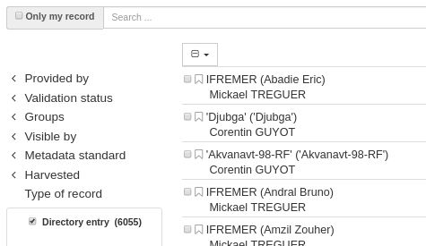
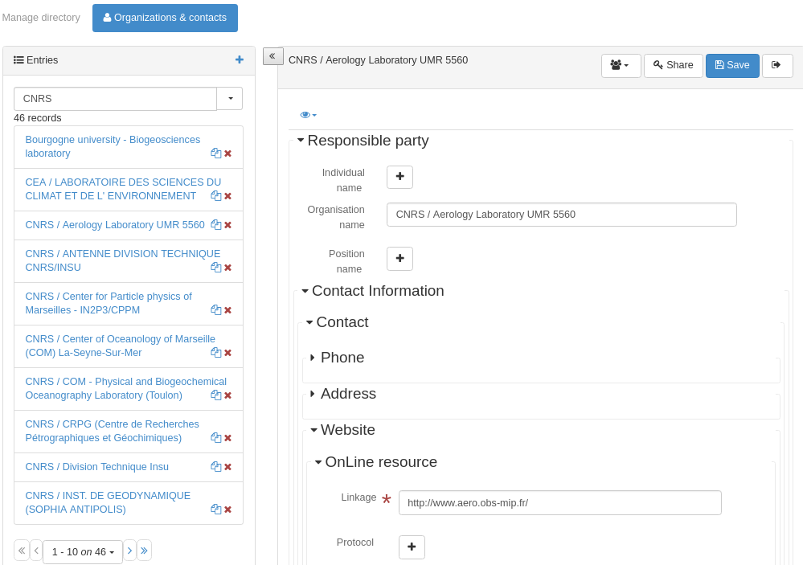
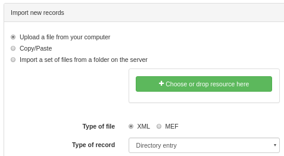
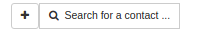
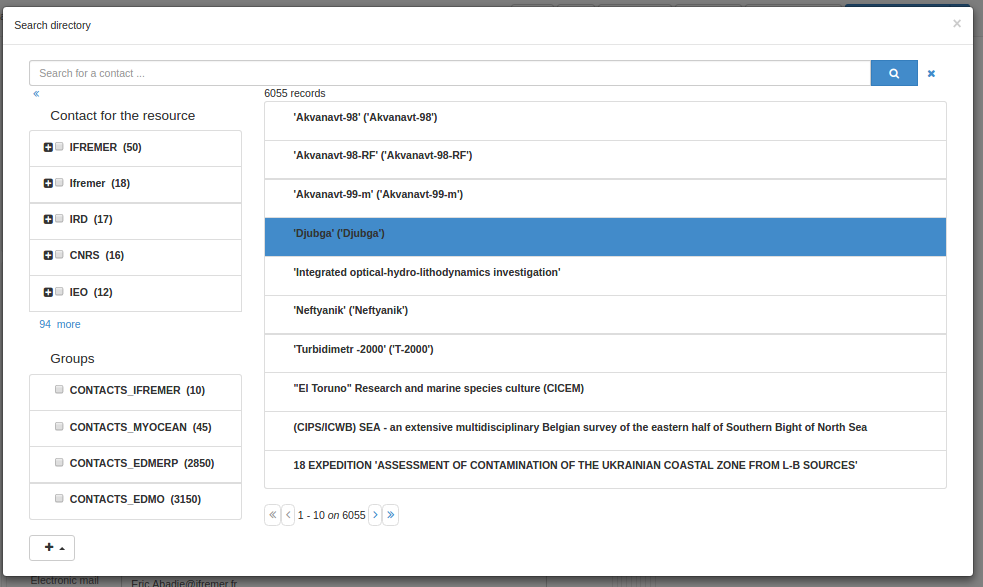
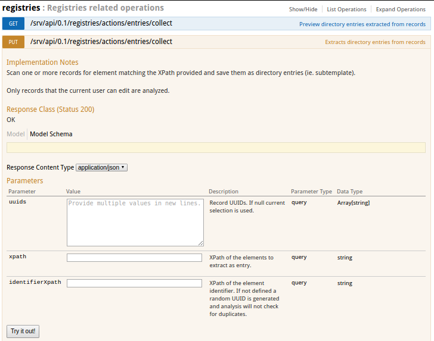
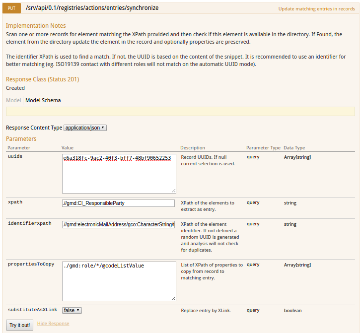
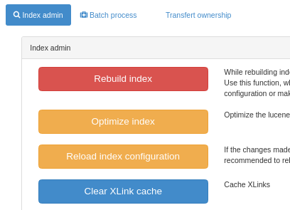

# Кіраванне падшаблонамі

Каталог падтрымлівае запісы метаданых, якія складаюцца з фрагментаў метаданых. 
Ідэя заключаецца ў тым, што фрагменты метаданых могуць выкарыстоўвацца больш чым у адным запісе метаданых.

Вось тыповы прыклад фрагмента. Гэта адказны бок, і ён можа выкарыстоўвацца ў адным і 
тым жа запісе метаданых больш за адзін раз ці ў некалькіх запісах метаданых, калі гэта дастасавальна.

``` xml
<gmd:CI_ResponsibleParty xmlns:gmd="http://www.isotc211.org/2005/gmd" xmlns:gco="http://www.isotc211.org/2005/gco">
  <gmd:individualName>
    <gco:CharacterString>John D'Ath</gco:CharacterString>
  </gmd:individualName>
  <gmd:organisationName>
    <gco:CharacterString>Mulligan &amp; Sons, Funeral Directors</gco:CharacterString>
  </gmd:organisationName>
  <gmd:positionName>
    <gco:CharacterString>Undertaker</gco:CharacterString>
  </gmd:positionName>
  <gmd:role>
    <gmd:CI_RoleCode codeList="./resources/codeList.xml#CI_RoleCode" codeListValue="pointOfContact"/>
  </gmd:role>
</gmd:CI_ResponsibleParty>
```

Фрагменты метаданых, якія захоўваюцца ў базе даных каталога, называюцца **падшаблонамі**. 
У асноўным гэта робіцца па гістарычных прычынах, бо падшаблон падобны да шаблоннага запісу метаданых, 
паколькі ён можа быць выкарыстаны ў якасці «шаблона» для стварэння новага запісу метаданых.

Фрагменты могуць быць устаўленыя ў запіс метаданых двума спосабамі:

- капіраваннем/устаўкай
- па спасылцы (калі ўключана падтрымка xlink. Гл. [Metadata XLink](../configuring-the-catalog/system-configuration.md#xlink_config)).

Пры выкарыстанні XLinks, калі фрагмент абнаўляецца, то звязаны з ім фрагмент ва ўсіх запісах метаданых таксама будзе абноўлены (праверце кэш XLink).

Фрагменты могуць быць створаны шляхам збору 
(гл. [Збор фрагментаў метаданых для падтрымкі паўторнага выкарыстання](../../user-guide/harvesting/index.md#збор-фрагментаў-метаданых-для-паўторнага-выкарыстання)) 
або імпартаваны з дапамогай старонкі імпарту метаданых.

У гэтым раздзеле кіраўніцтва апісана:

- як кіраваць каталогамі падшаблонаў
- як вымаць фрагменты з існуючага набору запісаў метаданых і захоўваць іх у выглядзе падшаблонаў
- як кіраваць кэшам фрагментаў, які выкарыстоўваецца для паскарэння доступу да фрагментаў, якіх няма ў лакальным каталогу

## Кіраванне каталогамі падшаблонаў

Існуюць некаторыя адрозненні паміж працай з падшаблонамі і запісамі метаданых. 
У адрозненне ад запісаў метаданых, падшаблоны не маюць узгодненага каранёвага элемента, 
схема метаданых, якую яны выкарыстоўваюць, можа быць нераспазнавальнай, яны не з'яўляюцца ў асноўных выніках пошуку 
(калі толькі не з'яўляюцца часткай запісу метаданых). Таму панэль рэдактара дазваляе шукаць і кіраваць прывілеямі для запісаў каталогаў.



На панэлі рэдактара выберыце `Кіраванне каталогам`, каб атрымаць доступ да рэдактара запісаў каталога:



Калі ўкладку `Арганізацыі і кантакты` не відаць, пераканайцеся, што былі створаны падшаблоны для кантактаў для свайго профілю метаданых 
і былі загружаны іх з дапамогай раздзела `Метаданыя і шаблоны`.

На гэтай старонцы рэдактары могуць выбраць тып каталога з дапамогай верхніх укладак, рэдагаваць/выдаляць/імпартаваць новыя падшаблоны.

Для імпарту новых запісаў выкарыстоўвайце старонку імпарту метаданых і выберыце адпаведны тып запісу:



Як і запісам метаданых, ім прысвойваецца цэлалікавы ідэнтыфікатар, і яны захоўваюцца ў табліцы метаданых каталога (з полем шаблона, усталяваным на «y»).
## Устаўце запіс каталога ў запіс метаданых

У рэдактары метаданых каталог можна выкарыстоўваць, напрыклад, для запаўнення кантактаў.



Адкрыйце селектар каталогаў, выберыце кантакт, а затым выберыце ролю кантакту.



## Выманне ўкладзеных шаблонаў з запісаў метаданых

На многіх сайтах ужо існуюць запісы метаданых з агульнай інфармацыяй, напрыклад, кантактная інфармацыя ў элеменце ISO CI_Contact. 
Запісы каталога, падобныя да гэтых, могуць быць вынятыя з выбранага набору запісаў метаданых з дапамогай API "Extract subtemplates".

Каб выкарыстоўваць гэтую функцыю, неабходна выканаць наступны набор дзеянняў:

- Пераканайцеся, што вы разумееце, што такое XPath - глядзіце, напрыклад, <http://www.w3schools.com/xpath/default.asp>.
- Вызначыць фрагменты метаданых, якімі яны хацелі б кіраваць як падтэмплатамі паўторнага выкарыстання ў запісе метаданых. 
  Гэта можна зрабіць з дапамогай XPath. напрыклад, XPath `.//gmd:CI_ResponsibleParty` вызначае ўвесь адказны бок у запісе. 
  Прыклад такога фрагмента (узятага з аднаго з выбарачных запісаў) паказаны ў наступным прыкладзе:

``` xml
<gmd:CI_ResponsibleParty xmlns:gmd="http://www.isotc211.org/2005/gmd" xmlns:gco="http://www.isotc211.org/2005/gco">
   <gmd:individualName>
      <gco:CharacterString>Jippe Hoogeveen</gco:CharacterString>
   </gmd:individualName>
   <gmd:organisationName>
      <gco:CharacterString>FAO - NRCW</gco:CharacterString>
   </gmd:organisationName>
   <gmd:positionName>
      <gco:CharacterString>Technical Officer</gco:CharacterString>
   </gmd:positionName>
   <gmd:contactInfo>
      <gmd:CI_Contact>
         <gmd:phone>
            <gmd:CI_Telephone>
               <gmd:voice gco:nilReason="missing">
                  <gco:CharacterString/>
               </gmd:voice>
               <gmd:facsimile gco:nilReason="missing">
                  <gco:CharacterString/>
               </gmd:facsimile>
            </gmd:CI_Telephone>
         </gmd:phone>
         <gmd:address>
            <gmd:CI_Address>
               <gmd:deliveryPoint>
                  <gco:CharacterString>Viale delle Terme di Caracalla</gco:CharacterString>
               </gmd:deliveryPoint>
               <gmd:city>
                  <gco:CharacterString>Rome</gco:CharacterString>
               </gmd:city>
               <gmd:administrativeArea gco:nilReason="missing">
                  <gco:CharacterString/>
               </gmd:administrativeArea>
               <gmd:postalCode>
                  <gco:CharacterString>00153</gco:CharacterString>
               </gmd:postalCode>
               <gmd:country>
                  <gco:CharacterString>Italy</gco:CharacterString>
               </gmd:country>
               <gmd:electronicMailAddress>
                  <gco:CharacterString>jippe.hoogeveen@fao.org</gco:CharacterString>
               </gmd:electronicMailAddress>
            </gmd:CI_Address>
         </gmd:address>
      </gmd:CI_Contact>
   </gmd:contactInfo>
   <gmd:role>
      <gmd:CI_RoleCode codeList="http://standards.iso.org/ittf/PubliclyAvailableStandards/ISO_19139_Schemas/resources/codelist/ML_gmxCodelists.xml#CI_RoleCode"
                       codeListValue="pointOfContact"/>
   </gmd:role>
</gmd:CI_ResponsibleParty>
```


- Вызначыце і запішыце XPath да поля або палёў фрагмента, тэкставае змесціва якіх будзе выкарыстоўвацца ў якасці ідэнтыфікатара падшаблона. 
  Гэты XPath павінен быць адносным да каранёвага элемента фрагмента, вызначанага на папярэднім кроку. 
  Напрыклад, у прыведзеным вышэй фрагменце мы можам выбраць `.//gmd:electronicMailAddress/gco:CharacterString/text()` 
  у якасці ідэнтыфікатара для ствараемых фрагментаў.

- На старонцы API выберыце аперацыю registries / collect:



- Запоўніце форму інфармацыяй, сабранай на папярэдніх кроках.
- Вынятыя падшаблоны можна папярэдне прагледзець з дапамогай рэжыму GET, а пасля праверкі выкарыстоўваць метад PUT для захавання вынікаў у каталогу.

Нарэшце, перайдзіце ў інтэрфейс кіравання каталогам падшаблонаў, 
і вы зможаце выбраць каранёвы элемент вашых падшаблонаў, каб прагледзець вынятыя падшаблоны.

Індэксаванне падшаблонаў заснавана на схеме (падрабязнасці гл. у папцы index-fields). 
У цяперашні час ISO19139 індэксуе падшаблоны, выкарыстоўваючы ў якасці каранёвага элемента:

- gmd:CI_ResponsibleParty
- gmd:MD_Distribution
- gmd:CI_OnlineResource
- gmd:EX_Extent

У стандарце ISO19115-3

- cit:CI_Responsibility
- *[mdq:result]
- gex:EX_Extent

Іншыя прыклады канфігурацыі для збору:

- Бакі ў ISO19115-3
    - `xpath`: `.//cit:CI_Responsibility`
    - `identifierXpath`: `.//cit:electronicMailAddress/*/text()`.
- Спецыфікацыі якасці ў стандарце ISO19115-3
    - `xpath`: `.//*[mdq:result]`
    - `identifierXpath`: `.//cit:title/*/text()`
- Экстэнт у ISO19115-3
    - `xpath`: `.//gex:EX_Extent`
    - `identifierXpath`: `concat(.//gex:westBoundLongitude/*/text(), ', ', .//gex:eastBoundLongitude/*/text(), ', ', .//gex:southBoundLatitude/*/text(), ', ', .//gex:northBoundLatitude/*/text())` або `gex:description/*/text()`.
- Абмежаванні ў ISO19115-3
    - `xpath`: `.//mri:resourceConstraints/*`


## Сінхранізацыя падшаблонаў з запісамі метаданых

Пасля стварэння каталог прадастаўляе магчымасць сінхранізаваць запісы метаданых з запісамі каталога. Для гэтага выкарыстоўвайце старонку тэсціравання API.

Працэс сінхранізацыі выкарыстоўвае тыя ж параметры, што і працэс збору, з двума дадатковымі аргументамі:

- `propertiesToCopy` для захавання некаторага элемента, які можа быць вызначаны ў фрагменце ў метаданых (напрыклад, роля кантакту)
- `substituteAsXLink`, каб указаць, ці варта выкарыстоўваць рэжым капіравання/устаўкі або рэжым XLink.



## Кіраванне кэшам фрагментаў

Калі запісы метаданых у вашым каталогу ўтрымліваюць фрагменты спасылак са знешніх сайтаў, 
каталог кэшуе гэтыя фрагменты пасля першага пошуку, каб паменшыць аб'ём сеткавага трафіку 
і паскорыць адлюстраванне запісаў метаданых у выніках пошуку.

Кэш апрацоўваецца аўтаматычна з дапамогай сістэмы кэшавання Java (JCS). JCS інтэлектуальна апрацоўвае вялікія кэшы, вызначаючы:

- вызначэння максімальнай колькасці кэшуемых аб'ектаў
- выкарыстання максімальна магчымага аб'ёму аператыўнай памяці перад пераходам на другаснае сховішча (дыск)
- забеспячэння пастаянства кэша: кэш захоўваецца на дыск пры завяршэнні працы вэб-прыкладання і аднаўляецца з дыска пры перазапуску.

Наладзіць параметры JCS у GeoNetwork можна з дапамогай файла канфігурацыі JCS у **INSTALL_DIR/web/geonetwork/WEB-INF/classes/cache.ccf**.

Некаторыя аперацыі ў каталогу (напрыклад, збор ураджаю), якія генеруюць фрагменты метаданых, 
будуць аўтаматычна абнаўляць кэш XLink пры генерацыі новага фрагмента. Аднак калі фрагменты будуць звязаныя са знешняга сайта, 
то, у залежнасці ад частаты змяненняў, прыйдзецца ўручную абнаўляць кэш XLink. 
Для гэтага неабходна перайсці на старонку адміністравання і выбраць функцыю «Ачысціць кэш XLink і перабудаваць індэкс запісаў з XLinks»,
як паказана на наступным скрыншоце старонкі «Адміністраванне».

