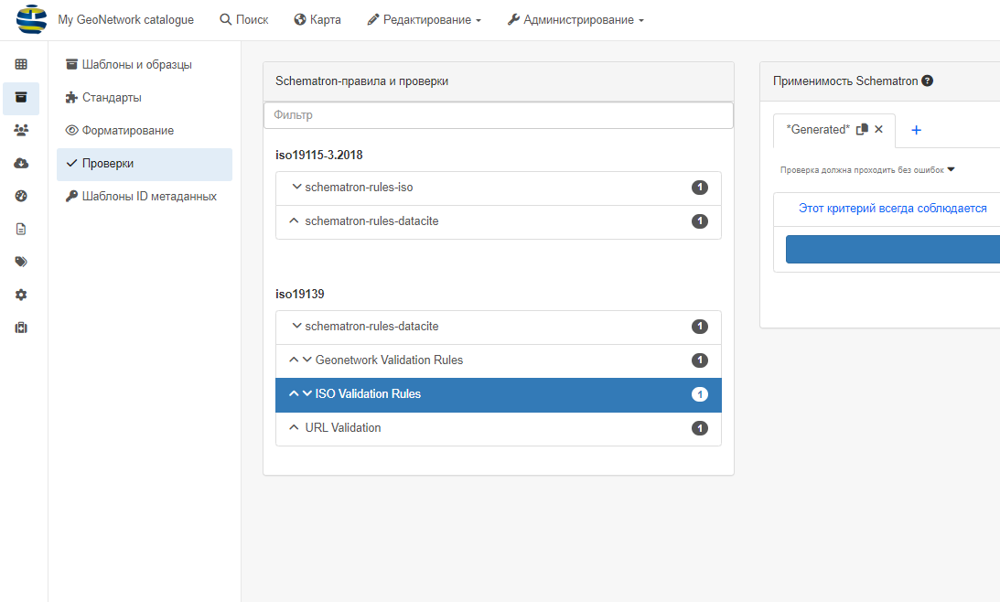
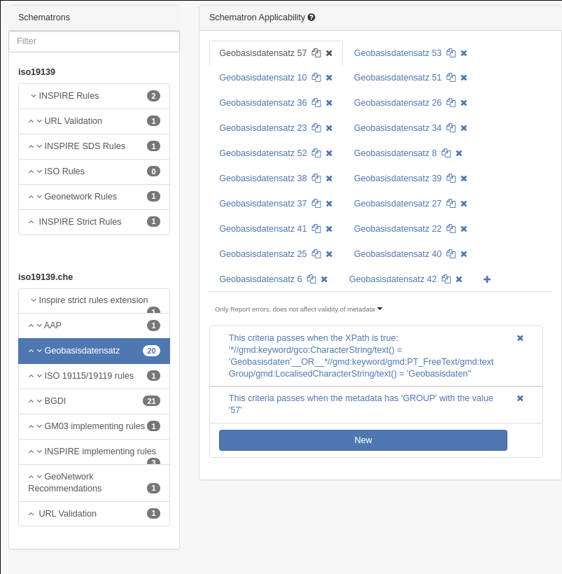

# Наладка ўзроўняў праверкі {#configure-validation}

Кожны стандарт вызначае ўзроўні праверкі. Перайдзіце ў `Адміністраванне` --> `Стандарты і шаблоны` --> `Праверкі`. 

Па змаўчанні ISO19139 прапануе праверку з выкарыстаннем:

- правілы ISO
- правілы INSPIRE (TG v1.3)
- Правілы GeoNetwork (толькі для шматмоўных запісаў)
- Праверка URL

Усе ўзроўні будуць прымяняцца па змаўчанні пры праверцы, а інтэрфейс адміністратара дазваляе наладжваць правілы:

- з'яўляецца абавязковым для праверкі (будзе адлюстроўвацца зялёным/чырвоным колерам у залежнасці ад статусу)
- толькі для інфармацыі (будзе адлюстроўвацца сінім колерам)
- ігнаруецца.

Таксама можна задаць умовы, каб прымяняць правілы толькі да пэўных запісаў. Умова можа быць вызначана на:

- XPath
- група
- Профіль карыстальніка
- Ключавое слова

Напрыклад, [geocat.ch](https://www.geocat.ch/) вызначае для профілю GM03 ISO19139 правілы ў залежнасці ад груп (г. зн. партнёраў) 
і тыпу набору даных, напрыклад, базавых геаданых.

