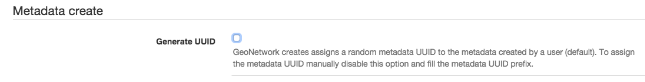
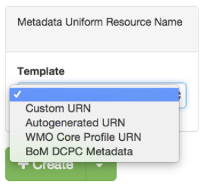
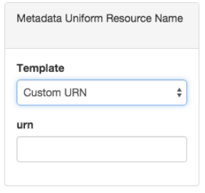
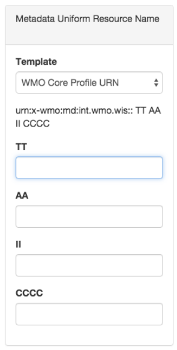
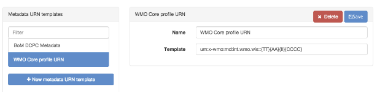

# Наладка ідэнтыфікатара метаданых {#metadata_identifier}

Некаторыя арганізацыі патрабуюць вызначэння ідэнтыфікатараў метаданых з дапамогай шаблонаў [URN](https://en.wikipedia.org/wiki/Uniform_Resource_Name).

У `кансолі адміністратара` --> `Метаданыя і шаблоны` --> `Шаблоны ID метаданых` карыстальнікі могуць наладзіць паводзіны каталога пры стварэнні новых метаданых:

- Ствараць выпадковы UUID. Гэта «стандартныя» паводзіны GeoNetwork, і яны ўстаноўлены па змаўчанні.
- Выкарыстоўваць шаблоны URN метаданых для вызначэння ідэнтыфікатараў метаданых. 
  Гэта опцыя дазваляе карыстальніку ўводзіць ідэнтыфікатар метаданых з шаблонаў метаданых URN, вызначаных карыстальнікам-адміністратарам.

Каб уключыць выкарыстанне шаблонаў URN метаданых для ідэнтыфікатараў метаданых, карыстальнік павінен адключыць наступную наладку:

Пасля ўключэння гэтай функцыі на старонцы стварэння метаданых з'явіцца новая панэль, якая дазваляе карыстальніку выбраць шаблон ідэнтыфікатара метаданых:

- Карыстальніцкі ідэнтыфікатар: Дазваляе карыстальніку ўвесці адвольнае тэкставае значэнне для ідэнтыфікатара метаданых.

- Аўтагенераваны ідэнтыфікатар: каталог стварае выпадковы UUID.
- Спіс карыстальніцкіх шаблонаў: Спіс шаблонаў ідэнтыфікатараў метаданых. 
  Калі карыстальнік выбірае адзін з гэтых шаблонаў, форма запытвае розныя значэнні шаблона.

Новыя шаблоны можна дадаць у інтэрфейсе канфігурацыі:

Для кожнага шаблона карыстальнік можа вызначыць некаторыя параметры для запаўнення формы стварэння метаданых. 
Параметры задаюцца паміж фігурнымі дужкамі. Напрыклад:

- <urn:x-wmo:md:int.wmo.wis>::{TT}{AA}{II}{CCCC}
- au.gov.bom::{IDCODE}