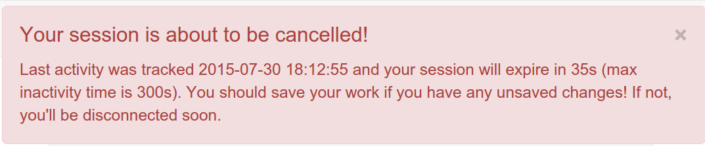
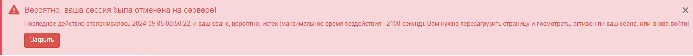

# Кіраванне карыстальнікамі і групамі

- [Стварэнне групы](creating-group.md)
- [Стварэнне карыстальніка](creating-user.md)
- [Самастойная рэгістрацыя карыстальніка](user-self-registration.md)
- [Рэжым аўтэнтыфікацыі](authentication-mode.md)

## Карыстальнік па змаўчанні 

Пасля ўстаноўкі будзе створаны карыстальнік па змаўчанні з імем "admin" і паролем "admin". 
Рэкамендуецца ўвайсці ў сістэму з гэтымі ўліковымі данымі непасрэдна пасля завяршэння ўстаноўкі і змяніць пароль па змаўчанні.

## Карыстальніцкая сесія

Пасля працэсу аўтэнтыфікацыі ствараецца карыстальніцкі сеанс. 
У нейкі момант сервер аўтаматычна закрые гэты сеанс з меркаванняў бяспекі. 
Час чакання сеансу па змаўчанні ўсталяваны роўным 35 хвілінам.

Калі ў браўзеры няма актыўнасці і сеанс падыходзіць да канца, за 3 хвіліны да заканчэння часу чакання побач з данымі карыстальніка адлюстроўваецца папярэджанне:

За 1 (адну) хвіліну да заканчэння часу чакання адлюстроўваецца іншае паведамленне:

Калі сеанс скончыўся, у паведамленні рэкамендуецца абнавіць старонку і пры неабходнасці зноў увайсці ў сістэму:

## Карыстальнікі, групы і ролі

У каталогу выкарыстоўваецца канцэпцыя карыстальнікаў, груп і профіляў карыстальнікаў.

- Карыстальнік можа быць членам адной або некалькіх **груп**.
- У карыстальніка ёсць **роля** ў Групе.
- Роля адміністратара не звязана з Групай.

Спалучэнне **ролі** і **групы** вызначае, якія задачы Карыстальнік можа выконваць у сістэме або з канкрэтнымі запісамі метаданых.

У карыстальнікаў могуць быць розныя ролі ў розных групах. Роля вызначае, якія задачы можа выконваць карыстальнік.

Ролі іерархічныя і заснаваны на спадчыннасці. Гэта азначае, што карыстальнік з профілем рэдактара можа ствараць 
і змяняць новыя запісы метаданых, а таксама выкарыстоўваць усе функцыі, даступныя зарэгістраванаму карыстальніку.

Правы, звязаныя з ролямі, падрабязна апісаны ў спісе ніжэй:

1. **Адміністратар (каталога)**

    Адміністратар каталога валодае асаблівымі прывілеямі, якія даюць права доступу да ўсіх даступных функцый.

    Да іх адносяцца:

    - Поўныя правы на стварэнне новых груп і новых карыстальнікаў.
    - Правы на змяненне профіляў карыстальнікаў/груп.
    - Поўныя правы на стварэнне/рэдагаванне/выдаленне новых/старых метаданых.
    - Выкананне задач сістэмнага адміністравання і наладкі.

2. **Карыстальнік-адміністратар (групы)**

    Карыстальнік-адміністратар з'яўляецца адміністратарам сваёй уласнай групы (груп) з наступнымі прывілеямі:

    - Поўныя правы на стварэнне новых карыстальнікаў у сваіх уласных групах.
    - Правы змяняць ролі карыстальнікаў у рамках іх уласных груп.

3. **Рэцэнзент**

    Рэцэнзент зместу з'яўляецца адзінай асобай, якой дазволена даваць канчатковы дазвол 
    на публікацыю метаданых ва ўнутранай сетцы і/або ў Інтэрнэце:

    - Правы на прагляд зместу метаданых у сваіх групах і дазвол на іх зацвярджэнне і публікацыю.

4. **Рэдактар**

    Рэдактар працуе з метаданымі з наступнымі прывілеямі:

    - Поўныя правы на стварэнне/рэдагаванне/выдаленне новых/старых даных у сваіх групах.

5. **Профіль зарэгістраванага карыстальніка**

    Зарэгістраваны карыстальнік мае больш правоў доступу, чым госць, які не прайшоў праверку сапраўднасці:

    - Права на загрузку абароненых даных.