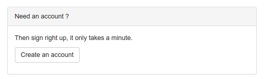
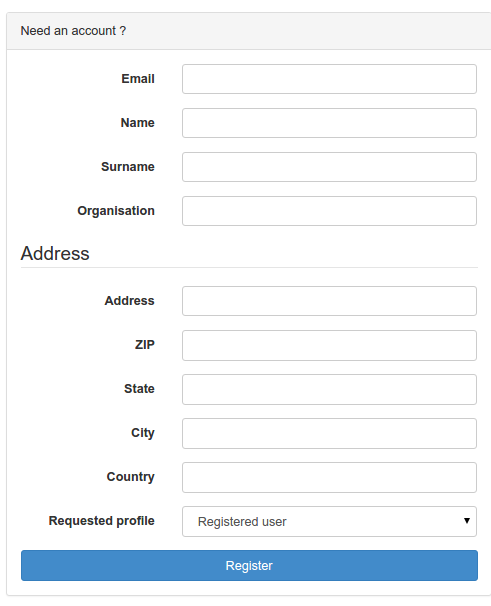

# Самастойная рэгістрацыя карыстальніка {#user_self_registration}

Каб уключыць функцыі самарэгістрацыі, гл. раздзел [Наладкі сістэмы](../configuring-the-catalog/system-configuration.md). 
Калі самарэгістрацыя ўключана, для карыстальнікаў, якія не ўвайшлі ў сістэму, на старонцы ўваходу ў сістэму адлюстроўваецца дадатковая спасылка:

Націсніце кнопку `Стварыць уліковы запіс` і запоўніце рэгістрацыйную форму:

Палі ў гэтай форме не патрабуюць тлумачэнняў, за выключэннем наступных:

- **Email**: Адрас электроннай пошты карыстальніка. Ён з'яўляецца абавязковым і будзе выкарыстоўвацца ў якасці імя карыстальніка.
- **Профіль**: Па змаўчанні самастойна зарэгістраваным карыстальнікам прысвойваецца профіль `Зарэгістраваны карыстальнік` (гл. папярэдні раздзел). 
  Калі абраны любы іншы профіль:
    - карыстальніку ўсё роўна будзе прысвоены профіль `Зарэгістраваны карыстальнік`
    - на адрас электроннай пошты, указаны ў раздзеле «Зваротная сувязь» меню «Адміністраванне сістэмы», 
      будзе адпраўлены ліст з паведамленнем пра запыт на больш прывілеяваны профіль
  
## Што адбываецца, калі карыстальнік самастойна рэгіструецца?

Калі адбываецца самарэгістрацыя карыстальніка, ён атрымлівае ліст з данымі новага ўліковага запісу, які выглядае прыкладна наступным чынам:

    Паважаны карыстальнік,

    Ваша рэгістрацыя на сайце The Greenhouse GeoNetwork прайшла паспяхова.

    Ваш уліковы запіс:
    імя карыстальніка : dubya.shrub@greenhouse.gov
    пароль : 0110O3
    група карыстальнікаў:    GUEST
    тып карыстальніка :    ЗАРЭГІСТРАВАНЫ КАРЫСТАЛЬНІК

    Вы паведамілі нам, што хочаце стаць «Рэдактарам», і ў бліжэйшы час з вамі звяжацца наш офіс.

    Каб увайсці ў сістэму і атрымаць доступ да свайго акаўнта, калі ласка, націсніце на спасылку ніжэй.
    http://greenhouse.gov/geonetwork

    Дзякуй за рэгістрацыю.

    Шчыра ваш,
    Каманда сайта The Greenhouse GeoNetwork

Звярніце ўвагу, што карыстальнік запытаў профіль «Рэдактар». У выніку на адрас электроннай пошты, 
указаны ў раздзеле Зваротная сувязь (гл. [Зваротная сувязь](../configuring-the-catalog/system-configuration.md#зваротная-сувязь)) 
меню `Адміністраванне сістэмы`, будзе адпраўлены ліст, які выглядае наступным чынам:

Звярніце ўвагу, што карыстальнік быў дададзены ва ўбудаваную групу карыстальнікаў 'GUEST'. 
Гэта абмежаванне бяспекі. Адміністратар/карыстальнік-адміністратар можа дадаць карыстальніка ў іншыя групы, калі гэта спатрэбіцца пазней.

Калі трэба змяніць змесціва гэтага ліста, вам варта мадыфікаваць `xslt/service/account/registration-pwd-email.xsl`.

    Паважаны адміністратар,

        Нядаўна зарэгістраваны карыстальнік dubya.shrub@greenhouse.gov запытаў доступ «Рэдактар» для:

        Instance:     The Greenhouse GeoNetwork Site
        Url: http://greenhouse.gov/geonetwork

        Рэгістрацыйныя даныя карыстальніка:

        Імя:         Дуб'я
        Прозвішча: Кустарнік
        Email: dubya.shrub@greenhouse.gov
        Арганізацыя: Цяпліца
        Тып: дзяржаўная арганізацыя
        Адрас:      146 Мэйн Авеню, Крэавіль
        Штат:        Канцылярскі
        Паштовы індэкс:    92373
        Краіна:      Міфічная

    Калі ласка, дзейнічайце.

    Сайт геасеткі «Цяпліца»

Калі трэба змяніць змесціва гэтага ліста, вам варта мадыфікаваць `xslt/service/account/registration-prof-email.xsl`.

## Функцыя «Забылі пароль?

Гэтая функцыя дазваляе карыстальнікам, якія забылі свой пароль, запытаць новы. Перайдзіце на старонку ўваходу ў сістэму, каб атрымаць доступ да формы:

У мэтах бяспекі толькі карыстальнікі, якія маюць профіль `Зарэгістраваны карыстальнік`, могуць запытаць новы пароль.

Калі карыстальнік скарыстаецца гэтай магчымасцю, ён атрымае ліст з прапановай змяніць пароль наступнага зместу:

    Вы запыталі змяненне пароля да сайта Greenhouse GeoNetwork.

    Вы можаце змяніць свой пароль, перайшоўшы па наступнай спасылцы:

    http://localhost:8080/geonetwork/srv/en/password.change.form?username=dubya.shrub@greenhouse.gov&changeKey=635d6c84ddda782a9b6ca9dda0f568b011bb7733

    Гэтая спасылка сапраўдная толькі сёння.

    Сайт GeoNetwork Greenhouse

Каталог згенераваў changeKey з забытага пароля і бягучай даты і адправіў яго карыстальніку ў выглядзе спасылкі на форму змянення пароля.

Калі трэба змяніць змесціва гэтага ліста, вам варта мадыфікаваць `xslt/service/account/password-forgotten-email.xsl`.

Калі карыстальнік націскае на спасылку, у яго браўзеры адлюстроўваецца форма змены пароля, у якую можна ўвесці новы пароль. 
Калі форма адпраўлена, changeKey рэгенеруецца і звяраецца з changeKey, указаным у спасылцы, і калі яны супадаюць, 
то пароль змяняецца на новы, указаны карыстальнікам.

Апошнім крокам у гэтым працэсе з'яўляецца адпраўка праверачнага ліста на адрас электроннай пошты карыстальніка, які пацвярджае, што змена пароля адбылася:

    Ваш пароль да сайта Greenhouse GeoNetwork быў зменены.

    Калі вы не змянілі гэты пароль, звярніцеся ў службу падтрымкі сайта Greenhouse GeoNetwork.

    Каманда сайта Greenhouse GeoNetwork

Калі вы хочаце змяніць змесціва гэтага ліста, варта мадыфікаваць `xslt/service/account/password-changed-email.xsl`.