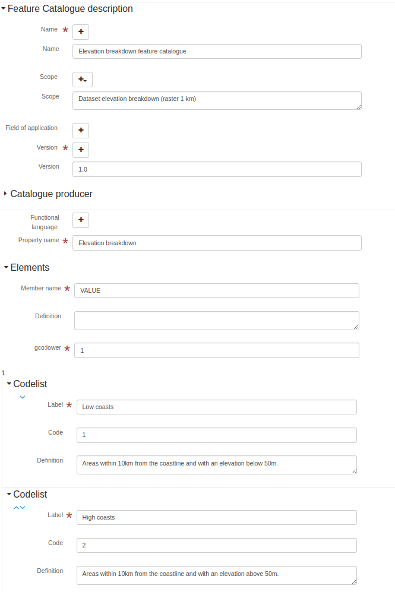

# Геаграфічная інфармацыя — Метадалогія каталагізацыі аб'ектаў (Састарэла — выкарыстоўвайце ISO19115-3) (iso19110) {#iso19110}

Больш падрабязная інфармацыя: [ISO 19110 на iso.org](http://www.iso.org/iso/home/store/catalogue_tc/catalogue_detail.htm?csnumber=39965)

## Рэдактар метаданых

Дадзены стандарт можа быць закадзіраваны з выкарыстаннем 3 выглядаў.

-   [Выгляд: Просты (па змаўчанні)](iso19110.md#iso19110-view-default)
-   [Выгляд: Поўны (пашыраны)](iso19110.md#iso19110-view-advanced)
-   [Выгляд: XML (xml)](iso19110.md#iso19110-view-xml)

### Выгляд: Просты (па змаўчанні) {#iso19110-view-default}

Гэты выгляд складаецца з 1 укладкі(ак).

-   [Укладка: Простая (па змаўчанні)](iso19110.md#iso19110-tab-default)

Гэты выгляд таксама дазваляе дадаць наступныя элементы, нават калі іх няма ў бягучым запісе:

-   Код (gfc:code)
-   Спіс кодаў (gfc:listedValue)

#### Укладка: Простая (па змаўчанні) {#iso19110-tab-default}



На гэтай укладцы адлюстроўваюцца элементы з XML-запісу метаданых.

##### Імя

```{=html}
Імя каталога аб'ектаў
```

XPath

:   

> /gfc:FC_FeatureCatalogue/gmx:name

Гл. [Імя](iso19110.md#iso19110-elem-gmx-name-5ec0c4442ad2b94944636103e556d401)

##### Імя

```{=html}
Імя каталога аб'ектаў
```

XPath

:   

> /gfc:FC_FeatureCatalogue/gfc:name

Гл. [Імя](iso19110.md#iso19110-elem-gfc-name-134285dc9b9a3268556039e2fe3f370e)

##### Сфера прымянення (Scope)

```{=html}
Вызначэнне сферы прымянення
```

XPath

:   

> /gfc:FC_FeatureCatalogue/gmx:scope

Гл. [Сфера прымянення](iso19110.md#iso19110-elem-gmx-scope-14efac6982297b09ba1324e80138092f)

##### Сфера прымянення (Scope)

```{=html}
Вызначэнне сферы прымянення
```

XPath

:   

> /gfc:FC_FeatureCatalogue/gfc:scope

Гл. [Сфера прымянення](iso19110.md#iso19110-elem-gfc-scope-4f044fce55b8e0b6dd0d77516ad9e66d)

##### Вобласць выкарыстання

```{=html}
Вобласць выкарыстання
```

XPath

:   

> /gfc:FC_FeatureCatalogue/gmx:fieldOfApplication

Гл. [Вобласць выкарыстання](iso19110.md#iso19110-elem-gmx-fieldOfApplication-66508d1f139317e01e1decd095915428)

##### Вобласць выкарыстання

```{=html}
Вобласць выкарыстання
```

XPath

:   

> /gfc:FC_FeatureCatalogue/gfc:fieldOfApplication

Гл. [Вобласць выкарыстання](iso19110.md#iso19110-elem-gfc-fieldOfApplication-548e0631e3ea92f7dd05ac533b6c14d2)

##### Версія

```{=html}
Версія каталога
```

XPath

:   

> /gfc:FC_FeatureCatalogue/gmx:versionNumber

Гл. [Версія](iso19110.md#iso19110-elem-gmx-versionNumber-075201f18225aec432b46c75a93589a2)

##### Версія

```{=html}
Версія каталога
```

XPath

:   

> /gfc:FC_FeatureCatalogue/gfc:versionNumber

Гл. [Версія](iso19110.md#iso19110-elem-gfc-versionNumber-d66ec9fd5c22c70a69dd2b759d66cc4f)

##### Дата

```{=html}
Дата каталога
```

XPath

:   

> /gfc:FC_FeatureCatalogue/gmx:versionDate

Гл. [Дата](iso19110.md#iso19110-elem-gmx-versionDate-6c27e2ee0b2daa4ab1aea9ef374bc08f)

##### Вытворца каталога

```{=html}
Адказная асоба каталога
```

XPath

:   

> /gfc:FC_FeatureCatalogue/gfc:producer

Гл. [Вытворца каталога](iso19110.md#iso19110-elem-gfc-producer-5a13bfab8b07441bc9f9f71dcfdf7f6c)

##### Функцыянальная мова

XPath

:   

> /gfc:FC_FeatureCatalogue/gfc:functionalLanguage

Гл. [Функцыянальная мова](iso19110.md#iso19110-elem-gfc-functionalLanguage-7a21d9c35ed9c400c40959ede97b8d76)

##### Апісанне ўласцівасці

```{=html}
Апісанне ўласцівасці
```

XPath

:   

> /gfc:FC_FeatureCatalogue/gfc:featureType

Гл. [Апісанне ўласцівасці](iso19110.md#iso19110-elem-gfc-featureType-d6099a684b15337451388dd46048c48f)

Тып

:   

> suggest

### Выгляд: Поўны (пашыраны) {#iso19110-view-advanced}

Гэты выгляд складаецца з 1 укладкі(ак).

-   [Укладка: Поўная (пашыраная)](iso19110.md#iso19110-tab-advanced)

#### Укладка: Поўная (пашыраная) {#iso19110-tab-advanced}

На гэтай укладцы адлюстроўваюцца элементы з XML-запісу метаданых, а таксама прадастаўляюцца элементы кіравання для дадання ўсіх элементаў, вызначаных у схеме (XSD).

##### Раздзел: Апісанне каталога аб'ектаў

Гл. [Апісанне каталога аб'ектаў](iso19110.md#iso19110-elem-gfc-FC_FeatureCatalogue-a4de444fdd9a6e86e8ba63bb96be363c)

### Выгляд: XML (xml) {#iso19110-view-xml}

Гэты выгляд складаецца з 1 укладкі(ак).

-   [Укладка: XML (xml)](iso19110.md#iso19110-tab-xml)

#### Укладка: XML (xml) {#iso19110-tab-xml}

На гэтай укладцы адлюстроўваюцца элементы з XML-запісу метаданых, а таксама прадастаўляюцца элементы кіравання для дадання ўсіх элементаў, вызначаных у схеме (XSD).

## Тэхнічныя характарыстыкі схемы

Ідэнтыфікатар стандарта

:   

> iso19110

Версія

:   

> 1.0

Размяшчэнне схемы

:   

> <http://www.isotc211.org/2005/gfc> <http://www.isotc211.org/2005/gfc/gfc.xsd>

Прасторы імёнаў схемы

:   

-   `http://geonetwork-opensource.org/schemas/schema-ident`
-   <http://www.isotc211.org/2005/gfc>
-   <http://www.w3.org/2001/XMLSchema-instance>
-   <http://www.w3.org/XML/1998/namespace>

Рэжым вызначэння схемы

:   

> elements (root)

Элементы вызначэння схемы

:   

-   gfc:FC_FeatureCatalogue
-   gfc:FC_FeatureType

## Стандартныя элементы

Спіс усіх элементаў, даступных у стандарце.

### Тэкст {#iso19110-elem-gco-CharacterString-44f4a753bad9d1df04d0611f28f05110}

Назва

:   

> gco:CharacterString

Апісанне

:   

### Ніжняя мяжа магутнасці (Lower cardinality) {#iso19110-elem-gco-lower-52bfcbb528e9aaefc2e33f4fdc55aa5f}

Назва

:   

> gco:lower

Апісанне

:   

```{=html}
Ніжняя мяжа магутнасці
```
``` xml
<gco:lower xmlns:gfc="http://www.isotc211.org/2005/gfc"
           xmlns:xsi="http://www.w3.org/2001/XMLSchema-instance">
   <gco:Integer>1</gco:Integer>
</gco:lower>
```

### Прычына адсутнасці значэння (Nil reason) {#iso19110-elem-gco-nilReason-59d9c7937eb12ff82e61921ee335d062}

Назва

:   

> gco:nilReason

Апісанне

:   

### Дыяпазон (Range) {#iso19110-elem-gco-range-6709132eada2bd317e3ad342849df5ef}

Назва

:   

> gco:range

Апісанне

:   

``` xml
<gco:range xmlns:gfc="http://www.isotc211.org/2005/gfc"
           xmlns:xsi="http://www.w3.org/2001/XMLSchema-instance">
   <gco:MultiplicityRange>
      <gco:lower>
         <gco:Integer>1</gco:Integer>
      </gco:lower>
      <gco:upper>
         <gco:UnlimitedInteger isInfinite="false" xsi:nil="false">1
                    </gco:UnlimitedInteger>
      </gco:upper>
   </gco:MultiplicityRange>
</gco:range>
```

### Верхняя мяжа магутнасці (Upper cardinality) {#iso19110-elem-gco-upper-a58d7645455b8f20c0d2608c5bc1b6ab}

Назва

:   

> gco:upper

Апісанне

:   

```{=html}
Верхняя мяжа магутнасці
```
``` xml
<gco:upper xmlns:gfc="http://www.isotc211.org/2005/gfc"
           xmlns:xsi="http://www.w3.org/2001/XMLSchema-instance">
   <gco:UnlimitedInteger isInfinite="false" xsi:nil="false">1
                    </gco:UnlimitedInteger>
</gco:upper>
```

### Уплывае на значэнне (Affects value of) {#iso19110-elem-gfc-affectsValueOf-3cc26e7cd38219c7bb06fbe8e5438598}

Назва

:   

> gfc:affectsValueOf

Апісанне

:   

### Псеўданімы (Aliases) {#iso19110-elem-gfc-aliases-7ec87797f5b619c461f2acf995b56b2e}

Назва

:   

> gfc:aliases

Апісанне

:   

### Магутнасць (Cardinalities) {#iso19110-elem-gfc-cardinality-36c218fd045f824ca4f9d1ceb6ffbcc2}

Назва

:   

> gfc:cardinality

Апісанне

:   

```{=html}
Магутнасць (кардынальнасць)
```
``` xml
<gfc:cardinality xmlns:gfc="http://www.isotc211.org/2005/gfc"
                 xmlns:xsi="http://www.w3.org/2001/XMLSchema-instance">
   <gco:Multiplicity>
      <gco:range>
         <gco:MultiplicityRange>
            <gco:lower>
               <gco:Integer>1</gco:Integer>
            </gco:lower>
            <gco:upper>
               <gco:UnlimitedInteger isInfinite="false" xsi:nil="false">1
                    </gco:UnlimitedInteger>
            </gco:upper>
         </gco:MultiplicityRange>
      </gco:range>
   </gco:Multiplicity>
</gfc:cardinality>
```

### Элементы (Elements) {#iso19110-elem-gfc-carrierOfCharacteristics-c804ac9130fc47e8753b8d2e3776840b}

Назва

:   

> gfc:carrierOfCharacteristics

Апісанне

:   

```{=html}
Асацыяцыя, атрыбут, аперацыя, ...
```
``` xml
<gfc:carrierOfCharacteristics xmlns:gfc="http://www.isotc211.org/2005/gfc"
                              xmlns:xsi="http://www.w3.org/2001/XMLSchema-instance">
   <gfc:FC_FeatureAttribute>
      <gfc:memberName>
         <gco:LocalName>VALUE</gco:LocalName>
      </gfc:memberName>
      <gfc:definition>
         <gco:CharacterString/>
      </gfc:definition>
      <gfc:cardinality>
         <gco:Multiplicity>
            <gco:range>
               <gco:MultiplicityRange>
                  <gco:lower>
                     <gco:Integer>1</gco:Integer>
                  </gco:lower>
                  <gco:upper>
                     <gco:UnlimitedInteger isInfinite="false" xsi:nil="false">1
                    </gco:UnlimitedInteger>
                  </gco:upper>
               </gco:MultiplicityRange>
            </gco:range>
         </gco:Multiplicity>
      </gfc:cardinality>
      <gfc:featureType/>
      <gfc:valueMeasurementUnit>
         <gml:UnitDefinition xmlns:gml="http://www.opengis.net/gml" gml:id="unknown">
            <gml:description/>
            <gml:identifier codeSpace="unknown"/>
         </gml:UnitDefinition>
      </gfc:valueMeasurementUnit>
      <gfc:listedValue>
         <gfc:FC_ListedValue>
            <gfc:label>
               <gco:CharacterString>Low coasts</gco:CharacterString>
            </gfc:label>
            <gfc:code>
               <gco:CharacterString>1</gco:CharacterString>
            </gfc:code>
            <gfc:definition>
               <gco:CharacterString>Areas within 10km from the coastline and with an elevation
                  below 50m.
                </gco:CharacterString>
            </gfc:definition>
         </gfc:FC_ListedValue>
      </gfc:listedValue>
      <gfc:listedValue>
         <gfc:FC_ListedValue>
            <gfc:label>
               <gco:CharacterString>High coasts</gco:CharacterString>
            </gfc:label>
            <gfc:code>
               <gco:CharacterString>2</gco:CharacterString>
            </gfc:code>
            <gfc:definition>
               <gco:CharacterString>Areas within 10km from the coastline and with an elevation
                  above 50m.
                </gco:CharacterString>
            </gfc:definition>
         </gfc:FC_ListedValue>
      </gfc:listedValue>
      <gfc:listedValue>
         <gfc:FC_ListedValue>
            <gfc:label>
               <gco:CharacterString>Inlands</gco:CharacterString>
            </gfc:label>
            <gfc:code>
               <gco:CharacterString>3</gco:CharacterString>
            </gfc:code>
            <gfc:definition>
               <gco:CharacterString>Areas between 0 and 200 m outside the coastal strip.
                </gco:CharacterString>
            </gfc:definition>
         </gfc:FC_ListedValue>
      </gfc:listedValue>
      <gfc:listedValue>
         <gfc:FC_ListedValue>
            <gfc:label>
               <gco:CharacterString>Uplands</gco:CharacterString>
            </gfc:label>
            <gfc:code>
               <gco:CharacterString>4</gco:CharacterString>
            </gfc:code>
            <gfc:definition>
               <gco:CharacterString>Zones between 200 and 500 m plus the flat areas between 500 and
                  1000m.
                </gco:CharacterString>
            </gfc:definition>
         </gfc:FC_ListedValue>
      </gfc:listedValue>
      <gfc:listedValue>
         <gfc:FC_ListedValue>
            <gfc:label>
               <gco:CharacterString>Mountains</gco:CharacterString>
            </gfc:label>
            <gfc:code>
               <gco:CharacterString>5</gco:CharacterString>
            </gfc:code>
            <gfc:definition>
               <gco:CharacterString>Slopy areas between 500 and 1000m and all the areas over
                  1000m.
                </gco:CharacterString>
            </gfc:definition>
         </gfc:FC_ListedValue>
      </gfc:listedValue>
      <gfc:valueType>
         <gco:TypeName>
            <gco:aName>
               <gco:CharacterString>INTEGER</gco:CharacterString>
            </gco:aName>
         </gco:TypeName>
      </gfc:valueType>
   </gfc:FC_FeatureAttribute>
</gfc:carrierOfCharacteristics>
```

### Код (Code) {#iso19110-elem-gfc-code-c62e74de82d004d4ec09d403e4b59c3b}

Назва

:   

> gfc:code

Апісанне

:   

### Абмежавана (Constrained by) {#iso19110-elem-gfc-constrainedBy-5e5ace57efe55c1890bec294427a780a}

Назва

:   

> gfc:constrainedBy

Апісанне

:   

### Вызначэнне (Definition) {#iso19110-elem-gfc-definition-4bc2a8f5046951fa9e77311ef6d927f2}

Назва

:   

> gfc:definition

Апісанне

:   

```{=html}
Вызначэнне ўласцівасці
```
### Спасылка на вызначэнне (Definition reference) {#iso19110-elem-gfc-definitionReference-30806ed7d5bf82b19c877082a919216e}

Назва

:   

> gfc:definitionReference

Апісанне

:   

### Крыніца вызначэння (Definition source) {#iso19110-elem-gfc-definitionSource-7f9ab04b040daf81d7d761ea83101e88}

Назва

:   

> gfc:definitionSource

Апісанне

:   

### Апісанне (Description) {#iso19110-elem-gfc-description-87db9aea10cf7281b199782a15b17015}

Назва

:   

> gfc:description

Апісанне

:   

### Роль асацыяцыі (Association role) {#iso19110-elem-gfc-FC_AssociationRole-48c91ffbc9251a3377010490882da453}

Назва

:   

> gfc:FC_AssociationRole

Апісанне

:   

### Абмежаванне (Constraint) {#iso19110-elem-gfc-FC_Constraint-8b0503c998a5c3cfd079077286bcc18c}

Назва

:   

> gfc:FC_Constraint

Апісанне

:   

### Асацыяцыя аб'ектаў (Feature association) {#iso19110-elem-gfc-FC_FeatureAssociation-7bfc562c6ffccb3dd540692bd8c0fda7}

Назва

:   

> gfc:FC_FeatureAssociation

Апісанне

:   

### Атрыбут (Attribute) {#iso19110-elem-gfc-FC_FeatureAttribute-f3f350a00639f88ab53dd23d5ad5724e}

Назва

:   

> gfc:FC_FeatureAttribute

Апісанне

:   

``` xml
<gfc:FC_FeatureAttribute xmlns:gfc="http://www.isotc211.org/2005/gfc"
                         xmlns:xsi="http://www.w3.org/2001/XMLSchema-instance">
   <gfc:memberName>
      <gco:LocalName>VALUE</gco:LocalName>
   </gfc:memberName>
   <gfc:definition>
      <gco:CharacterString/>
   </gfc:definition>
   <gfc:cardinality>
      <gco:Multiplicity>
         <gco:range>
            <gco:MultiplicityRange>
               <gco:lower>
                  <gco:Integer>1</gco:Integer>
               </gco:lower>
               <gco:upper>
                  <gco:UnlimitedInteger isInfinite="false" xsi:nil="false">1
                    </gco:UnlimitedInteger>
               </gco:upper>
            </gco:MultiplicityRange>
         </gco:range>
      </gco:Multiplicity>
   </gfc:cardinality>
   <gfc:featureType/>
   <gfc:valueMeasurementUnit>
      <gml:UnitDefinition xmlns:gml="http://www.opengis.net/gml" gml:id="unknown">
         <gml:description/>
         <gml:identifier codeSpace="unknown"/>
      </gml:UnitDefinition>
   </gfc:valueMeasurementUnit>
   <gfc:listedValue>
      <gfc:FC_ListedValue>
         <gfc:label>
            <gco:CharacterString>Low coasts</gco:CharacterString>
         </gfc:label>
         <gfc:code>
            <gco:CharacterString>1</gco:CharacterString>
         </gfc:code>
         <gfc:definition>
            <gco:CharacterString>Areas within 10km from the coastline and with an elevation
                  below 50m.
                </gco:CharacterString>
         </gfc:definition>
      </gfc:FC_ListedValue>
   </gfc:listedValue>
   <gfc:listedValue>
      <gfc:FC_ListedValue>
         <gfc:label>
            <gco:CharacterString>High coasts</gco:CharacterString>
         </gfc:label>
         <gfc:code>
            <gco:CharacterString>2</gco:CharacterString>
         </gfc:code>
         <gfc:definition>
            <gco:CharacterString>Areas within 10km from the coastline and with an elevation
                  above 50m.
                </gco:CharacterString>
         </gfc:definition>
      </gfc:FC_ListedValue>
   </gfc:listedValue>
   <gfc:listedValue>
      <gfc:FC_ListedValue>
         <gfc:label>
            <gco:CharacterString>Inlands</gco:CharacterString>
         </gfc:label>
         <gfc:code>
            <gco:CharacterString>3</gco:CharacterString>
         </gfc:code>
         <gfc:definition>
            <gco:CharacterString>Areas between 0 and 200 m outside the coastal strip.
                </gco:CharacterString>
         </gfc:definition>
      </gfc:FC_ListedValue>
   </gfc:listedValue>
   <gfc:listedValue>
      <gfc:FC_ListedValue>
         <gfc:label>
            <gco:CharacterString>Uplands</gco:CharacterString>
         </gfc:label>
         <gfc:code>
            <gco:CharacterString>4</gco:CharacterString>
         </gfc:code>
         <gfc:definition>
            <gco:CharacterString>Zones between 200 and 500 m plus the flat areas between 500 and
                  1000m.
                </gco:CharacterString>
         </gfc:definition>
      </gfc:FC_ListedValue>
   </gfc:listedValue>
   <gfc:listedValue>
      <gfc:FC_ListedValue>
         <gfc:label>
            <gco:CharacterString>Mountains</gco:CharacterString>
         </gfc:label>
         <gfc:code>
            <gco:CharacterString>5</gco:CharacterString>
         </gfc:code>
         <gfc:definition>
            <gco:CharacterString>Slopy areas between 500 and 1000m and all the areas over
                  1000m.
                </gco:CharacterString>
         </gfc:definition>
      </gfc:FC_ListedValue>
   </gfc:listedValue>
   <gfc:valueType>
      <gco:TypeName>
         <gco:aName>
            <gco:CharacterString>INTEGER</gco:CharacterString>
         </gco:aName>
      </gco:TypeName>
   </gfc:valueType>
</gfc:FC_FeatureAttribute>
```

### Апісанне каталога аб'ектаў {#iso19110-elem-gfc-FC_FeatureCatalogue-a4de444fdd9a6e86e8ba63bb96be363c}

Назва

:   

> gfc:FC_FeatureCatalogue

Апісанне

:   

``` xml
<gfc:FC_FeatureCatalogue xmlns:gfc="http://www.isotc211.org/2005/gfc"
                         uuid="411cd05b-9a79-45f2-b39f-0b344a9f35af"
                         xsi:schemaLocation="http://www.isotc211.org/2005/gfc http://www.isotc211.org/2005/gfc/gfc.xsd">
   <gfc:name>
      <gco:CharacterString>Elevation breakdown feature catalogue</gco:CharacterString>
   </gfc:name>
   <gfc:scope>
      <gco:CharacterString>Dataset elevation breakdown (raster 1 km)</gco:CharacterString>
   </gfc:scope>
   <gfc:versionNumber>
      <gco:CharacterString>1.0</gco:CharacterString>
   </gfc:versionNumber>
   <gfc:versionDate>
      <gco:DateTime>2012-11-05T10:56:11</gco:DateTime>
   </gfc:versionDate>
   <gfc:producer>
      <gmd:CI_ResponsibleParty>
         <gmd:individualName>
            <gco:CharacterString>European Environment Agency</gco:CharacterString>
         </gmd:individualName>
         <gmd:organisationName>
            <gco:CharacterString/>
         </gmd:organisationName>
         <gmd:positionName>
            <gco:CharacterString/>
         </gmd:positionName>
         <gmd:contactInfo>
            <gmd:CI_Contact>
               <gmd:address>
                  <gmd:CI_Address>
                     <gmd:deliveryPoint>
                        <gco:CharacterString>Kongens Nytorv 6</gco:CharacterString>
                     </gmd:deliveryPoint>
                     <gmd:city>
                        <gco:CharacterString>Copenhagen</gco:CharacterString>
                     </gmd:city>
                     <gmd:administrativeArea>
                        <gco:CharacterString>K</gco:CharacterString>
                     </gmd:administrativeArea>
                     <gmd:postalCode>
                        <gco:CharacterString>1050</gco:CharacterString>
                     </gmd:postalCode>
                     <gmd:country>
                        <gco:CharacterString>Denmark</gco:CharacterString>
                     </gmd:country>
                     <gmd:electronicMailAddress>
                        <gco:CharacterString>mauro.michielon@eea.europa.eu</gco:CharacterString>
                     </gmd:electronicMailAddress>
                  </gmd:CI_Address>
               </gmd:address>
            </gmd:CI_Contact>
         </gmd:contactInfo>
         <gmd:role>
            <gmd:CI_RoleCode codeListValue="pointOfContact" codeList="CI_RoleCode"/>
         </gmd:role>
      </gmd:CI_ResponsibleParty>
   </gfc:producer>
   <gfc:featureType>
      <gfc:FC_FeatureType>
         <gfc:typeName>
            <gco:LocalName>Elevation breakdown</gco:LocalName>
         </gfc:typeName>
         <gfc:definition>
            <gco:CharacterString>The Elevation breakdown is used to allocate Land cover changes into
          homogeneous areas as function of height, slope and distance to the sea.
        </gco:CharacterString>
         </gfc:definition>
         <gfc:isAbstract>
            <gco:Boolean>false</gco:Boolean>
         </gfc:isAbstract>
         <gfc:featureCatalogue/>
         <gfc:carrierOfCharacteristics>
            <gfc:FC_FeatureAttribute>
               <gfc:memberName>
                  <gco:LocalName>VALUE</gco:LocalName>
               </gfc:memberName>
               <gfc:definition>
                  <gco:CharacterString/>
               </gfc:definition>
               <gfc:cardinality>
                  <gco:Multiplicity>
                     <gco:range>
                        <gco:MultiplicityRange>
                           <gco:lower>
                              <gco:Integer>1</gco:Integer>
                           </gco:lower>
                           <gco:upper>
                              <gco:UnlimitedInteger isInfinite="false" xsi:nil="false">1
                    </gco:UnlimitedInteger>
                           </gco:upper>
                        </gco:MultiplicityRange>
                     </gco:range>
                  </gco:Multiplicity>
               </gfc:cardinality>
               <gfc:featureType/>
               <gfc:valueMeasurementUnit>
                  <gml:UnitDefinition xmlns:gml="http://www.opengis.net/gml" gml:id="unknown">
                     <gml:description/>
                     <gml:identifier codeSpace="unknown"/>
                  </gml:UnitDefinition>
               </gfc:valueMeasurementUnit>
               <gfc:listedValue>
                  <gfc:FC_ListedValue>
                     <gfc:label>
                        <gco:CharacterString>Low coasts</gco:CharacterString>
                     </gfc:label>
                     <gfc:code>
                        <gco:CharacterString>1</gco:CharacterString>
                     </gfc:code>
                     <gfc:definition>
                        <gco:CharacterString>Areas within 10km from the coastline and with an elevation
                  below 50m.
                </gco:CharacterString>
                     </gfc:definition>
                  </gfc:FC_ListedValue>
               </gfc:listedValue>
               <gfc:listedValue>
                  <gfc:FC_ListedValue>
                     <gfc:label>
                        <gco:CharacterString>High coasts</gco:CharacterString>
                     </gfc:label>
                     <gfc:code>
                        <gco:CharacterString>2</gco:CharacterString>
                     </gfc:code>
                     <gfc:definition>
                        <gco:CharacterString>Areas within 10km from the coastline and with an elevation
                  above 50m.
                </gco:CharacterString>
                     </gfc:definition>
                  </gfc:FC_ListedValue>
               </gfc:listedValue>
               <gfc:listedValue>
                  <gfc:FC_ListedValue>
                     <gfc:label>
                        <gco:CharacterString>Inlands</gco:CharacterString>
                     </gfc:label>
                     <gfc:code>
                        <gco:CharacterString>3</gco:CharacterString>
                     </gfc:code>
                     <gfc:definition>
                        <gco:CharacterString>Areas between 0 and 200 m outside the coastal strip.
                </gco:CharacterString>
                     </gfc:definition>
                  </gfc:FC_ListedValue>
               </gfc:listedValue>
               <gfc:listedValue>
                  <gfc:FC_ListedValue>
                     <gfc:label>
                        <gco:CharacterString>Uplands</gco:CharacterString>
                     </gfc:label>
                     <gfc:code>
                        <gco:CharacterString>4</gco:CharacterString>
                     </gfc:code>
                     <gfc:definition>
                        <gco:CharacterString>Zones between 200 and 500 m plus the flat areas between 500 and
                  1000m.
                </gco:CharacterString>
                     </gfc:definition>
                  </gfc:FC_ListedValue>
               </gfc:listedValue>
               <gfc:listedValue>
                  <gfc:FC_ListedValue>
                     <gfc:label>
                        <gco:CharacterString>Mountains</gco:CharacterString>
                     </gfc:label>
                     <gfc:code>
                        <gco:CharacterString>5</gco:CharacterString>
                     </gfc:code>
                     <gfc:definition>
                        <gco:CharacterString>Slopy areas between 500 and 1000m and all the areas over
                  1000m.
                </gco:CharacterString>
                     </gfc:definition>
                  </gfc:FC_ListedValue>
               </gfc:listedValue>
               <gfc:valueType>
                  <gco:TypeName>
                     <gco:aName>
                        <gco:CharacterString>INTEGER</gco:CharacterString>
                     </gco:aName>
                  </gco:TypeName>
               </gfc:valueType>
            </gfc:FC_FeatureAttribute>
         </gfc:carrierOfCharacteristics>
      </gfc:FC_FeatureType>
   </gfc:featureType>
</gfc:FC_FeatureCatalogue>
```

### Аперацыя аб'екта (Feature operation) {#iso19110-elem-gfc-FC_FeatureOperation-637b82bc0e9951563005e479a9e1d152}

Назва

:   

> gfc:FC_FeatureOperation

Апісанне

:   

### Апісанне табліцы атрыбутаў (Attribute table description) {#iso19110-elem-gfc-FC_FeatureType-38ad06d5e87d9bf33d5f111e7bca0eb4}

Назва

:   

> gfc:FC_FeatureType

Апісанне

:   

```{=html}
Апісанне табліцы атрыбутаў
```
``` xml
<gfc:FC_FeatureType xmlns:gfc="http://www.isotc211.org/2005/gfc"
                    xmlns:xsi="http://www.w3.org/2001/XMLSchema-instance">
   <gfc:typeName>
      <gco:LocalName>Elevation breakdown</gco:LocalName>
   </gfc:typeName>
   <gfc:definition>
      <gco:CharacterString>The Elevation breakdown is used to allocate Land cover changes into
          homogeneous areas as function of height, slope and distance to the sea.
        </gco:CharacterString>
   </gfc:definition>
   <gfc:isAbstract>
      <gco:Boolean>false</gco:Boolean>
   </gfc:isAbstract>
   <gfc:featureCatalogue/>
   <gfc:carrierOfCharacteristics>
      <gfc:FC_FeatureAttribute>
         <gfc:memberName>
            <gco:LocalName>VALUE</gco:LocalName>
         </gfc:memberName>
         <gfc:definition>
            <gco:CharacterString/>
         </gfc:definition>
         <gfc:cardinality>
            <gco:Multiplicity>
               <gco:range>
                  <gco:MultiplicityRange>
                     <gco:lower>
                        <gco:Integer>1</gco:Integer>
                     </gco:lower>
                     <gco:upper>
                        <gco:UnlimitedInteger isInfinite="false" xsi:nil="false">1
                    </gco:UnlimitedInteger>
                     </gco:upper>
                  </gco:MultiplicityRange>
               </gco:range>
            </gco:Multiplicity>
         </gfc:cardinality>
         <gfc:featureType/>
         <gfc:valueMeasurementUnit>
            <gml:UnitDefinition xmlns:gml="http://www.opengis.net/gml" gml:id="unknown">
               <gml:description/>
               <gml:identifier codeSpace="unknown"/>
            </gml:UnitDefinition>
         </gfc:valueMeasurementUnit>
         <gfc:listedValue>
            <gfc:FC_ListedValue>
               <gfc:label>
                  <gco:CharacterString>Low coasts</gco:CharacterString>
               </gfc:label>
               <gfc:code>
                  <gco:CharacterString>1</gco:CharacterString>
               </gfc:code>
               <gfc:definition>
                  <gco:CharacterString>Areas within 10km from the coastline and with an elevation
                  below 50m.
                </gco:CharacterString>
               </gfc:definition>
            </gfc:FC_ListedValue>
         </gfc:listedValue>
         <gfc:listedValue>
            <gfc:FC_ListedValue>
               <gfc:label>
                  <gco:CharacterString>High coasts</gco:CharacterString>
               </gfc:label>
               <gfc:code>
                  <gco:CharacterString>2</gco:CharacterString>
               </gfc:code>
               <gfc:definition>
                  <gco:CharacterString>Areas within 10km from the coastline and with an elevation
                  above 50m.
                </gco:CharacterString>
               </gfc:definition>
            </gfc:FC_ListedValue>
         </gfc:listedValue>
         <gfc:listedValue>
            <gfc:FC_ListedValue>
               <gfc:label>
                  <gco:CharacterString>Inlands</gco:CharacterString>
               </gfc:label>
               <gfc:code>
                  <gco:CharacterString>3</gco:CharacterString>
               </gfc:code>
               <gfc:definition>
                  <gco:CharacterString>Areas between 0 and 200 m outside the coastal strip.
                </gco:CharacterString>
               </gfc:definition>
            </gfc:FC_ListedValue>
         </gfc:listedValue>
         <gfc:listedValue>
            <gfc:FC_ListedValue>
               <gfc:label>
                  <gco:CharacterString>Uplands</gco:CharacterString>
               </gfc:label>
               <gfc:code>
                  <gco:CharacterString>4</gco:CharacterString>
               </gfc:code>
               <gfc:definition>
                  <gco:CharacterString>Zones between 200 and 500 m plus the flat areas between 500 and
                  1000m.
                </gco:CharacterString>
               </gfc:definition>
            </gfc:FC_ListedValue>
         </gfc:listedValue>
         <gfc:listedValue>
            <gfc:FC_ListedValue>
               <gfc:label>
                  <gco:CharacterString>Mountains</gco:CharacterString>
               </gfc:label>
               <gfc:code>
                  <gco:CharacterString>5</gco:CharacterString>
               </gfc:code>
               <gfc:definition>
                  <gco:CharacterString>Slopy areas between 500 and 1000m and all the areas over
                  1000m.
                </gco:CharacterString>
               </gfc:definition>
            </gfc:FC_ListedValue>
         </gfc:listedValue>
         <gfc:valueType>
            <gco:TypeName>
               <gco:aName>
                  <gco:CharacterString>INTEGER</gco:CharacterString>
               </gco:aName>
            </gco:TypeName>
         </gfc:valueType>
      </gfc:FC_FeatureAttribute>
   </gfc:carrierOfCharacteristics>
</gfc:FC_FeatureType>
```

### Адносіны наследавання (Heritance relation) {#iso19110-elem-gfc-FC_InheritanceRelation-fe8bfb4f25b16151bf7dc241c0bb800c}

Назва

:   

> gfc:FC_InheritanceRelation

Апісанне

:   

### Спіс кодаў (Codelist) {#iso19110-elem-gfc-FC_ListedValue-281cee06b2347acc7c485783eb4cf22f}

Назва

:   

> gfc:FC_ListedValue

Апісанне

:   

### Тып ролі (Role type) {#iso19110-elem-gfc-FC_RoleType-8f835d500036f8c773643298ee9a1287}

Назва

:   

> gfc:FC_RoleType

Апісанне

:   

### Каталог аб'ектаў (Feature catalogue) {#iso19110-elem-gfc-featureCatalogue-747a0827bf295f6d27168cd2b274929b}

Назва

:   

> gfc:featureCatalogue

Апісанне

:   

``` xml
<gfc:featureCatalogue xmlns:gfc="http://www.isotc211.org/2005/gfc"
                      xmlns:xsi="http://www.w3.org/2001/XMLSchema-instance"/>
```

### Апісанне ўласцівасці (Property description) {#iso19110-elem-gfc-featureType-d6099a684b15337451388dd46048c48f}

Назва

:   

> gfc:featureType

Апісанне

:   

```{=html}
Апісанне ўласцівасці
```
### Вобласць выкарыстання (Field of application) {#iso19110-elem-gfc-fieldOfApplication-548e0631e3ea92f7dd05ac533b6c14d2}

Назва

:   

> gfc:fieldOfApplication

Апісанне

:   

```{=html}
Вобласць выкарыстання
```
### Фармальнае вызначэнне (Formal definition) {#iso19110-elem-gfc-formalDefinition-61fbbceaf2b0eca25754ba29528ac201}

Назва

:   

> gfc:formalDefinition

Апісанне

:   

### Функцыянальная мова (Functional language) {#iso19110-elem-gfc-functionalLanguage-7a21d9c35ed9c400c40959ede97b8d76}

Назва

:   

> gfc:functionalLanguage

Апісанне

:   

### Наследуе ад (Inherits from) {#iso19110-elem-gfc-inheritsFrom-d48c2429ef37a9f7001c4c78b3185ad8}

Назва

:   

> gfc:inheritsFrom

Апісанне

:   

### Наследуецца (Inherits to) {#iso19110-elem-gfc-inheritsTo-21e907a9a6f03374cf39958e940d6c04}

Назва

:   

> gfc:inheritsTo

Апісанне

:   

### Абстрактны (Abstract) {#iso19110-elem-gfc-isAbstract-108adb5fd93bc80097796cf3e185145e}

Назва

:   

> gfc:isAbstract

Апісанне

:   

```{=html}
Ці з'яўляецца гэты элемент абстрактным элементам?
```
``` xml
<gfc:isAbstract xmlns:gfc="http://www.isotc211.org/2005/gfc"
                xmlns:xsi="http://www.w3.org/2001/XMLSchema-instance">
   <gco:Boolean>false</gco:Boolean>
</gfc:isAbstract>
```

### Навігацыйны (Is navigable) {#iso19110-elem-gfc-isNavigable-ee77efa13eb047461f3d1b10eb057ad2}

Назва

:   

> gfc:isNavigable

Апісанне

:   

### Упарадкаваны (Is ordered) {#iso19110-elem-gfc-isOrdered-99dd774d6527b2e2a6714029b3d85562}

Назва

:   

> gfc:isOrdered

Апісанне

:   

### Метка (Label) {#iso19110-elem-gfc-label-f039ffb9cb376d0473d7be6326b20fd7}

Назва

:   

> gfc:label

Апісанне

:   

### Спіс кодаў (Codelist) {#iso19110-elem-gfc-listedValue-10921452105d681cb7bcb8c2851416f9}

Назва

:   

> gfc:listedValue

Апісанне

:   

```{=html}
Спіс значэнняў для гэтага элемента.
```
### Імя элемента (Member name) {#iso19110-elem-gfc-memberName-3bd14590c8d90557f5d48e886a3ebef7}

Назва

:   

> gfc:memberName

Апісанне

:   

``` xml
<gfc:memberName xmlns:gfc="http://www.isotc211.org/2005/gfc"
                xmlns:xsi="http://www.w3.org/2001/XMLSchema-instance">
   <gco:LocalName>VALUE</gco:LocalName>
</gfc:memberName>
```

### Імя (Name) {#iso19110-elem-gfc-name-134285dc9b9a3268556039e2fe3f370e}

Назва

:   

> gfc:name

Апісанне

:   

```{=html}
Імя каталога аб'ектаў
```
``` xml
<gfc:name xmlns:gfc="http://www.isotc211.org/2005/gfc"
          xmlns:xsi="http://www.w3.org/2001/XMLSchema-instance">
   <gco:CharacterString>Elevation breakdown feature catalogue</gco:CharacterString>
</gfc:name>
```

### Назірае значэнне (Observes value of) {#iso19110-elem-gfc-observesValueOf-b236ed68892a516373f72b89b397cde4}

Назва

:   

> gfc:observesValueOf

Апісанне

:   

### Вытворца каталога (Catalogue producer) {#iso19110-elem-gfc-producer-5a13bfab8b07441bc9f9f71dcfdf7f6c}

Назва

:   

> gfc:producer

Апісанне

:   

```{=html}
Адказная асоба каталога
```
``` xml
<gfc:producer xmlns:gfc="http://www.isotc211.org/2005/gfc"
              xmlns:xsi="http://www.w3.org/2001/XMLSchema-instance">
   <gmd:CI_ResponsibleParty>
      <gmd:individualName>
         <gco:CharacterString>European Environment Agency</gco:CharacterString>
      </gmd:individualName>
      <gmd:organisationName>
         <gco:CharacterString/>
      </gmd:organisationName>
      <gmd:positionName>
         <gco:CharacterString/>
      </gmd:positionName>
      <gmd:contactInfo>
         <gmd:CI_Contact>
            <gmd:address>
               <gmd:CI_Address>
                  <gmd:deliveryPoint>
                     <gco:CharacterString>Kongens Nytorv 6</gco:CharacterString>
                  </gmd:deliveryPoint>
                  <gmd:city>
                     <gco:CharacterString>Copenhagen</gco:CharacterString>
                  </gmd:city>
                  <gmd:administrativeArea>
                     <gco:CharacterString>K</gco:CharacterString>
                  </gmd:administrativeArea>
                  <gmd:postalCode>
                     <gco:CharacterString>1050</gco:CharacterString>
                  </gmd:postalCode>
                  <gmd:country>
                     <gco:CharacterString>Denmark</gco:CharacterString>
                  </gmd:country>
                  <gmd:electronicMailAddress>
                     <gco:CharacterString>mauro.michielon@eea.europa.eu</gco:CharacterString>
                  </gmd:electronicMailAddress>
               </gmd:CI_Address>
            </gmd:address>
         </gmd:CI_Contact>
      </gmd:contactInfo>
      <gmd:role>
         <gmd:CI_RoleCode codeListValue="pointOfContact" codeList="CI_RoleCode"/>
      </gmd:role>
   </gmd:CI_ResponsibleParty>
</gfc:producer>
```

### Адносіны (Relation) {#iso19110-elem-gfc-relation-aacba568eb3b35bd7b8432488f11bf69}

Назва

:   

> gfc:relation

Апісанне

:   

### Імя ролі (Role name) {#iso19110-elem-gfc-roleName-75ef0d862fac206908f78b9ecd526c65}

Назва

:   

> gfc:roleName

Апісанне

:   

### Тып ролі (Role type) {#iso19110-elem-gfc-roleType-e11e8dd83ce112d38151e4c5d41f5e57}

Назва

:   

> gfc:roleType

Апісанне

:   

### Сфера прымянення (Scope) {#iso19110-elem-gfc-scope-4f044fce55b8e0b6dd0d77516ad9e66d}

Назва

:   

> gfc:scope

Апісанне

:   

```{=html}
Вызначэнне сферы прымянення
```
``` xml
<gfc:scope xmlns:gfc="http://www.isotc211.org/2005/gfc"
           xmlns:xsi="http://www.w3.org/2001/XMLSchema-instance">
   <gco:CharacterString>Dataset elevation breakdown (raster 1 km)</gco:CharacterString>
</gfc:scope>
```

### Подпіс (Signature) {#iso19110-elem-gfc-signature-a322fc9fc498999771ea25d75eeadb92}

Назва

:   

> gfc:signature

Апісанне

:   

### Выклікаецца значэннем (Triggered by value of) {#iso19110-elem-gfc-triggeredByValueOf-f9c78e57b38ecbf17a07eae27ddceb25}

Назва

:   

> gfc:triggeredByValueOf

Апісанне

:   

### Тып (Type) {#iso19110-elem-gfc-type-8d417215d65176688a81728103dee9d4}

Назва

:   

> gfc:type

Апісанне

:   

### Імя ўласцівасці (Property name) {#iso19110-elem-gfc-typeName-5eb6a83793b5f1865c0a10bc6d3cb399}

Назва

:   

> gfc:typeName

Апісанне

:   

``` xml
<gfc:typeName xmlns:gfc="http://www.isotc211.org/2005/gfc"
              xmlns:xsi="http://www.w3.org/2001/XMLSchema-instance">
   <gco:LocalName>Elevation breakdown</gco:LocalName>
</gfc:typeName>
```

### Унікальны экземпляр (Unique instance) {#iso19110-elem-gfc-uniqueInstance-b0b6a49f0189dc2499564de5cdfd25a0}

Назва

:   

> gfc:uniqueInstance

Апісанне

:   

### Адзінка вымярэння значэння (Value measurement unit) {#iso19110-elem-gfc-valueMeasurementUnit-3722d826b1a00b71bfae6cd7eefff3cd}

Назва

:   

> gfc:valueMeasurementUnit

Апісанне

:   

``` xml
<gfc:valueMeasurementUnit xmlns:gfc="http://www.isotc211.org/2005/gfc"
                          xmlns:xsi="http://www.w3.org/2001/XMLSchema-instance">
   <gml:UnitDefinition xmlns:gml="http://www.opengis.net/gml" gml:id="unknown">
      <gml:description/>
      <gml:identifier codeSpace="unknown"/>
   </gml:UnitDefinition>
</gfc:valueMeasurementUnit>
```

### Тып значэння (Value type) {#iso19110-elem-gfc-valueType-faeb30b744a5e7aa19f43cb83bf2a9ab}

Назва

:   

> gfc:valueType

Апісанне

:   

``` xml
<gfc:valueType xmlns:gfc="http://www.isotc211.org/2005/gfc"
               xmlns:xsi="http://www.w3.org/2001/XMLSchema-instance">
   <gco:TypeName>
      <gco:aName>
         <gco:CharacterString>INTEGER</gco:CharacterString>
      </gco:aName>
   </gco:TypeName>
</gfc:valueType>
```

### Дата (Date) {#iso19110-elem-gfc-versionDate-536720beffcbb11d9da8bd041ad7a762}

Назва

:   

> gfc:versionDate

Апісанне

:   

```{=html}
Дата каталога
```
``` xml
<gfc:versionDate xmlns:gfc="http://www.isotc211.org/2005/gfc"
                 xmlns:xsi="http://www.w3.org/2001/XMLSchema-instance">
   <gco:DateTime>2012-11-05T10:56:11</gco:DateTime>
</gfc:versionDate>
```

### Версія (Version) {#iso19110-elem-gfc-versionNumber-d66ec9fd5c22c70a69dd2b759d66cc4f}

Назва

:   

> gfc:versionNumber

Апісанне

:   

```{=html}
Версія каталога
```
``` xml
<gfc:versionNumber xmlns:gfc="http://www.isotc211.org/2005/gfc"
                   xmlns:xsi="http://www.w3.org/2001/XMLSchema-instance">
   <gco:CharacterString>1.0</gco:CharacterString>
</gfc:versionNumber>
```

### Адказная бок (Responsible party) {#iso19110-elem-gmd-CI_ResponsibleParty-f8269ab6464cabb0bc5d4b5d8e2d410c}

Назва

:   

> gmd:CI_ResponsibleParty

Апісанне

:   

```{=html}
Адказная бок
```
``` xml
<gmd:CI_ResponsibleParty xmlns:gfc="http://www.isotc211.org/2005/gfc"
                         xmlns:xsi="http://www.w3.org/2001/XMLSchema-instance">
   <gmd:individualName>
      <gco:CharacterString>European Environment Agency</gco:CharacterString>
   </gmd:individualName>
   <gmd:organisationName>
      <gco:CharacterString/>
   </gmd:organisationName>
   <gmd:positionName>
      <gco:CharacterString/>
   </gmd:positionName>
   <gmd:contactInfo>
      <gmd:CI_Contact>
         <gmd:address>
            <gmd:CI_Address>
               <gmd:deliveryPoint>
                  <gco:CharacterString>Kongens Nytorv 6</gco:CharacterString>
               </gmd:deliveryPoint>
               <gmd:city>
                  <gco:CharacterString>Copenhagen</gco:CharacterString>
               </gmd:city>
               <gmd:administrativeArea>
                  <gco:CharacterString>K</gco:CharacterString>
               </gmd:administrativeArea>
               <gmd:postalCode>
                  <gco:CharacterString>1050</gco:CharacterString>
               </gmd:postalCode>
               <gmd:country>
                  <gco:CharacterString>Denmark</gco:CharacterString>
               </gmd:country>
               <gmd:electronicMailAddress>
                  <gco:CharacterString>mauro.michielon@eea.europa.eu</gco:CharacterString>
               </gmd:electronicMailAddress>
            </gmd:CI_Address>
         </gmd:address>
      </gmd:CI_Contact>
   </gmd:contactInfo>
   <gmd:role>
      <gmd:CI_RoleCode codeListValue="pointOfContact" codeList="CI_RoleCode"/>
   </gmd:role>
</gmd:CI_ResponsibleParty>
```

### Адказная бок (Responsible party) {#iso19110-elem-gmd-responsibleParty-7352aaa3187b52425f19d3f567e8b88a}

Назва

:   

> gmd:responsibleParty

Апісанне

:   

```{=html}
Адказная бок
```
### Анкер (Anchor) {#iso19110-elem-gmx-Anchor-4e506485badff59411e1cb2c1f5031e3}

Назва

:   

> gmx:Anchor

Апісанне

:   

### Вобласць выкарыстання (Field of application) {#iso19110-elem-gmx-fieldOfApplication-66508d1f139317e01e1decd095915428}

Назва

:   

> gmx:fieldOfApplication

Апісанне

:   

```{=html}
Вобласць выкарыстання
```
### Імя файла (File name) {#iso19110-elem-gmx-FileName-2a19fe714b24f0a417598321882eef7f}

Назва

:   

> gmx:FileName

Апісанне

:   

### Імя (Name) {#iso19110-elem-gmx-name-5ec0c4442ad2b94944636103e556d401}

Назва

:   

> gmx:name

Апісанне

:   

```{=html}
Імя каталога аб'ектаў
```
### Сфера прымянення (Scope) {#iso19110-elem-gmx-scope-14efac6982297b09ba1324e80138092f}

Назва

:   

> gmx:scope

Апісанне

:   

```{=html}
Вызначэнне сферы прымянення
```
### Дата (Date) {#iso19110-elem-gmx-versionDate-6c27e2ee0b2daa4ab1aea9ef374bc08f}

Назва

:   

> gmx:versionDate

Апісанне

:   

```{=html}
Дата каталога
```
### Версія (Version) {#iso19110-elem-gmx-versionNumber-075201f18225aec432b46c75a93589a2}

Назва

:   

> gmx:versionNumber

Апісанне

:   

```{=html}
Версія каталога
```
## Стандартныя спісы кодаў

Спіс усіх спісаў кодаў, даступных у стандарце.

### Стандартныя спісы кодаў (gmd:CI_RoleCode) {#iso19110-cl-gmd-CI_RoleCode}

| код                   | метка                  | апісанне                                                                                                                       |
|-----------------------|------------------------|--------------------------------------------------------------------------------------------------------------------------------|
| resourceProvider      | Пастаўшчык рэсурсу      | Бок, які прадастаўляе рэсурс                                                                                                |
| custodian             | Захавальнік            | Бок, які прымае падсправаздачнасць і адказнасць за дадзеныя і забяспечвае належны догляд і абслугоўванне рэсурсу         |
| owner                 | Уласнік                | Бок, які валодае рэсурсам                                                                                                     |
| user                  | Карыстальнік           | Бок, які выкарыстоўвае рэсурс                                                                                                   |
| distributor           | Дыстрыб'ютар           | Бок, які распаўсюджвае рэсурс                                                                                               |
| originator            | Першакрыніца           | Бок, які стварыў рэсурс                                                                                                       |
| pointOfContact        | Кантактная асоба       | Бок, з якім можна звязацца для атрымання ведаў пра рэсурс або яго набыцця                                         |
| principalInvestigator | Галоўны даследчык      | Асноўны бок, адказны за збор інфармацыі і правядзенне даследаванняў                                                   |
| processor             | Апрацоўшчык            | Бок, які апрацаваў дадзеныя такім чынам, што рэсурс быў зменены                                                       |
| publisher             | Выдавец                | Бок, які апублікаваў рэсурс                                                                                                 |
| author                | Аўтар                  | Бок, які стварыў рэсурс (аўтарства)                                                                                          |