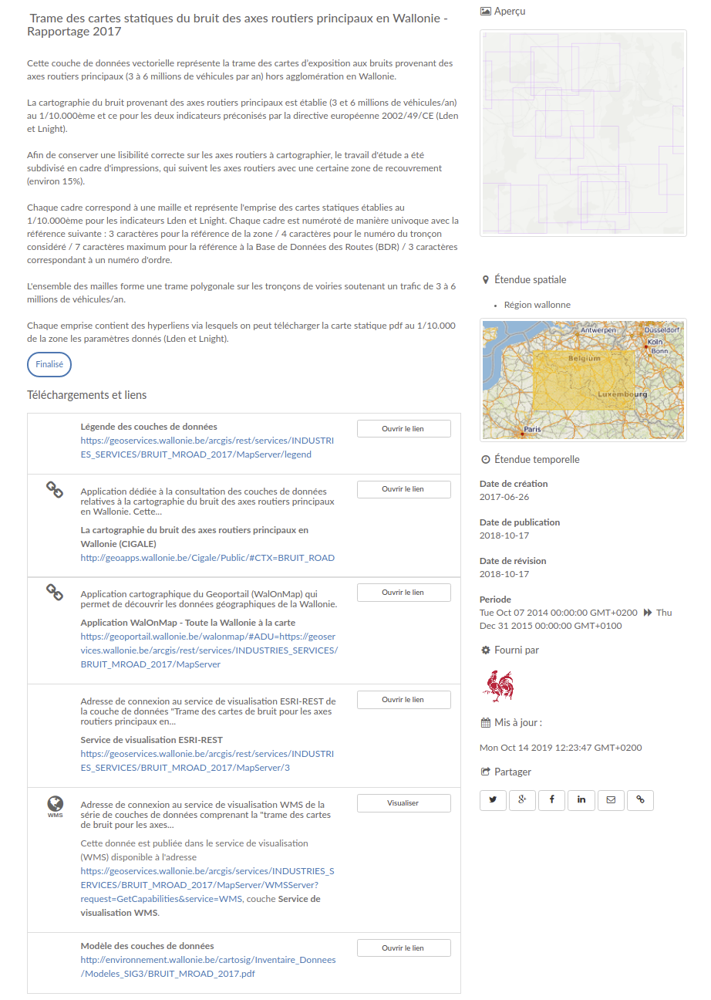
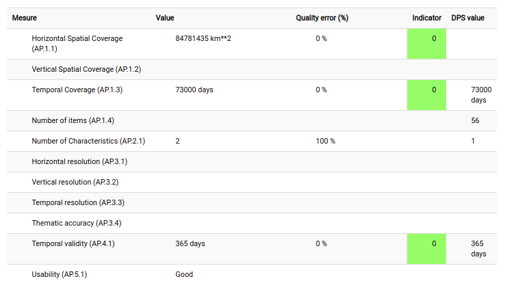

# Геаграфічная інфармацыя — Метаданыя (iso19115-3.2018) {#iso19115-3.2018}

Мэтай стандарту ISO 19115 з'яўляецца прадастаўленне мадэлі для апісання інфармацыі або рэсурсаў, якія могуць мець геаграфічную прывязку. Гэтая частка ISO 19115 прызначана для выкарыстання аналітыкамі інфармацыйных сістэм, планавальнікамі праграм, распрацоўшчыкамі інфармацыйных сістэм, а таксама іншымі спецыялістамі для вызначэння асноўных прынцыпаў і патрабаванняў да стандартызаванага апісання інфармацыйных рэсурсаў. Гэтая частка ISO 19115 вызначае элементы метаданых, іх уласцівасці і ўзаемасувязі паміж элементамі, а таксама ўстанаўлівае агульны набор тэрміналогіі метаданых, азначэнняў і працэдур пашырэння.

Хоць асноўнай мэтай гэтай часткі ISO 19115 з'яўляецца апісанне лічбавай інфармацыі, якая мае геаграфічную прывязку, яна можа быць выкарыстана для апісання ўсіх тыпаў рэсурсаў, уключаючы тэкставыя дакументы, ініцыятывы, праграмнае забеспячэнне, сэнсары, негеаграфічную інфармацыю, спецыфікацыі прадуктаў і рэпазіторыі, г.зн. яна можа быць выкарыстана для апісання інфармацыйных рэсурсаў, якія не маюць геаграфічнай прывязкі. Некаторыя дамены маюць свае ўласныя стандарты метаданых, такія як Dublin Core для бібліятэк. Пры неабходнасці такія стандарты і гэтая частка ISO 19115 могуць быць прафіляваны для стварэння Схемы супольнасці.

Гэтая схема таксама ўключае:

-   Апісанне даных малюнкаў (ахопліваецца стандартам ISO19115-2)
-   Укараненне мадэлі даных (каталог аб'ектаў) у запіс набору даных (ахопліваецца стандартам ISO19110)
-   Апісанне якасці даных з выкарыстаннем ISO19157

Дадатковая інфармацыя:

-   [Выкарыстанне найноўшага стандарту ISO па геаграфічнай інфармацыі (ISO19115-1) для службы выяўлення INSPIRE](https://www.iso.org/standard/53798.html)

Гэты стандарт падтрымліваецца па адрасе <https://github.com/geonetwork/core-geonetwork/tree/master/schemas/iso19115-3.2018> і даступны па змаўчанні ў GeoNetwork. TC211 падтрымлівае XSD для гэтага стандарту па адрасе <https://github.com/ISO-TC211/XML>.

Прыклады каталогаў, якія выкарыстоўваюць гэты стандарт:

-   [Metawal - Catalogue pour l'information géographique de Wallonie](https://metawal.wallonie.be/) выкарыстоўвае ISO19115-3 у якасці стандарту па змаўчанні для ўсіх запісаў. Асноўныя перавагі: катэгарызацыя звязаных дакументаў (напрыклад, анлайн-рэсурсы, справаздачы аб якасці даных, стылі ГІС, мадэлі даных), лепшае апісанне арганізацый/бакоў і іх роляў, захаванне адпаведнасці дырэктыве INSPIRE шляхам пераўтварэння ў ISO19139 праз CSW.



-   [Sextant - Checkpoints](https://sextant.ifremer.fr/) выкарыстоўвае ISO19115-3 для апісання якасці даных спецыфікацый/прадуктаў і зыходных даных.



Больш падрабязная інфармацыя: <http://www.iso.org/iso/home/store/catalogue_tc/catalogue_detail.htm?csnumber=32579>

## Рэдактар метаданых

Гэты стандарт можа быць закадзіраваны з выкарыстаннем 3 прадстаўленняў (view).

-   [iso19115-3.2018-view-default](#iso19115-3.2018-view-default)
-   [iso19115-3.2018-view-advanced](#iso19115-3.2018-view-advanced)
-   [iso19115-3.2018-view-xml](#iso19115-3.2018-view-xml)

### Прадстаўленне: Простае (па змаўчанні) {#iso19115-3.2018-view-default}

Гэта прадстаўленне складаецца з 1 укладкі(ак).

-   [iso19115-3.2018-tab-default](#iso19115-3.2018-tab-default)

Гэта прадстаўленне таксама дазваляе дадаць наступны элемент, нават калі яго няма ў бягучым запісе:

-   Апісальныя ключавыя словы (mri:descriptiveKeywords)
-   Апрацоўшчык (mrl:processor)
-   Цытуемы адказны бок (cit:citedResponsibleParty)
-   Кропка кантакту (mri:pointOfContact)
-   Кантакт (mdb:contact)
-   (mcc:processor)
-   Элементы (gfc:carrierOfCharacteristics)
-   Бок (cit:party)
-   Фізічная асоба (cit:CI_Individual)
-   Арганізацыя (cit:CI_Organisation)
-   Спіс кодаў (gfc:listedValue)

#### Укладка: Простае (па змаўчанні) {#iso19115-3.2018-tab-default}

Гэтая ўкладка адлюстроўвае элементы з запісу метаданых XML.

##### Раздзел: Інфармацыя аб ідэнтыфікацыі

```{=html}
Асноўная інфармацыя аб рэсурсе(ах), да якіх адносяцца метаданыя
```
Гл. [iso19115-3.2018-elem-mdb-identificationInfo-7b3f7b7fbb8a986c92658058fe54f876](#iso19115-3.2018-elem-mdb-identificationInfo-7b3f7b7fbb8a986c92658058fe54f876)

##### Раздзел: Інфармацыя аб змесце

```{=html}
Прадастаўляе інфармацыю аб каталогу аб'ектаў і апісвае характарыстыкі пакрыцця і даных малюнкаў
```
Гл. [iso19115-3.2018-elem-mdb-contentInfo-477f3b1af76890ee3158c66524002fd8](#iso19115-3.2018-elem-mdb-contentInfo-477f3b1af76890ee3158c66524002fd8)

##### Раздзел: Інфармацыя аб распаўсюдзе

```{=html}
Прадастаўляе інфармацыю аб распаўсюдніку і варыянтах атрымання рэсурсу(аў)
```
Гл. [iso19115-3.2018-elem-mdb-distributionInfo-26e7e205c5605edb7225b0aa5c3950f1](#iso19115-3.2018-elem-mdb-distributionInfo-26e7e205c5605edb7225b0aa5c3950f1)

##### Раздзел: Інфармацыя аб якасці даных

```{=html}
Прадастаўляе агульную ацэнку якасці рэсурсу(аў)
```
Гл. [iso19115-3.2018-elem-mdb-dataQualityInfo-05c1cd27fb52b7bc5c361a03fb962e72](#iso19115-3.2018-elem-mdb-dataQualityInfo-05c1cd27fb52b7bc5c361a03fb962e72)

##### Раздзел: Гісторыя рэсурсу

```{=html}
Інфармацыя аб паходжанні, крыніцы(ах) і/або вытворчым працэсе(ах), прымененым да рэсурсу
```
Гл. [iso19115-3.2018-elem-mdb-resourceLineage-b38f8fe2e0d2dee771b11f2dfcb77937](#iso19115-3.2018-elem-mdb-resourceLineage-b38f8fe2e0d2dee771b11f2dfcb77937)

##### Раздзел: Інфармацыя аб прасторавым прадстаўленні

```{=html}
Лічбавае прадстаўленне прасторавай інфармацыі ў наборы даных
```
Гл. [iso19115-3.2018-elem-mdb-spatialRepresentationInfo-fa98674c3f9afa7324634c07cda62b3b](#iso19115-3.2018-elem-mdb-spatialRepresentationInfo-fa98674c3f9afa7324634c07cda62b3b)

##### Раздзел: Інфармацыя аб сістэме адліку

```{=html}
Апісанне прасторавых і часавых сістэм адліку, якія выкарыстоўваюцца ў наборы даных
```
Гл. [iso19115-3.2018-elem-mdb-referenceSystemInfo-6e40de8cf9dbe75d0601aedf78756344](#iso19115-3.2018-elem-mdb-referenceSystemInfo-6e40de8cf9dbe75d0601aedf78756344)

##### Раздзел: Інфармацыя аб атрыманні

Гл. [iso19115-3.2018-elem-mdb-acquisitionInformation-ce87174a305975fd6ab50c76fa062e87](#iso19115-3.2018-elem-mdb-acquisitionInformation-ce87174a305975fd6ab50c76fa062e87)

##### Раздзел: Інфармацыя аб каталогу адлюстравання

```{=html}
Прадастаўляе інфармацыю аб каталогу правілаў, вызначаных для адлюстравання рэсурсу(аў)
```
Гл. [iso19115-3.2018-elem-mdb-portrayalCatalogueInfo-f6c73fdd3d7c18f1e90d4a8853986230](#iso19115-3.2018-elem-mdb-portrayalCatalogueInfo-f6c73fdd3d7c18f1e90d4a8853986230)

##### Раздзел: Абмежаванні метаданых

```{=html}
Прадастаўляе абмежаванні на доступ і выкарыстанне метаданых
```
Гл. [iso19115-3.2018-elem-mdb-metadataConstraints-cd13aab243e8cf8b0009f3c2cc6288a6](#iso19115-3.2018-elem-mdb-metadataConstraints-cd13aab243e8cf8b0009f3c2cc6288a6)

##### Раздзел: Абслугоўванне метаданых

```{=html}
Прадастаўляе інфармацыю аб частаце абнаўлення метаданых і аб'ёме гэтых абнаўленняў
```
Гл. [iso19115-3.2018-elem-mdb-metadataMaintenance-f31a9a9880a6a939b8125c2505a04439](#iso19115-3.2018-elem-mdb-metadataMaintenance-f31a9a9880a6a939b8125c2505a04439)

##### Раздзел: Інфармацыя аб схеме прыкладання

```{=html}
Прадастаўляе інфармацыю аб канцэптуальнай схеме набору даных
```
Гл. [iso19115-3.2018-elem-mdb-applicationSchemaInfo-6e29d5e06caa68d593c2abc867db859e](#iso19115-3.2018-elem-mdb-applicationSchemaInfo-6e29d5e06caa68d593c2abc867db859e)

##### Раздзел: Метаданыя

##### Ідэнтыфікатар метаданых

```{=html}
Унікальны ідэнтыфікатар для гэтага файла метаданых
```

XPath

:   

> /mdb:MD_Metadata/mdb:metadataIdentifier

Гл. [iso19115-3.2018-elem-mdb-metadataIdentifier-a4b2a53a6ba91300cd824aaa32dced12](#iso19115-3.2018-elem-mdb-metadataIdentifier-a4b2a53a6ba91300cd824aaa32dced12)

##### Лакаль па змаўчанні

```{=html}
Мова і кадзіроўка, якія выкарыстоўваюцца для дакументавання метаданых
```

XPath

:   

> /mdb:MD_Metadata/mdb:defaultLocale

Гл. [iso19115-3.2018-elem-mdb-defaultLocale-dd848d0de1837131c70510c4ab1253b4](#iso19115-3.2018-elem-mdb-defaultLocale-dd848d0de1837131c70510c4ab1253b4)

##### Іншая лакаль

```{=html}
Прадастаўляе інфармацыю аб альтэрнатыўна выкарыстоўваных лакалізаваных радках сімвалаў
```

XPath

:   

> /mdb:MD_Metadata/mdb:otherLocale

Гл. [iso19115-3.2018-elem-mdb-otherLocale-f4f26265136a3b0812c2ce9d90c0c17f](#iso19115-3.2018-elem-mdb-otherLocale-f4f26265136a3b0812c2ce9d90c0c17f)

##### Кантакт

```{=html}
Бок, адказны за інфармацыю метаданых
```

XPath

:   

> /mdb:MD_Metadata/mdb:contact

Гл. [iso19115-3.2018-elem-mdb-contact-bd86ee4331a33e4a09966e9d3837b346](#iso19115-3.2018-elem-mdb-contact-bd86ee4331a33e4a09966e9d3837b346)

##### Бацькоўскія метаданыя

```{=html}
Ідэнтыфікацыя бацькоўскага запісу метаданых
```

XPath

:   

> /mdb:MD_Metadata/mdb:parentMetadata

Гл. [iso19115-3.2018-elem-mdb-parentMetadata-d82be96796ed0eaaa63a697cfec1287a](#iso19115-3.2018-elem-mdb-parentMetadata-d82be96796ed0eaaa63a697cfec1287a)

##### Тып рэсурсу

```{=html}
Тып рэсурсу, для якога прадастаўляюцца метаданыя
```

XPath

:   

> /mdb:MD_Metadata/mdb:metadataScope

Гл. [iso19115-3.2018-elem-mdb-metadataScope-85ce83354003a98ad94f8f749af858f7](#iso19115-3.2018-elem-mdb-metadataScope-85ce83354003a98ad94f8f749af858f7)

##### Альтэрнатыўная спасылка на метаданыя

```{=html}
Спасылка на альтэрнатыўныя метаданыя, напрыклад Dublin Core, FGDC ці метаданыя ў стандарце, адрозным ад ISO, для таго ж рэсурсу
```

XPath

:   

> /mdb:MD_Metadata/mdb:alternativeMetadataReference

Гл. [iso19115-3.2018-elem-mdb-alternativeMetadataReference-d658e4e78b4bb85f325070dac38656f2](#iso19115-3.2018-elem-mdb-alternativeMetadataReference-d658e4e78b4bb85f325070dac38656f2)

##### Спасылка на метаданыя

```{=html}
Анлайн-месцазнаходжанне, дзе даступныя метаданыя
```

XPath

:   

> /mdb:MD_Metadata/mdb:metadataLinkage

Гл. [iso19115-3.2018-elem-mdb-metadataLinkage-582ff009f1d12392ca0be7e310ace58b](#iso19115-3.2018-elem-mdb-metadataLinkage-582ff009f1d12392ca0be7e310ace58b)

##### Інфармацыя аб даце

```{=html}
Дата(ы), звязаныя з метаданымі. ЗАЎВАГА: Дата «стварэння» павінна быць прадастаўлена, іншыя таксама могуць быць прадастаўлены
```

XPath

:   

> /mdb:MD_Metadata/mdb:dateInfo

Гл. [iso19115-3.2018-elem-mdb-dateInfo-74b8e273fbd6b264ff0c70ca542b6fa3](#iso19115-3.2018-elem-mdb-dateInfo-74b8e273fbd6b264ff0c70ca542b6fa3)

##### Стандарт метаданых

```{=html}
Цытаванне стандарту, якому адпавядаюць метаданыя. ЗАЎВАГА: Цытаванні стандартаў метаданых павінны ўключаць ідэнтыфікатар.
```

XPath

:   

> /mdb:MD_Metadata/mdb:metadataStandard

Гл. [iso19115-3.2018-elem-mdb-metadataStandard-317906f5ed0893d367c6a78ab2d68812](#iso19115-3.2018-elem-mdb-metadataStandard-317906f5ed0893d367c6a78ab2d68812)

##### Профіль метаданых

XPath

:   

> /mdb:MD_Metadata/mdb:metadataProfile

Гл. [iso19115-3.2018-elem-mdb-metadataProfile-92627fbcc80493116a75b90146bcf055](#iso19115-3.2018-elem-mdb-metadataProfile-92627fbcc80493116a75b90146bcf055)

### Прадстаўленне: Поўнае (пашыранае) {#iso19115-3.2018-view-advanced}

Гэта прадстаўленне складаецца з 13 укладкі(ак).

-   [iso19115-3.2018-tab-identificationInfo](#iso19115-3.2018-tab-identificationInfo)
-   [iso19115-3.2018-tab-contentInfo](#iso19115-3.2018-tab-contentInfo)
-   [iso19115-3.2018-tab-distributionInfo](#iso19115-3.2018-tab-distributionInfo)
-   [iso19115-3.2018-tab-dataQualityInfo](#iso19115-3.2018-tab-dataQualityInfo)
-   [iso19115-3.2018-tab-resourceLineage](#iso19115-3.2018-tab-resourceLineage)
-   [iso19115-3.2018-tab-spatialRepresentationInfo](#iso19115-3.2018-tab-spatialRepresentationInfo)
-   [iso19115-3.2018-tab-referenceSystemInfo](#iso19115-3.2018-tab-referenceSystemInfo)
-   [iso19115-3.2018-tab-acquisitionInformation](#iso19115-3.2018-tab-acquisitionInformation)
-   [iso19115-3.2018-tab-metadata](#iso19115-3.2018-tab-metadata)
-   [iso19115-3.2018-tab-portrayalCatalogueInfo](#iso19115-3.2018-tab-portrayalCatalogueInfo)
-   [iso19115-3.2018-tab-metadataConstraints](#iso19115-3.2018-tab-metadataConstraints)
-   [iso19115-3.2018-tab-metadataMaintenance](#iso19115-3.2018-tab-metadataMaintenance)
-   [iso19115-3.2018-tab-applicationSchemaInfo](#iso19115-3.2018-tab-applicationSchemaInfo)

#### Укладка: Ідэнтыфікацыя (identificationInfo) {#iso19115-3.2018-tab-identificationInfo}

Гэтая ўкладка адлюстроўвае элементы з запісу метаданых XML, а таксама прадастаўляе элементы кіравання для дадання ўсіх элементаў, вызначаных у схеме (XSD).

##### Раздзел: Інфармацыя аб ідэнтыфікацыі

```{=html}
Асноўная інфармацыя аб рэсурсе(ах), да якіх адносяцца метаданыя
```
Гл. [iso19115-3.2018-elem-mdb-identificationInfo-7b3f7b7fbb8a986c92658058fe54f876](#iso19115-3.2018-elem-mdb-identificationInfo-7b3f7b7fbb8a986c92658058fe54f876)

#### Укладка: Змест (contentInfo) {#iso19115-3.2018-tab-contentInfo}

Гэтая ўкладка адлюстроўвае элементы з запісу метаданых XML, а таксама прадастаўляе элементы кіравання для дадання ўсіх элементаў, вызначаных у схеме (XSD).

##### Раздзел: Інфармацыя аб змесце

```{=html}
Прадастаўляе інфармацыю аб каталогу аб'ектаў і апісвае характарыстыкі пакрыцця і даных малюнкаў
```
Гл. [iso19115-3.2018-elem-mdb-contentInfo-477f3b1af76890ee3158c66524002fd8](#iso19115-3.2018-elem-mdb-contentInfo-477f3b1af76890ee3158c66524002fd8)

#### Укладка: Распаўсюд (distributionInfo) {#iso19115-3.2018-tab-distributionInfo}

Гэтая ўкладка адлюстроўвае элементы з запісу метаданых XML, а таксама прадастаўляе элементы кіравання для дадання ўсіх элементаў, вызначаных у схеме (XSD).

##### Раздзел: Інфармацыя аб распаўсюдзе

```{=html}
Прадастаўляе інфармацыю аб распаўсюдніку і варыянтах атрымання рэсурсу(аў)
```
Гл. [iso19115-3.2018-elem-mdb-distributionInfo-26e7e205c5605edb7225b0aa5c3950f1](#iso19115-3.2018-elem-mdb-distributionInfo-26e7e205c5605edb7225b0aa5c3950f1)

#### Укладка: Якасць (dataQualityInfo) {#iso19115-3.2018-tab-dataQualityInfo}

Гэтая ўкладка адлюстроўвае элементы з запісу метаданых XML, а таксама прадастаўляе элементы кіравання для дадання ўсіх элементаў, вызначаных у схеме (XSD).

##### Раздзел: Інфармацыя аб якасці даных

```{=html}
Прадастаўляе агульную ацэнку якасці рэсурсу(аў)
```
Гл. [iso19115-3.2018-elem-mdb-dataQualityInfo-05c1cd27fb52b7bc5c361a03fb962e72](#iso19115-3.2018-elem-mdb-dataQualityInfo-05c1cd27fb52b7bc5c361a03fb962e72)

#### Укладка: Гісторыя (resourceLineage) {#iso19115-3.2018-tab-resourceLineage}

Гэтая ўкладка адлюстроўвае элементы з запісу метаданых XML, а таксама прадастаўляе элементы кіравання для дадання ўсіх элементаў, вызначаных у схеме (XSD).

##### Раздзел: Гісторыя рэсурсу

```{=html}
Інфармацыя аб паходжанні, крыніцы(ах) і/або вытворчым працэсе(ах), прымененым да рэсурсу
```
Гл. [iso19115-3.2018-elem-mdb-resourceLineage-b38f8fe2e0d2dee771b11f2dfcb77937](#iso19115-3.2018-elem-mdb-resourceLineage-b38f8fe2e0d2dee771b11f2dfcb77937)

#### Укладка: Праст. прадстаўленне (spatialRepresentationInfo) {#iso19115-3.2018-tab-spatialRepresentationInfo}

Гэтая ўкладка адлюстроўвае элементы з запісу метаданых XML, а таксама прадастаўляе элементы кіравання для дадання ўсіх элементаў, вызначаных у схеме (XSD).

##### Раздзел: Інфармацыя аб прасторавым прадстаўленні

```{=html}
Лічбавае прадстаўленне прасторавай інфармацыі ў наборы даных
```
Гл. [iso19115-3.2018-elem-mdb-spatialRepresentationInfo-fa98674c3f9afa7324634c07cda62b3b](#iso19115-3.2018-elem-mdb-spatialRepresentationInfo-fa98674c3f9afa7324634c07cda62b3b)

#### Укладка: Сістэма адліку (referenceSystemInfo) {#iso19115-3.2018-tab-referenceSystemInfo}

Гэтая ўкладка адлюстроўвае элементы з запісу метаданых XML, а таксама прадастаўляе элементы кіравання для дадання ўсіх элементаў, вызначаных у схеме (XSD).

##### Раздзел: Інфармацыя аб сістэме адліку

```{=html}
Апісанне прасторавых і часавых сістэм адліку, якія выкарыстоўваюцца ў наборы даных
```
Гл. [iso19115-3.2018-elem-mdb-referenceSystemInfo-6e40de8cf9dbe75d0601aedf78756344](#iso19115-3.2018-elem-mdb-referenceSystemInfo-6e40de8cf9dbe75d0601aedf78756344)

#### Укладка: Інфармацыя аб атрыманні (acquisitionInformation) {#iso19115-3.2018-tab-acquisitionInformation}

Гэтая ўкладка адлюстроўвае элементы з запісу метаданых XML, а таксама прадастаўляе элементы кіравання для дадання ўсіх элементаў, вызначаных у схеме (XSD).

##### Раздзел: Інфармацыя аб атрыманні

Гл. [iso19115-3.2018-elem-mdb-acquisitionInformation-ce87174a305975fd6ab50c76fa062e87](#iso19115-3.2018-elem-mdb-acquisitionInformation-ce87174a305975fd6ab50c76fa062e87)

#### Укладка: Метаданыя (metadata) {#iso19115-3.2018-tab-metadata}

Гэтая ўкладка адлюстроўвае элементы з запісу метаданых XML, а таксама прадастаўляе элементы кіравання для дадання ўсіх элементаў, вызначаных у схеме (XSD).

##### Раздзел: Метаданыя

##### Ідэнтыфікатар метаданых

```{=html}
Унікальны ідэнтыфікатар для гэтага файла метаданых
```

XPath

:   

> /mdb:MD_Metadata/mdb:metadataIdentifier

Гл. [iso19115-3.2018-elem-mdb-metadataIdentifier-a4b2a53a6ba91300cd824aaa32dced12](#iso19115-3.2018-elem-mdb-metadataIdentifier-a4b2a53a6ba91300cd824aaa32dced12)

##### Лакаль па змаўчанні

```{=html}
Мова і кадзіроўка, якія выкарыстоўваюцца для дакументавання метаданых
```

XPath

:   

> /mdb:MD_Metadata/mdb:defaultLocale

Гл. [iso19115-3.2018-elem-mdb-defaultLocale-dd848d0de1837131c70510c4ab1253b4](#iso19115-3.2018-elem-mdb-defaultLocale-dd848d0de1837131c70510c4ab1253b4)

##### Іншая лакаль

```{=html}
Прадастаўляе інфармацыю аб альтэрнатыўна выкарыстоўваных лакалізаваных радках сімвалаў
```

XPath

:   

> /mdb:MD_Metadata/mdb:otherLocale

Гл. [iso19115-3.2018-elem-mdb-otherLocale-f4f26265136a3b0812c2ce9d90c0c17f](#iso19115-3.2018-elem-mdb-otherLocale-f4f26265136a3b0812c2ce9d90c0c17f)

##### Кантакт

```{=html}
Бок, адказны за інфармацыю метаданых
```

XPath

:   

> /mdb:MD_Metadata/mdb:contact

Гл. [iso19115-3.2018-elem-mdb-contact-bd86ee4331a33e4a09966e9d3837b346](#iso19115-3.2018-elem-mdb-contact-bd86ee4331a33e4a09966e9d3837b346)

##### Бацькоўскія метаданыя

```{=html}
Ідэнтыфікацыя бацькоўскага запісу метаданых
```

XPath

:   

> /mdb:MD_Metadata/mdb:parentMetadata

Гл. [iso19115-3.2018-elem-mdb-parentMetadata-d82be96796ed0eaaa63a697cfec1287a](#iso19115-3.2018-elem-mdb-parentMetadata-d82be96796ed0eaaa63a697cfec1287a)

##### Тып рэсурсу

```{=html}
Тып рэсурсу, для якога прадастаўляюцца метаданыя
```

XPath

:   

> /mdb:MD_Metadata/mdb:metadataScope

Гл. [iso19115-3.2018-elem-mdb-metadataScope-85ce83354003a98ad94f8f749af858f7](#iso19115-3.2018-elem-mdb-metadataScope-85ce83354003a98ad94f8f749af858f7)

##### Альтэрнатыўная спасылка на метаданыя

```{=html}
Спасылка на альтэрнатыўныя метаданыя, напрыклад Dublin Core, FGDC ці метаданыя ў стандарце, адрозным ад ISO, для таго ж рэсурсу
```

XPath

:   

> /mdb:MD_Metadata/mdb:alternativeMetadataReference

Гл. [iso19115-3.2018-elem-mdb-alternativeMetadataReference-d658e4e78b4bb85f325070dac38656f2](#iso19115-3.2018-elem-mdb-alternativeMetadataReference-d658e4e78b4bb85f325070dac38656f2)

##### Спасылка на метаданыя

```{=html}
Анлайн-месцазнаходжанне, дзе даступныя метаданыя
```

XPath

:   

> /mdb:MD_Metadata/mdb:metadataLinkage

Гл. [iso19115-3.2018-elem-mdb-metadataLinkage-582ff009f1d12392ca0be7e310ace58b](#iso19115-3.2018-elem-mdb-metadataLinkage-582ff009f1d12392ca0be7e310ace58b)

##### Інфармацыя аб даце

```{=html}
Дата(ы), звязаныя з метаданымі. ЗАЎВАГА: Дата «стварэння» павінна быць прадастаўлена, іншыя таксама могуць быць прадастаўлены
```

XPath

:   

> /mdb:MD_Metadata/mdb:dateInfo

Гл. [iso19115-3.2018-elem-mdb-dateInfo-74b8e273fbd6b264ff0c70ca542b6fa3](#iso19115-3.2018-elem-mdb-dateInfo-74b8e273fbd6b264ff0c70ca542b6fa3)

##### Стандарт метаданых

```{=html}
Цытаванне стандарту, якому адпавядаюць метаданыя. ЗАЎВАГА: Цытаванні стандартаў метаданых павінны ўключаць ідэнтыфікатар.
```

XPath

:   

> /mdb:MD_Metadata/mdb:metadataStandard

Гл. [iso19115-3.2018-elem-mdb-metadataStandard-317906f5ed0893d367c6a78ab2d68812](#iso19115-3.2018-elem-mdb-metadataStandard-317906f5ed0893d367c6a78ab2d68812)

##### Профіль метаданых

XPath

:   

> /mdb:MD_Metadata/mdb:metadataProfile

Гл. [iso19115-3.2018-elem-mdb-metadataProfile-92627fbcc80493116a75b90146bcf055](#iso19115-3.2018-elem-mdb-metadataProfile-92627fbcc80493116a75b90146bcf055)

#### Укладка: Адлюстраванне (portrayalCatalogueInfo) {#iso19115-3.2018-tab-portrayalCatalogueInfo}

Гэтая ўкладка адлюстроўвае элементы з запісу метаданых XML, а таксама прадастаўляе элементы кіравання для дадання ўсіх элементаў, вызначаных у схеме (XSD).

##### Раздзел: Інфармацыя аб каталогу адлюстравання

```{=html}
Прадастаўляе інфармацыю аб каталогу правілаў, вызначаных для адлюстравання рэсурсу(аў)
```
Гл. [iso19115-3.2018-elem-mdb-portrayalCatalogueInfo-f6c73fdd3d7c18f1e90d4a8853986230](#iso19115-3.2018-elem-mdb-portrayalCatalogueInfo-f6c73fdd3d7c18f1e90d4a8853986230)

#### Укладка: Абм. метаданых (metadataConstraints) {#iso19115-3.2018-tab-metadataConstraints}

Гэтая ўкладка адлюстроўвае элементы з запісу метаданых XML, а таксама прадастаўляе элементы кіравання для дадання ўсіх элементаў, вызначаных у схеме (XSD).

##### Раздзел: Абмежаванні метаданых

```{=html}
Прадастаўляе абмежаванні на доступ і выкарыстанне метаданых
```
Гл. [iso19115-3.2018-elem-mdb-metadataConstraints-cd13aab243e8cf8b0009f3c2cc6288a6](#iso19115-3.2018-elem-mdb-metadataConstraints-cd13aab243e8cf8b0009f3c2cc6288a6)

#### Укладка: Абсл. метаданых (metadataMaintenance) {#iso19115-3.2018-tab-metadataMaintenance}

Гэтая ўкладка адлюстроўвае элементы з запісу метаданых XML, а таксама прадастаўляе элементы кіравання для дадання ўсіх элементаў, вызначаных у схеме (XSD).

##### Раздзел: Абслугоўванне метаданых

```{=html}
Прадастаўляе інфармацыю аб частаце абнаўлення метаданых і аб'ёме гэтых абнаўленняў
```
Гл. [iso19115-3.2018-elem-mdb-metadataMaintenance-f31a9a9880a6a939b8125c2505a04439](#iso19115-3.2018-elem-mdb-metadataMaintenance-f31a9a9880a6a939b8125c2505a04439)

#### Укладка: Інфа аб схеме (applicationSchemaInfo) {#iso19115-3.2018-tab-applicationSchemaInfo}

Гэтая ўкладка адлюстроўвае элементы з запісу метаданых XML, а таксама прадастаўляе элементы кіравання для дадання ўсіх элементаў, вызначаных у схеме (XSD).

##### Раздзел: Інфармацыя аб схеме прыкладання

```{=html}
Прадастаўляе інфармацыю аб канцэптуальнай схеме набору даных
```
Гл. [iso19115-3.2018-elem-mdb-applicationSchemaInfo-6e29d5e06caa68d593c2abc867db859e](#iso19115-3.2018-elem-mdb-applicationSchemaInfo-6e29d5e06caa68d593c2abc867db859e)

### Прадстаўленне: XML (xml) {#iso19115-3.2018-view-xml}

Гэта прадстаўленне складаецца з 1 укладкі(ак).

-   [iso19115-3.2018-tab-xml](#iso19115-3.2018-tab-xml)

#### Укладка: XML (xml) {#iso19115-3.2018-tab-xml}

Гэтая ўкладка адлюстроўвае элементы з запісу метаданых XML, а таксама прадастаўляе элементы кіравання для дадання ўсіх элементаў, вызначаных у схеме (XSD).

## Тэхнічныя дэталі схемы

Ідэнтыфікатар стандарту

:   

> iso19115-3.2018

Версія

:   

> 1.0

Размяшчэнне схемы

:   

> <http://standards.iso.org/iso/19115/-3/mdb/2.0> <https://schemas.isotc211.org/19115/-3/mdb/2.0/mdb.xsd>

Прасторы імёнаў схемы

:   

-   `http://geonetwork-opensource.org/schemas/schema-ident`
-   <http://standards.iso.org/iso/19115/-3/cit/2.0>
-   <http://standards.iso.org/iso/19115/-3/gco/1.0>
-   <http://standards.iso.org/iso/19115/-3/mcc/1.0>
-   <http://standards.iso.org/iso/19115/-3/mco/1.0>
-   <http://standards.iso.org/iso/19115/-3/mdb/2.0>
-   <http://standards.iso.org/iso/19115/-3/mrd/1.0>
-   <http://standards.iso.org/iso/19115/-3/mrs/1.0>
-   <http://standards.iso.org/iso/19157/-2/mdq/1.0>
-   <http://www.w3.org/2001/XMLSchema-instance>
-   <http://www.w3.org/XML/1998/namespace>

Рэжым выяўлення схемы

:   

> elements (root)

Элементы выяўлення схемы

:   

-   cit:CI_Organisation
-   cit:CI_Responsibility
-   mcc:MD_BrowseGraphic
-   mco:MD_Constraints
-   mco:MD_LegalConstraints
-   mco:MD_SecurityConstraints
-   mdb:MD_Metadata
-   mdq:DQ_AbsoluteExternalPositionalAccuracy
-   mdq:DQ_AccuracyOfATimeMeasurement
-   mdq:DQ_CompletenessCommission
-   mdq:DQ_CompletenessOmission
-   mdq:DQ_ConceptualConsistency
-   mdq:DQ_Confidence
-   mdq:DQ_DomainConsistency
-   mdq:DQ_FormatConsistency
-   mdq:DQ_GriddedDataPositionalAccuracy
-   mdq:DQ_Homogeneity
-   mdq:DQ_NonQuantitativeAttributeCorrectness
-   mdq:DQ_QuantitativeAttributeAccuracy
-   mdq:DQ_RelativeInternalPositionalAccuracy
-   mdq:DQ_Representativity
-   mdq:DQ_TemporalConsistency
-   mdq:DQ_TemporalValidity
-   mdq:DQ_ThematicClassificationCorrectness
-   mdq:DQ_TopologicalConsistency
-   mdq:DQ_UsabilityElement
-   mrd:MD_Format
-   mrs:MD_ReferenceSystem

## Стандартныя элементы

Спіс усіх элементаў, даступных у стандарце.

### Назва каляндарнай эры {#iso19115-3.2018-elem-calendarEraName-ec7b1c5ffbce0e1b8ddb7e74376c0b6e}

Назва

:   

> calendarEraName

Апісанне

:   

### Кадзіроўка сімвалаў {#iso19115-3.2018-elem-cat-characterSet-52f1baf6f54b3997a8466c8f0bf097be}

Назва

:   

> cat:characterSet

Апісанне

:   

### Вобласць прымянення {#iso19115-3.2018-elem-cat-fieldOfApplication-5bc58fccff6401611fa893189aceaaba}

Назва

:   

> cat:fieldOfApplication

Апісанне

:   

```{=html}
Вобласць прымянення
```
### Мова {#iso19115-3.2018-elem-cat-language-c1b6596a8773519ed974661112541469}

Назва

:   

> cat:language

Апісанне

:   

### Мова (лакаль) {#iso19115-3.2018-elem-cat-locale-885b210b8fd2b91d64ac8933002875c0}

Назва

:   

> cat:locale

Апісанне

:   

### Назва {#iso19115-3.2018-elem-cat-name-1fcd08e54b352d11b28503ec22b0f840}

Назва

:   

> cat:name

Апісанне

:   

```{=html}
Назва каталога аб'ектаў
```
### Вобласць ахопу {#iso19115-3.2018-elem-cat-scope-ab251abb91bc86162e5e3909c4ea453a}

Назва

:   

> cat:scope

Апісанне

:   

```{=html}
Азначэнне вобласці ахопу
```
### Дата {#iso19115-3.2018-elem-cat-versionDate-87cadc81f222434772d4afbc70202647}

Назва

:   

> cat:versionDate

Апісанне

:   

```{=html}
Дата каталога
```
### Версія {#iso19115-3.2018-elem-cat-versionNumber-cc9ba326c564cc1cd3dfe1d5f48c56ef}

Назва

:   

> cat:versionNumber

Апісанне

:   

```{=html}
Версія каталога
```
### Адрас {#iso19115-3.2018-elem-cit-address-CI_Contact-97d82fe84f0b58d25ab4a3bc467b682e}

Назва

:   

> cit:address

Кантэкст

:   

> CI_Contact

Апісанне

:   

```{=html}
Фізічны ці электронны адрас, па якім можна звязацца з арганізацыяй ці фізічнай асобай
```
### Адрас {#iso19115-3.2018-elem-cit-address-855032095c3291ece299ab89936fbd31}

Назва

:   

> cit:address

Апісанне

:   

```{=html}
Фізічны ці электронны адрас, па якім можна звязацца з адказным асобай ці арганізацыяй.
```
```{=html}
Паштовы ці электронны адрас для першаснага кантакту (напрыклад, сакратарыят). Гэтая інфармацыя адносіцца да тыпу CI_Address і кіруецца ў аднайменным класе.
```
### Адміністрацыйная вобласць {#iso19115-3.2018-elem-cit-administrativeArea-b8c4ff9a4088ccf36d86a7844f6ee578}

Назва

:   

> cit:administrativeArea

Апісанне

:   

```{=html}
Штат, правінцыя месцазнаходжання
```
### Альтэрнатыўная назва {#iso19115-3.2018-elem-cit-alternateTitle-11081d54ab21175ab27ed26bd70f1318}

Назва

:   

> cit:alternateTitle

Апісанне

:   

```{=html}
Кароткая назва ці назва на іншай мове, пад якой вядома цытуемая інфармацыя.
      Прыклад: "DCW" як альтэрнатыўная назва для "Digital Chart of the World"
```
### Профіль прыкладання {#iso19115-3.2018-elem-cit-applicationProfile-cc4b32b3780fe5ec9c452cc5cadd0991}

Назва

:   

> cit:applicationProfile

Апісанне

:   

```{=html}
Назва профілю прыкладання, які можа выкарыстоўвацца з анлайн-рэсурсам
```
### Адрас {#iso19115-3.2018-elem-cit-CI_Address-5ae5f6aeaca8c394467355c580134ce5}

Назва

:   

> cit:CI_Address

Апісанне

:   

```{=html}
Месцазнаходжанне адказнай асобы ці арганізацыі
```
### Цытаванне {#iso19115-3.2018-elem-cit-CI_Citation-07ef81205ee846bbc18cc8483d63b488}

Назва

:   

> cit:CI_Citation

Апісанне

:   

```{=html}
Стандартызаваная спасылка на рэсурс
```
### Кантакт {#iso19115-3.2018-elem-cit-CI_Contact-9c64730242278628f7068b237dc2e3ba}

Назва

:   

> cit:CI_Contact

Апісанне

:   

```{=html}
Інфармацыя, неабходная для сувязі з адказнай асобай і/або арганізацыяй
```
### Дата {#iso19115-3.2018-elem-cit-CI_Date-d1dcaf53cc1f919898b4cb1f2716d465}

Назва

:   

> cit:CI_Date

Апісанне

:   

```{=html}
Кантрольная дата і падзея, якая выкарыстоўваецца для яе апісання (ГГГГ-ММ-ДД)
```
### Фізічная асоба {#iso19115-3.2018-elem-cit-CI_Individual-f6229448aa872e50835de3e9bf949386}

Назва

:   

> cit:CI_Individual

Апісанне

:   

```{=html}
Клас інфармацыі аб боку, калі бок з'яўляецца фізічнай асобай
```
### Анлайн-рэсурс {#iso19115-3.2018-elem-cit-CI_OnlineResource-44959d6b329db39e0b0fc7fe8776471b}

Назва

:   

> cit:CI_OnlineResource

Апісанне

:   

```{=html}
Інфармацыя аб анлайн-крыніцах, з якіх можна атрымаць набор даных, спецыфікацыю ці назву профілю супольнасці і пашыраныя элементы метаданых
```
### Organisation {#iso19115-3.2018-elem-cit-CI_Organisation-053268e94a93caf2bca99e2e34be8ecd}

Name

:   

> cit:CI_Organisation

Description

:   

```{=html}
Клас інфармацыі пра бок, калі бок з'яўляецца арганізацыяй
```
### Responsibility {#iso19115-3.2018-elem-cit-CI_Responsibility-071c0ed4ea21aca2435009ff6d74ca00}

Name

:   

> cit:CI_Responsibility

Description

:   

```{=html}
Клас інфармацыі пра бок і яе ролю
```
### Role code {#iso19115-3.2018-elem-cit-CI_RoleCode-4d462a9e57560b8f52a159210fb7a409}

Name

:   

> cit:CI_RoleCode

Description

:   

### Standard codelists Role code (cit:CI_RoleCode)

| code                  | label                  | description                                                                                                                    |
|-----------------------|------------------------|--------------------------------------------------------------------------------------------------------------------------------|
| resourceProvider      | Пастаўшчык рэсурсу     | Бок, які прадастаўляе рэсурс                                                                                                |
| custodian             | Захавальнік            | Бок, які прымае на сябе адказнасць за даныя і забяспечвае належны догляд і суправаджэнне рэсурсу |
| owner                 | Уласнік                | Бок, які валодае рэсурсам                                                                                                   |
| user                  | Карыстальнік           | Бок, які выкарыстоўвае рэсурс                                                                                                    |
| distributor           | Дыстрыб'ютар           | Бок, які распаўсюджвае рэсурс                                                                                              |
| originator            | Першакрыніца           | Бок, які стварыў рэсурс                                                                                                 |
| pointOfContact        | Кантактная асоба       | Бок, з якім можна звязацца для атрымання ведаў пра рэсурс або яго набыцця                                        |
| principalInvestigator | Галоўны даследчык      | Ключавы бок, адказны за збор інфармацыі і правядзенне даследаванняў                                                        |
| processor             | Апрацоўшчык            | Бок, які апрацаваў даныя такім чынам, што рэсурс быў зменены                                         |
| publisher             | Выдавец                | Бок, які апублікаваў рэсурс                                                                                               |
| author                | Аўтар                  | Бок, які стварыў рэсурс (аўтарства)                                                                                                |
| sponsor               | Спонсар                | Бок, які выступае ад імя рэсурсу                                                                                              |
| coAuthor              | Суаўтар                | Бок, які сумесна стварыў рэсурс                                                                                         |
| collaborator          | Супрацоўнік            | Бок, які садзейнічае стварэнню рэсурсу акрамя галоўнага даследчыка                                    |
| editor                | Рэдактар               | Бок, які перагледзеў або змяніў рэсурс для паляпшэння кантэнту                                                             |
| mediator              | Пасрэднік              | Клас сутнасцяў, якія пасрэднічаюць у доступе да рэсурсу і для якіх рэсурс прызначаны або карысны                         |
| rightsHolder          | Праваўладальнік        | Бок, які валодае правамі на рэсурс або кіруе імі                                                                              |
| contributor           | Удзельнік              | Бок, які зрабіў уклад у стварэнне рэсурсу                                                                                             |
| funder                | Фінансуючы бок         | Бок, які забяспечвае грашовую падтрымку рэсурсу                                                                              |
| stakeholder           | Зацікаўлены бок        | Бок, які мае цікавасць да рэсурсу або яго выкарыстання                                                           |

### Séries {#iso19115-3.2018-elem-cit-CI_Series-05997b3c9b5a88806c44ec019dd105f6}

Name

:   

> cit:CI_Series

Description

:   

```{=html}
Клас інфармацыі пра серыю або агрэгаваны рэсурс, да якога належыць рэсурс
```
### Telephone {#iso19115-3.2018-elem-cit-CI_Telephone-57584ba11ae4721360c06e9f1a980082}

Name

:   

> cit:CI_Telephone

Description

:   

```{=html}
Нумары тэлефонаў для сувязі з адказнай асобай або арганізацыяй
```
### Cited responsible party {#iso19115-3.2018-elem-cit-citedResponsibleParty-12711cd21eb7ccd8be6d15ff06b1fecc}

Name

:   

> cit:citedResponsibleParty

Description

:   

```{=html}
Імя і інфармацыя пра пасаду асобы ці арганізацыі, адказнай за рэсурс
```
### City {#iso19115-3.2018-elem-cit-city-64053d57bd74c4e93afb69989ee49cb4}

Name

:   

> cit:city

Description

:   

```{=html}
Горад месцазнаходжання
```
### Contact Information {#iso19115-3.2018-elem-cit-contactInfo-5c594c4932c99a4158471697d7f84f18}

Name

:   

> cit:contactInfo

Description

:   

```{=html}
Адрас адказнага боку
```
### Contact instructions {#iso19115-3.2018-elem-cit-contactInstructions-28da1ff5a0492d67e13453f2a39ca9e2}

Name

:   

> cit:contactInstructions

Description

:   

```{=html}
Дадатковыя інструкцыі пра тое, як і калі звязвацца з асобай ці арганізацыяй
```
### Contact type {#iso19115-3.2018-elem-cit-contactType-20fe26a0025843f8389415944deb170c}

Name

:   

> cit:contactType

Description

:   

```{=html}
Тып кантакту
```
### Country {#iso19115-3.2018-elem-cit-country-8569b7d15373c7d51d73fe19899ddc47}

Name

:   

> cit:country

Description

:   

```{=html}
Краіна фізічнага адрасу
```
### Country {#iso19115-3.2018-elem-cit-country-cit-CI_Address-2e0d29619005dfe74c7a6d24b38058f3}

Name

:   

> cit:country

Context

:   

> cit:CI_Address

Description

:   

```{=html}
Краіна адрасу
```

Condition

:   

> optional

### Date {#iso19115-3.2018-elem-cit-date-c960311cb0c208a0574cc6c1189e291b}

Name

:   

> cit:date

Description

:   

```{=html}
Фармат: 2007-09-12 (ГГГГ-ММ-ДД)
```
```{=html}
Кантрольная дата і падзея, якая выкарыстоўваецца для яе апісання
```
### Date {#iso19115-3.2018-elem-cit-date-cit-CI_Citation-f920bf44c6e3baee883e7de01175e514}

Name

:   

> cit:date

Context

:   

> cit:CI_Citation

Description

:   

```{=html}
Кантрольная дата для цытаванага рэсурсу
```

Condition

:   

> mandatory

### Date {#iso19115-3.2018-elem-cit-date-cit-CI_Date-ba0770057c4e9ec8eb2d52e7d0b2c59f}

Name

:   

> cit:date

Context

:   

> cit:CI_Date

Description

:   

```{=html}
Кантрольная дата для цытаванага рэсурсу
```

Condition

:   

> mandatory

### Date type {#iso19115-3.2018-elem-cit-dateType-441176555042ce6ede97954a98eb7b83}

Name

:   

> cit:dateType

Description

:   

```{=html}
Падзея, якая выкарыстоўваецца для кантрольнай даты
```

Condition

:   

> mandatory

### Delivery point {#iso19115-3.2018-elem-cit-deliveryPoint-81ad23bd0554b46cfbd1f7dfa20f81ea}

Name

:   

> cit:deliveryPoint

Description

:   

```{=html}
Радок адрасу для месцазнаходжання (паводле ISO 11180, дадатак A)
```
```{=html}
Радок адрасу для месцазнаходжання. Прыклад: нумар дома і назва вуліцы, нумар офіса і г. д.
```
### Description {#iso19115-3.2018-elem-cit-description-cit-CI_OnlineResource-01ddc3b7f9794277399a2c56f4e7f0aa}

Name

:   

> cit:description

Context

:   

> cit:CI_OnlineResource

Description

:   

```{=html}
Падрабязнае тэкставае апісанне таго, чым з'яўляецца/што робіць анлайн-рэсурс
```
``` xml
<cit:description xmlns:mac="http://standards.iso.org/iso/19115/-3/mac/2.0"
                 xmlns:xlink="http://www.w3.org/1999/xlink">
   <gco:CharacterString>Ce service de téléchargement ATOM Feed permet de télécharger la série de couches de
                  données conforme au thème INSPIRE "Sites protégés". Cliquez sur le lien correspondant aux couches de
                  données Natura 2000 pour télécharger les informations relatives à ce mécanisme de désignation.</gco:CharacterString>
</cit:description>
```

### Edition {#iso19115-3.2018-elem-cit-edition-04e1813c8da877a03f60df27a3b69ab2}

Name

:   

> cit:edition

Description

:   

```{=html}
Версія цытаванага рэсурсу
```
### Edition date {#iso19115-3.2018-elem-cit-editionDate-2fe8af778725aaaa1c77f6f5094c2c27}

Name

:   

> cit:editionDate

Description

:   

```{=html}
Дата выдання (ГГГГ-ММ-ДД)
```
### Electronic mail address {#iso19115-3.2018-elem-cit-electronicMailAddress-8abe82c5c90b49acb18508577ddf6f95}

Name

:   

> cit:electronicMailAddress

Description

:   

```{=html}
Адрас электроннай пошты адказнай арганізацыі або асобы
```
### Extent {#iso19115-3.2018-elem-cit-extent-cit-CI_Responsibility-cafbc635a55f5453157ec2cc54c624f8}

Name

:   

> cit:extent

Context

:   

> cit:CI_Responsibility

Description

:   

```{=html}
Прасторавы або часавы ахоп ролі
```
### Function {#iso19115-3.2018-elem-cit-function-d1ccd71b112690a7ae7f187d2b1286b9}

Name

:   

> cit:function

Description

:   

```{=html}
Код функцыі, якая выконваецца анлайн-рэсурсам
```
### Graphic {#iso19115-3.2018-elem-cit-graphic-cit-CI_Citation-a71bc47c4468f216fac662acedf06ff2}

Name

:   

> cit:graphic

Context

:   

> cit:CI_Citation

Description

:   

```{=html}
Графічная выява або лагатып для цытаванага рэсурсу
```

Condition

:   

> optional

### Hours of service {#iso19115-3.2018-elem-cit-hoursOfService-005f6a6884104abc1caeff5be47c98b8}

Name

:   

> cit:hoursOfService

Description

:   

```{=html}
Перыяд часу (уключаючы часавы пояс), на працягу якога можна звязацца з арганізацыяй або асобай
```
### Citation identifier {#iso19115-3.2018-elem-cit-identifier-cit-CI_Citation-39034d5cd7f284b1b393efdee0580e49}

Name

:   

> cit:identifier

Context

:   

> cit:CI_Citation

Description

:   

```{=html}
Ідэнтыфікатар цытавання
```
### Individual {#iso19115-3.2018-elem-cit-individual-55ac5c7a0365c3cc796a297e2f6bdf73}

Name

:   

> cit:individual

Description

:   

```{=html}
Фізічная асоба ў названай арганізацыі
```
### ISBN {#iso19115-3.2018-elem-cit-ISBN-32066ff442c8b0e2dbb3b0885a94976a}

Name

:   

> cit:ISBN

Description

:   

```{=html}
Міжнародны стандартны кніжны нумар (ISBN)
```
### ISSN {#iso19115-3.2018-elem-cit-ISSN-1e3a944a9bd57fddb021ebdd8d9e882a}

Name

:   

> cit:ISSN

Description

:   

```{=html}
Міжнародны стандартны серыйны нумар (ISSN)
```
### Issue identification {#iso19115-3.2018-elem-cit-issueIdentification-d6144f3517e8dca0a71cfcdac7907efa}

Name

:   

> cit:issueIdentification

Description

:   

```{=html}
Інфармацыя, якая ідэнтыфікуе выпуск серыі
```
### Linkage {#iso19115-3.2018-elem-cit-linkage-72b815e56327f02e8c718dfc3c53955c}

Name

:   

> cit:linkage

Description

:   

```{=html}
Месцазнаходжанне (адрас) для анлайн-доступу з выкарыстаннем Uniform Resource Locator (URL) або аналагічнай схемы адрасавання, напрыклад http://www.statkart.no/isotc211
```

Condition

:   

> mandatory

### Logo {#iso19115-3.2018-elem-cit-logo-aafda1f3a41ecfe3fa4c4dcc6a4f4c34}

Name

:   

> cit:logo

Description

:   

```{=html}
Графічная выява, якая ідэнтыфікуе арганізацыю
```
### Name of the resource {#iso19115-3.2018-elem-cit-name-cit-CI_OnlineResource-ab7fb0a1840b8534cbf9f4b41530ae35}

Name

:   

> cit:name

Context

:   

> cit:CI_OnlineResource

Description

:   

```{=html}
Назва анлайн-рэсурсу
```
### Name {#iso19115-3.2018-elem-cit-name-cit-CI_Series-0266f984b84af8225a054d8f77cbf48a}

Name

:   

> cit:name

Context

:   

> cit:CI_Series

Description

:   

```{=html}
Назва серыі або агрэгаванага набору даных, часткай якога з'яўляецца дадзены набор даных
```
### Organisation name {#iso19115-3.2018-elem-cit-name-cit-CI_Organisation-35d4282d04316174623d834f8a425bba}

Name

:   

> cit:name

Context

:   

> cit:CI_Organisation

Description

:   

```{=html}
Назва адказнай арганізацыі
```

Condition

:   

> conditional

### Individual name {#iso19115-3.2018-elem-cit-name-cit-CI_Individual-652968a35c18c887fd63b5a8f0623dd8}

Name

:   

> cit:name

Context

:   

> cit:CI_Individual

Description

:   

```{=html}
Імя адказнай асобы — прозвішча, імя, тытул
```
### Name {#iso19115-3.2018-elem-cit-name-ebbdb582d68421b99463b31059d63b5a}

Name

:   

> cit:name

Description

:   

### Number {#iso19115-3.2018-elem-cit-number-be212daea0ac64953b2c7b1ef5e8c0d5}

Name

:   

> cit:number

Description

:   

```{=html}
Нумар тэлефона, па якім можна звязацца з адказнай арганізацыяй або асобай
```
### Number type {#iso19115-3.2018-elem-cit-numberType-528a01ad72f823205c2faaeb99a60907}

Name

:   

> cit:numberType

Description

:   

```{=html}
Тып нумара тэлефона
```
### Online resource {#iso19115-3.2018-elem-cit-onlineResource-cit-CI_Contact-1f4b0cbdb455e04f053de4187d716280}

Name

:   

> cit:onlineResource

Context

:   

> cit:CI_Contact

Description

:   

```{=html}
Анлайн-інфармацыя, якую можна выкарыстоўваць для сувязі з асобай ці арганізацыяй
```
### Website {#iso19115-3.2018-elem-cit-onlineResource-2ed916ad0165783c0e00cd631a2fa9e4}

Name

:   

> cit:onlineResource

Description

:   

```{=html}
Вызначыць URL для доступу да вэб-сайта
```
```{=html}
Анлайн-інфармацыя, якую можна выкарыстоўваць для сувязі з асобай ці арганізацыяй
```
### Other citation details {#iso19115-3.2018-elem-cit-otherCitationDetails-12cf58786723aa5bbbb5768a566120b7}

Name

:   

> cit:otherCitationDetails

Description

:   

```{=html}
Іншая інфармацыя, неабходная для завяршэння цытавання, якая не запісана ў іншых месцах
```
### Page {#iso19115-3.2018-elem-cit-page-8f0b8d638ea1b8990cc7a78128a246d1}

Name

:   

> cit:page

Description

:   

```{=html}
Звесткі пра старонкі публікацыі, на якіх быў надрукаваны артыкул
```
### Party {#iso19115-3.2018-elem-cit-party-cit-CI_Responsibility-21218621f3c4fc5f48c55804f5a14d2e}

Name

:   

> cit:party

Context

:   

> cit:CI_Responsibility

Description

:   

```{=html}
Інфармацыя пра бок
```
### Identifier for the party {#iso19115-3.2018-elem-cit-partyIdentifier-cd101436a544472459e8b848a2eb8e56}

Name

:   

> cit:partyIdentifier

Description

:   

### Telephone {#iso19115-3.2018-elem-cit-phone-29b2e78f752a094113d95c28083ead50}

Name

:   

> cit:phone

Description

:   

```{=html}
Нумары тэлефонаў, па якіх можна звязацца з арганізацыяй ці асобай
```
### Position name {#iso19115-3.2018-elem-cit-positionName-77a4db52c54386c39c3267bb69aad17a}

Name

:   

> cit:positionName

Description

:   

```{=html}
Роля або пасада адказнай асобы
```

Condition

:   

> conditional

### Postal code {#iso19115-3.2018-elem-cit-postalCode-103d77a2e1d3eb6891052449be62520e}

Name

:   

> cit:postalCode

Description

:   

```{=html}
Паштовы індэкс (ZIP або іншы)
```
### Presentation form {#iso19115-3.2018-elem-cit-presentationForm-9b37d87116e709efbd758957d7ddbb34}

Name

:   

> cit:presentationForm

Description

:   

```{=html}
Спосаб прадстаўлення рэсурсу
```
### Protocol {#iso19115-3.2018-elem-cit-protocol-56ba71e5a9e6ae87797545a296a791f2}

Name

:   

> cit:protocol

Description

:   

```{=html}
Пратакол злучэння, які выкарыстоўваецца
```
Recommended values

| code                             | label                                          |
|----------------------------------|------------------------------------------------|
| OGC API - Coverages              | OGC API - Coverages                            |
| OGC API - Features               | OGC API - Features                             |
| OGC API - Maps                   | OGC API - Maps                                 |
| OGC API - Records                | OGC API - Records                              |
| OGC:CSW                          | OGC-CSW Каталогавы сэрвіс для Web              |
| OGC:KML                          | OGC-KML Мова разметкі Keyhole                  |
| OGC:GML                          | OGC-GML Мова геаграфічнай разметкі             |
| OGC:ODS                          | OGC-ODS Служба каталогаў OpenLS                |
| OGC:OGS                          | OGC-ODS Шлюзавая служба OpenLS                 |
| OGC:OUS                          | OGC-ODS Служба ўтыліт OpenLS                   |
| OGC:OPS                          | OGC-ODS Служба прадстаўлення OpenLS            |
| OGC:ORS                          | OGC-ODS Служба маршрутызацыі OpenLS            |
| OGC:SOS                          | OGC-SOS Служба назірання за датчыкамі          |
| OGC:SPS                          | OGC-SPS Служба планавання датчыкаў             |
| OGC:SAS                          | OGC-SAS Служба апавяшчэння датчыкаў            |
| OGC:WCS                          | OGC-WCS Служба пакрыцця Web                    |
| OGC:WCTS                         | OGC-WCTS Служба пераўтварэння каардынат Web    |
| OGC:WFS                          | OGC-WFS Служба аб'ектаў Web                    |
| INSPIRE Atom                     | INSPIRE Atom                                   |
| OGC:WMS                          | OGC-WMS Картаграфічная служба Web              |
| OGC:WMTS                         | OGC-WMS Служба тайлавых карт Web               |
| OGC:WNS                          | OGC-WNS Служба апавяшчэнняў Web                |
| OGC:WPS                          | OGC-WPS Служба апрацоўкі Web                   |
| WWW:DOWNLOAD-1.0-ftp--download  | Файл для спампоўвання праз FTP                 |
| WWW:DOWNLOAD-1.0-http--download | Файл для спампоўвання                          |
| ESRI:REST                        | ESRI REST сэрвіс                               |
| ESRI:REST-TILED                  | ESRI REST тайлавы сэрвіс                       |
| <FILE:GEO>                       | ГІС файл                                       |
| <FILE:RASTER>                    | ГІС РАСТРАВЫ файл                              |
| WWW:LINK-1.0-http--link         | Вэб-адрас (URL)                                |
| WWW:LINK-1.0-http--rss          | RSS стужка навін (URL)                         |
| DB:POSTGIS                       | Табліца базы даных PostGIS                     |
| DB:ORACLE                        | Табліца базы даных ORACLE                      |
| WWW:LINK-1.0-http--opendap      | OPeNDAP URL                                    |
| RBNB:DATATURBINE                 | Data Turbine                                   |
| UKST                             | Невядомы тып службы                            |

``` xml
<cit:protocol xmlns:mac="http://standards.iso.org/iso/19115/-3/mac/2.0"
              xmlns:xlink="http://www.w3.org/1999/xlink">
   <gco:CharacterString>atom:feed</gco:CharacterString>
</cit:protocol>
```
### Protocol request {#iso19115-3.2018-elem-cit-protocolRequest-e58550e17f9baca9aaa1dc62bec847d1}

Name

:   

> cit:protocolRequest

Description

:   

```{=html}
Запыт, які выкарыстоўваецца для доступу да рэсурсу ў залежнасці ад пратаколу
      (выкарыстоўваецца пераважна для POST-запытаў)
```
### Role {#iso19115-3.2018-elem-cit-role-8e99af312ea1dbd228b50677ba6b9fd7}

Name

:   

> cit:role

Description

:   

### Role {#iso19115-3.2018-elem-cit-role-cit-CI_Responsibility-e5aa9d82909db5e5beb67eb483f8bdc4}

Name

:   

> cit:role

Context

:   

> cit:CI_Responsibility

Description

:   

```{=html}
Функцыя, якую выконвае адказны бок
```

Condition

:   

> mandatory

### Role {#iso19115-3.2018-elem-cit-role-mri-MD_Association-9fb15da4e2c1795eed15ad17f6b508bb}

Name

:   

> cit:role

Context

:   

> mri:MD_Association

Description

:   

```{=html}
Спасылка на межы (ролі) канкрэтнай асацыяцыі
```
### Series {#iso19115-3.2018-elem-cit-series-33d7a9a9d8aab2b7285884917cc0368c}

Name

:   

> cit:series

Description

:   

```{=html}
Інфармацыя аб серыі або агрэгаваным рэсурсе,
      часткай якога з'яўляецца дадзены рэсурс
```
### Format name {#iso19115-3.2018-elem-cit-title-/mdb-MD_Metadata/mdb-distributionInfo/mrd-MD_Distribution/mrd-distributionFormat/mrd-MD_Format/mrd-formatSpecificationCitation/cit-CI_Citation/cit-title-11140ae1a791f8912ad78af979af4a3a}

Name

:   

> cit:title

Context

:   

> /mdb:MD_Metadata/mdb:distributionInfo/mrd:MD_Distribution/mrd:distributionFormat/mrd:MD_Format/mrd:formatSpecificationCitation/cit:CI_Citation/cit:title

Description

:   

```{=html}
Імя фармату(-аў) перадачы даных
```
```{=html}
Імя фармату файла ці спасылкі
```
Recommended values

| code            | label           |
|-----------------|-----------------|
| Text            | Text            |
| XLS             | XLS             |
| ESRI Shapefile  | ESRI Shapefile  |
| Mapinfo MIF/MID | Mapinfo MIF/MID |
| Mapinfo TAB     | Mapinfo TAB     |
| KML             | KML             |
| GML             | GML             |
| XYZ Ascii       | XYZ Ascii       |
| NetCDF          | NetCDF          |
| GeoTIFF         | GeoTIFF         |
| TIFF            | TIFF            |
| ECW             | ECW             |
| JPEG2000        | JPEG2000        |
| ZIP             | ZIP             |
| PDF             | PDF             |
| PNG             | PNG             |
| JPEG            | JPEG            |
| OGC:WMC         | OGC:WMC         |
| OGC:OWS-C       | OGC OWS Context |

### Specification {#iso19115-3.2018-elem-cit-title-/mdb-MD_Metadata/mdb-dataQualityInfo/mdq-DQ_DataQuality/mdq-report/mdq-DQ_DomainConsistency/mdq-result/mdq-DQ_ConformanceResult/mdq-specification/cit-CI_Citation/cit-title-b03759562aa7906e72e843780b064c77}

Name

:   

> cit:title

Context

:   

> /mdb:MD_Metadata/mdb:dataQualityInfo/mdq:DQ_DataQuality/mdq:report/mdq:DQ_DomainConsistency/mdq:result/mdq:DQ_ConformanceResult/mdq:specification/cit:CI_Citation/cit:title

Description

:   

Recommended values

| code                                                                                                                                                                                                     | label                                                                                                                                                                                                    |
|----------------------------------------------------------------------------------------------------------------------------------------------------------------------------------------------------------|----------------------------------------------------------------------------------------------------------------------------------------------------------------------------------------------------------|
| COMMISSION REGULATION (EU) No 1089/2010 of 23 November 2010 implementing Directive 2007/2/EC of the European Parliament and of the Council as regards interoperability of spatial data sets and services | РЭГЛАМЕНТ КАМІСІІ (ЕС) № 1089/2010 ад 23 лістапада 2010 г. аб ажыццяўленні Дырэктывы 2007/2/ЕС Еўрапейскага парламента і Савета ў дачыненні да функцыянальнай сумяшчальнасці набораў і службаў прасторавых даных |
| INSPIRE Data Specification on Administrative Units - Guidelines v3.0.1                                                                                                                                   | Спецыфікацыя даных INSPIRE: Адміністрацыйныя адзінкі - Кіраўніцтва v3.0.1                                                                                                                                |
| INSPIRE Data Specification on Cadastral Parcels - Guidelines v 3.0.1                                                                                                                                     | Спецыфікацыя даных INSPIRE: Кадастравыя ўчасткі - Кіраўніцтва v3.0.1                                                                                                                                   |
| INSPIRE Data Specification on Geographical Names - Guidelines v 3.0.1                                                                                                                                    | Спецыфікацыя даных INSPIRE: Геаграфічныя назвы - Кіраўніцтва v3.0.1                                                                                                                                    |
| INSPIRE Data Specification on Hydrography - Guidelines v 3.0.1                                                                                                                                           | Спецыфікацыя даных INSPIRE: Гідраграфія - Кіраўніцтва v3.0.1                                                                                                                                           |
| INSPIRE Data Specification on Protected Sites - Guidelines v 3.1.0                                                                                                                                       | Спецыфікацыя даных INSPIRE: Ахоўныя тэрыторыі - Кіраўніцтва v3.1.0                                                                                                                                     |
| INSPIRE Data Specification on Transport Networks - Guidelines v 3.1.0                                                                                                                                    | Спецыфікацыя даных INSPIRE: Транспартныя сеткі - Кіраўніцтва v3.1.0                                                                                                                                     |
| INSPIRE Data Specification on Addresses - Guidelines v 3.0.1                                                                                                                                             | Спецыфікацыя даных INSPIRE: Адрасы - Кіраўніцтва v3.0.1                                                                                                                                                |
| INSPIRE Specification on Coordinate Reference Systems - Guidelines v 3.1                                                                                                                                 | Спецыфікацыя INSPIRE: Сістэмы каардынатных прывязак - Кіраўніцтва v3.1                                                                                                                                  |
| INSPIRE Specification on Geographical Grid Systems - Guidelines v 3.0.1                                                                                                                                  | Спецыфікацыя INSPIRE: Сістэмы геаграфічных сетак - Кіраўніцтва v3.0.1                                                                                                                                   |

Recommended values

| code                                                                                    | label                                                                                                              |
|-----------------------------------------------------------------------------------------|--------------------------------------------------------------------------------------------------------------------|
| RÈGLEMENT (UE) N° 976/2009                                                              | Рэгламент сеткавых службаў INSPIRE (служба пошуку і прагляду) - RÈGLEMENT (UE) N° 976/2009         |
| RÈGLEMENT (UE) N° 1088/2010                                                             | Рэгламент сеткавых службаў INSPIRE (служба загрузкі і пераўтварэння) - RÈGLEMENT (UE) N° 1088/2010 |
| Technical Guidance for the implementation of INSPIRE Discovery Services -- v.3.1        | Тэхнічнае кіраўніцтва па ўкараненні службаў пошуку INSPIRE -- v.3.1                                                 |
| Technical Guidance for the implementation of INSPIRE View Services - v3.1 -- part 4     | Тэхнічнае кіраўніцтва па ўкараненні службаў прагляду INSPIRE -- v3.1 -- частка 4 (профіль ISO 19128, WMS)            |
| Technical Guidance for the implementation of INSPIRE View Services - v3.1 -- part 5     | Тэхнічнае кіраўніцтва па ўкараненні службаў прагляду INSPIRE -- v3.1 -- частка 5 (профіль ISO WMTS 1.0.0)             |
| Technical Guidance for the INSPIRE Schema Transformation Network Service - v3.0         | Тэхнічнае кіраўніцтва па сеткавай службе пераўтварэння схем INSPIRE -- v3.0                                       |
| Technical Guidance for the implementation of INSPIRE Download Services -- level1 - v3.0 | Тэхнічнае кіраўніцтва па ўкараненні службаў загрузкі INSPIRE -- узровень 1 (ATOM pre-defined)                       |
| Technical Guidance for the implementation of INSPIRE Download Services -- level2 - v3.0 | Тэхнічнае кіраўніцтва па ўкараненні службаў загрузкі INSPIRE -- узровень 2 (WFS pre-defined)                        |
| Technical Guidance for the implementation of INSPIRE Download Services -- level3 - v3.0 | Тэхнічнае кіраўніцтва па ўкараненні службаў загрузкі INSPIRE -- узровень 3 (WFS direct)                            |

### Title {#iso19115-3.2018-elem-cit-title-/mdb-MD_Metadata/mdb-identificationInfo/mri-MD_DataIdentification/mri-citation/cit-CI_Citation/cit-title-5084206f0cda801f58faf7204c09b3d1}

Name

:   

> cit:title

Context

:   

> /mdb:MD_Metadata/mdb:identificationInfo/mri:MD_DataIdentification/mri:citation/cit:CI_Citation/cit:title

Description

:   

```{=html}
Імя, пад якім вядомы рэсурс, які цытуецца
```
### Title {#iso19115-3.2018-elem-cit-title-7dfafb62cad1555c0ee6d132f1e775fd}

Name

:   

> cit:title

Description

:   

```{=html}
Імя, пад якім вядомы рэсурс, які цытуецца
```

Condition

:   

> mandatory

### Code {#iso19115-3.2018-elem-code-mri-MD_Identifier-67258785530ff4b1ebf28f28ce66d33b}

Name

:   

> code

Context

:   

> mri:MD_Identifier

Description

:   

```{=html}
Літарна-лічбавае значэнне, якое ідэнтыфікуе экзэмпляр у прасторы імёнаў
```
```{=html}
літарна-лічбавае значэнне, якое ідэнтыфікуе экзэмпляр у прасторы імёнаў
```
### System code {#iso19115-3.2018-elem-code-5d6344f28f37d0f73c2cb79145f5668d}

Name

:   

> code

Description

:   

```{=html}
Код. Напрыклад, код EPSG.
```
### Code {#iso19115-3.2018-elem-code-mri-MD_CodeValue-e885cdcb9c42da39e0093542b4865e30}

Name

:   

> code

Context

:   

> mri:MD_CodeValue

Description

:   

```{=html}
Код значэння
```
```{=html}
Код значэння (напрыклад, лікавы)
```
### Reference Authority {#iso19115-3.2018-elem-codeSpace-c90144a092543c4117eb54a71d33ac63}

Name

:   

> codeSpace

Description

:   

```{=html}
Орган, адказны за кадыфікацыю. Напрыклад, EPSG
```
### Date et heure {#iso19115-3.2018-elem-dqc-dateTime-440241ab056365dcafe4e74d8e833374}

Name

:   

> dqc:dateTime

Description

:   

### Related element {#iso19115-3.2018-elem-dqc-relatedElement-8807300908c0949ebb1329e3e7a3eacc}

Name

:   

> dqc:relatedElement

Description

:   

### Factor {#iso19115-3.2018-elem-factor-5afe00178e76b0c48a70e7bc76d88080}

Name

:   

> factor

Description

:   

### Frame {#iso19115-3.2018-elem-frame-495bc4e6402da158707765fec6ad81e3}

Name

:   

> frame

Description

:   

```{=html}
Атрыбут frame дае спасылку на URI, якая ідэнтыфікуе апісанне сістэмы каардынат
```
### Name {#iso19115-3.2018-elem-gco-aName-ec573ab870f9406d1373cd7815dbaf97}

Name

:   

> gco:aName

Description

:   

### Type name {#iso19115-3.2018-elem-gco-aName-gco-TypeName-9aedcb12c741bbbd96004346261c4dda}

Name

:   

> gco:aName

Context

:   

> gco:TypeName

Description

:   

Recommended values

| code      | label     |
|-----------|-----------|
| BOOLEAN   | BOOLEAN   |
| BYTE      | BYTE      |
| CHARACTER | CHARACTER |
| DATE      | DATE      |
| DATETIME  | DATETIME  |
| DOUBLE    | DOUBLE    |
| FLOAT     | FLOAT     |
| INTEGER   | INTEGER   |
| NUMERIC   | NUMERIC   |
| REAL      | REAL      |
| SERIAL    | SERIAL    |
| VARCHAR   | VARCHAR   |
| TEXT      | TEXT      |

### Angle {#iso19115-3.2018-elem-gco-Angle-7ce2d1a5c0a7c675bf50204696f97212}

Name

:   

> gco:Angle

Description

:   

```{=html}
Вугал
```
### Attribute type {#iso19115-3.2018-elem-gco-attributeType-8d0028999602c0fc0861c3e2cdfd3ba4}

Name

:   

> gco:attributeType

Description

:   

### Binary {#iso19115-3.2018-elem-gco-Binary-fae8ca1153637dd8df3141b8d77f0b88}

Name

:   

> gco:Binary

Description

:   

### Text {#iso19115-3.2018-elem-gco-CharacterString-b1698de198f86561c868ca9fb4242d60}

Name

:   

> gco:CharacterString

Description

:   

### Usage Date / Time {#iso19115-3.2018-elem-gco-DateTime-mri-MD_Usage-354630792f5d24d7c5134ae38f654663}

Name

:   

> gco:DateTime

Context

:   

> mri:MD_Usage

Description

:   

```{=html}
Фармат: 2007-09-12T15:00:00 (ГГГГ-ММ-ДДTЧЧ:мм:сс)
```
```{=html}
Дата і час першага выкарыстання або дыяпазон выкарыстання рэсурсу і/або серыі рэсурсаў
```
### Planned Available Date / Time {#iso19115-3.2018-elem-gco-DateTime-mrd-MD_StandardOrderProcess-16e3d91c2572d6377e06810858b43450}

Name

:   

> gco:DateTime

Context

:   

> mrd:MD_StandardOrderProcess

Description

:   

```{=html}
Фармат: 2007-09-12T15:00:00 (ГГГГ-ММ-ДДTЧЧ:мм:сс)
```
```{=html}
Дата і час, калі рэсурс будзе даступны
```
### Date and time {#iso19115-3.2018-elem-gco-DateTime-e6a33d377eb75a1ef5224b35ce0810da}

Name

:   

> gco:DateTime

Description

:   

```{=html}
Дата і час або дыяпазон даты і часу, на працягу якога або ў момант якога
      адбыўся этап працэсу (ГГГГ-ММ-ДДTЧЧ:мм:сс)
```
### Distance {#iso19115-3.2018-elem-gco-Distance-02d18ba9c09dae7b4a4ee648ca1afd68}

Name

:   

> gco:Distance

Description

:   

```{=html}
Адлегласць
```
### Length {#iso19115-3.2018-elem-gco-Length-fc950d15ea62227f0431a5fe64f47d48}

Name

:   

> gco:Length

Description

:   

```{=html}
Даўжыня
```
### Name {#iso19115-3.2018-elem-gco-localName-7c3666b9b35b4cde01f4a7c8f51c0fb9}

Name

:   

> gco:localName

Description

:   

### Local name {#iso19115-3.2018-elem-gco-LocalName-08c97bf6632239439f713537c5d5ecda}

Name

:   

> gco:LocalName

Description

:   

### Lower cardinality {#iso19115-3.2018-elem-gco-lower-aeb71a259de3a9b79e057b2587339450}

Name

:   

> gco:lower

Description

:   

```{=html}
Ніжняя кардынальнасць
```
### Measure {#iso19115-3.2018-elem-gco-Measure-7fd8ef9f27cda91ac9513456c11a7fef}

Name

:   

> gco:Measure

Description

:   

```{=html}
Вымярэнне
```
### Name of Measure {#iso19115-3.2018-elem-gco-Measure-mri-DQ_Element-9093d47a462e74a70a172237586f2f36}

Name

:   

> gco:Measure

Context

:   

> mri:DQ_Element

Description

:   

```{=html}
Назва тэсту, прымененага да даных
```
### Unit of Measure {#iso19115-3.2018-elem-gco-Measure-mri-EX_VerticalExtent-11f2ea0a92433742e4b068e8aa6c5e87}

Name

:   

> gco:Measure

Context

:   

> mri:EX_VerticalExtent

Description

:   

```{=html}
Вертыкальныя адзінкі, якія выкарыстоўваюцца для інфармацыі аб вертыкальным ахопе.
      Прыклады: метры, футы, міліметры, гектапаскалі
```
### Member name {#iso19115-3.2018-elem-gco-MemberName-029e1a339fbce38a70a42b617c003ece}

Name

:   

> gco:MemberName

Description

:   

### Multiplicity {#iso19115-3.2018-elem-gco-Multiplicity-0dca80c90498a1272be725fe1b99baba}

Name

:   

> gco:Multiplicity

Description

:   

### Multiplicity range {#iso19115-3.2018-elem-gco-MultiplicityRange-5d8f76d1c4cd389c59b4d736b2301979}

Name

:   

> gco:MultiplicityRange

Description

:   

### Nil reason {#iso19115-3.2018-elem-gco-nilReason-69d908b4be9b96c2663ae9726ae2b787}

Name

:   

> gco:nilReason

Description

:   

### Range {#iso19115-3.2018-elem-gco-range-3b2d2f387c5ecf91d053fa864086b9b4}

Name

:   

> gco:range

Description

:   

### Record {#iso19115-3.2018-elem-gco-Record-c95feb94990445212e6d0234fdfdb79f}

Name

:   

> gco:Record

Description

:   

### Record type {#iso19115-3.2018-elem-gco-RecordType-baa419e16ebadaef186f5d1d4378d1db}

Name

:   

> gco:RecordType

Description

:   

### Scoped name {#iso19115-3.2018-elem-gco-ScopedName-1edc4de3e2fd49cb8bfddd8e85a4a987}

Name

:   

> gco:ScopedName

Description

:   

### Period duration {#iso19115-3.2018-elem-gco-TM_PeriodDuration-f702b95baf47dfb1a87c02f15a5dd639}

Name

:   

> gco:TM_PeriodDuration

Description

:   

```{=html}
Тып даных duration выкарыстоўваецца для пазначэння часавага інтэрвалу.

Часавы інтэрвал пазначаецца ў наступнай форме "PnYnMnDTnHnMnS", дзе:

* P паказвае на перыяд (абавязкова)
* nY паказвае колькасць гадоў
* nM паказвае колькасць месяцаў
* nD паказвае колькасць дзён
* T паказвае пачатак часавага раздзела (абавязкова, калі вы збіраецеся паказаць гадзіны, хвіліны або секунды)
* nH паказвае колькасць гадзін
* nM паказвае колькасць хвілін
* nS паказвае колькасць секунд
```
### Type name {#iso19115-3.2018-elem-gco-TypeName-4009cb017635c2d3ff82934005a4ff9b}

Name

:   

> gco:TypeName

Description

:   

### Upper cardinality {#iso19115-3.2018-elem-gco-upper-0d20822ffdc1ca6563de53fd87a067c2}

Name

:   

> gco:upper

Description

:   

```{=html}
Верхняя кардынальнасць
```
### Anchor {#iso19115-3.2018-elem-gcx-Anchor-064e20d9f65a23dc450f791da24017aa}

Name

:   

> gcx:Anchor

Description

:   

```{=html}
Падтрымлівае магчымасці гіперспасылак і забяспечвае вэб-рэалізацыю CharacterStrings
```
### File name {#iso19115-3.2018-elem-gcx-FileName-0bd7e76cc1295f6aa4aebc92c3448842}

Name

:   

> gcx:FileName

Description

:   

```{=html}
Імя файла і зыходны URL.
```
### Mime file type {#iso19115-3.2018-elem-gcx-MimeFileType-a1cd8621fdd682eaee51c6582ba01ed4}

Name

:   

> gcx:MimeFileType

Description

:   

### Description {#iso19115-3.2018-elem-gex-description-gex-EX_Extent-28ac6cc0d81cbece1978a8620e803fad}

Name

:   

> gex:description

Context

:   

> gex:EX_Extent

Description

:   

```{=html}
Прасторавы і часавы ахоп для аб'екта, на які спасылаюцца
```
### Bounding Polygon {#iso19115-3.2018-elem-gex-EX_BoundingPolygon-3014dd690ec865ffc1790c19f4d93efd}

Name

:   

> gex:EX_BoundingPolygon

Description

:   

```{=html}
Мяжа, якая ахоплівае набор даных, выражаная як замкнёнае мноства каардынат (x,y)
      палігона (апошняя кропка паўтарае першую кропку)
```
### Extent {#iso19115-3.2018-elem-gex-EX_Extent-f2e723e195c26ffd1f6db79524409843}

Name

:   

> gex:EX_Extent

Description

:   

```{=html}
Інфармацыя аб прасторавым, вертыкальным і часавым ахопе
```
``` xml
<gex:EX_Extent xmlns:mac="http://standards.iso.org/iso/19115/-3/mac/2.0"
               xmlns:xlink="http://www.w3.org/1999/xlink">
   <gex:geographicElement>
      <gex:EX_GeographicBoundingBox>
         <gex:westBoundLongitude>
            <gco:Decimal>2.78</gco:Decimal>
         </gex:westBoundLongitude>
         <gex:eastBoundLongitude>
            <gco:Decimal>6.41</gco:Decimal>
         </gex:eastBoundLongitude>
         <gex:southBoundLatitude>
            <gco:Decimal>49.46</gco:Decimal>
         </gex:southBoundLatitude>
         <gex:northBoundLatitude>
            <gco:Decimal>50.85</gco:Decimal>
         </gex:northBoundLatitude>
      </gex:EX_GeographicBoundingBox>
   </gex:geographicElement>
</gex:EX_Extent>
```

### Geographic bounding box {#iso19115-3.2018-elem-gex-EX_GeographicBoundingBox-b271c47a118602d36a5450570a2f6b30}

Name

:   

> gex:EX_GeographicBoundingBox

Description

:   

```{=html}
Геаграфічнае становішча набору даных
```
``` xml
<gex:EX_GeographicBoundingBox xmlns:mac="http://standards.iso.org/iso/19115/-3/mac/2.0"
                              xmlns:xlink="http://www.w3.org/1999/xlink">
   <gex:westBoundLongitude>
      <gco:Decimal>2.78</gco:Decimal>
   </gex:westBoundLongitude>
   <gex:eastBoundLongitude>
      <gco:Decimal>6.41</gco:Decimal>
   </gex:eastBoundLongitude>
   <gex:southBoundLatitude>
      <gco:Decimal>49.46</gco:Decimal>
   </gex:southBoundLatitude>
   <gex:northBoundLatitude>
      <gco:Decimal>50.85</gco:Decimal>
   </gex:northBoundLatitude>
</gex:EX_GeographicBoundingBox>
```

### Geographic description {#iso19115-3.2018-elem-gex-EX_GeographicDescription-1d22aba992d17d899cc84e108455ef36}

Name

:   

> gex:EX_GeographicDescription

Description

:   

```{=html}
Апісанне геаграфічнай вобласці з выкарыстаннем ідэнтыфікатараў
```
### Spatial temporal extent {#iso19115-3.2018-elem-gex-EX_SpatialTemporalExtent-95530705e6fbad209cc29205102c0888}

Name

:   

> gex:EX_SpatialTemporalExtent

Description

:   

```{=html}
Ахоп у адносінах да даты/часу і прасторавых межаў
```
### Temporal extent {#iso19115-3.2018-elem-gex-EX_TemporalExtent-d2db3333e80d49d8a458007ff3838015}

Name

:   

> gex:EX_TemporalExtent

Description

:   

```{=html}
Часавы перыяд, які ахоплівае змест набору даных
```
### Vertical extent {#iso19115-3.2018-elem-gex-EX_VerticalExtent-cbd5924052cb1b8e0bf8f5416ece44a2}

Name

:   

> gex:EX_VerticalExtent

Description

:   

```{=html}
Вертыкальная вобласць набору даных
```
### Extent {#iso19115-3.2018-elem-gex-extent-gex-EX_TemporalExtent-eb6cbcb83beb909bff900f1169937ce4}

Name

:   

> gex:extent

Context

:   

> gex:EX_TemporalExtent

Description

:   

```{=html}
Дата і час зместу набору даных
```
### Extent {#iso19115-3.2018-elem-gex-extent-396cb78192c906d06c8014fd67c5a704}

Name

:   

> gex:extent

Description

:   

```{=html}
Геаграфічны/часавы ахоп службы
```
### Extent type code {#iso19115-3.2018-elem-gex-extentTypeCode-36b0ae6983fbd52220a364b33650402b}

Name

:   

> gex:extentTypeCode

Description

:   

```{=html}
Паказанне таго, ці ахоплівае абмежавальны шматкутнік вобласць, пакрытую данымі,
      або вобласць, дзе даных няма. Магчымыя значэнні: '1' для ўключэння або '0' для выключэння
```
### Geographic element {#iso19115-3.2018-elem-gex-geographicElement-a738fb045db07afd86c8631512cdfcd0}

Name

:   

> gex:geographicElement

Description

:   

```{=html}
Дае геаграфічны кампанент ахопу аб'екта, на які спасылаюцца
```
``` xml
<gex:geographicElement xmlns:mac="http://standards.iso.org/iso/19115/-3/mac/2.0"
                       xmlns:xlink="http://www.w3.org/1999/xlink">
   <gex:EX_GeographicBoundingBox>
      <gex:westBoundLongitude>
         <gco:Decimal>2.78</gco:Decimal>
      </gex:westBoundLongitude>
      <gex:eastBoundLongitude>
         <gco:Decimal>6.41</gco:Decimal>
      </gex:eastBoundLongitude>
      <gex:southBoundLatitude>
         <gco:Decimal>49.46</gco:Decimal>
      </gex:southBoundLatitude>
      <gex:northBoundLatitude>
         <gco:Decimal>50.85</gco:Decimal>
      </gex:northBoundLatitude>
   </gex:EX_GeographicBoundingBox>
</gex:geographicElement>
```

### Geographic identifier {#iso19115-3.2018-elem-gex-geographicIdentifier-c6240129281eca8d905c5e34faad841d}

Name

:   

> gex:geographicIdentifier

Description

:   

```{=html}
Ідэнтыфікатар, які выкарыстоўваецца для прадстаўлення геаграфічнай вобласці
```

Condition

:   

> mandatory

### Maximum value {#iso19115-3.2018-elem-gex-maximumValue-afcaee5c22764eaa540b44ed5a0d7662}

Name

:   

> gex:maximumValue

Description

:   

```{=html}
Максімальны вертыкальны ахоп, які змяшчаецца ў наборы даных
```

Condition

:   

> mandatory
### Minimum value {#iso19115-3.2018-elem-gex-minimumValue-83e87d76db1e018a13bb2a6649e2daf0}

Name

:   

> gex:minimumValue

Description

:   

```{=html}
Найменшы вертыкальны ахоп, які змяшчаецца ў наборы дадзеных
```

Condition

:   

> абавязковы

### Polygon {#iso19115-3.2018-elem-gex-polygon-9e8a179ed9d619370d2aa0a543d1d3f9}

Name

:   

> gex:polygon

Description

:   

```{=html}
Набор кропак, якія вызначаюць абмежавальны мнагавугольнік
```

Condition

:   

> абавязковы

### Spatial extent {#iso19115-3.2018-elem-gex-spatialExtent-26a397b1ac7439d895ca7bfee22eb379}

Name

:   

> gex:spatialExtent

Description

:   

```{=html}
Кампанент прасторавага ахопу састаўнога прасторава-часавага ахопу
```

Condition

:   

> абавязковы

### Temporal element {#iso19115-3.2018-elem-gex-temporalElement-7a393c950f34c06f559b8d7e9179e623}

Name

:   

> gex:temporalElement

Description

:   

```{=html}
Забяспечвае часавы кампанент ахопу аб'екта, на які спасылаюцца
```

Condition

:   

> умоўны

### Vertical CRS {#iso19115-3.2018-elem-gex-verticalCRS-b1977041fc95ed539e434436c2103f79}

Name

:   

> gex:verticalCRS

Description

:   

```{=html}
Дае інфармацыю аб пачатку адліку, ад якога вымяраюцца максімальныя і мінімальныя значэнні вышыні
```
### Vertical CRS identifier {#iso19115-3.2018-elem-gex-verticalCRSId-ed97e16f10262e33a28e43ad10d84eb7}

Name

:   

> gex:verticalCRSId

Description

:   

```{=html}
Дае інфармацыю аб пачатку адліку, ад якога вымяраюцца максімальныя і мінімальныя значэнні вышыні
```
### Vertical element {#iso19115-3.2018-elem-gex-verticalElement-36d7efb1213f5644ea5903878e0c6f91}

Name

:   

> gex:verticalElement

Description

:   

```{=html}
Забяспечвае вертыкальны кампанент ахопу аб'екта, на які спасылаюцца
```

Condition

:   

> умоўны

### Vertical extent {#iso19115-3.2018-elem-gex-verticalExtent-2536a2a55f2bab6e63bb5fca185b08a4}

Name

:   

> gex:verticalExtent

Description

:   

```{=html}
Кампанент вертыкальнага ахопу
```
### Affects value of {#iso19115-3.2018-elem-gfc-affectsValueOf-4e1acc1c69d17604f8ea2ec18fd8aac2}

Name

:   

> gfc:affectsValueOf

Description

:   

### Aliases {#iso19115-3.2018-elem-gfc-aliases-1f3ecb3fce2e8b73e3b5404492fd5e4e}

Name

:   

> gfc:aliases

Description

:   

### Cardinalities {#iso19115-3.2018-elem-gfc-cardinality-54aa6718c034715f68366669d9c257df}

Name

:   

> gfc:cardinality

Description

:   

```{=html}
Кардынальнасць (магутнасць)
```
Recommended values

| code | label |
|------|-------|
| 0..1 | 0..1  |
| 1..n | 0..n  |
| 1..1 | 1..1  |
| 1..n | 1..n  |

### Elements {#iso19115-3.2018-elem-gfc-carrierOfCharacteristics-682149d26e0b5d9590e5d0c646422c67}

Name

:   

> gfc:carrierOfCharacteristics

Description

:   

```{=html}
Асацыяцыя, атрыбут, аперацыя, ...
```
### Code {#iso19115-3.2018-elem-gfc-code-1b6f547562a07b95ab72fddc20aca409}

Name

:   

> gfc:code

Description

:   

### Constrained by {#iso19115-3.2018-elem-gfc-constrainedBy-a7116446b2c586c6d8a70e2cf940932b}

Name

:   

> gfc:constrainedBy

Description

:   

### Definition {#iso19115-3.2018-elem-gfc-definition-1f7a798ac46834d7201d94001a371a2b}

Name

:   

> gfc:definition

Description

:   

```{=html}
Вызначэнне ўласцівасці
```
### Definition reference {#iso19115-3.2018-elem-gfc-definitionReference-330ee93d4b59935b32ddcf04e41bc6f1}

Name

:   

> gfc:definitionReference

Description

:   

### Definition source {#iso19115-3.2018-elem-gfc-definitionSource-c33b1dd8d05c8122a1e066717bbe01b5}

Name

:   

> gfc:definitionSource

Description

:   

### Description {#iso19115-3.2018-elem-gfc-description-76104ba864ae4643a9a538027b8a0704}

Name

:   

> gfc:description

Description

:   

### Designation {#iso19115-3.2018-elem-gfc-designation-10a4f05fcab681ae1738c886134eb754}

Name

:   

> gfc:designation

Description

:   

### Association role {#iso19115-3.2018-elem-gfc-FC_AssociationRole-54c0b4b36dcbbbf887cfb6edfdda0582}

Name

:   

> gfc:FC_AssociationRole

Description

:   

### Binding {#iso19115-3.2018-elem-gfc-FC_Binding-8a7dd41a834377a6bd72a8dbb1f5f350}

Name

:   

> gfc:FC_Binding

Description

:   

### Bound association role {#iso19115-3.2018-elem-gfc-FC_BoundAssociationRole-b4754a7a6f41689a055280d5d2d05cc5}

Name

:   

> gfc:FC_BoundAssociationRole

Description

:   

### Bound feature attribute {#iso19115-3.2018-elem-gfc-FC_BoundFeatureAttribute-898e24636ada22d18a56641a7dcabd7a}

Name

:   

> gfc:FC_BoundFeatureAttribute

Description

:   

### Constraint {#iso19115-3.2018-elem-gfc-FC_Constraint-1d48e37a33b2ef6abacdb535438af2c5}

Name

:   

> gfc:FC_Constraint

Description

:   

### Definition reference {#iso19115-3.2018-elem-gfc-FC_DefinitionReference-fbb7ecc7c5c5b257ab9491fd4ee28e39}

Name

:   

> gfc:FC_DefinitionReference

Description

:   

### Definition source {#iso19115-3.2018-elem-gfc-FC_DefinitionSource-14e171ff3f78bdf3d634d1ba925d3d36}

Name

:   

> gfc:FC_DefinitionSource

Description

:   

### Feature association {#iso19115-3.2018-elem-gfc-FC_FeatureAssociation-baa21e2722e293fddbc3037c64118776}

Name

:   

> gfc:FC_FeatureAssociation

Description

:   

### Attribute {#iso19115-3.2018-elem-gfc-FC_FeatureAttribute-f9e32c08dc1c646c7b52c4cceec296f5}

Name

:   

> gfc:FC_FeatureAttribute

Description

:   

### Feature Catalogue description {#iso19115-3.2018-elem-gfc-FC_FeatureCatalogue-a85c1d0f43b46f8451f4c40daf0bc705}

Name

:   

> gfc:FC_FeatureCatalogue

Description

:   

### Feature operation {#iso19115-3.2018-elem-gfc-FC_FeatureOperation-e6ef41cdc09cdb4283da0094259ca585}

Name

:   

> gfc:FC_FeatureOperation

Description

:   

### Attribute table description {#iso19115-3.2018-elem-gfc-FC_FeatureType-807cb5c8e0cef875eaeb1111deebb772}

Name

:   

> gfc:FC_FeatureType

Description

:   

```{=html}
Апісанне табліцы атрыбутаў
```
### Heritance relation {#iso19115-3.2018-elem-gfc-FC_InheritanceRelation-7e2a5d36b54c948ee7498bd5d828044f}

Name

:   

> gfc:FC_InheritanceRelation

Description

:   

### Codelist {#iso19115-3.2018-elem-gfc-FC_ListedValue-167a17d6b51fe41652abde46b836c975}

Name

:   

> gfc:FC_ListedValue

Description

:   

### Multilingual definition reference {#iso19115-3.2018-elem-gfc-FC_LocalisedDefinitionReference-18e0e9f983507db8496dad6d98da596c}

Name

:   

> gfc:FC_LocalisedDefinitionReference

Description

:   

### Role type {#iso19115-3.2018-elem-gfc-FC_RoleType-d046a278232203a2c540d3302274ee88}

Name

:   

> gfc:FC_RoleType

Description

:   

### Standard codelists Role type (gfc:FC_RoleType)

| code        | label       | description                              |
|-------------|-------------|------------------------------------------|
| ordinary    | Ordinary    | Паказвае на звычайную асацыяцыю.         |
| aggregation | Aggregation | Паказвае на UML-агрэгацыю (роль часткі). |
| composition | Composition | Паказвае на UML-кампазіцыю (роль часткі).|

### Feature catalogue {#iso19115-3.2018-elem-gfc-featureCatalogue-2b9e65b7ec8057df6a5468181ecbf3a3}

Name

:   

> gfc:featureCatalogue

Description

:   

### Property description {#iso19115-3.2018-elem-gfc-featureType-a588b6f71d43e8be637aa765477a74d2}

Name

:   

> gfc:featureType

Description

:   

```{=html}
Апісанне ўласцівасці
```
### Field of application {#iso19115-3.2018-elem-gfc-fieldOfApplication-91b54a5961930c2b79e37217649551b7}

Name

:   

> gfc:fieldOfApplication

Description

:   

```{=html}
Вобласць прымянення
```
### Formal definition {#iso19115-3.2018-elem-gfc-formalDefinition-9bfd839d612e02d56624fd469562f8cb}

Name

:   

> gfc:formalDefinition

Description

:   

### Functional language {#iso19115-3.2018-elem-gfc-functionalLanguage-e4caa81d46aea92c7c5c84574fc281eb}

Name

:   

> gfc:functionalLanguage

Description

:   

### Global property {#iso19115-3.2018-elem-gfc-globalProperty-2576ecf5bb2d911abe673a5626b23316}

Name

:   

> gfc:globalProperty

Description

:   

### Identifier {#iso19115-3.2018-elem-gfc-identifier-17f8eb8d6427c71971e22ffdd78ccb9d}

Name

:   

> gfc:identifier

Description

:   

### Inheritance relation {#iso19115-3.2018-elem-gfc-inheritanceRelation-6d26d325e36d277b7f1d330ac39bfbb9}

Name

:   

> gfc:inheritanceRelation

Description

:   

### Inherits from {#iso19115-3.2018-elem-gfc-inheritsFrom-18bd2dbc3edecade14d5894004fd60f0}

Name

:   

> gfc:inheritsFrom

Description

:   

### Inherits to {#iso19115-3.2018-elem-gfc-inheritsTo-a417363112776608dbf84d83d3fb67ef}

Name

:   

> gfc:inheritsTo

Description

:   

### Abstract {#iso19115-3.2018-elem-gfc-isAbstract-62461dcfba818df55568584e01173415}

Name

:   

> gfc:isAbstract

Description

:   

```{=html}
Ці з'яўляецца гэты элемент абстрактным?
```
### Is navigable {#iso19115-3.2018-elem-gfc-isNavigable-a831d2a69ea24f3e933ff219c14aaedf}

Name

:   

> gfc:isNavigable

Description

:   

### Is ordered {#iso19115-3.2018-elem-gfc-isOrdered-c203a60136a7c3943c35a82e53c031eb}

Name

:   

> gfc:isOrdered

Description

:   

### Label {#iso19115-3.2018-elem-gfc-label-447cd3024c5921db22777d687b3d4d17}

Name

:   

> gfc:label

Description

:   

### Codelist {#iso19115-3.2018-elem-gfc-listedValue-4fac52554c89276cf08dc3f966a665cf}

Name

:   

> gfc:listedValue

Description

:   

```{=html}
Спіс значэнняў для гэтага элемента.
```
### Member name {#iso19115-3.2018-elem-gfc-memberName-8e8235a1cdd6868a4af054b03fe96350}

Name

:   

> gfc:memberName

Description

:   

### Name {#iso19115-3.2018-elem-gfc-name-54b5c264e311ea93b097ceebb8b6befa}

Name

:   

> gfc:name

Description

:   

```{=html}
Назва каталога аб'ектаў
```
### Observes value of {#iso19115-3.2018-elem-gfc-observesValueOf-a157ab4b39a2131d1b4ec430005d70fc}

Name

:   

> gfc:observesValueOf

Description

:   

### Catalogue producer {#iso19115-3.2018-elem-gfc-producer-ecb58d02ce17a2079eb9665aa1e9a441}

Name

:   

> gfc:producer

Description

:   

```{=html}
Адказная асоба (каталога)
```
### Relation {#iso19115-3.2018-elem-gfc-relation-ea980be9c74952068db1b1d008ea08df}

Name

:   

> gfc:relation

Description

:   

### Role name {#iso19115-3.2018-elem-gfc-roleName-ff1b162ef6ce9c374ba1681aa15691f6}

Name

:   

> gfc:roleName

Description

:   

### Role type {#iso19115-3.2018-elem-gfc-roleType-77146288bea15becb410a880f16d04c3}

Name

:   

> gfc:roleType

Description

:   

### Scope {#iso19115-3.2018-elem-gfc-scope-92c0cc9eb4b0d3fe850346a9d741c495}

Name

:   

> gfc:scope

Description

:   

```{=html}
Вызначэнне ахопу
```
### Signature {#iso19115-3.2018-elem-gfc-signature-6d40a2368f5c5b76921d7c51b1b7cb70}

Name

:   

> gfc:signature

Description

:   

### Source {#iso19115-3.2018-elem-gfc-source-49d8df7454dfdb2caae5ec3f70fed1ee}

Name

:   

> gfc:source

Description

:   

### Source identifier {#iso19115-3.2018-elem-gfc-sourceIdentifier-69e2dff11c6fe458930d27876a77c6ed}

Name

:   

> gfc:sourceIdentifier

Description

:   

### Subtype {#iso19115-3.2018-elem-gfc-subtype-947c0bc7e4d45ff82b8afa6c6fdf9132}

Name

:   

> gfc:subtype

Description

:   

### Supertype {#iso19115-3.2018-elem-gfc-supertype-47d00c276a785fb966b84370e7820d40}

Name

:   

> gfc:supertype

Description

:   

### Translation {#iso19115-3.2018-elem-gfc-translation-3668f7d14cd3e2fe636e67ced85f40b2}

Name

:   

> gfc:translation

Description

:   

### Triggered by value of {#iso19115-3.2018-elem-gfc-triggeredByValueOf-f3b11de6224235f1982818f79e33bbb4}

Name

:   

> gfc:triggeredByValueOf

Description

:   

### Type {#iso19115-3.2018-elem-gfc-type-b70cc9bafe6869c97eef915521895006}

Name

:   

> gfc:type

Description

:   

### Property name {#iso19115-3.2018-elem-gfc-typeName-b1641f3126adf6d82ee4f50601aeb631}

Name

:   

> gfc:typeName

Description

:   

### Unique instance {#iso19115-3.2018-elem-gfc-uniqueInstance-3faf7b4ff9a9af53dfd0b6d8b2e95b98}

Name

:   

> gfc:uniqueInstance

Description

:   

### Value measurement unit {#iso19115-3.2018-elem-gfc-valueMeasurementUnit-2380f4c62edf6c737e875281fb4be44e}

Name

:   

> gfc:valueMeasurementUnit

Description

:   

### Value type {#iso19115-3.2018-elem-gfc-valueType-9d3e77e2649b5cc3dab7232c7d02d891}

Name

:   

> gfc:valueType

Description

:   

### Date {#iso19115-3.2018-elem-gfc-versionDate-6bbeb2519dec6ad3b9bb84ea49e53458}

Name

:   

> gfc:versionDate

Description

:   

```{=html}
Дата каталога
```
### Version {#iso19115-3.2018-elem-gfc-versionNumber-f09ca54eb78c0633a010eefa907291de}

Name

:   

> gfc:versionNumber

Description

:   

```{=html}
Версія каталога
```
### Axis {#iso19115-3.2018-elem-gml-axis-ee4896c6d7c2f971473c33b8a5bb7364}

Name

:   

> gml:axis

Description

:   

### Axis abbreviation {#iso19115-3.2018-elem-gml-axisAbbrev-06f07ba235d694508081df9b1f650243}

Name

:   

> gml:axisAbbrev

Description

:   

### Axis direction {#iso19115-3.2018-elem-gml-axisDirection-9e24abc19c9f9a5de788584d548e728c}

Name

:   

> gml:axisDirection

Description

:   

### Base unit {#iso19115-3.2018-elem-gml-BaseUnit-6c9bea4b727b4bf13d9cd293271472dd}

Name

:   

> gml:BaseUnit

Description

:   

### Begin {#iso19115-3.2018-elem-gml-begin-9267d72967877bb18ec2ee804105e8f8}

Name

:   

> gml:begin

Description

:   

### Begin date {#iso19115-3.2018-elem-gml-beginPosition-f00b219677910b0a7663831bcae4a837}

Name

:   

> gml:beginPosition

Description

:   

```{=html}
Фармат: 2007-09-12T15:00:00 (ГГГГ-ММ-ДДTЧЧ:мм:сс)
```
### Catalog symbol {#iso19115-3.2018-elem-gml-catalogSymbol-20debf93163e22b85511488caf7de721}

Name

:   

> gml:catalogSymbol

Description

:   

### Coordinates {#iso19115-3.2018-elem-gml-coordinates-93bba1ad2afcfd7886ad123ead5134b9}

Name

:   

> gml:coordinates

Description

:   

```{=html}
Выкарыстоўваецца для запісу масіва картэжаў або каардынат.
```
### Coordinate system axis {#iso19115-3.2018-elem-gml-CoordinateSystemAxis-3ad068d898bdac7b95af25206b91e31e}

Name

:   

> gml:CoordinateSystemAxis

Description

:   

### Description {#iso19115-3.2018-elem-gml-description-2600f7b526a347a9b798b8cce5449036}

Name

:   

> gml:description

Description

:   

```{=html}
Тэкставае апісанне элемента
```
### Description reference {#iso19115-3.2018-elem-gml-descriptionReference-578284e505af5531320c6e14a708a760}

Name

:   

> gml:descriptionReference

Description

:   

### Domain of validity {#iso19115-3.2018-elem-gml-domainOfValidity-1a276165942a51b46610456025c67328}

Name

:   

> gml:domainOfValidity

Description

:   

### Duration {#iso19115-3.2018-elem-gml-duration-048a2eb087c6f51866b129ff32bfd626}

Name

:   

> gml:duration

Description

:   

```{=html}
Адпавядае сінтаксісу ISO 8601 для часавай працягласці, рэалізаванаму праз тып duration у XML Schema.
```
### End {#iso19115-3.2018-elem-gml-end-52f9f66d3851e2c0326222a2a447ef52}

Name

:   

> gml:end

Description

:   

### End date {#iso19115-3.2018-elem-gml-endPosition-9f8aaba04b72980299ec61c0b8d2d646}

Name

:   

> gml:endPosition

Description

:   

```{=html}
Фармат: 2007-09-12T15:00:00 (ГГГГ-ММ-ДДTЧЧ:мм:сс)
```
### Outer boundary {#iso19115-3.2018-elem-gml-exterior-5721530d7165b757db1c8601fe7a24e6}

Name

:   

> gml:exterior

Description

:   

```{=html}
Знешняя мяжа цела.
```
### Identifier {#iso19115-3.2018-elem-gml-id-42de2c4c8a671cebba710db1b18c0107}

Name

:   

> gml:id

Description

:   

```{=html}
Унікальны ідэнтыфікатар
```
### Ellipsoid {#iso19115-3.2018-elem-gml-id-mri-MD_CRS-c97605d29328beea996712b90459c4b0}

Name

:   

> gml:id

Context

:   

> mri:MD_CRS

Description

:   

```{=html}
Ідэнтыфікацыя эліпсоіда, які выкарыстоўваецца
```
```{=html}
ідэнтыфікацыя эліпсоіда, які выкарыстоўваецца
```
### Identifier {#iso19115-3.2018-elem-gml-identifier-ee45781f2ae3fc17f684139652109a84}

Name

:   

> gml:identifier

Description

:   

### Inner boundary {#iso19115-3.2018-elem-gml-interior-3164a957fa955b24e183bc071bb38263}

Name

:   

> gml:interior

Description

:   

```{=html}
Унутраная мяжа цела (solid)
```
### Linear ring {#iso19115-3.2018-elem-gml-LinearRing-ced37e1154857d6ce3d664076659332c}

Name

:   

> gml:LinearRing

Description

:   

```{=html}
gml:LinearRing вызначаецца чатырма ці больш картэжамі каардынат з лінейнай інтэрпаляцыяй паміж імі; першая і апошняя каардынаты павінны супадаць.
```
### Line {#iso19115-3.2018-elem-gml-LineString-600185f9928ea52861bb6db1d8faaaf9}

Name

:   

> gml:LineString

Description

:   

```{=html}
gml:LineString — гэта асаблівая крывая, якая складаецца з аднаго сегмента з лінейнай інтэрпаляцыяй. Яна вызначаецца двума ці больш картэжамі каардынат з лінейнай інтэрпаляцыяй паміж імі.
```
### Maximum value {#iso19115-3.2018-elem-gml-maximumValue-7f3fca69f6f90158c23b4b8ab4cea8d2}

Name

:   

> gml:maximumValue

Description

:   

### Metadata property {#iso19115-3.2018-elem-gml-metaDataProperty-d35cc559d1ea5955993b4b1f09eb07d8}

Name

:   

> gml:metaDataProperty

Description

:   

### Minimum value {#iso19115-3.2018-elem-gml-minimumValue-2b8ffd52e40a4035d7ac9df8ac3c0ff4}

Name

:   

> gml:minimumValue

Description

:   

### Name {#iso19115-3.2018-elem-gml-name-db4e6ae78001c92be5ac3e74d7ec8d77}

Name

:   

> gml:name

Description

:   

### Point {#iso19115-3.2018-elem-gml-Point-3d13098ff5d2b030481b094ab9d32184}

Name

:   

> gml:Point

Description

:   

```{=html}
gml:Point вызначаецца адзіным картэжам каардынат.
```
### Point type {#iso19115-3.2018-elem-gml-PointType-060f62970e5ada17f74811359552d183}

Name

:   

> gml:PointType

Description

:   

### Polygon {#iso19115-3.2018-elem-gml-Polygon-be0aca51ddc0b4e76ab1f54444748cc0}

Name

:   

> gml:Polygon

Description

:   

```{=html}
gml:Polygon — гэта асаблівая паверхня, якая вызначаецца адным фрагментам паверхні. Мяжа гэтага фрагмента капланарная, і палігон выкарыстоўвае планарную інтэрпаляцыю ўнутры сябе.
```
### Pos {#iso19115-3.2018-elem-gml-pos-4fff453ab55389744543f2df6c5a0e0a}

Name

:   

> gml:pos

Description

:   

### Projected CRS {#iso19115-3.2018-elem-gml-ProjectedCRS-5d3ed9ff2ace3bd4dc4b6d4a68c24491}

Name

:   

> gml:ProjectedCRS

Description

:   

### Quantity type {#iso19115-3.2018-elem-gml-quantityType-49cf23ca6944dea5ec8fe2740bd8441e}

Name

:   

> gml:quantityType

Description

:   

### Quantity type reference {#iso19115-3.2018-elem-gml-quantityTypeReference-7d7da8f239d830b79402c17fbbd8bd34}

Name

:   

> gml:quantityTypeReference

Description

:   

### Range meaning {#iso19115-3.2018-elem-gml-rangeMeaning-02f759e960e187822ef303d11aaaaee5}

Name

:   

> gml:rangeMeaning

Description

:   

### Realization epoch {#iso19115-3.2018-elem-gml-realizationEpoch-c07141b4c3761224c67b8ad71596f617}

Name

:   

> gml:realizationEpoch

Description

:   

### Related time {#iso19115-3.2018-elem-gml-relatedTime-a4c0ec44ce9c5e9404b7a318ea456e82}

Name

:   

> gml:relatedTime

Description

:   

```{=html}
Вызначае адносіны зададзенага часу да аб'екта.
```
### Remarks {#iso19115-3.2018-elem-gml-remarks-aa7c5b619988014f875df4eb43f8fc20}

Name

:   

> gml:remarks

Description

:   

### Remote schema {#iso19115-3.2018-elem-gml-remoteSchema-e5c36c448e77fee875f1b4cbd87d5e37}

Name

:   

> gml:remoteSchema

Description

:   

### Scope {#iso19115-3.2018-elem-gml-scope-0030a4d6fa08ad7c1eb516c1bdf3377b}

Name

:   

> gml:scope

Description

:   

### Time edge {#iso19115-3.2018-elem-gml-TimeEdge-8de5f2633834b77940206332af02a3f3}

Name

:   

> gml:TimeEdge

Description

:   

### Time edge type {#iso19115-3.2018-elem-gml-TimeEdgeType-6f3c48eb82089951457a8b6e66376d72}

Name

:   

> gml:TimeEdgeType

Description

:   

### Time instant {#iso19115-3.2018-elem-gml-TimeInstant-9ed28d4003f6f01dcbb5c2a35eb1b868}

Name

:   

> gml:TimeInstant

Description

:   

### Time instant type {#iso19115-3.2018-elem-gml-TimeInstantType-3f5810bbca58aa889cce1be23cb8b296}

Name

:   

> gml:TimeInstantType

Description

:   

### Time interval {#iso19115-3.2018-elem-gml-timeInterval-1e58ea97b2d3c8d2ee8af8fba944525e}

Name

:   

> gml:timeInterval

Description

:   

```{=html}
адпавядае ISO 11404, які грунтуецца на значэннях з плаваючай коскай для часавой працягласці. Сінтаксіс ISO 11404 вызначае выкарыстанне positiveInteger разам з адпаведнымі значэннямі асновы (radix) і множніка (factor). Дазвол часавога інтэрвалу складае адзін radix^(-factor) ад названай адзінкі вымярэння часу. Значэнне адзінкі альбо выбіраецца з адзінак вымярэння для часавых інтэрвалаў згодна з ISO 31-1:1992, альбо з'яўляецца іншай прыдатнай адзінкай. Кадаванне для GML вызначана ў gml:TimeUnitType. Другі кампанент гэтага тыпу аб'яднання дае метад для ўказання адзінак вымярэння часу, якія адрозніваюцца ад шасці стандартных адзінак, прыведзеных у пераліку.
```
### Time node {#iso19115-3.2018-elem-gml-TimeNode-91dbe7a18704bd38bb78222821f700d4}

Name

:   

> gml:TimeNode

Description

:   

### Time node type {#iso19115-3.2018-elem-gml-TimeNodeType-8ad896bbeae74ddc6aeccb985219b0c8}

Name

:   

> gml:TimeNodeType

Description

:   

### Time period {#iso19115-3.2018-elem-gml-TimePeriod-d6dba552b799834fed47973fd4b7cd4f}

Name

:   

> gml:TimePeriod

Description

:   

### Time period type {#iso19115-3.2018-elem-gml-TimePeriodType-c1129dd5a4a5df9ca9aa3fcd4c8fb9b8}

Name

:   

> gml:TimePeriodType

Description

:   

### Time position {#iso19115-3.2018-elem-gml-timePosition-6857f16de011b9783e13a5d6d6273486}

Name

:   

> gml:timePosition

Description

:   

### Time position {#iso19115-3.2018-elem-gml-TimePosition-505d1e7bef8e83fa4766daf84513beff}

Name

:   

> gml:TimePosition

Description

:   

### Unit definition {#iso19115-3.2018-elem-gml-UnitDefinition-c407f907d054e79a4c4664b4c832b325}

Name

:   

> gml:UnitDefinition

Description

:   

### Units system {#iso19115-3.2018-elem-gml-unitsSystem-cc71d59e78af646f2d29be97dc8c2212}

Name

:   

> gml:unitsSystem

Description

:   

### Vertical CRS {#iso19115-3.2018-elem-gml-VerticalCRS-0499658a8cbf1588dc852d46a97208e2}

Name

:   

> gml:VerticalCRS

Description

:   

### Vertical CS {#iso19115-3.2018-elem-gml-verticalCS-da6818bd5029d419378e56a1452af0c8}

Name

:   

> gml:verticalCS

Description

:   

### Vertical CS {#iso19115-3.2018-elem-gml-VerticalCS-5b2ac8a91a1b1c96e534eac65bbacf38}

Name

:   

> gml:VerticalCS

Description

:   

### Vertical datum {#iso19115-3.2018-elem-gml-verticalDatum-b6eee3a14a8b0f1075ae043a034e1f40}

Name

:   

> gml:verticalDatum

Description

:   

### Vertical datum {#iso19115-3.2018-elem-gml-VerticalDatum-cebbc2196212fde90a395c3c216b36c6}

Name

:   

> gml:VerticalDatum

Description

:   

### Hidden Elements {#iso19115-3.2018-elem-hidden-elements-c22e8449aff98b154969567fdc5c04f0}

Name

:   

> hidden-elements

Description

:   

```{=html}
Даччыныя элементы і атрыбуты былі схаваныя, бо ў вас няма правоў на прагляд гэтых элементаў.
```
### Identifier {#iso19115-3.2018-elem-id-2345f9dc93f577a30435e73a55c2e3c0}

Name

:   

> id

Description

:   

```{=html}
Унікальны ідэнтыфікатар
```
### Indeterminate position {#iso19115-3.2018-elem-indeterminatePosition-69ea8df41d40c0c9e8bb430d26bb0d49}

Name

:   

> indeterminatePosition

Description

:   

### Standard codelists Indeterminate position (indeterminatePosition)

| code    | label   |
|---------|---------|
| after   | After (Пасля)   |
| before  | Before (Да)  |
| now     | Now (Зараз)     |
| unknown | Unknown (Невядома) |

### Is infinite {#iso19115-3.2018-elem-isInfinite-f8b250954f378d7fed3f293b112e13c4}

Name

:   

> isInfinite

Description

:   

### Character encoding {#iso19115-3.2018-elem-lan-characterEncoding-2b6f0a1f954994506c54ac850f001f89}

Name

:   

> lan:characterEncoding

Description

:   

```{=html}
Кадзіроўка сімвалаў (CharacterEncoding)
```
### Country {#iso19115-3.2018-elem-lan-country-da9f45a56a7e3bea3fad555ba7b0e8a6}

Name

:   

> lan:country

Description

:   

```{=html}
Абазначэнне канкрэтнай краіны для лакальнай мовы
```

Condition

:   

> optional (неабавязкова)

### Country {#iso19115-3.2018-elem-lan-country-lan-PT_Locale-9ff105f1f19be3b26f3ab04cef7f90f2}

Name

:   

> lan:country

Context

:   

> lan:PT_Locale

Description

:   

```{=html}
Абазначэнне канкрэтнай краіны для лакальнай мовы
```

Condition

:   

> optional (неабавязкова)

### Date {#iso19115-3.2018-elem-lan-date-lan-PT_LocaleContainer-132a4183d35d301254fb13df2d7d0338}

Name

:   

> lan:date

Context

:   

> lan:PT_LocaleContainer

Description

:   

```{=html}
Дата стварэння ці перагляду кантэйнера лакалі
```

Condition

:   

> mandatory (абавязкова)

### Description {#iso19115-3.2018-elem-lan-description-lan-PT_LocaleContainer-1f47795aecc317bde4c9afb79d853eb6}

Name

:   

> lan:description

Context

:   

> lan:PT_LocaleContainer

Description

:   

```{=html}
Абазначэнне мовы лакалі
```

Condition

:   

> mandatory (абавязкова)

### Language {#iso19115-3.2018-elem-lan-language-8a2e23cada8f90f768153cd009dd1421}

Name

:   

> lan:language

Description

:   

```{=html}
Абазначэнне мовы лакалі
```
### ISO Language code {#iso19115-3.2018-elem-lan-LanguageCode-dbfc1c90b859ca52a01a1f8bafbaf567}

Name

:   

> lan:LanguageCode

Description

:   

```{=html}
Код мовы
```
### Locale {#iso19115-3.2018-elem-lan-locale-lan-PT_LocaleContainer-e7de1934cd262890bd1e025b68448154}

Name

:   

> lan:locale

Context

:   

> lan:PT_LocaleContainer

Description

:   

```{=html}
Лакаль, у якой прадстаўлены лакалізаваныя радкі кантэйнера
```

Condition

:   

> mandatory (абавязкова)

### Locale {#iso19115-3.2018-elem-lan-locale-lan-LocalisedCharacterString-89a38d8f8dd189b863a75f8a0f74f7ba}

Name

:   

> lan:locale

Context

:   

> lan:LocalisedCharacterString

Description

:   

```{=html}
вызначае лакаль, у якой выказана значэнне (паслядоўнасць сімвалаў) лакалізаванага радка сімвалаў
```

Condition

:   

> mandatory (абавязкова)

### Localised character string {#iso19115-3.2018-elem-lan-LocalisedCharacterString-901dcad3602cb2b433174b51134a10d7}

Name

:   

> lan:LocalisedCharacterString

Description

:   

```{=html}
Выражэнне адвольнага тэксту ў зададзенай лакалі
```
### Localised string {#iso19115-3.2018-elem-lan-localisedString-lan-PT_LocaleContainer-bf9b4b45e7257abd994d0abe61aa8e43}

Name

:   

> lan:localisedString

Context

:   

> lan:PT_LocaleContainer

Description

:   

```{=html}
Дае спіс лакалізаваных радкоў сімвалаў, якія выказваюць лінгвістычны пераклад набору тэкставай інфармацыі ў зададзенай лакалі
```

Condition

:   

> mandatory (абавязкова)

### Character set code {#iso19115-3.2018-elem-lan-MD_CharacterSetCode-b9a04835e79ab3aca7ae89608dd5b3b4}

Name

:   

> lan:MD_CharacterSetCode

Description

:   

```{=html}
Выкарыстоўвайце рэестр кадоў IANA: http://www.iana.org/assignments/character-sets. Гэта афіцыйныя назвы набораў сімвалаў, якія могуць выкарыстоўвацца ў Інтэрнэце і на якія можна спасылацца ў дакументацыі. Гэтыя назвы выказаны ў ANSI_X3.4-1968, які звычайна называюць US-ASCII або проста ASCII.
```
### Standard codelists Character set code (lan:MD_CharacterSetCode)

| code       | label        | description                                                                                                                       |
|------------|--------------|-----------------------------------------------------------------------------------------------------------------------------------|
| ucs2       | UCS2         | 16-бітны фіксаваны ўніверсальны набор сімвалаў, заснаваны на ISO/IEC 10646                                                                 |
| ucs4       | UCS4         | 32-бітны фіксаваны ўніверсальны набор сімвалаў, заснаваны на ISO/IEC 10646                                                                 |
| utf7       | UTF7         | 7-бітны пераменны фармат перадачы UCS, заснаваны на ISO/IEC 10646                                                                   |
| utf8       | UTF8         | 8-бітны пераменны фармат перадачы UCS, заснаваны на ISO/IEC 10646                                                                   |
| utf16      | UTF16        | 16-бітны пераменны фармат перадачы UCS, заснаваны на ISO/IEC 10646                                                                  |
| 8859part1  | 8859 Part 1  | ISO/IEC 8859-1, Інфармацыйныя тэхналогіі - 8-бітныя аднабайтавыя кадаванавыя наборы графічных сімвалаў - Частка 1: Лацінскі алфавіт №1            |
| 8859part2  | 8859 Part 2  | ISO/IEC 8859-2, Інфармацыйныя тэхналогіі - 8-бітныя аднабайтавыя кадаванавыя наборы графічных сімвалаў - Частка 2: Лацінскі алфавіт №2            |
| 8859part3  | 8859 Part 3  | ISO/IEC 8859-3, Інфармацыйныя тэхналогіі - 8-бітныя аднабайтавыя кадаванавыя наборы графічных сімвалаў - Частка 3: Лацінскі алфавіт №3            |
| 8859part4  | 8859 Part 4  | ISO/IEC 8859-4, Інфармацыйныя тэхналогіі - 8-бітныя аднабайтавыя кадаванавыя наборы графічных сімвалаў - Частка 4: Лацінскі алфавіт №4            |
| 8859part5  | 8859 Part 5  | ISO/IEC 8859-5, Інфармацыйныя тэхналогіі - 8-бітныя аднабайтавыя кадаванавыя наборы графічных сімвалаў - Частка 5: Лацінскі/Кірылічны алфавіт        |
| 8859part6  | 8859 Part 6  | ISO/IEC 8859-6, Інфармацыйныя тэхналогіі - 8-бітныя аднабайтавыя кадаванавыя наборы графічных сімвалаў - Частка 6: Лацінскі/Арабскі алфавіт          |
| 8859part7  | 8859 Part 7  | ISO/IEC 8859-7, Інфармацыйныя тэхналогіі - 8-бітныя аднабайтавыя кадаванавыя наборы графічных сімвалаў - Частка 7: Лацінскі/Грэцкі алфавіт           |
| 8859part8  | 8859 Part 8  | ISO/IEC 8859-8, Інфармацыйныя тэхналогіі - 8-бітныя аднабайтавыя кадаванавыя наборы графічных сімвалаў - Частка 8: Лацінскі/Габрэйскі алфавіт          |
| 8859part9  | 8859 Part 9  | ISO/IEC 8859-9, Інфармацыйныя тэхналогіі - 8-бітныя аднабайтавыя кадаванавыя наборы графічных сімвалаў - Частка 9: Лацінскі алфавіт №5            |
| 8859part10 | 8859 Part 10 | ISO/IEC 8859-10, Інфармацыйныя тэхналогіі - 8-бітныя аднабайтавыя кадаванавыя наборы графічных сімвалаў - Частка 10: Лацінскі алфавіт №6          |
| 8859part11 | 8859 Part 11 | ISO/IEC 8859-11, Інфармацыйныя тэхналогіі - 8-бітныя аднабайтавыя кадаванавыя наборы графічных сімвалаў - Частка 11: Лацінскі/Тайскі алфавіт          |
| 8859part13 | 8859 Part 13 | ISO/IEC 8859-13, Інфармацыйныя тэхналогіі - 8-бітныя аднабайтавыя кадаванавыя наборы графічных сімвалаў - Частка 13: Лацінскі алфавіт №7          |
| 8859part14 | 8859 Part 14 | ISO/IEC 8859-14, Інфармацыйныя тэхналогіі - 8-бітныя аднабайтавыя кадаванавыя наборы графічных сімвалаў - Частка 14: Лацінскі алфавіт №8 (Кельцкі) |
| 8859part15 | 8859 Part 15 | ISO/IEC 8859-15, Інфармацыйныя тэхналогіі - 8-бітныя аднабайтавыя кадаванавыя наборы графічных сімвалаў - Частка 15: Лацінскі алфавіт №9          |
| 8859part16 | 8859 Part 16 | ISO/IEC 8859-16, Інфармацыйныя тэхналогіі - 8-бітныя аднабайтавыя кадаванавыя наборы графічных сімвалаў - Частка 16: Лацінскі алфавіт №10         |
| jis        | JIS          | Японскі набор кодаў, які выкарыстоўваецца для электроннай перадачы                                                                                |
| shiftJIS   | Shift JIS    | Японскі набор кодаў, які выкарыстоўваецца на машынах MS-DOS                                                                                         |
| eucJP      | EUC JP       | Японскі набор кодаў, які выкарыстоўваецца на машынах пад кіраваннем UNIX                                                                                     |
| usAscii    | US ASCII     | Набор кодаў US ASCII (ISO 646 US)                                                                                         |
| ebcdic     | EBCDIC       | Набор кодаў для мэйнфрэймаў IBM                                                                                                            |
| eucKR      | EUC KR       | Карэйскі набор кодаў                                                                                                                   |
| big5       | Big 5        | Набор кодаў для традыцыйнай кітайскай мовы, які выкарыстоўваецца на Тайвані, у Ганконгу і іншых абласцях                                                   |
| GB2312     | GB2312       | Набор кодаў для спрошчанай кітайскай мовы                                                                                                       |

### Locale {#iso19115-3.2018-elem-lan-PT_Locale-c8a7a406cec8fd65657ae57ca0af6974}

Name

:   

> lan:PT_Locale

Description

:   

```{=html}
Лакаль (Locale)
```
### Container of localised character strings {#iso19115-3.2018-elem-lan-PT_LocaleContainer-117d7bd7272ea9abb9365a5aeb6e9bbc}

Name

:   

> lan:PT_LocaleContainer

Description

:   

```{=html}
Кантэйнер лакалізаваных радкоў сімвалаў. ПРЫМЕЧАННЕ: Ён дае спосаб ізаляцыі лакалізаваных радкоў, якія адносяцца да зададзенай лакалі.
```
### Party responsible {#iso19115-3.2018-elem-lan-responsibleParty-lan-PT_LocaleContainer-0877d1ab157089bc69c5a6c64e7d8256}

Name

:   

> lan:responsibleParty

Context

:   

> lan:PT_LocaleContainer

Description

:   

```{=html}
Адказныя асобы кантэйнера лакалі
```

Condition

:   

> mandatory (абавязкова)

### Acquisition plan {#iso19115-3.2018-elem-mac-acquisitionPlan-4c8c1de47fbe550f3ccd431aa4a29724}

Name

:   

> mac:acquisitionPlan

Description

:   

### Acquisition requirement {#iso19115-3.2018-elem-mac-acquisitionRequirement-e37fc1c473395ccb539432ef3f950800}

Name

:   

> mac:acquisitionRequirement

Description

:   

### Author {#iso19115-3.2018-elem-mac-author-32773deaf9e82a5689b4e658e4bd0470}

Name

:   

> mac:author

Description

:   

### Air temperature average {#iso19115-3.2018-elem-mac-averageAirTemperature-d2e612416638d6ffbb455c9c9ab8cbbc}

Name

:   

> mac:averageAirTemperature

Description

:   

```{=html}
Сярэдняя тэмпература паветра ўздоўж траекторыі палёту падчас фотаздымкі.
```
### Child operation {#iso19115-3.2018-elem-mac-childOperation-ebec2a49b25229de0983dcc2e1235f3d}

Name

:   

> mac:childOperation

Description

:   

### Citation {#iso19115-3.2018-elem-mac-citation-9bf03298a3d41fa91feea2e4ccd51310}

Name

:   

> mac:citation

Description

:   

### Content {#iso19115-3.2018-elem-mac-content-f214d41a1c2135aaca4c17c657d771a0}

Name

:   

> mac:content

Description

:   

### Context {#iso19115-3.2018-elem-mac-context-7feab93bc0b7c188e27294530aeb9bf9}

Name

:   

> mac:context

Description

:   

```{=html}
Значэнне падзеі
```
### Description {#iso19115-3.2018-elem-mac-description-3b10ebf848544f1783a7a05fa206e323}

Name

:   

> mac:description

Description

:   

### Environmental conditions {#iso19115-3.2018-elem-mac-environmentalConditions-b48e662a6b728e9481ee8de2f5f562be}

Name

:   

> mac:environmentalConditions

Description

:   

### Expected objective {#iso19115-3.2018-elem-mac-expectedObjective-1515a363116cec7e226709b5e3a29df5}

Name

:   

> mac:expectedObjective

Description

:   

### Expiry date {#iso19115-3.2018-elem-mac-expiryDate-67127493055f27d7a84c5d6c33dad0f3}

Name

:   

> mac:expiryDate

Description

:   

### Extent {#iso19115-3.2018-elem-mac-extent-32bca388546aa036836a0999d4a0985f}

Name

:   

> mac:extent

Description

:   

### Function {#iso19115-3.2018-elem-mac-function-43a516d7a5a9d330dfbca44dee9e7805}

Name

:   

> mac:function

Description

:   

### History {#iso19115-3.2018-elem-mac-history-2863203dec4254489da43424346c292a}

Name

:   

> mac:history

Description

:   

### Hosted {#iso19115-3.2018-elem-mac-hosted-a93658bd768bab76294623bdc03a7f46}

Name

:   

> mac:hosted

Description

:   

### Identifier {#iso19115-3.2018-elem-mac-identifier-81da0e180981d90216072a56b23a8aac}

Name

:   

> mac:identifier

Description

:   

### Instrument {#iso19115-3.2018-elem-mac-instrument-e2f3702c569b7cc4ec779f6747ddf617}

Name

:   

> mac:instrument

Description

:   

### Instrumentation event {#iso19115-3.2018-elem-mac-instrumentationEvent-4578f8e6e9f5bd9e5f143d95dcd6e551}

Name

:   

> mac:instrumentationEvent

Description

:   

```{=html}
Падзея, звязаная з платформай/інструментам/сенсарам
```
### Latest acceptable date {#iso19115-3.2018-elem-mac-latestAcceptableDate-4898adac6a40ba5ac94a923f11ee7df5}

Name

:   

> mac:latestAcceptableDate

Description

:   

### Language (locale) {#iso19115-3.2018-elem-mac-locale-1f9333f7305eb86aca37ce9b26daa454}

Name

:   

> mac:locale

Description

:   

### Maximum altitude {#iso19115-3.2018-elem-mac-maxAltitude-e09b6ad8e0fc72eece1045c524609e34}

Name

:   

> mac:maxAltitude

Description

:   

```{=html}
Максімальная вышыня падчас фотаздымкі.
```
### Maximum of relative humidity {#iso19115-3.2018-elem-mac-maxRelativeHumidity-b6e9aa984f7a6d9c47d5f1ed397ff185}

Name

:   

> mac:maxRelativeHumidity

Description

:   

```{=html}
Максімальная адносная вільготнасць уздоўж траекторыі палёту падчас фотаздымкі.
```
### Metadata constraints {#iso19115-3.2018-elem-mac-metadataConstraints-2b5dd2d8c580cbf6942d2aca1a24b252}

Name

:   

> mac:metadataConstraints

Description

:   

### Meterological conditions {#iso19115-3.2018-elem-mac-meterologicalConditions-d1a103da456e4ddb5ac84a6c34645147}

Name

:   

> mac:meterologicalConditions

Description

:   

```{=html}
Метэаралагічныя ўмовы ў зоне фотаздымкі, у прыватнасці воблачнасць, снег і вецер.
```
### Acquisition information {#iso19115-3.2018-elem-mac-MI_AcquisitionInformation-6dc340212b25f0c014271a29f5dd08ad}

Name

:   

> mac:MI_AcquisitionInformation

Description

:   

### Environmental record {#iso19115-3.2018-elem-mac-MI_EnvironmentalRecord-7f442841494df00f426bcc2b0851325f}

Name

:   

> mac:MI_EnvironmentalRecord

Description

:   

```{=html}
Інфармацыя пра ўмовы навакольнага асяроддзя падчас збору даных
```
### Event {#iso19115-3.2018-elem-mac-MI_Event-ebe92cdc7725c63f0eff85b23d2f32c1}

Name

:   

> mac:MI_Event

Description

:   

```{=html}
Ідэнтыфікацыя значнай кропкі збору ўнутры аперацыі
```
### Instrument {#iso19115-3.2018-elem-mac-MI_Instrument-6eacc5914df11972c7d81a384ec2a3ce}

Name

:   

> mac:MI_Instrument

Description

:   

```{=html}
Характарыстыкі вымяральнага інструмента
```
### Instrumentation event {#iso19115-3.2018-elem-mac-MI_InstrumentationEvent-edc1ed671f48408d806ee8b24cba3472}

Name

:   

> mac:MI_InstrumentationEvent

Description

:   

### Instrumentation event list {#iso19115-3.2018-elem-mac-MI_InstrumentationEventList-ea0c6f932372328f403129acf99234e2}

Name

:   

> mac:MI_InstrumentationEventList

Description

:   

```{=html}
Спіс падзей, звязаных з платформай/інструментам/сенсарам
```
### Objective {#iso19115-3.2018-elem-mac-MI_Objective-26ac604605f8af66cb893cef57b01e4f}

Name

:   

> mac:MI_Objective

Description

:   

```{=html}
Апісвае характарыстыкі, прасторавы і часавы ахоп меркаванага аб'екта для назірання
```
### Operation {#iso19115-3.2018-elem-mac-MI_Operation-98933bc74bcfaf78c957c2b0a95acb1b}

Name

:   

> mac:MI_Operation

Description

:   

```{=html}
Абазначэнні аперацыі, выкарыстанай для атрымання набору даных
```
### Plan {#iso19115-3.2018-elem-mac-MI_Plan-ef5177b27b97b5ec45c6d82aebce6725}

Name

:   

> mac:MI_Plan

Description

:   

```{=html}
Абазначэнні плануючай інфармацыі, якая адносіцца да выканання патрабаванняў па зборы даных
```
### Platform {#iso19115-3.2018-elem-mac-MI_Platform-7e4bdeefe1bc78a5f0dca2cb685eda26}

Name

:   

> mac:MI_Platform

Description

:   

```{=html}
Абазначэнні платформы, выкарыстанай для атрымання набору даных
```
### Platform pass {#iso19115-3.2018-elem-mac-MI_PlatformPass-4d1995d96efd13f5b1244545b89da350}

Name

:   

> mac:MI_PlatformPass

Description

:   

```{=html}
Ідэнтыфікацыя пакрыцця збору даных.
```
### Requested date {#iso19115-3.2018-elem-mac-MI_RequestedDate-9ad587a48505fdbd81772da036ccf318}

Name

:   

> mac:MI_RequestedDate

Description

:   

### Requirement {#iso19115-3.2018-elem-mac-MI_Requirement-3b49f0fe913e6addc285b9b9e670e5f3}

Name

:   

> mac:MI_Requirement

Description

:   

```{=html}
Патрабаванне, якое павінна быць задаволена запланаваным зборам даных
```
### Revision {#iso19115-3.2018-elem-mac-MI_Revision-aa242ad86f140c920e8f3f10ce3873aa}

Name

:   

> mac:MI_Revision

Description

:   

```{=html}
Гісторыя перагляду падзеі
```
### Sensor {#iso19115-3.2018-elem-mac-MI_Sensor-1213e290019529db22e20c83052b64db}

Name

:   

> mac:MI_Sensor

Description

:   

```{=html}
Канкрэтны тып інструмента
```
### Mounted on {#iso19115-3.2018-elem-mac-mountedOn-18c62cdc237e376b21d0e74d2c3b2391}

Name

:   

> mac:mountedOn

Description

:   

### Objective {#iso19115-3.2018-elem-mac-objective-f6969734c75afde5ff62a2397caef765}

Name

:   

> mac:objective

Description

:   

### Objective occurrence {#iso19115-3.2018-elem-mac-objectiveOccurence-a37834ed908ca4ee9d177d34dffff8c8}

Name

:   

> mac:objectiveOccurence

Description

:   

### Operation {#iso19115-3.2018-elem-mac-operation-33100585e6aa7f87c9f4adc93a740f1e}

Name

:   

> mac:operation

Description

:   

### Other property {#iso19115-3.2018-elem-mac-otherProperty-9c092131f6ca89ea73c6807fd14c2b31}

Name

:   

> mac:otherProperty

Description

:   

### Other property type {#iso19115-3.2018-elem-mac-otherPropertyType-f33fc4918fb4268f0073efc189ff4919}

Name

:   

> mac:otherPropertyType

Description

:   

### Parent operation {#iso19115-3.2018-elem-mac-parentOperation-c561a03420b95045a67c77bb7dd2af62}

Name

:   

> mac:parentOperation

Description

:   

### Pass {#iso19115-3.2018-elem-mac-pass-1f75aaf313f44ae7d58fe1b4f8c448e7}

Name

:   

> mac:pass

Description

:   

### Plan {#iso19115-3.2018-elem-mac-plan-9166bddcc181db05999aeedc97b54cda}

Name

:   

> mac:plan

Description

:   

### Platform {#iso19115-3.2018-elem-mac-platform-865e14036ff1d013e11fd2afd0108d6a}

Name

:   

> mac:platform

Description

:   

### Priority {#iso19115-3.2018-elem-mac-priority-52f9057ea4ae961125cb328b36d968db}

Name

:   

> mac:priority

Description

:   

```{=html}
Прыярытэт, які ўжываецца да мэты
```
### Recipient {#iso19115-3.2018-elem-mac-recipient-6b1a56cb60ca97365b1ececa8473c112}

Name

:   

> mac:recipient

Description

:   

### Related event {#iso19115-3.2018-elem-mac-relatedEvent-c343b731477ef2687d01751e388e8209}

Name

:   

> mac:relatedEvent

Description

:   

### Related pass {#iso19115-3.2018-elem-mac-relatedPass-913feab1c6f4fac31d46edf22de3eef7}

Name

:   

> mac:relatedPass

Description

:   

### Related sensor {#iso19115-3.2018-elem-mac-relatedSensor-b22fab77d761aa9e6046faa7581e68bb}

Name

:   

> mac:relatedSensor

Description

:   

### Requested date {#iso19115-3.2018-elem-mac-requestedDate-d38587d25a59a1a223f730353f102c82}

Name

:   

> mac:requestedDate

Description

:   

```{=html}
Дыяпазон дзеяння даты
```
### Requested date of collection {#iso19115-3.2018-elem-mac-requestedDateOfCollection-76623dcb1fe75b01f587722ad3168472}

Name

:   

> mac:requestedDateOfCollection

Description

:   

### Requestor {#iso19115-3.2018-elem-mac-requestor-d769b574f6987630916fdd7c0995838c}

Name

:   

> mac:requestor

Description

:   

### Revision history {#iso19115-3.2018-elem-mac-revisionHistory-2e83384a42f16c9b91738b749272cfd1}

Name

:   

> mac:revisionHistory

Description

:   

### Satisfied requirement {#iso19115-3.2018-elem-mac-satisfiedRequirement-f9bf2f69059992413e902d634b40662d}

Name

:   

> mac:satisfiedRequirement

Description

:   

### Satisfied plan {#iso19115-3.2018-elem-mac-satisifiedPlan-fcbae74a0125ba3d459ccb25f56ee57c}

Name

:   

> mac:satisifiedPlan

Description

:   

### Scope {#iso19115-3.2018-elem-mac-scope-b02c43f01a8862e3af90a0e7ea66dcab}

Name

:   

> mac:scope

Description

:   

```{=html}
Канкрэтныя даныя, да якіх прымяняецца інфармацыя пра збор
```
### Sensing instrument {#iso19115-3.2018-elem-mac-sensingInstrument-86ced1fab519e44c3fcd7325f491ed88}

Name

:   

> mac:sensingInstrument

Description

:   

### Sensor {#iso19115-3.2018-elem-mac-sensor-147aa2dffb67eddc2fa663e4c90b9f11}

Name

:   

> mac:sensor

Description

:   

### Sequence {#iso19115-3.2018-elem-mac-sequence-cacb52f654bf50348861ff06567e0bfd}

Name

:   

> mac:sequence

Description

:   

```{=html}
Адносны часавы парадак падзеі
```
### Significant event {#iso19115-3.2018-elem-mac-significantEvent-290296da36d2627f560e1627fbfda7dc}

Name

:   

> mac:significantEvent

Description

:   

### Solar azimuth {#iso19115-3.2018-elem-mac-solarAzimuth-4bcda66fb83091bd3da326421c027203}

Name

:   

> mac:solarAzimuth

Description

:   

```{=html}
Вугал у градусах па гадзіннай стрэлцы ад поўначы да цэнтра сонечнага дыска. Заўвага: Гэты вугал разлічваецца ад кропкі надзіра сенсара, а не ад цэнтральнай кропкі выявы.
```
### Solar elevation {#iso19115-3.2018-elem-mac-solarElevation-af60e0eceb072b322b47c7d7a52421ba}

Name

:   

> mac:solarElevation

Description

:   

```{=html}
Вугал паміж гарызонтам і цэнтрам сонечнага дыска
```
### Sponsor {#iso19115-3.2018-elem-mac-sponsor-6bc390be3142f1f2b7ef936b3f677d2d}

Name

:   

> mac:sponsor

Description

:   

### Status {#iso19115-3.2018-elem-mac-status-32c22a9cae01134bd1520ed5116bc066}

Name

:   

> mac:status

Description

:   

### Time {#iso19115-3.2018-elem-mac-time-d7340d3c53dd6d1afac0240f87395978}

Name

:   

> mac:time

Description

:   

### Trigger {#iso19115-3.2018-elem-mac-trigger-622d8aa6e371df3f548306153c8ed493}

Name

:   

> mac:trigger

Description

:   

### Type {#iso19115-3.2018-elem-mac-type-2ac10a6cc42a333f605f86a2d5dd90c6}

Name

:   

> mac:type

Description

:   

### Constraint language {#iso19115-3.2018-elem-mas-constraintLanguage-6714589d416dbd712eacbe4f41b27057}

Name

:   

> mas:constraintLanguage

Description

:   

```{=html}
Фармальная мова, якая выкарыстоўваецца ў схеме прыкладання
```

Condition

:   

> mandatory (абавязкова)

### Graphics file {#iso19115-3.2018-elem-mas-graphicsFile-c3962cc9dc571ea941923664d931e386}

Name

:   

> mas:graphicsFile

Description

:   

```{=html}
Поўная схема прыкладання, прадстаўленая ў выглядзе графічнага файла
```
### Application Schema Information {#iso19115-3.2018-elem-mas-MD_ApplicationSchemaInformation-239070d65d62849e45f86b052fc4b371}

Name

:   

> mas:MD_ApplicationSchemaInformation

Description

:   

```{=html}
Інфармацыя пра схему прыкладання, выкарыстаную для пабудовы набору даных
```
### Name {#iso19115-3.2018-elem-mas-name-mas-MD_ApplicationSchemaInformation-286a47b5c1b4cb4c26a6c502e81eab33}

Name

:   

> mas:name

Context

:   

> mas:MD_ApplicationSchemaInformation

Description

:   

```{=html}
Імя схемы прыкладання, якая выкарыстоўваецца
```

Condition

:   

> mandatory (абавязкова)

Імя

:   

> mas:schemaAscii

Апісанне

:   

```{=html}
Поўная схема прыкладання, прадстаўленая ў выглядзе файла ASCII
```
### Мова схемы {#iso19115-3.2018-elem-mas-schemaLanguage-b9f9ab982f3e38f3100229b3919c7fe6}

Імя

:   

> mas:schemaLanguage

Апісанне

:   

```{=html}
Ідэнтыфікацыя мовы схемы, якая выкарыстоўваецца
```

Умова

:   

> абавязкова

### Файл распрацоўкі ПЗ {#iso19115-3.2018-elem-mas-softwareDevelopmentFile-9ba5d58b0408fa64717c4af73681252e}

Імя

:   

> mas:softwareDevelopmentFile

Апісанне

:   

```{=html}
Поўная схема прыкладання, прадстаўленая ў выглядзе файла распрацоўкі ПЗ
```
### Фармат файла распрацоўкі ПЗ {#iso19115-3.2018-elem-mas-softwareDevelopmentFileFormat-921ba1f4eea12ce9cfb2f5a735b547a8}

Імя

:   

> mas:softwareDevelopmentFileFormat

Апісанне

:   

```{=html}
Фармат, залежны ад праграмнага забеспячэння, які выкарыстоўваецца для схемы прыкладання
      залежны ад ПЗ
      файл
```
### Экзэмпляры атрыбутаў {#iso19115-3.2018-elem-mcc-attributeInstances-c2c72bc14be935621cb9c3906b18aa81}

Імя

:   

> mcc:attributeInstances

Апісанне

:   

```{=html}
Экзэмпляры атрыбутаў, да якіх прымяняецца інфармацыя
```
### Атрыбуты {#iso19115-3.2018-elem-mcc-attributes-1b6aa85965648de38efe03ea2375ae57}

Імя

:   

> mcc:attributes

Апісанне

:   

```{=html}
Атрыбуты, да якіх прымяняецца інфармацыя
```
### Орган {#iso19115-3.2018-elem-mcc-authority-7e7bc76f9f5323599c8181b4bc336579}

Імя

:   

> mcc:authority

Апісанне

:   

```{=html}
Асоба або бок, адказная за падтрымку прасторы імёнаў
```
### Код {#iso19115-3.2018-elem-mcc-code-2dc2af7f022e459d364d671a8820be3f}

Імя

:   

> mcc:code

Апісанне

:   

```{=html}
Літарна-лічбавае значэнне, якое ідэнтыфікуе экзэмпляр у прасторы імёнаў
```
```{=html}
Літарна-лічбавае значэнне, якое ідэнтыфікуе экзэмпляр у
      прасторы імёнаў. ЗАЎВАГА Пазбягайце сімвалаў, якія недапушчальныя ў URL-адрасах. ПРЫКЛАД
      EPSG::4326
```

Умова

:   

> абавязкова

### Прастора кодаў {#iso19115-3.2018-elem-mcc-codeSpace-1d595727b533966b906de29071e58024}

Імя

:   

> mcc:codeSpace

Апісанне

:   

```{=html}
Імя або ідэнтыфікатар асобы або арганізацыі, адказных за
      прастору імёнаў
```
```{=html}
Ідэнтыфікатар або прастора імёнаў, у якой код з'яўляецца сапраўдным
```
Рэкамендаваныя значэнні

| код  | метка |
|------|-------|
| EPSG | EPSG  |

### Набор даных {#iso19115-3.2018-elem-mcc-dataset-761bde17236898889de12474f6474d19}

Імя

:   

> mcc:dataset

Апісанне

:   

```{=html}
Набор даных, да якога прымяняецца інфармацыя
```
### Апісанне {#iso19115-3.2018-elem-mcc-description-0a923100b3a1e6ae550b85f0a01ae8d7}

Імя

:   

> mcc:description

Апісанне

:   

```{=html}
Апісанне значэння кода на натуральнай мове. ПРЫКЛАД Для codeSpace = EPSG, code= 4326, description = WGS-84.
```
### Ахоп {#iso19115-3.2018-elem-mcc-extent-mcc-MD_Scope-9e1c7fbcc9cf379619506e011c40f92f}

Імя

:   

> mcc:extent

Кантэкст

:   

> mcc:MD_Scope

Апісанне

:   

```{=html}
Інфармацыя пра гарызантальны, вертыкальны і часавы ахоп
      даных, пазначаных вобласцю прымянення
```
### Экзэмпляры аб'ектаў {#iso19115-3.2018-elem-mcc-featureInstances-17bff6871ce84163c48f358d231b0856}

Імя

:   

> mcc:featureInstances

Апісанне

:   

```{=html}
Экзэмпляры аб'ектаў, да якіх прымяняецца інфармацыя
```
### Аб'екты {#iso19115-3.2018-elem-mcc-features-cd1d3790286adbd6dc53f82c201f23c1}

Імя

:   

> mcc:features

Апісанне

:   

```{=html}
Аб'екты, да якіх прымяняецца інфармацыя
```
### Апісанне файла {#iso19115-3.2018-elem-mcc-fileDescription-b4c8b6a2ce9129eb824c8e8ed9463435}

Імя

:   

> mcc:fileDescription

Апісанне

:   

```{=html}
Тэкставае апісанне ілюстрацыі
```
### Імя файла {#iso19115-3.2018-elem-mcc-fileName-286b40df4c38bcadc32de27920d0ce50}

Імя

:   

> mcc:fileName

Апісанне

:   

```{=html}
Імя файла, які змяшчае графічны элемент, што служыць
      ілюстрацыяй набору
      даных. Гэта можа быць URL-адрас агульнадаступнай выявы.
```

Умова

:   

> абавязкова

### Тып файла {#iso19115-3.2018-elem-mcc-fileType-f47a2fb159012c382d43688a0c9cca21}

Імя

:   

> mcc:fileType

Апісанне

:   

```{=html}
Фармат, у якім закадзіравана ілюстрацыя
```
```{=html}
Фармат, у якім закадзіравана ілюстрацыя Прыклады: EPS, GIF, JPEG,
      PBM, PS,
      TIFF, PDF
```
Рэкамендаваныя значэнні

| код  | метка |
|------|-------|
| EPS  | EPS   |
| GIF  | GIF   |
| JPEG | JPEG  |
| PNG  | PNG   |
| PBM  | PBM   |
| PS   | PS    |
| TIFF | TIFF  |
| PDF  | PDF   |

### Абмежаванні выявы {#iso19115-3.2018-elem-mcc-imageConstraints-2d7c5a019e2366e90316111db4ab52dc}

Імя

:   

> mcc:imageConstraints

Апісанне

:   

```{=html}
абмежаванне на доступ і/або выкарыстанне агляднай графікі
```
### Узровень іерархіі {#iso19115-3.2018-elem-mcc-level-7824a07e81fe2c038930823b13560140}

Імя

:   

> mcc:level

Апісанне

:   

```{=html}
Іерархічны ўзровень даных, пазначаны вобласцю прымянення
```

Умова

:   

> абавязкова

### Апісанне ўзроўню {#iso19115-3.2018-elem-mcc-levelDescription-a3e2988d868514fc0ee95ad80a3c9cc0}

Імя

:   

> mcc:levelDescription

Апісанне

:   

```{=html}
Падрабязнае апісанне ўзроўню даных, пазначанага вобласцю прымянення
```
### Спасылка {#iso19115-3.2018-elem-mcc-linkage-mcc-MD_BrowseGraphic-e51921d09bbc809d8d87caeaba6938f9}

Імя

:   

> mcc:linkage

Кантэкст

:   

> mcc:MD_BrowseGraphic

Апісанне

:   

```{=html}
спасылка на аглядную графіку
```
### Аглядная графіка {#iso19115-3.2018-elem-mcc-MD_BrowseGraphic-5fedaf89e0cf7c798b88be661c7870a3}

Імя

:   

> mcc:MD_BrowseGraphic

Апісанне

:   

```{=html}
Графічны элемент, які служыць ілюстрацыяй набору даных (павінен
      уключаць легенду для графікі)
```
```{=html}
Графічны элемент, які служыць ілюстрацыяй рэсурсу
      ЗАЎВАГА Павінен уключаць легенду для графікі, калі прыдатна. ПРЫКЛАД Набор даных, лагатып арганізацыі, абмежаванне бяспекі або графічная цытата.
```
### Ідэнтыфікатар {#iso19115-3.2018-elem-mcc-MD_Identifier-f39fe5214b22e40dfa250c2d1c95eae0}

Імя

:   

> mcc:MD_Identifier

Апісанне

:   

```{=html}
Значэнне, якое адназначна ідэнтыфікуе аб'ект у прасторы імёнаў
```
### Статус {#iso19115-3.2018-elem-mcc-MD_ProgressCode-27457369101e4cc3540e5d9cc6d5aa8f}

Імя

:   

> mcc:MD_ProgressCode

Апісанне

:   

### Стандартныя спісы кодаў Статус (mcc:MD_ProgressCode)

| код               | метка              | апісанне                                                                             |
|-------------------|--------------------|--------------------------------------------------------------------------------------|
| completed         | Завершана          | Стварэнне даных завершана                                                            |
| historicalArchive | Гістарычны архіў   | Даныя захоўваюцца ў аўтаномным сховішчы                                             |
| obsolete          | Састарэла          | Даныя больш не актуальныя                                                            |
| onGoing           | У працэсе          | Даныя пастаянна абнаўляюцца                                                          |
| planned           | Запланавана        | Устаноўлена фіксаваная дата, да якой даныя будуць створаны або абноўлены             |
| required          | Патрабуецца        | Даныя неабходна стварыць або абнавіць                                                |
| underDevelopment  | У распрацоўцы      | Даныя знаходзяцца ў працэсе стварэння                                                |
| final             | Фінальны           | Праца завершана, змены не прымаюцца                                                  |
| pending           | Чаканне            | Зацверджана, але яшчэ не выканана                                                    |
| retired           | Знята з уліку      | Элемент больш не рэкамендуецца да выкарыстання. Ён не заменены іншым элементам      |
| superseded        | Заменена           | Заменена новым элементам                                                             |
| tentative         | Папярэдне          | Верагодныя прамежкавыя змены да таго, як рэсурс стане канчатковым                    |
| valid             | Сапраўдна          | Прымальна пры вызначаных умовах                                                      |
| accepted          | Прынята            | Узгоднена спонсарам                                                                  |
| notAccepted       | Не прынята         | Адхілена спонсарам                                                                   |
| withdrawn         | Адазвана           | Адазвана                                                                             |
| proposed          | Прапанавана        | Прапанавана пачаць распрацоўку                                                       |
| deprecated        | Састарэлы          | Рэсурс заменены і стане неактуальным, выкарыстоўваць толькі для гістарычных мэтаў    |

Гэтыя значэнні вызначаны ў стандарце, але скрыты пры рэдагаванні.

| код         | метка        | апісанне |
|-------------|--------------|----------|
| notobsolete | Не састарэла |          |

``` xml
<mcc:MD_ProgressCode xmlns:mac="http://standards.iso.org/iso/19115/-3/mac/2.0"
                     codeList="http://standards.iso.org/iso/19139/resources/gmxCodelists.xml#MD_ProgressCode"
                     codeListValue="onGoing"/>
```

### Вобласць прымянення {#iso19115-3.2018-elem-mcc-MD_Scope-3a2e1c3040c7203740b3178b8d9370b3}

Імя

:   

> mcc:MD_Scope

Апісанне

:   

```{=html}
Клас інфармацыі пра мэтавы рэсурс і
      фізічны ахоп, для якога даецца інфармацыя
```
### Код вобласці прымянення {#iso19115-3.2018-elem-mcc-MD_ScopeCode-2f9ce057ea5e2205c2adee8624bac996}

Імя

:   

> mcc:MD_ScopeCode

Апісанне

:   

```{=html}
Клас інфармацыі, да якой адносіцца сутнасць, што спасылаецца
```
### Стандартныя спісы кодаў Код вобласці прымянення (mcc:MD_ScopeCode)

| код                  | метка                  | апісанне                                                                                                                                                                             |
|----------------------|------------------------|--------------------------------------------------------------------------------------------------------------------------------------------------------------------------------------|
| attribute            | Атрыбут                | Інфармацыя адносіцца да класа атрыбутаў                                                                                                                                              |
| attributeType        | Тып атрыбута           | Інфармацыя адносіцца да характарыстыкі аб'екта                                                                                                                                       |
| collectionHardware   | Абсталяванне збору     | Інфармацыя адносіцца да класа абсталявання збору даных                                                                                                                               |
| collectionSession    | Сесія збору            | Інфармацыя адносіцца да сесіі збору даных                                                                                                                                            |
| dataset              | Набор даных            | Інфармацыя адносіцца да набору даных                                                                                                                                                 |
| series               | Серыя                  | Інфармацыя адносіцца да серыі                                                                                                                                                        |
| nonGeographicDataset | Негеагр. набор даных   | Інфармацыя адносіцца да негеаграфічных даных                                                                                                                                         |
| dimensionGroup       | Група вымярэнняў       | Інфармацыя адносіцца да групы вымярэнняў                                                                                                                                             |
| feature              | Аб'ект                 | Інфармацыя адносіцца да аб'екта                                                                                                                                                      |
| featureType          | Тып аб'екта            | Інфармацыя адносіцца да тыпу аб'екта                                                                                                                                                 |
| propertyType         | Тып уласцівасці        | Інфармацыя адносіцца да тыпу ўласцівасці                                                                                                                                             |
| fieldSession         | Палявая сесія          | Інфармацыя адносіцца да палявой сесіі                                                                                                                                                |
| software             | Праграмнае забеспячэнне| Інфармацыя адносіцца да камп'ютарнай праграмы або працэдуры                                                                                                                          |
| service              | Сэрвіс                 | Інфармацыя адносіцца да магчымасці, якая прадастаўляецца пастаўшчыком карыстальніку праз інтэрфейсы, што вызначаюць паводзіны                                                        |
| model                | Мадэль                 | Інфармацыя адносіцца да копіі або імітацыі аб'екта                                                                                                                                   |
| tile                 | Тайл                   | Інфармацыя адносіцца да тайла, прасторавага падмноства геаграфічных даных                                                                                                             |
| metadata             | Метаданыя              | Інфармацыя адносіцца да метаданых                                                                                                                                                    |
| initiative           | Ініцыятыва             | Інфармацыя адносіцца да ініцыятывы                                                                                                                                                   |
| sample               | Узор                   | Інфармацыя адносіцца да ўзору                                                                                                                                                        |
| document             | Дакумент               | Інфармацыя адносіцца да дакумента                                                                                                                                                    |
| repository           | Рэпазіторый            | Інфармацыя адносіцца да рэпазіторыя                                                                                                                                                  |
| aggregate            | Агрэгат                | Інфармацыя адносіцца да агрэгаванага рэсурсу                                                                                                                                         |
| product              | Прадукт                | Метаданыя, якія апісваюць спецыфікацыю прадукту даных ISO 19131                                                                                                                       |
| collection           | Калекцыя               | Інфармацыя адносіцца да неструктураванага набору                                                                                                                                     |
| coverage             | Пакрыццё               | Інфармацыя адносіцца да пакрыцця                                                                                                                                                     |
| application          | Прыкладанне            | Інфармацыйны рэсурс, размешчаны на наборы абсталявання і даступны па сетцы                                                                                                           |

Гэтыя значэнні вызначаны ў стандарце, але скрыты пры рэдагаванні.

| код                            | метка                                   | апісанне |
|--------------------------------|-----------------------------------------|----------|
| map map-static map-interactive | Карта Статычная карта Інтэрактыўная к.  |          |

### Апісанне вобласці прымянення {#iso19115-3.2018-elem-mcc-MD_ScopeDescription-7995800501eaf72f941d8e81542f8e98}

Імя

:   

> mcc:MD_ScopeDescription

Апісанне

:   

```{=html}
Апісанне класа інфармацыі, ахопленай інфармацыяй
```

Умова

:   

> Павінна быць прадастаўлена альбо attributes, features, featureInstances, attributeInstances, dataset, альбо іншае

### Апісанне вобласці прымянення {#iso19115-3.2018-elem-mcc-MD_ScopeDescription_Type-e5f6e8be7b7d7e196f4bbdfbb3c51a9c}

Імя

:   

> mcc:MD_ScopeDescription_Type

Апісанне

:   

```{=html}
Апісанне класа інфармацыі, ахопленай інфармацыяй
```

Умова

:   

> Павінна быць прадастаўлена альбо attributes, features, featureInstances, attributeInstances, dataset, альбо іншае

### Тып прасторавага прадстаўлення {#iso19115-3.2018-elem-mcc-MD_SpatialRepresentationTypeCode-31b02e6b3fa659af6d7f3bae53ccb6a2}

Імя

:   

> mcc:MD_SpatialRepresentationTypeCode

Апісанне

:   

### Стандартныя спісы кодаў Тып прасторавага прадстаўлення (mcc:MD_SpatialRepresentationTypeCode)

| код         | метка           | апісанне                                                                                                       |
|-------------|-----------------|----------------------------------------------------------------------------------------------------------------|
| vector      | Вектар          | Вектарныя даныя выкарыстоўваюцца для прадстаўлення геаграфічных даных                                          |
| grid        | Растр/Сетка     | Растравыя (сеткавыя) даныя выкарыстоўваюцца для прадстаўлення геаграфічных даных                               |
| textTable   | Тэкст, табліца  | Тэкставыя або таблічныя даныя выкарыстоўваюцца для прадстаўлення геаграфічных даных                             |
| tin         | TIN             | Трыянгуляцыйная нерэгулярная сетка                                                                             |
| stereoModel | Стэраэамадэль   | Трохмерны выгляд, утвораны перасячэннем гамалагічных прамянёў пары здымкаў, якія перакрываюцца                  |
| video       | Відэа           | Сцэна з відэазапісу                                                                                            |

``` xml
<mcc:MD_SpatialRepresentationTypeCode xmlns:mac="http://standards.iso.org/iso/19115/-3/mac/2.0"
                                      codeList="http://standards.iso.org/iso/19139/resources/gmxCodelists.xml#MD_SpatialRepresentationTypeCode"
                                      codeListValue="vector"/>
```

### Іншае {#iso19115-3.2018-elem-mcc-other-0d4f5c50da1b8c13a103dc016e5c4255}

Імя

:   

> mcc:other

Апісанне

:   

```{=html}
Клас інфармацыі, які не падпадае пад іншыя
      катэгорыі, да якіх прымяняецца інфармацыя
```
### URI {#iso19115-3.2018-elem-mcc-URI-c4a96ada6291119a71dedb4fa821fe83}

Імя

:   

> mcc:URI

Апісанне

:   

### Версія {#iso19115-3.2018-elem-mcc-version-mcc-MD_Identifier-e51f35d9b386584a92603051050142b7}

Імя

:   

> mcc:version

Кантэкст

:   

> mcc:MD_Identifier

Апісанне

:   

```{=html}
ідэнтыфікатар версіі для прасторы імёнаў
```
### Абмежаванні доступу {#iso19115-3.2018-elem-mco-accessConstraints-4434175ab3a8a6536daed140ccea3129}

Імя

:   

> mco:accessConstraints

Апісанне

:   

```{=html}
Абмежаванні доступу, якія прымяняюцца для забеспячэння абароны прыватнасці
      або інтэлектуальнай
      уласнасці, а таксама любыя спецыяльныя абмежаванні або ліміты на атрыманне
      рэсурсу
```
``` xml
<mco:accessConstraints xmlns:mac="http://standards.iso.org/iso/19115/-3/mac/2.0"
                       xmlns:xlink="http://www.w3.org/1999/xlink">
   <mco:MD_RestrictionCode codeList="http://standards.iso.org/iso/19139/resources/gmxCodelists.xml#MD_RestrictionCode"
                           codeListValue="otherRestrictions"/>
</mco:accessConstraints>
```

### Адрасат {#iso19115-3.2018-elem-mco-addressee-mco-MD_Releasability-6b109e079fa7b6014b3d6746221d694b}

Імя

:   

> mco:addressee

Кантэкст

:   

> mco:MD_Releasability

Апісанне

:   

```{=html}
бок, да якога адносіцца заява пра магчымасць распаўсюджвання
```
### Класіфікацыя {#iso19115-3.2018-elem-mco-classification-e17c62f61fd7efcb2183fbbb83922018}

Імя

:   

> mco:classification

Апісанне

:   

```{=html}
Імя абмежаванняў па абыходжанні з рэсурсам або метаданымі
```

Умова

:   

> абавязкова

### Сістэма класіфікацыі {#iso19115-3.2018-elem-mco-classificationSystem-16a2730ef6db9ca4295ef332b221b3c4}

Імя

:   

> mco:classificationSystem

Апісанне

:   

```{=html}
Імя сістэмы класіфікацыі
```
### Вобласць прымянення абмежаванняў {#iso19115-3.2018-elem-mco-constraintApplicationScope-f10f04ce2d0209c0bab3f67d865cb084}

Імя

:   

> mco:constraintApplicationScope

Апісанне

:   

```{=html}
Прасторавы і/або часавы ахоп і/або ўзровень
      прымянення абмежаванняў
```
### Абмежаванні распаўсюджвання {#iso19115-3.2018-elem-mco-disseminationConstraints-mco-MD_Releasability-5c7a4a52cd05e52596ded12c6b653cb4}

Імя

:   

> mco:disseminationConstraints

Кантэкст

:   

> mco:MD_Releasability

Апісанне

:   

```{=html}
Кампанент пры вызначэнні магчымасці распаўсюджвання
```
### Графіка {#iso19115-3.2018-elem-mco-graphic-787e1689b35d8928184c1b5bbd16ed01}

Імя

:   

> mco:graphic

Апісанне

:   

```{=html}
Графічны элемент / сімвал, які паказвае на абмежаванне
```
### Апісанне правіл абыходжання {#iso19115-3.2018-elem-mco-handlingDescription-7fba7a0ac032339d0c1b1886a1389060}

Імя

:   

> mco:handlingDescription

Апісанне

:   

```{=html}
Дадатковая інфармацыя пра абмежаванні на абыходжанне з
      рэсурсам
```
### Абмежаванні {#iso19115-3.2018-elem-mco-MD_Constraints-33996fc2b6dc952cdf62806ef26202c2}

Імя

:   

> mco:MD_Constraints

Апісанне

:   

```{=html}
Абмежаванні на доступ і выкарыстанне рэсурсу або метаданых
```
### Прававыя абмежаванні {#iso19115-3.2018-elem-mco-MD_LegalConstraints-238a415897a1738a0d8b0e2e3c9bfd96}

Імя

:   

> mco:MD_LegalConstraints

Апісанне

:   

```{=html}
Абмежаванні і прававыя перадумовы для доступу і выкарыстання
      рэсурсу або
      метаданых
```
### Магчымасць распаўсюджвання {#iso19115-3.2018-elem-mco-MD_Releasability-88ac438bcff297d513b5fd666d45c824}

Імя

:   

> mco:MD_Releasability

Апісанне

:   

```{=html}
інфармацыя пра абмежаванні на распаўсюджванне рэсурсу
```
### Абмежаванні доступу {#iso19115-3.2018-elem-mco-MD_RestrictionCode-mco-accessConstraints-060503bb481a7679abdc9347b485cd8a}

Імя

:   

> mco:MD_RestrictionCode

Кантэкст

:   

> mco:accessConstraints

Апісанне

:   

### Стандартныя спісы кодаў Абмежаванні доступу (mco:MD_RestrictionCode)

| код                        | метка                        | апісанне                                                                                                                                                                                                                                                          |
|----------------------------|------------------------------|-------------------------------------------------------------------------------------------------------------------------------------------------------------------------------------------------------------------------------------------------------------------|
| copyright                  | Аўтарскае права              | Выключнае права на публікацыю, вытворчасць або продаж правоў на літаратурную, драматычную, музычную або мастацкую працу                                                                                                                                              |
| patent                     | Патэнт                       | Урад даў выключнае права на выраб, продаж, выкарыстанне або ліцэнзаванне вынаходкі                                                                                                                                                                                 |
| patentPending              | Чакаецца патэнт              | Інфармацыя пра вытворчасць або продаж у чаканні патэнта                                                                                                                                                                                                            |
| trademark                  | Таварны знак                 | Імя, сімвал або іншая прылада, якая ідэнтыфікуе прадукт, афіцыйна зарэгістраваная і законна абмежаваная выкарыстаннем уладальнікам                                                                                                                                 |
| license                    | Ліцэнзія                     | Афіцыйны дазвол на здзяйсненне пэўных дзеянняў                                                                                                                                                                                                                    |
| intellectualPropertyRights | Правы інтэлект. уласнасці    | Правы на фінансавую выгаду і кантроль распаўсюджвання нематэрыяльнай уласнасці, якая з'яўляецца вынікам творчасці                                                                                                                                                  |
| restricted                 | Абмежавана                   | Выключана з агульнага звароту або раскрыцця                                                                                                                                                                                                                       |
| otherRestrictions          | Іншыя абмежаванні            | Абмежаванні, не пазначаныя ў спісе                                                                                                                                                                                                                                |
| unrestricted               | Без абмежаванняў             | Абмежаванні адсутнічаюць                                                                                                                                                                                                                                          |
| licenceUnrestricted        | Ліцэнзія без абмежаванняў    | афіцыйны дазвол для выкарыстання рэсурсу не патрабуецца                                                                                                                                                                                                           |
| licenceEndUser             | Ліцэнзія канцавога карыст.   | Патрабуецца афіцыйны дазвол для асобы або арганізацыі на выкарыстанне рэсурсу                                                                                                                                                                                     |
| licenceDistributor         | Ліцэнзія дыстрыб'ютара       | Патрабуецца афіцыйны дазвол для асобы або арганізацыі на камерцыялізацыю або распаўсюджванне рэсурсу                                                                                                                                                             |
| private                    | Прыватнае                    | Абараняе правы фізічных або юрыдычных асоб ад назірання, умяшання або ўвагі іншых                                                                                                                                                                                 |
| statutory                  | Статутнае                    | Прадпісана законам                                                                                                                                                                                                                                                |
| confidential               | Канфідэнцыйна                | Недаступна для грамадскасці. ЗАЎВАГА: Змяшчае інфармацыю, якая можа нанесці шкоду камерцыйным, прамысловым або нацыянальным інтарэсам                                                                                                                            |
| in-confidence              | Даверліва                    | З даверам                                                                                                                                                                                                                                                         |

### Абмежаванні бяспекі {#iso19115-3.2018-elem-mco-MD_SecurityConstraints-efee55f2eb2d70f01eed428298e807ca}

Імя

:   

> mco:MD_SecurityConstraints

Апісанне

:   

```{=html}
Абмежаванні абыходжання, якія накладаюцца на рэсурс або метаданыя ў мэтах
      нацыянальнай бяспекі
      або аналагічных меркаванняў бяспекі
```
### Іншыя абмежаванні {#iso19115-3.2018-elem-mco-otherConstraints-ee6f8fc54e0aa9767312008217583cec}

Імя

:   

> mco:otherConstraints

Апісанне

:   

```{=html}
Іншыя абмежаванні і прававыя перадумовы для доступу і выкарыстання
      рэсурсу
```

Умова

:   

> умоўна

### Спасылка {#iso19115-3.2018-elem-mco-reference-be92d9dc3eac6458ea063c8b4e4d16e0}

Імя

:   

> mco:reference

Апісанне

:   

```{=html}
цытаванне абмежавання або ліміту ПРЫКЛАД
      Заява аб аўтарскіх правах, ліцэнзійнае пагадненне і г.д.
```
### Магчымасць распаўсюджвання {#iso19115-3.2018-elem-mco-releasability-45662b1e4d3b7b93ffac2cacd9e20d8f}

Імя

:   

> mco:releasability

Апісанне

:   

```{=html}
інфармацыя пра бакі, якім
      рэсурс можа або не можа быць перададзены
```
### Адказны бок {#iso19115-3.2018-elem-mco-responsibleParty-47b9fb4016b7f424d783277a602b5819}

Імя

:   

> mco:responsibleParty

Апісанне

:   

```{=html}
Бок, адказны за абмежаванні рэсурсу
```

Умова

:   

> абавязкова

### Заява {#iso19115-3.2018-elem-mco-statement-mco-MD_Releasability-7986cf3965f16774710c30022ed20228}

Імя

:   

> mco:statement

Кантэкст

:   

> mco:MD_Releasability

Апісанне

:   

```{=html}
Заява пра магчымасць распаўсюджвання
```
### Абмежаванні выкарыстання {#iso19115-3.2018-elem-mco-useConstraints-a78891e6df6724f942e929e70f301fa3}

Імя

:   

> mco:useConstraints

Апісанне

:   

```{=html}
Абмежаванні, якія прымяняюцца для забеспячэння абароны прыватнасці або
      інтэлектуальнай
      уласнасці, а таксама любыя спецыяльныя абмежаванні, ліміты або папярэджанні пра выкарыстанне
      рэсурсу
```
``` xml
<mco:useConstraints xmlns:mac="http://standards.iso.org/iso/19115/-3/mac/2.0"
                    xmlns:xlink="http://www.w3.org/1999/xlink">
   <mco:MD_RestrictionCode codeList="http://standards.iso.org/iso/19139/resources/gmxCodelists.xml#MD_RestrictionCode"
                           codeListValue="otherRestrictions"/>
</mco:useConstraints>
```

### Абмежаванне выкарыстання {#iso19115-3.2018-elem-mco-useLimitation-40f33cf5aed3dcaded9c6b9b6893a17a}

Імя

:   

> mco:useLimitation

Апісанне

:   

```{=html}
Абмежаванне, якое ўплывае на прыдатнасць да выкарыстання рэсурсу. Напрыклад, _не для выкарыстання ў навігацыі_
```
``` xml
<mco:useLimitation xmlns:mac="http://standards.iso.org/iso/19115/-3/mac/2.0"
                   xmlns:xlink="http://www.w3.org/1999/xlink">
   <gco:CharacterString>Умовы доступу і выкарыстання</gco:CharacterString>
</mco:useLimitation>
```

### Заўвага карыстальніка {#iso19115-3.2018-elem-mco-userNote-e0170adc40a3e38bc167e63c55773149}

Імя

:   

> mco:userNote

Апісанне

:   

```{=html}
Раз'ясненне прымянення прававых абмежаванняў або
      іншых абмежаванняў
      і прававых перадумоў для атрымання і выкарыстання рэсурсу або метаданых
```
### Інфармацыя пра збор {#iso19115-3.2018-elem-mdb-acquisitionInformation-ce87174a305975fd6ab50c76fa062e87}

Імя

:   

> mdb:acquisitionInformation

Апісанне

:   

### Альтэрнатыўная спасылка на метаданыя {#iso19115-3.2018-elem-mdb-alternativeMetadataReference-d658e4e78b4bb85f325070dac38656f2}

Імя

:   

> mdb:alternativeMetadataReference

Апісанне

:   

```{=html}
Спасылка на альтэрнатыўныя метаданыя, напрыклад Dublin Core,
      FGDC або метаданыя ў стандарце, адрозным ад ISO, для таго ж рэсурсу
```
### Інфармацыя пра схему прыкладання {#iso19115-3.2018-elem-mdb-applicationSchemaInfo-6e29d5e06caa68d593c2abc867db859e}

Імя

:   

> mdb:applicationSchemaInfo

Апісанне

:   

```{=html}
Дае інфармацыю пра канцэптуальную схему набору даных
```
### Кантакт {#iso19115-3.2018-elem-mdb-contact-bd86ee4331a33e4a09966e9d3837b346}

Імя

:   

> mdb:contact

Апісанне

:   

```{=html}
Бок, адказны за інфармацыю метаданых
```

Умова

:   

> абавязкова

``` xml
<mdb:contact xmlns:mac="http://standards.iso.org/iso/19115/-3/mac/2.0"
             xmlns:xlink="http://www.w3.org/1999/xlink">
   <cit:CI_Responsibility>
      <cit:role>
         <cit:CI_RoleCode codeList="http://standards.iso.org/iso/19139/resources/gmxCodelists.xml#CI_RoleCode"
                          codeListValue="pointOfContact"/>
      </cit:role>
      <cit:party>
         <cit:CI_Organisation>
            <cit:name>
               <gco:CharacterString>Арганізацыя</gco:CharacterString>
            </cit:name>
            <cit:contactInfo>
               <cit:CI_Contact>
                  <cit:address>
                     <cit:CI_Address>
                        <cit:electronicMailAddress>
                           <gco:CharacterString>mail@organisation.org</gco:CharacterString>
                        </cit:electronicMailAddress>
                     </cit:CI_Address>
                  </cit:address>
               </cit:CI_Contact>
            </cit:contactInfo>
         </cit:CI_Organisation>
      </cit:party>
   </cit:CI_Responsibility>
</mdb:contact>
```

### Інфармацыя пра змест {#iso19115-3.2018-elem-mdb-contentInfo-477f3b1af76890ee3158c66524002fd8}

Імя

:   

> mdb:contentInfo

Апісанне

:   

```{=html}
Дае інфармацыю пра каталог аб'ектаў і апісвае
      характарыстыкі пакрыцця і
      даных выявы
```
### Інфармацыя пра якасць даных {#iso19115-3.2018-elem-mdb-dataQualityInfo-05c1cd27fb52b7bc5c361a03fb962e72}

Імя

:   

> mdb:dataQualityInfo

Апісанне

:   

```{=html}
Дае агульную ацэнку якасці рэсурсу(аў)
```
``` xml
<mdb:dataQualityInfo xmlns:mac="http://standards.iso.org/iso/19115/-3/mac/2.0"
                     xmlns:xlink="http://www.w3.org/1999/xlink">
   <mdq:DQ_DataQuality>
      <mdq:scope>
         <mcc:MD_Scope>
            <mcc:level>
               <mcc:MD_ScopeCode codeList="http://standards.iso.org/iso/19139/resources/gmxCodelists.xml#MD_ScopeCode"
                                 codeListValue="dataset"/>
            </mcc:level>
         </mcc:MD_Scope>
      </mdq:scope>
      <mdq:report>
         <mdq:DQ_DomainConsistency>
            <mdq:result>
               <mdq:DQ_ConformanceResult>
                  <mdq:specification>
                     <cit:CI_Citation>
                        <cit:title>
                           <gcx:Anchor xlink:href="http://data.europa.eu/eli/reg/2010/1089/2014-12-31">РЭГЛАМЕНТ КАМІСІІ (ЕС) № 1089/2010 ад 23 лістапада 2010 г. аб рэалізацыі Дырэктывы 2007/2/EC Еўрапейскага парламента і Савета ў дачыненні да інтэраперабельнасці прасторавых набораў даных і сэрвісаў</gcx:Anchor>
                        </cit:title>
                        <cit:date>
                           <cit:CI_Date>
                              <cit:date>
                                 <gco:Date>2010-12-08</gco:Date>
                              </cit:date>
                              <cit:dateType>
                                 <cit:CI_DateTypeCode codeList="http://standards.iso.org/iso/19139/resources/gmxCodelists.xml#CI_DateTypeCode"
                                                      codeListValue="publication"/>
                              </cit:dateType>
                           </cit:CI_Date>
                        </cit:date>
                     </cit:CI_Citation>
                  </mdq:specification>
                  <mdq:explanation>
                     <gco:CharacterString>Гл. пазначаную спецыфікацыю</gco:CharacterString>
                  </mdq:explanation>
                  <mdq:pass gco:nilReason="unknown"/>
               </mdq:DQ_ConformanceResult>
            </mdq:result>
         </mdq:DQ_DomainConsistency>
      </mdq:report>
   </mdq:DQ_DataQuality>
</mdb:dataQualityInfo>
```

### Інфармацыя пра дату {#iso19115-3.2018-elem-mdb-dateInfo-74b8e273fbd6b264ff0c70ca542b6fa3}

Імя

:   

> mdb:dateInfo

Апісанне

:   

```{=html}
Дата(ы), звязаныя з метаданымі. ЗАЎВАГА Павінна быць прадастаўлена дата стварэння, іншыя даты могуць быць прадастаўлены дадаткова
```
### Лакаль па змаўчанні {#iso19115-3.2018-elem-mdb-defaultLocale-dd848d0de1837131c70510c4ab1253b4}

Імя

:   

> mdb:defaultLocale

Апісанне

:   

```{=html}
Мова і казіроўка сімвалаў, якія выкарыстоўваюцца для дакументавання
      метаданых
```
``` xml
<mdb:defaultLocale xmlns:mac="http://standards.iso.org/iso/19115/-3/mac/2.0"
                   xmlns:xlink="http://www.w3.org/1999/xlink">
   <lan:PT_Locale id="EN">
      <lan:language>
         <lan:LanguageCode codeList="http://www.loc.gov/standards/iso639-2/" codeListValue="eng"/>
      </lan:language>
      <lan:characterEncoding>
         <lan:MD_CharacterSetCode codeList="http://standards.iso.org/iso/19139/resources/gmxCodelists.xml#MD_CharacterSetCode"
                                  codeListValue="utf8"/>
      </lan:characterEncoding>
   </lan:PT_Locale>
</mdb:defaultLocale>
```

### Інфармацыя пра распаўсюджванне {#iso19115-3.2018-elem-mdb-distributionInfo-26e7e205c5605edb7225b0aa5c3950f1}

Імя

:   

> mdb:distributionInfo

Апісанне

:   

```{=html}
Дае інфармацыю пра дыстрыб'ютара і варыянты атрымання
      рэсурсу(аў)
```
``` xml
<mdb:distributionInfo xmlns:mac="http://standards.iso.org/iso/19115/-3/mac/2.0"
                      xmlns:xlink="http://www.w3.org/1999/xlink">
   <mrd:MD_Distribution>
      <mrd:distributionFormat>
         <mrd:MD_Format>
            <mrd:formatSpecificationCitation>
               <cit:CI_Citation>
                  <cit:title>
                     <gco:CharacterString>ESRI Shapefile</gco:CharacterString>
                  </cit:title>
                  <cit:date gco:nilReason="unknown"/>
                  <cit:edition>
                     <gco:CharacterString>1.0</gco:CharacterString>
                  </cit:edition>
               </cit:CI_Citation>
            </mrd:formatSpecificationCitation>
         </mrd:MD_Format>
      </mrd:distributionFormat>
      <mrd:transferOptions>
         <mrd:MD_DigitalTransferOptions>
            <mrd:onLine>
               <cit:CI_OnlineResource>
                  <cit:linkage>
                     <gco:CharacterString>https://geoservices.wallonie.be/inspire/atom/PS_Service.xml</gco:CharacterString>
                  </cit:linkage>
                  <cit:protocol>
                     <gco:CharacterString>atom:feed</gco:CharacterString>
                  </cit:protocol>
                  <cit:name>
                     <gco:CharacterString>Сэрвіс загрузкі ATOM Feed - Inspire</gco:CharacterString>
                  </cit:name>
                  <cit:description>
                     <gco:CharacterString>Гэты сэрвіс загрузкі ATOM Feed дазваляе загружаць серыю слаёў даных, якія адпавядаюць тэме INSPIRE "Ахоўныя тэрыторыі". Націсніце на спасылку, якая адпавядае слаям даных Natura 2000, для загрузкі інфармацыі, якая адносіцца да гэтага механізму абазначэння.</gco:CharacterString>
                  </cit:description>
                  <cit:function>
                     <cit:CI_OnLineFunctionCode codeList="http://standards.iso.org/iso/19139/resources/gmxCodelists.xml#CI_OnLineFunctionCode"
                                                codeListValue="information"/>
                  </cit:function>
               </cit:CI_OnlineResource>
            </mrd:onLine>
         </mrd:MD_DigitalTransferOptions>
      </mrd:transferOptions>
   </mrd:MD_Distribution>
</mdb:distributionInfo>
```

### Інфармацыя пра ідэнтыфікацыю {#iso19115-3.2018-elem-mdb-identificationInfo-7b3f7b7fbb8a986c92658058fe54f876}

Імя

:   

> mdb:identificationInfo

Апісанне

:   

```{=html}
Асноўная інфармацыя пра рэсурс(ы), да якога(ых) адносяцца метаданыя
```

Умова

:   

> абавязкова

``` xml
<mdb:identificationInfo xmlns:mac="http://standards.iso.org/iso/19115/-3/mac/2.0"
                        xmlns:xlink="http://www.w3.org/1999/xlink">
   <mri:MD_DataIdentification>
      <mri:citation>
         <cit:CI_Citation>
            <cit:title>
               <gco:CharacterString>INSPIRE - TG2 - Шаблон</gco:CharacterString>
            </cit:title>
            <cit:date>
               <cit:CI_Date>
                  <cit:date>
                     <gco:Date>2019-10-01</gco:Date>
                  </cit:date>
                  <cit:dateType>
                     <cit:CI_DateTypeCode codeList="http://standards.iso.org/iso/19139/resources/gmxCodelists.xml#CI_DateTypeCode"
                                          codeListValue="creation"/>
                  </cit:dateType>
               </cit:CI_Date>
            </cit:date>
            <cit:identifier>
               <mcc:MD_Identifier>
                  <mcc:code>
                     <gco:CharacterString>48c6f2bb-4828-46eb-a2cc-d5bcb94340dc</gco:CharacterString>
                  </mcc:code>
                  <mcc:codeSpace>
                     <gco:CharacterString>https://registry.organisation.fr/datasets</gco:CharacterString>
                  </mcc:codeSpace>
               </mcc:MD_Identifier>
            </cit:identifier>
         </cit:CI_Citation>
      </mri:citation>
      <mri:abstract>
         <gco:CharacterString>Апісанне набору даных</gco:CharacterString>
      </mri:abstract>
      <mri:status>
         <mcc:MD_ProgressCode codeList="http://standards.iso.org/iso/19139/resources/gmxCodelists.xml#MD_ProgressCode"
                              codeListValue="onGoing"/>
      </mri:status>
      <mri:pointOfContact>
         <cit:CI_Responsibility>
            <cit:role>
               <cit:CI_RoleCode codeList="http://standards.iso.org/iso/19139/resources/gmxCodelists.xml#CI_RoleCode"
                                codeListValue="pointOfContact"/>
            </cit:role>
            <cit:party>
               <cit:CI_Organisation>
                  <cit:name>
                     <gco:CharacterString>Арганізацыя</gco:CharacterString>
                  </cit:name>
                  <cit:contactInfo>
                     <cit:CI_Contact>
                        <cit:address>
                           <cit:CI_Address>
                              <cit:electronicMailAddress>
                                 <gco:CharacterString>mail@organisation.org</gco:CharacterString>
                              </cit:electronicMailAddress>
                           </cit:CI_Address>
                        </cit:address>
                     </cit:CI_Contact>
                  </cit:contactInfo>
               </cit:CI_Organisation>
            </cit:party>
         </cit:CI_Responsibility>
      </mri:pointOfContact>
      <mri:spatialRepresentationType>
         <mcc:MD_SpatialRepresentationTypeCode codeList="http://standards.iso.org/iso/19139/resources/gmxCodelists.xml#MD_SpatialRepresentationTypeCode"
                                               codeListValue="vector"/>
      </mri:spatialRepresentationType>
      <mri:spatialResolution>
         <mri:MD_Resolution>
            <mri:equivalentScale>
               <mri:MD_RepresentativeFraction>
                  <mri:denominator>
                     <gco:Integer>25000</gco:Integer>
                  </mri:denominator>
               </mri:MD_RepresentativeFraction>
            </mri:equivalentScale>
         </mri:MD_Resolution>
      </mri:spatialResolution>
      <mri:topicCategory>
         <mri:MD_TopicCategoryCode>biota</mri:MD_TopicCategoryCode>
      </mri:topicCategory>
      <mri:topicCategory>
         <mri:MD_TopicCategoryCode>environment</mri:MD_TopicCategoryCode>
      </mri:topicCategory>
      <mri:extent>
         <gex:EX_Extent>
            <gex:geographicElement>
               <gex:EX_GeographicBoundingBox>
                  <gex:westBoundLongitude>
                     <gco:Decimal>2.78</gco:Decimal>
                  </gex:westBoundLongitude>
                  <gex:eastBoundLongitude>
                     <gco:Decimal>6.41</gco:Decimal>
                  </gex:eastBoundLongitude>
                  <gex:southBoundLatitude>
                     <gco:Decimal>49.46</gco:Decimal>
                  </gex:southBoundLatitude>
                  <gex:northBoundLatitude>
                     <gco:Decimal>50.85</gco:Decimal>
                  </gex:northBoundLatitude>
               </gex:EX_GeographicBoundingBox>
            </gex:geographicElement>
         </gex:EX_Extent>
      </mri:extent>
      <mri:resourceMaintenance>
         <mmi:MD_MaintenanceInformation>
            <mmi:maintenanceAndUpdateFrequency>
               <mmi:MD_MaintenanceFrequencyCode codeList="http://standards.iso.org/iso/19139/resources/gmxCodelists.xml#MD_MaintenanceFrequencyCode"
                                                codeListValue="asNeeded"/>
            </mmi:maintenanceAndUpdateFrequency>
         </mmi:MD_MaintenanceInformation>
      </mri:resourceMaintenance>
      <mri:descriptiveKeywords>
         <mri:MD_Keywords>
            <mri:keyword>
               <gco:CharacterString>Ахоўная тэрыторыя</gco:CharacterString>
            </mri:keyword>
            <mri:type>
               <mri:MD_KeywordTypeCode codeList="http://standards.iso.org/iso/19139/resources/gmxCodelists.xml#MD_KeywordTypeCode"
                                       codeListValue="theme"/>
            </mri:type>
            <mri:thesaurusName>
               <cit:CI_Citation>
                  <cit:title>
                     <gco:CharacterString>GEMET - Тэмы INSPIRE, версія 1.0</gco:CharacterString>
                  </cit:title>
                  <cit:date>
                     <cit:CI_Date>
                        <cit:date>
                           <gco:Date>2008-06-01</gco:Date>
                        </cit:date>
                        <cit:dateType>
                           <cit:CI_DateTypeCode codeList="http://standards.iso.org/iso/19139/resources/gmxCodelists.xml#CI_DateTypeCode"
                                                codeListValue="publication"/>
                        </cit:dateType>
                     </cit:CI_Date>
                  </cit:date>
                  <cit:identifier>
                     <mcc:MD_Identifier>
                        <mcc:code>
                           <gcx:Anchor xlink:href="http://metawal.wallonie.be/geonetwork/srv/eng/thesaurus.download?ref=external.theme.httpinspireeceuropaeutheme-theme"/>
                        </mcc:code>
                     </mcc:MD_Identifier>
                  </cit:identifier>
               </cit:CI_Citation>
            </mri:thesaurusName>
         </mri:MD_Keywords>
      </mri:descriptiveKeywords>
      <mri:descriptiveKeywords>
         <mri:MD_Keywords>
            <mri:keyword gco:nilReason="missing">
               <gco:CharacterString/>
            </mri:keyword>
            <mri:type>
               <mri:MD_KeywordTypeCode codeList="http://standards.iso.org/iso/19139/resources/gmxCodelists.xml#MD_KeywordTypeCode"
                                       codeListValue="theme"/>
            </mri:type>
            <mri:thesaurusName>
               <cit:CI_Citation>
                  <cit:title>
                     <gco:CharacterString>Тэмы GEMET</gco:CharacterString>
                  </cit:title>
                  <cit:date>
                     <cit:CI_Date>
                        <cit:date>
                           <gco:Date>2009-09-22</gco:Date>
                        </cit:date>
                        <cit:dateType>
                           <cit:CI_DateTypeCode codeList="http://standards.iso.org/iso/19139/resources/gmxCodelists.xml#CI_DateTypeCode"
                                                codeListValue="publication"/>
                        </cit:dateType>
                     </cit:CI_Date>
                  </cit:date>
                  <cit:identifier>
                     <mcc:MD_Identifier>
                        <mcc:code>
                           <gcx:Anchor xlink:href="http://metawal.wallonie.be/geonetwork/srv/eng/thesaurus.download?ref=external.theme.gemet-theme"/>
                        </mcc:code>
                     </mcc:MD_Identifier>
                  </cit:identifier>
               </cit:CI_Citation>
            </mri:thesaurusName>
         </mri:MD_Keywords>
      </mri:descriptiveKeywords>
      <mri:descriptiveKeywords>
         <mri:MD_Keywords>
            <mri:keyword>
               <gcx:Anchor xlink:href="http://inspire.ec.europa.eu/metadata-codelist/PriorityDataset/Natura2000Sites-dir-2009-147">Сайты Natura 2000 (Дырэктыва па птушках)</gcx:Anchor>
            </mri:keyword>
            <mri:type>
               <mri:MD_KeywordTypeCode codeList="http://standards.iso.org/iso/19139/resources/gmxCodelists.xml#MD_KeywordTypeCode"
                                       codeListValue="theme"/>
            </mri:type>
            <mri:thesaurusName>
               <cit:CI_Citation>
                  <cit:title>
                     <gco:CharacterString>Прыярытэтны набор даных INSPIRE</gco:CharacterString>
                  </cit:title>
                  <cit:date>
                     <cit:CI_Date>
                        <cit:date>
                           <gco:Date>2018-04-24</gco:Date>
                        </cit:date>
                        <cit:dateType>
                           <cit:CI_DateTypeCode codeList="http://standards.iso.org/iso/19139/resources/gmxCodelists.xml#CI_DateTypeCode"
                                                codeListValue="publication"/>
                        </cit:dateType>
                     </cit:CI_Date>
                  </cit:date>
                  <cit:identifier>
                     <mcc:MD_Identifier>
                        <mcc:code>
                           <gcx:Anchor xlink:href="http://metawal.wallonie.be/geonetwork/srv/eng/thesaurus.download?ref=external.theme.PriorityDataset.fr.iso19135_v2_trf"/>
                        </mcc:code>
                     </mcc:MD_Identifier>
                  </cit:identifier>
               </cit:CI_Citation>
            </mri:thesaurusName>
         </mri:MD_Keywords>
      </mri:descriptiveKeywords>
      <mri:resourceConstraints>
         <mco:MD_LegalConstraints>
            <mco:accessConstraints>
               <mco:MD_RestrictionCode codeList="http://standards.iso.org/iso/19139/resources/gmxCodelists.xml#MD_RestrictionCode"
                                       codeListValue="otherRestrictions"/>
            </mco:accessConstraints>
            <mco:otherConstraints>
               <gcx:Anchor xlink:href="http://inspire.ec.europa.eu/metadata-codelist/LimitationsOnPublicAccess/noLimitations">Няма
              абмежаванняў на публічны доступ</gcx:Anchor>
            </mco:otherConstraints>
         </mco:MD_LegalConstraints>
      </mri:resourceConstraints>
      <mri:resourceConstraints>
         <mco:MD_LegalConstraints>
            <mco:useLimitation>
               <gco:CharacterString>Умовы доступу і выкарыстання</gco:CharacterString>
            </mco:useLimitation>
            <mco:useConstraints>
               <mco:MD_RestrictionCode codeList="http://standards.iso.org/iso/19139/resources/gmxCodelists.xml#MD_RestrictionCode"
                                       codeListValue="otherRestrictions"/>
            </mco:useConstraints>
            <mco:otherConstraints>
               <gco:CharacterString>Апісанне іншых абмежаванняў (напр., CGI, ліцэнзія)</gco:CharacterString>
            </mco:otherConstraints>
         </mco:MD_LegalConstraints>
      </mri:resourceConstraints>
      <mri:defaultLocale>
         <lan:PT_Locale>
            <lan:language>
               <lan:LanguageCode codeList="http://www.loc.gov/standards/iso639-2/" codeListValue="fre"/>
            </lan:language>
            <lan:characterEncoding>
               <lan:MD_CharacterSetCode codeList="http://standards.iso.org/iso/19139/resources/gmxCodelists.xml#MD_CharacterSetCode"
                                        codeListValue="utf8"/>
            </lan:characterEncoding>
         </lan:PT_Locale>
      </mri:defaultLocale>
   </mri:MD_DataIdentification>
</mdb:identificationInfo>
```

### Метаданыя {#iso19115-3.2018-elem-mdb-MD_Metadata-2a52ffbcceba76f90e734fdd465035a1}

Імя

:   

> mdb:MD_Metadata

Апісанне

:   

```{=html}
Карэнная сутнасць, якая вызначае метаданыя пра рэсурс або
      рэсурсы
```
``` xml
<mdb:MD_Metadata xmlns:mac="http://standards.iso.org/iso/19115/-3/mac/2.0"
                 xmlns:xlink="http://www.w3.org/1999/xlink">
   <mdb:metadataIdentifier>
      <mcc:MD_Identifier>
         <mcc:code>
            <gco:CharacterString>6d50311c-3ffd-4c09-aa0b-fe9ab1bb93fa</gco:CharacterString>
         </mcc:code>
         <mcc:codeSpace>
            <gco:CharacterString>urn:uuid</gco:CharacterString>
         </mcc:codeSpace>
      </mcc:MD_Identifier>
   </mdb:metadataIdentifier>
   <mdb:defaultLocale>
      <lan:PT_Locale id="EN">
         <lan:language>
            <lan:LanguageCode codeList="http://www.loc.gov/standards/iso639-2/" codeListValue="eng"/>
         </lan:language>
         <lan:characterEncoding>
            <lan:MD_CharacterSetCode codeList="http://standards.iso.org/iso/19139/resources/gmxCodelists.xml#MD_CharacterSetCode"
                                     codeListValue="utf8"/>
         </lan:characterEncoding>
      </lan:PT_Locale>
   </mdb:defaultLocale>
   <mdb:metadataScope>
      <mdb:MD_MetadataScope>
         <mdb:resourceScope>
            <mcc:MD_ScopeCode codeList="http://standards.iso.org/iso/19139/resources/gmxCodelists.xml#MD_ScopeCode"
                              codeListValue="dataset"/>
         </mdb:resourceScope>
      </mdb:MD_MetadataScope>
   </mdb:metadataScope>
   <mdb:contact>
      <cit:CI_Responsibility>
         <cit:role>
            <cit:CI_RoleCode codeList="http://standards.iso.org/iso/19139/resources/gmxCodelists.xml#CI_RoleCode"
                             codeListValue="pointOfContact"/>
         </cit:role>
         <cit:party>
            <cit:CI_Organisation>
               <cit:name>
                  <gco:CharacterString>Арганізацыя</gco:CharacterString>
               </cit:name>
               <cit:contactInfo>
                  <cit:CI_Contact>
                     <cit:address>
                        <cit:CI_Address>
                           <cit:electronicMailAddress>
                              <gco:CharacterString>mail@organisation.org</gco:CharacterString>
                           </cit:electronicMailAddress>
                        </cit:CI_Address>
                     </cit:address>
                  </cit:CI_Contact>
               </cit:contactInfo>
            </cit:CI_Organisation>
         </cit:party>
      </cit:CI_Responsibility>
   </mdb:contact>
   <mdb:dateInfo>
      <cit:CI_Date>
         <cit:date>
            <gco:DateTime>2019-10-07T13:35:35</gco:DateTime>
         </cit:date>
         <cit:dateType>
            <cit:CI_DateTypeCode codeList="http://standards.iso.org/iso/19139/resources/gmxCodelists.xml#CI_DateTypeCode"
                                 codeListValue="revision"/>
         </cit:dateType>
      </cit:CI_Date>
   </mdb:dateInfo>
   <mdb:dateInfo>
      <cit:CI_Date>
         <cit:date>
            <gco:DateTime>2019-09-20T15:52:19</gco:DateTime>
         </cit:date>
         <cit:dateType>
            <cit:CI_DateTypeCode codeList="https://standards.iso.org/iso/19115/resources/Codelists/cat/codelists.xml#CI_DateTypeCode"
                                 codeListValue="creation">creation</cit:CI_DateTypeCode>
         </cit:dateType>
      </cit:CI_Date>
   </mdb:dateInfo>
   <mdb:metadataStandard>
      <cit:CI_Citation>
         <cit:title>
            <gco:CharacterString>ISO 19115</gco:CharacterString>
         </cit:title>
         <cit:edition>
            <gco:CharacterString>2003/Cor 1:2006</gco:CharacterString>
         </cit:edition>
      </cit:CI_Citation>
   </mdb:metadataStandard>
   <mdb:metadataLinkage>
      <cit:CI_OnlineResource>
         <cit:linkage>
            <gco:CharacterString>http://localhost:8080/geonetwork/srv/eng//metadata/6d50311c-3ffd-4c09-aa0b-fe9ab1bb93fa</gco:CharacterString>
         </cit:linkage>
         <cit:function>
            <cit:CI_OnLineFunctionCode codeList="http://standards.iso.org/iso/19139/resources/gmxCodelists.xml#CI_OnLineFunctionCode"
                                       codeListValue="completeMetadata"/>
         </cit:function>
      </cit:CI_OnlineResource>
   </mdb:metadataLinkage>
   <mdb:referenceSystemInfo>
      <mrs:MD_ReferenceSystem>
         <mrs:referenceSystemIdentifier>
            <mcc:MD_Identifier>
               <mcc:code>
                  <gco:CharacterString>http://www.opengis.net/def/crs/EPSG/0/3035</gco:CharacterString>
               </mcc:code>
            </mcc:MD_Identifier>
         </mrs:referenceSystemIdentifier>
      </mrs:MD_ReferenceSystem>
   </mdb:referenceSystemInfo>
   <mdb:identificationInfo>
      <mri:MD_DataIdentification>
         <mri:citation>
            <cit:CI_Citation>
               <cit:title>
                  <gco:CharacterString>INSPIRE - TG2 - Шаблон</gco:CharacterString>
               </cit:title>
               <cit:date>
                  <cit:CI_Date>
                     <cit:date>
                        <gco:Date>2019-10-01</gco:Date>
                     </cit:date>
                     <cit:dateType>
                        <cit:CI_DateTypeCode codeList="http://standards.iso.org/iso/19139/resources/gmxCodelists.xml#CI_DateTypeCode"
                                             codeListValue="creation"/>
                     </cit:dateType>
                  </cit:CI_Date>
               </cit:date>
               <cit:identifier>
                  <mcc:MD_Identifier>
                     <mcc:code>
                        <gco:CharacterString>48c6f2bb-4828-46eb-a2cc-d5bcb94340dc</gco:CharacterString>
                     </mcc:code>
                     <mcc:codeSpace>
                        <gco:CharacterString>https://registry.organisation.fr/datasets</gco:CharacterString>
                     </mcc:codeSpace>
                  </mcc:MD_Identifier>
               </cit:identifier>
            </cit:CI_Citation>
         </mri:citation>
         <mri:abstract>
            <gco:CharacterString>Апісанне набору даных</gco:CharacterString>
         </mri:abstract>
         <mri:status>
            <mcc:MD_ProgressCode codeList="http://standards.iso.org/iso/19139/resources/gmxCodelists.xml#MD_ProgressCode"
                                 codeListValue="onGoing"/>
         </mri:status>
         <mri:pointOfContact>
            <cit:CI_Responsibility>
               <cit:role>
                  <cit:CI_RoleCode codeList="http://standards.iso.org/iso/19139/resources/gmxCodelists.xml#CI_RoleCode"
                                   codeListValue="pointOfContact"/>
               </cit:role>
               <cit:party>
                  <cit:CI_Organisation>
                     <cit:name>
                        <gco:CharacterString>Арганізацыя</gco:CharacterString>
                     </cit:name>
                     <cit:contactInfo>
                        <cit:CI_Contact>
                           <cit:address>
                              <cit:CI_Address>
                                 <cit:electronicMailAddress>
                                    <gco:CharacterString>mail@organisation.org</gco:CharacterString>
                                 </cit:electronicMailAddress>
                              </cit:CI_Address>
                           </cit:address>
                        </cit:CI_Contact>
                     </cit:contactInfo>
                  </cit:CI_Organisation>
               </cit:party>
            </cit:CI_Responsibility>
         </mri:pointOfContact>
         <mri:spatialRepresentationType>
            <mcc:MD_SpatialRepresentationTypeCode codeList="http://standards.iso.org/iso/19139/resources/gmxCodelists.xml#MD_SpatialRepresentationTypeCode"
                                                  codeListValue="vector"/>
         </mri:spatialRepresentationType>
         <mri:spatialResolution>
            <mri:MD_Resolution>
               <mri:equivalentScale>
                  <mri:MD_RepresentativeFraction>
                     <mri:denominator>
                        <gco:Integer>25000</gco:Integer>
                     </mri:denominator>
                  </mri:MD_RepresentativeFraction>
               </mri:equivalentScale>
            </mri:MD_Resolution>
         </mri:spatialResolution>
         <mri:topicCategory>
            <mri:MD_TopicCategoryCode>biota</mri:MD_TopicCategoryCode>
         </mri:topicCategory>
         <mri:topicCategory>
            <mri:MD_TopicCategoryCode>environment</mri:MD_TopicCategoryCode>
         </mri:topicCategory>
         <mri:extent>
            <gex:EX_Extent>
               <gex:geographicElement>
                  <gex:EX_GeographicBoundingBox>
                     <gex:westBoundLongitude>
                        <gco:Decimal>2.78</gco:Decimal>
                     </gex:westBoundLongitude>
                     <gex:eastBoundLongitude>
                        <gco:Decimal>6.41</gco:Decimal>
                     </gex:eastBoundLongitude>
                     <gex:southBoundLatitude>
                        <gco:Decimal>49.46</gco:Decimal>
                     </gex:southBoundLatitude>
                     <gex:northBoundLatitude>
                        <gco:Decimal>50.85</gco:Decimal>
                     </gex:northBoundLatitude>
                  </gex:EX_GeographicBoundingBox>
               </gex:geographicElement>
            </gex:EX_Extent>
         </mri:extent>
         <mri:resourceMaintenance>
            <mmi:MD_MaintenanceInformation>
               <mmi:maintenanceAndUpdateFrequency>
                  <mmi:MD_MaintenanceFrequencyCode codeList="http://standards.iso.org/iso/19139/resources/gmxCodelists.xml#MD_MaintenanceFrequencyCode"
                                                   codeListValue="asNeeded"/>
               </mmi:maintenanceAndUpdateFrequency>
            </mmi:MD_MaintenanceInformation>
         </mri:resourceMaintenance>
         <mri:descriptiveKeywords>
            <mri:MD_Keywords>
               <mri:keyword>
                  <gco:CharacterString>Ахоўная тэрыторыя</gco:CharacterString>
               </mri:keyword>
               <mri:type>
                  <mri:MD_KeywordTypeCode codeList="http://standards.iso.org/iso/19139/resources/gmxCodelists.xml#MD_KeywordTypeCode"
                                          codeListValue="theme"/>
               </mri:type>
               <mri:thesaurusName>
                  <cit:CI_Citation>
                     <cit:title>
                        <gco:CharacterString>GEMET - Тэмы INSPIRE, версія 1.0</gco:CharacterString>
                     </cit:title>
                     <cit:date>
                        <cit:CI_Date>
                           <cit:date>
                              <gco:Date>2008-06-01</gco:Date>
                           </cit:date>
                           <cit:dateType>
                              <cit:CI_DateTypeCode codeList="http://standards.iso.org/iso/19139/resources/gmxCodelists.xml#CI_DateTypeCode"
                                                   codeListValue="publication"/>
                           </cit:dateType>
                        </cit:CI_Date>
                     </cit:date>
                     <cit:identifier>
                        <mcc:MD_Identifier>
                           <mcc:code>
                              <gcx:Anchor xlink:href="http://metawal.wallonie.be/geonetwork/srv/eng/thesaurus.download?ref=external.theme.httpinspireeceuropaeutheme-theme"/>
                           </mcc:code>
                        </mcc:MD_Identifier>
                     </cit:identifier>
                  </cit:CI_Citation>
               </mri:thesaurusName>
            </mri:MD_Keywords>
         </mri:descriptiveKeywords>
         <mri:descriptiveKeywords>
            <mri:MD_Keywords>
               <mri:keyword gco:nilReason="missing">
                  <gco:CharacterString/>
               </mri:keyword>
               <mri:type>
                  <mri:MD_KeywordTypeCode codeList="http://standards.iso.org/iso/19139/resources/gmxCodelists.xml#MD_KeywordTypeCode"
                                          codeListValue="theme"/>
               </mri:type>
               <mri:thesaurusName>
                  <cit:CI_Citation>
                     <cit:title>
                        <gco:CharacterString>Тэмы GEMET</gco:CharacterString>
                     </cit:title>
                     <cit:date>
                        <cit:CI_Date>
                           <cit:date>
                              <gco:Date>2009-09-22</gco:Date>
                           </cit:date>
                           <cit:dateType>
                              <cit:CI_DateTypeCode codeList="http://standards.iso.org/iso/19139/resources/gmxCodelists.xml#CI_DateTypeCode"
                                                   codeListValue="publication"/>
                           </cit:dateType>
                        </cit:CI_Date>
                     </cit:date>
                     <cit:identifier>
                        <mcc:MD_Identifier>
                           <mcc:code>
                              <gcx:Anchor xlink:href="http://metawal.wallonie.be/geonetwork/srv/eng/thesaurus.download?ref=external.theme.gemet-theme"/>
                           </mcc:code>
                        </mcc:MD_Identifier>
                     </cit:identifier>
                  </cit:CI_Citation>
               </mri:thesaurusName>
            </mri:MD_Keywords>
         </mri:descriptiveKeywords>
         <mri:descriptiveKeywords>
            <mri:MD_Keywords>
               <mri:keyword>
                  <gcx:Anchor xlink:href="http://inspire.ec.europa.eu/metadata-codelist/PriorityDataset/Natura2000Sites-dir-2009-147">Сайты Natura 2000 (Дырэктыва па птушках)</gcx:Anchor>
               </mri:keyword>
               <mri:type>
                  <mri:MD_KeywordTypeCode codeList="http://standards.iso.org/iso/19139/resources/gmxCodelists.xml#MD_KeywordTypeCode"
                                          codeListValue="theme"/>
               </mri:type>
               <mri:thesaurusName>
                  <cit:CI_Citation>
                     <cit:title>
                        <gco:CharacterString>Прыярытэтны набор даных INSPIRE</gco:CharacterString>
                     </cit:title>
                     <cit:date>
                        <cit:CI_Date>
                           <cit:date>
                              <gco:Date>2018-04-24</gco:Date>
                           </cit:date>
                           <cit:dateType>
                              <cit:CI_DateTypeCode codeList="http://standards.iso.org/iso/19139/resources/gmxCodelists.xml#CI_DateTypeCode"
                                                   codeListValue="publication"/>
                           </cit:dateType>
                        </cit:CI_Date>
                     </cit:date>
                     <cit:identifier>
                        <mcc:MD_Identifier>
                           <mcc:code>
                              <gcx:Anchor xlink:href="http://metawal.wallonie.be/geonetwork/srv/eng/thesaurus.download?ref=external.theme.PriorityDataset.fr.iso19135_v2_trf"/>
                           </mcc:code>
                        </mcc:MD_Identifier>
                     </cit:identifier>
                  </cit:CI_Citation>
               </mri:thesaurusName>
            </mri:MD_Keywords>
         </mri:descriptiveKeywords>
         <mri:resourceConstraints>
            <mco:MD_LegalConstraints>
               <mco:accessConstraints>
                  <mco:MD_RestrictionCode codeList="http://standards.iso.org/iso/19139/resources/gmxCodelists.xml#MD_RestrictionCode"
                                          codeListValue="otherRestrictions"/>
               </mco:accessConstraints>
               <mco:otherConstraints>
                  <gcx:Anchor xlink:href="http://inspire.ec.europa.eu/metadata-codelist/LimitationsOnPublicAccess/noLimitations">Няма
              абмежаванняў на публічны доступ</gcx:Anchor>
               </mco:otherConstraints>
            </mco:MD_LegalConstraints>
         </mri:resourceConstraints>
         <mri:resourceConstraints>
            <mco:MD_LegalConstraints>
               <mco:useLimitation>
                  <gco:CharacterString>Умовы доступу і выкарыстання</gco:CharacterString>
               </mco:useLimitation>
               <mco:useConstraints>
                  <mco:MD_RestrictionCode codeList="http://standards.iso.org/iso/19139/resources/gmxCodelists.xml#MD_RestrictionCode"
                                          codeListValue="otherRestrictions"/>
               </mco:useConstraints>
               <mco:otherConstraints>
                  <gco:CharacterString>Апісанне іншых абмежаванняў (напр., CGI, ліцэнзія)</gco:CharacterString>
               </mco:otherConstraints>
            </mco:MD_LegalConstraints>
         </mri:resourceConstraints>
         <mri:defaultLocale>
            <lan:PT_Locale>
               <lan:language>
                  <lan:LanguageCode codeList="http://www.loc.gov/standards/iso639-2/" codeListValue="fre"/>
               </lan:language>
               <lan:characterEncoding>
                  <lan:MD_CharacterSetCode codeList="http://standards.iso.org/iso/19139/resources/gmxCodelists.xml#MD_CharacterSetCode"
                                           codeListValue="utf8"/>
               </lan:characterEncoding>
            </lan:PT_Locale>
         </mri:defaultLocale>
      </mri:MD_DataIdentification>
   </mdb:identificationInfo>
   <mdb:distributionInfo>
      <mrd:MD_Distribution>
         <mrd:distributionFormat>
            <mrd:MD_Format>
               <mrd:formatSpecificationCitation>
                  <cit:CI_Citation>
                     <cit:title>
                        <gco:CharacterString>ESRI Shapefile</gco:CharacterString>
                     </cit:title>
                     <cit:date gco:nilReason="unknown"/>
                     <cit:edition>
                        <gco:CharacterString>1.0</gco:CharacterString>
                     </cit:edition>
                  </cit:CI_Citation>
               </mrd:formatSpecificationCitation>
            </mrd:MD_Format>
         </mrd:distributionFormat>
         <mrd:transferOptions>
            <mrd:MD_DigitalTransferOptions>
               <mrd:onLine>
                  <cit:CI_OnlineResource>
                     <cit:linkage>
                        <gco:CharacterString>https://geoservices.wallonie.be/inspire/atom/PS_Service.xml</gco:CharacterString>
                     </cit:linkage>
                     <cit:protocol>
                        <gco:CharacterString>atom:feed</gco:CharacterString>
                     </cit:protocol>
                     <cit:name>
                        <gco:CharacterString>Сэрвіс загрузкі ATOM Feed - Inspire</gco:CharacterString>
                     </cit:name>
                     <cit:description>
                        <gco:CharacterString>Гэты сэрвіс загрузкі ATOM Feed дазваляе загружаць серыю слаёў даных, якія адпавядаюць тэме INSPIRE "Ахоўныя тэрыторыі". Націсніце на спасылку, якая адпавядае слаям даных Natura 2000, для загрузкі інфармацыі, якая адносіцца да гэтага механізму абазначэння.</gco:CharacterString>
                     </cit:description>
                     <cit:function>
                        <cit:CI_OnLineFunctionCode codeList="http://standards.iso.org/iso/19139/resources/gmxCodelists.xml#CI_OnLineFunctionCode"
                                                   codeListValue="information"/>
                     </cit:function>
                  </cit:CI_OnlineResource>
               </mrd:onLine>
            </mrd:MD_DigitalTransferOptions>
         </mrd:transferOptions>
      </mrd:MD_Distribution>
   </mdb:distributionInfo>
   <mdb:dataQualityInfo>
      <mdq:DQ_DataQuality>
         <mdq:scope>
            <mcc:MD_Scope>
               <mcc:level>
                  <mcc:MD_ScopeCode codeList="http://standards.iso.org/iso/19139/resources/gmxCodelists.xml#MD_ScopeCode"
                                    codeListValue="dataset"/>
               </mcc:level>
            </mcc:MD_Scope>
         </mdq:scope>
         <mdq:report>
            <mdq:DQ_DomainConsistency>
               <mdq:result>
                  <mdq:DQ_ConformanceResult>
                     <mdq:specification>
                        <cit:CI_Citation>
                           <cit:title>
                              <gcx:Anchor xlink:href="http://data.europa.eu/eli/reg/2010/1089/2014-12-31">РЭГЛАМЕНТ КАМІСІІ (ЕС) № 1089/2010 ад 23 лістапада 2010 г. аб рэалізацыі Дырэктывы 2007/2/EC Еўрапейскага парламента і Савета ў дачыненні да інтэраперабельнасці прасторавых набораў даных і сэрвісаў</gcx:Anchor>
                           </cit:title>
                           <cit:date>
                              <cit:CI_Date>
                                 <cit:date>
                                    <gco:Date>2010-12-08</gco:Date>
                                 </cit:date>
                                 <cit:dateType>
                                    <cit:CI_DateTypeCode codeList="http://standards.iso.org/iso/19139/resources/gmxCodelists.xml#CI_DateTypeCode"
                                                         codeListValue="publication"/>
                                 </cit:dateType>
                              </cit:CI_Date>
                           </cit:date>
                        </cit:CI_Citation>
                     </mdq:specification>
                     <mdq:explanation>
                        <gco:CharacterString>Гл. пазначаную спецыфікацыю</gco:CharacterString>
                     </mdq:explanation>
                     <mdq:pass gco:nilReason="unknown"/>
                  </mdq:DQ_ConformanceResult>
               </mdq:result>
            </mdq:DQ_DomainConsistency>
         </mdq:report>
      </mdq:DQ_DataQuality>
   </mdb:dataQualityInfo>
   <mdb:resourceLineage>
      <mrl:LI_Lineage>
         <mrl:statement>
            <gco:CharacterString>Гісторыя даных (Lineage) набору даных</gco:CharacterString>
         </mrl:statement>
         <mrl:scope>
            <mcc:MD_Scope>
               <mcc:level>
                  <mcc:MD_ScopeCode codeList="http://standards.iso.org/iso/19139/resources/gmxCodelists.xml#MD_ScopeCode"
                                    codeListValue="dataset"/>
               </mcc:level>
            </mcc:MD_Scope>
         </mrl:scope>
      </mrl:LI_Lineage>
   </mdb:resourceLineage>
</mdb:MD_Metadata>
```

Name

:   

> mdb:MD_MetadataScope

Description

:   

```{=html}
Узровень, да якога адносяцца метаданыя (гл. дадатак H для атрымання дадатковай інфармацыі пра ўзроўні іерархіі метаданых)
```
``` xml
<mdb:MD_MetadataScope xmlns:mac="http://standards.iso.org/iso/19115/-3/mac/2.0"
                      xmlns:xlink="http://www.w3.org/1999/xlink">
   <mdb:resourceScope>
      <mcc:MD_ScopeCode codeList="http://standards.iso.org/iso/19139/resources/gmxCodelists.xml#MD_ScopeCode"
                        codeListValue="dataset"/>
   </mdb:resourceScope>
</mdb:MD_MetadataScope>
```

### Resource scope {#iso19115-3.2018-elem-mdb-MD_MetadataScoperd-a377c6e12454a013ffc0c05045d2ff20}

Name

:   

> mdb:MD_MetadataScoperd

Description

:   

```{=html}
Інфармацыя пра вобласць ахопу рэсурсу.
```
### Metadata constraints {#iso19115-3.2018-elem-mdb-metadataConstraints-cd13aab243e8cf8b0009f3c2cc6288a6}

Name

:   

> mdb:metadataConstraints

Description

:   

```{=html}
Прадастаўляе абмежаванні на доступ і выкарыстанне метаданых
```
### Metadata Extension Information {#iso19115-3.2018-elem-mdb-metadataExtensionInfo-04e7d4f2e4caa82c3ee3957e01387b10}

Name

:   

> mdb:metadataExtensionInfo

Description

:   

```{=html}
Інфармацыя, якая апісвае пашырэнні метаданых
```
### Metadata identifier {#iso19115-3.2018-elem-mdb-metadataIdentifier-a4b2a53a6ba91300cd824aaa32dced12}

Name

:   

> mdb:metadataIdentifier

Description

:   

```{=html}
Унікальны ідэнтыфікатар гэтага файла метаданых
```
``` xml
<mdb:metadataIdentifier xmlns:mac="http://standards.iso.org/iso/19115/-3/mac/2.0"
                        xmlns:xlink="http://www.w3.org/1999/xlink">
   <mcc:MD_Identifier>
      <mcc:code>
         <gco:CharacterString>6d50311c-3ffd-4c09-aa0b-fe9ab1bb93fa</gco:CharacterString>
      </mcc:code>
      <mcc:codeSpace>
         <gco:CharacterString>urn:uuid</gco:CharacterString>
      </mcc:codeSpace>
   </mcc:MD_Identifier>
</mdb:metadataIdentifier>
```

### Metadata linkage {#iso19115-3.2018-elem-mdb-metadataLinkage-582ff009f1d12392ca0be7e310ace58b}

Name

:   

> mdb:metadataLinkage

Description

:   

```{=html}
Анлайн-адрас, па якім даступныя метаданыя
```
``` xml
<mdb:metadataLinkage xmlns:mac="http://standards.iso.org/iso/19115/-3/mac/2.0"
                     xmlns:xlink="http://www.w3.org/1999/xlink">
   <cit:CI_OnlineResource>
      <cit:linkage>
         <gco:CharacterString>http://localhost:8080/geonetwork/srv/eng//metadata/6d50311c-3ffd-4c09-aa0b-fe9ab1bb93fa</gco:CharacterString>
      </cit:linkage>
      <cit:function>
         <cit:CI_OnLineFunctionCode codeList="http://standards.iso.org/iso/19139/resources/gmxCodelists.xml#CI_OnLineFunctionCode"
                                    codeListValue="completeMetadata"/>
      </cit:function>
   </cit:CI_OnlineResource>
</mdb:metadataLinkage>
```

### Metadata maintenance {#iso19115-3.2018-elem-mdb-metadataMaintenance-f31a9a9880a6a939b8125c2505a04439}

Name

:   

> mdb:metadataMaintenance

Description

:   

```{=html}
Прадастаўляе інфармацыю пра частату абнаўлення метаданых і вобласць ахопу гэтых абнаўленняў
```
### Metadata profile {#iso19115-3.2018-elem-mdb-metadataProfile-92627fbcc80493116a75b90146bcf055}

Name

:   

> mdb:metadataProfile

Description

:   

### Type of resource {#iso19115-3.2018-elem-mdb-metadataScope-85ce83354003a98ad94f8f749af858f7}

Name

:   

> mdb:metadataScope

Description

:   

```{=html}
Тып рэсурсу, для якога прадастаўляюцца метаданыя
```
``` xml
<mdb:metadataScope xmlns:mac="http://standards.iso.org/iso/19115/-3/mac/2.0"
                   xmlns:xlink="http://www.w3.org/1999/xlink">
   <mdb:MD_MetadataScope>
      <mdb:resourceScope>
         <mcc:MD_ScopeCode codeList="http://standards.iso.org/iso/19139/resources/gmxCodelists.xml#MD_ScopeCode"
                           codeListValue="dataset"/>
      </mdb:resourceScope>
   </mdb:MD_MetadataScope>
</mdb:metadataScope>
```

### Metadata standard {#iso19115-3.2018-elem-mdb-metadataStandard-317906f5ed0893d367c6a78ab2d68812}

Name

:   

> mdb:metadataStandard

Description

:   

```{=html}
Цытаванне стандарту, якому адпавядаюць метаданыя. ЗАЎВАГА: Цытаванні стандартаў метаданых павінны ўключаць ідэнтыфікатар.
```
``` xml
<mdb:metadataStandard xmlns:mac="http://standards.iso.org/iso/19115/-3/mac/2.0"
                      xmlns:xlink="http://www.w3.org/1999/xlink">
   <cit:CI_Citation>
      <cit:title>
         <gco:CharacterString>ISO 19115</gco:CharacterString>
      </cit:title>
      <cit:edition>
         <gco:CharacterString>2003/Cor 1:2006</gco:CharacterString>
      </cit:edition>
   </cit:CI_Citation>
</mdb:metadataStandard>
```

### Name {#iso19115-3.2018-elem-mdb-name-66f58b43b2635c779b3af02b3a9748e5}

Name

:   

> mdb:name

Description

:   

```{=html}
Апісанне вобласці ахопу.
```

Condition

:   

> optional

### Other locale {#iso19115-3.2018-elem-mdb-otherLocale-f4f26265136a3b0812c2ce9d90c0c17f}

Name

:   

> mdb:otherLocale

Description

:   

```{=html}
Прадастаўляе інфармацыю пра альтэрнатыўна выкарыстоўваныя лакалізаваныя радкі сімвалаў
```
### Parent metadata {#iso19115-3.2018-elem-mdb-parentMetadata-d82be96796ed0eaaa63a697cfec1287a}

Name

:   

> mdb:parentMetadata

Description

:   

```{=html}
Ідэнтыфікацыя бацькоўскага запісу метаданых
```
### Portrayal catalogue info {#iso19115-3.2018-elem-mdb-portrayalCatalogueInfo-f6c73fdd3d7c18f1e90d4a8853986230}

Name

:   

> mdb:portrayalCatalogueInfo

Description

:   

```{=html}
Прадастаўляе інфармацыю пра каталог правілаў, вызначаных для адлюстравання рэсурсу(аў)
```
### Reference System Information {#iso19115-3.2018-elem-mdb-referenceSystemInfo-6e40de8cf9dbe75d0601aedf78756344}

Name

:   

> mdb:referenceSystemInfo

Description

:   

```{=html}
Апісанне прасторавых і часовых сістэм адліку, якія выкарыстоўваюцца ў наборы даных
```
``` xml
<mdb:referenceSystemInfo xmlns:mac="http://standards.iso.org/iso/19115/-3/mac/2.0"
                         xmlns:xlink="http://www.w3.org/1999/xlink">
   <mrs:MD_ReferenceSystem>
      <mrs:referenceSystemIdentifier>
         <mcc:MD_Identifier>
            <mcc:code>
               <gco:CharacterString>http://www.opengis.net/def/crs/EPSG/0/3035</gco:CharacterString>
            </mcc:code>
         </mcc:MD_Identifier>
      </mrs:referenceSystemIdentifier>
   </mrs:MD_ReferenceSystem>
</mdb:referenceSystemInfo>
```

### Resource lineage {#iso19115-3.2018-elem-mdb-resourceLineage-b38f8fe2e0d2dee771b11f2dfcb77937}

Name

:   

> mdb:resourceLineage

Description

:   

```{=html}
Інфармацыя пра паходжанне, крыніцу(ы) і/або працэс(ы) стварэння, ужытыя да рэсурсу
```
``` xml
<mdb:resourceLineage xmlns:mac="http://standards.iso.org/iso/19115/-3/mac/2.0"
                     xmlns:xlink="http://www.w3.org/1999/xlink">
   <mrl:LI_Lineage>
      <mrl:statement>
         <gco:CharacterString>Généalogie du jeu de données</gco:CharacterString>
      </mrl:statement>
      <mrl:scope>
         <mcc:MD_Scope>
            <mcc:level>
               <mcc:MD_ScopeCode codeList="http://standards.iso.org/iso/19139/resources/gmxCodelists.xml#MD_ScopeCode"
                                 codeListValue="dataset"/>
            </mcc:level>
         </mcc:MD_Scope>
      </mrl:scope>
   </mrl:LI_Lineage>
</mdb:resourceLineage>
```

### Resource scope {#iso19115-3.2018-elem-mdb-resourceScope-4c3f10bfb66b2ced01f50b3f1f71d4dc}

Name

:   

> mdb:resourceScope

Description

:   

```{=html}
Код для вобласці ахопу.
```

Condition

:   

> mandatory

``` xml
<mdb:resourceScope xmlns:mac="http://standards.iso.org/iso/19115/-3/mac/2.0"
                   xmlns:xlink="http://www.w3.org/1999/xlink">
   <mcc:MD_ScopeCode codeList="http://standards.iso.org/iso/19139/resources/gmxCodelists.xml#MD_ScopeCode"
                     codeListValue="dataset"/>
</mdb:resourceScope>
```

### Spatial representation info {#iso19115-3.2018-elem-mdb-spatialRepresentationInfo-fa98674c3f9afa7324634c07cda62b3b}

Name

:   

> mdb:spatialRepresentationInfo

Description

:   

```{=html}
Лічбавае прадстаўленне прасторавай інфармацыі ў наборы даных
```
### Abstract {#iso19115-3.2018-elem-mdq-abstract-fca818cec40fe2f6148cf5424c4a90c6}

Name

:   

> mdq:abstract

Description

:   

### Date time {#iso19115-3.2018-elem-mdq-dateTime-e5096902a7314e76382ac0f08d866277}

Name

:   

> mdq:dateTime

Description

:   

### Deductive source {#iso19115-3.2018-elem-mdq-deductiveSource-5831020c420d98cef9262f352dbfcd50}

Name

:   

> mdq:deductiveSource

Description

:   

```{=html}
Інфармацыя пра тое, якія даныя выкарыстоўваюцца ў якасці крыніц у дэдуктыўным метадзе ацэнкі
```
### Derived element {#iso19115-3.2018-elem-mdq-derivedElement-f4c2ee6a8acedce6cfb84f98ec17f06e}

Name

:   

> mdq:derivedElement

Description

:   

### Absolute external positional accuracy {#iso19115-3.2018-elem-mdq-DQ_AbsoluteExternalPositionalAccuracy-8bcd872552f871a19dce36d6bc7e8700}

Name

:   

> mdq:DQ_AbsoluteExternalPositionalAccuracy

Description

:   

```{=html}
Блізкасць паведамленых значэнняў каардынат да значэнняў, прынятых у якасці сапраўдных
```
### Accuracy of time measurement {#iso19115-3.2018-elem-mdq-DQ_AccuracyOfATimeMeasurement-8d3752286366dd7dff87ad296ad7c413}

Name

:   

> mdq:DQ_AccuracyOfATimeMeasurement

Description

:   

```{=html}
Правільнасць часовых прывязак элемента (справаздача пра памылку ў часовым вымярэнні)
```
### Aggregation derivation {#iso19115-3.2018-elem-mdq-DQ_AggregationDerivation-ec544a1c126234ec85e6650ee644a702}

Name

:   

> mdq:DQ_AggregationDerivation

Description

:   

### Completeness commission {#iso19115-3.2018-elem-mdq-DQ_CompletenessCommission-0dd42a0ab10753452a3199c28fc5599c}

Name

:   

> mdq:DQ_CompletenessCommission

Description

:   

```{=html}
Лішнія даныя, якія прысутнічаюць у наборы даных, як апісана вобласцю ахопу
```
### Completeness omission {#iso19115-3.2018-elem-mdq-DQ_CompletenessOmission-9f6df725bfe69d1f3664bdde5916ea83}

Name

:   

> mdq:DQ_CompletenessOmission

Description

:   

```{=html}
Даныя, якія адсутнічаюць у наборы даных, як апісана вобласцю ахопу
```
### Conceptual consistency {#iso19115-3.2018-elem-mdq-DQ_ConceptualConsistency-eb99a1efe55b65f59083813a036e4ecf}

Name

:   

> mdq:DQ_ConceptualConsistency

Description

:   

```{=html}
Захаванне правілаў канцэптуальнай схемы
```
### Metaquality / Confidence {#iso19115-3.2018-elem-mdq-DQ_Confidence-00d5fd5323b9dff53e6e4d6613946c29}

Name

:   

> mdq:DQ_Confidence

Description

:   

```{=html}
Дастовернасць выніку ацэнкі якасці даных.
```
### Conformance result {#iso19115-3.2018-elem-mdq-DQ_ConformanceResult-070bb6852050a16c31715ecb6aa09f84}

Name

:   

> mdq:DQ_ConformanceResult

Description

:   

```{=html}
Інфармацыя пра вынік ацэнкі атрыманага значэння (або набору значэнняў) у адпаведнасці з зададзеным прымальным узроўнем якасці адпаведнасці
```
``` xml
<mdq:DQ_ConformanceResult xmlns:mac="http://standards.iso.org/iso/19115/-3/mac/2.0"
                          xmlns:xlink="http://www.w3.org/1999/xlink">
   <mdq:specification>
      <cit:CI_Citation>
         <cit:title>
            <gcx:Anchor xlink:href="http://data.europa.eu/eli/reg/2010/1089/2014-12-31">COMMISSION REGULATION (EU) No 1089/2010 of 23 November 2010 implementing Directive 2007/2/EC of the European Parliament and of the Council as regards interoperability of spatial data sets and services</gcx:Anchor>
         </cit:title>
         <cit:date>
            <cit:CI_Date>
               <cit:date>
                  <gco:Date>2010-12-08</gco:Date>
               </cit:date>
               <cit:dateType>
                  <cit:CI_DateTypeCode codeList="http://standards.iso.org/iso/19139/resources/gmxCodelists.xml#CI_DateTypeCode"
                                       codeListValue="publication"/>
               </cit:dateType>
            </cit:CI_Date>
         </cit:date>
      </cit:CI_Citation>
   </mdq:specification>
   <mdq:explanation>
      <gco:CharacterString>Voir la spécification référencée</gco:CharacterString>
   </mdq:explanation>
   <mdq:pass gco:nilReason="unknown"/>
</mdq:DQ_ConformanceResult>
```

### Data inspection {#iso19115-3.2018-elem-mdq-DQ_DataInspection-f2e9ffb22ebdaddde326ffa11dac81ef}

Name

:   

> mdq:DQ_DataInspection

Description

:   

### Data quality {#iso19115-3.2018-elem-mdq-DQ_DataQuality-b969b0659a4303d9c1d35e4757ac62b3}

Name

:   

> mdq:DQ_DataQuality

Description

:   

```{=html}
Інфармацыя пра якасць даных, вызначаных вобласцю ахопу якасці даных
```
``` xml
<mdq:DQ_DataQuality xmlns:mac="http://standards.iso.org/iso/19115/-3/mac/2.0"
                    xmlns:xlink="http://www.w3.org/1999/xlink">
   <mdq:scope>
      <mcc:MD_Scope>
         <mcc:level>
            <mcc:MD_ScopeCode codeList="http://standards.iso.org/iso/19139/resources/gmxCodelists.xml#MD_ScopeCode"
                              codeListValue="dataset"/>
         </mcc:level>
      </mcc:MD_Scope>
   </mdq:scope>
   <mdq:report>
      <mdq:DQ_DomainConsistency>
         <mdq:result>
            <mdq:DQ_ConformanceResult>
               <mdq:specification>
                  <cit:CI_Citation>
                     <cit:title>
                        <gcx:Anchor xlink:href="http://data.europa.eu/eli/reg/2010/1089/2014-12-31">COMMISSION REGULATION (EU) No 1089/2010 of 23 November 2010 implementing Directive 2007/2/EC of the European Parliament and of the Council as regards interoperability of spatial data sets and services</gcx:Anchor>
                     </cit:title>
                     <cit:date>
                        <cit:CI_Date>
                           <cit:date>
                              <gco:Date>2010-12-08</gco:Date>
                           </cit:date>
                           <cit:dateType>
                              <cit:CI_DateTypeCode codeList="http://standards.iso.org/iso/19139/resources/gmxCodelists.xml#CI_DateTypeCode"
                                                   codeListValue="publication"/>
                           </cit:dateType>
                        </cit:CI_Date>
                     </cit:date>
                  </cit:CI_Citation>
               </mdq:specification>
               <mdq:explanation>
                  <gco:CharacterString>Voir la spécification référencée</gco:CharacterString>
               </mdq:explanation>
               <mdq:pass gco:nilReason="unknown"/>
            </mdq:DQ_ConformanceResult>
         </mdq:result>
      </mdq:DQ_DomainConsistency>
   </mdq:report>
</mdq:DQ_DataQuality>
```

### Descriptive result {#iso19115-3.2018-elem-mdq-DQ_DescriptiveResult-0191aad06a8d885f697f59296d80b017}

Name

:   

> mdq:DQ_DescriptiveResult

Description

:   

```{=html}
Апісальны вынік якасці даных
```
### Domain consistency {#iso19115-3.2018-elem-mdq-DQ_DomainConsistency-c1ef69d6172610098aba6ed8e5b38a88}

Name

:   

> mdq:DQ_DomainConsistency

Description

:   

```{=html}
Адпаведнасць значэнняў даменам значэнняў
```
``` xml
<mdq:DQ_DomainConsistency xmlns:mac="http://standards.iso.org/iso/19115/-3/mac/2.0"
                          xmlns:xlink="http://www.w3.org/1999/xlink">
   <mdq:result>
      <mdq:DQ_ConformanceResult>
         <mdq:specification>
            <cit:CI_Citation>
               <cit:title>
                  <gcx:Anchor xlink:href="http://data.europa.eu/eli/reg/2010/1089/2014-12-31">COMMISSION REGULATION (EU) No 1089/2010 of 23 November 2010 implementing Directive 2007/2/EC of the European Parliament and of the Council as regards interoperability of spatial data sets and services</gcx:Anchor>
               </cit:title>
               <cit:date>
                  <cit:CI_Date>
                     <cit:date>
                        <gco:Date>2010-12-08</gco:Date>
                     </cit:date>
                     <cit:dateType>
                        <cit:CI_DateTypeCode codeList="http://standards.iso.org/iso/19139/resources/gmxCodelists.xml#CI_DateTypeCode"
                                             codeListValue="publication"/>
                     </cit:dateType>
                  </cit:CI_Date>
               </cit:date>
            </cit:CI_Citation>
         </mdq:specification>
         <mdq:explanation>
            <gco:CharacterString>Voir la spécification référencée</gco:CharacterString>
         </mdq:explanation>
         <mdq:pass gco:nilReason="unknown"/>
      </mdq:DQ_ConformanceResult>
   </mdq:result>
</mdq:DQ_DomainConsistency>
```

### Evaluation method {#iso19115-3.2018-elem-mdq-DQ_EvaluationMethod-53191928f6b3e447e7e5200f6f9faf7b}

Name

:   

> mdq:DQ_EvaluationMethod

Description

:   

### Format consistency {#iso19115-3.2018-elem-mdq-DQ_FormatConsistency-8b5f34fa2b437f53829de2f084c0d3e8}

Name

:   

> mdq:DQ_FormatConsistency

Description

:   

```{=html}
Ступень, у якой даныя захоўваюцца ў адпаведнасці з фізічнай структурай набору даных, як апісана вобласцю ахопу
```
### Full inspection {#iso19115-3.2018-elem-mdq-DQ_FullInspection-de21b3a5be286e24d1fdec85ffb1b319}

Name

:   

> mdq:DQ_FullInspection

Description

:   

### Gridded data positional accuracy {#iso19115-3.2018-elem-mdq-DQ_GriddedDataPositionalAccuracy-6d18be23581ad90ef59f83b6bf5a4cf5}

Name

:   

> mdq:DQ_GriddedDataPositionalAccuracy

Description

:   

```{=html}
Блізкасць значэнняў пазіцыі растравых даных да значэнняў, прынятых у якасці сапраўдных
```
### Metaquality / Homogeneity {#iso19115-3.2018-elem-mdq-DQ_Homogeneity-180b944deee523419756c21b2194bb4d}

Name

:   

> mdq:DQ_Homogeneity

Description

:   

```{=html}
Чаканая ці правераная аднастайнасць вынікаў, атрыманых пры ацэнцы якасці даных.
```
### Indirect evaluation {#iso19115-3.2018-elem-mdq-DQ_IndirectEvaluation-e1a02547fc4a7b62e5408257b4a9a33d}

Name

:   

> mdq:DQ_IndirectEvaluation

Description

:   

### Measure reference {#iso19115-3.2018-elem-mdq-DQ_MeasureReference-b2f194226c538d01f7e1336f76fc0b24}

Name

:   

> mdq:DQ_MeasureReference

Description

:   

### Non quantitative attribute accuracy {#iso19115-3.2018-elem-mdq-DQ_NonQuantitativeAttributeAccuracy-a6eb7ec155510e83e271bb09695d3e4f}

Name

:   

> mdq:DQ_NonQuantitativeAttributeAccuracy

Description

:   

```{=html}
Правільнасць нетыповых атрыбутаў
```
### Non quantitative attribute correctness {#iso19115-3.2018-elem-mdq-DQ_NonQuantitativeAttributeCorrectness-e1763f4a806bc415f75649d03e74e3bc}

Name

:   

> mdq:DQ_NonQuantitativeAttributeCorrectness

Description

:   

### Quantitative attribute accuracy {#iso19115-3.2018-elem-mdq-DQ_QuantitativeAttributeAccuracy-239216433c75c857c4138b0b58c352ab}

Name

:   

> mdq:DQ_QuantitativeAttributeAccuracy

Description

:   

```{=html}
Дакладнасць колькасных атрыбутаў
```
### Quantitative result {#iso19115-3.2018-elem-mdq-DQ_QuantitativeResult-e4aa4d6aa466082557a0e3ffcc2c9a57}

Name

:   

> mdq:DQ_QuantitativeResult

Description

:   

```{=html}
Значэнні ці інфармацыя пра значэнне(і) (або набор значэнняў), атрыманыя ў выніку прымянення меры якасці даных
```
### Relative internal positional accuracy {#iso19115-3.2018-elem-mdq-DQ_RelativeInternalPositionalAccuracy-e4a653fe1414c1411957fc3952382400}

Name

:   

> mdq:DQ_RelativeInternalPositionalAccuracy

Description

:   

```{=html}
Блізкасць адносных пазіцый аб'ектаў у вобласці ахопу да іх адпаведных адносных пазіцый, прынятых у якасці сапраўдных
```
### Metaquality / Representativity {#iso19115-3.2018-elem-mdq-DQ_Representativity-10240a1df9c53d02ddecae55fbafdbed}

Name

:   

> mdq:DQ_Representativity

Description

:   

```{=html}
Ступень, у якой выкарыстаная выбарка дала вынік, рэпрэзентатыўны для даных у межах вобласці ахопу якасці даных
```
### Sample based inspection {#iso19115-3.2018-elem-mdq-DQ_SampleBasedInspection-c33d13f764fa09dfb5a475d6e7195bdf}

Name

:   

> mdq:DQ_SampleBasedInspection

Description

:   

### Standalone quality report information {#iso19115-3.2018-elem-mdq-DQ_StandaloneQualityReportInformation-b121dac5f5592e3a9bb1a99b3a062d8d}

Name

:   

> mdq:DQ_StandaloneQualityReportInformation

Description

:   

### Temporal consistency {#iso19115-3.2018-elem-mdq-DQ_TemporalConsistency-0d4957b3d0b9c0dd8cca38734eb41fdf}

Name

:   

> mdq:DQ_TemporalConsistency

Description

:   

```{=html}
Правільнасць упарадкаваных падзей ці паслядоўнасцяў, калі яны зарэгістраваныя
```
### Temporal validity {#iso19115-3.2018-elem-mdq-DQ_TemporalValidity-99a32e6469000326870fa96cdada6a0d}

Name

:   

> mdq:DQ_TemporalValidity

Description

:   

```{=html}
Валіднасць даных, вызначаных вобласцю ахопу, па адносінах да часу
```
### Thematic classification correctness {#iso19115-3.2018-elem-mdq-DQ_ThematicClassificationCorrectness-918c902da0e32c6f77178fcd97d60564}

Name

:   

> mdq:DQ_ThematicClassificationCorrectness

Description

:   

```{=html}
Параўнанне класаў, прысвоеных аб'ектам ці іх атрыбутам, з прадметнай вобласцю
```
### Topological consistency {#iso19115-3.2018-elem-mdq-DQ_TopologicalConsistency-fa568b7fed7969dafdabfbcbdcfe0232}

Name

:   

> mdq:DQ_TopologicalConsistency

Description

:   

```{=html}
Правільнасць яўна закадаваных тапалагічных характарыстак набору даных, як апісана вобласцю ахопу
```
### Usability element {#iso19115-3.2018-elem-mdq-DQ_UsabilityElement-595e258aadfc90d614ad2b18937f035f}

Name

:   

> mdq:DQ_UsabilityElement

Description

:   

### Element report {#iso19115-3.2018-elem-mdq-elementReport-3cab2d79e4788afae28f563eb6f2be3a}

Name

:   

> mdq:elementReport

Description

:   

### Evaluation method {#iso19115-3.2018-elem-mdq-evaluationMethod-7861233af309ce32dbd0720123144e93}

Name

:   

> mdq:evaluationMethod

Description

:   

### Evaluation method description {#iso19115-3.2018-elem-mdq-evaluationMethodDescription-8d6e04e7fe7c9f9d3bce27ee81f522cf}

Name

:   

> mdq:evaluationMethodDescription

Description

:   

### Evaluation method type {#iso19115-3.2018-elem-mdq-evaluationMethodType-aedca134bbad262feabe9ace78c65b95}

Name

:   

> mdq:evaluationMethodType

Description

:   

### Evaluation procedure {#iso19115-3.2018-elem-mdq-evaluationProcedure-7e7c31ff40c9145381585833a674ca58}

Name

:   

> mdq:evaluationProcedure

Description

:   

### Explanation {#iso19115-3.2018-elem-mdq-explanation-cb1e2747d00884eed567257f6159357a}

Name

:   

> mdq:explanation

Description

:   

``` xml
<mdq:explanation xmlns:mac="http://standards.iso.org/iso/19115/-3/mac/2.0"
                 xmlns:xlink="http://www.w3.org/1999/xlink">
   <gco:CharacterString>Voir la spécification référencée</gco:CharacterString>
</mdq:explanation>
```

### File description {#iso19115-3.2018-elem-mdq-fileDescription-5d8d5370baa1113d804263b54d2a7068}

Name

:   

> mdq:fileDescription

Description

:   

### File format {#iso19115-3.2018-elem-mdq-fileFormat-9db9383f8fdb906cbec0c9aecc6283a3}

Name

:   

> mdq:fileFormat

Description

:   

### Result file name {#iso19115-3.2018-elem-mdq-fileName-a1158f7c0bf6be8f9584593a47af5977}

Name

:   

> mdq:fileName

Description

:   

### File type {#iso19115-3.2018-elem-mdq-fileType-c856d12e8ac8fd38d94e53cd6685a205}

Name

:   

> mdq:fileType

Description

:   

### Measure {#iso19115-3.2018-elem-mdq-measure-6de6f9f0d8d88ce71be56b93112a0ab7}

Name

:   

> mdq:measure

Description

:   

### Measure description {#iso19115-3.2018-elem-mdq-measureDescription-c54ad7c4f745a142d2f4a5a0569d174f}

Name

:   

> mdq:measureDescription

Description

:   

### Measure identification {#iso19115-3.2018-elem-mdq-measureIdentification-8a53966de7a9af0351fc36cc6563d9b8}

Name

:   

> mdq:measureIdentification

Description

:   

### Name of measure {#iso19115-3.2018-elem-mdq-nameOfMeasure-6d30a22ce349987e83351f36f006edeb}

Name

:   

> mdq:nameOfMeasure

Description

:   

### Pass {#iso19115-3.2018-elem-mdq-pass-81090ac8a72d22f1cb603c4d5d8c6a69}

Name

:   

> mdq:pass

Description

:   

``` xml
<mdq:pass xmlns:mac="http://standards.iso.org/iso/19115/-3/mac/2.0"
          gco:nilReason="unknown"/>
```

### Coverage result {#iso19115-3.2018-elem-mdq-QE_CoverageResult-f8dae57f155420ec0fcaf24a2c89f826}

Name

:   

> mdq:QE_CoverageResult

Description

:   

```{=html}
Вынік меры якасці даных, які арганізуе вымераныя значэнні як пакрыццё
```
### Quality result file {#iso19115-3.2018-elem-mdq-QualityResultFile-f109f1bd9f2a7613c2240692764c6a67}

Name

:   

> mdq:QualityResultFile

Description

:   

### Reference doc {#iso19115-3.2018-elem-mdq-referenceDoc-0c442bf28823c9941c64476828a3aa8d}

Name

:   

> mdq:referenceDoc

Description

:   

### Related quality element {#iso19115-3.2018-elem-mdq-relatedElement-6cb5c2f116627d3ffebd1a44e60c6db6}

Name

:   

> mdq:relatedElement

Description

:   

### Report {#iso19115-3.2018-elem-mdq-report-3f560e7342c96a85b285df503914cd24}

Name

:   

> mdq:report

Description

:   

```{=html}
Колькасная інфармацыя пра якасць даных, вызначаных вобласцю ахопу
```

Condition

:   

> conditional

``` xml
<mdq:report xmlns:mac="http://standards.iso.org/iso/19115/-3/mac/2.0"
            xmlns:xlink="http://www.w3.org/1999/xlink">
   <mdq:DQ_DomainConsistency>
      <mdq:result>
         <mdq:DQ_ConformanceResult>
            <mdq:specification>
               <cit:CI_Citation>
                  <cit:title>
                     <gcx:Anchor xlink:href="http://data.europa.eu/eli/reg/2010/1089/2014-12-31">COMMISSION REGULATION (EU) No 1089/2010 of 23 November 2010 implementing Directive 2007/2/EC of the European Parliament and of the Council as regards interoperability of spatial data sets and services</gcx:Anchor>
                  </cit:title>
                  <cit:date>
                     <cit:CI_Date>
                        <cit:date>
                           <gco:Date>2010-12-08</gco:Date>
                        </cit:date>
                        <cit:dateType>
                           <cit:CI_DateTypeCode codeList="http://standards.iso.org/iso/19139/resources/gmxCodelists.xml#CI_DateTypeCode"
                                                codeListValue="publication"/>
                        </cit:dateType>
                     </cit:CI_Date>
                  </cit:date>
               </cit:CI_Citation>
            </mdq:specification>
            <mdq:explanation>
               <gco:CharacterString>Voir la spécification référencée</gco:CharacterString>
            </mdq:explanation>
            <mdq:pass gco:nilReason="unknown"/>
         </mdq:DQ_ConformanceResult>
      </mdq:result>
   </mdq:DQ_DomainConsistency>
</mdq:report>
```

### Report reference {#iso19115-3.2018-elem-mdq-reportReference-3fdd5c73d4c70e02ac95dcd1344fdc0c}

Name

:   

> mdq:reportReference

Description

:   

### Result {#iso19115-3.2018-elem-mdq-result-4b9abc04ab0aa92a7dfd24268ea92451}

Name

:   

> mdq:result

Description

:   

``` xml
<mdq:result xmlns:mac="http://standards.iso.org/iso/19115/-3/mac/2.0"
            xmlns:xlink="http://www.w3.org/1999/xlink">
   <mdq:DQ_ConformanceResult>
      <mdq:specification>
         <cit:CI_Citation>
            <cit:title>
               <gcx:Anchor xlink:href="http://data.europa.eu/eli/reg/2010/1089/2014-12-31">COMMISSION REGULATION (EU) No 1089/2010 of 23 November 2010 implementing Directive 2007/2/EC of the European Parliament and of the Council as regards interoperability of spatial data sets and services</gcx:Anchor>
            </cit:title>
            <cit:date>
               <cit:CI_Date>
                  <cit:date>
                     <gco:Date>2010-12-08</gco:Date>
                  </cit:date>
                  <cit:dateType>
                     <cit:CI_DateTypeCode codeList="http://standards.iso.org/iso/19139/resources/gmxCodelists.xml#CI_DateTypeCode"
                                          codeListValue="publication"/>
                  </cit:dateType>
               </cit:CI_Date>
            </cit:date>
         </cit:CI_Citation>
      </mdq:specification>
      <mdq:explanation>
         <gco:CharacterString>Voir la spécification référencée</gco:CharacterString>
      </mdq:explanation>
      <mdq:pass gco:nilReason="unknown"/>
   </mdq:DQ_ConformanceResult>
</mdq:result>
```

### Result content description {#iso19115-3.2018-elem-mdq-resultContentDescription-439741e7294de36459a0575d34b1e0d0}

Name

:   

> mdq:resultContentDescription

Description

:   

### Result file {#iso19115-3.2018-elem-mdq-resultFile-dd9d02421d1a1daac0ab8764cb9460ab}

Name

:   

> mdq:resultFile

Description

:   

### Result format {#iso19115-3.2018-elem-mdq-resultFormat-ddf9dccddc161522b101561d867e7416}

Name

:   

> mdq:resultFormat

Description

:   

### Result scope {#iso19115-3.2018-elem-mdq-resultScope-2d26c490e11930de1c49ad7e9dc5bab4}

Name

:   

> mdq:resultScope

Description

:   

### Result spatial representation {#iso19115-3.2018-elem-mdq-resultSpatialRepresentation-8bb7067999f2aa15977e1691d088afcc}

Name

:   

> mdq:resultSpatialRepresentation

Description

:   

### Scope {#iso19115-3.2018-elem-mdq-scope-a680ca4acf1fa0c4c2678a51709f9320}

Name

:   

> mdq:scope

Description

:   

```{=html}
Канкрэтныя даныя, да якіх адносіцца інфармацыя пра якасць даных
```
``` xml
<mdq:scope xmlns:mac="http://standards.iso.org/iso/19115/-3/mac/2.0"
           xmlns:xlink="http://www.w3.org/1999/xlink">
   <mcc:MD_Scope>
      <mcc:level>
         <mcc:MD_ScopeCode codeList="http://standards.iso.org/iso/19139/resources/gmxCodelists.xml#MD_ScopeCode"
                           codeListValue="dataset"/>
      </mcc:level>
   </mcc:MD_Scope>
</mdq:scope>
```

### Spatial representation type {#iso19115-3.2018-elem-mdq-spatialRepresentationType-dc1790616f61278197b4dbd1cf1869bc}

Name

:   

> mdq:spatialRepresentationType

Description

:   

### Specification {#iso19115-3.2018-elem-mdq-specification-17ccfa051d8e7f1a633444b084c1ae5f}

Name

:   

> mdq:specification

Description

:   

``` xml
<mdq:specification xmlns:mac="http://standards.iso.org/iso/19115/-3/mac/2.0"
                   xmlns:xlink="http://www.w3.org/1999/xlink">
   <cit:CI_Citation>
      <cit:title>
         <gcx:Anchor xlink:href="http://data.europa.eu/eli/reg/2010/1089/2014-12-31">COMMISSION REGULATION (EU) No 1089/2010 of 23 November 2010 implementing Directive 2007/2/EC of the European Parliament and of the Council as regards interoperability of spatial data sets and services</gcx:Anchor>
      </cit:title>
      <cit:date>
         <cit:CI_Date>
            <cit:date>
               <gco:Date>2010-12-08</gco:Date>
            </cit:date>
            <cit:dateType>
               <cit:CI_DateTypeCode codeList="http://standards.iso.org/iso/19139/resources/gmxCodelists.xml#CI_DateTypeCode"
                                    codeListValue="publication"/>
            </cit:dateType>
         </cit:CI_Date>
      </cit:date>
   </cit:CI_Citation>
</mdq:specification>
```

### Standalone quality report {#iso19115-3.2018-elem-mdq-standaloneQualityReport-fd51848c91b175b598e66e34c0a7150c}

Name

:   

> mdq:standaloneQualityReport

Description

:   

### Standalone quality report details {#iso19115-3.2018-elem-mdq-standaloneQualityReportDetails-6a45bb0b8ba6ca15eda12e640cfa2a59}

Name

:   

> mdq:standaloneQualityReportDetails

Description

:   

### Statement {#iso19115-3.2018-elem-mdq-statement-66bfc04c451426e281bd6db312d7ff6a}

Name

:   

> mdq:statement

Description

:   

### Value {#iso19115-3.2018-elem-mdq-value-/mdb-MD_Metadata/mdb-dataQualityInfo/mdq-DQ_DataQuality/mdq-report/mdq-DQ_DomainConsistency/mdq-result/mdq-DQ_QuantitativeResult/mdq-value-dc03de6f70ba85162fea01c985e91d4e}

Name

:   

> mdq:value

Context

:   

> /mdb:MD_Metadata/mdb:dataQualityInfo/mdq:DQ_DataQuality/mdq:report/mdq:DQ_DomainConsistency/mdq:result/mdq:DQ_QuantitativeResult/mdq:value

Description

:   

```{=html}
Колькаснае значэнне ці значэнні, змесціва вызначаецца ўжытай працэдурай ацэнкі
```

Condition

:   

> mandatory

### Value {#iso19115-3.2018-elem-mdq-value-306d79adb03863fa4fe88c5160249035}

Name

:   

> mdq:value

Description

:   

### Value type {#iso19115-3.2018-elem-mdq-valueRecordType-39d1e11f86d5166ef7e04d464662590c}

Name

:   

> mdq:valueRecordType

Description

:   

```{=html}
Колькаснае значэнне ці дыяпазон значэнняў узроўню якасці адпаведнасці
```
Recommended values

| code                            | label                           |
|---------------------------------|---------------------------------|
| Boolean                         | Boolean                         |
| Real                            | Real                            |
| Integer                         | Integer                         |
| Ratio                           | Ratio                           |
| Percentage                      | Percentage                      |
| Measure(s) (value(s) + unit(s)) | Measure(s) (value(s) + unit(s)) |

### Value unit {#iso19115-3.2018-elem-mdq-valueUnit-edcdbdc8d0e58c8764d5e6cd8088857e}

Name

:   

> mdq:valueUnit

Description

:   

```{=html}
Адзінка вымярэння для паведамлення пра вынік якасці даных
```

Condition

:   

> mandatory

### Contact {#iso19115-3.2018-elem-mmi-contact-mmi-MD_MaintenanceInformation-67461bcb2fdc653d5dfe4b63a3cbdd5e}

Name

:   

> mmi:contact

Context

:   

> mmi:MD_MaintenanceInformation

Description

:   

```{=html}
Ідэнтыфікацыя і сродкі сувязі з асобай(амі) і арганізацыяй(ямі), адказнай(ымі) за суправаджэнне метаданых
```
### Maintenance and update frequency {#iso19115-3.2018-elem-mmi-maintenanceAndUpdateFrequency-a9f8c3b3ffff1868396b8be05b51b2ed}

Name

:   

> mmi:maintenanceAndUpdateFrequency

Description

:   

```{=html}
Частата, з якой уносяцца змены і дапаўненні ў рэсурс пасля завяршэння першапачатковага рэсурсу
```

Condition

:   

> mandatory

``` xml
<mmi:maintenanceAndUpdateFrequency xmlns:mac="http://standards.iso.org/iso/19115/-3/mac/2.0"
                                   xmlns:xlink="http://www.w3.org/1999/xlink">
   <mmi:MD_MaintenanceFrequencyCode codeList="http://standards.iso.org/iso/19139/resources/gmxCodelists.xml#MD_MaintenanceFrequencyCode"
                                    codeListValue="asNeeded"/>
</mmi:maintenanceAndUpdateFrequency>
```

### Maintenance date {#iso19115-3.2018-elem-mmi-maintenanceDate-mmi-MD_MaintenanceInformation-f2d466937a8038b63f448b433b6b639a}

Name

:   

> mmi:maintenanceDate

Context

:   

> mmi:MD_MaintenanceInformation

Description

:   

```{=html}
Інфармацыя пра дату, звязаная з суправаджэннем рэсурсу
```
### Maintenance note {#iso19115-3.2018-elem-mmi-maintenanceNote-c1095367f28dea87bbedf6ac07490607}

Name

:   

> mmi:maintenanceNote

Description

:   

```{=html}
Інфармацыя наконт спецыфічных патрабаванняў па суправаджэнні рэсурсу
```
### Maintenance scopes {#iso19115-3.2018-elem-mmi-maintenanceScope-mmi-MD_MaintenanceInformation-41e944366902a5e666515d56d075014f}

Name

:   

> mmi:maintenanceScope

Context

:   

> mmi:MD_MaintenanceInformation

Description

:   

```{=html}
Тып рэсурсу і/або аб'ём, да якога прымяняецца інфармацыя пра суправаджэнне
```
### Maintenance Frequency {#iso19115-3.2018-elem-mmi-MD_MaintenanceFrequencyCode-2d1d3634943b4db7ca283424e745bc0e}

Name

:   

> mmi:MD_MaintenanceFrequencyCode

Description

:   

### Standard codelists Maintenance Frequency (mmi:MD_MaintenanceFrequencyCode)

| code        | label        | description                                              |
|-------------|--------------|----------------------------------------------------------|
| continual   | Continual    | Data is repeatedly and frequently updated                |
| daily       | Daily        | Data is updated each day                                 |
| weekly      | Weekly       | Data is updated on a weekly basis                        |
| fortnightly | Fortnightly  | Data is updated every two weeks                          |
| monthly     | Monthly      | Data is updated each month                               |
| quarterly   | Quarterly    | Data is updated every three months                       |
| biannually  | Biannually   | Data is updated twice each year                          |
| annually    | Annually     | Data is updated every year                               |
| asNeeded    | As needed    | Data is updated as deemed necessary                      |
| irregular   | Irregular    | Data is updated in intervals that are uneven in duration |
| notPlanned  | Not planned  | There are no plans to update the data                    |
| unknown     | Unknown      | Frequency of maintenance for the data is not known       |
| periodic    | Periodic     | Resource is updated at regular intervals                 |
| semimonthly | Semi-monthly | Resource updated twice monthly                           |
| biennially  | Biennially   | Resource is updated every 2 years                        |

``` xml
<mmi:MD_MaintenanceFrequencyCode xmlns:mac="http://standards.iso.org/iso/19115/-3/mac/2.0"
                                 codeList="http://standards.iso.org/iso/19139/resources/gmxCodelists.xml#MD_MaintenanceFrequencyCode"
                                 codeListValue="asNeeded"/>
```

### Maintenance information {#iso19115-3.2018-elem-mmi-MD_MaintenanceInformation-98062b270bf3eb9ad460147bad01d2f7}

Name

:   

> mmi:MD_MaintenanceInformation

Description

:   

```{=html}
Інфармацыя пра вобласць ахопу і частату абнаўлення
```
``` xml
<mmi:MD_MaintenanceInformation xmlns:mac="http://standards.iso.org/iso/19115/-3/mac/2.0"
                               xmlns:xlink="http://www.w3.org/1999/xlink">
   <mmi:maintenanceAndUpdateFrequency>
      <mmi:MD_MaintenanceFrequencyCode codeList="http://standards.iso.org/iso/19139/resources/gmxCodelists.xml#MD_MaintenanceFrequencyCode"
                                       codeListValue="asNeeded"/>
   </mmi:maintenanceAndUpdateFrequency>
</mmi:MD_MaintenanceInformation>
```

### User defined maintenance frequency {#iso19115-3.2018-elem-mmi-userDefinedMaintenanceFrequency-cde10206b5d1414f49a995a98246b323}

Name

:   

> mmi:userDefinedMaintenanceFrequency

Description

:   

```{=html}
Перыяд суправаджэння, адрозны ад вызначаных
```
### Portrayal catalogue reference {#iso19115-3.2018-elem-mpc-MD_PortrayalCatalogueReference-b60bb4ca1d31a379f47c40d06b9454d5}

Name

:   

> mpc:MD_PortrayalCatalogueReference

Description

:   

```{=html}
Інфармацыя, якая ідэнтыфікуе выкарыстаны каталог адлюстравання
```
### Portrayal catalogue citation {#iso19115-3.2018-elem-mpc-portrayalCatalogueCitation-d3ffb8ae720f87fb4ff0772f33219cfc}

Name

:   

> mpc:portrayalCatalogueCitation

Description

:   

```{=html}
Бібліяграфічная спасылка на цытуемы каталог адлюстравання
```

Condition

:   

> mandatory

### Attribute {#iso19115-3.2018-elem-mrc-attribute-dea7af5d2034cfa9e7a5a77fc87bf546}

Name

:   

> mrc:attribute

Description

:   

```{=html}
Інфармацыя пра атрыбут рэсурсу
```

Condition

:   

> optional

### Attribute description {#iso19115-3.2018-elem-mrc-attributeDescription-37aaaca60c0cd43bf62d310ba147ef43}

Name

:   

> mrc:attributeDescription

Description

:   

```{=html}
Апісанне атрыбуту, які апісваецца значэннем вымярэння
```

Condition

:   

> mandatory

### Attribute group {#iso19115-3.2018-elem-mrc-attributeGroup-488906be5d4ea5fbfe94380ba5371d51}

Name

:   

> mrc:attributeGroup

Description

:   

```{=html}
Інфармацыя пра групу(ы) звязаных атрыбутаў рэсурсу аднаго тыпу
```
### Bits per value {#iso19115-3.2018-elem-mrc-bitsPerValue-ea78a51caceb3feb5a8d573e937f1e26}

Name

:   

> mrc:bitsPerValue

Description

:   

```{=html}
Максімальная колькасць значных бітаў у несціснутым прадстаўленні для значэння ў кожным канале кожнага пікселя
```
### Bound max {#iso19115-3.2018-elem-mrc-boundMax-1016b54ba16d0ffde91fc11a1666047d}

Name

:   

> mrc:boundMax

Description

:   

```{=html}
Найбольшая даўжыня хвалі, якую датчык здольны рэгістраваць у межах зададзенага дыяпазону
```

Condition

:   

> optional

### Bound min {#iso19115-3.2018-elem-mrc-boundMin-2b69a646b72ab2f1d87f527fed1bcdde}

Name

:   

> mrc:boundMin

Description

:   

```{=html}
Найменшая даўжыня хвалі, якую датчык здольны рэгістраваць у межах зададзенага дыяпазону
```

Condition

:   

> optional

### Bound unit {#iso19115-3.2018-elem-mrc-boundUnits-4ad2b13f1b186a494053714d4cbc9886}

Name

:   

> mrc:boundUnits

Description

:   

```{=html}
Адзінкі вымярэння даўжынь хваль датчыка
```

Condition

:   

> optional

### Camera calibration information availability {#iso19115-3.2018-elem-mrc-cameraCalibrationInformationAvailability-bbc9b002677f5c123fd1f9c935bd1d2c}

Name

:   

> mrc:cameraCalibrationInformationAvailability

Description

:   

```{=html}
Паказанне наяўнасці канстант, якія дазваляюць уносіць папраўкі на каліброўку камеры
```
### Cloud cover percentage {#iso19115-3.2018-elem-mrc-cloudCoverPercentage-703ebfc5d930f35ccecba7d9ba6d983a}

Name

:   

> mrc:cloudCoverPercentage

Description

:   

```{=html}
Плошча набору даных, закрытая воблакамі, выяўленая ў працэнтах ад прасторавага ахопу
```
### Compliance code {#iso19115-3.2018-elem-mrc-complianceCode-085f3d1351953db360d964bb7bab6366}

Name

:   

> mrc:complianceCode

Description

:   

```{=html}
Паказанне таго, ці адпавядае цытуемы каталог аб'ектаў стандарту ISO 19110
```
### Content type {#iso19115-3.2018-elem-mrc-contentType-b3b7e695f74a74466893e19a20849596}

Name

:   

> mrc:contentType

Description

:   

```{=html}
Тып інфармацыі, прадстаўлены значэннем ячэйкі
```

Condition

:   

> mandatory

### Definition {#iso19115-3.2018-elem-mrc-definition-29b676d7a94fb93a2fa58282483a4692}

Name

:   

> mrc:definition

Description

:   

```{=html}
Абазначэнне, звязанае з наборам элементаў дыяпазону. напрыклад, "Паказвае метад захоўвання ўзораў, які выкарыстоўваецца."
```
### Description {#iso19115-3.2018-elem-mrc-description-74b8844c2a5832541e186bdf3a41a726}

Name

:   

> mrc:description

Description

:   

```{=html}
Апісанне атрыбута
```

Condition

:   

> optional

### Feature catalogue {#iso19115-3.2018-elem-mrc-featureCatalogue-f1f508ee82724f13567d3975f1c70c3e}

Name

:   

> mrc:featureCatalogue

Description

:   

```{=html}
Каталог тыпаў аб'ектаў, атрыбутаў, аперацый і сувязяў, якія выкарыстоўваюцца рэсурсам
```

Condition

:   

> mandatory

### Feature catalogue citation {#iso19115-3.2018-elem-mrc-featureCatalogueCitation-beae05b407350c4ce10932b35a6947cc}

Name

:   

> mrc:featureCatalogueCitation

Description

:   

```{=html}
Поўная бібліяграфічная спасылка на адзін ці некалькі знешніх каталогаў аб'ектаў
```

Condition

:   

> mandatory

### Feature instance count {#iso19115-3.2018-elem-mrc-featureInstanceCount-7b2fb0b426132c4080181e86e40321b5}

Name

:   

> mrc:featureInstanceCount

Description

:   

```{=html}
Колькасць уваходжанняў асобнікаў аб'ектаў для дадзенага тыпу аб'ектаў
```

Condition

:   

> optional

### Feature type name {#iso19115-3.2018-elem-mrc-featureTypeName-acf13aeabc8218359b85e1c5c16d32b9}

Name

:   

> mrc:featureTypeName

Description

:   

```{=html}
Назва тыпу аб'екта
```

Condition

:   

> mandatory

### Feature types {#iso19115-3.2018-elem-mrc-featureTypes-13f71555be371c5cc82c6cafa4e33211}

Name

:   

> mrc:featureTypes

Description

:   

```{=html}
Падмноства тыпаў аб'ектаў з цытуемага каталога аб'ектаў, якія прысутнічаюць у даных
```
### Film distortion information availability {#iso19115-3.2018-elem-mrc-filmDistortionInformationAvailability-23e3979145822c8293c502656ce444de}

Name

:   

> mrc:filmDistortionInformationAvailability

Description

:   

```{=html}
Паказанне наяўнасці інфармацыі аб каліброўцы фотаматэрыялу (Reseau)
```
### Illumination azimuth angle {#iso19115-3.2018-elem-mrc-illuminationAzimuthAngle-68703c8ec1b434991369ad110842f0d5}

Name

:   

> mrc:illuminationAzimuthAngle

Description

:   

```{=html}
Азімут асвятлення, вымераны ў градусах па гадзіннікавай стрэлцы ад ісціннага поўначы падчас здымкі выявы. Для выяваў са сканіруючай прылады адносіцца да цэнтральнага пікселя выявы
```
### Illumination elevation angle {#iso19115-3.2018-elem-mrc-illuminationElevationAngle-4942fcb50fa1ba386468663a170f4515}

Name

:   

> mrc:illuminationElevationAngle

Description

:   

```{=html}
Вугал узвышэння асвятлення, вымераны ў градусах ад мэтавай плоскасці ў пункце перасячэння аптычнай лініі візіравання з паверхняй Зямлі. Для выяваў са сканіруючай прылады адносіцца да цэнтральнага пікселя выявы
```
### Image quality code {#iso19115-3.2018-elem-mrc-imageQualityCode-d76c432bcf49e1705efa580424294b6d}

Name

:   

> mrc:imageQualityCode

Description

:   

```{=html}
Паказвае якасць выявы
```
```{=html}
паказвае якасць выявы
```
### Imaging condition {#iso19115-3.2018-elem-mrc-imagingCondition-138415b371cbe7c705db6c3858d9c19a}

Name

:   

> mrc:imagingCondition

Description

:   

```{=html}
Умовы, якія паўплывалі на выяву
```
### Included with dataset {#iso19115-3.2018-elem-mrc-includedWithDataset-406a9a329b292776ade8c8b32d3fdfd5}

Name

:   

> mrc:includedWithDataset

Description

:   

```{=html}
Паказанне таго, ці ўключаны каталог аб'ектаў у склад рэсурсу
```
### Language {#iso19115-3.2018-elem-mrc-language-mrc-MD_FeatureCatalogueDescription-b823b546a702df52e72c3d763a33a1e0}

Name

:   

> mrc:language

Context

:   

> mrc:MD_FeatureCatalogueDescription

Description

:   

```{=html}
Мова(ы), якія выкарыстоўваюцца ў каталогу
```
### Lens distortion information availability {#iso19115-3.2018-elem-mrc-lensDistortionInformationAvailability-b4bcaa5a49e2e331bce3130b001528ba}

Name

:   

> mrc:lensDistortionInformationAvailability

Description

:   

```{=html}
Паказанне наяўнасці інфармацыі аб карэкцыі аберацый аб'ектыва
```
### Other language {#iso19115-3.2018-elem-mrc-locale-d66cfb23e274f1b932595edae8291687}

Name

:   

> mrc:locale

Description

:   

```{=html}
Выкарыстоўвайце гэты раздзел для вызначэння іншых моў метаданых (шматмоўныя метаданыя).
```
### Maximum value {#iso19115-3.2018-elem-mrc-maxValue-f4d6b07e0627d3dad6327a88e0fb7645}

Name

:   

> mrc:maxValue

Description

:   

```{=html}
Найбольшая даўжыня хвалі, якую датчык здольны рэгістраваць у межах зададзенага дыяпазону
```
### Attribute group {#iso19115-3.2018-elem-mrc-MD_AttributeGroup-fde4af4efe67a27c7eb38f18e55a7bfa}

Name

:   

> mrc:MD_AttributeGroup

Description

:   

```{=html}
Клас інфармацыі аб contentType для груп атрыбутаў для канкрэтнага MD_RangeDimension
```
### Band {#iso19115-3.2018-elem-mrc-MD_Band-b11f77f7425007bf07d4fa479295fc57}

Name

:   

> mrc:MD_Band

Description

:   

```{=html}
Дыяпазон даўжынь хваль у электрамагнітным спектры
```
```{=html}
дыяпазон даўжынь хваль у электрамагнітным спектры
```
### Coverage content {#iso19115-3.2018-elem-mrc-MD_CoverageContentTypeCode-b7fd2aef2e8871ea509a92f553d14c52}

Name

:   

> mrc:MD_CoverageContentTypeCode

Description

:   

### Standard codelists Coverage content (mrc:MD_CoverageContentTypeCode)

| code                   | label                   | description                                                                                                                                                                                                                                |
|------------------------|-------------------------|--------------------------------------------------------------------------------------------------------------------------------------------------------------------------------------------------------------------------------------------|
| image                  | Выява                   | Асэнсаванае лікавае прадстаўленне фізічнага параметра, якое не з'яўляецца фактычным значэннем гэтага фізічнага параметра                                                                                                                     |
| thematicClassification | Тэматычная класіфікацыя | Значэнне кода без колькаснага сэнсу, якое выкарыстоўваецца для прадстаўлення фізічнай велічыні                                                                                                                                             |
| physicalMeasurement    | Фізічнае вымярэнне     | Значэнне вымяранай велічыні ў фізічных адзінках                                                                                                                                                                                           |
| auxillaryInformation   | Дапаможная інфармацыя   | Даныя, звычайна фізічныя вымярэнні, якія выкарыстоўваюцца для падтрымкі вылічэння асноўных пакрыццяў (physicalMeasurement) у наборы даных. ПРЫКЛАД: Сетка аптычнай таўшчыні аэразоляў, якая выкарыстоўваецца пры разліку прадукту тэмпературы паверхні мора |
| qualityInformation     | Інфармацыя аб якасці    | Даныя, якія выкарыстоўваюцца для характарыстыкі якасці пакрыццяў (physicalMeasurement) у наборы даных. ЗАЎВАГА: Звычайна ўключаюцца ў gmi:QE_CoverageResult                                                                         |
| referenceInformation   | Даведачная інфармацыя   | Даныя, якія выкарыстоўваюцца для характарыстыкі якасці пакрыццяў (physicalMeasurement) у наборы даных. ЗАЎВАГА: Звычайна ўключаюцца ў gmi:QE_CoverageResult                                                                         |
| modelResult            | Вынік мадэлявання      | Рэсурсы са значэннямі, якія былі разлічаны з выкарыстаннем мадэлі, а не назіраліся ці разлічваліся на аснове назіранняў                                                                                                                    |
| coordinate             | Каардыната              | Даныя, якія выкарыстоўваюцца для прадастаўлення значэнняў восяў каардынат                                                                                                                                                                  |

### Coverage description {#iso19115-3.2018-elem-mrc-MD_CoverageDescription-20da3d15d7d2d5b9fe25c271bf685b2f}

Name

:   

> mrc:MD_CoverageDescription

Description

:   

```{=html}
Інфармацыя пра змесціва ячэйкі растравых даных (grid data)
```
### Feature catalogue {#iso19115-3.2018-elem-mrc-MD_FeatureCatalogue-bbbf11cbc612ed2caa46922976d76c6e}

Name

:   

> mrc:MD_FeatureCatalogue

Description

:   

```{=html}
Каталог тыпаў аб'ектаў
```
### Feature catalogue description {#iso19115-3.2018-elem-mrc-MD_FeatureCatalogueDescription-25544385dc037d9d72c849835f4600d9}

Name

:   

> mrc:MD_FeatureCatalogueDescription

Description

:   

```{=html}
Інфармацыя, якая ідэнтыфікуе каталог аб'ектаў ці канцэптуальную схему
```
### Feature type info {#iso19115-3.2018-elem-mrc-MD_FeatureTypeInfo-62a86318a6a5fa1493616ea4e0703f1b}

Name

:   

> mrc:MD_FeatureTypeInfo

Description

:   

```{=html}
Інфармацыя пра прысутны тып аб'екта
```
### Image description {#iso19115-3.2018-elem-mrc-MD_ImageDescription-593f7c8841d10f6d890cb7c653b68304}

Name

:   

> mrc:MD_ImageDescription

Description

:   

```{=html}
Інфармацыя пра прыдатнасць выявы для выкарыстання
```
### Range dimension {#iso19115-3.2018-elem-mrc-MD_RangeDimension-5d6ee7c06f95d6a0873f9d3e73f9f806}

Name

:   

> mrc:MD_RangeDimension

Description

:   

```{=html}
Інфармацыя пра дыяпазон кожнага вымярэння значэння вымярэння ячэйкі
```
### Sample dimension {#iso19115-3.2018-elem-mrc-MD_SampleDimension-d144bfef885aeb0a9646d264f6bac3a4}

Name

:   

> mrc:MD_SampleDimension

Description

:   

```{=html}
Клас інфармацыі пра характарыстыкі кожнага вымярэння (слаю), уключанага ў рэсурс
```
### Mean value {#iso19115-3.2018-elem-mrc-meanValue-dca986b28aac66bb498a06cc8bd63de2}

Name

:   

> mrc:meanValue

Description

:   

```{=html}
Сярэдняе значэнне даных у кожным вымярэнні, уключаным у рэсурс
```

Condition

:   

> optional

### Coverage description (with range elements) {#iso19115-3.2018-elem-mrc-MI_CoverageDescription-f1c665c83cb4c58187c8267e58693137}

Name

:   

> mrc:MI_CoverageDescription

Description

:   

```{=html}
Інфармацыя пра змесціва пакрыцця, уключаючы апісанне канкрэтных элементаў дыяпазону
```
### Range element description {#iso19115-3.2018-elem-mrc-MI_RangeElementDescription-3ea08f39e0b95158ed36f0a1d95f32b2}

Name

:   

> mrc:MI_RangeElementDescription

Description

:   

```{=html}
напрыклад, storage_meth (метад захоўвання)
```
### Minimum value {#iso19115-3.2018-elem-mrc-minValue-6c115fdd9335853f2ed4d501c55d0cd3}

Name

:   

> mrc:minValue

Description

:   

```{=html}
Найменшая даўжыня хвалі, якую датчык здольны рэгістраваць у межах зададзенага дыяпазону
```
### Name {#iso19115-3.2018-elem-mrc-name-b10ecd5c969f4405e4432a10ce4c987a}

Name

:   

> mrc:name

Description

:   

```{=html}
Ідэнтыфікатары для кожнага атрыбута, уключанага ў рэсурс. ЗАЎВАГА: Гэтыя ідэнтыфікатары могуць выкарыстоўвацца для прадастаўлення імёнаў атрыбутам са стандартнага набору імёнаў.
```
### Number of values {#iso19115-3.2018-elem-mrc-numberOfValues-7523788807eb16fb4c28f3cc87695fea}

Name

:   

> mrc:numberOfValues

Description

:   

```{=html}
Колькасць значэнняў, якія выкарыстоўваюцца ў рэсурсе тэматычнай класіфікацыі. Прыклад: колькасць класаў у пакрыцці тыпу зямельнага покрыва ці колькасць ячэек з данымі ў іншых тыпах пакрыццяў.
```

Condition

:   

> optional

### Offset {#iso19115-3.2018-elem-mrc-offset-cbfe08793cf284c302b1a3ff5279fd2b}

Name

:   

> mrc:offset

Description

:   

```{=html}
Фізічнае значэнне, якое адпавядае значэнню ячэйкі, роўнаму нулю
```
### Other property {#iso19115-3.2018-elem-mrc-otherProperty-2b07e124713e224f44f3f16c558d07a4}

Name

:   

> mrc:otherProperty

Description

:   

```{=html}
Асобнік otherAttributeType, які вызначае атрыбуты, яўна не ўключаныя ў MD_CoverageType
```

Condition

:   

> optional

### Other property type {#iso19115-3.2018-elem-mrc-otherPropertyType-3c86efa51e730535417cf07c9d0e46b7}

Name

:   

> mrc:otherPropertyType

Description

:   

```{=html}
Тып апісання іншага атрыбута (напрыклад, netcdf/variable у ncml.xsd)
```

Condition

:   

> optional

### Peak response {#iso19115-3.2018-elem-mrc-peakResponse-3de9d3d87866575d11d2843ecfaf3f14}

Name

:   

> mrc:peakResponse

Description

:   

```{=html}
Даўжыня хвалі, пры якой водгук з'яўляецца максімальным
```
### Processing level code {#iso19115-3.2018-elem-mrc-processingLevelCode-6b9cbec9c2e7653417fe4085fa2f518e}

Name

:   

> mrc:processingLevelCode

Description

:   

```{=html}
Код дыстрыб'ютара выявы, які ідэнтыфікуе ўзровень радыяметрычнай і геаметрычнай апрацоўкі, якая была ўжытая
```
### Radiometric calibration data availability {#iso19115-3.2018-elem-mrc-radiometricCalibrationDataAvailability-cd03f7e1aa8805ed7f2629c4d71f9ab0}

Name

:   

> mrc:radiometricCalibrationDataAvailability

Description

:   

```{=html}
Паказанне таго, ці даступная інфармацыя аб радыяметрычнай каліброўцы для стварэння радыяметрычна адкалібраванага стандартнага прадукту даных
```
### Range element {#iso19115-3.2018-elem-mrc-rangeElement-c2ca16217781d20936083b76e758a5b6}

Name

:   

> mrc:rangeElement

Description

:   

```{=html}
Канкрэтныя элементы дыяпазону, г.зн. элементы дыяпазону, звязаныя з імем і іх вызначэннем. напрыклад, "frozen: Узоры захоўваюцца ў замарожаным выглядзе.", "room temperature, dry: Узоры захоўваюцца пры пакаёвай тэмпературы, негерметычныя."
```
### Range element description {#iso19115-3.2018-elem-mrc-rangeElementDescription-0d1cc78e663f1eccce73c39c905e8606}

Name

:   

> mrc:rangeElementDescription

Description

:   

### Scale factor {#iso19115-3.2018-elem-mrc-scaleFactor-d0c127708af77d60471931d015e154da}

Name

:   

> mrc:scaleFactor

Description

:   

```{=html}
Маштабны каэфіцыент, які быў ужыты да значэння ячэйкі
```
### Sequence identifier {#iso19115-3.2018-elem-mrc-sequenceIdentifier-9985f58f70c92c442461a95ff7a2387e}

Name

:   

> mrc:sequenceIdentifier

Description

:   

```{=html}
Лік, які ўнікальна ідэнтыфікуе асобнікі дыяпазонаў даўжынь хваль, на якіх працуе датчык
```
### Standard deviation {#iso19115-3.2018-elem-mrc-standardDeviation-46d51bf39f4256ce781ba724ce7a4678}

Name

:   

> mrc:standardDeviation

Description

:   

```{=html}
Стандартнае адхіленне значэнняў даных у кожным вымярэнні, уключаным у рэсурс
```

Condition

:   

> optional

### Tone gradation {#iso19115-3.2018-elem-mrc-toneGradation-00522b18a25c437874134ff1507233ee}

Name

:   

> mrc:toneGradation

Description

:   

```{=html}
Колькасць дыскрэтных лікавых значэнняў у растравых даных
```
### Triangulation indicator {#iso19115-3.2018-elem-mrc-triangulationIndicator-766a13c1a0f5c40aeeea98ea964584ac}

Name

:   

> mrc:triangulationIndicator

Description

:   

```{=html}
Паказанне таго, ці была выканана трыянгуляцыя для выявы
```
### Value unit {#iso19115-3.2018-elem-mrc-units-beb1f3c6a128f74d575f87e6e7ea46b4}

Name

:   

> mrc:units

Description

:   

```{=html}
Адзінкі вымярэння даўжынь хваль датчыка
```
### Amendment number {#iso19115-3.2018-elem-mrd-amendmentNumber-6f1c8cb20613ad2e309e5bb98c2cbdc6}

Name

:   

> mrd:amendmentNumber

Description

:   

```{=html}
Нумар папраўкі версіі фармату
```
### Density {#iso19115-3.2018-elem-mrd-density-1dd26b1967b18ff25f8427f5ded195b0}

Name

:   

> mrd:density

Description

:   

```{=html}
Шчыльнасць, з якой запісаныя даныя
```
### Density units {#iso19115-3.2018-elem-mrd-densityUnits-e82aa4195b9434d3a68263bcffdba896}

Name

:   

> mrd:densityUnits

Description

:   

```{=html}
Адзінкі вымярэння шчыльнасці запісу
```

Condition

:   

> conditional

### Description {#iso19115-3.2018-elem-mrd-description-mrd-MD_Distribution-4776d7962b0a05ccef02ea6322033b31}

Name

:   

> mrd:description

Context

:   

> mrd:MD_Distribution

Description

:   

```{=html}
Кароткае апісанне набору опцый распаўсюджвання
```

Condition

:   

> optional

### Distribution format {#iso19115-3.2018-elem-mrd-distributionFormat-ab2a7aa7307b337b55fd0813ee4164be}

Name

:   

> mrd:distributionFormat

Description

:   

```{=html}
Прадастаўляе апісанне фармату даных для распаўсюджвання
```

Condition

:   

> mandatory

``` xml
<mrd:distributionFormat xmlns:mac="http://standards.iso.org/iso/19115/-3/mac/2.0"
                        xmlns:xlink="http://www.w3.org/1999/xlink">
   <mrd:MD_Format>
      <mrd:formatSpecificationCitation>
         <cit:CI_Citation>
            <cit:title>
               <gco:CharacterString>ESRI Shapefile</gco:CharacterString>
            </cit:title>
            <cit:date gco:nilReason="unknown"/>
            <cit:edition>
               <gco:CharacterString>1.0</gco:CharacterString>
            </cit:edition>
         </cit:CI_Citation>
      </mrd:formatSpecificationCitation>
   </mrd:MD_Format>
</mrd:distributionFormat>
```

### Distribution / Order Process {#iso19115-3.2018-elem-mrd-distributionOrderProcess-9d9c84da23cda2ebdfd2df84ed8c8238}

Name

:   

> mrd:distributionOrderProcess

Description

:   

```{=html}
Прадастаўляе інфармацыю пра тое, як атрымаць рэсурс, а таксама адпаведныя інструкцыі і інфармацыю аб плацяжах
```
### Distributor {#iso19115-3.2018-elem-mrd-distributor-ded9d0279d2a2b1d04058bcfe0cdadd3}

Name

:   

> mrd:distributor

Description

:   

```{=html}
Прадастаўляе інфармацыю пра дыстрыб'ютара
```
### Distributor contact {#iso19115-3.2018-elem-mrd-distributorContact-c291667f416ad3edb6e9ba3c7ce6e6d2}

Name

:   

> mrd:distributorContact

Description

:   

```{=html}
Бок, у якога можна атрымаць рэсурс. Гэты спіс не абавязкова павінен быць вычарпальным
```

Condition

:   

> mandatory

### Distributor format {#iso19115-3.2018-elem-mrd-distributorFormat-385b3a3cdc414ef818b29eead21ed7e6}

Name

:   

> mrd:distributorFormat

Description

:   

```{=html}
Прадастаўляе інфармацыю пра фармат, які выкарыстоўваецца дыстрыб'ютарам
```

Condition

:   

> conditional

### Distributor transfer options {#iso19115-3.2018-elem-mrd-distributorTransferOptions-fed28aa32a0ff7ee645473414c10fd93}

Name

:   

> mrd:distributorTransferOptions

Description

:   

```{=html}
Прадастаўляе інфармацыю пра тэхнічныя сродкі і носьбіты, якія выкарыстоўваюцца дыстрыб'ютарам
```
### Fees {#iso19115-3.2018-elem-mrd-fees-a89d56e0d6fad26e33792138077cf724}

Name

:   

> mrd:fees

Description

:   

```{=html}
Плацяжы і ўмовы атрымання рэсурсу. Пакажыце грашовыя адзінкі (у адпаведнасці з ISO 4217)
```
### File decompression technique {#iso19115-3.2018-elem-mrd-fileDecompressionTechnique-79a96bbb2fc4a7cfacb6cb50f79ac39a}

Name

:   

> mrd:fileDecompressionTechnique

Description

:   

```{=html}
Рэкамендацыі па алгарытмах ці працэсах, якія могуць быць ужытыя для чытання ці распакоўкі рэсурсаў, да якіх былі ўжытыя метады сціскання
```
### Format distributor {#iso19115-3.2018-elem-mrd-formatDistributor-76fa4371c29fb34aeaa312f75b331eb0}

Name

:   

> mrd:formatDistributor

Description

:   

```{=html}
Прадастаўляе інфармацыю пра фармат дыстрыб'ютара
```
### Format specification citation {#iso19115-3.2018-elem-mrd-formatSpecificationCitation-8857c3b7bb4601e89bcc1459881dce96}

Name

:   

> mrd:formatSpecificationCitation

Description

:   

```{=html}
Спасылка/URL спецыфікацыі фармату
```

Condition

:   

> mandatory

``` xml
<mrd:formatSpecificationCitation xmlns:mac="http://standards.iso.org/iso/19115/-3/mac/2.0"
                                 xmlns:xlink="http://www.w3.org/1999/xlink">
   <cit:CI_Citation>
      <cit:title>
         <gco:CharacterString>ESRI Shapefile</gco:CharacterString>
      </cit:title>
      <cit:date gco:nilReason="unknown"/>
      <cit:edition>
         <gco:CharacterString>1.0</gco:CharacterString>
      </cit:edition>
   </cit:CI_Citation>
</mrd:formatSpecificationCitation>
```

### Identifier {#iso19115-3.2018-elem-mrd-identifier-mrd-MD_Medium-b4ad5d7dfbc8331c8b46a58b5e2074f4}

Name

:   

> mrd:identifier

Context

:   

> mrd:MD_Medium

Description

:   

```{=html}
Унікальны ідэнтыфікатар для асобніка MD_Medium
```

Condition

:   

> optional

### Digital transfer options {#iso19115-3.2018-elem-mrd-MD_DigitalTransferOptions-c26594fe5b1a54f2778851719f742143}

Name

:   

> mrd:MD_DigitalTransferOptions

Description

:   

```{=html}
Тэхнічныя сродкі і носьбіты, з дапамогай якіх рэсурс атрымліваецца ад дыстрыб'ютара
```
``` xml
<mrd:MD_DigitalTransferOptions xmlns:mac="http://standards.iso.org/iso/19115/-3/mac/2.0"
                               xmlns:xlink="http://www.w3.org/1999/xlink">
   <mrd:onLine>
      <cit:CI_OnlineResource>
         <cit:linkage>
            <gco:CharacterString>https://geoservices.wallonie.be/inspire/atom/PS_Service.xml</gco:CharacterString>
         </cit:linkage>
         <cit:protocol>
            <gco:CharacterString>atom:feed</gco:CharacterString>
         </cit:protocol>
         <cit:name>
            <gco:CharacterString>Service de téléchargement ATOM Feed - Inspire</gco:CharacterString>
         </cit:name>
         <cit:description>
            <gco:CharacterString>Ce service de téléchargement ATOM Feed permet de télécharger la série de couches de
                  données conforme au thème INSPIRE "Sites protégés". Cliquez sur le lien correspondant aux couches de
                  données Natura 2000 pour télécharger les informations relatives à ce mécanisme de désignation.</gco:CharacterString>
         </cit:description>
         <cit:function>
            <cit:CI_OnLineFunctionCode codeList="http://standards.iso.org/iso/19139/resources/gmxCodelists.xml#CI_OnLineFunctionCode"
                                       codeListValue="information"/>
         </cit:function>
      </cit:CI_OnlineResource>
   </mrd:onLine>
</mrd:MD_DigitalTransferOptions>
```

### Distribution {#iso19115-3.2018-elem-mrd-MD_Distribution-0aca2560647689db7ebf415baf443815}

Name

:   

> mrd:MD_Distribution

Description

:   

```{=html}
Інфармацыя пра дыстрыб'ютара і варыянты атрымання рэсурсу
```
``` xml
<mrd:MD_Distribution xmlns:mac="http://standards.iso.org/iso/19115/-3/mac/2.0"
                     xmlns:xlink="http://www.w3.org/1999/xlink">
   <mrd:distributionFormat>
      <mrd:MD_Format>
         <mrd:formatSpecificationCitation>
            <cit:CI_Citation>
               <cit:title>
                  <gco:CharacterString>ESRI Shapefile</gco:CharacterString>
               </cit:title>
               <cit:date gco:nilReason="unknown"/>
               <cit:edition>
                  <gco:CharacterString>1.0</gco:CharacterString>
               </cit:edition>
            </cit:CI_Citation>
         </mrd:formatSpecificationCitation>
      </mrd:MD_Format>
   </mrd:distributionFormat>
   <mrd:transferOptions>
      <mrd:MD_DigitalTransferOptions>
         <mrd:onLine>
            <cit:CI_OnlineResource>
               <cit:linkage>
                  <gco:CharacterString>https://geoservices.wallonie.be/inspire/atom/PS_Service.xml</gco:CharacterString>
               </cit:linkage>
               <cit:protocol>
                  <gco:CharacterString>atom:feed</gco:CharacterString>
               </cit:protocol>
               <cit:name>
                  <gco:CharacterString>Service de téléchargement ATOM Feed - Inspire</gco:CharacterString>
               </cit:name>
               <cit:description>
                  <gco:CharacterString>Ce service de téléchargement ATOM Feed permet de télécharger la série de couches de
                  données conforme au thème INSPIRE "Sites protégés". Cliquez sur le lien correspondant aux couches de
                  données Natura 2000 pour télécharger les informations relatives à ce mécanisme de désignation.</gco:CharacterString>
               </cit:description>
               <cit:function>
                  <cit:CI_OnLineFunctionCode codeList="http://standards.iso.org/iso/19139/resources/gmxCodelists.xml#CI_OnLineFunctionCode"
                                             codeListValue="information"/>
               </cit:function>
            </cit:CI_OnlineResource>
         </mrd:onLine>
      </mrd:MD_DigitalTransferOptions>
   </mrd:transferOptions>
</mrd:MD_Distribution>
```

### Distributor {#iso19115-3.2018-elem-mrd-MD_Distributor-d38062afe33f6acc7dd0874610344056}

Name

:   

> mrd:MD_Distributor

Description

:   

```{=html}
Інфармацыя пра дыстрыб'ютара
```
### Format {#iso19115-3.2018-elem-mrd-MD_Format-cf79bdb2251ece19f8f9a2efa0080e17}

Name

:   

> mrd:MD_Format

Description

:   

```{=html}
Апісанне канструкцыі камп'ютарнай мовы, якая вызначае прадстаўленне аб'ектаў даных у запісе, файле, паведамленні, прыладзе захоўвання ці канале перадачы
```
``` xml
<mrd:MD_Format xmlns:mac="http://standards.iso.org/iso/19115/-3/mac/2.0"
               xmlns:xlink="http://www.w3.org/1999/xlink">
   <mrd:formatSpecificationCitation>
      <cit:CI_Citation>
         <cit:title>
            <gco:CharacterString>ESRI Shapefile</gco:CharacterString>
         </cit:title>
         <cit:date gco:nilReason="unknown"/>
         <cit:edition>
            <gco:CharacterString>1.0</gco:CharacterString>
         </cit:edition>
      </cit:CI_Citation>
   </mrd:formatSpecificationCitation>
</mrd:MD_Format>
```

### Medium {#iso19115-3.2018-elem-mrd-MD_Medium-47c4ae7fb9c00a03bc19f6684356ccd3}

Name

:   

> mrd:MD_Medium

Description

:   

```{=html}
Інфармацыя пра носьбіты, на якіх можа распаўсюджвацца рэсурс
```
### Standard order process {#iso19115-3.2018-elem-mrd-MD_StandardOrderProcess-bbf8a6d49b7ccfe336ae772581224a5c}

Name

:   

> mrd:MD_StandardOrderProcess

Description

:   

```{=html}
Звычайныя спосабы атрымання ці прыёму рэсурсу, а таксама адпаведныя інструкцыі і інфармацыя аб плацяжах
```
### Medium {#iso19115-3.2018-elem-mrd-medium-2da5ffeab982f345f690536effef17c3}

Name

:   

> mrd:medium

Description

:   

```{=html}
Носьбіт, які выкарыстоўваецца фарматам
```
### Medium format {#iso19115-3.2018-elem-mrd-mediumFormat-ead4f2e742d591857767ef2599762f33}

Name

:   

> mrd:mediumFormat

Description

:   

```{=html}
Метад, які выкарыстоўваецца для запісу на носьбіт
```
### Medium note {#iso19115-3.2018-elem-mrd-mediumNote-18fe569d2e175e458cdba96d642973ed}

Name

:   

> mrd:mediumNote

Description

:   

```{=html}
Апісанне іншых абмежаванняў ці патрабаванняў да выкарыстання носьбіта
```
### Name {#iso19115-3.2018-elem-mrd-name-mrd-MD_Medium-6b32246dbc4ce932f20d5faa5622c8cb}

Name

:   

> mrd:name

Context

:   

> mrd:MD_Medium

Description

:   

```{=html}
Імя носьбіта, на якім можна атрымаць рэсурс
```

Condition

:   

> optional

### Offline {#iso19115-3.2018-elem-mrd-offLine-48c66fab18ef14981a5e4fae104c6f97}

Name

:   

> mrd:offLine

Description

:   

```{=html}
Інфармацыя пра аўтаномныя носьбіты, на якіх можна атрымаць рэсурс
```
### OnLine resource {#iso19115-3.2018-elem-mrd-onLine-b258f26a552d7bdb353a9ed8602955f9}

Name

:   

> mrd:onLine

Description

:   

```{=html}
Інфармацыя пра анлайн-крыніцы, з якіх можна атрымаць рэсурс
```
``` xml
<mrd:onLine xmlns:mac="http://standards.iso.org/iso/19115/-3/mac/2.0"
            xmlns:xlink="http://www.w3.org/1999/xlink">
   <cit:CI_OnlineResource>
      <cit:linkage>
         <gco:CharacterString>https://geoservices.wallonie.be/inspire/atom/PS_Service.xml</gco:CharacterString>
      </cit:linkage>
      <cit:protocol>
         <gco:CharacterString>atom:feed</gco:CharacterString>
      </cit:protocol>
      <cit:name>
         <gco:CharacterString>Service de téléchargement ATOM Feed - Inspire</gco:CharacterString>
      </cit:name>
      <cit:description>
         <gco:CharacterString>Ce service de téléchargement ATOM Feed permet de télécharger la série de couches de
                  données conforme au thème INSPIRE "Sites protégés". Cliquez sur le lien correspondant aux couches de
                  données Natura 2000 pour télécharger les informations relatives à ce mécanisme de désignation.</gco:CharacterString>
      </cit:description>
      <cit:function>
         <cit:CI_OnLineFunctionCode codeList="http://standards.iso.org/iso/19139/resources/gmxCodelists.xml#CI_OnLineFunctionCode"
                                    codeListValue="information"/>
      </cit:function>
   </cit:CI_OnlineResource>
</mrd:onLine>
```

### Ordering instructions {#iso19115-3.2018-elem-mrd-orderingInstructions-697dea5f51a3bc14b9261c199646b2e5}

Name

:   

> mrd:orderingInstructions

Description

:   

```{=html}
Агульныя інструкцыі, умовы і паслугі, якія прадастаўляюцца дыстрыб'ютарам
```
### Request/Purchase choices {#iso19115-3.2018-elem-mrd-orderOptions-77c57136b3bbf368b7ce40dc320e0f10}

Name

:   

> mrd:orderOptions

Description

:   

### Order options type {#iso19115-3.2018-elem-mrd-orderOptionsType-3fa15edfa3acc92ebf7095a49192991f}

Name

:   

> mrd:orderOptionsType

Description

:   

```{=html}
Апісанне запісу варыянтаў замовы
```
### Planned available datetime {#iso19115-3.2018-elem-mrd-plannedAvailableDateTime-58431a14cc32a4038ddbce9871023820}

Name

:   

> mrd:plannedAvailableDateTime

Description

:   

```{=html}
Дата і час, калі набор даных стане даступны
      (ГГГГ-ММ-ДДTчч:мм:сс)
```
### Transfer frequency {#iso19115-3.2018-elem-mrd-transferFrequency-734c97eb43b31196d37e306d4a55c64f}

Name

:   

> mrd:transferFrequency

Description

:   

```{=html}
Частата распаўсюджвання
```
### Transfer options {#iso19115-3.2018-elem-mrd-transferOptions-406dce14c80f3ab2bab25cbcb045148b}

Name

:   

> mrd:transferOptions

Description

:   

```{=html}
Прадастаўляе інфармацыю пра тэхнічныя сродкі і носьбіты, з дапамогай якіх рэсурс атрымліваецца ад дыстрыб'ютара
```
``` xml
<mrd:transferOptions xmlns:mac="http://standards.iso.org/iso/19115/-3/mac/2.0"
                     xmlns:xlink="http://www.w3.org/1999/xlink">
   <mrd:MD_DigitalTransferOptions>
      <mrd:onLine>
         <cit:CI_OnlineResource>
            <cit:linkage>
               <gco:CharacterString>https://geoservices.wallonie.be/inspire/atom/PS_Service.xml</gco:CharacterString>
            </cit:linkage>
            <cit:protocol>
               <gco:CharacterString>atom:feed</gco:CharacterString>
            </cit:protocol>
            <cit:name>
               <gco:CharacterString>Service de téléchargement ATOM Feed - Inspire</gco:CharacterString>
            </cit:name>
            <cit:description>
               <gco:CharacterString>Ce service de téléchargement ATOM Feed permet de télécharger la série de couches de
                  données conforme au thème INSPIRE "Sites protégés". Cliquez sur le lien correspondant aux couches de
                  données Natura 2000 pour télécharger les informations relatives à ce mécanisme de désignation.</gco:CharacterString>
            </cit:description>
            <cit:function>
               <cit:CI_OnLineFunctionCode codeList="http://standards.iso.org/iso/19139/resources/gmxCodelists.xml#CI_OnLineFunctionCode"
                                          codeListValue="information"/>
            </cit:function>
         </cit:CI_OnlineResource>
      </mrd:onLine>
   </mrd:MD_DigitalTransferOptions>
</mrd:transferOptions>
```

### Transfer size {#iso19115-3.2018-elem-mrd-transferSize-18c1e66604b41b220a25872a4e4392b3}

Name

:   

> mrd:transferSize

Description

:   

```{=html}
Ацэначны памер адзінкі ў названым фармаце перадачы, выяўлены ў мегабайтах. Памер перадачы > 0.0
```
### Turnaround {#iso19115-3.2018-elem-mrd-turnaround-428b1bfcefbc1a5350d5e910d0a49941}

Name

:   

> mrd:turnaround

Description

:   

```{=html}
Тыповы час выканання замовы
```
### Units of distribution {#iso19115-3.2018-elem-mrd-unitsOfDistribution-bfd51096d182fdfed936fe30f646b048}

Name

:   

> mrd:unitsOfDistribution

Description

:   

```{=html}
Тайлы, слаі, геаграфічныя вобласці і г.д., у якіх даступныя даныя
```
### Volumes {#iso19115-3.2018-elem-mrd-volumes-8fbc4cdb71c04f0d9d7a81fd69811a6f}

Name

:   

> mrd:volumes

Description

:   

```{=html}
Колькасць элементаў на ідэнтыфікаваным носьбіце
```
### Abstract {#iso19115-3.2018-elem-mri-abstract-b1bed9a6d2c9c70eb6b29dc5f23b5b99}

Name

:   

> mri:abstract

Description

:   

```{=html}
Кароткае апісальнае рэзюмэ змесціва рэсурсу(аў)
```

Condition

:   

> mandatory

``` xml
<mri:abstract xmlns:mac="http://standards.iso.org/iso/19115/-3/mac/2.0"
              xmlns:xlink="http://www.w3.org/1999/xlink">
   <gco:CharacterString>Description du jeu de données</gco:CharacterString>
</mri:abstract>
```

### Additional documentation {#iso19115-3.2018-elem-mri-additionalDocumentation-085f02b75f646444bac3a4e64e1902ab}

Name

:   

> mri:additionalDocumentation

Description

:   

```{=html}
Публікацыі, якія апісваюць выкарыстанне даных
```
### Address {#iso19115-3.2018-elem-mri-address-mri-CI_ResponsibleParty-cdfa0ffe58b9f168d74204ba97e5c255}

Name

:   

> mri:address

Context

:   

> mri:CI_ResponsibleParty

Description

:   

```{=html}
Адрас адказнага боку
```
### Aggregate Datasetindentifier {#iso19115-3.2018-elem-mri-aggregateDataSetIdentifier-80a8130a9c7c9d5c351a30f6d3b19922}

Name

:   

> mri:aggregateDataSetIdentifier

Description

:   

```{=html}
Ідэнтыфікацыйная інфармацыя пра агрэгаваны набор даных
```
### Aggregate Datasetname {#iso19115-3.2018-elem-mri-aggregateDataSetName-008e770be965e057181c9ba67f7744aa}

Name

:   

> mri:aggregateDataSetName

Description

:   

```{=html}
Інфармацыя пра цытаванне агрэгаванага набору даных
```
### Aggregation Information {#iso19115-3.2018-elem-mri-aggregationInfo-05a21c978da37347b2374194e023b8c3}

Name

:   

> mri:aggregationInfo

Description

:   

```{=html}
Прадастаўляе інфармацыю пра агрэгаваны набор даных
```
### Angular sampling measure {#iso19115-3.2018-elem-mri-angularDistance-ca774f3cfa2db619366fd4746b5feb0b}

Name

:   

> mri:angularDistance

Description

:   

```{=html}
Вуглавая мера дыскрэтызацыі
```
### Associated resource {#iso19115-3.2018-elem-mri-associatedResource-4687e155ff36c1fced9bb0a5a55a34fa}

Name

:   

> mri:associatedResource

Description

:   

```{=html}
Інфармацыя пра асацыяваны рэсурс
```
### Association Type {#iso19115-3.2018-elem-mri-associationType-50002af61552cfafa00e8158d1e86dd4}

Name

:   

> mri:associationType

Description

:   

```{=html}
Тып асацыяцыі агрэгаванага набору даных
```

Condition

:   

> mandatory

### Axis Dimensions Properties {#iso19115-3.2018-elem-mri-axisDimensionProperties-843437604cfe1e16ceda396764927b8c}

Name

:   

> mri:axisDimensionProperties

Description

:   

```{=html}
Інфармацыя пра ўласцівасці прасторава-часавых восяў
```
### Cell geometry {#iso19115-3.2018-elem-mri-cellGeometry-f970f9e6a0c45f74441de613b704305e}

Name

:   

> mri:cellGeometry

Description

:   

```{=html}
Ідэнтыфікацыя растравых даных як кропкі ці ячэйкі
```

Condition

:   

> mandatory

### Center point {#iso19115-3.2018-elem-mri-centerPoint-cb30d24a90d23a1948cd9db74bfe6149}

Name

:   

> mri:centerPoint

Description

:   

```{=html}
Размяшчэнне на Зямлі ў сістэме каардынат, якая вызначаецца
      прасторавай сістэмай адліку, і каардыната сеткі ячэйкі
      пасярэдзіне паміж супрацьлеглымі канцамі сеткі ў прасторавых
      вымярэннях
```
### Character set {#iso19115-3.2018-elem-mri-characterSet-mri-MD_Metadata-fbb8af54487af62f6d4dd9bbcbd5e4ab}

Name

:   

> mri:characterSet

Context

:   

> mri:MD_Metadata

Description

:   

```{=html}
Поўная назва стандарту кадзіроўкі сімвалаў, які выкарыстоўваецца для
      набору метаданых
```

Condition

:   

> conditional

### Character set {#iso19115-3.2018-elem-mri-characterSet-mri-MD_DataIdentification-670c14eea2290ec02febe561bb9dc317}

Name

:   

> mri:characterSet

Context

:   

> mri:MD_DataIdentification

Description

:   

```{=html}
Поўная назва стандарту кадзіроўкі сімвалаў, які выкарыстоўваецца для
      набору даных
```
### Character set {#iso19115-3.2018-elem-mri-characterSet-e5dcdb278033ab3d5b29b1d3adffbeeb}

Name

:   

> mri:characterSet

Description

:   

```{=html}
Поўная назва стандарту кадзіроўкі сімвалаў, які выкарыстоўваецца для
      набору метаданых
```

Condition

:   

> conditional

### Checkpoint Availability {#iso19115-3.2018-elem-mri-checkPointAvailability-0d6de599f9bd32d29175051a4ae24928}

Name

:   

> mri:checkPointAvailability

Description

:   

```{=html}
Указанне таго, ці даступныя кропкі геаграфічнага размяшчэння для праверкі
      дакладнасці геапрывязаных растравых даных
```

Condition

:   

> mandatory

### Checkpoint Description {#iso19115-3.2018-elem-mri-checkPointDescription-555aba53a5c04b8cb05befe68bcf8524}

Name

:   

> mri:checkPointDescription

Description

:   

```{=html}
Апісанне кропак геаграфічнага размяшчэння, якія выкарыстоўваюцца для праверкі
      дакладнасці геапрывязаных растравых даных
```

Condition

:   

> conditional

### Responsible party {#iso19115-3.2018-elem-mri-CI_ResponsibleParty-dc40d258bd15a7fb52433fbb269d409e}

Name

:   

> mri:CI_ResponsibleParty

Description

:   

```{=html}
Ідэнтыфікацыя і сродкі сувязі з асобамі і арганізацыямі,
      звязанымі з наборам даных
```
### Role code {#iso19115-3.2018-elem-mri-CI_RoleCode-831e2b39ab9b602c6becdbf79b4f0443}

Name

:   

> mri:CI_RoleCode

Description

:   

### Series {#iso19115-3.2018-elem-mri-CI_Series-6a7b9c3a3ef0733a8f9b4180070cef1f}

Name

:   

> mri:CI_Series

Description

:   

```{=html}
Інфармацыя пра серыю ці агрэгаваны набор даных,
      да якога адносіцца набор даных
```
### Citation {#iso19115-3.2018-elem-mri-citation-mri-MD_Identification-a2fcf35af33b9a01b7c462115da464dd}

Name

:   

> mri:citation

Context

:   

> mri:MD_Identification

Description

:   

```{=html}
Даныя цытавання для рэсурсу(-аў)
```
``` xml
<mri:citation xmlns:mac="http://standards.iso.org/iso/19115/-3/mac/2.0"
              xmlns:xlink="http://www.w3.org/1999/xlink">
   <cit:CI_Citation>
      <cit:title>
         <gco:CharacterString>INSPIRE - TG2 - Template</gco:CharacterString>
      </cit:title>
      <cit:date>
         <cit:CI_Date>
            <cit:date>
               <gco:Date>2019-10-01</gco:Date>
            </cit:date>
            <cit:dateType>
               <cit:CI_DateTypeCode codeList="http://standards.iso.org/iso/19139/resources/gmxCodelists.xml#CI_DateTypeCode"
                                    codeListValue="creation"/>
            </cit:dateType>
         </cit:CI_Date>
      </cit:date>
      <cit:identifier>
         <mcc:MD_Identifier>
            <mcc:code>
               <gco:CharacterString>48c6f2bb-4828-46eb-a2cc-d5bcb94340dc</gco:CharacterString>
            </mcc:code>
            <mcc:codeSpace>
               <gco:CharacterString>https://registry.organisation.fr/datasets</gco:CharacterString>
            </mcc:codeSpace>
         </mcc:MD_Identifier>
      </cit:identifier>
   </cit:CI_Citation>
</mri:citation>
```

### Citation {#iso19115-3.2018-elem-mri-citation-mri-MD_Authority-eaa69cd35eb9afb1096bad7358353672}

Name

:   

> mri:citation

Context

:   

> mri:MD_Authority

Description

:   

```{=html}
Цытаванне, якое належыць аўтарытэтнай крыніцы
```
``` xml
<mri:citation xmlns:mac="http://standards.iso.org/iso/19115/-3/mac/2.0"
              xmlns:xlink="http://www.w3.org/1999/xlink">
   <cit:CI_Citation>
      <cit:title>
         <gco:CharacterString>INSPIRE - TG2 - Template</gco:CharacterString>
      </cit:title>
      <cit:date>
         <cit:CI_Date>
            <cit:date>
               <gco:Date>2019-10-01</gco:Date>
            </cit:date>
            <cit:dateType>
               <cit:CI_DateTypeCode codeList="http://standards.iso.org/iso/19139/resources/gmxCodelists.xml#CI_DateTypeCode"
                                    codeListValue="creation"/>
            </cit:dateType>
         </cit:CI_Date>
      </cit:date>
      <cit:identifier>
         <mcc:MD_Identifier>
            <mcc:code>
               <gco:CharacterString>48c6f2bb-4828-46eb-a2cc-d5bcb94340dc</gco:CharacterString>
            </mcc:code>
            <mcc:codeSpace>
               <gco:CharacterString>https://registry.organisation.fr/datasets</gco:CharacterString>
            </mcc:codeSpace>
         </mcc:MD_Identifier>
      </cit:identifier>
   </cit:CI_Citation>
</mri:citation>
```

### Citation {#iso19115-3.2018-elem-mri-citation-mri-MD_Thesaurus-b6bb9eeb1a510d12d52677ed2bc11d8f}

Name

:   

> mri:citation

Context

:   

> mri:MD_Thesaurus

Description

:   

```{=html}
Цытаванне тэзаўруса
```
``` xml
<mri:citation xmlns:mac="http://standards.iso.org/iso/19115/-3/mac/2.0"
              xmlns:xlink="http://www.w3.org/1999/xlink">
   <cit:CI_Citation>
      <cit:title>
         <gco:CharacterString>INSPIRE - TG2 - Template</gco:CharacterString>
      </cit:title>
      <cit:date>
         <cit:CI_Date>
            <cit:date>
               <gco:Date>2019-10-01</gco:Date>
            </cit:date>
            <cit:dateType>
               <cit:CI_DateTypeCode codeList="http://standards.iso.org/iso/19139/resources/gmxCodelists.xml#CI_DateTypeCode"
                                    codeListValue="creation"/>
            </cit:dateType>
         </cit:CI_Date>
      </cit:date>
      <cit:identifier>
         <mcc:MD_Identifier>
            <mcc:code>
               <gco:CharacterString>48c6f2bb-4828-46eb-a2cc-d5bcb94340dc</gco:CharacterString>
            </mcc:code>
            <mcc:codeSpace>
               <gco:CharacterString>https://registry.organisation.fr/datasets</gco:CharacterString>
            </mcc:codeSpace>
         </mcc:MD_Identifier>
      </cit:identifier>
   </cit:CI_Citation>
</mri:citation>
```

### Citation {#iso19115-3.2018-elem-mri-citation-c0c64fab562a266e6c2ed433b3aa4648}

Name

:   

> mri:citation

Description

:   

```{=html}
Даныя цытавання для рэсурсу(-аў)
```
``` xml
<mri:citation xmlns:mac="http://standards.iso.org/iso/19115/-3/mac/2.0"
              xmlns:xlink="http://www.w3.org/1999/xlink">
   <cit:CI_Citation>
      <cit:title>
         <gco:CharacterString>INSPIRE - TG2 - Template</gco:CharacterString>
      </cit:title>
      <cit:date>
         <cit:CI_Date>
            <cit:date>
               <gco:Date>2019-10-01</gco:Date>
            </cit:date>
            <cit:dateType>
               <cit:CI_DateTypeCode codeList="http://standards.iso.org/iso/19139/resources/gmxCodelists.xml#CI_DateTypeCode"
                                    codeListValue="creation"/>
            </cit:dateType>
         </cit:CI_Date>
      </cit:date>
      <cit:identifier>
         <mcc:MD_Identifier>
            <mcc:code>
               <gco:CharacterString>48c6f2bb-4828-46eb-a2cc-d5bcb94340dc</gco:CharacterString>
            </mcc:code>
            <mcc:codeSpace>
               <gco:CharacterString>https://registry.organisation.fr/datasets</gco:CharacterString>
            </mcc:codeSpace>
         </mcc:MD_Identifier>
      </cit:identifier>
   </cit:CI_Citation>
</mri:citation>
```

### Class name {#iso19115-3.2018-elem-mri-className-04b5dd0e3097cde916ca0c5a4cfa35e1}

Name

:   

> mri:className

Description

:   

```{=html}
Радок сімвалаў для абазначэння катэгорыі ключавых слоў на натуральнай
      мове
```
### Unique resource identifier {#iso19115-3.2018-elem-mri-code-mri-RS_Identifier-c455cad07e7765deb05b6635b4fd9690}

Name

:   

> mri:code

Context

:   

> mri:RS_Identifier

Description

:   

```{=html}
Літарна-лічбавае значэнне, якое ідэнтыфікуе асобнік у
      прасторы імёнаў
```

Condition

:   

> mandatory

### Code {#iso19115-3.2018-elem-mri-code-mri-MD_CodeValue-28d6cd273cf6fbf5bb1aacf1d1a4baa9}

Name

:   

> mri:code

Context

:   

> mri:MD_CodeValue

Description

:   

```{=html}
Значэнне кода
```
```{=html}
Значэнне кода (напрыклад, лічбавае)
```
### Collective title {#iso19115-3.2018-elem-mri-collectiveTitle-f256578a9a2233009afc61772d6a7f33}

Name

:   

> mri:collectiveTitle

Description

:   

```{=html}
Агульная назва з заўвагай пра фонды. ЗАЎВАГА: назва
      ідэнтыфікуе элементы серыі калектыўна, у спалучэнні з інфармацыяй пра тое,
      якія тамы даступныя ў цытаванай крыніцы
```
```{=html}
Гэта поле выкарыстоўваецца для абазначэння базавых геаданых у адпаведнасці з
      вызначэннем Дадатка I GeoIV, паколькі магчыма, што да аднаго юрыдычнага
      запісу аднесена больш за 1 "фізічны" набор даных. Напрыклад: Запіс № 47
      "Geophysikalisches Kartenwerk" складаецца з 3 набораў даных: "Geophysikalische
      Karten 1:500000", "Geophysikalische Spezialkarten" і "Gravimetrischer Atlas 1:100000"
```
### ComposedOf {#iso19115-3.2018-elem-mri-composedOf-f92227eb3a814aba43b51e3d34cd42e5}

Name

:   

> mri:composedOf

Description

:   

```{=html}
Складаецца з (ComposedOf)
```
### Compression generation quantity {#iso19115-3.2018-elem-mri-compressionGenerationQuantity-d160638acebb019ed7a920807bdbf1ab}

Name

:   

> mri:compressionGenerationQuantity

Description

:   

```{=html}
Колькасць цыклаў сціскання са стратамі, выкананых
      для відарыса
```
### Concept Identifier {#iso19115-3.2018-elem-mri-conceptIdentifier-b98afc41c1dfd685b2c144a974df26f9}

Name

:   

> mri:conceptIdentifier

Description

:   

```{=html}
URI канцэпцыі ў анталогіі, пазначанай наступным элементам
      (анталогія) і пазначанай папярэднім элементам (className)
```
### Condition {#iso19115-3.2018-elem-mri-condition-d09f5c29e8fc98d775e2441859741fcd}

Name

:   

> mri:condition

Description

:   

```{=html}
Умова, пры якой пашыраны элемент з'яўляецца абавязковым
```
### Metadata author {#iso19115-3.2018-elem-mri-contact-bacc2742e5169472e4f906ecdbe619aa}

Name

:   

> mri:contact

Description

:   

```{=html}
Бок, адказны за інфармацыю пра метаданыя
```

Condition

:   

> mandatory

### Controlpoint Availability {#iso19115-3.2018-elem-mri-controlPointAvailability-c8b4921fc9ebea36af87be3c0bf06a4b}

Name

:   

> mri:controlPointAvailability

Description

:   

```{=html}
Указанне таго, ці існуюць апорныя кропкі(-а)
```

Condition

:   

> mandatory

### Corner points {#iso19115-3.2018-elem-mri-cornerPoints-32f0d2d110abed4a81576c25d2428903}

Name

:   

> mri:cornerPoints

Description

:   

```{=html}
Размяшчэнне на Зямлі ў сістэме каардынат, якая вызначаецца
      прасторавай сістэмай адліку, і каардыната сеткі ячэек на
      супрацьлеглых канцах пакрыцця сеткі ўздоўж дзвюх дыяганаляў у прасторавых
      вымярэннях сеткі. У геапрывязанай сетцы ёсць чатыры вуглавыя кропкі;
      патрабуюцца як мінімум дзве вуглавыя кропкі ўздоўж адной дыяганалі
```

Condition

:   

> mandatory

### Country {#iso19115-3.2018-elem-mri-country-mri-MD_Legislation-3b41c7104c5243085e9a8075d454b1a6}

Name

:   

> mri:country

Context

:   

> mri:MD_Legislation

Description

:   

```{=html}
Краіна, у якой быў выдадзены закон
```
### Country {#iso19115-3.2018-elem-mri-country-PT_Group-5cc39a3f362fc6adbbb8ca2cc466b38b}

Name

:   

> mri:country

Context

:   

> PT_Group

Description

:   

```{=html}
Краіна мовы, якая выкарыстоўваецца для дакументавання простага тэксту
```
### Credit {#iso19115-3.2018-elem-mri-credit-f6c38ebd90277f0c08097e3db4cd7334}

Name

:   

> mri:credit

Description

:   

```{=html}
Прызнанне асоб, якія ўнеслі ўклад у рэсурс(-ы)
```
### Dataset URI {#iso19115-3.2018-elem-mri-dataSetURI-3094b958d87ee68d3f1eb876b6645c15}

Name

:   

> mri:dataSetURI

Description

:   

```{=html}
Уніфікаваны ідэнтыфікатар рэсурсу (URI) набору даных,
      да якога адносяцца метаданыя
```
```{=html}
Уніфікаваны ідэнтыфікатар рэсурсу (URI) набору даных, да якога
      адносяцца метаданыя. Гэтая спасылка вядзе непасрэдна да
      машыначытальнага набору даных.
```
### Data type {#iso19115-3.2018-elem-mri-dataType-04da587951dce6d554e42c1695bdd525}

Name

:   

> mri:dataType

Description

:   

```{=html}
Код, які ідэнтыфікуе від значэння, прадастаўленага ў
      пашыраным элеменце
```

Condition

:   

> mandatory

### Date {#iso19115-3.2018-elem-mri-date-6a55cc1dfd056e73aa1b4c012ce4574f}

Name

:   

> mri:date

Description

:   

```{=html}
Кантрольная дата для цытаванага рэсурсу (ГГГГ-ММ-ДД)
```

Condition

:   

> mandatory

### Date of last update {#iso19115-3.2018-elem-mri-date-mri-MD_Revision-729c81a65123dc90b3a9e9e306ac0694}

Name

:   

> mri:date

Context

:   

> mri:MD_Revision

Description

:   

```{=html}
Дата апошняга абнаўлення
```
### Date of next update {#iso19115-3.2018-elem-mri-date-mri-MD_MaintenanceInformation-30e9e24621af992aa138556c1736c8a1}

Name

:   

> mri:date

Context

:   

> mri:MD_MaintenanceInformation

Description

:   

```{=html}
Запланаваная дата перагляду рэсурсу
```
### Date of next update {#iso19115-3.2018-elem-mri-dateOfNextUpdate-22828f5e6b6f62144cf28bca8e708bb0}

Name

:   

> mri:dateOfNextUpdate

Description

:   

```{=html}
Запланаваная дата перагляду рэсурсу (ГГГГ-ММ-ДД)
```
### Date stamp {#iso19115-3.2018-elem-mri-dateStamp-daf76a0c4f3ff93e20644dd6ab31181c}

Name

:   

> mri:dateStamp

Description

:   

```{=html}
Дата стварэння метаданых (ГГГГ-ММ-ДДTгг:хх:сс)
```

Condition

:   

> mandatory

### Date / Time {#iso19115-3.2018-elem-mri-dateTime-d2271d115f2a482a92c2e1a1dd3459eb}

Name

:   

> mri:dateTime

Description

:   

```{=html}
Дата і час ці дыяпазон даты і часу, калі
      адбываўся этап працэсу (ГГГГ-ММ-ДДTгг:хх:сс)
```
### Date / Time {#iso19115-3.2018-elem-mri-dateTime-LI_ProcessStep-3ad03f294b10052ffc357100eaa260ae}

Name

:   

> mri:dateTime

Context

:   

> LI_ProcessStep

Description

:   

```{=html}
Дата і час ці дыяпазон даты і часу, калі
      адбываўся этап працэсу (ГГГГ-ММ-ДДTгг:хх:сс)
```
### Date / Time {#iso19115-3.2018-elem-mri-dateTime-mri-DQ_Element-ff109aefe881cf309cad57b5773e87a8}

Name

:   

> mri:dateTime

Context

:   

> mri:DQ_Element

Description

:   

```{=html}
Дата ці дыяпазон дат, калі прымянялася мера якасці даных
```
### Default locale {#iso19115-3.2018-elem-mri-defaultLocale-354b26c7ab4ca62c4ea66a28a2d85ba7}

Name

:   

> mri:defaultLocale

Description

:   

```{=html}
Мова і кадзіроўка сімвалаў, якія выкарыстоўваюцца ў
      рэсурсе
```
``` xml
<mri:defaultLocale xmlns:mac="http://standards.iso.org/iso/19115/-3/mac/2.0"
                   xmlns:xlink="http://www.w3.org/1999/xlink">
   <lan:PT_Locale>
      <lan:language>
         <lan:LanguageCode codeList="http://www.loc.gov/standards/iso639-2/" codeListValue="fre"/>
      </lan:language>
      <lan:characterEncoding>
         <lan:MD_CharacterSetCode codeList="http://standards.iso.org/iso/19139/resources/gmxCodelists.xml#MD_CharacterSetCode"
                                  codeListValue="utf8"/>
      </lan:characterEncoding>
   </lan:PT_Locale>
</mri:defaultLocale>
```

### Definition {#iso19115-3.2018-elem-mri-definition-bf5edfffdd3034ef755376dafcfb4726}

Name

:   

> mri:definition

Description

:   

```{=html}
Вызначэнне пашыранага элемента
```

Condition

:   

> mandatory

### Denominator {#iso19115-3.2018-elem-mri-denominator-edd990de0c40bd27204fea0f87cb2c83}

Name

:   

> mri:denominator

Description

:   

```{=html}
Лік пад рысай у простым дробе
```

Condition

:   

> add either a denominator or a distance

Recommended values

| code    | label       |
|---------|-------------|
| 5000    | 1:5´000     |
| 10000   | 1:10´000    |
| 25000   | 1:25´000    |
| 50000   | 1:50´000    |
| 100000  | 1:100´000   |
| 200000  | 1:200´000   |
| 300000  | 1:300´000   |
| 500000  | 1:500´000   |
| 1000000 | 1:1´000´000 |

``` xml
<mri:denominator xmlns:mac="http://standards.iso.org/iso/19115/-3/mac/2.0"
                 xmlns:xlink="http://www.w3.org/1999/xlink">
   <gco:Integer>25000</gco:Integer>
</mri:denominator>
```

### Describes {#iso19115-3.2018-elem-mri-describes-47ece431d0767368e0126222741e51e3}

Name

:   

> mri:describes

Description

:   

```{=html}
Апісвае
```
### Description {#iso19115-3.2018-elem-mri-description-dae99f8d3d2cea097c94167ab45d1141}

Name

:   

> mri:description

Description

:   

```{=html}
Апісанне падзеі, уключаючы звязаныя параметры ці
      допускі
```
### Description {#iso19115-3.2018-elem-mri-description-mri-MD_AbstractClass-4257d154e3ae528bdad656f043f167b3}

Name

:   

> mri:description

Context

:   

> mri:MD_AbstractClass

Description

:   

```{=html}
Апісанне
```
### Description {#iso19115-3.2018-elem-mri-description-LI_ProcessStep-3e394cb8d22507d6341ba875fff94ad5}

Name

:   

> mri:description

Context

:   

> LI_ProcessStep

Description

:   

```{=html}
Апісанне падзеі, уключаючы звязаныя параметры ці
      допускі
```

Condition

:   

> mandatory

### Description {#iso19115-3.2018-elem-mri-description-mri-MD_CodeDomain-a073652c24dc830d64f1a571e5a5d398}

Name

:   

> mri:description

Context

:   

> mri:MD_CodeDomain

Description

:   

```{=html}
Апісанне дамена кода
```
### Value description {#iso19115-3.2018-elem-mri-description-mri-MD_CodeValue-c4f9744373b4f7ee492f3e74deec4e90}

Name

:   

> mri:description

Context

:   

> mri:MD_CodeValue

Description

:   

```{=html}
Апісанне значэння
```
### Description {#iso19115-3.2018-elem-mri-description-mri-MD_Attribute-0cf58a01b569955380601f5c96a58d6f}

Name

:   

> mri:description

Context

:   

> mri:MD_Attribute

Description

:   

```{=html}
Апісанне атрыбута
```
### Description {#iso19115-3.2018-elem-mri-description-mri-MD_Role-0424c25c947e4c293301c06364d797c2}

Name

:   

> mri:description

Context

:   

> mri:MD_Role

Description

:   

```{=html}
Апісанне ролі
```
### Descriptive keywords {#iso19115-3.2018-elem-mri-descriptiveKeywords-3bbdaa8489a36cab45781306bdf7418c}

Name

:   

> mri:descriptiveKeywords

Description

:   

```{=html}
Прадастаўляе ключавыя словы катэгорыі, іх тып і
      спасылачную крыніцу
```
### Descriptor {#iso19115-3.2018-elem-mri-descriptor-d03fecc7145f034b0e41d44613397ed4}

Name

:   

> mri:descriptor

Description

:   

```{=html}
Апісанне дыяпазону значэння вымярэння ячэйкі
```
### Dimension {#iso19115-3.2018-elem-mri-dimension-53c837bdd73cb3e453d4bd6f3e1055f3}

Name

:   

> mri:dimension

Description

:   

```{=html}
Інфармацыя пра размернасці значэння вымярэння ячэйкі
```
### Dimension name {#iso19115-3.2018-elem-mri-dimensionName-3b4bcb3ee8f0f2a3f0a32e19e7932bcc}

Name

:   

> mri:dimensionName

Description

:   

```{=html}
Назва восі
```

Condition

:   

> mandatory

### Dimension size {#iso19115-3.2018-elem-mri-dimensionSize-56ea1ddf2c206136a267554acc5d1c0e}

Name

:   

> mri:dimensionSize

Description

:   

```{=html}
Колькасць элементаў уздоўж восі
```

Condition

:   

> mandatory

### Spatial resolution {#iso19115-3.2018-elem-mri-distance-3928324dc7cf53182407dbe43a21ccfd}

Name

:   

> mri:distance

Description

:   

```{=html}
Дыстанцыя дыскрэтызацыі на мясцовасці (Ground sample distance)
```

Condition

:   

> Provide a distance if no equivalent Scale is documented

Recommended values

| code | label |
|------|-------|
| 0.10 | 10 cm |
| 0.25 | 25 cm |
| 0.50 | 50 cm |
| 1    | 1 m   |
| 30   | 30 m  |
| 100  | 100 m |

### Domain code {#iso19115-3.2018-elem-mri-domainCode-04aff018af98f2c97ba5e4889daea229}

Name

:   

> mri:domainCode

Description

:   

```{=html}
Трохзначны код, прысвоены пашыранаму элементу
```
### Domain of validity {#iso19115-3.2018-elem-mri-domainOfValidity-51dfb463c5bc44fb8ed66fa8bc54c46e}

Name

:   

> mri:domainOfValidity

Description

:   

```{=html}
Дыяпазон, які з'яўляецца сапраўдным для сістэмы адліку
```
### Domain value {#iso19115-3.2018-elem-mri-domainValue-05bccd10b5fc9843957e6c93022f8e1d}

Name

:   

> mri:domainValue

Description

:   

```{=html}
Дапушчальныя значэнні, якія могуць быць прысвоены пашыранаму элементу
```
### Conformance result {#iso19115-3.2018-elem-mri-DQ_ConformanceResult-6fa2196468e3afbaa5831ce5af398ae6}

Name

:   

> mri:DQ_ConformanceResult

Description

:   

```{=html}
Інфармацыя пра вынік ацэнкі атрыманага значэння (ці набору
      значэнняў) на адпаведнасць зададзенаму прымальнаму ўзроўню якасці
```
### Scope {#iso19115-3.2018-elem-mri-DQ_Scope-5db3160e69e03b2221e538d816192372}

Name

:   

> mri:DQ_Scope

Description

:   

```{=html}
Апісанне даных, вызначаных вобласцю ахопу
```
```{=html}
дыяпазон характарыстык даных, для якіх паведамляецца
      інфармацыя пра якасць
```
### DS_Association {#iso19115-3.2018-elem-mri-DS_Association-625caa34f37621855b1adc979fdf5ecf}

Name

:   

> mri:DS_Association

Description

:   

```{=html}
DS_Association
```
### DS_DataSet {#iso19115-3.2018-elem-mri-DS_DataSet-b5e6c1fc90906663f44d86998594b001}

Name

:   

> mri:DS_DataSet

Description

:   

```{=html}
DS_DataSet
```
### DS_Initiative {#iso19115-3.2018-elem-mri-DS_Initiative-f5b135d1832358421374540b97006ef2}

Name

:   

> mri:DS_Initiative

Description

:   

```{=html}
DS_Initiative
```
### DS_OtherAggregate {#iso19115-3.2018-elem-mri-DS_OtherAggregate-2d9d8e81109c16a488a15dea67edbe24}

Name

:   

> mri:DS_OtherAggregate

Description

:   

```{=html}
DS_OtherAggregate
```
### DS_Platform {#iso19115-3.2018-elem-mri-DS_Platform-395f7c4d1717e416dcf564d4062adefe}

Name

:   

> mri:DS_Platform

Description

:   

```{=html}
DS_Platform
```
### DS_ProductionSeries {#iso19115-3.2018-elem-mri-DS_ProductionSeries-5921b13217f1a54a7fe5be17bb100ba3}

Name

:   

> mri:DS_ProductionSeries

Description

:   

```{=html}
DS_ProductionSeries
```
### DS_Sensor {#iso19115-3.2018-elem-mri-DS_Sensor-c627d0348b2116c3948d2028e1d7dbe5}

Name

:   

> mri:DS_Sensor

Description

:   

```{=html}
DS_Sensor
```
### DS_Series {#iso19115-3.2018-elem-mri-DS_Series-c84ca9870459bc2c905b3625036ced17}

Name

:   

> mri:DS_Series

Description

:   

```{=html}
DS_Series
```
### DS_StereoMate {#iso19115-3.2018-elem-mri-DS_StereoMate-8fc4ee2a9b8c90412129e6a8f0e94931}

Name

:   

> mri:DS_StereoMate

Description

:   

```{=html}
DS_StereoMate
```
### East bound {#iso19115-3.2018-elem-mri-eastBoundLongitude-1b0c554db3391725ff40fd4b3f7d4d4d}

Name

:   

> mri:eastBoundLongitude

Description

:   

```{=html}
Самая ўсходняя каардыната мяжы ахопу набору даных,
      выражаная ў даўгаце ў дзесятковых градусах (станоўчая на ўсход)
```

Condition

:   

> mandatory

### Environment description {#iso19115-3.2018-elem-mri-environmentDescription-ac2adb30f1402078f5b6f707c3d9c2f1}

Name

:   

> mri:environmentDescription

Description

:   

```{=html}
Апісанне набору даных у асяроддзі апрацоўкі вытворцы,
      уключаючы такія элементы, як праграмнае забеспячэнне, аперацыйная сістэма
      камп'ютара, імя файла і памер набору даных
```
### Equivalent scale {#iso19115-3.2018-elem-mri-equivalentScale-2fd017e8c8cd6e6663fe128196d0be07}

Name

:   

> mri:equivalentScale

Description

:   

```{=html}
Узровень дэталізацыі, выражаны як маштаб супастаўнай
      папяровай карты ці дыяграмы
```
``` xml
<mri:equivalentScale xmlns:mac="http://standards.iso.org/iso/19115/-3/mac/2.0"
                     xmlns:xlink="http://www.w3.org/1999/xlink">
   <mri:MD_RepresentativeFraction>
      <mri:denominator>
         <gco:Integer>25000</gco:Integer>
      </mri:denominator>
   </mri:MD_RepresentativeFraction>
</mri:equivalentScale>
```

### Error statistic {#iso19115-3.2018-elem-mri-errorStatistic-df112e02728fdfa199b3c136c6ff11fd}

Name

:   

> mri:errorStatistic

Description

:   

```{=html}
Статыстычны метад, які выкарыстоўваецца для вызначэння значэння
```
### Evaluation method description {#iso19115-3.2018-elem-mri-evaluationMethodDescription-ee3bd83356c3eafce1900c161d09c14a}

Name

:   

> mri:evaluationMethodDescription

Description

:   

```{=html}
Апісанне метаду ацэнкі
```
### Evaluation Method {#iso19115-3.2018-elem-mri-evaluationMethodType-ad6e089dfe9c39eaa2e5f6cf3e7dbf9c}

Name

:   

> mri:evaluationMethodType

Description

:   

```{=html}
Тып метаду, які выкарыстоўваецца для ацэнкі якасці набору даных
```
### Evaluation procedure {#iso19115-3.2018-elem-mri-evaluationProcedure-dd1d15f51eea1fc725ba6dc3dca04024}

Name

:   

> mri:evaluationProcedure

Description

:   

```{=html}
Спасылка на інфармацыю пра працэдуру
```
### Explanation {#iso19115-3.2018-elem-mri-explanation-4a7325eb479000c4bf97ced8d8f40d22}

Name

:   

> mri:explanation

Description

:   

```{=html}
Тлумачэнне значэння адпаведнасці для гэтага выніку
```

Condition

:   

> mandatory

### Extended element information {#iso19115-3.2018-elem-mri-extendedElementInformation-41146f06b4994ea88616e35991861c17}

Name

:   

> mri:extendedElementInformation

Description

:   

```{=html}
Прадастаўляе інфармацыю пра новы элемент метаданых,
      які адсутнічае ў ISO 19115, які неабходны для апісання геаграфічных
      даных
```
### Extension Online resource {#iso19115-3.2018-elem-mri-extensionOnLineResource-7c1d5fd25b64912f01f87f3b3575b621}

Name

:   

> mri:extensionOnLineResource

Description

:   

```{=html}
Інфармацыя пра анлайн-крыніцы, якія змяшчаюць назву профілю
      супольнасці і пашыраныя элементы метаданых. Інфармацыя для ўсіх новых
      элементаў метаданых
```
### Extent {#iso19115-3.2018-elem-mri-extent-2265c394538ef47049b9d39e1431a5b1}

Name

:   

> mri:extent

Description

:   

```{=html}
Інфармацыя пра ахоп, уключаючы абмежавальны палігон,
      вертыкальны і часавы ахоп набору даных
```
``` xml
<mri:extent xmlns:mac="http://standards.iso.org/iso/19115/-3/mac/2.0"
            xmlns:xlink="http://www.w3.org/1999/xlink">
   <gex:EX_Extent>
      <gex:geographicElement>
         <gex:EX_GeographicBoundingBox>
            <gex:westBoundLongitude>
               <gco:Decimal>2.78</gco:Decimal>
            </gex:westBoundLongitude>
            <gex:eastBoundLongitude>
               <gco:Decimal>6.41</gco:Decimal>
            </gex:eastBoundLongitude>
            <gex:southBoundLatitude>
               <gco:Decimal>49.46</gco:Decimal>
            </gex:southBoundLatitude>
            <gex:northBoundLatitude>
               <gco:Decimal>50.85</gco:Decimal>
            </gex:northBoundLatitude>
         </gex:EX_GeographicBoundingBox>
      </gex:geographicElement>
   </gex:EX_Extent>
</mri:extent>
```

### Facsimile {#iso19115-3.2018-elem-mri-facsimile-ed44306eda27fbc251eb4cb8d042c12e}

Name

:   

> mri:facsimile

Description

:   

```{=html}
Нумар тэлефона факсімільнага апарата адказнай
      арганізацыі ці фізічнай асобы
```
### Feature attribute {#iso19115-3.2018-elem-mri-featureAttribute-c9379b1b5ddea9c2098fb5eb5d473c07}

Name

:   

> mri:featureAttribute

Description

:   

### Feature type {#iso19115-3.2018-elem-mri-featureType-affc938534ba82ccfad753e3de66f4dc}

Name

:   

> mri:featureType

Description

:   

```{=html}
Падмноства тыпаў аб'ектаў з цытаванага каталога
      аб'ектаў, якія прысутнічаюць у даных
```
### Geometric object count {#iso19115-3.2018-elem-mri-geometricObjectCount-3db26814a8c8452828933028c75dc10b}

Name

:   

> mri:geometricObjectCount

Description

:   

```{=html}
Агульная колькасць кропкавых ці вектарных аб'ектаў,
      якія прысутнічаюць у наборы даных
```
### Geometric objects {#iso19115-3.2018-elem-mri-geometricObjects-29d1b872c8bcf5d90e3e3ea7155c59b3}

Імя

:   

> mri:geometricObjects

Апісанне

:   

```{=html}
Інфармацыя аб геаметрычных аб'ектах, якія выкарыстоўваюцца ў наборы даных
```

### Geometric object type {#iso19115-3.2018-elem-mri-geometricObjectType-13b5366ea59d71264a65d4238c788e41}

Імя

:   

> mri:geometricObjectType

Апісанне

:   

```{=html}
Найменне кропкавых і вектарных прасторавых аб'ектаў, якія выкарыстоўваюцца для 
      вызначэння нуль-, адна- і двухмерных прасторавых пазіцый у наборы даных
```

Умова

:   

> абавязкова

### GeoreferencedParameters {#iso19115-3.2018-elem-mri-georeferencedParameters-028b4f1108628c33bb915234d2324ab5}

Імя

:   

> mri:georeferencedParameters

Апісанне

:   

```{=html}
Геапрывязаныя параметры (GeoreferencedParameters)
```

### Graphic overview {#iso19115-3.2018-elem-mri-graphicOverview-8640aa6248a384d60f83fa2c32942577}

Імя

:   

> mri:graphicOverview

Апісанне

:   

```{=html}
Прадастаўляе графічную выяву, якая ілюструе рэсурс(ы) (павінна ўключаць 
      легенду для графікі)
```

### Has {#iso19115-3.2018-elem-mri-has-a62a70d8d758396c952ad3c7a7090571}

Імя

:   

> mri:has

Апісанне

:   

```{=html}
Мае (Has)
```

### Hierarchy level {#iso19115-3.2018-elem-mri-hierarchyLevel-1ba3e3235eedebc22f7ff178c66f25c6}

Імя

:   

> mri:hierarchyLevel

Апісанне

:   

```{=html}
Вобласць прымянення метаданых (гл. дадатак H для атрымання дадатковай 
      інфармацыі пра ўзроўні іерархіі метаданых)
```

### Hierarchy level name {#iso19115-3.2018-elem-mri-hierarchyLevelName-55cf15d0f210413ac816ec9e8abce9ac}

Імя

:   

> mri:hierarchyLevelName

Апісанне

:   

```{=html}
Найменне ўзроўняў іерархіі, для якіх прадастаўляюцца метаданыя
```

### Identified issues {#iso19115-3.2018-elem-mri-identifiedIssues-ee073e37cce74aaabfd1c7d230c349ab}

Імя

:   

> mri:identifiedIssues

Апісанне

:   

```{=html}
Спасылка на апісанне вядомых праблем, звязаных з рэсурсам, разам з прапанаванымі 
      рашэннямі, калі такія маюцца
```

### Identifier {#iso19115-3.2018-elem-mri-identifier-a2ed8fa00e68521846e3c515084cb9f9}

Імя

:   

> mri:identifier

Апісанне

:   

```{=html}
Унікальны ідэнтыфікатар рэсурсу. ПРЫКЛАД: Універсальны код тавару (UPC), 
      Нацыянальны інвентарны нумар (NSN)
```

### Identifier {#iso19115-3.2018-elem-mri-identifier-mri-MD_Authority-14f0abc5b645685e06a83445d163dfae}

Імя

:   

> mri:identifier

Кантэкст

:   

> mri:MD_Authority

Апісанне

:   

```{=html}
Ідэнтыфікатар, які належыць паўнамоцнаму органу
```

### Included with dataset {#iso19115-3.2018-elem-mri-includedWithDataset-5f9bc1136b461cdfc172fc42fc0419be}

Імя

:   

> mri:includedWithDataset

Апісанне

:   

```{=html}
Указанне на тое, ці ўключаны каталог аб'ектаў у набор даных
```

Умова

:   

> абавязкова

### Initiative Type {#iso19115-3.2018-elem-mri-initiativeType-1004a8e07ee24afe674aeaa8e59e230e}

Імя

:   

> mri:initiativeType

Апісанне

:   

```{=html}
Тып ініцыятывы, у рамках якой быў створаны агрэгаваны набор даных
```

### Keyword {#iso19115-3.2018-elem-mri-keyword-71c3570eaf518f78a536bb606c93f359}

Імя

:   

> mri:keyword

Апісанне

:   

```{=html}
Часта выкарыстоўванае слова (словы) або фармалізаванае слова (словы) ці фраза (фразы), 
      якія выкарыстоўваюцца для апісання прадмета
```

### Keyword class {#iso19115-3.2018-elem-mri-keywordClass-8bcc88fad14d5de58ebe26e47303657a}

Імя

:   

> mri:keywordClass

Апісанне

:   

```{=html}
Асацыяцыя экземпляра MD_Keywords з MD_KeywordClass для забеспячэння вызначанай 
      карыстальнікам катэгарызацыі груп ключавых слоў, якія пашыраюць або з'яўляюцца 
      артаганальнымі стандартызаваным KeywordTypeCodes і звязаныя з анталогіяй, 
      якая дазваляе дадатковую семантычную апрацоўку запытаў. ЗАЎВАГА: 
      Спасылка на тэзаурус вызначае калекцыю экземпляраў з нейкай анталогіі, 
      але сама па сабе не з'яўляецца анталогіяй. Гэта можа быць спіс месцаў, які ўключае 
      рэкі, горы, акругі і гарады. Можа існаваць акруга Лаконт, горад Лаконт, 
      рака Лаконт і гара Лаконт; пры пошуку карыстальніку карысна мець магчымасць 
      абмежаваць пошук толькі рэкамі.
```

### Metadata language {#iso19115-3.2018-elem-mri-language-mri-MD_Metadata-35e24f579bcdd8eb6b3a4afd1fb07d75}

Імя

:   

> mri:language

Кантэкст

:   

> mri:MD_Metadata

Апісанне

:   

```{=html}
Мова, якая выкарыстоўваецца для дакументавання метаданых
```

Умова

:   

> умоўна

### Language {#iso19115-3.2018-elem-mri-language-mri-MD_DataIdentification-1a91b7a90b04ad15f6d973265b70dc48}

Імя

:   

> mri:language

Кантэкст

:   

> mri:MD_DataIdentification

Апісанне

:   

```{=html}
Мова(ы), якая выкарыстоўваецца(ы) ў наборы даных
```
```{=html}
мова(ы), якая выкарыстоўваецца(ы) ў наборы даных
```

### Language {#iso19115-3.2018-elem-mri-languageCode-305fbc461b78dd7b5659ea8a28a96cdf}

Імя

:   

> mri:languageCode

Апісанне

:   

```{=html}
Код мовы
```

### ISO Language code {#iso19115-3.2018-elem-mri-LanguageCode-440e7030d461f7a681b67af921c79bfb}

Імя

:   

> mri:LanguageCode

Апісанне

:   

```{=html}
Код мовы
```

### Level of detail {#iso19115-3.2018-elem-mri-levelOfDetail-401a945f53a61c9289d6a8e0d372cf99}

Імя

:   

> mri:levelOfDetail

Апісанне

:   

```{=html}
Кароткае тэкставае апісанне прасторавага раздзялення рэсурсу
```

### Process step {#iso19115-3.2018-elem-mri-LI_ProcessStep-2e909c9f21434501914535cfcaf75997}

Імя

:   

> mri:LI_ProcessStep

Апісанне

:   

```{=html}
Інфармацыя аб падзеі ў працэсе стварэння даных, указаных у вобласці ахопу
```
```{=html}
інфармацыя аб падзеі або пераўтварэнні ў жыццёвым цыкле набора даных, 
      уключаючы працэс, які выкарыстоўваецца для вядзення набора даных
```

### Source {#iso19115-3.2018-elem-mri-LI_Source-5cd1e641a7cfe7cc97c848bce1a49475}

Імя

:   

> mri:LI_Source

Апісанне

:   

```{=html}
Інфармацыя аб зыходных даных, якія выкарыстоўваюцца пры стварэнні даных, 
      указаных у вобласці ахопу
```

### Lineage {#iso19115-3.2018-elem-mri-lineage-4a5e3f33503eddf336b5c8fb9a0dec13}

Імя

:   

> mri:lineage

Апісанне

:   

```{=html}
Неколькасная інфармацыя аб паходжанні (lineage) даных, указаных у вобласці ахопу
```

### Maximum occurrence {#iso19115-3.2018-elem-mri-maximumOccurrence-08133a89b21a5fea01ca6a8f80fa0386}

Імя

:   

> mri:maximumOccurrence

Апісанне

:   

```{=html}
Максімальная колькасць уваходжанняў пашыранага элемента
```

### Aggregate Information {#iso19115-3.2018-elem-mri-MD_AggregateInformation-140ed169bbe03a66caa26f1a81cc4dc5}

Імя

:   

> mri:MD_AggregateInformation

Апісанне

:   

```{=html}
Інфармацыя аб агрэгаваным наборы даных
```

### Associated resource {#iso19115-3.2018-elem-mri-MD_AssociatedResource-4741c31756de110640d3751ef259b610}

Імя

:   

> mri:MD_AssociatedResource

Апісанне

:   

```{=html}
Інфармацыя аб асацыяваным рэсурсе
```

### Data identification {#iso19115-3.2018-elem-mri-MD_DataIdentification-45539414c34262f719bd1a9cb65d5c34}

Імя

:   

> mri:MD_DataIdentification

Апісанне

:   

```{=html}
Інфармацыя, неабходная для ідэнтыфікацыі набора даных
```
``` xml
<mri:MD_DataIdentification xmlns:mac="http://standards.iso.org/iso/19115/-3/mac/2.0"
                           xmlns:xlink="http://www.w3.org/1999/xlink">
   <mri:citation>
      <cit:CI_Citation>
         <cit:title>
            <gco:CharacterString>INSPIRE - TG2 - Шаблон</gco:CharacterString>
         </cit:title>
         <cit:date>
            <cit:CI_Date>
               <cit:date>
                  <gco:Date>2019-10-01</gco:Date>
               </cit:date>
               <cit:dateType>
                  <cit:CI_DateTypeCode codeList="http://standards.iso.org/iso/19139/resources/gmxCodelists.xml#CI_DateTypeCode"
                                       codeListValue="creation"/>
               </cit:dateType>
            </cit:CI_Date>
         </cit:date>
         <cit:identifier>
            <mcc:MD_Identifier>
               <mcc:code>
                  <gco:CharacterString>48c6f2bb-4828-46eb-a2cc-d5bcb94340dc</gco:CharacterString>
               </mcc:code>
               <mcc:codeSpace>
                  <gco:CharacterString>https://registry.organisation.fr/datasets</gco:CharacterString>
               </mcc:codeSpace>
            </mcc:MD_Identifier>
         </cit:identifier>
      </cit:CI_Citation>
   </mri:citation>
   <mri:abstract>
      <gco:CharacterString>Апісанне набору даных</gco:CharacterString>
   </mri:abstract>
   <mri:status>
      <mcc:MD_ProgressCode codeList="http://standards.iso.org/iso/19139/resources/gmxCodelists.xml#MD_ProgressCode"
                           codeListValue="onGoing"/>
   </mri:status>
   <mri:pointOfContact>
      <cit:CI_Responsibility>
         <cit:role>
            <cit:CI_RoleCode codeList="http://standards.iso.org/iso/19139/resources/gmxCodelists.xml#CI_RoleCode"
                             codeListValue="pointOfContact"/>
         </cit:role>
         <cit:party>
            <cit:CI_Organisation>
               <cit:name>
                  <gco:CharacterString>Арганізацыя</gco:CharacterString>
               </cit:name>
               <cit:contactInfo>
                  <cit:CI_Contact>
                     <cit:address>
                        <cit:CI_Address>
                           <cit:electronicMailAddress>
                              <gco:CharacterString>mail@organisation.org</gco:CharacterString>
                           </cit:electronicMailAddress>
                        </cit:CI_Address>
                     </cit:address>
                  </cit:CI_Contact>
               </cit:contactInfo>
            </cit:CI_Organisation>
         </cit:party>
      </cit:CI_Responsibility>
   </mri:pointOfContact>
   <mri:spatialRepresentationType>
      <mcc:MD_SpatialRepresentationTypeCode codeList="http://standards.iso.org/iso/19139/resources/gmxCodelists.xml#MD_SpatialRepresentationTypeCode"
                                            codeListValue="vector"/>
   </mri:spatialRepresentationType>
   <mri:spatialResolution>
      <mri:MD_Resolution>
         <mri:equivalentScale>
            <mri:MD_RepresentativeFraction>
               <mri:denominator>
                  <gco:Integer>25000</gco:Integer>
               </mri:denominator>
            </mri:MD_RepresentativeFraction>
         </mri:equivalentScale>
      </mri:MD_Resolution>
   </mri:spatialResolution>
   <mri:topicCategory>
      <mri:MD_TopicCategoryCode>biota</mri:MD_TopicCategoryCode>
   </mri:topicCategory>
   <mri:topicCategory>
      <mri:MD_TopicCategoryCode>environment</mri:MD_TopicCategoryCode>
   </mri:topicCategory>
   <mri:extent>
      <gex:EX_Extent>
         <gex:geographicElement>
            <gex:EX_GeographicBoundingBox>
               <gex:westBoundLongitude>
                  <gco:Decimal>2.78</gco:Decimal>
               </gex:westBoundLongitude>
               <gex:eastBoundLongitude>
                  <gco:Decimal>6.41</gco:Decimal>
               </gex:eastBoundLongitude>
               <gex:southBoundLatitude>
                  <gco:Decimal>49.46</gco:Decimal>
               </gex:southBoundLatitude>
               <gex:northBoundLatitude>
                  <gco:Decimal>50.85</gco:Decimal>
               </gex:northBoundLatitude>
            </gex:EX_GeographicBoundingBox>
         </gex:geographicElement>
      </gex:EX_Extent>
   </mri:extent>
   <mri:resourceMaintenance>
      <mmi:MD_MaintenanceInformation>
         <mmi:maintenanceAndUpdateFrequency>
            <mmi:MD_MaintenanceFrequencyCode codeList="http://standards.iso.org/iso/19139/resources/gmxCodelists.xml#MD_MaintenanceFrequencyCode"
                                             codeListValue="asNeeded"/>
         </mmi:maintenanceAndUpdateFrequency>
      </mmi:MD_MaintenanceInformation>
   </mri:resourceMaintenance>
   <mri:descriptiveKeywords>
      <mri:MD_Keywords>
         <mri:keyword>
            <gco:CharacterString>Ахоўная тэрыторыя</gco:CharacterString>
         </mri:keyword>
         <mri:type>
            <mri:MD_KeywordTypeCode codeList="http://standards.iso.org/iso/19139/resources/gmxCodelists.xml#MD_KeywordTypeCode"
                                    codeListValue="theme"/>
         </mri:type>
         <mri:thesaurusName>
            <cit:CI_Citation>
               <cit:title>
                  <gco:CharacterString>GEMET - Тэмы INSPIRE, версія 1.0</gco:CharacterString>
               </cit:title>
               <cit:date>
                  <cit:CI_Date>
                     <cit:date>
                        <gco:Date>2008-06-01</gco:Date>
                     </cit:date>
                     <cit:dateType>
                        <cit:CI_DateTypeCode codeList="http://standards.iso.org/iso/19139/resources/gmxCodelists.xml#CI_DateTypeCode"
                                             codeListValue="publication"/>
                     </cit:dateType>
                  </cit:CI_Date>
               </cit:date>
               <cit:identifier>
                  <mcc:MD_Identifier>
                     <mcc:code>
                        <gcx:Anchor xlink:href="http://metawal.wallonie.be/geonetwork/srv/eng/thesaurus.download?ref=external.theme.httpinspireeceuropaeutheme-theme"/>
                     </mcc:code>
                  </mcc:MD_Identifier>
               </cit:identifier>
            </cit:CI_Citation>
         </mri:thesaurusName>
      </mri:MD_Keywords>
   </mri:descriptiveKeywords>
   <mri:descriptiveKeywords>
      <mri:MD_Keywords>
         <mri:keyword gco:nilReason="missing">
            <gco:CharacterString/>
         </mri:keyword>
         <mri:type>
            <mri:MD_KeywordTypeCode codeList="http://standards.iso.org/iso/19139/resources/gmxCodelists.xml#MD_KeywordTypeCode"
                                    codeListValue="theme"/>
         </mri:type>
         <mri:thesaurusName>
            <cit:CI_Citation>
               <cit:title>
                  <gco:CharacterString>Тэмы GEMET</gco:CharacterString>
               </cit:title>
               <cit:date>
                  <cit:CI_Date>
                     <cit:date>
                        <gco:Date>2009-09-22</gco:Date>
                     </cit:date>
                     <cit:dateType>
                        <cit:CI_DateTypeCode codeList="http://standards.iso.org/iso/19139/resources/gmxCodelists.xml#CI_DateTypeCode"
                                             codeListValue="publication"/>
                     </cit:dateType>
                  </cit:CI_Date>
               </cit:date>
               <cit:identifier>
                  <mcc:MD_Identifier>
                     <mcc:code>
                        <gcx:Anchor xlink:href="http://metawal.wallonie.be/geonetwork/srv/eng/thesaurus.download?ref=external.theme.gemet-theme"/>
                     </mcc:code>
                  </mcc:MD_Identifier>
               </cit:identifier>
            </cit:CI_Citation>
         </mri:thesaurusName>
      </mri:MD_Keywords>
   </mri:descriptiveKeywords>
   <mri:descriptiveKeywords>
      <mri:MD_Keywords>
         <mri:keyword>
            <gcx:Anchor xlink:href="http://inspire.ec.europa.eu/metadata-codelist/PriorityDataset/Natura2000Sites-dir-2009-147">Сайты Natura 2000 (Дырэктыва аб птушках)</gcx:Anchor>
         </mri:keyword>
         <mri:type>
            <mri:MD_KeywordTypeCode codeList="http://standards.iso.org/iso/19139/resources/gmxCodelists.xml#MD_KeywordTypeCode"
                                    codeListValue="theme"/>
         </mri:type>
         <mri:thesaurusName>
            <cit:CI_Citation>
               <cit:title>
                  <gco:CharacterString>Прыярытэтны набор даных INSPIRE</gco:CharacterString>
               </cit:title>
               <cit:date>
                  <cit:CI_Date>
                     <cit:date>
                        <gco:Date>2018-04-24</gco:Date>
                     </cit:date>
                     <cit:dateType>
                        <cit:CI_DateTypeCode codeList="http://standards.iso.org/iso/19139/resources/gmxCodelists.xml#CI_DateTypeCode"
                                             codeListValue="publication"/>
                     </cit:dateType>
                  </cit:CI_Date>
               </cit:date>
               <cit:identifier>
                  <mcc:MD_Identifier>
                     <mcc:code>
                        <gcx:Anchor xlink:href="http://metawal.wallonie.be/geonetwork/srv/eng/thesaurus.download?ref=external.theme.PriorityDataset.fr.iso19135_v2_trf"/>
                     </mcc:code>
                  </mcc:MD_Identifier>
               </cit:identifier>
            </cit:CI_Citation>
         </mri:thesaurusName>
      </mri:MD_Keywords>
   </mri:descriptiveKeywords>
   <mri:resourceConstraints>
      <mco:MD_LegalConstraints>
         <mco:accessConstraints>
            <mco:MD_RestrictionCode codeList="http://standards.iso.org/iso/19139/resources/gmxCodelists.xml#MD_RestrictionCode"
                                    codeListValue="otherRestrictions"/>
         </mco:accessConstraints>
         <mco:otherConstraints>
            <gcx:Anchor xlink:href="http://inspire.ec.europa.eu/metadata-codelist/LimitationsOnPublicAccess/noLimitations">Няма абмежаванняў на публічны доступ</gcx:Anchor>
         </mco:otherConstraints>
      </mco:MD_LegalConstraints>
   </mri:resourceConstraints>
   <mri:resourceConstraints>
      <mco:MD_LegalConstraints>
         <mco:useLimitation>
            <gco:CharacterString>Умовы доступу і выкарыстання</gco:CharacterString>
         </mco:useLimitation>
         <mco:useConstraints>
            <mco:MD_RestrictionCode codeList="http://standards.iso.org/iso/19139/resources/gmxCodelists.xml#MD_RestrictionCode"
                                    codeListValue="otherRestrictions"/>
         </mco:useConstraints>
         <mco:otherConstraints>
            <gco:CharacterString>Апісанне іншых абмежаванняў (напрыклад, CGI, Ліцэнзія)</gco:CharacterString>
         </mco:otherConstraints>
      </mco:MD_LegalConstraints>
   </mri:resourceConstraints>
   <mri:defaultLocale>
      <lan:PT_Locale>
         <lan:language>
            <lan:LanguageCode codeList="http://www.loc.gov/standards/iso639-2/" codeListValue="fre"/>
         </lan:language>
         <lan:characterEncoding>
            <lan:MD_CharacterSetCode codeList="http://standards.iso.org/iso/19139/resources/gmxCodelists.xml#MD_CharacterSetCode"
                                     codeListValue="utf8"/>
         </lan:characterEncoding>
      </lan:PT_Locale>
   </mri:defaultLocale>
</mri:MD_DataIdentification>
```

### Dimension {#iso19115-3.2018-elem-mri-MD_Dimension-4247609a5b17f0635f0771ccf8f1d7c6}

Імя

:   

> mri:MD_Dimension

Апісанне

:   

```{=html}
Уласцівасці восі
```

### Extended Element Information {#iso19115-3.2018-elem-mri-MD_ExtendedElementInformation-b44873eaadd8ccde9aedba5fb0f6378d}

Імя

:   

> mri:MD_ExtendedElementInformation

Апісанне

:   

```{=html}
Новы элемент метаданых, які адсутнічае ў ISO 19115, які неабходны для апісання 
      геаграфічных даных
```

### Geometric objects {#iso19115-3.2018-elem-mri-MD_GeometricObjects-701be4ade2337a169cdd7437341bdfd8}

Імя

:   

> mri:MD_GeometricObjects

Апісанне

:   

```{=html}
Колькасць аб'ектаў, пералічаных па тыпе геаметрычнага аб'екта, 
      якія выкарыстоўваюцца ў наборы даных
```

### Georectified {#iso19115-3.2018-elem-mri-MD_Georectified-9cd3df419c9405e05aa22437fd8f44b8}

Імя

:   

> mri:MD_Georectified

Апісанне

:   

```{=html}
Растровая сетка (грыд), ячэйкі якой раўнамерна размеркаваны ў геаграфічнай 
      (г.зн. шырата/даўгата) або картаграфічнай сістэме каардынат, 
      вызначанай у Сістэме Прасторавай Прывязкі (SRS), так што любая ячэйка 
      ў сетцы можа быць геапазіцыянавана з улікам каардынат сеткі, пачатку адліку 
      сеткі, памеру ячэйкі і арыентацыі.
```

### Georeferenceable {#iso19115-3.2018-elem-mri-MD_Georeferenceable-6f861dc9dcd05001b271619beb2a0b02}

Імя

:   

> mri:MD_Georeferenceable

Апісанне

:   

```{=html}
Растровая сетка (грыд) з ячэйкамі, размешчанымі нераўнамерна ў любой зададзенай 
      геаграфічнай/картаграфічнай сістэме каардынат, індывідуальныя ячэйкі 
      якой могуць быць геапазіцыянаваны з выкарыстаннем інфармацыі аб 
      геалакацыі, якая пастаўляецца разам з данымі, але не могуць быць геапазіцыянаваны 
      толькі на аснове ўласцівасцей сеткі.
```

### Grid spatial representation {#iso19115-3.2018-elem-mri-MD_GridSpatialRepresentation-704f579a18d1e383740b32a1c40f4025}

Імя

:   

> mri:MD_GridSpatialRepresentation

Апісанне

:   

```{=html}
Інфармацыя аб сетачных (grid) прасторавых аб'ектах у наборы даных
```

### Keyword class {#iso19115-3.2018-elem-mri-MD_KeywordClass-e8da816d8a2be293339b5591c5b31709}

Імя

:   

> mri:MD_KeywordClass

Апісанне

:   

```{=html}
Спецыфікацыя класа для катэгарызацыі ключавых слоў у прадметна-арыентаваным 
      слоўніку, які мае прывязку да фармальнай анталогіі
```

### Keywords {#iso19115-3.2018-elem-mri-MD_Keywords-c8844255cb6b1346e604a53d830e6697}

Імя

:   

> mri:MD_Keywords

Апісанне

:   

```{=html}
Ключавыя словы, іх тып і крыніца спасылкі
```

### Metadata Extension Information {#iso19115-3.2018-elem-mri-MD_MetadataExtensionInformation-0d852a81587a640b13d910e246bda49f}

Імя

:   

> mri:MD_MetadataExtensionInformation

Апісанне

:   

```{=html}
Інфармацыя, якая апісвае пашырэнні метаданых
```

### Obligation code {#iso19115-3.2018-elem-mri-MD_ObligationCode-0457c04f99f950848fce2bed3f4ef83b}

Імя

:   

> mri:MD_ObligationCode

Апісанне

:   

```{=html}
Абавязковасць элемента або сутнасці
```

### Representative fraction {#iso19115-3.2018-elem-mri-MD_RepresentativeFraction-af8f6be9f23e0d14630082d51a310384}

Імя

:   

> mri:MD_RepresentativeFraction

Апісанне

:   

```{=html}
Вытворная ад маштабу, дзе MD_RepresentativeFraction.denominator = 1 / 
      Scale.measure І Scale.targetUnits = Scale.sourceUnits
```
``` xml
<mri:MD_RepresentativeFraction xmlns:mac="http://standards.iso.org/iso/19115/-3/mac/2.0"
                               xmlns:xlink="http://www.w3.org/1999/xlink">
   <mri:denominator>
      <gco:Integer>25000</gco:Integer>
   </mri:denominator>
</mri:MD_RepresentativeFraction>
```

### Resolution {#iso19115-3.2018-elem-mri-MD_Resolution-e0b4cae62a188c5bc322edb64b2d26b0}

Імя

:   

> mri:MD_Resolution

Апісанне

:   

```{=html}
Узровень дэталізацыі, выяўлены як маштабны каэфіцыент або адлегласць на мясцовасці
```
``` xml
<mri:MD_Resolution xmlns:mac="http://standards.iso.org/iso/19115/-3/mac/2.0"
                   xmlns:xlink="http://www.w3.org/1999/xlink">
   <mri:equivalentScale>
      <mri:MD_RepresentativeFraction>
         <mri:denominator>
            <gco:Integer>25000</gco:Integer>
         </mri:denominator>
      </mri:MD_RepresentativeFraction>
   </mri:equivalentScale>
</mri:MD_Resolution>
```

### Resolution type {#iso19115-3.2018-elem-mri-MD_Resolution_Type-de6a074ca31faa71c5dc3549bb2ade22}

Імя

:   

> mri:MD_Resolution_Type

Апісанне

:   

### Scope code {#iso19115-3.2018-elem-mri-MD_ScopeCode-836acd6fc05e96ec03dca7f9e6cef9e9}

Імя

:   

> mri:MD_ScopeCode

Апісанне

:   

```{=html}
Клас інфармацыі, да якога прымяняецца сутнасць, што спасылаецца
```

### Service Identification {#iso19115-3.2018-elem-mri-MD_ServiceIdentification-ae78ae27b9261dcfde913c0f1780d1fe}

Імя

:   

> mri:MD_ServiceIdentification

Апісанне

:   

```{=html}
Ідэнтыфікацыя магчымасцей, якія пастаўшчык паслуг прадастаўляе карыстальніку 
      паслугі праз набор інтэрфейсаў, якія вызначаюць паводзіны — гл. ISO 19119 - 
      Паслугі для атрымання дадатковай інфармацыі
```

### Topic category code {#iso19115-3.2018-elem-mri-MD_TopicCategoryCode-809913fe5286f1b06f3cef490e3eb204}

Імя

:   

> mri:MD_TopicCategoryCode

Апісанне

:   

```{=html}
Высокаўзроўневая тэматычная класіфікацыя геаграфічных даных для садзейнічання ў 
      групоўцы і пошуку даступных набораў геаграфічных даных. Можа таксама 
      выкарыстоўвацца для групоўкі ключавых слоў. Пералічаныя прыклады не 
      з'яўляюцца вычарпальнымі. ЗАЎВАГА: Зразумела, што існуюць накладанні паміж 
      агульнымі катэгорыямі, і карыстальніку прапануецца выбраць найбольш прыдатную.
```

### Standard codelists Topic category code (mri:MD_TopicCategoryCode)

| код | метка | апісанне |
| :--- | :--- | :--- |
| farming | Сельская гаспадарка | Развядзенне жывёл і/або культывацыя раслін. Прыклады: сельская гаспадарка, арашэнне, аквакультура, плантацыі, жывёлагадоўля, шкоднікі і хваробы, якія паражаюць пасевы і жывёлу |
| biota | Біята | Флора і/або фауна ў натуральным асяроддзі. Прыклады: дзікая прырода, расліннасць, біялагічныя навукі, экалогія, дзікая мясцовасць, марское жыццё, водна-балотныя ўгоддзі, асяроддзе пражывання |
| boundaries | Межы | Юрыдычныя апісанні зямель. Прыклады: палітычныя і адміністрацыйныя межы |
| climatologyMeteorologyAtmosphere | Кліматалогія, метэаралогія, атмасфера | Працэсы і з'явы атмасферы. Прыклады: воблачнасць, надвор'е, клімат, атмасферныя ўмовы, змяненне клімату, ападкі |
| economy | Эканоміка | Эканамічная дзейнасць, умовы і занятасць. Прыклады: вытворчасць, праца, даход, камерцыя, прамысловасць, турызм і экатурызм, лясная гаспадарка, рыбалоўства, камерцыйнае або спажывецкае паляванне, разведка і эксплуатацыя рэсурсаў, такіх як мінералы, нафта і газ |
| elevation | Рэльеф | Вышыня над або пад узроўнем мора. Прыклады: альтытуда, батыметрыя, лічбавыя мадэлі рэльефу, ухіл, вытворныя прадукты |
| environment | Навакольнае асяроддзе | Прыродныя рэсурсы, ахова і захаванне. Прыклады: забруджванне навакольнага асяроддзя, захоўванне і перапрацоўка адходаў, ацэнка ўздзеяння на навакольнае асяроддзе, маніторынг экалагічнай рызыкі, прыродныя запаведнікі, ландшафт |
| geoscientificInformation | Геанавуковая інфармацыя | Інфармацыя, якая адносіцца да навук аб Зямлі. Прыклады: геафізічныя асаблівасці і працэсы, геалогія, мінералы, навукі, якія займаюцца складам, структурай і паходжаннем горных парод Зямлі, рызыкі землятрусаў, вулканічная актыўнасць, апоўзні, гравітацыйная інфармацыя, глебы, вечная мерзлата, гідрагеалогія, эрозія |
| health | Здароўе | Здароўе, медыцынскія паслугі, экалогія чалавека і бяспека. Прыклады: хваробы і немачы, фактары, якія ўплываюць на здароўе, гігіена, злоўжыванне псіхаактыўнымі рэчывамі, псіхічнае і фізічнае здароўе, медыцынскія паслугі |
| imageryBaseMapsEarthCover | Выявы, базавыя карты, зямное покрыва | Базавыя карты. Прыклады: зямное покрыва, тапаграфічныя карты, выявы, некласіфікаваныя выявы, анатацыі |
| intelligenceMilitary | Ваенная выведка | Ваенныя базы, збудаванні, дзейнасць. Прыклады: казармы, палігоны, ваенныя перавозкі, збор інфармацыі |
| inlandWaters | Унутраныя воды | Аб'екты ўнутраных вод, дрэнажныя сістэмы і іх характарыстыкі. Прыклады: рэкі і ледавікі, салёныя азёры, планы водакарыстання, плаціны, цячэнні, паводкі, якасць вады, гідраграфічныя карты |
| location | Месцазнаходжанне | Пазіцыйная інфармацыя і паслугі. Прыклады: адрасы, геадэзічныя сеткі, апорныя пункты, паштовыя зоны і паслугі, тапонімы |
| oceans | Акіяны | Асаблівасці і характарыстыкі вадаёмаў з салёнай вадой (за выключэннем унутраных вод). Прыклады: прылівы, прыліўныя хвалі, прыбярэжная інфармацыя, рыфы |
| planningCadastre | Планаванне, кадастр | Інфармацыя, якая выкарыстоўваецца для адпаведных дзеянняў па будучым выкарыстанні зямлі. Прыклады: карты землекарыстання, карты занавання, кадастравыя здымкі, права ўласнасці на зямлю |
| society | Грамадства | Характарыстыкі грамадства і культуры. Прыклады: паселішчы, антрапалогія, археалогія, адукацыя, традыцыйныя вераванні, норавы і звычаі, дэмаграфічныя даныя, рэкрэацыйныя зоны і віды дзейнасці, ацэнкі сацыяльнага ўздзеяння, злачыннасць і правасуддзе, даныя перапісу насельніцтва |
| structure | Структуры | Штучныя збудаванні. Прыклады: будынкі, музеі, цэрквы, заводы, жыллё, помнікі, крамы, вежы |
| transportation | Транспарт | Сродкі і дапаможныя сродкі для перавозкі людзей і/або тавараў. Прыклады: дарогі, аэрапорты/ўзлётна-пасадачныя палос, суднаходныя шляхі, тунэлі, марскія карты, месцазнаходжанне транспартных сродкаў або судоў, аэранавігацыйныя карты, чыгункі |
| utilitiesCommunication | Камунальныя паслугі, сувязь | Энергетычныя, водныя і каналізацыйныя сістэмы, інфраструктура сувязі і паслугі. Прыклады: гідраэлектраэнергія, геатэрмальныя, сонечныя і ядзерныя крыніцы энергіі, ачыстка і размеркаванне вады, збор і выдаленне сцёкавых вод, размеркаванне электраэнергіі і газу, перадача даных, тэлекамунікацыі, радыё, камунікацыйныя сеткі |
| extraTerrestrial | Пазаземная прастора | Рэгіён на вышыні больш за 100 км над паверхняй Зямлі |
| disaster | Стыхійныя бедствы | Інфармацыя, звязаная са стыхійнымі бедствамі. ПРЫКЛАДЫ: Месца бедства, зона эвакуацыі, аб'ект па прадухіленні бедстваў, дзейнасць па аказанні дапамогі пры бедствах |

### Usage {#iso19115-3.2018-elem-mri-MD_Usage-28b7ff49f2495cc919db1dfdb5504d4a}

Імя

:   

> mri:MD_Usage

Апісанне

:   

```{=html}
Кароткае апісанне спосабаў, якімі ў цяперашні час выкарыстоўваецца(юцца) рэсурс(ы)
```

### Vector spatial representation {#iso19115-3.2018-elem-mri-MD_VectorSpatialRepresentation-1fa2cede09489f2fe243fa7e91a26c94}

Імя

:   

> mri:MD_VectorSpatialRepresentation

Апісанне

:   

```{=html}
Інфармацыя аб вектарных прасторавых аб'ектах у наборы даных
```

### Measure description {#iso19115-3.2018-elem-mri-measureDescription-20a5a3fe84e0b24da0dc627dde2ba323}

Імя

:   

> mri:measureDescription

Апісанне

:   

```{=html}
Апісанне вызначанай меры
```

### Measure identification {#iso19115-3.2018-elem-mri-measureIdentification-5d7fb93ef9082c314e8c8f7245a54d93}

Імя

:   

> mri:measureIdentification

Апісанне

:   

```{=html}
Код, які ідэнтыфікуе зарэгістраваную стандартную працэдуру
```

### Metadata Reference {#iso19115-3.2018-elem-mri-metadataReference-10650eae9154c3c351793de92fffaf31}

Імя

:   

> mri:metadataReference

Апісанне

:   

```{=html}
Спасылка на метаданыя асацыяванага рэсурсу
```

### Metadata standard name {#iso19115-3.2018-elem-mri-metadataStandardName-f03bf900f90b2510635c8fe4b33a13d2}

Імя

:   

> mri:metadataStandardName

Апісанне

:   

```{=html}
Найменне выкарыстоўванага стандарта метаданых (уключаючы імя профілю)
```

### Metadata standard version {#iso19115-3.2018-elem-mri-metadataStandardVersion-d38c2f3d2a6d13013d6ea511e584b610}

Імя

:   

> mri:metadataStandardVersion

Апісанне

:   

```{=html}
Версія (профіль) выкарыстоўванага стандарта метаданых
```

### Name {#iso19115-3.2018-elem-mri-name-mri-MD_AbstractClass-9877241cc220793ccba8ca14dcc1b384}

Імя

:   

> mri:name

Кантэкст

:   

> mri:MD_AbstractClass

Апісанне

:   

```{=html}
Імя
```

### Name {#iso19115-3.2018-elem-mri-name-mri-RS_ReferenceSystem-c677cc018d021b59efd4d4877cc8b127}

Імя

:   

> mri:name

Кантэкст

:   

> mri:RS_ReferenceSystem

Апісанне

:   

```{=html}
Найменне выкарыстоўванай сістэмы адліку
```

Умова

:   

> абавязкова

### Name {#iso19115-3.2018-elem-mri-name-mri-MD_Format-8ba2d3536f54f8f338f96ee1c631fb7a}

Імя

:   

> mri:name

Кантэкст

:   

> mri:MD_Format

Апісанне

:   

```{=html}
Найменне фармату(аў) перадачы даных
```
```{=html}
найменне фармату(аў) перадачы даных
```

Умова

:   

> абавязкова

### Name {#iso19115-3.2018-elem-mri-name-mri-MD_ExtendedElementInformation-71da9b45b9a805e89bdb4ebb0e589286}

Імя

:   

> mri:name

Кантэкст

:   

> mri:MD_ExtendedElementInformation

Апісанне

:   

```{=html}
Найменне пашыранага элемента метаданых
```

Умова

:   

> абавязкова

### Name {#iso19115-3.2018-elem-mri-name-mri-MD_AssociatedResource-592c1a294a5f5e20abb8a2eb4ff9fd5d}

Імя

:   

> mri:name

Кантэкст

:   

> mri:MD_AssociatedResource

Апісанне

:   

```{=html}
Прадастаўляецца, калі не паказана спасылка на метаданыя
```

### Name {#iso19115-3.2018-elem-mri-name-4ced2246372284fb55369904f44d6a96}

Імя

:   

> mri:name

Апісанне

:   

### Name {#iso19115-3.2018-elem-mri-name-mri-MD_CodeDomain-7e463975608cc25196e1a6e9331330b6}

Імя

:   

> mri:name

Кантэкст

:   

> mri:MD_CodeDomain

Апісанне

:   

```{=html}
Найменне дамена кода
```

### Name {#iso19115-3.2018-elem-mri-name-mri-MD_CodeValue-2e8d7c21f7913f12492cecdfdafd9f87}

Імя

:   

> mri:name

Кантэкст

:   

> mri:MD_CodeValue

Апісанне

:   

```{=html}
Найменне значэння
```

### Name {#iso19115-3.2018-elem-mri-name-mri-MD_Attribute-34776ed0db644231645dbea5da7a6d41}

Імя

:   

> mri:name

Кантэкст

:   

> mri:MD_Attribute

Апісанне

:   

```{=html}
Найменне атрыбута
```

### Name {#iso19115-3.2018-elem-mri-name-mri-MD_Role-dbac7d81940bece1b2bd05ee942e0f1a}

Імя

:   

> mri:name

Кантэкст

:   

> mri:MD_Role

Апісанне

:   

```{=html}
Найменне ролі
```

### Name of measure {#iso19115-3.2018-elem-mri-nameOfMeasure-339a7390bc51c94a8cd698950f14e00a}

Імя

:   

> mri:nameOfMeasure

Апісанне

:   

```{=html}
Найменне тэсту, ужытага да даных
```

Рэкамендуемыя значэнні

| код | метка |
| :--- | :--- |
| | -- Поўнасць -- |
| Excess item | Лішні элемент |
| Number of excess items | Колькасць лішніх элементаў |
| Rate of excess items | Доля лішніх элементаў |
| Number of duplicate feature instances | Колькасць дублікатаў экземпляраў аб'ектаў |
| Missing item | Адсутны элемент |
| Number of missing items | Колькасць адсутных элементаў |
| Rate of missing items | Доля адсутных элементаў -- Лагічная ўзгодненасць / Канцэптуальная ўзгодненасць -- |
| Conceptual schema noncompliance | Неадпаведнасць канцэптуальнай схеме |
| Conceptual schema compliance | Адпаведнасць канцэптуальнай схеме |
| Number of items noncompliant to the rules of the conceptual schema | Колькасць элементаў, якія не адпавядаюць правілам канцэптуальнай схемы |
| Number of invalid overlaps of surfaces | Колькасць недапушчальных перакрыццяў паверхняў |
| Non-compliance rate with respect to the rules of the conceptual schema | Доля неадпаведнасці правілам канцэптуальнай схемы |
| Compliance rate with the rules of the conceptual schema | Доля адпаведнасці правілам канцэптуальнай схемы -- Лагічная ўзгодненасць / Узгодненасць дамена -- |
| Value domain non-conformance | Неадпаведнасць дамену значэнняў |
| Value domain conformance | Адпаведнасць дамену значэнняў |
| Number of items not in conformance with their value domain | Колькасць элементаў, якія не адпавядаюць іх дамену значэнняў |
| Value domain conformance rate | Доля адпаведнасці дамену значэнняў |
| Value domain non-conformance rate | Доля неадпаведнасці дамену значэнняў |
| Physical structure conflicts | Канфлікты фізічнай структуры |
| Physical structure conflict rate | Доля канфліктаў фізічнай структуры -- Лагічная ўзгодненасць / Тапалагічная ўзгодненасць -- |
| Number of faulty point-curve connections | Колькасць памылковых злучэнняў кропка-крывая |
| Rate of faulty point-curve connections | Доля памылковых злучэнняў кропка-крывая |
| Number of missing connection due to undershoots | Колькасць адсутных злучэнняў з-за недалётаў (undershoots) |
| Number of missing connections due to overshoots | Колькасць адсутных злучэнняў з-за пералётаў (overshoots) |
| Number of invalid slivers | Колькасць недапушчальных вузкіх палігонаў (slivers) |
| Number of invalid self intersect errors | Колькасць памылак самаперасячэння |
| Number of invalid self overlap errors | Колькасць памылак саманакладання -- Дакладнасць пазіцыянавання / Абсалютная або знешняя дакладнасць / Агульныя меры -- |
| Mean value of positional uncertainties | Сярэдняе значэнне пазіцыйных нявызначанасцей |
| Mean value of positional uncertainties excluding outliers | Сярэдняе значэнне пазіцыйных нявызначанасцей без уліку выкідаў |
| Number of positional uncertainties above a given threshold | Колькасць пазіцыйных нявызначанасцей вышэй зададзенага парога |
| Rate of positional errors above a given threshold | Доля пазіцыйных памылак вышэй зададзенага парога |
| Covariance matrix | Каварыяцыйная матрыца -- Дакладнасць пазіцыянавання / Абсалютная або знешняя дакладнасць / Вертыкальная -- |
| Linear error probable | Верагодная лінейная памылка |
| Standard linear error | Стандартная лінейная памылка |
| Linear map accuracy at 90% significance level | Дакладнасць лінейнай карты на ўзроўні значнасці 90% |
| Linear map accuracy at 95% significance level | Дакладнасць лінейнай карты на ўзроўні значнасці 95% |
| Linear map accuracy at 99% significance level | Дакладнасць лінейнай карты на ўзроўні значнасці 99% |
| Near certainty linear error | Лінейная памылка з амаль поўнай дастовернасцю |
| Root mean square error | Сярэднеквадратычная памылка |
| Absolute linear error at 90% significance level of biased vertical data (Alternative 1) | Абсалютная лінейная памылка на ўзроўні значнасці 90% для зрушаных вертыкальных даных (Альтэрнатыва 1) |
| Absolute linear error at 90% significance level of biased vertical data | Абсалютная лінейная памылка на ўзроўні значнасці 90% для зрушаных вертыкальных даных -- Дакладнасць пазіцыянавання / Абсалютная або знешняя дакладнасць / Гарызантальная -- |
| Circular standard deviation | Кругавое стандартнае адхіленне |
| Circular error probable | Верагодная кругавая памылка |
| Circular map accuracy standard | Стандарт кругавой дакладнасці карты |
| Circular error at 95% significance level | Кругавая памылка на ўзроўні значнасці 95% |
| Circular near certainty error | Кругавая памылка з амаль поўнай дастовернасцю |
| Root mean square error of planimetry | Сярэднеквадратычная памылка планіметрыі |
| Absolute circular error at 90% significance level of biased data (Alternative 2) | Абсалютная кругавая памылка на ўзроўні значнасці 90% для зрушаных даных (Альтэрнатыва 2) |
| Absolute circular error at 90% significance level of biased data | Абсалютная кругавая памылка на ўзроўні значнасці 90% для зрушаных даных |
| Uncertainty ellipse | Эліпс нявызначанасці |
| Confidence ellipse | Эліпс даверу -- Дакладнасць пазіцыянавання / Адносная або ўнутраная дакладнасць -- |
| Relative vertical error | Адносная вертыкальная памылка |
| Relative horizontal error | Адносная гарызантальная памылка -- Часавая дакладнасць / Дакладнасць вымярэння часу -- |
| Time accuracy at 68.3% significance level | Дакладнасць часу на ўзроўні значнасці 68.3% |
| Time accuracy at 50% significance level | Дакладнасць часу на ўзроўні значнасці 50% |
| Time accuracy at 90% significance level | Дакладнасць часу на ўзроўні значнасці 90% |
| Time accuracy at 95% significance level | Дакладнасць часу на ўзроўні значнасці 95% |
| Time accuracy at 99% significance level | Дакладнасць часу на ўзроўні значнасці 99% |
| Time accuracy at 99.8% significance level | Дакладнасць часу на ўзроўні значнасці 99.8% -- Тэматычная дакладнасць / Правільнасць класіфікацыі -- |
| Number of incorrectly classified features | Колькасць няправільна класіфікаваных аб'ектаў |
| Misclassification rate | Доля няправільнай класіфікацыі |
| Misclassification matrix | Матрыца памылак класіфікацыі |
| Relative misclassification matrix | Адносная матрыца памылак класіфікацыі |
| Kappa coefficient | Каэфіцыент Каппа -- Тэматычная дакладнасць / Правільнасць некалькасных атрыбутаў -- |
| Number of incorrect attribute values | Колькасць некарэктных значэнняў атрыбутаў |
| Rate of correct attribute values | Доля карэктных значэнняў атрыбутаў |
| Rate of incorrect attribute values | Доля некарэктных значэнняў атрыбутаў -- Тэматычная дакладнасць / Дакладнасць колькасных атрыбутаў -- |
| Attribute value uncertainty at 68.3% significance level | Нявызначанасць значэння атрыбута на ўзроўні значнасці 68.3% |
| Attribute value uncertainty at 50% significance level | Нявызначанасць значэння атрыбута на ўзроўні значнасці 50% |
| Attribute value uncertainty at 90% significance level | Нявызначанасць значэння атрыбута на ўзроўні значнасці 90% |
| Attribute value uncertainty at 95% significance level | Нявызначанасць значэння атрыбута на ўзроўні значнасці 95% |
| Attribute value uncertainty at 99% significance level | Нявызначанасць значэння атрыбута на ўзроўні значнасці 99% |
| Attribute value uncertainty at 99.8% significance level | Нявызначанасць значэння атрыбута на ўзроўні значнасці 99.8% |

### North bound {#iso19115-3.2018-elem-mri-northBoundLatitude-e07339e2d468c1051d7560ef6225ef2e}

Імя

:   

> mri:northBoundLatitude

Апісанне

:   

```{=html}
Самая паўночная каардыната мяжы ахопу набора даных, выяўленая 
      у градусах шыраты (дзесятковыя градусы, станоўчае значэнне на поўнач)
```

Умова

:   

> абавязкова

### Number of dimensions {#iso19115-3.2018-elem-mri-numberOfDimensions-cf4fa5a9e3934a3c2c4d4a6b08321edb}

Імя

:   

> mri:numberOfDimensions

Апісанне

:   

```{=html}
Колькасць незалежных прасторава-часавых восяў
```

Умова

:   

> абавязкова

### Obligation {#iso19115-3.2018-elem-mri-obligation-b03e941988d111c06fc0a685a14b79fb}

Імя

:   

> mri:obligation

Апісанне

:   

```{=html}
Абавязковасць пашыранага элемента
```

### Ontology {#iso19115-3.2018-elem-mri-ontology-413f6aac4db11311fc78f9a029912c9a}

Імя

:   

> mri:ontology

Апісанне

:   

```{=html}
Спасылка, якая звязвае клас ключавых слоў з фармальнай канцэптуалізацыяй 
      прадметнай вобласці для выкарыстання ў семантычнай апрацоўцы. 
      ЗАЎВАГА: Ключавыя словы ў асацыяваным спісе ключавых слоў MD_Keywords 
      павінны знаходзіцца ў межах ахопу гэтай анталогіі.
```

### Orientation parameter availability {#iso19115-3.2018-elem-mri-orientationParameterAvailability-1d8cbe1a4b5d406ef7721d68bbcec95d}

Імя

:   

> mri:orientationParameterAvailability

Апісанне

:   

```{=html}
Указанне на тое, ці даступныя параметры арыентацыі
```

Умова

:   

> абавязкова

### Orientation parameter description {#iso19115-3.2018-elem-mri-orientationParameterDescription-fbbc85950d68d2de1919b38ba893120f}

Імя

:   

> mri:orientationParameterDescription

Апісанне

:   

```{=html}
Апісанне параметраў, якія выкарыстоўваюцца для апісання арыентацыі датчыка
```

### Other locale {#iso19115-3.2018-elem-mri-otherLocale-bfdf11aeefc7ffb0ac1f8ae02ae7d875}

Імя

:   

> mri:otherLocale

Апісанне

:   

```{=html}
Альтэрнатыўная(ыя) лакалізаваная(ыя) мова(ы) і кадзіроўка сімвалаў, 
      якія выкарыстоўваюцца ў рэсурсе
```

### Parameter citation {#iso19115-3.2018-elem-mri-parameterCitation-9ef2b2fc7df47c492bb9a19fce4ba6e8}

Імя

:   

> mri:parameterCitation

Апісанне

:   

```{=html}
Спасылка, якая прадастаўляе апісанне параметраў
```

### Parent entity {#iso19115-3.2018-elem-mri-parentEntity-0b202b298ce60d1717e5d04b88c83e4e}

Імя

:   

> mri:parentEntity

Апісанне

:   

```{=html}
Найменне сутнасці(ей) метаданых, у рамках якой(ых) можа з'яўляцца 
      гэты пашыраны элемент метаданых. Імя(ены) можа(могуць) быць стандартным 
      элементам(амі) метаданых або іншым пашыраным элементам(амі) метаданых.
```

Умова

:   

> абавязкова

### Parent identifier {#iso19115-3.2018-elem-mri-parentIdentifier-5f0e8c7441e5779b27d133eba76fbbad}

Імя

:   

> mri:parentIdentifier

Апісанне

:   

```{=html}
Ідэнтыфікатар файла метаданых, падмноствам (даччыным элементам) якога 
      з'яўляюцца даныя метаданыя
```

### PartOf {#iso19115-3.2018-elem-mri-partOf-1567d8c5a5040af4fb70a2a728ec3d00}

Імя

:   

> mri:partOf

Апісанне

:   

```{=html}
Частка (PartOf)
```

### Pass {#iso19115-3.2018-elem-mri-pass-80f8d49ddc3e9855c783a6eca671a20d}

Імя

:   

> mri:pass

Апісанне

:   

```{=html}
Указанне выніку адпаведнасці, дзе 0 = адмова, а 1 = праходжанне
```

Умова

:   

> абавязкова

### Phone {#iso19115-3.2018-elem-mri-phone-60b8622d9cf4ed86cab44b6ec6dda2a5}

Імя

:   

> mri:phone

Апісанне

:   

```{=html}
Тэлефонныя нумары, па якіх можна звязацца з арганізацыяй або асобнай асобай
```

### Point in Pixel {#iso19115-3.2018-elem-mri-pointInPixel-2c8b52f284ca32d399381131e41a4305}

Імя

:   

> mri:pointInPixel

Апісанне

:   

```{=html}
Кропка ў пікселі, якая адпавядае земнаму месцазнаходжанню гэтага пікселя
```

Умова

:   

> абавязкова

### Point of contact {#iso19115-3.2018-elem-mri-pointOfContact-0a191d0435894206a844cde68a5bc873}

Імя

:   

> mri:pointOfContact

Апісанне

:   

```{=html}
Ідэнтыфікацыя і сродкі сувязі з асобай(амі) і арганізацыяй(ямі), 
      асацыяванымі з рэсурсам(амі)
```
``` xml
<mri:pointOfContact xmlns:mac="http://standards.iso.org/iso/19115/-3/mac/2.0"
                    xmlns:xlink="http://www.w3.org/1999/xlink">
   <cit:CI_Responsibility>
      <cit:role>
         <cit:CI_RoleCode codeList="http://standards.iso.org/iso/19139/resources/gmxCodelists.xml#CI_RoleCode"
                          codeListValue="pointOfContact"/>
      </cit:role>
      <cit:party>
         <cit:CI_Organisation>
            <cit:name>
               <gco:CharacterString>Арганізацыя</gco:CharacterString>
            </cit:name>
            <cit:contactInfo>
               <cit:CI_Contact>
                  <cit:address>
                     <cit:CI_Address>
                        <cit:electronicMailAddress>
                           <gco:CharacterString>mail@organisation.org</gco:CharacterString>
                        </cit:electronicMailAddress>
                     </cit:CI_Address>
                  </cit:address>
               </cit:CI_Contact>
            </cit:contactInfo>
         </cit:CI_Organisation>
      </cit:party>
   </cit:CI_Responsibility>
</mri:pointOfContact>
```

### Presentation form {#iso19115-3.2018-elem-mri-presentationForm-c60bbfde21396f943e6032fca7b69550}

Імя

:   

> mri:presentationForm

Апісанне

:   

```{=html}
Рэжым, у якім прадстаўлены рэсурс
```

### Processing level {#iso19115-3.2018-elem-mri-processingLevel-92beb3a40f398b02520cb6da80890df9}

Імя

:   

> mri:processingLevel

Апісанне

:   

```{=html}
Код, які ідэнтыфікуе ўзровень апрацоўкі ў сістэме кадзіравання вытворцы 
      рэсурсу. Прыклад: NOAA узровень 1B.
```

### PropertyType {#iso19115-3.2018-elem-mri-propertyType-e9212239d95c65d827b824b048de51a6}

Імя

:   

> mri:propertyType

Апісанне

:   

```{=html}
Тып уласцівасці (PropertyType)
```

### Free text {#iso19115-3.2018-elem-mri-PT_FreeText-6219dda1e26c4d314689c8bc49ddfb63}

Імя

:   

> mri:PT_FreeText

Апісанне

:   

```{=html}
Апісанне шматмоўнага элемента метаданых са свабодным тэкстам
```

### Purpose {#iso19115-3.2018-elem-mri-purpose-f010699f7244e7c9797817d3a9a78c8d}

Імя

:   

> mri:purpose

Апісанне

:   

```{=html}
Кароткае выкладанне намераў, з якімі быў распрацаваны(ыя) рэсурс(ы)
```

### Rationale {#iso19115-3.2018-elem-mri-rationale-mri-MD_ExtendedElementInformation-b1f26013fe0ce1e4f6018873aa1f0e5b}

Імя

:   

> mri:rationale

Кантэкст

:   

> mri:MD_ExtendedElementInformation

Апісанне

:   

```{=html}
Прычына стварэння пашыранага элемента
```

### Resource constraints {#iso19115-3.2018-elem-mri-resourceConstraints-22849b1b8ec64c231cd8eda0547a553a}

Імя

:   

> mri:resourceConstraints

Апісанне

:   

```{=html}
Прадастаўляе інфармацыю аб абмежаваннях, прыменных да рэсурсу(ам)
```

### Resource format {#iso19115-3.2018-elem-mri-resourceFormat-713c10529cd9a1b05d0e0d70cf37fa08}

Імя

:   

> mri:resourceFormat

Апісанне

:   

```{=html}
Прадастаўляе апісанне фармату рэсурсу(аў)
```

### Resource maintenance {#iso19115-3.2018-elem-mri-resourceMaintenance-9aabbe5ce70e511c06bf7decde6ba3ac}

Імя

:   

> mri:resourceMaintenance

Апісанне

:   

```{=html}
Прадастаўляе інфармацыю аб частаце абнаўленняў рэсурсу і вобласці ахопу гэтых абнаўленняў
```
``` xml
<mri:resourceMaintenance xmlns:mac="http://standards.iso.org/iso/19115/-3/mac/2.0"
                         xmlns:xlink="http://www.w3.org/1999/xlink">
   <mmi:MD_MaintenanceInformation>
      <mmi:maintenanceAndUpdateFrequency>
         <mmi:MD_MaintenanceFrequencyCode codeList="http://standards.iso.org/iso/19139/resources/gmxCodelists.xml#MD_MaintenanceFrequencyCode"
                                          codeListValue="asNeeded"/>
      </mmi:maintenanceAndUpdateFrequency>
   </mmi:MD_MaintenanceInformation>
</mri:resourceMaintenance>
```

### Resource specific usage {#iso19115-3.2018-elem-mri-resourceSpecificUsage-16894db96c1cd1836b2b8838b3a7ad30}

Name

:   

> mri:resourceSpecificUsage

Description

:   

```{=html}
Прадастаўляе базавую інфармацыю аб канкрэтным прыкладанні(-ях), для якога(-ых) рэсурс(-ы) выкарыстоўваўся або выкарыстоўваецца рознымі карыстальнікамі
```

### Response {#iso19115-3.2018-elem-mri-response-5c7415e8bb679a4645e53f1bca4888c1}

Name

:   

> mri:response

Description

:   

```{=html}
Адказ на абмежаванні, вызначаныя карыстальнікам. Прыклад: «Гэта было выпраўлена ў версіі x.»
```

### Result {#iso19115-3.2018-elem-mri-result-cf813985cacbefc1455b60255c9aacd0}

Name

:   

> mri:result

Description

:   

```{=html}
Значэнне (або набор значэнняў), атрыманае ў выніку прымянення меры якасці даных, або вынік ацэнкі атрыманага значэння (або набору значэнняў) на адпаведнасць зададзенаму прымальнаму ўзроўню якасці
```

Condition

:   

> абавязковы

### Identifier {#iso19115-3.2018-elem-mri-RS_Identifier-0ff1b8f7f7961d3b04637810bc4bbc95}

Name

:   

> mri:RS_Identifier

Description

:   

```{=html}
Ідэнтыфікатар, які выкарыстоўваецца для сістэм адліку
```

### Rule {#iso19115-3.2018-elem-mri-rule-4724b8d466dc221ef079c5a9c07ad554}

Name

:   

> mri:rule

Description

:   

```{=html}
Вызначае, як пашыраны элемент суадносіцца з іншымі існуючымі элементамі і сутнасцямі
```

Condition

:   

> абавязковы

### Scale Denominator {#iso19115-3.2018-elem-mri-scaleDenominator-dac4fe9262fc158c1184fa0969bef7ae}

Name

:   

> mri:scaleDenominator

Description

:   

```{=html}
Назоўнік лікавага маштабу на зыходнай карце
```

### Series {#iso19115-3.2018-elem-mri-series-00c09e9ddd3edc0274c60cf72e66966b}

Name

:   

> mri:series

Description

:   

```{=html}
Інфармацыя аб серыі або агрэгаваным наборы даных, часткай якога з'яўляецца дадзены набор даных
```

### SeriesMetadata {#iso19115-3.2018-elem-mri-seriesMetadata-983451ad1bc581791b639c841965fc41}

Name

:   

> mri:seriesMetadata

Description

:   

```{=html}
Метаданыя серыі
```

### Short name {#iso19115-3.2018-elem-mri-shortName-d6f9ddc078149cfd4ae0fff6efe14041}

Name

:   

> mri:shortName

Description

:   

```{=html}
Кароткае імя, прыдатнае для выкарыстання ў метадах рэалізацыі, такіх як XML або SGML. ЗАЎВАГА: могуць выкарыстоўвацца іншыя метады
```

### Source {#iso19115-3.2018-elem-mri-source-mri-MD_ExtendedElementInformation-69dc34a4ad2af38b82c4651fed59231c}

Name

:   

> mri:source

Context

:   

> mri:MD_ExtendedElementInformation

Description

:   

```{=html}
Імя асобы або арганізацыі, якая стварыла пашыраны элемент
```

Condition

:   

> абавязковы

### Source extent {#iso19115-3.2018-elem-mri-sourceExtent-3c6ed438e292db496d6517c3534f17a7}

Name

:   

> mri:sourceExtent

Description

:   

```{=html}
Інфармацыя аб прасторавым, вертыкальным і часавым ахопе зыходных даных
```

Condition

:   

> умоўны

### South bound {#iso19115-3.2018-elem-mri-southBoundLatitude-4ddecaaf6237fcc1c5d40358875edf7c}

Name

:   

> mri:southBoundLatitude

Description

:   

```{=html}
Паўднёвая мяжа ліміту ахопу набору даных, выказаная ў шыраце ў дзесятковых градусах (станоўчае значэнне на поўнач)
```

Condition

:   

> абавязковы

### Spatial representation type {#iso19115-3.2018-elem-mri-spatialRepresentationType-e3208e8cd1381b9fc68b3aeea9b717bc}

Name

:   

> mri:spatialRepresentationType

Description

:   

```{=html}
Метад, які выкарыстоўваецца для прасторавага прадстаўлення геаграфічнай інфармацыі
```
``` xml
<mri:spatialRepresentationType xmlns:mac="http://standards.iso.org/iso/19115/-3/mac/2.0"
                               xmlns:xlink="http://www.w3.org/1999/xlink">
   <mcc:MD_SpatialRepresentationTypeCode codeList="http://standards.iso.org/iso/19139/resources/gmxCodelists.xml#MD_SpatialRepresentationTypeCode"
                                         codeListValue="vector"/>
</mri:spatialRepresentationType>
```

### Spatial resolution {#iso19115-3.2018-elem-mri-spatialResolution-21e177ffd817c0d4ab98dbb85f2023f4}

Name

:   

> mri:spatialResolution

Description

:   

```{=html}
Фактар, які дае агульнае ўяўленне аб шчыльнасці прасторавых даных у наборы даных
```
``` xml
<mri:spatialResolution xmlns:mac="http://standards.iso.org/iso/19115/-3/mac/2.0"
                       xmlns:xlink="http://www.w3.org/1999/xlink">
   <mri:MD_Resolution>
      <mri:equivalentScale>
         <mri:MD_RepresentativeFraction>
            <mri:denominator>
               <gco:Integer>25000</gco:Integer>
            </mri:denominator>
         </mri:MD_RepresentativeFraction>
      </mri:equivalentScale>
   </mri:MD_Resolution>
</mri:spatialResolution>
```

### Specification {#iso19115-3.2018-elem-mri-specification-mri-DQ_ConformanceResult-b7cc00be1811025bfd6d444339699780}

Name

:   

> mri:specification

Context

:   

> mri:DQ_ConformanceResult

Description

:   

```{=html}
Спасылка на спецыфікацыю прадукту або патрабаванні карыстальніка, на адпаведнасць якім ацэньваюцца даныя
```

Condition

:   

> абавязковы

### Specification {#iso19115-3.2018-elem-mri-specification-mri-MD_Format-7df5c14f28cb23cf5b04ecb8bc52a50d}

Name

:   

> mri:specification

Context

:   

> mri:MD_Format

Description

:   

```{=html}
Імя падмноства, профілю або спецыфікацыі прадукту для дадзенага фармату
```

### Specification {#iso19115-3.2018-elem-mri-specification-da131cbaabfe65e6342437511b16716f}

Name

:   

> mri:specification

Description

:   

### Specific usage {#iso19115-3.2018-elem-mri-specificUsage-e10bbb146f9122f24b86bd27cd582a0b}

Name

:   

> mri:specificUsage

Description

:   

```{=html}
Кароткае апісанне выкарыстання рэсурсу і/або серыі рэсурсаў
```

Condition

:   

> абавязковы

### Status {#iso19115-3.2018-elem-mri-status-cc6f58a635c230364c21dcd8822e7ebd}

Name

:   

> mri:status

Description

:   

```{=html}
Статус рэсурсу(-аў)
```
``` xml
<mri:status xmlns:mac="http://standards.iso.org/iso/19115/-3/mac/2.0"
            xmlns:xlink="http://www.w3.org/1999/xlink">
   <mcc:MD_ProgressCode codeList="http://standards.iso.org/iso/19139/resources/gmxCodelists.xml#MD_ProgressCode"
                        codeListValue="onGoing"/>
</mri:status>
```

### Subset {#iso19115-3.2018-elem-mri-subset-e094e68292e2fa9500f0d6380981f185}

Name

:   

> mri:subset

Description

:   

```{=html}
Падмноства
```

### Superset {#iso19115-3.2018-elem-mri-superset-786873bc68f8c3a000a3fd54ece6fb6f}

Name

:   

> mri:superset

Description

:   

```{=html}
Надмноства
```

### Supplemental Information {#iso19115-3.2018-elem-mri-supplementalInformation-84665de001cb75c50eb593b3a9366f70}

Name

:   

> mri:supplementalInformation

Description

:   

```{=html}
Любая іншая апісальная інфармацыя аб наборы даных
```

### Temporal resolution {#iso19115-3.2018-elem-mri-temporalResolution-50d263b81d8636c123eea3bcb704872d}

Name

:   

> mri:temporalResolution

Description

:   

```{=html}
Найменшы перыяд часу, які можна вызначыць у рэсурсе
```

### TextGroup {#iso19115-3.2018-elem-mri-textGroup-f5fee81a35f938add5c2959da2e0944a}

Name

:   

> mri:textGroup

Description

:   

```{=html}
Тэкставая група
```

### Thesaurus name {#iso19115-3.2018-elem-mri-thesaurusName-fdfd987e5e74c33c17af7d710026a114}

Name

:   

> mri:thesaurusName

Description

:   

```{=html}
Імя афіцыйна зарэгістраванага тэзаўруса або аналагічнай аўтарытэтнай крыніцы ключавых слоў
```

### Title {#iso19115-3.2018-elem-mri-title-mri-MD_Legislation-87bbb0dc3d29b30cec5bdf043159fec3}

Name

:   

> mri:title

Context

:   

> mri:MD_Legislation

Description

:   

```{=html}
Спасылка на юрыдычную назву
```

### Topic category {#iso19115-3.2018-elem-mri-topicCategory-3384f3f2b46b6851db1e3c2ac2404477}

Name

:   

> mri:topicCategory

Description

:   

```{=html}
Асноўная(ыя) тэма(ы) набору даных
```

Condition

:   

> абавязковы

### Topology level {#iso19115-3.2018-elem-mri-topologyLevel-c192e149d637dd11a6735e4ab2793cce}

Name

:   

> mri:topologyLevel

Description

:   

```{=html}
Код, які вызначае ступень складанасці прасторавых адносін
```

### Transformation dimension description {#iso19115-3.2018-elem-mri-transformationDimensionDescription-7817f43a4aedff49f2770b81155bd879}

Name

:   

> mri:transformationDimensionDescription

Description

:   

```{=html}
Апісанне інфармацыі аб тым, якія размернасці сеткі з'яўляюцца прасторавымі
```

### Transformation dimension mapping {#iso19115-3.2018-elem-mri-transformationDimensionMapping-af6c96c0b976aae72d391badb572d556}

Name

:   

> mri:transformationDimensionMapping

Description

:   

```{=html}
Інфармацыя аб тым, якія размернасці сеткі з'яўляюцца прасторавымі
```

### Transformation parameter availability {#iso19115-3.2018-elem-mri-transformationParameterAvailability-00ae4b9f58a82c8747c05290206e073c}

Name

:   

> mri:transformationParameterAvailability

Description

:   

```{=html}
Указанне на тое, ці існуюць (ці даступныя) параметры для пераўтварэння паміж каардынатамі выявы і геаграфічнымі або картаграфічнымі каардынатамі
```

Condition

:   

> абавязковы

### Type {#iso19115-3.2018-elem-mri-type-c713af5b3e37409f862f317150418a43}

Name

:   

> mri:type

Description

:   

```{=html}
Прадметная вобласць, якая выкарыстоўваецца для групоўкі падобных ключавых слоў
```

### Type {#iso19115-3.2018-elem-mri-type-mri-MD_CodeDomain-f36524bc9b2bcff08dc13b26a6f1c412}

Name

:   

> mri:type

Context

:   

> mri:MD_CodeDomain

Description

:   

```{=html}
Тып даных дамена кода
```

### Type definition {#iso19115-3.2018-elem-mri-type-mri-MD_Type-509a3b36cee46d21f76032143452c3df}

Name

:   

> mri:type

Context

:   

> mri:MD_Type

Description

:   

```{=html}
Вызначэнне тыпу даных
```
```{=html}
Вызначэнне тыпу даных, фармальнае або нефармальнае (напрыклад, Text12, Line)
```

### Update scope {#iso19115-3.2018-elem-mri-updateScope-2f6505dc9e21679f55889d5d3dab55f0}

Name

:   

> mri:updateScope

Description

:   

```{=html}
Ахоп даных, да якіх прымяняецца абслугоўванне (актуалізацыя)
```

### Update scope description {#iso19115-3.2018-elem-mri-updateScopeDescription-4ed2c444d7ad67f7d337a115667d00f4}

Name

:   

> mri:updateScopeDescription

Description

:   

```{=html}
Дадатковая інфармацыя аб дыяпазоне або ахопе рэсурсу
```

### URL {#iso19115-3.2018-elem-mri-URL-ade84020707f315475cd2242c01dd25a}

Name

:   

> mri:URL

Description

:   

```{=html}
URL-адрас
```

### Usage datetime {#iso19115-3.2018-elem-mri-usageDateTime-cb7d2c81941c09afc3a52bfc79bf71fb}

Name

:   

> mri:usageDateTime

Description

:   

```{=html}
Дата і час першага выкарыстання або дыяпазон выкарыстанняў рэсурсу і/або серыі рэсурсаў (ГГГГ-ММ-ДДТчч:мм:сс)
```

### User contact info {#iso19115-3.2018-elem-mri-userContactInfo-a2ba616281c1660c5480ee85e959ee52}

Name

:   

> mri:userContactInfo

Description

:   

```{=html}
Ідэнтыфікацыя і сродкі сувязі з асобай(-амі) і арганізацыяй(-ямі), якія выкарыстоўваюць рэсурс(-ы)
```

Condition

:   

> абавязковы

### User determined limitations {#iso19115-3.2018-elem-mri-userDeterminedLimitations-cbd92baf556f2b19980a621ce6c02254}

Name

:   

> mri:userDeterminedLimitations

Description

:   

```{=html}
Прыкладанні, вызначаныя карыстальнікам, для якіх рэсурс і/або серыя рэсурсаў не падыходзяць
```

### Version {#iso19115-3.2018-elem-mri-version-mri-RS_Identifier-21131c5f6a0db9532cc8ee120d605769}

Name

:   

> mri:version

Context

:   

> mri:RS_Identifier

Description

:   

```{=html}
Ідэнтыфікатар версіі для прасторы імёнаў
```

### Version {#iso19115-3.2018-elem-mri-version-37b307063b9e962d1848882bb4e6cfbd}

Name

:   

> mri:version

Description

:   

```{=html}
Версія фармату (дата, нумар і г. д.)
```

Condition

:   

> абавязковы

### Vertical sampling distance {#iso19115-3.2018-elem-mri-vertical-43bcad35797e8b97a17410d5045328f0}

Name

:   

> mri:vertical

Description

:   

```{=html}
Вертыкальная адлегласць дыскрэтызацыі
```

### Voice {#iso19115-3.2018-elem-mri-voice-8b6d31c838c1369223d55ee98798ca8f}

Name

:   

> mri:voice

Description

:   

```{=html}
Нумар тэлефона, па якім асобы могуць звязацца з адказнай арганізацыяй або прыватнай асобай
```

### West bound {#iso19115-3.2018-elem-mri-westBoundLongitude-ce82ae6636f5b594044aada5c51913ac}

Name

:   

> mri:westBoundLongitude

Description

:   

```{=html}
Заходняя мяжа ліміту ахопу набору даных, выказаная ў даўгаце ў дзесятковых градусах (станоўчае значэнне на ўсход)
```

Condition

:   

> абавязковы

### Additional doc. {#iso19115-3.2018-elem-mrl-additionalDocumentation-f113e2c0288a07cf4fe6882d11069fad}

Name

:   

> mrl:additionalDocumentation

Description

:   

### Description {#iso19115-3.2018-elem-mrl-description-a45016f67dc027509d26734d33ba598c}

Name

:   

> mrl:description

Description

:   

### Description {#iso19115-3.2018-elem-mrl-description-mrl-LI_Source-3f37e9df548dbad7ccfc5a97b569f6bb}

Name

:   

> mrl:description

Context

:   

> mrl:LI_Source

Description

:   

```{=html}
Падрабязнае апісанне ўзроўню зыходных даных
```

### File type {#iso19115-3.2018-elem-mrl-fileType-34ce7f3d07796298fa2fd3be3ca9f725}

Name

:   

> mrl:fileType

Description

:   

### Process step {#iso19115-3.2018-elem-mrl-LE_ProcessStep-34c17a1d181ee4939772d7207becf6ee}

Name

:   

> mrl:LE_ProcessStep

Description

:   

### Process step report {#iso19115-3.2018-elem-mrl-LE_ProcessStepReport-7f36ac19621de69c869f50fffa5888f6}

Name

:   

> mrl:LE_ProcessStepReport

Description

:   

### Source (imagery) {#iso19115-3.2018-elem-mrl-LE_Source-966e475433745f44485a80b7d3d67a5b}

Name

:   

> mrl:LE_Source

Description

:   

### Lineage {#iso19115-3.2018-elem-mrl-LI_Lineage-f498f5aafe17748455864fd3fb332568}

Name

:   

> mrl:LI_Lineage

Description

:   

```{=html}
Інфармацыя аб падзеях або зыходных даных, выкарыстаных пры стварэнні даных, вызначаных ахопам, або адсутнасць ведаў аб радаводзе
```
``` xml
<mrl:LI_Lineage xmlns:mac="http://standards.iso.org/iso/19115/-3/mac/2.0"
                xmlns:xlink="http://www.w3.org/1999/xlink">
   <mrl:statement>
      <gco:CharacterString>Généalogie du jeu de données</gco:CharacterString>
   </mrl:statement>
   <mrl:scope>
      <mcc:MD_Scope>
         <mcc:level>
            <mcc:MD_ScopeCode codeList="http://standards.iso.org/iso/19139/resources/gmxCodelists.xml#MD_ScopeCode"
                              codeListValue="dataset"/>
         </mcc:level>
      </mcc:MD_Scope>
   </mrl:scope>
</mrl:LI_Lineage>
```

### Process step (imagery) {#iso19115-3.2018-elem-mrl-LI_ProcessStep-523fb797e15543dcd78820cf7da6a353}

Name

:   

> mrl:LI_ProcessStep

Description

:   

### Source {#iso19115-3.2018-elem-mrl-LI_Source-516cbe9c5aee24a2298148e192b1b430}

Name

:   

> mrl:LI_Source

Description

:   

### Name {#iso19115-3.2018-elem-mrl-name-c3ddefc350a7df82d699cd21db3265bb}

Name

:   

> mrl:name

Description

:   

### Output {#iso19115-3.2018-elem-mrl-output-7b92f6eed5c27bf127bcd1b00ba02bd2}

Name

:   

> mrl:output

Description

:   

### Processed level {#iso19115-3.2018-elem-mrl-processedLevel-a16a0921791d25b12c661d6b523823fd}

Name

:   

> mrl:processedLevel

Description

:   

### Information sur le processus {#iso19115-3.2018-elem-mrl-processingInformation-43dcf9a95a6b46ecd38081b26ad4405c}

Name

:   

> mrl:processingInformation

Description

:   

### Processor {#iso19115-3.2018-elem-mrl-processor-d25f51596af7f766fb5e2e2d235b8d38}

Name

:   

> mrl:processor

Description

:   

```{=html}
Ідэнтыфікацыя і сродкі сувязі з асобай(-амі) і арганізацыяй(-ямі), звязанымі з этапам апрацоўкі
```

### Process step {#iso19115-3.2018-elem-mrl-processStep-b30816d20fac90a8f4714473ce039ab6}

Name

:   

> mrl:processStep

Description

:   

```{=html}
Інфармацыя аб падзеі ў працэсе стварэння даных, вызначаных ахопам
```

Condition

:   

> умоўны

### Rationale {#iso19115-3.2018-elem-mrl-rationale-80f6a85b661cb0e1343a18c85fef1c6a}

Name

:   

> mrl:rationale

Description

:   

```{=html}
Патрабаванне або мэта для этапу апрацоўкі
```

### Reference {#iso19115-3.2018-elem-mrl-reference-f0e0b120539f104664b10ed341d78e1c}

Name

:   

> mrl:reference

Description

:   

### Report {#iso19115-3.2018-elem-mrl-report-a6ace6224eaf1048b4fa5a64e3ed3c8d}

Name

:   

> mrl:report

Description

:   

### Resolution {#iso19115-3.2018-elem-mrl-resolution-4a197894c21de3f79a1db7fd8cdef215}

Name

:   

> mrl:resolution

Description

:   

```{=html}
Ступень дэталізацыі ў наборы даных сеткі
```

### Scope {#iso19115-3.2018-elem-mrl-scope-6d6d5c1accac2c5584b8d24677b8e466}

Name

:   

> mrl:scope

Description

:   

```{=html}
Тып рэсурсу і/або ахоп, да якога прымяняецца інфармацыя аб радаводзе
```
``` xml
<mrl:scope xmlns:mac="http://standards.iso.org/iso/19115/-3/mac/2.0"
           xmlns:xlink="http://www.w3.org/1999/xlink">
   <mcc:MD_Scope>
      <mcc:level>
         <mcc:MD_ScopeCode codeList="http://standards.iso.org/iso/19139/resources/gmxCodelists.xml#MD_ScopeCode"
                           codeListValue="dataset"/>
      </mcc:level>
   </mcc:MD_Scope>
</mrl:scope>
```

### Source {#iso19115-3.2018-elem-mrl-source-f9e07e326a4d78299bfa20d20350d4e5}

Name

:   

> mrl:source

Description

:   

```{=html}
Інфармацыя аб зыходных даных, выкарыстаных пры стварэнні даных, вызначаных ахопам
```

Condition

:   

> абавязковы

### Source citation {#iso19115-3.2018-elem-mrl-sourceCitation-493609aa2a1f745385660e829fa9dfb4}

Name

:   

> mrl:sourceCitation

Description

:   

```{=html}
Рэкамендаваная спасылка, якая выкарыстоўваецца для зыходных даных
```

### Source Metadata {#iso19115-3.2018-elem-mrl-sourceMetadata-e2c32177f459ed654ad740ae7a82c89a}

Name

:   

> mrl:sourceMetadata

Description

:   

```{=html}
Спасылка на метаданыя крыніцы
```

Condition

:   

> неабавязковы

### Source reference system {#iso19115-3.2018-elem-mrl-sourceReferenceSystem-1037d7bf6f0b485f262e4322cb9e37cf}

Name

:   

> mrl:sourceReferenceSystem

Description

:   

```{=html}
Прасторавая сістэма адліку, якая выкарыстоўваецца зыходнымі данымі
```

### Source spatial resolution {#iso19115-3.2018-elem-mrl-sourceSpatialResolution-cf018c59a91f5566c1b1783f2acbd27d}

Name

:   

> mrl:sourceSpatialResolution

Description

:   

```{=html}
Прасторавае раздзяленне, выказанае ў выглядзе маштабнага каэфіцыента, адлегласці, вугла або ўзроўню дэталізацыі
```

Condition

:   

> неабавязковы

### Source step {#iso19115-3.2018-elem-mrl-sourceStep-mrl-LI_Source-df0d740b9f8a72af86d6f0c7adee8c72}

Name

:   

> mrl:sourceStep

Context

:   

> mrl:LI_Source

Description

:   

```{=html}
Інфармацыя аб этапе апрацоўкі, у якім выкарыстоўвалася дадзеная крыніца
```

Condition

:   

> неабавязковы

### Source step {#iso19115-3.2018-elem-mrl-sourceStep-7a3ac763c9a58974ba992b5b15f42c8e}

Name

:   

> mrl:sourceStep

Description

:   

```{=html}
Інфармацыя аб падзеі ў працэсе стварэння зыходных даных
```

### Statement {#iso19115-3.2018-elem-mrl-statement-889c16bd4aae51af718de1e5d417231b}

Name

:   

> mrl:statement

Description

:   

```{=html}
Агульнае тлумачэнне ведаў вытворцы даных аб радаводзе набору даных
```

Condition

:   

> умоўны

``` xml
<mrl:statement xmlns:mac="http://standards.iso.org/iso/19115/-3/mac/2.0"
               xmlns:xlink="http://www.w3.org/1999/xlink">
   <gco:CharacterString>Généalogie du jeu de données</gco:CharacterString>
</mrl:statement>
```

### Step date time {#iso19115-3.2018-elem-mrl-stepDateTime-ff4d18ce2643f44151f2edb998f6d42d}

Name

:   

> mrl:stepDateTime

Description

:   

### Reference system {#iso19115-3.2018-elem-mrs-MD_ReferenceSystem-75f781a6e44f220db44fb9f797143583}

Name

:   

> mrs:MD_ReferenceSystem

Description

:   

```{=html}
Інфармацыя аб сістэме адліку.
```
```{=html}
інфармацыя аб сістэме адліку
```
``` xml
<mrs:MD_ReferenceSystem xmlns:mac="http://standards.iso.org/iso/19115/-3/mac/2.0"
                        xmlns:xlink="http://www.w3.org/1999/xlink">
   <mrs:referenceSystemIdentifier>
      <mcc:MD_Identifier>
         <mcc:code>
            <gco:CharacterString>http://www.opengis.net/def/crs/EPSG/0/3035</gco:CharacterString>
         </mcc:code>
      </mcc:MD_Identifier>
   </mrs:referenceSystemIdentifier>
</mrs:MD_ReferenceSystem>
```

### Reference system identifier {#iso19115-3.2018-elem-mrs-referenceSystemIdentifier-c940c3e9ba051b44e2041d768ac777c8}

Name

:   

> mrs:referenceSystemIdentifier

Description

:   

```{=html}
Імя сістэмы адліку
```

Condition

:   

> умоўны

``` xml
<mrs:referenceSystemIdentifier xmlns:mac="http://standards.iso.org/iso/19115/-3/mac/2.0"
                               xmlns:xlink="http://www.w3.org/1999/xlink">
   <mcc:MD_Identifier>
      <mcc:code>
         <gco:CharacterString>http://www.opengis.net/def/crs/EPSG/0/3035</gco:CharacterString>
      </mcc:code>
   </mcc:MD_Identifier>
</mrs:referenceSystemIdentifier>
```

### Reference system type {#iso19115-3.2018-elem-mrs-referenceSystemType-9165956812eecd1c7858dd599ce31ca8}

Name

:   

> mrs:referenceSystemType

Description

:   

```{=html}
Тып выкарыстоўванай сістэмы адліку. Прыклад: compoundGeographic2DParametric
```

### Axis dimension properties {#iso19115-3.2018-elem-msr-axisDimensionProperties-073ec35418d10c4f0c137378a6134493}

Name

:   

> msr:axisDimensionProperties

Description

:   

```{=html}
Інфармацыя аб уласцівасцях прасторава-часавой восі
```

Condition

:   

> абавязковы

### Cell geometry {#iso19115-3.2018-elem-msr-cellGeometry-3a6cc41f54ba7d4c75eee03be5598318}

Name

:   

> msr:cellGeometry

Description

:   

```{=html}
Ідэнтыфікацыя даных сеткі як кропкі або ячэйкі
```

Condition

:   

> абавязковы

### Point central {#iso19115-3.2018-elem-msr-centrePoint-f92f835c824050de5f3fbf6f008870a8}

Name

:   

> msr:centrePoint

Description

:   

```{=html}
Зямное становішча ў сістэме каардынат, вызначанае сістэмай прасторавай прывязкі і каардынатай ячэйкі сеткі, размешчанай на паўдарозе паміж супрацьлеглымі канцамі сеткі ўздоўж прасторавых вымярэнняў.
```

Condition

:   

> неабавязковы

### Check point availability {#iso19115-3.2018-elem-msr-checkPointAvailability-eede9501cd9cc8710550fe01f8fe1cee}

Name

:   

> msr:checkPointAvailability

Description

:   

```{=html}
Указанне на тое, ці даступныя кропкі геаграфічнага становішча для праверкі дакладнасці даных геапрывязанай сеткі
```

Condition

:   

> абавязковы

### Check point description {#iso19115-3.2018-elem-msr-checkPointDescription-226168985a0798a955267fbc21aacab4}

Name

:   

> msr:checkPointDescription

Description

:   

```{=html}
Апісанне кропак геаграфічнага становішча, якія выкарыстоўваюцца для праверкі дакладнасці даных геапрывязанай сеткі
```

### Compliance code {#iso19115-3.2018-elem-msr-complianceCode-f13f2f65f47a827bb9bbea5e092edad1}

Name

:   

> msr:complianceCode

Description

:   

```{=html}
Указанне на тое, ці адпавядае цытаваны каталог аб'ектаў стандарту ISO 19110
```

Condition

:   

> неабавязковы

### Control point availability {#iso19115-3.2018-elem-msr-controlPointAvailability-c7d5efb26ca7e4ef90f8ad058e99ae88}

Name

:   

> msr:controlPointAvailability

Description

:   

```{=html}
Указанне на тое, ці існуюць кантрольныя кропкі
```

Condition

:   

> абавязковы

### Corner points {#iso19115-3.2018-elem-msr-cornerPoints-3c2edbd5ef81dec63afd53ca43db0765}

Name

:   

> msr:cornerPoints

Description

:   

```{=html}
Зямное становішча ў сістэме каардынат, вызначанае Сістэмай прасторавай прывязкі і каардынатай сеткі ячэек на супрацьлеглых канцах пакрыцця сеткі ўздоўж дзвюх дыяганаляў у прасторавых вымярэннях сеткі. ЗАЎВАГА: У геарэктыфікаванай сетцы ёсць чатыры вуглавыя кропкі; патрабуецца як мінімум дзве вуглавыя кропкі ўздоўж адной дыяганалі. Першая вуглавая кропка адпавядае пачатку каардынат сеткі.
```

Condition

:   

> неабавязковы

### Dimension description {#iso19115-3.2018-elem-msr-dimensionDescription-069e485d9f5957e96240c0b98bc04124}

Name

:   

> msr:dimensionDescription

Description

:   

```{=html}
Апісанне восі
```

Condition

:   

> неабавязковы

### Dimension name {#iso19115-3.2018-elem-msr-dimensionName-c36a4acbeab1e6196344534c31664de1}

Name

:   

> msr:dimensionName

Description

:   

```{=html}
Імя восі
```

Condition

:   

> абавязковы

### Dimension size {#iso19115-3.2018-elem-msr-dimensionSize-9f8a6d21785fddccf25ed28f463ff82c}

Name

:   

> msr:dimensionSize

Description

:   

```{=html}
Колькасць элементаў уздоўж восі
```

Condition

:   

> абавязковы

### Dimension title {#iso19115-3.2018-elem-msr-dimensionTitle-cfbbd35244998db6fedc70383d0b1a4f}

Name

:   

> msr:dimensionTitle

Description

:   

```{=html}
Пашырэнне/мадыфікатар імя размернасці. ПРЫКЛАД: dimensionName = «column», dimensionTitle = «Longitude»
```

Condition

:   

> неабавязковы

### Feature catalogue citation {#iso19115-3.2018-elem-msr-featureCatalogueCitation-86dcf88571deb3bc83ffd96f17063b0c}

Name

:   

> msr:featureCatalogueCitation

Description

:   

```{=html}
Поўная бібліяграфічная спасылка на адзін ці некалькі знешніх каталогаў аб'ектаў
```

### Feature types {#iso19115-3.2018-elem-msr-featureTypes-4eff89188c1d3db76667047f6cf6badc}

Name

:   

> msr:featureTypes

Description

:   

```{=html}
Падмноства тыпаў аб'ектаў з цытаванага каталога аб'ектаў, якія прысутнічаюць у рэсурсе, і колькасць асобнікаў аб'ектаў
```

Condition

:   

> неабавязковы

### Geometric object count {#iso19115-3.2018-elem-msr-geometricObjectCount-c1286bf556b766a23d0f4f8dc8876b1b}

Name

:   

> msr:geometricObjectCount

Description

:   

```{=html}
Агульная колькасць тыпаў кропкавых або вектарных аб'ектаў, якія прысутнічаюць у наборы даных
```

Condition

:   

> неабавязковы

### Geometric objects {#iso19115-3.2018-elem-msr-geometricObjects-a372c8a09516b77dbe0b8670c1022008}

Name

:   

> msr:geometricObjects

Description

:   

```{=html}
Інфармацыя аб геаметрычных аб'ектах, якія выкарыстоўваюцца ў рэсурсе
```

Condition

:   

> неабавязковы

### Geometric object type {#iso19115-3.2018-elem-msr-geometricObjectType-c9165f96bf9fa94f81beca9336981531}

Name

:   

> msr:geometricObjectType

Description

:   

```{=html}
Імя кропкавых або вектарных аб'ектаў, якія выкарыстоўваюцца для вызначэння нулявых, аднамерных, двухмерных або трохмерных прасторавых становішчаў у рэсурсе
```

Condition

:   

> абавязковы

### Georeferenced parameters {#iso19115-3.2018-elem-msr-georeferencedParameters-c9d8550ed978763e23072bb01554fefa}

Name

:   

> msr:georeferencedParameters

Description

:   

```{=html}
Тэрміны, якія падтрымліваюць геапрывязку даных сеткі
```

Condition

:   

> абавязковы

### Included with dataset {#iso19115-3.2018-elem-msr-includedWithDataset-595a7c08cab2d676de4bdce06cbac54e}

Name

:   

> msr:includedWithDataset

Description

:   

```{=html}
Указанне на тое, ці ўключаны каталог аб'ектаў у рэсурс
```

Condition

:   

> неабавязковы

### Locale {#iso19115-3.2018-elem-msr-locale-f20a8851d10c4ed34e8953c641b28abd}

Name

:   

> msr:locale

Description

:   

```{=html}
Мова(-ы) і кадоўка(-і) сімвалаў, якія выкарыстоўваюцца ў каталогу
```

Condition

:   

> неабавязковы

### ContentInformation {#iso19115-3.2018-elem-msr-MD_ContentInformation-dc1f6d0dc9b01792c811602b6b31fd6d}

Name

:   

> msr:MD_ContentInformation

Description

:   

```{=html}
Апісанне зместу рэсурсу
```

### Dimension {#iso19115-3.2018-elem-msr-MD_Dimension-87ab48f712228b93b6951a4260df02c6}

Name

:   

> msr:MD_Dimension

Description

:   

```{=html}
Уласцівасці восі
```

### Name {#iso19115-3.2018-elem-msr-MD_DimensionNameTypeCode-37d039177e852fd253d6c21c02fe5ae7}

Name

:   

> msr:MD_DimensionNameTypeCode

Description

:   

### Standard codelists Name (msr:MD_DimensionNameTypeCode)

| code       | label       | description                                                |
|------------|-------------|------------------------------------------------------------|
| row        | Радок       | Вось ардынат (y)                                           |
| column     | Стоўбчык    | Вось абсцыс (x)                                            |
| vertical   | Вертыкаль   | Вертыкальная (z) вось                                      |
| track      | Трэк        | Уздоўж напрамку руху кропкі сканіравання                   |
| crossTrack | Папярок трэка | Перпендыкулярна напрамку руху кропкі сканіравання       |
| line       | Лінія       | Лінія сканіравання сенсара                                 |
| sample     | Узор        | Элемент уздоўж лініі сканіравання                          |
| time       | Час         | Працягласць                                                |

### Feature catalogue description {#iso19115-3.2018-elem-msr-MD_FeatureCatalogueDescription-19307415e31a221cf4c2a6153a0eb8b8}

Name

:   

> msr:MD_FeatureCatalogueDescription

Description

:   

```{=html}
Інфармацыя, якая ідэнтыфікуе каталог аб'ектаў або канцэптуальную схему
```

### Geometric objects {#iso19115-3.2018-elem-msr-MD_GeometricObjects-75921e796523b0c5e9e75e059ce2373d}

Name

:   

> msr:MD_GeometricObjects

Description

:   

```{=html}
Колькасць аб'ектаў, пералічаных па тыпе геаметрычных аб'ектаў, якія выкарыстоўваюцца ў рэсурсе
```

### Georectified {#iso19115-3.2018-elem-msr-MD_Georectified-cb54f6a4733d966162a4d43f454cd92b}

Name

:   

> msr:MD_Georectified

Description

:   

```{=html}
Сетка, ячэйкі якой раўнамерна размеркаваны ў геаграфічнай (г. зн. шырата/даўгата) або картаграфічнай сістэме каардынат, вызначанай у Сістэме прасторавай прывязкі (SRS), так што любая ячэйка ў сетцы можа быць лакалізавана з улікам яе каардынаты сеткі і пачатку каардынат сеткі, інтэрвалу ячэек і арыентацыі
```

### Georeferenceable {#iso19115-3.2018-elem-msr-MD_Georeferenceable-858db82597d26c7495c70c557fae1a4a}

Name

:   

> msr:MD_Georeferenceable

Description

:   

```{=html}
Сетка з ячэйкамі, нераўнамерна размеркаванымі ў любой зададзенай сістэме каардынат геаграфічнай/картаграфічнай праекцыі, асобныя ячэйкі якой могуць быць лакалізаваны з выкарыстаннем інфармацыі аб геалакацыі, прадастаўленай разам з данымі, але не могуць быць лакалізаваны толькі на аснове ўласцівасцей сеткі
```
### Grid spatial representation {#iso19115-3.2018-elem-msr-MD_GridSpatialRepresentation-a05d8ac70cdbde9496a5c63a5dc94f3d}

Name

:   

> msr:MD_GridSpatialRepresentation

Description

:   

```{=html}
Інфармацыя пра прасторавыя аб'екты сеткі ў рэсурсе
```
### Pixel orientation code {#iso19115-3.2018-elem-msr-MD_PixelOrientationCode-70d12e70676ab7a22eaf4b94d24fdc11}

Name

:   

> msr:MD_PixelOrientationCode

Description

:   

```{=html}
Кропка ўнутры пікселя, якая адпавядае зямному месцазнаходжанню пікселя
```
### Standard codelists Pixel orientation code (msr:MD_PixelOrientationCode)

| code       | label       | description                                                                                                                                  |
|------------|-------------|----------------------------------------------------------------------------------------------------------------------------------------------|
| center     | Center      | Кропка пасярэдзіне паміж ніжнім левым і верхнім правым кутамі пікселя                                                                          |
| lowerLeft  | Lower left  | Кут пікселя, найбліжэйшы да пачатку сістэмы каардынат (SRS); калі два куты знаходзяцца на аднолькавай адлегласці ад пачатку, выбіраецца той, у якога найменшае значэнне x |
| lowerRight | Lower right | Наступны кут супраць гадзіннікавай стрэлкі ад ніжняга левага                                                                                      |
| upperRight | Upper right | Наступны кут супраць гадзіннікавай стрэлкі ад ніжняга правага                                                                                     |
| upperLeft  | Upper left  | Наступны кут супраць гадзіннікавай стрэлкі ад верхняга правага                                                                                    |

### Reference system {#iso19115-3.2018-elem-msr-MD_ReferenceSystem-050bc2ad30ca0aa0877ac3c39ead49a6}

Name

:   

> msr:MD_ReferenceSystem

Description

:   

```{=html}
Інфармацыя пра сістэму каардынат
```
### Vector spatial sepresentation {#iso19115-3.2018-elem-msr-MD_VectorSpatialRepresentation-995972e18071d37f9476492d224d6186}

Name

:   

> msr:MD_VectorSpatialRepresentation

Description

:   

```{=html}
Інфармацыя пра вектарныя прасторавыя аб'екты ў рэсурсе
```
### Number of dimensions {#iso19115-3.2018-elem-msr-numberOfDimensions-e13eac032aba12c4d1306effd633cd91}

Name

:   

> msr:numberOfDimensions

Description

:   

```{=html}
Колькасць незалежных прасторава-часавых восяў
```

Condition

:   

> mandatory

### Orientation parameter availability {#iso19115-3.2018-elem-msr-orientationParameterAvailability-69856b25d667d8d93e60b54298dc7321}

Name

:   

> msr:orientationParameterAvailability

Description

:   

```{=html}
Паказанне таго, ці даступныя параметры арыентацыі
```

Condition

:   

> mandatory

### Orientation parameter description {#iso19115-3.2018-elem-msr-orientationParameterDescription-73c93e809e439a9e74b59660193a9e5b}

Name

:   

> msr:orientationParameterDescription

Description

:   

```{=html}
Апісанне параметраў, якія выкарыстоўваюцца для апісання арыентацыі сенсара
```

Condition

:   

> optional

### Parameter citation {#iso19115-3.2018-elem-msr-parameterCitation-f73ae3a2b90e81efc9580944ce22b2ac}

Name

:   

> msr:parameterCitation

Description

:   

```{=html}
спасылка, якая падае апісанне параметраў
```

Condition

:   

> optional

### Point in pixel {#iso19115-3.2018-elem-msr-pointInPixel-0af6deb11128e3f4a2ff8b0977992bfa}

Name

:   

> msr:pointInPixel

Description

:   

```{=html}
зямное месцазнаходжанне ў сістэме каардынат, якая вызначаецца прасторавай рэферэнцнай сістэмай, і сеткавыя каардынаты ячэйкі пасярэдзіне паміж супрацьлеглымі канцамі сеткі ў прасторавых вымярэннях
```

Condition

:   

> mandatory

### Reference system identifier {#iso19115-3.2018-elem-msr-referenceSystemIdentifier-09e68463a6d485661dea8c8ee60f200c}

Name

:   

> msr:referenceSystemIdentifier

Description

:   

```{=html}
ідэнтыфікатар і кодавая прастора для рэферэнцнай сістэмы.: ЗАЎВАГА
      Звярніцеся да SC_CRS у ISO 19111 і ISO 19111-2, калі інфармацыя пра сістэму каардынат не прадастаўлена праз ідэнтыфікатар рэферэнцнай сістэмы.
      ПРЫКЛАД EPSG::4326
```

Condition

:   

> optional

### Reference system type {#iso19115-3.2018-elem-msr-referenceSystemType-ceb046628f892e9275b16576075da590}

Name

:   

> msr:referenceSystemType

Description

:   

```{=html}
Тып выкарыстоўванай рэферэнцнай сістэмы. ПРЫКЛАД
      compoundGeographic2DParametric
```

Condition

:   

> optional

### Resolution {#iso19115-3.2018-elem-msr-resolution-8c31d92119d27e90a500ba143ebba523}

Name

:   

> msr:resolution

Description

:   

```{=html}
Ступень дэталізацыі ў сеткавым наборы даных
```

Condition

:   

> optional

Recommended values

| code | label   |
|------|---------|
| 1    | seconds |
| 1    | minutes |
| 1    | hours   |
| 1    | days    |
| 1    | months  |
| 1    | years   |

### Scope {#iso19115-3.2018-elem-msr-scope-09241cd1dbd4fe44de5bfc2286fbf809}

Name

:   

> msr:scope

Description

:   

### Topology level {#iso19115-3.2018-elem-msr-topologyLevel-be67871bdfef340e4c64d23ce720309f}

Name

:   

> msr:topologyLevel

Description

:   

```{=html}
Код, які вызначае ступень складанасці прасторавых сувязей
```

Condition

:   

> optional

### Transformation dimension description {#iso19115-3.2018-elem-msr-transformationDimensionDescription-d8267d48e06a28d23995f4d15632df06}

Name

:   

> msr:transformationDimensionDescription

Description

:   

```{=html}
Агульнае апісанне трансфармацыі
```

Condition

:   

> optional

### Transformation dimension mapping {#iso19115-3.2018-elem-msr-transformationDimensionMapping-096dd7aa9d987551a7fc05916ab175e5}

Name

:   

> msr:transformationDimensionMapping

Description

:   

```{=html}
інфармацыя пра тое, якія восі сеткі з'яўляюцца прасторавымі (картаграфічнымі) восямі
```

Condition

:   

> optional

### Transformation parameter availability {#iso19115-3.2018-elem-msr-transformationParameterAvailability-6b1938c019c8c19dfd766adb28ac8ad2}

Name

:   

> msr:transformationParameterAvailability

Description

:   

```{=html}
Паказанне таго, ці існуюць (ці даступныя) параметры для трансфармацыі паміж каардынатамі выявы і геаграфічнымі або картаграфічнымі каардынатамі
```

Condition

:   

> mandatory

### Owns {#iso19115-3.2018-elem-owns-07532653d8de43dc6b0895600811d193}

Name

:   

> owns

Description

:   

### Radix {#iso19115-3.2018-elem-radix-d838eab62c3144df803ddaa55d6095bc}

Name

:   

> radix

Description

:   

### Amendment Type {#iso19115-3.2018-elem-reg-RE_AmendmentType-bc6ddbef5ca2d044bee06fd1e05fb752}

Name

:   

> reg:RE_AmendmentType

Description

:   

### Standard codelists Amendment Type (reg:RE_AmendmentType)

| code                    | label                   | description |
|-------------------------|-------------------------|-------------|
| supersession retirement | Supersession Retirement |             |

### Decision status {#iso19115-3.2018-elem-reg-RE_DecisionStatus-66fa1c01ac218aa9877e8385d9191958}

Name

:   

> reg:RE_DecisionStatus

Description

:   

### Standard codelists Decision status (reg:RE_DecisionStatus)

| code                    | label                   | description |
|-------------------------|-------------------------|-------------|
| pending tentative final | Pending Tentative Final |             |

### Disposition {#iso19115-3.2018-elem-reg-RE_Disposition-a0b74f296840fca012ef83c90e5652f1}

Name

:   

> reg:RE_Disposition

Description

:   

### Standard codelists Disposition (reg:RE_Disposition)

| code                           | label                           | description |
|--------------------------------|---------------------------------|-------------|
| withdrawn accepted notAccepted | Withdrawn Accepted Not Accepted |             |

### Item status {#iso19115-3.2018-elem-reg-RE_ItemStatus-89ad94dd47ec1c6aee8e600828b872d9}

Name

:   

> reg:RE_ItemStatus

Description

:   

### Standard codelists Item status (reg:RE_ItemStatus)

| code                              | label                              | description |
|-----------------------------------|------------------------------------|-------------|
| notValid valid superseded retired | Not Valid Valid Superseded Retired |             |

### Relative position {#iso19115-3.2018-elem-relativePosition-9b7022d59a1a04be5c97e5183ed0dad1}

Name

:   

> relativePosition

Description

:   

### Source URL {#iso19115-3.2018-elem-src-3f3e4b17ba622503c28a6c57e4bf00ed}

Name

:   

> src

Description

:   

```{=html}
URL дакумента.
```
### Access Properties {#iso19115-3.2018-elem-srv-accessProperties-1dcd3beb74b9676cd785381643761876}

Name

:   

> srv:accessProperties

Description

:   

```{=html}
Інфармацыя пра даступнасць сэрвісу, напрыклад, зборы, даступнасць, інструкцыі па замове
```
### Connect Point {#iso19115-3.2018-elem-srv-connectPoint-7c5cf627952a324e2bfe7d4b61a8ad43}

Name

:   

> srv:connectPoint

Description

:   

```{=html}
Дэскрыптар для доступу да інтэрфейсу сэрвісу
```
### Contains chain {#iso19115-3.2018-elem-srv-containsChain-27a1d0df5e650777f8e743e2f2467942}

Name

:   

> srv:containsChain

Description

:   

```{=html}
Прадастаўляе інфармацыю пра ланцужок, які прымяняецца сэрвісам
```
### Contains Operations {#iso19115-3.2018-elem-srv-containsOperations-2eecc0ef056aa77980cf2310cbbf0c61}

Name

:   

> srv:containsOperations

Description

:   

```{=html}
Прадастаўляе інфармацыю пра аперацыі, якія складаюць сэрвіс
```
### Coupled Resource {#iso19115-3.2018-elem-srv-coupledResource-100ccf0b66cb2f607621adb7e3fc9faa}

Name

:   

> srv:coupledResource

Description

:   

```{=html}
Дэталі сэрвісаў, звязаных з дадзеным
```
### Coupling Type {#iso19115-3.2018-elem-srv-couplingType-d0122b98967eda4ad7f6dc04f2696288}

Name

:   

> srv:couplingType

Description

:   

```{=html}
Тып сувязі
```
### Distributed Computing Platforms {#iso19115-3.2018-elem-srv-DCP-998f113aa8f9c2233a5eaabf47816383}

Name

:   

> srv:DCP

Description

:   

```{=html}
Размеркаваныя вылічальныя платформы, на якіх рэалізавана аперацыя
```
### Distributed Computing Platforms list {#iso19115-3.2018-elem-srv-DCPList-c62e5d011b03b39b745537e308630f03}

Name

:   

> srv:DCPList

Description

:   

### Standard codelists Distributed Computing Platforms list (srv:DCPList)

+-------------+-------------+--------------------+
| code        | label       | description        |
+=============+=============+====================+
| XML         | XML         | DCP — гэта XML      |
+-------------+-------------+--------------------+
| CORBA       | CORBA       | DCP — гэта CORBA    |
+-------------+-------------+--------------------+
| JAVA        | JAVA        | DCP — гэта JAVA     |
+-------------+-------------+--------------------+
| COM         | COM         | DCP — гэта COM      |
+-------------+-------------+--------------------+
| SQL         | DCP is SQL  | > SQL              |
+-------------+-------------+--------------------+
| SOAP        | SOAP        | DCP — гэта SOAP     |
+-------------+-------------+--------------------+
| Z3950       | Z3950       | DCP — гэта Z3950    |
+-------------+-------------+--------------------+
| HTTP        | HTTP        | DCP — гэта HTTP     |
+-------------+-------------+--------------------+
| FTP         | FTP         | DCP — гэта FTP      |
+-------------+-------------+--------------------+
| WebServices | WebServices | DCP — гэта WebServices |
+-------------+-------------+--------------------+

### Depends On {#iso19115-3.2018-elem-srv-dependsOn-1332fa3f646ce374f71ce340e90a89c8}

Name

:   

> srv:dependsOn

Description

:   

```{=html}
Спіс аперацый, якія павінны быць выкананы непасрэдна перад выклікам бягучай аперацыі, структураваны як спіс для фіксацыі альтэрнатыўных шляхоў папярэднікаў і наборы для фіксацыі паралельных шляхоў папярэднікаў
```
### Description {#iso19115-3.2018-elem-srv-description-89c6b5fc52f0f104cffb29ff89a72125}

Name

:   

> srv:description

Description

:   

```{=html}
Апісальнае тлумачэнне сэрвісаў у ланцужку і выніковага вываду або ролі параметра
```
### Direction {#iso19115-3.2018-elem-srv-direction-56def65b903590f672385be14b20d5fd}

Name

:   

> srv:direction

Description

:   

### Distributed computing platform (DCP) {#iso19115-3.2018-elem-srv-distributedComputingPlatform-2d5874d202fafb73f06538a78607a586}

Name

:   

> srv:distributedComputingPlatform

Description

:   

```{=html}
DCP, на якой была рэалізавана аперацыя
```
### Identifier {#iso19115-3.2018-elem-srv-identifier-cb2268470326162da9519dae784ee639}

Name

:   

> srv:identifier

Description

:   

```{=html}
Ідэнтыфікатар рэсурсу, да якога прымяняецца аперацыя
```
### Invocation Name {#iso19115-3.2018-elem-srv-invocationName-f632c6f1011da90346f900f7839a33a8}

Name

:   

> srv:invocationName

Description

:   

```{=html}
Імя, якое выкарыстоўваецца для выкліку гэтага інтэрфейсу ў кантэксце DCP. Імя ідэнтычна для ўсіх DCP
```
### Keywords {#iso19115-3.2018-elem-srv-keywords-cb9fb095a7a8472109439348ed146d7f}

Name

:   

> srv:keywords

Description

:   

```{=html}
Ключавыя словы, якія апісваюць сэрвіс
```
### Name {#iso19115-3.2018-elem-srv-name-8213033a4a5d36c4b7a7a21e51058844}

Name

:   

> srv:name

Description

:   

```{=html}
Імя, якое выкарыстоўваецца сэрвісам для гэтага ланцужка або параметра
```
### Operated dataset {#iso19115-3.2018-elem-srv-operatedDataset-feeb6f24e1ef2b2c5f23d1aaaa1ac0d1}

Name

:   

> srv:operatedDataset

Description

:   

```{=html}
Прадастаўляе спасылку на рэсурс, з якім працуе сэрвіс. Заўвага: Для аднаго рэсурсу можа выкарыстоўвацца альбо "operated dataset", альбо "operates on" (але не абодва разам).
```
### Operates On {#iso19115-3.2018-elem-srv-operatesOn-2690cd62eaa299d9d24d44103a7c6f1d}

Name

:   

> srv:operatesOn

Description

:   

```{=html}
Прадастаўляе інфармацыю пра наборы даных, з якімі працуе сэрвіс
```
### Operation Description {#iso19115-3.2018-elem-srv-operationDescription-4bf280cc494e9e2d0ccbbcc1e6213185}

Name

:   

> srv:operationDescription

Description

:   

```{=html}
Тэкставае апісанне мэты аперацыі і вынікаў аперацыі
```
### Operation Name {#iso19115-3.2018-elem-srv-operationName-ae64b692aa02e2fccc8081aae5d6fd08}

Name

:   

> srv:operationName

Description

:   

```{=html}
Унікальны ідэнтыфікатар для гэтага інтэрфейсу
```
### Optionality {#iso19115-3.2018-elem-srv-optionality-62aca8e868833c95f16a1c5d9fc41ce8}

Name

:   

> srv:optionality

Description

:   

```{=html}
Паказанне таго, ці з'яўляецца параметр абавязковым
```
### Parameter {#iso19115-3.2018-elem-srv-parameter-efeaa89fa390b7c869522baf94cb3421}

Name

:   

> srv:parameter

Description

:   

### Parameters {#iso19115-3.2018-elem-srv-parameters-2b38d36e3a0bef6c49fff8b983deb47e}

Name

:   

> srv:parameters

Description

:   

```{=html}
Параметры, неабходныя для гэтага інтэрфейсу
```
### Profile {#iso19115-3.2018-elem-srv-profile-8a095529da8795ed9becd1b15d1cdb6d}

Name

:   

> srv:profile

Description

:   

```{=html}
Профіль, якому адпавядае сэрвіс
```
### Provider Name {#iso19115-3.2018-elem-srv-providerName-30341d7e33c9b0622f5fe1c7e33bf449}

Name

:   

> srv:providerName

Description

:   

```{=html}
Унікальны ідэнтыфікатар для гэтай арганізацыі
```
### Repeatability {#iso19115-3.2018-elem-srv-repeatability-88dc3b9d192faab07e37d1aaf1b98440}

Name

:   

> srv:repeatability

Description

:   

```{=html}
Паказанне таго, ці можа быць прадастаўлена больш за адно значэнне параметра
```
### Restrictions {#iso19115-3.2018-elem-srv-restrictions-640e586d60c54c786ca65fa870eb7e46}

Name

:   

> srv:restrictions

Description

:   

```{=html}
Юрыдычныя абмежаванні і абмежаванні бяспекі на доступ да сэрвісу і распаўсюджванне даных, згенераваных сэрвісам
```
### Service Contact {#iso19115-3.2018-elem-srv-serviceContact-ec85c67af1aecbd4739b76567523edb1}

Name

:   

> srv:serviceContact

Description

:   

```{=html}
Інфармацыя для сувязі з пастаўшчыком сэрвісу
```
### Service standard {#iso19115-3.2018-elem-srv-serviceStandard-97e92f2223295fea76badfd3355952c9}

Name

:   

> srv:serviceStandard

Description

:   

```{=html}
Стандарт, якому адпавядае сэрвіс
```
### Service Type {#iso19115-3.2018-elem-srv-serviceType-2234736c4656254dd3186e40b24d9acf}

Name

:   

> srv:serviceType

Description

:   

```{=html}
Імя тыпу сэрвісу з рэестра сэрвісаў. Напрыклад, значэнні атрыбутаў nameSpace і name у GeneralName могуць быць 'OGC' і 'catalogue'
```
Recommended values

| code      | label                      |
|-----------|----------------------------|
| OGC:WMS   | OGC Web Map Service        |
| OGC:WMTS  | OGC Web Map Tile Service   |
| OGC:WFS   | OGC Web Feature Service    |
| OGC:WCS   | OGC Web Coverage Service   |
| OGC:WPS   | OGC Web Processing Service |
| atom:feed | ATOM feed                  |

### Service Version {#iso19115-3.2018-elem-srv-serviceTypeVersion-d13d77b6c3c1085c84121099f3e977b9}

Name

:   

> srv:serviceTypeVersion

Description

:   

```{=html}
Прадастаўляе магчымасць пошуку на аснове версіі serviceType. Напрыклад, нас могуць цікавіць толькі сэрвісы OGC Catalogue V1.1. Калі версія падтрымліваецца як асобны атрыбут, карыстальнікі могуць лёгка шукаць усе сэрвісы пэўнага тыпу незалежна ад версіі
```
### Coupled Resource {#iso19115-3.2018-elem-srv-SV_CoupledResource-58b1bb08fb2ff8e0c70e6ee5f9b5a151}

Name

:   

> srv:SV_CoupledResource

Description

:   

```{=html}
Дэталі сэрвісаў, звязаных з дадзеным
```
### Operation {#iso19115-3.2018-elem-srv-SV_OperationMetadata-3267aa3513feb299599031dd1cf78c96}

Name

:   

> srv:SV_OperationMetadata

Description

:   

```{=html}
Метаданыя аперацыі
```
### Parameter {#iso19115-3.2018-elem-srv-SV_Parameter-6f238c83d2a447d7ff4fc3f2e7af0e88}

Name

:   

> srv:SV_Parameter

Description

:   

```{=html}
Параметры, неабходныя для гэтага інтэрфейсу
```
### Parameter direction {#iso19115-3.2018-elem-srv-SV_ParameterDirection-7bd1f85c0b44fa0fee670d93cc089089}

Name

:   

> srv:SV_ParameterDirection

Description

:   

### Standard codelists Parameter direction (srv:SV_ParameterDirection)

| code   | label        | description                                                                 |
|--------|--------------|-----------------------------------------------------------------------------|
| in     | Input        | Параметр з'яўляецца ўваходным параметрам для экземпляра сэрвісу                 |
| out    | Output       | Параметр з'яўляецца выходным параметрам для экземпляра сэрвісу                |
| in/out | Input/output | Параметр з'яўляецца адначасова ўваходным і выходным параметрам для экземпляра сэрвісу |

### Service Identification {#iso19115-3.2018-elem-srv-SV_ServiceIdentification-fc7ece2ea3d136f031fb0392e774dee6}

Name

:   

> srv:SV_ServiceIdentification

Description

:   

```{=html}
Раздзел ідэнтыфікацыі сэрвісу
```
### Value type {#iso19115-3.2018-elem-srv-valueType-e15acf0ffbb059ee6c8bd9516d8d4b0c}

Name

:   

> srv:valueType

Description

:   

### Unit {#iso19115-3.2018-elem-unit-272387d5556a648743e54ae5e2dba3af}

Name

:   

> unit

Description

:   

### Units of measure {#iso19115-3.2018-elem-uom-e10669ccd649478676b9c5fafba3f843}

Name

:   

> uom

Description

:   

Recommended values

| code | label  |
|------|--------|
| m    | meters |

### Metadata uuid {#iso19115-3.2018-elem-uuidref-11480fcd74a341f26892dff0229f85c3}

Name

:   

> uuidref

Description

:   

```{=html}
Унікальны ідэнтыфікатар
```
### Link href {#iso19115-3.2018-elem-xlink-href-3546192ce8d22ae0019a3b6c851328e5}

Name

:   

> xlink:href

Description

:   

```{=html}
Прадастаўляе даныя, якія дазваляюць XLink-дадатку знайсці выдалены рэсурс (або фрагмент рэсурсу) [W3C XLINK]
```
### Type of link {#iso19115-3.2018-elem-xlink-type-bb34ecc5adb016fbd170f488e20511ca}

Name

:   

> xlink:type

Description

:   

### Nil {#iso19115-3.2018-elem-xsi-nil-6e33165974e6ce03896d82c4465e9a29}

Name

:   

> xsi:nil

Description

:   

```{=html}
Паказвае, што пэўны элемент не мае значэння або што значэнне невядома.
```
## Standard codelists

Спіс усіх спісаў кодаў, даступных у стандарце.

### Standard codelists (cit:CI_TelephoneTypeCode) {#iso19115-3.2018-cl-cit-CI_TelephoneTypeCode}

| code       | label     | description                          |
|------------|-----------|--------------------------------------|
| voice      | Voice     | Тэлефон прадастаўляе галасавую сувязь|
| facsimilie | Facsimile | Тэлефон прадастаўляе факсімільную сувязь|
| sms        | SMS       | Тэлефон прадастаўляе паслугу SMS     |

### Standard codelists (cit:CI_DateTypeCode) {#iso19115-3.2018-cl-cit-CI_DateTypeCode}

| code            | label            | description                                                                           |
|-----------------|------------------|---------------------------------------------------------------------------------------|
| creation        | Creation         | Дата вызначае, калі рэсурс быў створаны                                              |
| publication     | Publication      | Дата вызначае, калі рэсурс быў выпушчаны                                             |
| revision        | Revision         | Дата вызначае, калі рэсурс быў вывучаны або перагледжаны і палепшаны або зменены         |
| expiry          | Expiry           | Дата вызначае, калі мінае тэрмін дзеяння рэсурсу                                 |
| lastUpdate      | Last Update      | Дата вызначае, калі рэсурс быў у апошні раз абноўлены                            |
| lastRevision    | Last Revision    | Дата вызначае, калі рэсурс быў у апошні раз прагледжаны                          |
| nextUpdate      | Next Update      | Дата вызначае, калі рэсурс будзе абноўлены ў наступны раз                          |
| unavailable     | Unavailable      | Дата вызначае, калі рэсурс стаў недаступны або не падлягае атрыманню                |
| inForce         | In Force         | Дата вызначае, калі рэсурс уступіў у сілу                                          |
| adopted         | Adopted          | Дата вызначае, калі рэсурс быў прыняты                                              |
| deprecated      | Deprecated       | Дата вызначае, калі рэсурс быў абвешчаны састарэлым                                 |
| superseded      | Superseded       | Дата вызначае, калі рэсурс быў заменены іншым рэсурсам                             |
| validityBegins  | Validity Begins  | Дата вызначае, калі рэсурс лічыцца сапраўдным                                |
| validityExpires | Validity Expires | Дата вызначае, калі рэсурс больш не лічыцца сапраўдным                      |
| released        | Released         | Дата вызначае, калі рэсурс павінен быць адкрыты для публічнага доступу               |
| distribution    | Distribution     | Дата вызначае, калі экземпляр рэсурсу быў распаўсюджаны                            |

### Standard codelists (cit:CI_OnLineFunctionCode) {#iso19115-3.2018-cl-cit-CI_OnLineFunctionCode}

| code                 | label                                             | description                                                                            |
|----------------------|---------------------------------------------------|----------------------------------------------------------------------------------------|
| download             | Download                                          | Анлайн-інструкцыі для перадачы даных з адной прылады захоўвання або сістэмы на іншую |
| information          | Information                                       | Анлайн-інфармацыя пра рэсурс                                                             |
| offlineAccess        | Offline access                                    | Анлайн-інструкцыі для запыту рэсурсу ў пастаўшчыка                                      |
| order                | Order                                             | Працэс анлайн-заказу для атрымання рэсурсу                                            |
| search               | Search                                            | Анлайн-інтэрфейс пошуку для пошуку інфармацыі пра рэсурс                                |
| completeMetadata doi | Complete Metadata Digital Object Identifier (DOI) | Прадастаўлены поўныя метаданыя                                                        |
| browseGraphic        | Browse Graphic                                    | Прадастаўлена аглядная графіка                                                         |
| upload               | Upload                                            | Прадастаўлены сэрвіс загрузкі                                                           |
| emailService         | Email Service                                     | Прадастаўлены сэрвіс электроннай пошты                                                  |
| browsing             | Browsing                                          | Прадастаўлены анлайн-прагляд                                                           |
| fileAccess           | Access File                                       | Прадастаўлены анлайн-доступ да файла                                                     |

### Standard codelists (cit:CI_PresentationFormCode) {#iso19115-3.2018-cl-cit-CI_PresentationFormCode}

| code               | label               | description                                                                                                                                                                                                                                                                                                                     |
|--------------------|---------------------|---------------------------------------------------------------------------------------------------------------------------------------------------------------------------------------------------------------------------------------------------------------------------------------------------------------------------------|
| documentDigital    | Digital document    | Лічбавае прадстаўленне пераважна тэкставага элемента (можа ўтрымліваць ілюстрацыі)                                                                                                                                                                                                                                      |
| imageDigital       | Digital image       | Выява прыродных або рукатворных аб'ектаў і працэсаў, атрыманая шляхам зандавання візуальнага або любога іншага сегмента электрамагнітнага спектра датчыкамі, такімі як цеплавізары і радары высокага раздзялення, і захаваная ў лічбавым фармаце                                                                          |
| documentHardcopy   | Hardcopy document   | Прадстаўленне пераважна тэкставага элемента на паперы, фатаграфічным матэрыяле або іншых носьбітах                                                                                                                                                                                                                     |
| imageHardcopy      | Hardcopy image      | Выява прыродных або рукатворных аб'ектаў і працэсаў, атрыманая шляхам зандавання візуальнага або любога іншага сегмента электрамагнітнага спектра датчыкамі, такімі як цеплавізары і радары высокага раздзялення, і прайграная на паперы, фотаматэрыяле або іншым носьбіце для непасрэднага выкарыстання карыстальнікам |
| mapDigital         | Digital map         | Карта, прадстаўленая ў растравай або вектарнай форме                                                                                                                                                                                                                                                                           |
| mapHardcopy        | Hardcopy map        | Карта, надрукаваная на паперы, фотаматэрыяле або іншым носьбіце для непасрэднага выкарыстання карыстальнікам                                                                                                                                                                                                              |
| modelDigital       | Digital model       | Шматмернае лічбавае прадстаўленне аб'екта, працэсу і г.д.                                                                                                                                                                                                                                                                    |
| modelHardcopy      | Hardcopy model      | Трохмерная фізічная мадэль                                                                                                                                                                                                                                                                                                   |
| profileDigital     | Digital profile     | Вертыкальнае сячэнне ў лічбавай форме                                                                                                                                                                                                                                                                                         |
| profileHardcopy    | Hardcopy profile    | Вертыкальнае сячэнне, надрукаванае на паперы і г.д.                                                                                                                                                                                                                                                                                   |
| tableDigital       | Digital table       | Лічбавае прадстаўленне фактаў або лічбаў, якія сістэматычна адлюстроўваюцца, асабліва ў слупках                                                                                                                                                                                                                                     |
| tableHardcopy      | Hardcopy table      | Прадстаўленне фактаў або лічбаў, якія сістэматычна адлюстроўваюцца, асабліва ў слупках, надрукаванае на паперы, фотаматэрыяле або іншым носьбіце                                                                                                                                                                                     |
| videoDigital       | Digital video       | Лічбавы відэазапіс                                                                                                                                                                                                                                                                                                          |
| videoHardcopy      | Hardcopy video      | Відэазапіс на стужцы                                                                                                                                                                                                                                                                                                         |
| audioDigital       | Digital audio       | Лічбавы аўдыязапіс                                                                                                                                                                                                                                                                                                          |
| audioHardcopy      | Hardcopy audio      | Аўдыязапіс на аналагавым носьбіце, такім як магнітная стужка                                                                                                                                                                                                                                                                 |
| multimediaDigital  | Multimedia digital  | Прадстаўленне інфармацыі з выкарыстаннем адначасова розных лічбавых рэжымаў для тэксту, гуку і выявы                                                                                                                                                                                                               |
| multimediaHardcopy | Multimedia hardcopy | Прадстаўленне інфармацыі з выкарыстаннем адначасова розных аналагавых рэжымаў для тэксту, гуку і выявы                                                                                                                                                                                                                   |
| physicalObject     | Physical object     | Фізічны аб'ект, напрыклад, узор пароды або мінерала, мікраскапічны прэпарат                                                                                                                                                                                                                                            |
| diagramDigital     | Digital diagram     | Інфармацыя, прадстаўленая графічна з дапамогай дыяграм, такіх як кругавая дыяграма, гістаграма і іншыя тыпы дыяграм, запісаная ў лічбавым фармаце                                                                                                                                                                        |
| diagramHardcopy    | Hardcopy diagram    | Інфармацыя, прадстаўленая графічна з дапамогай дыяграм, такіх як кругавая дыяграма, гістаграма і іншыя тыпы дыяграм, надрукаваная на паперы, фотаматэрыяле або іншым носьбіце                                                                                                                                |

### Standard codelists Role code (cit:CI_RoleCode) {#iso19115-3.2018-cl-cit-CI_RoleCode}

| code                  | label                  | description                                                                                                                    |
|-----------------------|------------------------|--------------------------------------------------------------------------------------------------------------------------------|
| resourceProvider      | Resource provider      | Бок, які прадастаўляе рэсурс                                                                                                |
| custodian             | Custodian              | Бок, які прымае адказнасць за даныя і забяспечвае належны догляд і абслугоўванне рэсурсу                         |
| owner                 | Owner                  | Бок, які валодае рэсурсам                                                                                                    |
| user                  | User                   | Бок, які выкарыстоўвае рэсурс                                                                                                   |
| distributor           | Distributor            | Бок, які распаўсюджвае рэсурс                                                                                               |
| originator            | Originator             | Бок, які стварыў рэсурс                                                                                                      |
| pointOfContact        | Point of contact       | Бок, з якім можна звязацца для атрымання ведаў пра рэсурс або яго набыцця                                         |
| principalInvestigator | Principal investigator | Ключавы бок, адказны за збор інфармацыі і правядзенне даследаванняў                                                   |
| processor             | Processor              | Бок, які апрацаваў даныя такім чынам, што рэсурс быў мадыфікаваны                                                       |
| publisher             | Publisher              | Бок, які апублікаваў рэсурс                                                                                                 |
| author                | Author                 | Бок, які стварыў рэсурс (аўтар)                                                                                              |
| sponsor               | Sponsor                | Бок, які выступае ў падтрымку рэсурсу                                                                                       |
| coAuthor              | Co-author              | Бок, які сумесна стварыў рэсурс                                                                                            |
| collaborator          | Collaborator           | Бок, які дапамагае ў стварэнні рэсурсу, акрамя галоўнага даследчыка                                                           |
| editor                | Editor                 | Бок, які праглядзеў або змяніў рэсурс для паляпшэння кантэнту                                                            |
| mediator              | Mediator               | Клас сутнасці, які выступае пасярэднікам у доступе да рэсурсу і для якога рэсурс з'яўляецца прызначаным або карысным         |
| rightsHolder          | Rights holder          | Бок, які валодае правамі або кіруе правамі на рэсурс                                                                   |
| contributor           | Contributor            | Бок, які зрабіў унёсак у рэсурс                                                                                                |
| funder                | Funder                 | Бок, які прадастаўляе грашовую падтрымку для рэсурсу                                                                        |
| stakeholder           | Stakeholder            | Бок, зацікаўлены ў рэсурсе або яго выкарыстанні                                                                      |

### Standard codelists (mdq:DQ_EvaluationMethodTypeCode) {#iso19115-3.2018-cl-mdq-DQ_EvaluationMethodTypeCode}

| code           | label           | description                                                                                                                                                             |
|----------------|-----------------|-------------------------------------------------------------------------------------------------------------------------------------------------------------------------|
| directInternal | Direct internal | Метад ацэнкі якасці набору даных, заснаваны на праверцы элементаў унутры набору даных, дзе ўсе неабходныя даныя з'яўляюцца ўнутранымі для ацэньванага набору       |
| directExternal | Direct external | Метад ацэнкі якасці набору даных, заснаваны на праверцы элементаў унутры набору даных, дзе патрабуюцца эталонныя даныя, знешнія адносна ацэньванага набору  |
| indirect       | Indirect        | Метад ацэнкі якасці набору даных, заснаваны на знешніх ведах                                                                                                      |

### Standard codelists (mri:DS_AssociationTypeCode) {#iso19115-3.2018-cl-mri-DS_AssociationTypeCode}

| code                   | label                     | description                                                                                                                                                                        |
|------------------------|---------------------------|------------------------------------------------------------------------------------------------------------------------------------------------------------------------------------|
| crossReference         | Cross reference           | Спасылка ад аднаго набору даных на іншы                                                                                                                                            |
| largerWorkCitation     | Larger work citation      | Спасылка на асноўны набор даных, часткай якога з'яўляецца дадзены                                                                                                                   |
| partOfSeamlessDatabase | Part of seamless database | Частка таго ж структураванага набору даных, які захоўваецца ў камп'ютары                                                                                                           |
| stereoMate             | Stereo mate               | Частка набору здымкаў, якія пры сумесным выкарыстанні забяспечваюць трохмерныя выявы                                                                                    |
| isComposedOf           | Is composed of            | Спасылка на рэсурсы, якія з'яўляюцца часткамі гэтага рэсурсу                                                                                                                          |
| collectiveTitle        | Collective Title          | Агульная назва для калекцыі рэсурсаў. ЗАЎВАГА Назва вызначае элементы серыі калектыўна, у спалучэнні з інфармацыяй пра тое, якія тамы даступныя па зыходнай цытаце         |
| series                 | Series                    | Звязаны праз агульную спадчыну, напрыклад, выраблена згодна з агульнай спецыфікацыяй прадукту                                                                                            |
| dependency             | Dependency                | Звязаны праз залежнасць                                                                                                                                                           |
| revisionOf             | Revision Of               | Рэсурс з'яўляецца рэвізіяй звязанага рэсурсу                                                                                                                                        |

### Standard codelists (mri:DS_InitiativeTypeCode) {#iso19115-3.2018-cl-mri-DS_InitiativeTypeCode}

| code          | label         | description                                                 |
|---------------|---------------|-------------------------------------------------------------|
| campaign      | Campaign      | Серыя арганізаваных запланаваных дзеянняў               |
| collection    | Collection    | Назапашванне набораў даных, сабраных для канкрэтнай мэты    |
| exercise      | Exercise      | Канкрэтнае выкананне функцыі або групы функцый            |
| experiment    | Experiment    | Працэс, распрацаваны для высвятлення эфектыўнасці або абгрунтаванасці |
| investigation | Investigation | Пошук або сістэматычнае расследаванне                     |
| mission       | Mission       | Канкрэтная аперацыя сістэмы збору даных                    |
| sensor        | Sensor        | Прылада або частка абсталявання, якое выяўляе або запісвае |
| operation     | Operation     | Дзеянне, якое з'яўляецца часткай серыі дзеянняў                  |
| platform      | Platform      | Транспартны сродак або іншая апорная база, на якой усталяваны датчык |
| process       | Process       | Метад выканання чаго-небудзь, які ўключае некалькі этапаў     |
| program       | Program       | Канкрэтная запланаваная дзейнасць                     |
| project       | Project       | Арганізаванае пачынанне, даследаванне або распрацоўка       |
| study         | Study         | Вывучэнне або расследаванне                                  |
| task          | Task          | Частка працы                                                |
| trial         | Trial         | Працэс тэсціравання для выяўлення або дэманстрацыі чаго-небудзь |

### Standard codelists Role type (gfc:FC_RoleType) {#iso19115-3.2018-cl-gfc-FC_RoleType}

| code        | label       | description                              |
|-------------|-------------|------------------------------------------|
| ordinary    | Ordinary    | Паказвае звычайную асацыяцыю.            |
| aggregation | Aggregation | Паказвае агрэгацыю UML (роль часткі).    |
| composition | Composition | Паказвае кампазіцыю UML (роль часткі).   |

### Standard codelists (mco:MD_ClassificationCode) {#iso19115-3.2018-cl-mco-MD_ClassificationCode}

| code                | label                      | description                                                                                               |
|---------------------|----------------------------|-----------------------------------------------------------------------------------------------------------|
| unclassified        | Unclassified               | Даступна для агульнага раскрыцця                                                                             |
| restricted          | Restricted                 | Не для агульнага раскрыцця                                                                                   |
| confidential        | Confidential               | Даступна для таго, каму можна даверыць інфармацыю                                                         |
| secret              | Secret                     | Захоўваецца ў таямніцы, невядома або схавана ад усіх, акрамя абранай групы людзей                          |
| topSecret           | Top secret                 | Вышэйшай ступені сакрэтнасці                                                                                |
| SBU                 | Sensitive But Unclassified | Хоць і не засакрэчана, патрабуе строгага кантролю за распаўсюджваннем                                      |
| forOfficialUseOnly  | For Official Use Only      | Несакрэтная інфармацыя, якая павінна выкарыстоўвацца толькі ў афіцыйных мэтах, вызначаных прызначаючым органам |
| protected           | Protected                  | Кампраметацыя інфармацыі можа нанесці шкоду                                                              |
| limitedDistribution | Limited Distribution       | Распаўсюджванне абмежавана прызначаючым органам                                                            |

### Standard codelists Coverage content (mrc:MD_CoverageContentTypeCode) {#iso19115-3.2018-cl-mrc-MD_CoverageContentTypeCode}

| code                   | label                   | description                                                                                                                                                                                                                                |
|------------------------|-------------------------|--------------------------------------------------------------------------------------------------------------------------------------------------------------------------------------------------------------------------------------------|
| image                  | Image                   | Значнае лікавае прадстаўленне фізічнага параметра, якое не з'яўляецца фактычным значэннем фізічнага параметра                                                                                                                    |
| thematicClassification | Thematic classification | Кодавае значэнне без колькаснага значэння, якое выкарыстоўваецца для прадстаўлення фізічнай велічыні                                                                                                                                          |
| physicalMeasurement    | Physical measurement    | Значэнне ў фізічных адзінках вымяранай велічыні                                                                                                                                                           |
| auxillaryInformation   | Auxillary Information   | Даныя, звычайна фізічныя вымярэнні, якія выкарыстоўваюцца для падтрымкі разліку першасных пакрыццяў physicalMeasurement у наборы даных. ПРЫКЛАД: Сетка аптычнай таўшчыні аэразолю, якая выкарыстоўваецца пры разліку прадукту тэмпературы паверхні мора |
| qualityInformation     | Quality Information     | Даныя, якія выкарыстоўваюцца для характарыстыкі якасці пакрыццяў physicalMeasurement у наборы даных. ЗАЎВАГА: Звычайна ўключаецца ў gmi:QE_CoverageResult                                                                                             |
| referenceInformation   | Reference Information   | Даныя, якія выкарыстоўваюцца для характарыстыкі якасці пакрыццяў physicalMeasurement у наборы даных. ЗАЎВАГА: Звычайна ўключаецца ў gmi:QE_CoverageResult                                                                                             |
| modelResult            | Model Result            | Рэсурсы са значэннямі, разлічанымі з дапамогай мадэлі, а не назіранымі або разлічанымі на аснове назіранняў                                                                                                                         |
| coordinate              | Coordinate              | Даныя, якія выкарыстоўваюцца для забеспячэння значэнняў восяў каардынат                                                                                                                                                                 |

### Standard codelists (mex:MD_DatatypeCode) {#iso19115-3.2018-cl-mex-MD_DatatypeCode}

| code            | label            | description                                                                                                                                                          |
|-----------------|------------------|----------------------------------------------------------------------------------------------------------------------------------------------------------------------|
| class           | Class            | Дэскрыптар набору аб'ектаў, якія маюць аднолькавыя атрыбуты, аперацыі, метады, адносіны і паводзіны                                                               |
| codelist        | Codelist         | Дэскрыптар набору аб'ектаў, якія маюць аднолькавыя атрыбуты, аперацыі, метады, адносіны і паводзіны                                                               |
| enumeration     | Enumeration      | Тып даных, экземпляры якога ўтвараюць спіс іменаваных літаральных значэнняў, не пашыраемы                                                                      |
| codelistElement | Codelist element | Дапушчальнае значэнне для спісу кодаў або пералічэння                                                                                                                |
| abstractClass   | Abstract class   | Клас, які не можа быць непасрэдна інстанцыраваны                                                                                                           |
| aggregateClass  | Aggregate class  | Клас, які складаецца з класаў, з якімі ён злучаны агрэгатнай сувяззю                                                                                                |
| specifiedClass  | Specified class  | Падклас, які можа быць заменены сваім суперкласам                                                                                                              |
| datatypeClass   | Datatype class   | Клас з невялікай колькасцю або без аперацый, асноўная мэта якога — захоўваць абстрактны стан іншага класа для перадачы, захоўвання, кадавання або пастаяннага захоўвання |
| interfaceClass  | Interface class  | Іменаваны набор аперацый, якія характарызуюць паводзіны элемента                                                                                                 |
| unionClass      | Union class      | Клас, які апісвае выбар аднаго з паказаных тыпаў                                                                                                                   |
| metaClass       | Meta class       | Клас, экземплярамі якога з'яўляюцца класы                                                                                                                         |
| typeClass       | Type class       | Клас, які выкарыстоўваецца для спецыфікацыі вобласці экземпляраў (аб'ектаў), разам з аперацыямі, прыменнымі да гэтых аб'ектаў. Тып можа мець атрыбуты і асацыяцыі         |
| characterString | Character string | Поле свабоднага тэксту                                                                                                                                               |
| integer         | Integer          | Лікавае поле                                                                                                                                                        |
| association     | Association      | Семантычная сувязь паміж двума класамі, якая прадугледжвае сувязі паміж іх экземплярамі                                                                            |

### Standard codelists Name (msr:MD_DimensionNameTypeCode) {#iso19115-3.2018-cl-msr-MD_DimensionNameTypeCode}

| code       | label       | description                                                |
|------------|-------------|------------------------------------------------------------|
| row        | Row         | Вось ардынат (y)                                            |
| column     | Column      | Вось абсцыс (x)                                            |
| vertical   | Vertical    | Вертыкальная вось (z)                                       |
| track      | Track       | Уздоўж кірунку руху кропкі сканавання              |
| crossTrack | Cross track | Перпендыкулярна кірунку руху кропкі сканавання    |
| line       | Line        | Лінія сканавання сенсара                                 |
| sample     | Sample      | Элемент уздоўж лініі сканавання                           |
| time       | Time        | Працягласць                                               |

### Standard codelists (msr:MD_GeometricObjectTypeCode) {#iso19115-3.2018-cl-msr-MD_GeometricObjectTypeCode}

| code      | label     | description                                                                                                    |
|-----------|-----------|----------------------------------------------------------------------------------------------------------------|
| complex   | Complex   | Набор геаметрычных прымітываў, такіх што іх межы могуць быць прадстаўлены як аб'яднанне іншых прымітываў |
| composite | Composite | Злучаны набор крывых, цел або паверхняў                                                                 |
| curve     | Curve     | Абмежаваны аднамерны геаметрычны прымітыў, які ўяўляе бесперапынны вобраз лініі                        |
| point     | Point     | Нульмерны геаметрычны прымітыў, які ўяўляе пазіцыю, але не мае працягласці                        |
| solid     | Solid     | Абмежаваны злучаны трохмерны геаметрычны прымитыў, які ўяўляе бесперапынны вобраз вобласці прасторы   |
| surface   | Surface   | Абмежаваны злучаны двумерны геаметрычны прымітыў, які ўяўляе бесперапынны вобраз вобласці плоскасці |

### Standard codelists (mrc:MD_ImagingConditionCode) {#iso19115-3.2018-cl-mrc-MD_ImagingConditionCode}

| code               | label               | description                                                                                                                                                                                                |
|--------------------|---------------------|------------------------------------------------------------------------------------------------------------------------------------------------------------------------------------------------------------|
| blurredImage       | Blurred image       | Частка выявы размытая                                                                                                                                                                                  |
| cloud              | Cloud               | Частка выявы часткова скрытая воблачным покрывам                                                                                                                                                        |
| degradingObliquity | Degrading obliquity | Востры вугал паміж плоскасцю экліптыкі (плоскасцю арбіты Зямлі) і плоскасцю нябеснага экватара                                                                                      |
| fog                | Fog                 | Частка выявы часткова скрытая туманам                                                                                                                                                                  |
| heavySmokeOrDust   | Heavy smoke or dust | Частка выявы часткова скрытая густым дымам або пылам                                                                                                                                                   |
| night              | Night               | Выява была знятая ноччу                                                                                                                                                                               |
| rain               | Rain                | Выява была знятая падчас дажджу                                                                                                                                                                      |
| semiDarkness       | Semi darkness       | Выява была знятая ва ўмовах прыцемку -- змрочныя ўмовы                                                                                                                                          |
| shadow             | Shadow              | Частка выявы скрытая ценем                                                                                                                                                                             |
| snow               | Snow                | Частка выявы скрытая снегам                                                                                                                                                                            |
| terrainMasking     | Terrain masking     | Адсутнасць даных пра гэтую кропку або вобласць, выкліканая адносным размяшчэннем тапаграфічных аб'ектаў, якія перашкаджаюць шляху збору паміж калектарам(амі) і аб'ектам(амі) інтарэсу                |

### Standard codelists (mri:MD_KeywordTypeCode) {#iso19115-3.2018-cl-mri-MD_KeywordTypeCode}

| code             | label              | description                                                                                                     |
|------------------|--------------------|-----------------------------------------------------------------------------------------------------------------|
| discipline       | Discipline         | Ключавое слова вызначае вобласць навучання або спецыялізаваных ведаў                                       |
| place            | Place              | Ключавое слова вызначае месцазнаходжанне                                                                        |
| stratum          | Stratum            | Ключавое слова вызначае слой(і) любога асаджанага рэчыва                                                   |
| temporal         | Temporal           | Ключавое слова вызначае перыяд часу, які адносіцца да набору даных                                           |
| theme            | Theme              | Ключавое слова вызначае канкрэтны прадмет або тэму                                                            |
| dataCentre       | Data centre        | Ключавое слова вызначае рэпазіторый або архіў, які кіруе і распаўсюджвае даныя                        |
| featureType      | Feature type       | Ключавое слова вызначае рэсурс, які змяшчае калекцыю экземпляраў аб'ектаў з агульнымі характарыстыкамі           |
| instrument       | Instrument         | Ключавое слова вызначае прыладу, якая выкарыстоўваецца для вымярэння або параўнання фізічных уласцівасцяў                |
| platform         | Platform           | Ключавое слова вызначае структуру, на якой усталяваны інструмент                                           |
| process            | Process            | Ключавое слова вызначае серыю дзеянняў або прыродных з'яў                                               |
| project          | Project            | Ключавое слова вызначае пачынанне, прадпрынятае для стварэння або змянення прадукту або паслугі                |
| service            | Service            | Ключавое слова вызначае дзейнасць, якая выконваецца адным бокам у інтарэсах іншага                           |
| product          | Product            | Ключавое слова вызначае тып прадукту                                                                          |
| subTopicCategory | Sub-Topic Category | Удакладненне катэгорыі тэмы для мэтаў класіфікацыі геаграфічных даных                                          |
| taxon            | Taxon              | Ключавое слова вызначае таксанамію рэсурсу                                                                    |

### Standard codelists Maintenance Frequency (mmi:MD_MaintenanceFrequencyCode) {#iso19115-3.2018-cl-mmi-MD_MaintenanceFrequencyCode}

| code        | label        | description                                              |
|-------------|--------------|----------------------------------------------------------|
| continual   | Continual    | Даныя пастаянна і часта абнаўляюцца                     |
| daily       | Daily        | Даныя абнаўляюцца кожны дзень                           |
| weekly      | Weekly       | Даныя абнаўляюцца штотыднёва                           |
| fortnightly | Fortnightly  | Даныя абнаўляюцца кожныя два тыдні                       |
| monthly     | Monthly      | Даныя абнаўляюцца кожны месяц                          |
| quarterly   | Quarterly    | Даныя абнаўляюцца кожныя тры месяцы                     |
| biannually  | Biannually   | Даныя абнаўляюцца двойчы ў год                          |
| annually    | Annually     | Даныя абнаўляюцца кожны год                            |
| asNeeded    | As needed    | Даныя абнаўляюцца па меры неабходнасці                 |
| irregular   | Irregular    | Даныя абнаўляюцца з інтэрваламі нераўнамернай працягласці |
| notPlanned  | Not planned  | Няма планаў па абнаўленні даных                          |
| unknown     | Unknown      | Частата абслугоўвання даных невядомая                   |
| periodic    | Periodic     | Рэсурс абнаўляецца праз рэгулярныя інтэрвалы            |
| semimonthly | Semi-monthly | Рэсурс абнаўляецца двойчы ў месяц                        |
| biennially  | Biennially   | Рэсурс абнаўляецца кожныя 2 гады                         |

### Standard codelists (mrd:MD_MediumFormatCode) {#iso19115-3.2018-cl-mrd-MD_MediumFormatCode}

| code             | label              | description                                                |
|------------------|--------------------|------------------------------------------------------------|
| cpio             | CPIO               | CoPy In / Out (фармат файлаў UNIX і каманда)               |
| tar              | TAR                | Tape ARchive                                               |
| highSierra       | High sierra        | Файлавая сістэма High sierra                               |
| iso9660          | ISO9660            | Аб'ём апрацоўкі інфармацыі і структура файлаў CD-ROM       |
| iso9660RockRidge | ISO9660 Rock Ridge | Пратакол абмену Rock ridge (UNIX)                          |
| iso9660AppleHFS  | ISO9660 Apple HFS  | Іерархічная файлавая сістэма (Macintosh)                 |
| udf              | UDF                | Універсальны фармат дыска (Universal Disk Format)         |

### Standard codelists (mex:MD_ObligationCode) {#iso19115-3.2018-cl-mex-MD_ObligationCode}

| code        | label       | description                                          |
|-------------|-------------|------------------------------------------------------|
| mandatory   | Mandatory   | Элемент заўсёды патрабуецца                             |
| optional    | Optional    | Элемент не патрабуецца                                 |
| conditional | Conditional | Элемент патрабуецца пры выкананні пэўнай умовы |

### Standard codelists Pixel orientation code (msr:MD_PixelOrientationCode) {#iso19115-3.2018-cl-msr-MD_PixelOrientationCode}

| code       | label       | description                                                                                                                                  |
|------------|-------------|----------------------------------------------------------------------------------------------------------------------------------------------|
| center     | Center      | Кропка пасярэдзіне паміж ніжнім левым і верхнім правым кутамі пікселя                                                                          |
| lowerLeft  | Lower left  | Кут пікселя, найбліжэйшы да пачатку сістэмы каардынат (SRS); калі два куты знаходзяцца на аднолькавай адлегласці ад пачатку, выбіраецца той, у якога найменшае значэнне x |
| lowerRight | Lower right | Наступны кут супраць гадзіннікавай стрэлкі ад ніжняга левага                                                                                      |
| upperRight | Upper right | Наступны кут супраць гадзіннікавай стрэлкі ад ніжняга правага                                                                                     |
| upperLeft  | Upper left  | Наступны кут супраць гадзіннікавай стрэлкі ад верхняга правага                                                                                    |

### Standard codelists Status (mcc:MD_ProgressCode) {#iso19115-3.2018-cl-mcc-MD_ProgressCode}

| code              | label              | description                                                                          |
|-------------------|--------------------|--------------------------------------------------------------------------------------|
| completed         | Completed          | Стварэнне даных завершана                                                            |
| historicalArchive | Historical archive | Даныя былі захаваны ў афлайн-сховішчы                                             |
| obsolete          | Obsolete           | Даныя больш не актуальныя                                                           |
| onGoing           | On going           | Даныя пастаянна абнаўляюцца                                                         |
| planned           | Planned            | Усталяваная фіксаваная дата, да якой даныя будуць створаны або абноўлены         |
| required          | Required           | Даныя неабходна стварыць або абнавіць                                               |
| underDevelopment  | Under development  | Даныя ў цяперашні час знаходзяцца ў працэсе стварэння                               |
| final             | Final              | Прагрэс завершаны і змены не будуць прыняты                                       |
| pending           | Pending            | Запланавана, але яшчэ не выканана                                                  |
| retired           | Retired            | Элемент больш не рэкамендуецца да выкарыстання. Ён не быў заменены іншым элементам  |
| superseded        | Superseded         | Заменена новым элементам                                                              |
| tentative         | Tentative          | Папярэднія змены верагодныя да таго, як рэсурс стане канчатковым або поўным |
| valid             | Valid              | Прымальна пры пэўных умовах                                                  |
| accepted          | Accepted           | Узгоднена спонсарам                                                                 |
| notAccepted       | Not Accepted       | Адхілена спонсарам                                                                  |
| withdrawn         | Withdrawn          | Атозвана                                                                             |
| proposed          | Proposed           | Прапанавана, што распрацоўка павінна быць распачата                                   |
| deprecated        | Deprecated         | Рэсурс заменены і стане састарэлым, выкарыстоўваць толькі ў гістарычных мэтах         |

Тыя значэнні вызначаны ў стандарце, але скрытыя пры рэдагаванні.

| code        | label        | description |
|-------------|--------------|-------------|
| notobsolete | Not obsolete |             |

### Standard codelists Access constraints (mco:MD_RestrictionCode) {#iso19115-3.2018-cl-mco-MD_RestrictionCode}

| code                       | label                        | description                                                                                                                                                                                                                                                       |
|----------------------------|------------------------------|-------------------------------------------------------------------------------------------------------------------------------------------------------------------------------------------------------------------------------------------------------------------|
| copyright                  | Copyright                    | Выключнае права на публікацыю, вытворчасць або продаж правоў на літаратурны, драматычны, музычны або мастацкі твор, або на выкарыстанне камерцыйнага адбітка або этыкеткі, прадастаўленае законам на пэўны перыяд часу аўтару, кампазітару, мастаку, дыстрыб'ютару |
| patent                     | Patent                       | Урад прадаставіў выключнае права вырабляць, прадаваць, выкарыстоўваць або ліцэнзаваць вынаходства або адкрыццё |
| patentPending              | Pending patent               | Вырабленая або прададзеная інфармацыя ў чаканні патэнта                                                                                                                      |
| trademark                  | Trademark                    | Імя, сімвал або іншая прылада, якая ідэнтыфікуе прадукт, афіцыйна зарэгістраваная і юрыдычна абмежаваная для выкарыстання ўладальнікам або вытворцам |
| license                    | License                      | Афіцыйны дазвол на здзяйсненне чаго-небудзь                                                                                                                                    |
| intellectualPropertyRights | Intellectual property rights | Правы на атрыманне фінансавай выгады і кантроль над распаўсюджваннем нематэрыяльнай уласнасці, якая з'яўляецца вынікам творчасці |
| restricted                 | Restricted                   | Вынята з агульнага звароту або раскрыцця                                                                                                                                                     |
| otherRestrictions          | Other restrictions           | Абмежаванне не пазначана                                                                                                                                                            |
| unrestricted               | Unrestricted                 | Абмежаванні адсутнічаюць                                                                                                                                                            |
| licenceUnrestricted        | Licence Unrestricted         | Афіцыйны дазвол не патрабуецца для выкарыстання рэсурсу                                                                                                                   |
| licenceEndUser             | Licence End User             | Патрабуецца афіцыйны дазвол для фізічнай або юрыдычнай асобы на выкарыстанне рэсурсу, якое можа адрознівацца ад асобы, якая заказвае або купляе яго |
| licenceDistributor         | Licence Distributor          | Патрабуецца афіцыйны дазвол для фізічнай або юрыдычнай асобы на камерцыялізацыю або распаўсюджванне рэсурсу                                                                                                                                   |
| private                    | Private                      | Абараняе правы асобных асоб або арганізацый ад назірання, уварвання або ўвагі іншых                                                                                                                                                                |
| statutory                  | Statutory                    | Прадпісана законам                                                                                                                                                                                                                                                 |
| confidential               | Confidential                 | Недаступна для грамадскасці. ЗАЎВАГА: Змяшчае інфармацыю, якая можа нанесці шкоду камерцыйным, прамысловым або нацыянальным інтарэсам |
| SBU                        | Sensitive But Unclassified   | Хоць і не засакрэчана, патрабуе строгага кантролю за распаўсюджваннем |
| in-confidence              | In-Confidence                | З даверам                                                                                                                                                           |

### Standard codelists Scope code (mcc:MD_ScopeCode) {#iso19115-3.2018-cl-mcc-MD_ScopeCode}

| code                 | label                  | description                                                                                                                                                                          |
|----------------------|------------------------|--------------------------------------------------------------------------------------------------------------------------------------------------------------------------------------|
| attribute            | Attribute              | Інфармацыя прымяняецца да класа атрыбутаў                                                                                                                                           |
| attributeType        | Attribute type         | Інфармацыя прымяняецца да характарыстыкі аб'екта                                                                                                                               |
| collectionHardware   | Collection hardware    | Інфармацыя прымяняецца да класа абсталявання для збору даных                                                                                                                                 |
| collectionSession    | Collection session     | Інфармацыя прымяняецца да сесіі збору даных                                                                                                                                        |
| dataset              | Dataset                | Інфармацыя прымяняецца да набору даных                                                                                                                                                   |
| series               | Series                 | Інфармацыя прымяняецца да серыі                                                                                                                                                    |
| nonGeographicDataset | Non geographic dataset | Інфармацыя прымяняецца да негеаграфічных даных                                                                                                                                           |
| dimensionGroup       | Dimension group        | Інфармацыя прымяняецца да групы вымярэнняў                                                                                                                                             |
| feature              | Feature                | Інфармацыя прымяняецца да аб'екта                                                                                                                                                     |
| featureType          | Feature type           | Інфармацыя прымяняецца да тыпу аб'екта                                                                                                                                                |
| propertyType         | Property type          | Інфармацыя прымяняецца да тыпу ўласцівасці                                                                                                                                               |
| fieldSession         | Field session          | Інфармацыя прымяняецца да палявой сесіі                                                                                                                                               |
| software             | Software               | Інфармацыя прымяняецца да камп'ютарнай праграмы або працэдуры                                                                                                                                 |
| service              | Service                | Інфармацыя прымяняецца да магчымасцяў, якія пастаўшчык сэрвісу прадастаўляе карыстальніку сэрвісу праз набор інтэрфейсаў, якія вызначаюць паводзіны, напрыклад, сцэнарый выкарыстання |
| model                | Model                  | Інфармацыя прымяняецца да копіі або імітацыі існуючага або гіпатэтычнага аб'екта                                                                                                     |
| tile                 | Tile                   | Інфармацыя прымяняецца да тайла, прасторавага падмноства геаграфічных даных                                                                                                                   |
| metadata             | Metadata               | Інфармацыя прымяняецца да метаданых                                                                                                                                                      |
| initiative           | Initiative             | Інфармацыя прымяняецца да ініцыятывы                                                                                                                                                 |
| sample               | Sample                 | Інфармацыя прымяняецца да ўзору                                                                                                                                                      |
| document             | Document               | Інфармацыя прымяняецца да дакумента                                                                                                                                                    |
| repository           | Repository             | Інфармацыя прымяняецца да рэпазіторыя                                                                                                                                                  |
| aggregate            | Aggregate              | Інфармацыя прымяняецца да агрэгаванага рэсурсу                                                                                                                                         |
| product              | Product                | Метаданыя, якія апісваюць спецыфікацыю прадукту даных ISO 19131                                                                                                                          |
| collection           | Collection             | Інфармацыя прымяняецца да неструктураванага набору                                                                                                                                           |
| coverage             | Coverage               | Інфармацыя прымяняецца да пакрыцця                                                                                                                                                    |
| application          | Application            | Інфармацыйны рэсурс, размешчаны на пэўным наборы абсталявання і даступны па сетцы |

Тыя значэнні вызначаны ў стандарце, але скрытыя пры рэдагаванні.

| code                         | label                          | description |
|------------------------------|--------------------------------|-------------|
| map map-static map-interactive | Map Static map Interactive map |             |

### Standard codelists Spatial Representation Type (mcc:MD_SpatialRepresentationTypeCode) {#iso19115-3.2018-cl-mcc-MD_SpatialRepresentationTypeCode}

| code        | label        | description                                                                                        |
|-------------|--------------|----------------------------------------------------------------------------------------------------|
| vector      | Vector       | Вектарныя даныя выкарыстоўваюцца для прадстаўлення геаграфічных даных                                                   |
| grid        | Grid         | Сеткавыя даныя выкарыстоўваюцца для прадстаўлення геаграфічных даных                                                     |
| textTable   | Text, table  | Тэкставыя або таблічныя даныя выкарыстоўваюцца для прадстаўлення геаграфічных даных                                       |
| tin         | TIN          | Трыянгуляваная нерэгулярная сетка (TIN)                                                                     |
| stereoModel | Stereo model | Трохмернае прадстаўленне, сфарміраванае перасякальнымі гамалагічнымі промнямі перакрывальнай пары здымкаў |
| video       | Video        | Сцэна з відэазапісу                                                                       |

### Standard codelists Topic category code (mri:MD_TopicCategoryCode) {#iso19115-3.2018-cl-mri-MD_TopicCategoryCode}

| code                             | label                                | description                                                                                                                                                                                                                                                                                                                             |
|----------------------------------|--------------------------------------|-----------------------------------------------------------------------------------------------------------------------------------------------------------------------------------------------------------------------------------------------------------------------------------------------------------------------------------------|
| farming                          | Farming                              | Развядзенне жывёл і/або культывацыя раслін. Прыклады: сельская гаспадарка, ірыгацыя, аквакультура, плантацыі, жывёлагадоўля, шкоднікі і хваробы, якія паражаюць сельскагаспадарчыя культуры і жывёлу                                                                                                                                  |
| biota                            | Biota                                | Флора і/або фауна ў натуральным асяроддзі. Прыклады: дзікая прырода, расліннасць, біялагічныя навукі, экалогія, дзікая мясцовасць, марское жыццё, водна-балотныя ўгоддзі, асяроддзе пражывання                                                                                                                                                          |
| boundaries                       | Boundaries                           | Юрыдычныя апісанні зямель. Прыклады: палітычныя і адміністрацыйныя межы                                                                                                                                                                                                                                                              |
| climatologyMeteorologyAtmosphere | Climatology, meteorology, atmosphere | Працэсы і з'явы атмасферы. Прыклады: воблачнасць, надвор'е, клімат, атмасферныя ўмовы, змяненне клімату, ападкі                                                                                                                                                                                               |
| economy                          | Economy                              | Эканамічная дзейнасць, умовы і занятасць. Прыклады: вытворчасць, праца, даход, камерцыя, прамысловасць, турызм і экатурызм, лясная гаспадарка, рыбалоўства, камерцыйнае або натуральнае паляванне, разведка і здабыча рэсурсаў, такіх як мінералы, нафта і газ                                                                      |
| elevation                        | Elevation                            | Вышыня над або пад узроўнем мора. Прыклады: вышыня, батыметрыя, лічбавыя мадэлі вышынь, уклон, вытворныя прадукты                                                                                                                                                                                                                      |
| environment                      | Environment                          | Экалагічныя рэсурсы, абарона і ахова. Прыклады: забруджванне навакольнага асяроддзя, захоўванне і перапрацоўка адходаў, ацэнка ўздзеяння на навакольнае асяроддзе, маніторынг экалагічнага рызыкі, запаведнікі, ландшафт                                                                                                                        |
| geoscientificInformation         | Geoscientific information            | Інфармацыя, якая адносіцца да навук пра Зямлю. Прыклады: геафізічныя асаблівасці і працэсы, геалогія, мінералы, навукі, якія займаюцца складам, структурай і паходжаннем горных парод Зямлі, рызыкі землятрусаў, вулканічная актыўнасць, апоўзні, гравітацыйная інфармацыя, глебы, вечная мерзлата, гідрагеалогія, эрозія                         |
| health                           | Health                               | Здароўе, медыцынскія паслугі, экалогія чалавека і бяспека. Прыклады: хваробы і недамаганні, фактары, якія ўплываюць на здароўе, гігіена, злоўжыванне псіхаактыўнымі рэчывамі, псіхічнае і фізічнае здароўе, медыцынскія паслугі                                                                                        |
| imageryBaseMapsEarthCover        | Imagery base maps earth cover        | Базавыя карты. Прыклады: зямельны полаг, тапаграфічныя карты, здымкі, несакрэтныя выявы, анатацыі                                                                                                                                                                                                             |
| intelligenceMilitary             | Intelligence military                | Ваенныя базы, структуры, дзейнасць. Прыклады: казармы, трэніровачныя пляцоўкі, ваенны транспарт, збор інфармацыі                                                                                                                                                                                                           |
| inlandWaters                     | Inland waters                        | Унутраныя водныя аб'екты, дрэнажныя сістэмы і іх характарыстыкі. Прыклады: рэкі і ледавікі, салёныя азёры, планы водакарыстання, плаціны, цячэнні, паводкі, якасць вады, гідраграфічныя карты                                                                                                                                       |
| location                         | Location                             | Пазіцыйная інфармацыя і паслугі. Прыклады: адрасы, геадэзічныя сеткі, кантрольныя кропкі, паштовыя зоны і паслугі, назвы месцаў                                                                                                                                                                                                     |
| oceans                           | Oceans                               | Асаблівасці і характарыстыкі салёных вадаёмаў (выключаючы ўнутраныя воды). Прыклады: прылівы, прыліўныя хвалі, інфармацыя пра ўзбярэжжа, рыфы                                                                                                                                                                                                   |
| planningCadastre                 | Planning cadastre                    | Інфармацыя, якая выкарыстоўваецца для адпаведных дзеянняў па будучым выкарыстанні зямлі. Прыклады: карты землекарыстання, карты заніравання, кадастравыя здымкі, валоданне зямлёй                                                                                                                                                             |
| society                          | Society                              | Характарыстыкі грамадства і культур. Прыклады: паселішчы, антрапалогія, археалогія, адукацыя, традыцыйныя вераванні, манеры і звычаі, дэмаграфічныя даныя, зоны адпачынку і дзейнасць, ацэнка сацыяльнага ўздзеяння, злачыннасць і правасуддзе, інфармацыя перапісу                                                                   |
| structure                        | Structure                            | Штучныя збудаванні. Прыклады: будынкі, музеі, цэрквы, заводы, жыллё, помнікі, крамы, вежы                                                                                                                                                                                                                             |
| transportation                   | Transportation                       | Сродкі і дапаможныя сродкі для перавозкі людзей і/або тавараў. Прыклады: дарогі, аэрапорты/ўзлётна-пасадачныя палосы, суднаходныя маршруты, тунэлі, марскія карты, месцазнаходжанне транспартных сродкаў або суднаў, аэранавігацыйныя карты, чыгункі                                                                              |
| utilitiesCommunication           | Utilities communication              | Энергетычныя, водныя сістэмы і сістэмы адходаў, камунікацыйная інфраструктура і паслугі. Прыклады: гідраэлектрычныя, геатэрмальныя, сонечныя і ядзерныя крыніцы энергіі, ачыстка і размеркаванне вады, збор і выдаленне сцёкавых вод, размеркаванне электраэнергіі і газу, перадача даных, тэлекамунікацыі, радыё, сеткі сувязі |
| extraTerrestrial                 | Extra Terrestrial                    | Рэгіён на вышыні больш за 100 км над паверхняй Зямлі                                                                                                                                                                                                                                                                                  |
| disaster                         | Disaster                             | Інфармацыя, звязаная са стыхійнымі бедствамі ПРЫКЛАДЫ: Месца бедства, зона эвакуацыі, аб'ект па прадухіленні стыхійных бедстваў, дзейнасць па аказанні дапамогі пры стыхійных бедствах                                                                                                                                |

### Standard codelists (msr:MD_TopologyLevelCode) {#iso19115-3.2018-cl-msr-MD_TopologyLevelCode}

| code             | label              | description                                                                                                                                                                                                                                          |
|------------------|--------------------|------------------------------------------------------------------------------------------------------------------------------------------------------------------------------------------------------------------------------------------------------|
| geometryOnly     | Geometry only      | Геаметрычныя аб'екты без якой-небудзь дадатковай структуры, якая апісвае тапалогію                                                                                                                                                                           |
| topology1D       | Topology 1D        | Аднамерны тапалагічны комплекс -- звычайна званы тапалогіяй ланцуг-вузел                                                                                                                                                                            |
| planarGraph      | Planar graph       | Аднамерны тапалагічны комплекс, які з'яўляецца планарным. (Планарны граф — гэта граф, які можна намаляваць на плоскасці так, што ніякія два рэбры не перасякаюцца, акрамя як у вяршыні.)                                                                             |
| fullPlanarGraph  | Full planar graph  | Двумерны тапалагічны комплекс, які з'яўляецца планарным. (Двумерны тапалагічны комплекс звычайна называюць поўнай тапалогіяй у картаграфічным 2D-асяроддзі.)                                                                                           |
| surfaceGraph     | Surface graph      | Аднамерны тапалагічны комплекс, ізаморфны падмноству паверхні. (Геаметрычны комплекс ізаморфны тапалагічнаму комплексу, калі іх элементы знаходзяцца ў адназначнай, якая захоўвае размернасць і межы адпаведнасці адзін аднаму.) |
| fullSurfaceGraph | Full surface graph | Двумерны тапалагічны комплекс, ізаморфны падмноству паверхні                                                                                                                                                                        |
| topology3D       | Topology 3D        | Трохмерны тапалагічны комплекс. (Тапалагічны комплекс — гэта калекцыя тапалагічных прымітываў, якія замкнёныя адносна аперацый межаў.)                                                                                                  |
| fullTopology3D   | Full topology 3D   | Поўнае пакрыццё 3D эўклідава каардынатнай прасторы                                                                                                                                                                  |
| abstract         | Abstract           | Тапалагічны комплекс без якой-небудзь зададзенай геаметрычнай рэалізацыі                                                                                                                                                                                      |

### Standard codelists (mrc:MI_BandDefinition) {#iso19115-3.2018-cl-mrc-MI_BandDefinition}

| code            | label            | description                                                                                                                                             |
|-----------------|------------------|---------------------------------------------------------------------------------------------------------------------------------------------------------|
| 3db             | 3db              | TBD                                                                                                                                                     |
| halfMaximum     | Half Maximum     | Апісанне: шырыня размеркавання, роўная адлегласці паміж знешнімі двума кропкамі на размеркаванні, якія маюць узровень магутнасці, роўны палове пікавага |
| fiftyPercent    | Fifty Percent    | Апісанне: розніца даўжынь хваль паміж верхняй і ніжняй межамі ў кропках 50% (-3db) спектральнага водгуку сенсара                          |
| oneOverE        | One Over E       | TBD                                                                                                                                                     |
| equivalentWidth | Equivalent Width | TBD                                                                                                                                                     |

### Standard codelists (mac:MI_ContextCode) {#iso19115-3.2018-cl-mac-MI_ContextCode}

| code        | label       | description                            |
|-------------|-------------|----------------------------------------|
| acquisition | Acquisition | Падзея, звязаная з канкрэтным зборам |
| pass        | Pass        | Падзея, звязаная з агульным зборам    |
| wayPoint    | Way Point   | Падзея, звязаная з агульным зборам    |

### Standard codelists (mac:MI_GeometryTypeCode) {#iso19115-3.2018-cl-mac-MI_GeometryTypeCode}

| code               | label              | description                                                     |
|--------------------|--------------------|-----------------------------------------------------------------|
| areal              | Areal              | Збор геаграфічнай вобласці, вызначанай палігонам (пакрыццём) |
| strip linear point | Strip Linear Point | Серыя лінейных збораў, згрупаваных па шляхавых кропках              |

### Standard codelists (mac:MI_ObjectiveTypeCode) {#iso19115-3.2018-cl-mac-MI_ObjectiveTypeCode}

| code                    | label                    | description                      |
|-------------------------|--------------------------|----------------------------------|
| instantaneousCollection | Instantaneous Collection | Адзінкавы экземпляр збору    |
| persistentView          | Persistent View          | Множныя экземпляры збору |
| survey                  | Survey                   | Параўнальны збор           |

### Standard codelists (mac:MI_OperationTypeCode) {#iso19115-3.2018-cl-mac-MI_OperationTypeCode}

| code                     | label                    | description |
|--------------------------|--------------------------|-------------|
| real simulated synthetic | Real Simulated Synthetic |             |

### Standard codelists (mrc:MI_PolarisationOrientationCode) {#iso19115-3.2018-cl-mrc-MI_PolarisationOrientationCode}

| code                                                     | label                                                      | description |
|----------------------------------------------------------|------------------------------------------------------------|-------------|
| horizontal vertical leftCircular rightCircular theta phi | Horizontal Vertical Left Circular Right Circular Theta Phi |             |

### Standard codelists (mac:MI_PriorityCode) {#iso19115-3.2018-cl-mac-MI_PriorityCode}

| code                    | label                    | description                                  |
|-------------------------|--------------------------|----------------------------------------------|
| critical                | Critical                 | Вырашальная важнасць                          |
| highImportance          | High Importance          | Патрабуе прадастаўлення рэсурсаў      |
| mediumImportance        | Medium Importance        | Нармальны прыярытэт аперацыі                    |
| lowImportance theta phi | Low Importance theta phi | Будзе выканана, калі рэсурсы будуць даступныя |

### Standard codelists (mac:MI_SequenceCode) {#iso19115-3.2018-cl-mac-MI_SequenceCode}

| code          | label         | description                               |
|---------------|---------------|-------------------------------------------|
| start         | Start         | Пачатак збору                 |
| end           | End           | Канец збору                       |
| instantaneous | Instantaneous | Збор без значнай працягласці |

### Standard codelists (mrc:MI_TransferFunctionTypeCode) {#iso19115-3.2018-cl-mrc-MI_TransferFunctionTypeCode}

| code                           | label                          | description |
|--------------------------------|--------------------------------|-------------|
| linear logarithmic exponential | Linear Logarithmic Exponential |             |

### Standard codelists (mac:MI_TriggerCode) {#iso19115-3.2018-cl-mac-MI_TriggerCode}

| code          | label         | description                         |
|---------------|---------------|-------------------------------------|
| automatic     | Automatic     | Падзея з-за знешніх стымулаў       |
| manual        | Manual        | Падзея, ініцыяваная ўручную           |
| preProgrammed | PreProgrammed | Падзея, ініцыяваная запланаванымі стымуламі |

### Standard codelists Amendment Type (reg:RE_AmendmentType) {#iso19115-3.2018-cl-reg-RE_AmendmentType}

| code                    | label                   | description |
|-------------------------|-------------------------|-------------|
| supersession retirement | Supersession Retirement |             |

### Standard codelists Decision status (reg:RE_DecisionStatus) {#iso19115-3.2018-cl-reg-RE_DecisionStatus}

| code                    | label                   | description |
|-------------------------|-------------------------|-------------|
| pending tentative final | Pending Tentative Final |             |

### Standard codelists Disposition (reg:RE_Disposition) {#iso19115-3.2018-cl-reg-RE_Disposition}

| code                           | label                           | description |
|--------------------------------|---------------------------------|-------------|
| withdrawn accepted notAccepted | Withdrawn Accepted Not Accepted |             |

### Standard codelists Item status (reg:RE_ItemStatus) {#iso19115-3.2018-cl-reg-RE_ItemStatus}

| code                              | label                              | description |
|-----------------------------------|------------------------------------|-------------|
| notValid valid superseded retired | Not Valid Valid Superseded Retired |             |

### Standard codelists Parameter direction (srv:SV_ParameterDirection) {#iso19115-3.2018-cl-srv-SV_ParameterDirection}

| code   | label        | description                                                                 |
|--------|--------------|-----------------------------------------------------------------------------|
| in     | Input        | Параметр з'яўляецца ўваходным параметрам для экземпляра сэрвісу                 |
| out    | Output       | Параметр з'яўляецца выходным параметрам для экземпляра сэрвісу                |
| in/out | Input/output | Параметр з'яўляецца адначасова ўваходным і выходным параметрам для экземпляра сэрвісу |

### Standard codelists (mrs:MD_ReferenceSystemTypeCode) {#iso19115-3.2018-cl-mrs-MD_ReferenceSystemTypeCode}

| code                                   | label                                      | description                                                                                                                                                                                                                                                        |
|----------------------------------------|--------------------------------------------|--------------------------------------------------------------------------------------------------------------------------------------------------------------------------------------------------------------------------------------------------------------------|
| compoundEngineeringParametric          | Compound Engineering Parametric            | Складовая прасторава-параметрычная сістэма каардынат, якая змяшчае інжынерную сістэму каардынат і параметрычную рэферэнцную сістэму ПРЫКЛАД: [лакальная] x, y, ціск |
| compoundEngineeringParametricTemporal  | Compound Engineering Parametric Temporal   | Складовая прасторава-параметрычна-часавая сістэма каардынат, якая змяшчае інжынерную, параметрычную і часавую сістэмы каардынат ПРЫКЛАД: [лакальная] x, y, ціск, час |
| compoundEngineeringTemporal            | Compound Engineering Temporal              | Складовая прасторава-часавая сістэма каардынат, якая змяшчае інжынерную і часавую сістэмы каардынат ПРЫКЛАД: [лакальная] x, y, час |
| compoundEngineeringVertical            | Compound Engineering Vertical              | Складовая прасторавая рэферэнцная сістэма, якая змяшчае гарызантальную інжынерную сістэму каардынат і вертыкальную сістэму каардынат ПРЫКЛАД: [лакальная] x, y, вышыня |
| compoundEngineeringVerticalTemporal    | Compound Engineering Vertical Temporal     | Складовая прасторава-часавая сістэма каардынат, якая змяшчае інжынерную, вертыкальную і часавую сістэмы каардынат ПРЫКЛАД: [лакальная] x, y, вышыня, час |
| compoundGeographic2DParametric         | Compound Geographic 2D Parametric          | Складовая прасторава-параметрычная сістэма каардынат, якая змяшчае 2-мерную геаграфічную гарызантальную сістэму каардынат і параметрычную рэферэнцную сістэму ПРЫКЛАД: шырата, даўгата, ціск |
| compoundGeographic2DParametricTemporal | Compound Geographic 2D Parametric Temporal | Складовая прасторава-параметрычна-часавая сістэма каардынат, якая змяшчае 2-мерную геаграфічную гарызантальную, параметрычную і часавую сістэмы каардынат ПРЫКЛАД: шырата, даўгата, ціск, час |
| compoundGeographic2DTemporal           | Compound Geographic 2D Temporal            | Складовая прасторава-часавая сістэма каардынат, якая змяшчае 2-мерную геаграфічную гарызантальную сістэму каардынат і часавую рэферэнцную сістэму ПРЫКЛАД: шырата, даўгата, час |
| compoundGeographic2DVertical           | Compound Geographic 2D Vertical            | Складовая сістэма каардынат, у якой адной складальнай сістэмай каардынат з'яўляецца гарызантальная геадэзічная сістэма каардынат, а іншай — вертыкальная сістэма каардынат ПРЫКЛАД: шырата, даўгата, [звязаная з гравітацыяй] вышыня або глыбіня |
| compoundGeographic2DVerticalTemporal   | Compound Geographic 2D Vertical Temporal   | Складовая прасторава-часавая сістэма каардынат, якая змяшчае 2-мерную геаграфічную гарызантальную, вертыкальную і часавую сістэмы каардынат ПРЫКЛАД: шырата, даўгата, вышыня, час |
| compoundGeographic3DTemporal           | Compound Geographic 3D Temporal            | Складовая прасторава-часавая сістэма каардынат, якая змяшчае 3-мерную геаграфічную і часавую сістэмы каардынат ПРЫКЛАД: шырата, даўгата, эліпсоідальная вышыня, час |
| compoundProjected2DParametric          | Compound Projected 2D Parametric           | Складовая прасторава-параметрычная сістэма каардынат, якая змяшчае спраецыраваную гарызантальную сістэму каардынат і параметрычную рэферэнцную сістэму ПРЫКЛАД: усход, поўнач, шчыльнасць |
| compoundProjected2DParametricTemporal  | Compound Projected 2D Parametric Temporal  | Складовая прасторава-параметрычна-часавая сістэма каардынат, якая змяшчае спраецыраваную гарызантальную, параметрычную і часавую сістэмы каардынат ПРЫКЛАД: усход, поўнач, шчыльнасць, час |
| compoundProjectedTemporal              | Compound Projected Temporal                | Складовая прасторава-часавая сістэма каардынат, якая змяшчае спраецыраваную гарызантальную і часавую сістэмы каардынат ПРЫКЛАД: усход, поўнач, час |
| compoundProjectedVertical              | Compound Projected Vertical                | Складовая прасторавая рэферэнцная сістэма, якая змяшчае гарызантальную спраецыраваную сістэму каардынат і вертыкальную сістэму каардынат ПРЫКЛАД: усход, поўнач, [звязаная з гравітацыяй] вышыня або глыбіня |
| compoundProjectedVerticalTemporal      | Compound Projected Vertical Temporal       | Складовая прасторава-часавая сістэма каардынат, якая змяшчае спраецыраваную гарызантальную, вертыкальную і часавую сістэмы каардынат ПРЫКЛАД: усход, поўнач, вышыня, час |
| engineering                            | Engineering                                | Сістэма каардынат, заснаваная на інжынерным датуме (датум, які апісвае сувязь сістэмы каардынат з лакальнай рэферэнцнай сістэмай) ПРЫКЛАД: [лакальная] x,y |
| engineeringDesign                      | Engineering Design                         | Інжынерная сістэма каардынат, у якой зададзена базавае прадстаўленне рухомага аб'екта ПРЫКЛАД: [лакальная] x,y |
| engineeringImage                       | Engineering Image                          | Сістэма каардынат, заснаваная на датуме выявы (інжынерны датум, які вызначае сувязь сістэмы каардынат з выявай) ПРЫКЛАД: радок, слупок |
| geodeticGeocentric                     | Geodetic Geocentric                        | Геадэзічная CRS, якая мае дэкартаву 3D-сістэму каардынат ПРЫКЛАД: [геацэнтрычныя] X,Y,Z |
| geodeticGeographic2D                   | Geodetic Geographic 2D                     | Геадэзічная CRS, якая мае эліпсоідальную 2D-сістэму каардынат ПРЫКЛАД: шырата, даўгата |
| geodeticGeographic3D                   | Geodetic Geographic 3D                     | Геадэзічная CRS, якая мае эліпсоідальную 3D-сістэму каардынат ПРЫКЛАД: шырата, даўгата, эліпсоідальная вышыня |
| geographicIdentifier                   | Geographic Identifier                      | Прасторавая прывязка ў форме меткі або кода, якая ідэнтыфікуе месцазнаходжанне ПРЫКЛАД: паштовы індэкс |
| linear                                 | Linear                                     | Рэферэнцная сістэма, якая ідэнтыфікуе месцазнаходжанне па спасылцы на сегмент лінейнага геаграфічнага аб'екта і адлегласць уздоўж гэтага сегмента ад зададзенай кропкі ПРЫКЛАД: x км уздоўж дарогі |
| parametric                             | Parametric                                 | Сістэма каардынат, заснаваная на параметрычным датуме (датум, які апісвае сувязь параметрычнай сістэмы каардынат з аб'ектам) ПРЫКЛАД: ціск |
| projected                              | Projected                                  | Сістэма каардынат, вытворная ад 2-мернай геадэзічнай сістэмы каардынат шляхам прымянення картаграфічнай праекцыі ПРЫКЛАД: усход, поўнач |
| temporal                               | Temporal                                   | Рэферэнцная сістэма, адносна якой вымяраецца час ПРЫКЛАД: час |
| vertical                               | Vertical                                   | Аднамерная сістэма каардынат, заснаваная на вертыкальным датуме (датум, які апісвае сувязь вышынь або глыбінь, звязаных з гравітацыяй, з Зямлёй) ПРЫКЛАД: [звязаная з гравітацыяй] вышыня або глыбіня |

### Standard codelists (msr:MD_CellGeometryCode) {#iso19115-3.2018-cl-msr-MD_CellGeometryCode)

| code    | label   | description                                                                                |
|---------|---------|--------------------------------------------------------------------------------------------|
| point   | Point   | Кожная ячэйка ўяўляе кропку                                                           |
| area    | Area    | Кожная ячэйка ўяўляе вобласць                                                         |
| voxel   | Voxel   | Кожная ячэйка ўяўляе аб'ёмнае вымярэнне на рэгулярнай сетцы ў трохмернай прасторы |
| stratum | Stratum | Дыяпазон вышыні для адзіночнага вертыкальнага профілю кропкі                                           |

### Standard codelists Character set code (lan:MD_CharacterSetCode) {#iso19115-3.2018-cl-lan-MD_CharacterSetCode)

| code       | label        | description                                                                                                                       |
|------------|--------------|-----------------------------------------------------------------------------------------------------------------------------------|
| ucs2       | UCS2         | 16-бітны ўніверсальны набор сімвалаў фіксаванага памеру, заснаваны на ISO/IEC 10646                                      |
| ucs4       | UCS4         | 32-бітны ўніверсальны набор сімвалаў фіксаванага памеру, заснаваны на ISO/IEC 10646                                      |
| utf7       | UTF7         | 7-бітны фармат перадачы UCS пераменнага памеру, заснаваны на ISO/IEC 10646                                                     |
| utf8       | UTF8         | 8-бітны фармат перадачы UCS пераменнага памеру, заснаваны на ISO/IEC 10646                                                     |
| utf16      | UTF16        | 16-бітны фармат перадачы UCS пераменнага памеру, заснаваны на ISO/IEC 10646                                                    |
| 8859part1  | 8859 Part 1  | ISO/IEC 8859-1, Інфармацыйныя тэхналогіі - 8-бітныя аднабайтавыя кадаваныя наборы графічных сімвалаў - Частка 1 : Лацінскі алфавіт №1            |
| 8859part2  | 8859 Part 2  | ISO/IEC 8859-2, Інфармацыйныя тэхналогіі - 8-бітныя аднабайтавыя кадаваныя наборы графічных сімвалаў - Частка 2 : Лацінскі алфавіт №2            |
| 8859part3  | 8859 Part 3  | ISO/IEC 8859-3, Інфармацыйныя тэхналогіі - 8-бітныя аднабайтавыя кадаваныя наборы графічных сімвалаў - Частка 3 : Лацінскі алфавіт №3            |
| 8859part4  | 8859 Part 4  | ISO/IEC 8859-4, Інфармацыйныя тэхналогіі - 8-бітныя аднабайтавыя кадаваныя наборы графічных сімвалаў - Частка 4 : Лацінскі алфавіт №4            |
| 8859part5  | 8859 Part 5  | ISO/IEC 8859-5, Інфармацыйныя тэхналогіі - 8-бітныя аднабайтавыя кадаваныя наборы графічных сімвалаў - Частка 5 : Лацінскі/Кірылічны алфавіт        |
| 8859part6  | 8859 Part 6  | ISO/IEC 8859-6, Інфармацыйныя тэхналогіі - 8-бітныя аднабайтавыя кадаваныя наборы графічных сімвалаў - Частка 6 : Лацінскі/Арабскі алфавіт          |
| 8859part7  | 8859 Part 7  | ISO/IEC 8859-7, Інфармацыйныя тэхналогіі - 8-бітныя аднабайтавыя кадаваныя наборы графічных сімвалаў - Частка 7 : Лацінскі/Грэчаскі алфавіт           |
| 8859part8  | 8859 Part 8  | ISO/IEC 8859-8, Інфармацыйныя тэхналогіі - 8-бітныя аднабайтавыя кадаваныя наборы графічных сімвалаў - Частка 8 : Лацінскі/Яўрэйскі алфавіт          |
| 8859part9  | 8859 Part 9  | ISO/IEC 8859-9, Інфармацыйныя тэхналогіі - 8-бітныя аднабайтавыя кадаваныя наборы графічных сімвалаў - Частка 9 : Лацінскі алфавіт №5            |
| 8859part10 | 8859 Part 10 | ISO/IEC 8859-10, Інфармацыйныя тэхналогіі - 8-бітныя аднабайтавыя кадаваныя наборы графічных сімвалаў - Частка 10 : Лацінскі алфавіт №6          |
| 8859part11 | 8859 Part 11 | ISO/IEC 8859-11, Інфармацыйныя тэхналогіі - 8-бітныя аднабайтавыя кадаваныя наборы графічных сімвалаў - Частка 11 : Лацінскі/Тайскі алфавіт          |
| 8859part13 | 8859 Part 13 | ISO/IEC 8859-13, Інфармацыйныя тэхналогіі - 8-бітныя аднабайтавыя кадаваныя наборы графічных сімвалаў - Частка 13 : Лацінскі алфавіт №7          |
| 8859part14 | 8859 Part 14 | ISO/IEC 8859-14, Інфармацыйныя тэхналогіі - 8-бітныя аднабайтавыя кадаваныя наборы графічных сімвалаў - Частка 14 : Лацінскі алфавіт №8 (Кельцкі) |
| 8859part15 | 8859 Part 15 | ISO/IEC 8859-15, Інфармацыйныя тэхналогіі - 8-бітныя аднабайтавыя кадаваныя наборы графічных сімвалаў - Частка 15 : Лацінскі алфавіт №9          |
| 8859part16 | 8859 Part 16 | ISO/IEC 8859-16, Інфармацыйныя тэхналогіі - 8-бітныя аднабайтавыя кадаваныя наборы графічных сімвалаў - Частка 16 : Лацінскі алфавіт №10         |
| jis        | JIS          | Японскі набор кодаў, які выкарыстоўваецца для электроннай перадачы                                                                                |
| shiftJIS   | Shift JIS    | Японскі набор кодаў, які выкарыстоўваецца на машынах MS-DOS                                                                                         |
| eucJP      | EUC JP       | Японскі набор кодаў, які выкарыстоўваецца на машынах на базе UNIX                                                                                     |
| usAscii    | US ASCII     | Набор кодаў US ASCII (ISO 646 US)                                                                                         |
| ebcdic     | EBCDIC       | Набор кодаў IBM мэйнфрэймаў                                                                                                            |
| eucKR      | EUC KR       | Карэйскі набор кодаў                                                                                                                   |
| big5       | Big 5        | Традыцыйны кітайскі набор кодаў, які выкарыстоўваецца на Тайвані, у Ганконгу і іншых раёнах                                                   |
| GB2312     | GB2312       | Спрошчаны кітайскі набор кодаў                                                                                                       |

### Standard codelists (mrd:MD_MediumNameCode) {#iso19115-3.2018-cl-mrd-MD_MediumNameCode}

| code                      | label                         | description                                        |
|---------------------------|-------------------------------|----------------------------------------------------|
| cdRom                     | CDROM                         | Аптычны дыск толькі для чытання                  |
| dvd                       | DVD                           | Лічбавы ўніверсальны дыск                        |
| dvdRom                    | DVDROM                        | Лічбавы ўніверсальны дыск, толькі чытанне         |
| 3halfInchFloppy           | 3 Half Inch Floppy            | 3,5-цалевы магнітны дыск                        |
| 5quarterInchFloppy        | 5 Quarter Inch Floppy         | 5,25-цалевы магнітны дыск                       |
| 7trackTape                | 7 Track tape                  | 7-дарожкавая магнітная стужка                       |
| 9trackTape                | 9 track tape                  | 9-дарожкавая магнітная стужка                       |
| 3480Cartridge             | 3480 Cartridge                | Стрымер на касетах 3480                           |
| 3490Cartridge             | 3490 Cartridge                | Стрымер на касетах 3490                           |
| 3580Cartridge             | 3580 Cartridge                | Стрымер на касетах 3580                           |
| 4mmCartridgeTape          | 4 mm Cartridge tape           | 4-міліметровая магнітная стужка                    |
| 8mmCartridgeTape          | 8 mm Cartridge tape           | 8-міліметровая магнітная стужка                    |
| 1quarterInchCartridgeTape | 1 Quarter inch cartridge tape | 0,25-цалевая магнітная стужка                      |
| digitalLinearTap          | Digital linear tape           | Паўцалевы стрымер стужкавых касет              |
| onLine                    | Online                        | Прамая камп'ютарная сувязь                          |
| satellite                 | Satellite                     | Сувязь праз спадарожнікавую сістэму сувязі              |
| telephoneLink             | Telephone link                | Сувязь праз тэлефонную сетку                        |
| hardcopy                  | Hardcopy                      | Брашура або ўлётка з апісальнай інфармацыяй    |

### Standard codelists Distributed Computing Platforms list (srv:DCPList) {#iso19115-3.2018-cl-srv-DCPList}

+-------------+-------------+--------------------+
| code        | label       | description        |
+=============+=============+====================+
| XML         | XML         | DCP — гэта XML      |
+-------------+-------------+--------------------+
| CORBA       | CORBA       | DCP — гэта CORBA    |
+-------------+-------------+--------------------+
| JAVA        | JAVA        | DCP — гэта JAVA     |
+-------------+-------------+--------------------+
| COM         | COM         | DCP — гэта COM      |
+-------------+-------------+--------------------+
| SQL         | DCP is SQL  | > SQL              |
+-------------+-------------+--------------------+
| SOAP        | SOAP        | DCP — гэта SOAP     |
+-------------+-------------+--------------------+
| Z3950       | Z3950       | DCP — гэта Z3950    |
+-------------+-------------+--------------------+
| HTTP        | HTTP        | DCP — гэта HTTP     |
+-------------+-------------+--------------------+
| FTP         | FTP         | DCP — гэта FTP      |
+-------------+-------------+--------------------+
| WebServices | WebServices | DCP — гэта WebServices |
+-------------+-------------+--------------------+

### Standard codelists (srv:SV_CouplingType) {#iso19115-3.2018-cl-srv-SV_CouplingType}

| code  | label | description                                                                                                                                                                                                   |
|-------|-------|---------------------------------------------------------------------------------------------------------------------------------------------------------------------------------------------------------------|
| loose | Loose | Экземпляр сэрвісу слаба звязаны з экземплярам даных, т.е. клас MD_DataIdentification не абавязкова павінен быць апісаны |
| mixed | Mixed | Экземпляр сэрвісу змяшана звязаны з экземплярам даных, т.е. MD_DataIdentification апісвае звязаны экземпляр даных, і дадаткова экземпляр сэрвісу можа працаваць з іншымі знешнімі экземплярамі даных |
| tight | Tight | Экземпляр сэрвісу жорстка звязаны з экземплярам даных, т.е. клас MD_DataIdentification ПАВІНЕН быць апісаны |

### Standard codelists Indeterminate position (indeterminatePosition) {#iso19115-3.2018-cl-indeterminatePosition}

| code    | label   |
|---------|---------|
| after   | Пасля   |
| before  | Да      |
| now     | Цяпер  |
| unknown | Невядома |
