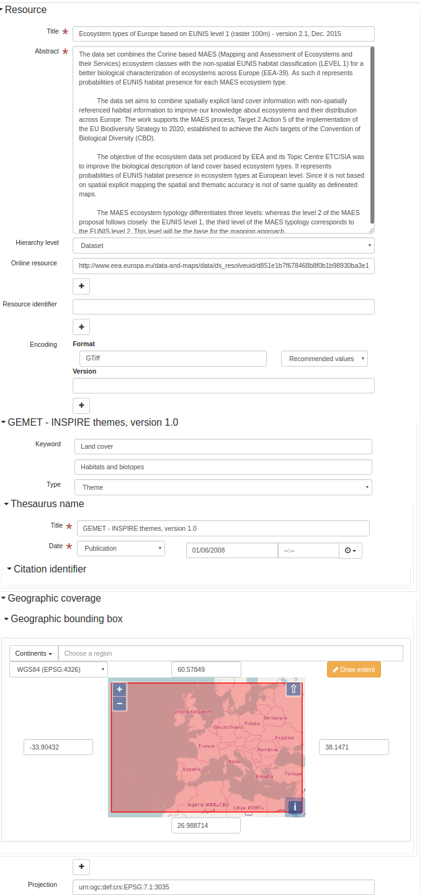
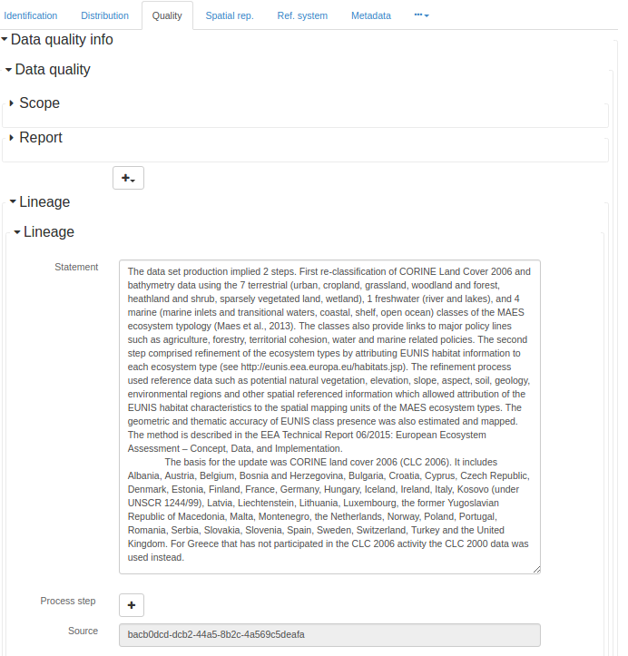
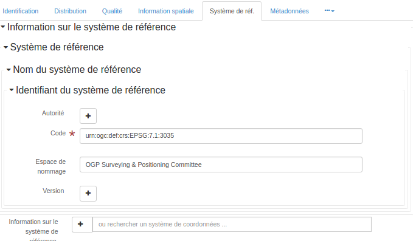

# Геаграфічная інфармацыя — Метаданыя (iso19139:2007) (iso19139) {#iso19139}

ISO 19115 вызначае схему, неабходную для апісання геаграфічнай інфармацыі і паслуг з дапамогай метаданых. Ён дае інфармацыю пра ідэнтыфікацыю, ахоп, якасць, прасторавыя і часавыя аспекты, змест, прасторавае прывязванне, адлюстраванне, распаўсюджванне і іншыя ўласцівасці лічбавых геаграфічных даных і паслуг.

ISO 19115 прымянімы да:

-   каталагізацыі ўсіх тыпаў рэсурсаў, дзейнасці клірынгавых цэнтраў і поўнага апісання набораў даных і паслуг;
-   геаграфічных паслуг, геаграфічных набораў даных, серый набораў даных, а таксама асобных геаграфічных аб'ектаў і ўласцівасцей аб'ектаў.

ISO 19115 вызначае:

-   абавязковыя і ўмоўныя раздзелы метаданых, сутнасці метаданых і элементы метаданых;
-   мінімальны набор метаданых, неабходны для большасці прыкладанняў метаданых (выяўленне даных, вызначэнне прыдатнасці даных для выкарыстання, доступ да даных, перадача даных, а таксама выкарыстанне лічбавых даных і паслуг);
-   неабавязковыя элементы метаданых, якія дазваляюць пры неабходнасці пашырыць стандартнае апісанне рэсурсаў;
-   метад пашырэння метаданых для задавальнення спецыялізаваных патрэб.

Хоць ISO 19115 прымянімы да лічбавых даных і паслуг, яго прынцыпы могуць быць распаўсюджаны на многія іншыя тыпы рэсурсаў, такія як карты, дыяграмы і тэкставыя дакументы, а таксама негеаграфічныя даныя. Некаторыя ўмоўныя элементы метаданых могуць не прымяняцца да гэтых іншых формаў даных.

Дадатковая інфармацыя: <https://www.iso.org/iso/home/store/catalogue_tc/catalogue_detail.htm?csnumber=53798>

## Рэдактар метаданых

Гэты стандарт можа быць закадзіраваны з выкарыстаннем 4 прадстаўленняў (view).

-   [Прадстаўленне: INSPIRE (inspire)](iso19139.md#iso19139-view-inspire)
-   [Прадстаўленне: Простае (simple)](iso19139.md#iso19139-view-default)
-   [Прадстаўленне: Поўнае (full)](iso19139.md#iso19139-view-advanced)
-   [Прадстаўленне: XML (xml)](iso19139.md#iso19139-view-xml)

### Прадстаўленне: INSPIRE (inspire) {#iso19139-view-inspire}

Гэта прадстаўленне складаецца з 2 укладак (tab).

-   [Укладка: INSPIRE (inspire)](iso19139.md#iso19139-tab-inspire)
-   [Укладка: SDS (inspire_sds)](iso19139.md#iso19139-tab-inspire_sds)

Гэта прадстаўленне таксама дазваляе дадаць наступны элемент, нават калі яго няма ў бягучым запісе:

-   Змяшчае аперацыі (srv:containsOperations)
-   Аперацыя (srv:SV_OperationMetadata)
-   Параметры (srv:parameters)

#### Укладка: INSPIRE (inspire) {#iso19139-tab-inspire}



На гэтай укладцы адлюстроўваюцца элементы з XML-запісу метаданых.

##### Раздзел: Ідэнтыфікацыя

##### Ідэнтыфікатар файла

```{=html}
Унікальны ідэнтыфікатар для гэтага файла метаданых
```

XPath

:   

> /gmd:MD_Metadata/gmd:fileIdentifier

Гл. [Ідэнтыфікатар файла](iso19139.md#iso19139-elem-gmd-fileIdentifier-353be7794d17e5435ce2fe57d91966ba)

##### Загаловак (назва)

```{=html}
Імя, пад якім вядомы цытуемы рэсурс
```

XPath

:   

> /gmd:MD_Metadata/gmd:identificationInfo/*/gmd:citation/gmd:CI_Citation/gmd:title

Гл. [Загаловак](iso19139.md#iso19139-elem-gmd-title-cc3002a2d81bcdbc5bf4c8735faf6980)

##### Анатацыя

```{=html}
Кароткае апісальнае рэзюмэ зместу рэсурсу(аў)
```

XPath

:   

> /gmd:MD_Metadata/gmd:identificationInfo/gmd:MD_DataIdentification/gmd:abstract

Гл. [Анатацыя](iso19139.md#iso19139-elem-gmd-abstract-cacfcd3bd6bbd44733f828dd2903ecd8)

##### Анатацыя

```{=html}
Кароткае апісальнае рэзюмэ зместу рэсурсу(аў)
```

XPath

:   

> /gmd:MD_Metadata/gmd:identificationInfo/srv:SV_ServiceIdentification/gmd:abstract

Гл. [Анатацыя](iso19139.md#iso19139-elem-gmd-abstract-cacfcd3bd6bbd44733f828dd2903ecd8)

##### Узровень іерархіі

```{=html}
Вобласць, да якой адносяцца метаданыя (гл. дадатак H для атрымання дадатковай інфармацыі пра ўзроўні іерархіі метаданых)
```

XPath

:   

> /gmd:MD_Metadata/gmd:hierarchyLevel

Гл. [Узровень іерархіі](iso19139.md#iso19139-elem-gmd-hierarchyLevel-2b6d53b433d8f9c0cc58606d27eecc17)

Імя

:   

> Узровень іерархіі

Імя

:   

> Узровень іерархіі

Тып

:   

> дадаць

Адлюстроўваецца толькі калі

:   

> count(gmd:MD_Metadata/gmd:identificationInfo/srv:SV_ServiceIdentification) = 0

``` xml
<gmd:hierarchyLevel xmlns:xsi="http://www.w3.org/2001/XMLSchema-instance"
                    xmlns:xlink="http://www.w3.org/1999/xlink">
   <gmd:MD_ScopeCode codeList="http://standards.iso.org/iso/19139/resources/gmxCodelists.xml#MD_ScopeCode"
                     codeListValue="dataset"/>
</gmd:hierarchyLevel>
```

##### Анлайн-рэсурс

##### Анлайн-рэсурс

```{=html}
Інфармацыя пра анлайн-крыніцы, з якіх можна атрымаць рэсурс
```

XPath

:   

> /gmd:MD_Metadata/gmd:distributionInfo/gmd:MD_Distribution/gmd:transferOptions /gmd:MD_DigitalTransferOptions/gmd:onLine

Гл. [Анлайн-рэсурс](iso19139.md#iso19139-elem-gmd-onLine-c0b191c96e7e4d7dfc2a4ba2fd8946f4)

##### Ідэнтыфікатар рэсурсу

##### Ідэнтыфікатар цытавання

```{=html}
Ідэнтыфікатар цытавання
```

XPath

:   

> /gmd:MD_Metadata/gmd:identificationInfo/gmd:MD_DataIdentification/gmd:citation/gmd:CI_Citation/gmd:identifier

Гл. [Ідэнтыфікатар](iso19139.md#iso19139-elem-gmd-identifier-c4f31fd808ee0eaa1e5525c5ff0edd23)

##### Мова

```{=html}
Мова(ы), якая выкарыстоўваецца(цца) у наборы даных
```

XPath

:   

> /gmd:MD_Metadata/gmd:identificationInfo/gmd:MD_DataIdentification/gmd:language

Гл. [Мова метаданых](iso19139.md#iso19139-elem-gmd-language-98a1fec5ea30c100ef63f1ca4bd6dbdb)

##### Тып прасторавага прадстаўлення

```{=html}
Метад, які выкарыстоўваецца для прасторавага прадстаўлення геаграфічнай інфармацыі
```

XPath

:   

> /gmd:MD_Metadata/gmd:identificationInfo/gmd:MD_DataIdentification/gmd:spatialRepresentationType

Гл. [Тып прасторавага прадстаўлення](iso19139.md#iso19139-elem-gmd-spatialRepresentationType-1617a07231ac2246d0844778962d4ca0)

##### Кадзіроўка

##### Фармат распаўсюджвання

```{=html}
Дае апісанне фармату даных, якія распаўсюджваюцца
```

XPath

:   

> /gmd:MD_Metadata/gmd:distributionInfo/gmd:MD_Distribution/gmd:distributionFormat

Гл. [Фармат распаўсюджвання](iso19139.md#iso19139-elem-gmd-distributionFormat-5cad81c9a7af3991db918a5e8fc0c596)

##### Праекцыя

##### Ідэнтыфікатар сістэмы каардынат (спасылкі)

```{=html}
Імя сістэмы каардынат
```

XPath

:   

> /gmd:MD_Metadata/gmd:referenceSystemInfo/gmd:MD_ReferenceSystem/gmd:referenceSystemIdentifier

Гл. [Ідэнтыфікатар сістэмы спасылкі](iso19139.md#iso19139-elem-gmd-referenceSystemIdentifier-5393a29789a4b6def1795d5a9e70f665)

##### Раздзел: Класіфікацыя даных і паслуг

##### Тэматычная катэгорыя

```{=html}
Асноўная(ыя) тэма(ы) набору даных
```

XPath

:   

> /gmd:MD_Metadata/gmd:identificationInfo/gmd:MD_DataIdentification/gmd:topicCategory

Гл. [Тэматычная катэгорыя](iso19139.md#iso19139-elem-gmd-topicCategory-beb19f9aa38425d24bc8c438657fff74)

##### Раздзел: Класіфікацыя даных і паслуг

##### Тып паслугі

```{=html}
Імя тыпу паслугі з рэестра паслуг. Напрыклад, значэнні атрыбутаў nameSpace і name у GeneralName могуць быць 'OGC' і 'catalogue'
```
Рэкамендаваныя значэнні

| код               | пазнака                                         |
|-------------------|-------------------------------------------------|
| OGC:WMS           | OGC Web Map Service (OGC:WMS)                   |
| OGC:WFS           | OGC Web Feature Service (OGC:WFS)               |
| OGC:WCS           | OGC Web Coverage Service (OGC:WCS)              |
| W3C:HTML:DOWNLOAD | Спампоўка (W3C:HTML:DOWNLOAD)                   |
| W3C:HTML:LINK     | Інфармацыя (W3C:HTML:LINK)                     |
| discovery         | Паслуга выяўлення INSPIRE (discovery)           |
| view              | Паслуга прагляду INSPIRE (view)                 |
| download          | Паслуга спампоўкі INSPIRE (download)            |
| transformation    | Паслуга пераўтварэння INSPIRE (transformation) |
| other             | Іншыя паслугі INSPIRE (other)                   |

XPath

:   

> /gmd:MD_Metadata/gmd:identificationInfo/srv:SV_ServiceIdentification/srv:serviceType

Гл. [Тып паслугі](iso19139.md#iso19139-elem-srv-serviceType-31230933e2a7436c80955195b74bc0a0)

##### Тып спалучэння

```{=html}
Тып спалучэння
```

XPath

:   

> /gmd:MD_Metadata/gmd:identificationInfo/srv:SV_ServiceIdentification/srv:couplingType

Гл. [Тып спалучэння](iso19139.md#iso19139-elem-srv-couplingType-bc1606dff717a83807e97a1a3789e30a)

##### Раздзел: Спалучаны рэсурс

##### Спалучаны рэсурс

##### Працуе з (Operates On)

```{=html}
Дае інфармацыю пра наборы даных, з якімі працуе паслуга
```

XPath

:   

> /gmd:MD_Metadata/gmd:identificationInfo/srv:SV_ServiceIdentification/srv:operatesOn

Гл. [Працуе з](iso19139.md#iso19139-elem-srv-operatesOn-fc0165e60dcb452c05c9f1d95416b89a)

##### Раздзел: Ключавыя словы

XPath

:   

> /gmd:MD_Metadata/gmd:identificationInfo/srv:SV_ServiceIdentification/ gmd:descriptiveKeywords [gmd:MD_Keywords/gmd:thesaurusName/gmd:CI_Citation/gmd:title/gco:CharacterString = 'INSPIRE Service taxonomy']

Гл. [Апісальныя ключавыя словы](iso19139.md#iso19139-elem-gmd-descriptiveKeywords-d9044aa0856cf55d016da575dc037fa3)

##### Раздзел: Іншыя ключавыя словы

XPath

:   

> /gmd:MD_Metadata/gmd:identificationInfo/srv:SV_ServiceIdentification/ gmd:descriptiveKeywords[not(gmd:MD_Keywords/gmd:thesaurusName)]

Гл. [Апісальныя ключавыя словы](iso19139.md#iso19139-elem-gmd-descriptiveKeywords-d9044aa0856cf55d016da575dc037fa3)

##### Раздзел: Геаграфічны ахоп

##### Геаграфічная абмяжоўваючая рамка

```{=html}
Геаграфічнае становішча набору даных
```

XPath

:   

> /gmd:MD_Metadata/gmd:identificationInfo/srv:SV_ServiceIdentification/ srv:extent/gmd:EX_Extent/gmd:geographicElement/gmd:EX_GeographicBoundingBox

Гл. [Геаграфічная абмяжоўваючая рамка](iso19139.md#iso19139-elem-gmd-EX_GeographicBoundingBox-317fd5425b55f40c235ada8a89ee0519)

##### Раздзел: Часавая прывязка

##### Часавы ахоп

##### Часавы элемент

```{=html}
Дае часавы кампанент ахопу аб'екта, на які спасылаюцца
```

XPath

:   

> /gmd:MD_Metadata/gmd:identificationInfo/gmd:MD_DataIdentification/gmd:extent/gmd:EX_Extent/gmd:temporalElement

Гл. [Часавы элемент](iso19139.md#iso19139-elem-gmd-temporalElement-98c13f1732cd7f7c06320d907eec27ce)

##### Раздзел: Якасць і даставернасць

##### Паходжанне (Lineage)

##### Заява

```{=html}
Агульнае тлумачэнне ведаў вытворцы даных пра паходжанне набору даных
```

XPath

:   

> /gmd:MD_Metadata/gmd:dataQualityInfo/gmd:DQ_DataQuality/gmd:lineage/gmd:LI_Lineage/gmd:statement

Гл. [Заява](iso19139.md#iso19139-elem-gmd-statement-593ac58687a7831e3112879ec00a306e)

##### Назоўнік (Denominator)

```{=html}
Лік пад рысай у простым дробе
```
Рэкамендаваныя значэнні

| код     | пазнака     |
|---------|-------------|
| 5000    | 1:5'000     |
| 10000   | 1:10'000    |
| 25000   | 1:25'000    |
| 50000   | 1:50'000    |
| 100000  | 1:100'000   |
| 200000  | 1:200'000   |
| 300000  | 1:300'000   |
| 500000  | 1:500'000   |
| 1000000 | 1:1'000'000 |

XPath

:   

> /gmd:MD_Metadata/gmd:identificationInfo/ */gmd:spatialResolution/ */gmd:equivalentScale/*/gmd:denominator

Гл. [Назоўнік](iso19139.md#iso19139-elem-gmd-denominator-e807028ba183b3decd6aa631d0ca1ca3)

##### Дыстанцыя

```{=html}
Дазвол па зямной паверхні (Ground sample distance)
```
Рэкамендаваныя значэнні

| код | пазнака |
|-----|---------|
| 0.10| 10 см   |
| 0.25| 25 см   |
| 0.50| 50 см   |
| 1   | 1 м     |
| 30  | 30 м    |
| 100 | 100 м   |

XPath

:   

> /gmd:MD_Metadata/gmd:identificationInfo/ */gmd:spatialResolution/*/gmd:distance

Гл. [Дыстанцыя](iso19139.md#iso19139-elem-gmd-distance-7b7fc9e19c5ebb9644dc51880d95a12d)

##### Раздзел: Адпаведнасць

##### Адпаведнасць

##### Вынік

```{=html}
Значэнне (або набор значэнняў), атрыманае ў выніку прымянення меры якасці даных, або вынік ацэнкі атрыманага значэння (або набору значэнняў) на адпаведнасць зададзенаму ўзроўню якасці
```

XPath

:   

> /gmd:MD_Metadata/gmd:dataQualityInfo/gmd:DQ_DataQuality/ gmd:report/gmd:DQ_DomainConsistency/gmd:result[count(gmd:DQ_ConformanceResult/gmd:specification/ gmd:CI_Citation/gmd:title/gmx:Anchor) > 0]

Гл. [Вынік](iso19139.md#iso19139-elem-gmd-result-83539788e54d2fc7d166ac779dc43f0b)

##### Раздзел: Абмежаванні доступу і выкарыстання

##### Абмежаванне выкарыстання

```{=html}
Абмежаванне, якое ўплывае на прыдатнасць выкарыстання рэсурсу. Прыклад: _не выкарыстоўваць для навігацыі_
```

XPath

:   

> /gmd:MD_Metadata/gmd:identificationInfo/gmd:MD_DataIdentification/ gmd:resourceConstraints/gmd:MD_Constraints/gmd:useLimitation

Гл. [Абмежаванне выкарыстання](iso19139.md#iso19139-elem-gmd-useLimitation-07252e81be8d86aea4553aa3df807d8b)

##### Абмежаванні доступу

##### Іншыя абмежаванні

```{=html}
Іншыя абмежаванні і юрыдычныя перадумовы для доступу і выкарыстання рэсурсу
```

XPath

:   

> /gmd:MD_Metadata/gmd:identificationInfo/gmd:MD_DataIdentification/ gmd:resourceConstraints/gmd:MD_LegalConstraints/gmd:otherConstraints

Гл. [Іншыя абмежаванні](iso19139.md#iso19139-elem-gmd-otherConstraints-696de5ef421a230cf560f7566a3c5028)

##### Section: Responsible organization (s)

##### Contact for the resource

##### Point of contact

```{=html}
Ідэнтыфікацыя і сродкі сувязі з асобай(амі) і арганізацыяй(ямі), звязанымі з рэсурсам(амі)
```

XPath

:   

> /gmd:MD_Metadata/gmd:identificationInfo/*/gmd:pointOfContact

Гл. [Point of contact](iso19139.md#iso19139-elem-gmd-pointOfContact-2a38035f4c8b63a35a4e6c44e6f4b624)

Name

:   

> Contact for the resource

Type

:   

> add

``` xml
<gmd:pointOfContact xmlns:xsi="http://www.w3.org/2001/XMLSchema-instance"
                    xmlns:xlink="http://www.w3.org/1999/xlink">
   <gmd:CI_ResponsibleParty>
      <gmd:organisationName gco:nilReason="missing">
         <gco:CharacterString/>
      </gmd:organisationName>
      <gmd:contactInfo>
         <gmd:CI_Contact>
            <gmd:address>
               <gmd:CI_Address>
                  <gmd:electronicMailAddress gco:nilReason="missing">
                     <gco:CharacterString/>
                  </gmd:electronicMailAddress>
               </gmd:CI_Address>
            </gmd:address>
         </gmd:CI_Contact>
      </gmd:contactInfo>
      <gmd:role>
         <gmd:CI_RoleCode codeList="http://standards.iso.org/iso/19139/resources/gmxCodelists.xml#CI_RoleCode"
                          codeListValue="resourceProvider"/>
      </gmd:role>
   </gmd:CI_ResponsibleParty>
</gmd:pointOfContact>
```

##### Section: Responsible organization (s)

##### Contact for the resource

##### Point of contact

```{=html}
Ідэнтыфікацыя і сродкі сувязі з асобай(амі) і арганізацыяй(ямі), звязанымі з рэсурсам(амі)
```

XPath

:   

> /gmd:MD_Metadata/gmd:identificationInfo/*/gmd:pointOfContact

Гл. [Point of contact](iso19139.md#iso19139-elem-gmd-pointOfContact-2a38035f4c8b63a35a4e6c44e6f4b624)

Name

:   

> Contact for the resource

Type

:   

> add

``` xml
<gmd:pointOfContact xmlns:xsi="http://www.w3.org/2001/XMLSchema-instance"
                    xmlns:xlink="http://www.w3.org/1999/xlink">
   <gmd:CI_ResponsibleParty>
      <gmd:organisationName gco:nilReason="missing">
         <gco:CharacterString/>
      </gmd:organisationName>
      <gmd:contactInfo>
         <gmd:CI_Contact>
            <gmd:address>
               <gmd:CI_Address>
                  <gmd:electronicMailAddress gco:nilReason="missing">
                     <gco:CharacterString/>
                  </gmd:electronicMailAddress>
               </gmd:CI_Address>
            </gmd:address>
         </gmd:CI_Contact>
      </gmd:contactInfo>
      <gmd:role>
         <gmd:CI_RoleCode codeList="http://standards.iso.org/iso/19139/resources/gmxCodelists.xml#CI_RoleCode"
                          codeListValue="resourceProvider"/>
      </gmd:role>
   </gmd:CI_ResponsibleParty>
</gmd:pointOfContact>
```

##### Section: Metadata information

##### Contact for the metadata

##### Contact

```{=html}
Бак, адказны за інфармацыю аб метаданых
```

XPath

:   

> /gmd:MD_Metadata/gmd:contact

Гл. [Metadata author](iso19139.md#iso19139-elem-gmd-contact-1a17bee429a4ae3c87f4026bd2da8005)

Name

:   

> Contact for the metadata

Type

:   

> add

``` xml
<gmd:contact xmlns:xsi="http://www.w3.org/2001/XMLSchema-instance"
             xmlns:xlink="http://www.w3.org/1999/xlink">
   <gmd:CI_ResponsibleParty>
      <gmd:organisationName gco:nilReason="missing">
         <gco:CharacterString/>
      </gmd:organisationName>
      <gmd:contactInfo>
         <gmd:CI_Contact>
            <gmd:address>
               <gmd:CI_Address>
                  <gmd:electronicMailAddress gco:nilReason="missing">
                     <gco:CharacterString/>
                  </gmd:electronicMailAddress>
               </gmd:CI_Address>
            </gmd:address>
         </gmd:CI_Contact>
      </gmd:contactInfo>
      <gmd:role>
         <gmd:CI_RoleCode codeList="http://standards.iso.org/iso/19139/resources/gmxCodelists.xml#CI_RoleCode"
                          codeListValue="pointOfContact"/>
      </gmd:role>
   </gmd:CI_ResponsibleParty>
</gmd:contact>
```

##### Date stamp

```{=html}
Дата стварэння метаданых (ГГГГ-ММ-ДДTгг:хх:сс)
```

XPath

:   

> /gmd:MD_Metadata/gmd:dateStamp

Гл. [Date stamp](iso19139.md#iso19139-elem-gmd-dateStamp-ee89eb65741d89aef14d153887f60948)

##### Metadata language

```{=html}
Мова, якая выкарыстоўваецца для дакументавання метаданых
```

XPath

:   

> /gmd:MD_Metadata/gmd:language

Гл. [Metadata language](iso19139.md#iso19139-elem-gmd-language-98a1fec5ea30c100ef63f1ca4bd6dbdb)

Name

:   

> Metadata language

Name

:   

Type

:   

> add

``` xml
<gmd:language xmlns:xsi="http://www.w3.org/2001/XMLSchema-instance"
              xmlns:xlink="http://www.w3.org/1999/xlink">
   <gmd:LanguageCode codeList="http://www.loc.gov/standards/iso639-2/" codeListValue="eng"/>
</gmd:language>
```

##### Character set

```{=html}
Поўная назва стандарту кадыроўкі сімвалаў, які выкарыстоўваецца для набору даных
```

XPath

:   

> /gmd:MD_Metadata/gmd:identificationInfo/gmd:MD_DataIdentification/gmd:characterSet

Гл. [Character set](iso19139.md#iso19139-elem-gmd-characterSet-351330c9787387f916fed1143727215b)

#### Tab: SDS (inspire_sds) {#iso19139-tab-inspire_sds}

Гэтая ўкладка адлюстроўвае элементы з запісу метаданых XML.

##### Section: Conformance class 1: invocable

Type

:   

> process

Displayed only if

:   

> count(gmd:MD_Metadata/gmd:dataQualityInfo/gmd:DQ_DataQuality[gmd:scope/gmd:DQ_Scope/gmd:level/gmd:<MD_ScopeCode/@codeListValue>='service'])=0

Type

:   

> process

Displayed only if

:   

> count(gmd:MD_Metadata/gmd:dataQualityInfo/gmd:DQ_DataQuality[gmd:scope/gmd:DQ_Scope/gmd:level/gmd:<MD_ScopeCode/@codeListValue>='service']/gmd:report/gmd:DQ_DomainConsistency/gmd:result/gmd:DQ_ConformanceResult/gmd:specification/gmd:CI_Citation/gmd:title/gco:CharacterString)>0

##### Category

##### Data quality

```{=html}
Інфармацыя аб якасці даных, вызначаная вобласцю ахопу якасці даных
```

XPath

:   

> /gmd:MD_Metadata/gmd:dataQualityInfo/gmd:DQ_DataQuality[gmd:scope/gmd:DQ_Scope/gmd:level/gmd:<MD_ScopeCode/@codeListValue>='service']/gmd:report/gmd:DQ_DomainConsistency/gmd:result/gmd:DQ_ConformanceResult/gmd:specification/gmd:CI_Citation/gmd:title

Гл. [Data quality](iso19139.md#iso19139-elem-gmd-DQ_DataQuality-16d17a37284f157b42d492a5960b5171)

##### Data quality

```{=html}
Інфармацыя аб якасці даных, вызначаная вобласцю ахопу якасці даных
```

XPath

:   

> /gmd:MD_Metadata/gmd:dataQualityInfo/gmd:DQ_DataQuality[gmd:scope/gmd:DQ_Scope/gmd:level/gmd:<MD_ScopeCode/@codeListValue>='service']/gmd:report/gmd:DQ_DomainConsistency/gmd:result/gmd:DQ_ConformanceResult/gmd:pass

Гл. [Data quality](iso19139.md#iso19139-elem-gmd-DQ_DataQuality-16d17a37284f157b42d492a5960b5171)

Name

:   

> Add pass element

Type

:   

> add

``` xml
<gmd:pass xmlns:xsi="http://www.w3.org/2001/XMLSchema-instance"
          xmlns:xlink="http://www.w3.org/1999/xlink">
   <gco:Boolean>true</gco:Boolean>
</gmd:pass>
```

##### Access Point URL

##### OnLine resource

```{=html}
Інфармацыя пра анлайн-рэсурсы, з якіх можа быць атрыманы рэсурс
```

XPath

:   

> /gmd:MD_Metadata/gmd:distributionInfo/gmd:MD_Distribution//gmd:transferOptions/gmd:MD_DigitalTransferOptions/gmd:onLine[gmd:CI_OnlineResource/gmd:description/gmx:Anchor/text() = 'accessPoint']

Гл. [OnLine resource](iso19139.md#iso19139-elem-gmd-onLine-c0b191c96e7e4d7dfc2a4ba2fd8946f4)

Name

:   

> Add Access Point

Type

:   

> add

``` xml
<gmd:onLine xmlns:xsi="http://www.w3.org/2001/XMLSchema-instance"
            xmlns:xlink="http://www.w3.org/1999/xlink">
   <gmd:CI_OnlineResource>
      <gmd:linkage>
         <gmd:URL>http://accesspoint.url</gmd:URL>
      </gmd:linkage>
      <gmd:description>
         <gmx:Anchor xlink:href="http://inspire.ec.europa.eu/registry/metadata-codelist/ResourceLocatorDescription/accessPoint">
                        accessPoint
                      </gmx:Anchor>
      </gmd:description>
      <gmd:function>
         <gmd:CI_OnLineFunctionCode codeList="http://www.isotc211.org/2005/resources/Codelist/gmxCodelists.xml#CI_OnLineFunctionCode"
                                    codeListValue="information"/>
      </gmd:function>
   </gmd:CI_OnlineResource>
</gmd:onLine>
```

##### Endpoint URL

##### OnLine resource

```{=html}
Інфармацыя пра анлайн-рэсурсы, з якіх можа быць атрыманы рэсурс
```

XPath

:   

> /gmd:MD_Metadata/gmd:distributionInfo/gmd:MD_Distribution//gmd:transferOptions/gmd:MD_DigitalTransferOptions/gmd:onLine[gmd:CI_OnlineResource/gmd:description/gmx:Anchor/text() = 'endPoint']

Гл. [OnLine resource](iso19139.md#iso19139-elem-gmd-onLine-c0b191c96e7e4d7dfc2a4ba2fd8946f4)

Name

:   

> Add Endpoint

Type

:   

> add

``` xml
<gmd:onLine xmlns:xsi="http://www.w3.org/2001/XMLSchema-instance"
            xmlns:xlink="http://www.w3.org/1999/xlink">
   <gmd:CI_OnlineResource>
      <gmd:linkage>
         <gmd:URL>http://endpoint.url</gmd:URL>
      </gmd:linkage>
      <gmd:description>
         <gmx:Anchor xlink:href="http://inspire.ec.europa.eu/registry/metadata-codelist/ResourceLocatorDescription/endPoint">
                        endPoint
                      </gmx:Anchor>
      </gmd:description>
      <gmd:function>
         <gmd:CI_OnLineFunctionCode codeList="http://www.isotc211.org/2005/resources/Codelist/gmxCodelists.xml#CI_OnLineFunctionCode"
                                    codeListValue="information"/>
      </gmd:function>
   </gmd:CI_OnlineResource>
</gmd:onLine>
```

##### Technical specification

##### Data quality

```{=html}
Інфармацыя аб якасці даных, вызначаная вобласцю ахопу якасці даных
```

XPath

:   

> /gmd:MD_Metadata/gmd:dataQualityInfo/gmd:DQ_DataQuality[gmd:scope/gmd:DQ_Scope/gmd:level/gmd:<MD_ScopeCode/@codeListValue>='service']/gmd:report/gmd:DQ_DomainConsistency/gmd:result

Гл. [Data quality](iso19139.md#iso19139-elem-gmd-DQ_DataQuality-16d17a37284f157b42d492a5960b5171)

Name

:   

> Add a technical specification

Type

:   

> add

``` xml
<gmd:report xmlns:xsi="http://www.w3.org/2001/XMLSchema-instance"
            xmlns:xlink="http://www.w3.org/1999/xlink">
   <gmd:DQ_FormatConsistency>
      <gmd:result>
         <gmd:DQ_ConformanceResult>
            <gmd:specification>
               <gmd:CI_Citation>
                  <gmd:title>
                     <gmx:Anchor xlink:href=" http://link,to/the.technical.specification">
                                Description of technical specification
                              </gmx:Anchor>
                  </gmd:title>
                  <gmd:date>
                     <gmd:CI_Date>
                        <gmd:date>
                           <gco:Date>2014-12-11</gco:Date>
                        </gmd:date>
                        <gmd:dateType>
                           <gmd:CI_DateTypeCode codeList="http://www.isotc211.org/2005/resources/Codelist/gmxCodelists.xml#CI_DateTypeCode"
                                                codeListValue="publication"/>
                        </gmd:dateType>
                     </gmd:CI_Date>
                  </gmd:date>
               </gmd:CI_Citation>
            </gmd:specification>
            <gmd:explanation>
               <gco:CharacterString>Conformant to the cited specifications.
                          </gco:CharacterString>
            </gmd:explanation>
            <gmd:pass>
               <gco:Boolean>true</gco:Boolean>
            </gmd:pass>
         </gmd:DQ_ConformanceResult>
      </gmd:result>
   </gmd:DQ_FormatConsistency>
</gmd:report>
```

##### Section: Conformance class 2: interoperable

##### Section: Coordinate reference system

##### Anchor

```{=html}
Падтрымлівае магчымасці гіперспасылак і забяспечвае вэб-рэалізацыю CharacterStrings
```

XPath

:   

> gmd:MD_Metadata/gmd:referenceSystemInfo/gmd:MD_ReferenceSystem/gmd:referenceSystemIdentifier/gmd:RS_Identifier/gmd:code/gmx:Anchor

Гл. [Anchor](iso19139.md#iso19139-elem-gmx-Anchor-d0ccf7ef89bd129a31fe766fae38f1df)

Name

:   

> Projection

Type

:   

> add

``` xml
<gmd:referenceSystemInfo xmlns:xsi="http://www.w3.org/2001/XMLSchema-instance"
                         xmlns:xlink="http://www.w3.org/1999/xlink">
   <gmd:MD_ReferenceSystem>
      <gmd:referenceSystemIdentifier>
         <gmd:RS_Identifier>
            <gmd:code>
               <gmx:Anchor xlink:href="http://www.opengis.net/def/crs/EPSG/0/{{code}}"
                           xlink:title="{{description}}">{{code}}
                            </gmx:Anchor>
            </gmd:code>
         </gmd:RS_Identifier>
      </gmd:referenceSystemIdentifier>
   </gmd:MD_ReferenceSystem>
</gmd:referenceSystemInfo>
```

##### Section: Quality of Service

Type

:   

> process

Displayed only if

:   

> (count(gmd:MD_Metadata/gmd:dataQualityInfo/gmd:DQ_DataQuality[gmd:scope/gmd:DQ_Scope/gmd:level/gmd:<MD_ScopeCode/@codeListValue>='service'])>0 and (count(gmd:MD_Metadata/gmd:dataQualityInfo/gmd:DQ_DataQuality[gmd:scope/gmd:DQ_Scope/gmd:level/gmd:<MD_ScopeCode/@codeListValue>='service']/gmd:report/gmd:DQ_ConceptualConsistency/gmd:nameOfMeasure/gmx:Anchor[text()='availability'])=0 or count(gmd:MD_Metadata/gmd:dataQualityInfo/gmd:DQ_DataQuality[gmd:scope/gmd:DQ_Scope/gmd:level/gmd:<MD_ScopeCode/@codeListValue>='service']/gmd:report/gmd:DQ_ConceptualConsistency/gmd:nameOfMeasure/gmx:Anchor[text()='performance'])=0 or count(gmd:MD_Metadata/gmd:dataQualityInfo/gmd:DQ_DataQuality[gmd:scope/gmd:DQ_Scope/gmd:level/gmd:<MD_ScopeCode/@codeListValue>='service']/gmd:report/gmd:DQ_ConceptualConsistency/gmd:nameOfMeasure/gmx:Anchor[text()='capacity'])=0 ))

##### Conceptual consistency

```{=html}
Захаванне правіл канцэптуальнай схемы
```

XPath

:   

> /gmd:MD_Metadata/gmd:dataQualityInfo/gmd:DQ_DataQuality/gmd:report/gmd:DQ_ConceptualConsistency

Гл. [Conceptual consistency](iso19139.md#iso19139-elem-gmd-DQ_ConceptualConsistency-d42ad4a3a30578c7431606e8c1df4df8)

##### Section: Access constraints

##### Resource constraints

```{=html}
Прадастаўляе інфармацыю аб абмежаваннях, якія прымяняюцца да рэсурсу(аў)
```

XPath

:   

> /gmd:MD_Metadata/gmd:identificationInfo/srv:SV_ServiceIdentification/gmd:resourceConstraints[gmd:MD_LegalConstraints[gmd:accessConstraints]/gmd:otherConstraints/gmx:Anchor]

Гл. [Resource constraints](iso19139.md#iso19139-elem-gmd-resourceConstraints-3ce815f506c31e6b5ef8e4e7022eefad)

##### Limitation

##### Resource constraints

```{=html}
Прадастаўляе інфармацыю аб абмежаваннях, якія прымяняюцца да рэсурсу(аў)
```

XPath

:   

> /gmd:MD_Metadata/gmd:identificationInfo/srv:SV_ServiceIdentification/gmd:resourceConstraints[gmd:MD_LegalConstraints[gmd:accessConstraints]/gmd:otherConstraints[gco:CharacterString]]

Гл. [Resource constraints](iso19139.md#iso19139-elem-gmd-resourceConstraints-3ce815f506c31e6b5ef8e4e7022eefad)

Name

:   

> No Limitation

Type

:   

> add

Displayed only if

:   

> count(gmd:MD_Metadata/gmd:identificationInfo/srv:SV_ServiceIdentification/gmd:resourceConstraints/gmd:MD_LegalConstraints[gmd:accessConstraints]) = 0

``` xml
<gmd:resourceConstraints xmlns:xsi="http://www.w3.org/2001/XMLSchema-instance"
                         xmlns:xlink="http://www.w3.org/1999/xlink">
   <gmd:MD_LegalConstraints>
      <gmd:accessConstraints>
         <gmd:MD_RestrictionCode codeList="http://standards.iso.org/iso/19139/resources/gmxCodelists.xml#MD_RestrictionCode"
                                 codeListValue="otherRestrictions"/>
      </gmd:accessConstraints>
      <gmd:otherConstraints>
         <gmx:Anchor xlink:href="http://inspire.ec.europa.eu/registry/metadata-codelist/ConditionsApplyingToAccessAndUse/noConditionsApply">
                          No Conditions Apply
                        </gmx:Anchor>
      </gmd:otherConstraints>
   </gmd:MD_LegalConstraints>
</gmd:resourceConstraints>
```

Name

:   

> Unknown Limitation

Type

:   

> add

Displayed only if

:   

> count(gmd:MD_Metadata/gmd:identificationInfo/srv:SV_ServiceIdentification/gmd:resourceConstraints/gmd:MD_LegalConstraints[gmd:accessConstraints]) = 0

``` xml
<gmd:resourceConstraints xmlns:xsi="http://www.w3.org/2001/XMLSchema-instance"
                         xmlns:xlink="http://www.w3.org/1999/xlink">
   <gmd:MD_LegalConstraints>
      <gmd:accessConstraints>
         <gmd:MD_RestrictionCode codeList="http://standards.iso.org/iso/19139/resources/gmxCodelists.xml#MD_RestrictionCode"
                                 codeListValue="otherRestrictions"/>
      </gmd:accessConstraints>
      <gmd:otherConstraints>
         <gmx:Anchor xlink:href="http://inspire.ec.europa.eu/registry/metadata-codelist/ConditionsApplyingToAccessAndUse/conditionsUnknown">
                          Conditions Unknown
                        </gmx:Anchor>
      </gmd:otherConstraints>
   </gmd:MD_LegalConstraints>
</gmd:resourceConstraints>
```

Name

:   

> Customizable constraints

Type

:   

> add

Displayed only if

:   

> count(gmd:MD_Metadata/gmd:identificationInfo/srv:SV_ServiceIdentification/gmd:resourceConstraints/gmd:MD_LegalConstraints[gmd:accessConstraints]) = 0

``` xml
<gmd:resourceConstraints xmlns:xsi="http://www.w3.org/2001/XMLSchema-instance"
                         xmlns:xlink="http://www.w3.org/1999/xlink">
   <gmd:MD_LegalConstraints>
      <gmd:accessConstraints>
         <gmd:MD_RestrictionCode codeList="http://standards.iso.org/iso/19139/resources/gmxCodelists.xml#MD_RestrictionCode"
                                 codeListValue="otherRestrictions"/>
      </gmd:accessConstraints>
      <gmd:otherConstraints gco:nilReason="missing">
         <gco:CharacterString/>
      </gmd:otherConstraints>
   </gmd:MD_LegalConstraints>
</gmd:resourceConstraints>
```

##### Section: Use constraints

##### Resource constraints

```{=html}
Прадастаўляе інфармацыю аб абмежаваннях, якія прымяняюцца да рэсурсу(аў)
```

XPath

:   

> /gmd:MD_Metadata/gmd:identificationInfo/srv:SV_ServiceIdentification/gmd:resourceConstraints[gmd:MD_LegalConstraints[gmd:useConstraints]/gmd:otherConstraints/gmx:Anchor]

Гл. [Resource constraints](iso19139.md#iso19139-elem-gmd-resourceConstraints-3ce815f506c31e6b5ef8e4e7022eefad)

##### Limitation

##### Resource constraints

```{=html}
Прадастаўляе інфармацыю аб абмежаваннях, якія прымяняюцца да рэсурсу(аў)
```

XPath

:   

> /gmd:MD_Metadata/gmd:identificationInfo/srv:SV_ServiceIdentification/gmd:resourceConstraints[gmd:MD_LegalConstraints[gmd:useConstraints]/gmd:otherConstraints[gco:CharacterString]]

Гл. [Resource constraints](iso19139.md#iso19139-elem-gmd-resourceConstraints-3ce815f506c31e6b5ef8e4e7022eefad)

Name

:   

> No Limitation

Type

:   

> add

Displayed only if

:   

> count(gmd:MD_Metadata/gmd:identificationInfo/srv:SV_ServiceIdentification/gmd:resourceConstraints/gmd:MD_LegalConstraints[gmd:useConstraints]) = 0

``` xml
<gmd:resourceConstraints xmlns:xsi="http://www.w3.org/2001/XMLSchema-instance"
                         xmlns:xlink="http://www.w3.org/1999/xlink">
   <gmd:MD_LegalConstraints>
      <gmd:useConstraints>
         <gmd:MD_RestrictionCode codeList="http://standards.iso.org/iso/19139/resources/gmxCodelists.xml#MD_RestrictionCode"
                                 codeListValue="otherRestrictions"/>
      </gmd:useConstraints>
      <gmd:otherConstraints>
         <gmx:Anchor xlink:href="http://inspire.ec.europa.eu/registry/metadata-codelist/ConditionsApplyingToAccessAndUse/noConditionsApply">
                          No Conditions Apply
                        </gmx:Anchor>
      </gmd:otherConstraints>
   </gmd:MD_LegalConstraints>
</gmd:resourceConstraints>
```

Name

:   

> Unknown Limitation

Type

:   

> add

Displayed only if

:   

> count(gmd:MD_Metadata/gmd:identificationInfo/srv:SV_ServiceIdentification/gmd:resourceConstraints/gmd:MD_LegalConstraints[gmd:useConstraints]) = 0

``` xml
<gmd:resourceConstraints xmlns:xsi="http://www.w3.org/2001/XMLSchema-instance"
                         xmlns:xlink="http://www.w3.org/1999/xlink">
   <gmd:MD_LegalConstraints>
      <gmd:useConstraints>
         <gmd:MD_RestrictionCode codeList="http://standards.iso.org/iso/19139/resources/gmxCodelists.xml#MD_RestrictionCode"
                                 codeListValue="otherRestrictions"/>
      </gmd:useConstraints>
      <gmd:otherConstraints>
         <gmx:Anchor xlink:href="http://inspire.ec.europa.eu/registry/metadata-codelist/ConditionsApplyingToAccessAndUse/conditionsUnknown">
                          Conditions Unknown
                        </gmx:Anchor>
      </gmd:otherConstraints>
   </gmd:MD_LegalConstraints>
</gmd:resourceConstraints>
```

Name

:   

> Customizable constraints

Type

:   

> add

Displayed only if

:   

> count(gmd:MD_Metadata/gmd:identificationInfo/srv:SV_ServiceIdentification/gmd:resourceConstraints/gmd:MD_LegalConstraints[gmd:useConstraints]) = 0

``` xml
<gmd:resourceConstraints xmlns:xsi="http://www.w3.org/2001/XMLSchema-instance"
                         xmlns:xlink="http://www.w3.org/1999/xlink">
   <gmd:MD_LegalConstraints>
      <gmd:useConstraints>
         <gmd:MD_RestrictionCode codeList="http://standards.iso.org/iso/19139/resources/gmxCodelists.xml#MD_RestrictionCode"
                                 codeListValue="otherRestrictions"/>
      </gmd:useConstraints>
      <gmd:otherConstraints gco:nilReason="missing">
         <gco:CharacterString/>
      </gmd:otherConstraints>
   </gmd:MD_LegalConstraints>
</gmd:resourceConstraints>
```

##### Section: Responsible custodian

##### Contact for the resource

##### Point of contact

```{=html}
Ідэнтыфікацыя і сродкі сувязі з асобай(амі) і арганізацыяй(ямі), звязанымі з рэсурсам(амі)
```

XPath

:   

> /gmd:MD_Metadata/gmd:identificationInfo/srv:SV_ServiceIdentification/gmd:pointOfContact[gmd:CI_ResponsibleParty/gmd:role/gmd:<CI_RoleCode/@codeListValue>='custodian']

Гл. [Point of contact](iso19139.md#iso19139-elem-gmd-pointOfContact-2a38035f4c8b63a35a4e6c44e6f4b624)

Name

:   

> Contact for the resource

Type

:   

> add

##### Section: Conformance class 3: harmonized

##### Contains Operations

```{=html}
Прадастаўляе інфармацыю аб аперацыях, з якіх складаецца сэрвіс
```

XPath

:   

> /gmd:MD_Metadata/gmd:identificationInfo/srv:SV_ServiceIdentification/srv:containsOperations

Гл. [Contains Operations](iso19139.md#iso19139-elem-srv-containsOperations-5765a967aadd33b5ba92cde03c9ce30e)

Name

:   

> Add Operation

Type

:   

> add

Displayed only if

:   

> count(gmd:MD_Metadata/gmd:identificationInfo/srv:SV_ServiceIdentification) > 0

``` xml
<srv:containsOperations xmlns:xsi="http://www.w3.org/2001/XMLSchema-instance"
                        xmlns:xlink="http://www.w3.org/1999/xlink">
   <srv:SV_OperationMetadata>
      <srv:operationName>
         <gco:CharacterString/>
      </srv:operationName>
      <srv:DCP>
         <srv:DCPList codeList="http://inspire.ec.europa.eu/metadata-codelist/DCPList"
                      codeListValue="webServices">Web services
                      </srv:DCPList>
      </srv:DCP>
      <srv:connectPoint>
         <gmd:CI_OnlineResource>
            <gmd:linkage>
               <gmd:URL>http://</gmd:URL>
            </gmd:linkage>
         </gmd:CI_OnlineResource>
      </srv:connectPoint>
   </srv:SV_OperationMetadata>
</srv:containsOperations>
```

### View: Simple (default) {#iso19139-view-default}

Гэты выгляд складаецца з 1 укладкі(ак).

-   [Tab: Simple (default)](iso19139.md#iso19139-tab-default)

Гэты выгляд таксама дазваляе дадаць наступны элемент, нават калі яго няма ў бягучым запісе:

-   Апісальныя ключавыя словы (gmd:descriptiveKeywords)
-   Ключавое слова (gmd:keyword)
-   Імя (gmd:name)
-   Прасторавы дазвол (gmd:spatialResolution)
-   Кантактная інфармацыя (gmd:pointOfContact)
-   Дыстрыб'ютар (gmd:distributor)
-   Фармат распаўсюджвання (gmd:distributionFormat)
-   Кантакт (gmd:contact)
-   Працэсар (gmd:processor)
-   Тэматычная катэгорыя (gmd:topicCategory)
-   Параметры (srv:parameters)

#### Tab: Simple (default) {#iso19139-tab-default}


Гэтая ўкладка адлюстроўвае элементы з запісу метаданых XML.

Instruction

:   

##### Linkage

```{=html}
Размяшчэнне (адрас) для анлайн-доступу з выкарыстаннем адраса Uniform Resource Locator або аналагічнай схемы адрасавання, напрыклад, http://www.statkart.no/isotc211
```

XPath

:   

> */gmd:linkage

Гл. [Linkage](iso19139.md#iso19139-elem-gmd-linkage-ddec55285da8318007d8ba8df6febcb5)

##### Name

XPath

:   

> */gmd:name

Гл. [Name](iso19139.md#iso19139-elem-gmd-name-9796db4d1cab411f64fa97871fd1dd7e)

Instruction

:   

##### Linkage

```{=html}
Размяшчэнне (адрас) для анлайн-доступу з выкарыстаннем адраса Uniform Resource Locator або аналагічнай схемы адрасавання, напрыклад, http://www.statkart.no/isotc211
```

XPath

:   

> */gmd:linkage

Гл. [Linkage](iso19139.md#iso19139-elem-gmd-linkage-ddec55285da8318007d8ba8df6febcb5)

##### Name

XPath

:   

> */gmd:name

Гл. [Name](iso19139.md#iso19139-elem-gmd-name-9796db4d1cab411f64fa97871fd1dd7e)

##### Section: Content Information

```{=html}
Прадастаўляе інфармацыю пра каталог аб'ектаў і апісвае характарыстыкі пакрыцця і даных выявы
```
Гл. [Content Information](iso19139.md#iso19139-elem-gmd-contentInfo-da18cd6a5e91bae67187adc15ff47622)

##### Included with dataset

```{=html}
Указанне таго, ці ўключаны каталог аб'ектаў у набор даных
```

XPath

:   

> gmd:MD_FeatureCatalogueDescription/gmd:includedWithDataset

Гл. [Included with dataset](iso19139.md#iso19139-elem-gmd-includedWithDataset-0148507e25f25653e843ec66cf6cb878)

##### Feature catalogue citation

```{=html}
Поўная бібліяграфічная спасылка на адзін або некалькі знешніх каталогаў аб'ектаў
```
Гл. [Feature catalogue citation](iso19139.md#iso19139-elem-gmd-featureCatalogueCitation-0d490aca236a02c867c265dc0656143b)

XPath

:   

> .

##### Feature catalogue citation

```{=html}
Поўная бібліяграфічная спасылка на адзін або некалькі знешніх каталогаў аб'ектаў
```
Гл. [Feature catalogue citation](iso19139.md#iso19139-elem-gmd-featureCatalogueCitation-0d490aca236a02c867c265dc0656143b)

XPath

:   

> .

Name

:   

Type

:   

> add

``` xml
<gmd:contentInfo xmlns:xsi="http://www.w3.org/2001/XMLSchema-instance"
                 xmlns:xlink="http://www.w3.org/1999/xlink">
   <gmd:MD_FeatureCatalogueDescription>
      <gmd:includedWithDataset>
         <gco:Boolean>true</gco:Boolean>
      </gmd:includedWithDataset>
      <gmd:featureCatalogueCitation uuidref=""/>
   </gmd:MD_FeatureCatalogueDescription>
</gmd:contentInfo>
```

### View: Full (advanced) {#iso19139-view-advanced}

Гэты выгляд складаецца з 11 укладкі(ак).

-   [Tab: Identification (identificationInfo)](iso19139.md#iso19139-tab-identificationInfo)
-   [Tab: Distribution (distributionInfo)](iso19139.md#iso19139-tab-distributionInfo)
-   [Tab: Quality (dataQualityInfo)](iso19139.md#iso19139-tab-dataQualityInfo)
-   [Tab: Spatial rep. (spatialRepresentationInfo)](iso19139.md#iso19139-tab-spatialRepresentationInfo)
-   [Tab: Ref. system (referenceSystemInfo)](iso19139.md#iso19139-tab-referenceSystemInfo)
-   [Tab: Content (contentInfo)](iso19139.md#iso19139-tab-contentInfo)
-   [Tab: Portrayal (portrayalCatalogueInfo)](iso19139.md#iso19139-tab-portrayalCatalogueInfo)
-   [Tab: Metadata (metadata)](iso19139.md#iso19139-tab-metadata)
-   [Tab: Md. constraints (metadataConstraints)](iso19139.md#iso19139-tab-metadataConstraints)
-   [Tab: Md. maintenance (metadataMaintenance)](iso19139.md#iso19139-tab-metadataMaintenance)
-   [Tab: Schema info (applicationSchemaInfo)](iso19139.md#iso19139-tab-applicationSchemaInfo)

#### Tab: Identification (identificationInfo) {#iso19139-tab-identificationInfo}


Гэтая ўкладка адлюстроўвае элементы з запісу метаданых XML, а таксама дае элементы кіравання для дадання ўсіх элементаў, вызначаных у схеме (XSD).

##### Section: Identification info

```{=html}
Базовая інфармацыя аб рэсурсе(ах), да якога(іх) прымяняюцца метаданыя
```
Гл. [Identification info](iso19139.md#iso19139-elem-gmd-identificationInfo-4fe68a205ff13feeccf0b58e08f39472)

#### Tab: Distribution (distributionInfo) {#iso19139-tab-distributionInfo}

Гэтая ўкладка адлюстроўвае элементы з запісу метаданых XML, а таксама дае элементы кіравання для дадання ўсіх элементаў, вызначаных у схеме (XSD).

##### Section: Distribution Information

```{=html}
Прадастаўляе інфармацыю пра дыстрыб'ютара і варыянты атрымання рэсурсу(аў)
```
Гл. [Distribution Information](iso19139.md#iso19139-elem-gmd-distributionInfo-3bddab6fda29c9ebd6f0ece68843fcff)

#### Tab: Quality (dataQualityInfo) {#iso19139-tab-dataQualityInfo}



Гэтая ўкладка адлюстроўвае элементы з запісу метаданых XML, а таксама дае элементы кіравання для дадання ўсіх элементаў, вызначаных у схеме (XSD).

##### Section: Data quality info

```{=html}
Прадастаўляе агульную ацэнку якасці рэсурсу(аў)
```
Гл. [Data quality info](iso19139.md#iso19139-elem-gmd-dataQualityInfo-9a53c25e2dacf5a7ab0aa1d155efc3dc)

#### Tab: Spatial rep. (spatialRepresentationInfo) {#iso19139-tab-spatialRepresentationInfo}

Гэтая ўкладка адлюстроўвае элементы з запісу метаданых XML, а таксама дае элементы кіравання для дадання ўсіх элементаў, вызначаных у схеме (XSD).

##### Section: Spatial representation info

```{=html}
Лічбавае прадстаўленне прасторавай інфармацыі ў наборы даных
```
Гл. [Spatial representation info](iso19139.md#iso19139-elem-gmd-spatialRepresentationInfo-f93705d4877ccd4c41819cc79677d6f2)

#### Tab: Ref. system (referenceSystemInfo) {#iso19139-tab-referenceSystemInfo}



Гэтая ўкладка адлюстроўвае элементы з запісу метаданых XML, а таксама дае элементы кіравання для дадання ўсіх элементаў, вызначаных у схеме (XSD).

##### Section: Reference System Information

```{=html}
Апісанне прасторавых і часавых сістэм каардынат, якія выкарыстоўваюцца ў наборы даных
```
Гл. [Reference System Information](iso19139.md#iso19139-elem-gmd-referenceSystemInfo-c7702a2e8ac03097e306ab3a02406765)

#### Tab: Content (contentInfo) {#iso19139-tab-contentInfo}

Гэтая ўкладка адлюстроўвае элементы з запісу метаданых XML, а таксама дае элементы кіравання для дадання ўсіх элементаў, вызначаных у схеме (XSD).

##### Section: Content Information

```{=html}
Прадастаўляе інфармацыю пра каталог аб'ектаў і апісвае характарыстыкі пакрыцця і даных выявы
```
Гл. [Content Information](iso19139.md#iso19139-elem-gmd-contentInfo-da18cd6a5e91bae67187adc15ff47622)

#### Tab: Portrayal (portrayalCatalogueInfo) {#iso19139-tab-portrayalCatalogueInfo}

Гэтая ўкладка адлюстроўвае элементы з запісу метаданых XML, а таксама дае элементы кіравання для дадання ўсіх элементаў, вызначаных у схеме (XSD).

##### Section: Portrayal catalogue info

```{=html}
Прадастаўляе інфармацыю пра каталог правіл, вызначаных для адлюстравання рэсурсу(аў)
```
Гл. [Portrayal catalogue info](iso19139.md#iso19139-elem-gmd-portrayalCatalogueInfo-0a09defe8c7ca8431460b5690da9a52d)

#### Tab: Metadata (metadata) {#iso19139-tab-metadata}

Гэтая ўкладка адлюстроўвае элементы з запісу метаданых XML, а таксама дае элементы кіравання для дадання ўсіх элементаў, вызначаных у схеме (XSD).

##### Section: Metadata

##### File identifier

```{=html}
Унікальны ідэнтыфікатар для гэтага файла метаданых
```

XPath

:   

> /gmd:MD_Metadata/gmd:fileIdentifier

Гл. [File identifier](iso19139.md#iso19139-elem-gmd-fileIdentifier-353be7794d17e5435ce2fe57d91966ba)

##### Metadata language

```{=html}
Мова, якая выкарыстоўваецца для дакументавання метаданых
```

XPath

:   

> /gmd:MD_Metadata/gmd:language

Гл. [Metadata language](iso19139.md#iso19139-elem-gmd-language-98a1fec5ea30c100ef63f1ca4bd6dbdb)

##### Other language

```{=html}
Выкарыстоўвайце гэты раздзел для вызначэння іншай мовы метаданых (шматмоўныя метаданыя).
```

XPath

:   

> /gmd:MD_Metadata/gmd:locale

Гл. [Other language](iso19139.md#iso19139-elem-gmd-locale-826113f1d130f65f95c78f6b16227c4b)

##### Character set

```{=html}
Поўная назва стандарту кадыроўкі сімвалаў, які выкарыстоўваецца для набору метаданых
```

XPath

:   

> /gmd:MD_Metadata/gmd:characterSet

Гл. [Character set](iso19139.md#iso19139-elem-gmd-characterSet-351330c9787387f916fed1143727215b)

##### Parent identifier

```{=html}
Ідэнтыфікатар файла метаданых, для якога гэтыя метаданыя з'яўляюцца падмноствам (даччыным элементам)
```

XPath

:   

> /gmd:MD_Metadata/gmd:parentIdentifier

Гл. [Parent identifier](iso19139.md#iso19139-elem-gmd-parentIdentifier-e660d48fcd79782e330d99a6eee272bc)

##### Hierarchy level

```{=html}
Вобласць, да якой прымяняюцца метаданыя (дадатковую інфармацыю пра ўзроўні іерархіі метаданых гл. у дадатку H)
```

XPath

:   

> /gmd:MD_Metadata/gmd:hierarchyLevel

Гл. [Hierarchy level](iso19139.md#iso19139-elem-gmd-hierarchyLevel-2b6d53b433d8f9c0cc58606d27eecc17)

##### Hierarchy level name

```{=html}
Назва ўзроўняў іерархіі, для якіх прадастаўлены метаданыя
```

XPath

:   

> /gmd:MD_Metadata/gmd:hierarchyLevelName

Гл. [Hierarchy level name](iso19139.md#iso19139-elem-gmd-hierarchyLevelName-1c79276b0501d07055d7480b292899f0)

##### Date stamp

```{=html}
Дата стварэння метаданых (ГГГГ-ММ-ДДTгг:хх:сс)
```

XPath

:   

> /gmd:MD_Metadata/gmd:dateStamp

Гл. [Date stamp](iso19139.md#iso19139-elem-gmd-dateStamp-ee89eb65741d89aef14d153887f60948)

##### Metadata standard name

```{=html}
Назва стандарту метаданых, які выкарыстоўваецца (уключаючы назву профілю)
```

XPath

:   

> /gmd:MD_Metadata/gmd:metadataStandardName

Гл. [Metadata standard name](iso19139.md#iso19139-elem-gmd-metadataStandardName-1e8d324f913f2da08b656d26e73e994d)

##### Metadata standard version

```{=html}
Версія (профіль) стандарту метаданых, якая выкарыстоўваецца
```

XPath

:   

> /gmd:MD_Metadata/gmd:metadataStandardVersion

Гл. [Metadata standard version](iso19139.md#iso19139-elem-gmd-metadataStandardVersion-ab0dd515a6ca9c890bc32d3615cd427f)

##### Contact

```{=html}
Бак, адказны за інфармацыю аб метаданых
```

XPath

:   

> /gmd:MD_Metadata/gmd:contact

Гл. [Metadata author](iso19139.md#iso19139-elem-gmd-contact-1a17bee429a4ae3c87f4026bd2da8005)

##### Dataset URI

```{=html}
Адзіны ідэнтыфікатар рэсурсу (URI) набору даных, да якога прымяняюцца метаданыя. Гэтая спасылка вядзе непасрэдна на машыначытальны набор даных.
```

XPath

:   

> /gmd:MD_Metadata/gmd:dataSetURI

Гл. [Dataset URI](iso19139.md#iso19139-elem-gmd-dataSetURI-8e14b3e6d98f92a9356ba2f3ba1ee982)

##### Series

```{=html}
Інфармацыя пра серыю ці агрэгаваны набор даных, часткай якога з'яўляецца гэты набор даных
```

XPath

:   

> /gmd:MD_Metadata/gmd:series

Гл. [Series](iso19139.md#iso19139-elem-gmd-series-98524248b047e1a31966f4fc05c765fb)

##### Describes

```{=html}
Апісвае
```

XPath

:   

> /gmd:MD_Metadata/gmd:describes

Гл. [Describes](iso19139.md#iso19139-elem-gmd-describes-ea7ef755fceda2ec8b1bf4486f5572bf)

##### PropertyType

```{=html}
Тып уласцівасці
```

XPath

:   

> /gmd:MD_Metadata/gmd:propertyType

Гл. [PropertyType](iso19139.md#iso19139-elem-gmd-propertyType-12fff0b8b43529f0300c32a5e13c9f89)

##### Feature type

```{=html}
Падмноства тыпаў аб'ектаў з цытаванага каталога аб'ектаў, якія прысутнічаюць у даных
```

XPath

:   

> /gmd:MD_Metadata/gmd:featureType

Гл. [Feature type](iso19139.md#iso19139-elem-gmd-featureType-1a7ddaf6d70b2bca513bbb097769f7a5)

##### Feature attribute

XPath

:   

> /gmd:MD_Metadata/gmd:featureAttribute

Гл. [Feature attribute](iso19139.md#iso19139-elem-gmd-featureAttribute-ed65880b0d966b5862d0d434b26fd36b)

#### Tab: Md. constraints (metadataConstraints) {#iso19139-tab-metadataConstraints}

Гэтая ўкладка адлюстроўвае элементы з запісу метаданых XML, а таксама дае элементы кіравання для дадання ўсіх элементаў, вызначаных у схеме (XSD).

##### Section: Metadata constraints

```{=html}
Прадастаўляе абмежаванні на доступ і выкарыстанне метаданых
```
Гл. [Metadata constraints](iso19139.md#iso19139-elem-gmd-metadataConstraints-0547cb4265a8d2f9663d558a9ac72d43)

#### Tab: Md. maintenance (metadataMaintenance) {#iso19139-tab-metadataMaintenance}

Гэтая ўкладка адлюстроўвае элементы з запісу метаданых XML, а таксама дае элементы кіравання для дадання ўсіх элементаў, вызначаных у схеме (XSD).

##### Section: Metadata maintenance

```{=html}
Прадастаўляе інфармацыю пра частату абнаўлення метаданых і аб'ём гэтых абнаўленняў
```
Гл. [Metadata maintenance](iso19139.md#iso19139-elem-gmd-metadataMaintenance-2af9bf1fc8f71819e7361e5d6987358c)

#### Tab: Schema info (applicationSchemaInfo) {#iso19139-tab-applicationSchemaInfo}

Гэтая ўкладка адлюстроўвае элементы з запісу метаданых XML, а таксама дае элементы кіравання для дадання ўсіх элементаў, вызначаных у схеме (XSD).

##### Section: Application schema info

```{=html}
Прадастаўляе інфармацыю пра канцэптуальную схему набору даных
```
Гл. [Application schema info](iso19139.md#iso19139-elem-gmd-applicationSchemaInfo-45e55618bc13cc73f4ede49af591b9cb)

### View: XML (xml) {#iso19139-view-xml}

Гэты выгляд складаецца з 1 укладкі(ак).

-   [Tab: XML (xml)](iso19139.md#iso19139-tab-xml)

#### Tab: XML (xml) {#iso19139-tab-xml}

Гэтая ўкладка адлюстроўвае элементы з запісу метаданых XML, а таксама дае элементы кіравання для дадання ўсіх элементаў, вызначаных у схеме (XSD).

## Тэхнічныя дэталі схемы

Стандартны ідэнтыфікатар

:   

> iso19139

Версія

:   

> 1.0

Размяшчэнне схемы

:   

> <http://www.isotc211.org/2005/gmd> <http://schemas.opengis.net/csw/2.0.2/profiles/apiso/1.0.0/apiso.xsd>

Прасторы імёнаў схемы

:   

-   `http://geonetwork-opensource.org/schemas/schema-ident`
-   <http://www.isotc211.org/2005/gco>
-   <http://www.isotc211.org/2005/gmd>
-   <http://www.w3.org/2001/XMLSchema-instance>
-   <http://www.w3.org/XML/1998/namespace>

Рэжым выяўлення схемы

:   

> elements (root)

Элементы выяўлення схемы

:   

-   gmd:CI_ResponsibleParty
-   gmd:DQ_DomainConsistency
-   gmd:EX_Extent
-   gmd:MD_Format
-   gmd:MD_Metadata

## Стандартныя элементы

Спіс усіх элементаў, даступных у стандарце.

### Назва каляндарнай эры {#iso19139-elem-calendarEraName-f6992f57e0b42d0d298ceab6163baa24}

Name

:   

> calendarEraName

Description

:   

### Код {#iso19139-elem-code-gmd-MD_Identifier-b9e23155977b220811ee241a27dec71c}

Name

:   

> code

Context

:   

> gmd:MD_Identifier

Description

:   

```{=html}
Літарна-лічбавае значэнне, якое ідэнтыфікуе асобнік у прасторы імёнаў
```

### Сістэмны код {#iso19139-elem-code-34002ba7723581d2ef06d2611cab31af}

Name

:   

> code

Description

:   

```{=html}
Код, напрыклад, код EPSG.
```

### Код {#iso19139-elem-code-gmd-MD_CodeValue-1315454a3efd07503687cfc5628f2cf1}

Name

:   

> code

Context

:   

> gmd:MD_CodeValue

Description

:   

```{=html}
Код значэння (напрыклад, лікавы)
```

### Даведачны орган {#iso19139-elem-codeSpace-0e8f09aab4d7c2a27305e0cc2a489acc}

Name

:   

> codeSpace

Description

:   

```{=html}
Орган, адказны за кадыфікацыю, напрыклад, EPSG
```

### Сістэма прамой праекцыі (для геаграфічных рэсурсаў) {#iso19139-elem-DirectReferenceSystem-d28cd37e0c2b9a86305c20c194bf5f79}

Name

:   

> DirectReferenceSystem

Description

:   

```{=html}
ReferenceSystem вытворная / удакладненне, што гэта прамая спасылка
```

### Каэфіцыент {#iso19139-elem-factor-7e34666ca11658e04e31d3a614685b15}

Name

:   

> factor

Description

:   

### Рамка {#iso19139-elem-frame-4aefbf304b03d93af57daba6b7c1fa8d}

Name

:   

> frame

Description

:   

```{=html}
Атрыбут Frame прадастаўляе URI-спасылку, якая ідэнтыфікуе апісанне сістэмы каардынат
```

### Імя {#iso19139-elem-gco-aName-39d38a0515ba733c328d5bd1c57e7e5e}

Name

:   

> gco:aName

Description

:   

### Імя тыпу {#iso19139-elem-gco-aName-gco-TypeName-b5751c296623f4c8529273aaf3caa587}

Name

:   

> gco:aName

Context

:   

> gco:TypeName

Description

:   

Рэкамендаваныя значэнні

| code      | label     |
|-----------|-----------|
| BOOLEAN   | BOOLEAN   |
| BYTE      | BYTE      |
| CHARACTER | CHARACTER |
| DATE      | DATE      |
| DATETIME  | DATETIME  |
| DOUBLE    | DOUBLE    |
| FLOAT     | FLOAT     |
| INTEGER   | INTEGER   |
| NUMERIC   | NUMERIC   |
| REAL      | REAL      |
| SERIAL    | SERIAL    |
| VARCHAR   | VARCHAR   |
| TEXT      | TEXT      |

### Вугал {#iso19139-elem-gco-Angle-3593960aae71b8b1bdfe5ebf0f35d2c9}

Name

:   

> gco:Angle

Description

:   

### Тып атрыбуту {#iso19139-elem-gco-attributeType-0b903ede9f187704365df4f997921127}

Name

:   

> gco:attributeType

Description

:   

### Бінарны {#iso19139-elem-gco-Binary-a22b5d55570c2130700e110981a19fc0}

Name

:   

> gco:Binary

Description

:   

### Тэкст {#iso19139-elem-gco-CharacterString-3c4a83cea72b8088a49c2cdafdcaf1c1}

Name

:   

> gco:CharacterString

Description

:   

### Дата выдання {#iso19139-elem-gco-Date-gmd-CI_Citation-ca5259e4b2838d1c0558671de588f0df}

Name

:   

> gco:Date

Context

:   

> gmd:CI_Citation

Description

:   

```{=html}
Дата выдання
```

### Дата {#iso19139-elem-gco-Date-c5ab2c208539dd2f12e12861e602dc91}

Name

:   

> gco:Date

Description

:   

```{=html}
Адфарматавана як 2007-09-12 (ГГГГ-ММ-ДД), даведачная дата і падзея, якая выкарыстоўваецца для яго апісання
```

### Дата / Час выкарыстання {#iso19139-elem-gco-DateTime-gmd-MD_Usage-5932999d2f9d3461e5820eade7175b5b}

Name

:   

> gco:DateTime

Context

:   

> gmd:MD_Usage

Description

:   

```{=html}
Адфарматавана як 2007-09-12T15:00:00 (ГГГГ-ММ-ДДTгг:хх:сс), дата і час першага выкарыстання ці дыяпазону выкарыстання рэсурсу і/ці серыі рэсурсаў
```
``` xml
<gco:DateTime xmlns:gmd="http://www.isotc211.org/2005/gmd" xmlns:gml="http://www.opengis.net/gml"
              xmlns:xlink="http://www.w3.org/1999/xlink">2016-01-15T16:57:35</gco:DateTime>
```

### Планаваная дата / час даступнасці {#iso19139-elem-gco-DateTime-gmd-MD_StandardOrderProcess-c7c418ca6afb419b0c0f7978f0f70bd5}

Name

:   

> gco:DateTime

Context

:   

> gmd:MD_StandardOrderProcess

Description

:   

```{=html}
Адфарматавана як 2007-09-12T15:00:00 (ГГГГ-ММ-ДДTгг:хх:сс), дата і час, калі рэсурс будзе даступны
```
``` xml
<gco:DateTime xmlns:gmd="http://www.isotc211.org/2005/gmd" xmlns:gml="http://www.opengis.net/gml"
              xmlns:xlink="http://www.w3.org/1999/xlink">2016-01-15T16:57:35</gco:DateTime>
```

### Дата і час {#iso19139-elem-gco-DateTime-32c0a3056194945a06e26342a31c4abe}

Name

:   

> gco:DateTime

Description

:   

```{=html}
Дата і час ці дыяпазон даты і часу, на працягу якіх адбыўся этап працэсу (ГГГГ-ММ-ДДTгг:хх:сс)
```
``` xml
<gco:DateTime xmlns:gmd="http://www.isotc211.org/2005/gmd" xmlns:gml="http://www.opengis.net/gml"
              xmlns:xlink="http://www.w3.org/1999/xlink">2016-01-15T16:57:35</gco:DateTime>
```

### Дыстанцыя {#iso19139-elem-gco-Distance-97e7c5e41f65464cfde4bdcbd0987611}

Name

:   

> gco:Distance

Description

:   

``` xml
<gco:Distance xmlns:gmd="http://www.isotc211.org/2005/gmd" xmlns:gml="http://www.opengis.net/gml"
              uom="m">100</gco:Distance>
```

### Даўжыня {#iso19139-elem-gco-Length-caf3c113efd04589ae6f255714b3cfb5}

Name

:   

> gco:Length

Description

:   

### Імя {#iso19139-elem-gco-localName-d5d8fd10758516aba7e3e61dca6a3d06}

Name

:   

> gco:localName

Description

:   

### Лакальнае імя {#iso19139-elem-gco-LocalName-eab12ae644d752a8b1eff54b0477039a}

Name

:   

> gco:LocalName

Description

:   

### Ніжняя кардынальнасць {#iso19139-elem-gco-lower-2cae58bb16663bb430a5756705195313}

Name

:   

> gco:lower

Description

:   

```{=html}
Ніжняя кардынальнасць
```

### Імя вымярэння {#iso19139-elem-gco-Measure-gmd-DQ_Element-6560606f315eea7246848f93ddc3d967}

Name

:   

> gco:Measure

Context

:   

> gmd:DQ_Element

Description

:   

```{=html}
Назва тэсту, прымененага да даных
```

### Адзінка вымярэння {#iso19139-elem-gco-Measure-gmd-EX_VerticalExtent-89983ecdbd1cba38f291e34bee6c223f}

Name

:   

> gco:Measure

Context

:   

> gmd:EX_VerticalExtent

Description

:   

```{=html}
Вертыкальныя адзінкі, якія выкарыстоўваюцца для інфармацыі пра вертыкальны ахоп. Прыклады: метры, футы, міліметры, гектапаскалі
```

### Вымярэнне {#iso19139-elem-gco-Measure-462aeec614da812d758659486be00b47}

Name

:   

> gco:Measure

Description

:   

### Імя члена {#iso19139-elem-gco-MemberName-b60b50f5b87b148b6615393b823e6a3b}

Name

:   

> gco:MemberName

Description

:   

### Прычына адсутнасці {#iso19139-elem-gco-nilReason-fab8a57f0e69d3ca1699fa818c483698}

Name

:   

> gco:nilReason

Description

:   

### Стандартныя спісы кодаў прычыны адсутнасці (gco:nilReason)

| code         | label        |
|--------------|--------------|
| missing      | Missing      |
| inapplicable | Inapplicable |
| template     | Template     |
| unknown      | Unknown      |
| withheld     | Withheld     |

### Запіс {#iso19139-elem-gco-Record-6d9e28990789e830931b4d2ba9766597}

Name

:   

> gco:Record

Description

:   

### Маштаб {#iso19139-elem-gco-Scale-be644ab22ff8340a59eb1ea346d70bae}

Name

:   

> gco:Scale

Description

:   

### Вобласнае імя {#iso19139-elem-gco-ScopedName-fa518f7fd322d0dc580364a3bdd0d0ba}

Name

:   

> gco:ScopedName

Description

:   

### Імя тыпу {#iso19139-elem-gco-TypeName-ca6ce43198031eafc2870fd56a3cca80}

Name

:   

> gco:TypeName

Description

:   

### Верхняя кардынальнасць {#iso19139-elem-gco-upper-bb37e0d692d0d0dd4557b3b31c16d35c}

Name

:   

> gco:upper

Description

:   

```{=html}
Верхняя кардынальнасць
```

### Абстракт {#iso19139-elem-gmd-abstract-cacfcd3bd6bbd44733f828dd2903ecd8}

Name

:   

> gmd:abstract

Description

:   

```{=html}
Кароткае апавядальнае рэзюмэ зместу рэсурсу(аў)
```

Condition

:   

> mandatory

``` xml
<gmd:abstract xmlns:gmd="http://www.isotc211.org/2005/gmd" xmlns:gml="http://www.opengis.net/gml"
              xmlns:xlink="http://www.w3.org/1999/xlink">
   <gco:CharacterString>The data set combines the Corine based MAES (Mapping and Assessment of
          Ecosystems and their Services) ecosystem classes with the non-spatial EUNIS habitat
          classification (LEVEL 1) for a better biological characterization of ecosystems across
          Europe (EEA-39). As such it represents probabilities of EUNIS habitat presence for each
          MAES ecosystem type.

          The data set aims to combine spatially explicit land cover information with non-spatially
          referenced habitat information to improve our knowledge about ecosystems and their
          distribution across Europe. The work supports the MAES process, Target 2 Action 5 of the
          implementation of the EU Biodiversity Strategy to 2020, established to achieve the Aichi
          targets of the Convention of Biological Diversity (CBD).

          The objective of the ecosystem data set produced by EEA and its Topic Centre ETC/SIA was
          to improve the biological description of land cover based ecosystem types. It represents
          probabilities of EUNIS habitat presence in ecosystem types at European level. Since it is
          not based on spatial explicit mapping the spatial and thematic accuracy is not of same
          quality as delineated maps.

          The MAES ecosystem typology differentiates three levels: whereas the level 2 of the MAES
          proposal follows closely the EUNIS level 1, the third level of the MAES typology
          corresponds to the EUNIS level 2. This level will be the base for the mapping approach.
        </gco:CharacterString>
</gmd:abstract>
```

### Абмежаванні доступу {#iso19139-elem-gmd-accessConstraints-37a2c49e23691aae70811fa8493a9501}

Name

:   

> gmd:accessConstraints

Description

:   

```{=html}
Абмежаванні доступу, якія прымяняюцца для забеспячэння абароны канфідэнцыяльнасці ці інтэлектуальнай уласнасці, а таксама любыя спецыяльныя абмежаванні ці ліміты на атрыманне рэсурсу
```
``` xml
<gmd:accessConstraints xmlns:gmd="http://www.isotc211.org/2005/gmd" xmlns:gml="http://www.opengis.net/gml"
                       xmlns:xlink="http://www.w3.org/1999/xlink">
   <gmd:MD_RestrictionCode codeList="http://standards.iso.org/ittf/PubliclyAvailableStandards/ISO_19139_Schemas/resources/codelist/ML_gmxCodelists.xml#MD_RestrictionCode"
                           codeListValue="otherRestrictions"/>
</gmd:accessConstraints>
```

### Адрас {#iso19139-elem-gmd-address-gmd-CI_ResponsibleParty-f03654d869b99fc91ee4abcff33fd45a}

Name

:   

> gmd:address

Context

:   

> gmd:CI_ResponsibleParty

Description

:   

```{=html}
Адрас адказнага боку
```

### Адрас {#iso19139-elem-gmd-address-7526bc750039dec29eb9d0d886b5b895}

Name

:   

> gmd:address

Description

:   

```{=html}
Фізічны адрас і адрас электроннай пошты, па якім можна звязацца з арганізацыяй ці прыватнай асобай
```

### Адміністрацыйная вобласць {#iso19139-elem-gmd-administrativeArea-7e04a671c8b9220833d4bf8cbdc92040}

Name

:   

> gmd:administrativeArea

Description

:   

```{=html}
Штат, правінцыя месцазнаходжання
```

### Aggregate Datasetindentifier {#iso19139-elem-gmd-aggregateDataSetIdentifier-f9f0932f51fb5f976d14dc7a9b9d27eb}

Імя

:   

> gmd:aggregateDataSetIdentifier

Апісанне

:   

```{=html}
Ідэнтыфікацыйная інфармацыя пра агрэгаваны набор даных
```
### Aggregate Datasetname {#iso19139-elem-gmd-aggregateDataSetName-59f3c71bb683851f84e8495e4cbf6753}

Імя

:   

> gmd:aggregateDataSetName

Апісанне

:   

```{=html}
Інфармацыя пра цытаванне агрэгаванага набору даных
```
### Aggregation Information {#iso19139-elem-gmd-aggregationInfo-5f7895f7021de881e9a8eeb5f3cf954f}

Імя

:   

> gmd:aggregationInfo

Апісанне

:   

```{=html}
Прадастаўляе інфармацыю пра агрэгаваны набор даных
```
### Alternate title {#iso19139-elem-gmd-alternateTitle-a6ad7cbd770ba390dd40d40adc3767f7}

Імя

:   

> gmd:alternateTitle

Апісанне

:   

```{=html}
Кароткая назва ці назва на іншай мове, пад якой вядома інфармацыя, што цытуецца.
      Прыклад: "DCW" як альтэрнатыўная назва для "Digital Chart of the World"
```
### Amendment number {#iso19139-elem-gmd-amendmentNumber-9baa9c155f39c7359de9d01c15841366}

Імя

:   

> gmd:amendmentNumber

Апісанне

:   

```{=html}
Нумар папраўкі да версіі фармату
```
### Application profile {#iso19139-elem-gmd-applicationProfile-5705b47df6b8e82c11958958b15914a1}

Імя

:   

> gmd:applicationProfile

Апісанне

:   

```{=html}
Назва профілю прыкладання, які можа быць выкарыстаны з анлайн-рэсурсам
```
### Application schema info {#iso19139-elem-gmd-applicationSchemaInfo-45e55618bc13cc73f4ede49af591b9cb}

Імя

:   

> gmd:applicationSchemaInfo

Апісанне

:   

```{=html}
Прадастаўляе інфармацыю пра канцэптуальную схему набору даных
```
### Association Type {#iso19139-elem-gmd-associationType-e943c0b17dfbb55713da9617c4b8f82d}

Імя

:   

> gmd:associationType

Апісанне

:   

```{=html}
Тып сувязі агрэгаванага набору даных
```

Умова

:   

> абавязковы

### Attribute description {#iso19139-elem-gmd-attributeDescription-00769a0e138b43e364425bc2024f59a7}

Імя

:   

> gmd:attributeDescription

Апісанне

:   

```{=html}
Апісанне атрыбута, які апісваецца значэннем вымярэння
```

Умова

:   

> абавязковы

### Attribute instances {#iso19139-elem-gmd-attributeInstances-d2471a047af6b59087ff645bd19192cf}

Імя

:   

> gmd:attributeInstances

Апісанне

:   

```{=html}
Экземпляры атрыбутаў, да якіх прымяняецца інфармацыя
```
### Attributes {#iso19139-elem-gmd-attributes-649c8af5decae1033a93a033cc949221}

Імя

:   

> gmd:attributes

Апісанне

:   

```{=html}
Атрыбуты, да якіх прымяняецца інфармацыя
```
### Authority {#iso19139-elem-gmd-authority-8906bfad81e05c31f72e1ea5fc426c79}

Імя

:   

> gmd:authority

Апісанне

:   

```{=html}
Асоба ці арганізацыя, адказныя за вядзенне прасторы імёнаў
```
### Axis Dimensions Properties {#iso19139-elem-gmd-axisDimensionProperties-0bb4895a894113bc668ea60ab4d65b7b}

Імя

:   

> gmd:axisDimensionProperties

Апісанне

:   

```{=html}
Інфармацыя пра ўласцівасці прасторава-часавых восей
```
### Bits per value {#iso19139-elem-gmd-bitsPerValue-c821e4cbb21edf31325b2502030f1b4a}

Імя

:   

> gmd:bitsPerValue

Апісанне

:   

```{=html}
Максімальная колькасць значных бітаў у несціснутым прадстаўленні значэння ў кожным канале кожнага пікселя
```
### Camera calibration information availability {#iso19139-elem-gmd-cameraCalibrationInformationAvailability-a7b5dfec3c788d338536cb889d5a9aea}

Імя

:   

> gmd:cameraCalibrationInformationAvailability

Апісанне

:   

```{=html}
Указанне таго, ці даступныя канстанты, якія дазваляюць выконваць карэкціроўку каліброўкі камеры
```
### Cell geometry {#iso19139-elem-gmd-cellGeometry-890a25e7df81597ba59f0485b15e434f}

Імя

:   

> gmd:cellGeometry

Апісанне

:   

```{=html}
Ідэнтыфікацыя растравых даных як кропкі ці ячэйкі
```

Умова

:   

> абавязковы

### Center point {#iso19139-elem-gmd-centerPoint-c69510c5e9aaea576a6ec9a4d2216a1d}

Імя

:   

> gmd:centerPoint

Апісанне

:   

```{=html}
Месцазнаходжанне на Зямлі ў сістэме каардынат, вызначанай Прасторавай сістэмай адліку (Spatial Reference System), і каардыната ячэйкі сеткі пасярэдзіне паміж супрацьлеглымі канцамі сеткі ў прасторавых вымярэннях
```
### Character encoding {#iso19139-elem-gmd-characterEncoding-7c26199d236a428b73baf1a730615e56}

Імя

:   

> gmd:characterEncoding

Апісанне

:   

```{=html}
Кадзіроўка сімвалаў (CharacterEncoding)
```
### Character set {#iso19139-elem-gmd-characterSet-gmd-MD_Metadata-754de1196395a6e9833e813ecf4adaa3}

Імя

:   

> gmd:characterSet

Кантэкст

:   

> gmd:MD_Metadata

Апісанне

:   

```{=html}
Поўная назва стандарта кадзіравання сімвалаў, які выкарыстоўваецца для набору метаданых
```

Умова

:   

> умоўны

``` xml
<gmd:characterSet xmlns:gmd="http://www.isotc211.org/2005/gmd" xmlns:gml="http://www.opengis.net/gml"
                  xmlns:xlink="http://www.w3.org/1999/xlink">
   <gmd:MD_CharacterSetCode codeList="http://standards.iso.org/ittf/PubliclyAvailableStandards/ISO_19139_Schemas/resources/codelist/ML_gmxCodelists.xml#MD_CharacterSetCode"
                            codeListValue="utf8"/>
</gmd:characterSet>
```

### Character set {#iso19139-elem-gmd-characterSet-gmd-MD_DataIdentification-bcb6931cff8dcf767968cfa67fd83a88}

Імя

:   

> gmd:characterSet

Кантэкст

:   

> gmd:MD_DataIdentification

Апісанне

:   

```{=html}
Поўная назва стандарта кадзіравання сімвалаў, які выкарыстоўваецца для набору даных
```
``` xml
<gmd:characterSet xmlns:gmd="http://www.isotc211.org/2005/gmd" xmlns:gml="http://www.opengis.net/gml"
                  xmlns:xlink="http://www.w3.org/1999/xlink">
   <gmd:MD_CharacterSetCode codeList="http://standards.iso.org/ittf/PubliclyAvailableStandards/ISO_19139_Schemas/resources/codelist/ML_gmxCodelists.xml#MD_CharacterSetCode"
                            codeListValue="utf8"/>
</gmd:characterSet>
```

### Character set {#iso19139-elem-gmd-characterSet-351330c9787387f916fed1143727215b}

Імя

:   

> gmd:characterSet

Апісанне

:   

```{=html}
Поўная назва стандарта кадзіравання сімвалаў, які выкарыстоўваецца для набору метаданых
```

Умова

:   

> умоўны

``` xml
<gmd:characterSet xmlns:gmd="http://www.isotc211.org/2005/gmd" xmlns:gml="http://www.opengis.net/gml"
                  xmlns:xlink="http://www.w3.org/1999/xlink">
   <gmd:MD_CharacterSetCode codeList="http://standards.iso.org/ittf/PubliclyAvailableStandards/ISO_19139_Schemas/resources/codelist/ML_gmxCodelists.xml#MD_CharacterSetCode"
                            codeListValue="utf8"/>
</gmd:characterSet>
```

### Checkpoint Availability {#iso19139-elem-gmd-checkPointAvailability-72ce5f12e30b81e5dc63f0585a98bd8a}

Імя

:   

> gmd:checkPointAvailability

Апісанне

:   

```{=html}
Указанне таго, ці даступныя кропкі геаграфічнага становішча для праверкі дакладнасці геапрывязаных растравых даных
```

Умова

:   

> абавязковы

### Checkpoint Description {#iso19139-elem-gmd-checkPointDescription-cdfe4f08433f7ba8c78498f65aec1099}

Імя

:   

> gmd:checkPointDescription

Апісанне

:   

```{=html}
Апісанне кропак геаграфічнага становішча, якія выкарыстоўваюцца для праверкі дакладнасці геапрывязаных растравых даных
```

Умова

:   

> умоўны

### Address {#iso19139-elem-gmd-CI_Address-1d6106250b28fc5d97a0cf1a34c00ef8}

Імя

:   

> gmd:CI_Address

Апісанне

:   

```{=html}
Месцазнаходжанне адказнай асобы ці арганізацыі
```
### Citation {#iso19139-elem-gmd-CI_Citation-1b27899fdd70634298035b26812c0e67}

Імя

:   

> gmd:CI_Citation

Апісанне

:   

```{=html}
Стандартызаваная спасылка на рэсурс
```
### Contact {#iso19139-elem-gmd-CI_Contact-087be944cc5050234e102c0d8eb3cc3d}

Імя

:   

> gmd:CI_Contact

Апісанне

:   

```{=html}
Інфармацыя, неабходная для ўстанаўлення кантакту з адказнай асобай і/ці арганізацыяй
```
### Date {#iso19139-elem-gmd-CI_Date-7703f686b3d66a527500403e9e888c5d}

Імя

:   

> gmd:CI_Date

Апісанне

:   

```{=html}
Кантрольная дата і падзея, якая выкарыстоўваецца для яе апісання (ГГГГ-ММ-ДД)
```
### Date type code {#iso19139-elem-gmd-CI_DateTypeCode-beb19798d5fb72e1e08905a0196a7d1a}

Імя

:   

> gmd:CI_DateTypeCode

Апісанне

:   

### Стандартныя кодавыя спісы Код тыпу даты (gmd:CI_DateTypeCode)

| код         | пазнака       | апісанне                                                                         |
|-------------|---------------|----------------------------------------------------------------------------------|
| creation    | Стварэнне     | Дата вызначае момант з'яўлення рэсурсу                                           |
| publication | Публікацыя    | Дата вызначае момант выпуску рэсурсу                                             |
| revision    | Рэдакцыя      | Дата вызначае момант, калі рэсурс быў вывучаны ці перагледжаны, дапоўнены ці зменены |

### OnLine function code {#iso19139-elem-gmd-CI_OnLineFunctionCode-6fe7732b8773444ae385d33f3e3e7ce0}

Імя

:   

> gmd:CI_OnLineFunctionCode

Апісанне

:   

### Стандартныя кодавыя спісы Код функцыі анлайн (gmd:CI_OnLineFunctionCode)

| код           | пазнака          | апісанне                                                                          |
|---------------|------------------|-----------------------------------------------------------------------------------|
| download      | Загрузка         | Анлайн-інструкцыі для перадачы даных з адной прылады захоўвання ці сістэмы на іншую |
| information   | Інфармацыя       | Анлайн-інфармацыя пра рэсурс                                                      |
| offlineAccess | Афлайн-доступ    | Анлайн-інструкцыі для запыту рэсурсу ў пастаўшчыка                                |
| order         | Заказ            | Працэс анлайн-заказу для атрымання рэсурсу                                        |
| search        | Пошук            | Інтэрфейс анлайн-пошуку для пошуку інфармацыі пра рэсурс                          |

### OnLine resource {#iso19139-elem-gmd-CI_OnlineResource-213bee17108ab0feab5f62eb0cb7d7ae}

Імя

:   

> gmd:CI_OnlineResource

Апісанне

:   

```{=html}
Інфармацыя пра анлайн-крыніцы, з якіх можна атрымаць набор даных, спецыфікацыю ці назву профілю супольнасці і пашыраныя элементы метаданых
```
### Presentatiewijze code {#iso19139-elem-gmd-CI_PresentationFormCode-65627a7048d5ce0c224f1836c65ea95f}

Імя

:   

> gmd:CI_PresentationFormCode

Апісанне

:   

### Стандартныя кодавыя спісы Код формы прадстаўлення (gmd:CI_PresentationFormCode)

| код              | пазнака              | апісанне                                                                                                                                                                                                                                                                                                                        |
|------------------|----------------------|---------------------------------------------------------------------------------------------------------------------------------------------------------------------------------------------------------------------------------------------------------------------------------------------------------------------------------|
| documentDigital  | Лічбавы дакумент     | Лічбавае прадстаўленне пераважна тэкставага элемента (можа таксама змяшчаць ілюстрацыі)                                                                                                                                                                                                                                             |
| imageDigital     | Лічбавая выява       | Выява прыродных ці штучных аб'ектаў і дзеянняў, атрыманая шляхам дыстанцыйнага зандавання візуальнага ці любога іншага сегмента электрамагнітнага спектра датчыкамі, такімі як цеплавізійныя, радарамі высокай раздзяляльнасці, і захаваная ў лічбавым фармаце                                                                      |
| documentHardcopy | Друкаваны дакумент   | Прадстаўленне пераважна тэкставага элемента (можа таксама змяшчаць ілюстрацыі) на паперы, фотаматэрыяле ці іншым носьбіце                                                                                                                                                                                                     |
| imageHardcopy    | Друкаваная выява     | Выява прыродных ці штучных аб'ектаў і дзеянняў, атрыманая шляхам дыстанцыйнага зандавання візуальнага ці любога іншага сегмента электрамагнітнага спектра датчыкамі, такімі як цеплавізійныя, радарамі высокай раздзяляльнасці, і прайграная на паперы, фотаматэрыяле ці іншым носьбіце для выкарыстання непасрэдна чалавекам |
| mapDigital       | Лічбавая карта       | Карта, прадстаўленая ў растравым ці вектарным выглядзе                                                                                                                                                                                                                                                                                       |
| mapHardcopy      | Друкаваная карта     | Карта, надрукаваная на паперы, фотаматэрыяле ці іншым носьбіце для выкарыстання непасрэдна чалавекам                                                                                                                                                                                                                                  |
| modelDigital     | Лічбавая мадэль      | Шматмернае лічбавае прадстаўленне аб'екта, працэсу і г.д.                                                                                                                                                                                                                                                            |
| modelHardcopy    | Друкаваная мадэль    | Трохмерная фізічная мадэль                                                                                                                                                                                                                                                                    |
| profileDigital   | Лічбавы профіль      | Вертыкальны разрэз у лічбавым выглядзе                                                                                                                                                                                                                                                                                       |
| profileHardcopy  | Друкаваны профіль    | Вертыкальны разрэз, надрукаваны на паперы і г.д.                                                                                                                                                                                                                                                                                   |
| tableDigital     | Лічбавая табліца     | Лічбавае прадстаўленне фактаў ці лічбаў, сістэматычна адлюстраваных, асабліва ў слупках                                                                                                                                                                                                                                      |
| tableHardcopy    | Друкаваная табліца   | Прадстаўленне фактаў ці лічбаў, сістэматычна адлюстраваных, асабліва ў слупках, надрукаванае на паперы, фотаматэрыяле ці іншым носьбіце                                                                                                                                                                                     |
| videoDigital     | Лічбавае відэа       | Лічбавы відэазапіс                                                                                                                                                                                                                                                                                                         |
| videoHardcopy    | Друкаванае відэа     | Відэазапіс на стужцы                                                                                                                                                                                                                                                                                                         |

### Responsible party {#iso19139-elem-gmd-CI_ResponsibleParty-3c64649ce322328d00e5c999aeceef06}

Імя

:   

> gmd:CI_ResponsibleParty

Апісанне

:   

```{=html}
Ідэнтыфікацыя і сродкі сувязі з асобай(амі) і арганізацыямі, звязанымі з наборам даных
```
### Role code {#iso19139-elem-gmd-CI_RoleCode-5979017c743ab287cf7d4188dc561d4e}

Імя

:   

> gmd:CI_RoleCode

Апісанне

:   

### Стандартныя кодавыя спісы Код ролі (gmd:CI_RoleCode)

| код                   | пазнака                | апісанне                                                                                                                    |
|-----------------------|------------------------|--------------------------------------------------------------------------------------------------------------------------------|
| resourceProvider      | Пастаўшчык рэсурсу     | Сторона, якая пастаўляе рэсурс                                                                                               |
| custodian             | Захавальнік            | Сторона, якая прымае на сябе адказнасць за даныя і забяспечвае належны догляд і абслугоўванне рэсурсу |
| owner                 | Уладальнік             | Сторона, якой належыць рэсурс                                                                                                   |
| user                  | Карыстальнік           | Сторона, якая выкарыстоўвае рэсурс                                                                                                    |
| distributor           | Дыстрыб'ютар           | Сторона, якая распаўсюджвае рэсурс                                                                                                 |
| originator            | Аўтар                  | Сторона, якая стварыла рэсурс                                                                                                 |
| pointOfContact        | Кантактная асоба       | Сторона, з якой можна звязацца для атрымання ведаў пра рэсурс ці яго набыцця                                        |
| principalInvestigator | Галоўны даследчык      | Ключавая сторона, адказная за збор інфармацыі і правядзенне даследаванняў                                                        |
| processor             | Апрацоўшчык            | Сторона, якая апрацавала даныя такім чынам, што рэсурс быў зменены                                         |
| publisher             | Выдавец                | Сторона, якая апублікавала рэсурс                                                                                               |
| author                | Аўтар (стваральнік)    | Сторона, якая стварыла (напісала) рэсурс                                                                                                |

### Series {#iso19139-elem-gmd-CI_Series-ceedc6d470330f24379e7dd4263132c9}

Імя

:   

> gmd:CI_Series

Апісанне

:   

```{=html}
Інфармацыя пра серыю ці агрэгаваны набор даных, да якога належыць набор даных
```
### Telephone {#iso19139-elem-gmd-CI_Telephone-a8a5286743a9be34bb502ffd91756c35}

Імя

:   

> gmd:CI_Telephone

Апісанне

:   

```{=html}
Нумары тэлефонаў для сувязі з адказнай асобай ці арганізацыяй
```
### Citation {#iso19139-elem-gmd-citation-gmd-MD_Identification-4d43482062eba4f4d96d8c274ebd935c}

Імя

:   

> gmd:citation

Кантэкст

:   

> gmd:MD_Identification

Апісанне

:   

```{=html}
Даныя цытавання для рэсурсу(аў)
```
``` xml
<gmd:citation xmlns:gmd="http://www.isotc211.org/2005/gmd" xmlns:gml="http://www.opengis.net/gml"
              xmlns:xlink="http://www.w3.org/1999/xlink">
   <gmd:CI_Citation>
      <gmd:title>
         <gco:CharacterString>Ecosystem types of Europe based on EUNIS level 1 (raster 100m) -
              version 2.1, Dec. 2015
            </gco:CharacterString>
      </gmd:title>
      <gmd:date>
         <gmd:CI_Date>
            <gmd:date>
               <gco:Date>2015-12-08</gco:Date>
            </gmd:date>
            <gmd:dateType>
               <gmd:CI_DateTypeCode codeList="http://standards.iso.org/ittf/PubliclyAvailableStandards/ISO_19139_Schemas/resources/codelist/ML_gmxCodelists.xml#CI_DateTypeCode"
                                    codeListValue="publication"/>
            </gmd:dateType>
         </gmd:CI_Date>
      </gmd:date>
      <gmd:date>
         <gmd:CI_Date>
            <gmd:date>
               <gco:Date>2015-12-08</gco:Date>
            </gmd:date>
            <gmd:dateType>
               <gmd:CI_DateTypeCode codeList="http://standards.iso.org/ittf/PubliclyAvailableStandards/ISO_19139_Schemas/resources/codelist/ML_gmxCodelists.xml#CI_DateTypeCode"
                                    codeListValue="creation"/>
            </gmd:dateType>
         </gmd:CI_Date>
      </gmd:date>
      <gmd:edition>
         <gco:CharacterString>2.1</gco:CharacterString>
      </gmd:edition>
      <gmd:identifier>
         <gmd:RS_Identifier>
            <gmd:code>
               <gco:CharacterString>eea_r_3035_100_m_ecosystem-types-l1_2006_rev2-1
                </gco:CharacterString>
            </gmd:code>
         </gmd:RS_Identifier>
      </gmd:identifier>
   </gmd:CI_Citation>
</gmd:citation>
```

### Citation {#iso19139-elem-gmd-citation-gmd-MD_Authority-c23fa4c41db4a321e376f2625a5b0bf9}

Імя

:   

> gmd:citation

Кантэкст

:   

> gmd:MD_Authority

Апісанне

:   

```{=html}
Спасылка, якая належыць аўтарытэтнай крыніцы (Authority)
```
``` xml
<gmd:citation xmlns:gmd="http://www.isotc211.org/2005/gmd" xmlns:gml="http://www.opengis.net/gml"
              xmlns:xlink="http://www.w3.org/1999/xlink">
   <gmd:CI_Citation>
      <gmd:title>
         <gco:CharacterString>Ecosystem types of Europe based on EUNIS level 1 (raster 100m) -
              version 2.1, Dec. 2015
            </gco:CharacterString>
      </gmd:title>
      <gmd:date>
         <gmd:CI_Date>
            <gmd:date>
               <gco:Date>2015-12-08</gco:Date>
            </gmd:date>
            <gmd:dateType>
               <gmd:CI_DateTypeCode codeList="http://standards.iso.org/ittf/PubliclyAvailableStandards/ISO_19139_Schemas/resources/codelist/ML_gmxCodelists.xml#CI_DateTypeCode"
                                    codeListValue="publication"/>
            </gmd:dateType>
         </gmd:CI_Date>
      </gmd:date>
      <gmd:date>
         <gmd:CI_Date>
            <gmd:date>
               <gco:Date>2015-12-08</gco:Date>
            </gmd:date>
            <gmd:dateType>
               <gmd:CI_DateTypeCode codeList="http://standards.iso.org/ittf/PubliclyAvailableStandards/ISO_19139_Schemas/resources/codelist/ML_gmxCodelists.xml#CI_DateTypeCode"
                                    codeListValue="creation"/>
            </gmd:dateType>
         </gmd:CI_Date>
      </gmd:date>
      <gmd:edition>
         <gco:CharacterString>2.1</gco:CharacterString>
      </gmd:edition>
      <gmd:identifier>
         <gmd:RS_Identifier>
            <gmd:code>
               <gco:CharacterString>eea_r_3035_100_m_ecosystem-types-l1_2006_rev2-1
                </gco:CharacterString>
            </gmd:code>
         </gmd:RS_Identifier>
      </gmd:identifier>
   </gmd:CI_Citation>
</gmd:citation>
```

### Citation {#iso19139-elem-gmd-citation-gmd-MD_Thesaurus-2de9a1c0b4ce344cc8452dceb1eb1f6d}

Імя

:   

> gmd:citation

Кантэкст

:   

> gmd:MD_Thesaurus

Апісанне

:   

```{=html}
Спасылка на тэзаўрус
```
``` xml
<gmd:citation xmlns:gmd="http://www.isotc211.org/2005/gmd" xmlns:gml="http://www.opengis.net/gml"
              xmlns:xlink="http://www.w3.org/1999/xlink">
   <gmd:CI_Citation>
      <gmd:title>
         <gco:CharacterString>Ecosystem types of Europe based on EUNIS level 1 (raster 100m) -
              version 2.1, Dec. 2015
            </gco:CharacterString>
      </gmd:title>
      <gmd:date>
         <gmd:CI_Date>
            <gmd:date>
               <gco:Date>2015-12-08</gco:Date>
            </gmd:date>
            <gmd:dateType>
               <gmd:CI_DateTypeCode codeList="http://standards.iso.org/ittf/PubliclyAvailableStandards/ISO_19139_Schemas/resources/codelist/ML_gmxCodelists.xml#CI_DateTypeCode"
                                    codeListValue="publication"/>
            </gmd:dateType>
         </gmd:CI_Date>
      </gmd:date>
      <gmd:date>
         <gmd:CI_Date>
            <gmd:date>
               <gco:Date>2015-12-08</gco:Date>
            </gmd:date>
            <gmd:dateType>
               <gmd:CI_DateTypeCode codeList="http://standards.iso.org/ittf/PubliclyAvailableStandards/ISO_19139_Schemas/resources/codelist/ML_gmxCodelists.xml#CI_DateTypeCode"
                                    codeListValue="creation"/>
            </gmd:dateType>
         </gmd:CI_Date>
      </gmd:date>
      <gmd:edition>
         <gco:CharacterString>2.1</gco:CharacterString>
      </gmd:edition>
      <gmd:identifier>
         <gmd:RS_Identifier>
            <gmd:code>
               <gco:CharacterString>eea_r_3035_100_m_ecosystem-types-l1_2006_rev2-1
                </gco:CharacterString>
            </gmd:code>
         </gmd:RS_Identifier>
      </gmd:identifier>
   </gmd:CI_Citation>
</gmd:citation>
```

### Citation {#iso19139-elem-gmd-citation-db812fc78bb9e3e6e756d4aeeed129fa}

Імя

:   

> gmd:citation

Апісанне

:   

```{=html}
Даныя цытавання для рэсурсу(аў)
```
``` xml
<gmd:citation xmlns:gmd="http://www.isotc211.org/2005/gmd" xmlns:gml="http://www.opengis.net/gml"
              xmlns:xlink="http://www.w3.org/1999/xlink">
   <gmd:CI_Citation>
      <gmd:title>
         <gco:CharacterString>Ecosystem types of Europe based on EUNIS level 1 (raster 100m) -
              version 2.1, Dec. 2015
            </gco:CharacterString>
      </gmd:title>
      <gmd:date>
         <gmd:CI_Date>
            <gmd:date>
               <gco:Date>2015-12-08</gco:Date>
            </gmd:date>
            <gmd:dateType>
               <gmd:CI_DateTypeCode codeList="http://standards.iso.org/ittf/PubliclyAvailableStandards/ISO_19139_Schemas/resources/codelist/ML_gmxCodelists.xml#CI_DateTypeCode"
                                    codeListValue="publication"/>
            </gmd:dateType>
         </gmd:CI_Date>
      </gmd:date>
      <gmd:date>
         <gmd:CI_Date>
            <gmd:date>
               <gco:Date>2015-12-08</gco:Date>
            </gmd:date>
            <gmd:dateType>
               <gmd:CI_DateTypeCode codeList="http://standards.iso.org/ittf/PubliclyAvailableStandards/ISO_19139_Schemas/resources/codelist/ML_gmxCodelists.xml#CI_DateTypeCode"
                                    codeListValue="creation"/>
            </gmd:dateType>
         </gmd:CI_Date>
      </gmd:date>
      <gmd:edition>
         <gco:CharacterString>2.1</gco:CharacterString>
      </gmd:edition>
      <gmd:identifier>
         <gmd:RS_Identifier>
            <gmd:code>
               <gco:CharacterString>eea_r_3035_100_m_ecosystem-types-l1_2006_rev2-1
                </gco:CharacterString>
            </gmd:code>
         </gmd:RS_Identifier>
      </gmd:identifier>
   </gmd:CI_Citation>
</gmd:citation>
```

### Cited responsible party {#iso19139-elem-gmd-citedResponsibleParty-4995fda6b735448d4aaae3ba4568cd90}

Імя

:   

> gmd:citedResponsibleParty

Апісанне

:   

```{=html}
Інфармацыя пра імя і пасаду асобы ці арганізацыі, адказных за рэсурс
```
### City {#iso19139-elem-gmd-city-f40cb44555bb1278990e5f3799435366}

Імя

:   

> gmd:city

Апісанне

:   

```{=html}
Горад месцазнаходжання
```
### Classification {#iso19139-elem-gmd-classification-6718026907e4b1aead3cfd241f9b4d50}

Імя

:   

> gmd:classification

Апісанне

:   

```{=html}
Назва абмежаванняў на выкарыстанне рэсурсу ці метаданых
```

Умова

:   

> абавязковы

### Classification system {#iso19139-elem-gmd-classificationSystem-010b22c4ad8a62f8521acbbbe6ff3398}

Імя

:   

> gmd:classificationSystem

Апісанне

:   

```{=html}
Назва сістэмы класіфікацыі
```
### Cloud cover percentage {#iso19139-elem-gmd-cloudCoverPercentage-413e7fc75782e9add871c76f54773c87}

Імя

:   

> gmd:cloudCoverPercentage

Апісанне

:   

```{=html}
Плошча набору даных, закрытая аблокамі, выражаная ў працэнтах ад прасторавага ахопу
```
### Unique resource identifier {#iso19139-elem-gmd-code-gmd-RS_Identifier-02da3b1f8d1566c861440d9a19132ad6}

Імя

:   

> gmd:code

Кантэкст

:   

> gmd:RS_Identifier

Апісанне

:   

```{=html}
Літарна-лічбавае значэнне, якое ідэнтыфікуе экземпляр у прасторы імёнаў
```

Умова

:   

> абавязковы

### Code {#iso19139-elem-gmd-code-gmd-MD_Identifier-41ff66cafe2cad1503b9d38a2447d249}

Імя

:   

> gmd:code

Кантэкст

:   

> gmd:MD_Identifier

Апісанне

:   

```{=html}
Літарна-лічбавае значэнне, якое ідэнтыфікуе экземпляр у прасторы імёнаў
```

Умова

:   

> абавязковы

### Code {#iso19139-elem-gmd-code-gmd-MD_CodeValue-d16c67ed008c738facc264888ac97356}

Імя

:   

> gmd:code

Кантэкст

:   

> gmd:MD_CodeValue

Апісанне

:   

```{=html}
Код значэння
```
```{=html}
Код значэння (напрыклад, лікавы)
```
### Codespace {#iso19139-elem-gmd-codeSpace-02f6245083ede2af10bb3e9028ca4a7c}

Імя

:   

> gmd:codeSpace

Апісанне

:   

```{=html}
Назва ці ідэнтыфікатар асобы ці арганізацыі, адказных за прастору імёнаў
```
Рэкамендаваныя значэнні

| код | пазнака |
|------|-------|
| EPSG | EPSG  |

``` xml
<gmd:codeSpace xmlns:gmd="http://www.isotc211.org/2005/gmd" xmlns:gml="http://www.opengis.net/gml"
               xmlns:xlink="http://www.w3.org/1999/xlink">
   <gco:CharacterString>OGP Surveying &amp; Positioning Committee</gco:CharacterString>
</gmd:codeSpace>
```

### Collective title {#iso19139-elem-gmd-collectiveTitle-0bc5974850084906d55ce76bb6787867}

Імя

:   

> gmd:collectiveTitle

Апісанне

:   

```{=html}
Агульная назва з заўвагай пра фонды. ЗАЎВАГА: назва калектыўна ідэнтыфікуе элементы серыі ў спалучэнні з інфармацыяй пра тое, якія тамы даступныя ў цытаванай крыніцы
```
```{=html}
Гэта поле выкарыстоўваецца для наймення Базавых геаданых у адпаведнасці з Дадаткам I Дырэктывы GeoIV, бо магчыма, што да аднаго юрыдычнага запісу аднесена больш за адзін "фізічны" набор даных. Напрыклад: Запіс № 47 "Geophysikalisches Kartenwerk" складаецца з 3 набораў даных: "Geophysikalische Karten 1:500000", "Geophysikalische Spezialkarten" і "Gravimetrischer Atlas 1:100000"
```
### Compliance code {#iso19139-elem-gmd-complianceCode-b796c3767c8744c392e3f2313329b30b}

Імя

:   

> gmd:complianceCode

Апісанне

:   

```{=html}
Указанне таго, ці адпавядае цытаваны каталог аб'ектаў стандарту ISO 19110
```
### ComposedOf {#iso19139-elem-gmd-composedOf-6f05d3ac23259e9892032b2da31de58c}

Імя

:   

> gmd:composedOf

Апісанне

:   

```{=html}
Складаецца з (ComposedOf)
```
### Compression generation quantity {#iso19139-elem-gmd-compressionGenerationQuantity-8848b37883d12c673e2e9b280c7991ce}

Імя

:   

> gmd:compressionGenerationQuantity

Апісанне

:   

```{=html}
Колькасць цыклаў сціскання са стратамі, выкананых для выявы
```
### Condition {#iso19139-elem-gmd-condition-9eb82cddebe8042afaa4010e913d0c79}

Імя

:   

> gmd:condition

Апісанне

:   

```{=html}
Умова, пры якой пашыраны элемент з'яўляецца абавязковым
```
### Constraint language {#iso19139-elem-gmd-constraintLanguage-b9baafd989bb2bd8772ac36dc55e333d}

Імя

:   

> gmd:constraintLanguage

Апісанне

:   

```{=html}
Фармальная мова, якая выкарыстоўваецца ў схеме прыкладання (Application Schema)
```

Умова

:   

> абавязковы

### Contact {#iso19139-elem-gmd-contact-gmd-MD_Metadata-2294585374798aea84d2876a5e8e7ade}

Імя

:   

> gmd:contact

Кантэкст

:   

> gmd:MD_Metadata

Апісанне

:   

```{=html}
Сторона, адказная за інфармацыю пра метаданыя
```

Умова

:   

> абавязковы

``` xml
<gmd:contact xmlns:gmd="http://www.isotc211.org/2005/gmd" xmlns:gml="http://www.opengis.net/gml"
             xmlns:xlink="http://www.w3.org/1999/xlink">
   <gmd:CI_ResponsibleParty>
      <gmd:organisationName>
         <gco:CharacterString>European Environment Agency</gco:CharacterString>
      </gmd:organisationName>
      <gmd:contactInfo>
         <gmd:CI_Contact>
            <gmd:address>
               <gmd:CI_Address>
                  <gmd:deliveryPoint>
                     <gco:CharacterString>Kongens Nytorv 6</gco:CharacterString>
                  </gmd:deliveryPoint>
                  <gmd:city>
                     <gco:CharacterString>Copenhagen</gco:CharacterString>
                  </gmd:city>
                  <gmd:administrativeArea>
                     <gco:CharacterString>K</gco:CharacterString>
                  </gmd:administrativeArea>
                  <gmd:postalCode>
                     <gco:CharacterString>1050</gco:CharacterString>
                  </gmd:postalCode>
                  <gmd:country>
                     <gco:CharacterString>Denmark</gco:CharacterString>
                  </gmd:country>
                  <gmd:electronicMailAddress>
                     <gco:CharacterString>eea.enquiries@eea.europa.eu</gco:CharacterString>
                  </gmd:electronicMailAddress>
               </gmd:CI_Address>
            </gmd:address>
         </gmd:CI_Contact>
      </gmd:contactInfo>
      <gmd:role>
         <gmd:CI_RoleCode codeList="http://standards.iso.org/ittf/PubliclyAvailableStandards/ISO_19139_Schemas/resources/codelist/ML_gmxCodelists.xml#CI_RoleCode"
                          codeListValue="pointOfContact"/>
      </gmd:role>
   </gmd:CI_ResponsibleParty>
</gmd:contact>
```

### Contact {#iso19139-elem-gmd-contact-gmd-MD_MaintenanceInformation-0e2bd3597e71a41f1f85eed23ebb2005}

Імя

:   

> gmd:contact

Кантэкст

:   

> gmd:MD_MaintenanceInformation

Апісанне

:   

```{=html}
Ідэнтыфікацыя і сродкі сувязі з асобай(амі) і арганізацыяй(ямі), адказнымі за вядзенне метаданых
```
``` xml
<gmd:contact xmlns:gmd="http://www.isotc211.org/2005/gmd" xmlns:gml="http://www.opengis.net/gml"
             xmlns:xlink="http://www.w3.org/1999/xlink">
   <gmd:CI_ResponsibleParty>
      <gmd:organisationName>
         <gco:CharacterString>European Environment Agency</gco:CharacterString>
      </gmd:organisationName>
      <gmd:contactInfo>
         <gmd:CI_Contact>
            <gmd:address>
               <gmd:CI_Address>
                  <gmd:deliveryPoint>
                     <gco:CharacterString>Kongens Nytorv 6</gco:CharacterString>
                  </gmd:deliveryPoint>
                  <gmd:city>
                     <gco:CharacterString>Copenhagen</gco:CharacterString>
                  </gmd:city>
                  <gmd:administrativeArea>
                     <gco:CharacterString>K</gco:CharacterString>
                  </gmd:administrativeArea>
                  <gmd:postalCode>
                     <gco:CharacterString>1050</gco:CharacterString>
                  </gmd:postalCode>
                  <gmd:country>
                     <gco:CharacterString>Denmark</gco:CharacterString>
                  </gmd:country>
                  <gmd:electronicMailAddress>
                     <gco:CharacterString>eea.enquiries@eea.europa.eu</gco:CharacterString>
                  </gmd:electronicMailAddress>
               </gmd:CI_Address>
            </gmd:address>
         </gmd:CI_Contact>
      </gmd:contactInfo>
      <gmd:role>
         <gmd:CI_RoleCode codeList="http://standards.iso.org/ittf/PubliclyAvailableStandards/ISO_19139_Schemas/resources/codelist/ML_gmxCodelists.xml#CI_RoleCode"
                          codeListValue="pointOfContact"/>
      </gmd:role>
   </gmd:CI_ResponsibleParty>
</gmd:contact>
```

### Metadata author {#iso19139-elem-gmd-contact-1a17bee429a4ae3c87f4026bd2da8005}

Імя

:   

> gmd:contact

Апісанне

:   

```{=html}
Сторона, адказная за інфармацыю пра метаданыя
```

Умова

:   

> абавязковы

``` xml
<gmd:contact xmlns:gmd="http://www.isotc211.org/2005/gmd" xmlns:gml="http://www.opengis.net/gml"
             xmlns:xlink="http://www.w3.org/1999/xlink">
   <gmd:CI_ResponsibleParty>
      <gmd:organisationName>
         <gco:CharacterString>European Environment Agency</gco:CharacterString>
      </gmd:organisationName>
      <gmd:contactInfo>
         <gmd:CI_Contact>
            <gmd:address>
               <gmd:CI_Address>
                  <gmd:deliveryPoint>
                     <gco:CharacterString>Kongens Nytorv 6</gco:CharacterString>
                  </gmd:deliveryPoint>
                  <gmd:city>
                     <gco:CharacterString>Copenhagen</gco:CharacterString>
                  </gmd:city>
                  <gmd:administrativeArea>
                     <gco:CharacterString>K</gco:CharacterString>
                  </gmd:administrativeArea>
                  <gmd:postalCode>
                     <gco:CharacterString>1050</gco:CharacterString>
                  </gmd:postalCode>
                  <gmd:country>
                     <gco:CharacterString>Denmark</gco:CharacterString>
                  </gmd:country>
                  <gmd:electronicMailAddress>
                     <gco:CharacterString>eea.enquiries@eea.europa.eu</gco:CharacterString>
                  </gmd:electronicMailAddress>
               </gmd:CI_Address>
            </gmd:address>
         </gmd:CI_Contact>
      </gmd:contactInfo>
      <gmd:role>
         <gmd:CI_RoleCode codeList="http://standards.iso.org/ittf/PubliclyAvailableStandards/ISO_19139_Schemas/resources/codelist/ML_gmxCodelists.xml#CI_RoleCode"
                          codeListValue="pointOfContact"/>
      </gmd:role>
   </gmd:CI_ResponsibleParty>
</gmd:contact>
```

### Contact Information {#iso19139-elem-gmd-contactInfo-3ae0765a28247f062c63bdc8eb973f50}

Імя

:   

> gmd:contactInfo

Апісанне

:   

```{=html}
Адрас адказнай стороны
```
### Contact instructions {#iso19139-elem-gmd-contactInstructions-794f3bd38398fc8ae39cce7c984087f0}

Імя

:   

> gmd:contactInstructions

Апісанне

:   

```{=html}
Дадатковыя інструкцыі пра тое, як і калі звязвацца з асобай ці арганізацыяй
```
### Content Information {#iso19139-elem-gmd-contentInfo-da18cd6a5e91bae67187adc15ff47622}

Імя

:   

> gmd:contentInfo

Апісанне

:   

```{=html}
Прадастаўляе інфармацыю пра каталог аб'ектаў (feature catalogue) і апісвае характарыстыкі пакрыцця і даных выявы
```
``` xml
<gmd:contentInfo xmlns:gmd="http://www.isotc211.org/2005/gmd" xmlns:gml="http://www.opengis.net/gml"
                 xmlns:xlink="http://www.w3.org/1999/xlink">
   <gmd:MD_FeatureCatalogueDescription>
      <gmd:includedWithDataset>
         <gco:Boolean>false</gco:Boolean>
      </gmd:includedWithDataset>
      <gmd:featureCatalogueCitation uuidref="e38815ec-a386-45e5-9d1c-b13e0f6ca9e0"
                                    xlink:href="http://sdi.eea.europa.eu/internal-catalogue/srv/eng/csw?service=CSW&amp;request=GetRecordById&amp;version=2.0.2&amp;outputSchema=http://www.isotc211.org/2005/gmd&amp;elementSetName=full&amp;id=e38815ec-a386-45e5-9d1c-b13e0f6ca9e0"/>
   </gmd:MD_FeatureCatalogueDescription>
</gmd:contentInfo>
```

### Content type {#iso19139-elem-gmd-contentType-f9d07b4b0ceec04f18bce420c5291a5e}

Імя

:   

> gmd:contentType

Апісанне

:   

```{=html}
Тып інфармацыі, прадстаўленай значэннем ячэйкі
```

Умова

:   

> абавязковы

### Controlpoint Availability {#iso19139-elem-gmd-controlPointAvailability-f87c554dde9c2a5bc1413de637c47e2d}

Імя

:   

> gmd:controlPointAvailability

Апісанне

:   

```{=html}
Указанне таго, ці існуюць кантрольныя кропкі
```

Умова

:   

> абавязковы

### Corner points {#iso19139-elem-gmd-cornerPoints-b92ddc8c05fd3950d850515164e26c5c}

Імя

:   

> gmd:cornerPoints

Апісанне

:   

```{=html}
Месцазнаходжанне на Зямлі ў сістэме каардынат, вызначанай Прасторавай сістэмай адліку, і каардыната ячэек сеткі на супрацьлеглых канцах пакрыцця сеткі ўздоўж дзвюх дыяганаляў у прасторавых вымярэннях сеткі. У геарэктыфікаванай сетцы ёсць чатыры вуглавыя кропкі; патрабуецца як мінімум дзве вуглавыя кропкі ўздоўж адной дыяганалі
```

Умова

:   

> абавязковы

### Distribution format {#iso19139-elem-gmd-distributionFormat-5cad81c9a7af3991db918a5e8fc0c596}

Імя

:   

> gmd:distributionFormat

Апісанне

:   

```{=html}
Прадастаўляе апісанне фармату даных, якія распаўсюджваюцца
```

Умова

:   

> абавязковы

``` xml
<gmd:distributionFormat xmlns:gmd="http://www.isotc211.org/2005/gmd" xmlns:gml="http://www.opengis.net/gml"
                        xmlns:xlink="http://www.w3.org/1999/xlink">
   <gmd:MD_Format>
      <gmd:name>
         <gco:CharacterString>GTiff</gco:CharacterString>
      </gmd:name>
      <gmd:version gco:nilReason="missing">
         <gco:CharacterString/>
      </gmd:version>
   </gmd:MD_Format>
</gmd:distributionFormat>
```

### Distribution Information {#iso19139-elem-gmd-distributionInfo-3bddab6fda29c9ebd6f0ece68843fcff}

Name

:   

> gmd:distributionInfo

Description

:   

```{=html}
Дае інфармацыю пра дыстрыб'ютара і варыянты атрымання рэсурсу(аў)
```
``` xml
<gmd:distributionInfo xmlns:gmd="http://www.isotc211.org/2005/gmd" xmlns:gml="http://www.opengis.net/gml"
                      xmlns:xlink="http://www.w3.org/1999/xlink">
   <gmd:MD_Distribution>
      <gmd:distributionFormat>
         <gmd:MD_Format>
            <gmd:name>
               <gco:CharacterString>GTiff</gco:CharacterString>
            </gmd:name>
            <gmd:version gco:nilReason="missing">
               <gco:CharacterString/>
            </gmd:version>
         </gmd:MD_Format>
      </gmd:distributionFormat>
      <gmd:transferOptions>
         <gmd:MD_DigitalTransferOptions>
            <gmd:onLine>
               <gmd:CI_OnlineResource>
                  <gmd:linkage>
                     <gmd:URL>
                  http://www.eea.europa.eu/data-and-maps/data/ds_resolveuid/d851e1b7f678468b8f0b1b98930ba3e1
                </gmd:URL>
                  </gmd:linkage>
                  <gmd:protocol>
                     <gco:CharacterString>WWW:LINK-1.0-http--link</gco:CharacterString>
                  </gmd:protocol>
                  <gmd:function>
                     <gmd:CI_OnLineFunctionCode codeList="http://standards.iso.org/ittf/PubliclyAvailableStandards/ISO_19139_Schemas/resources/codelist/ML_gmxCodelists.xml#CI_OnLineFunctionCode"
                                                codeListValue="download"/>
                  </gmd:function>
               </gmd:CI_OnlineResource>
            </gmd:onLine>
         </gmd:MD_DigitalTransferOptions>
      </gmd:transferOptions>
   </gmd:MD_Distribution>
</gmd:distributionInfo>
```

### Distribution / Order Process {#iso19139-elem-gmd-distributionOrderProcess-621478a21f4e3c305dc87af00248e875}

Name

:   

> gmd:distributionOrderProcess

Description

:   

```{=html}
Дае інфармацыю пра тое, як можна атрымаць рэсурс, а таксама адпаведныя інструкцыі і інфармацыю пра аплату
```
### Distributor {#iso19139-elem-gmd-distributor-b64067d4aecef8f15cc5a182fd00b195}

Name

:   

> gmd:distributor

Description

:   

```{=html}
Дае інфармацыю пра дыстрыб'ютара
```
### Distributor contact {#iso19139-elem-gmd-distributorContact-57afbc495ed57e4d90c77442277e6961}

Name

:   

> gmd:distributorContact

Description

:   

```{=html}
Бок, у якога можна атрымаць рэсурс. Гэты спіс не абавязкова павінен быць вычарпальным
```

Condition

:   

> абавязкова

### Distributor format {#iso19139-elem-gmd-distributorFormat-d5712aab561d34322dd8328ad9362df6}

Name

:   

> gmd:distributorFormat

Description

:   

```{=html}
Дае інфармацыю пра фармат, які выкарыстоўваецца дыстрыб'ютарам
```

Condition

:   

> умоўна

### Distributor transfer options {#iso19139-elem-gmd-distributorTransferOptions-6149d8c29d10ec5cf30b596582015a41}

Name

:   

> gmd:distributorTransferOptions

Description

:   

```{=html}
Дае інфармацыю пра тэхнічныя сродкі і носьбіты, якія выкарыстоўваюцца дыстрыб'ютарам
```
### Domain code {#iso19139-elem-gmd-domainCode-7ab4da558ea7aa9973cc9bb4514b14fe}

Name

:   

> gmd:domainCode

Description

:   

```{=html}
Трохзначны код, прысвоены пашыранаму элементу
```
### Domain of validity {#iso19139-elem-gmd-domainOfValidity-3b8814768dfd794c8bf6114e32bd5464}

Name

:   

> gmd:domainOfValidity

Description

:   

```{=html}
Дыяпазон, які з'яўляецца дапушчальным для сістэмы каардынат (referencesystem)
```
### Domain value {#iso19139-elem-gmd-domainValue-d43089dafdacd9f762bfcebf7d39f850}

Name

:   

> gmd:domainValue

Description

:   

```{=html}
Дапушчальныя значэнні, якія могуць быць прысвоены пашыранаму элементу
```
### Absolute external positional accuracy {#iso19139-elem-gmd-DQ_AbsoluteExternalPositionalAccuracy-2d3004ba04cb5440553a71f72784b835}

Name

:   

> gmd:DQ_AbsoluteExternalPositionalAccuracy

Description

:   

```{=html}
Ступень блізкасці паведамленых каардынатных значэнняў да значэнняў, прынятых у якасці сапраўдных
```
### Accuracy of time measurement {#iso19139-elem-gmd-DQ_AccuracyOfATimeMeasurement-350c5e543ca98de6c417b2dfcec11ad2}

Name

:   

> gmd:DQ_AccuracyOfATimeMeasurement

Description

:   

```{=html}
Карэктнасць часавых прывязак элемента (паведамленне пра памылку вымярэння часу)
```
### Completeness commission {#iso19139-elem-gmd-DQ_CompletenessCommission-3eb2187eca9bc68201978727eda4d550}

Name

:   

> gmd:DQ_CompletenessCommission

Description

:   

```{=html}
Лішнія даныя, якія прысутнічаюць у наборы даных, як апісана ў вобласці дзеяння (scope)
```
### Completeness omission {#iso19139-elem-gmd-DQ_CompletenessOmission-0a19919745deecaf08e057f9d745bf9a}

Name

:   

> gmd:DQ_CompletenessOmission

Description

:   

```{=html}
Даныя, якія адсутнічаюць у наборы даных, як апісана ў вобласці дзеяння (scope)
```
### Conceptual consistency {#iso19139-elem-gmd-DQ_ConceptualConsistency-d42ad4a3a30578c7431606e8c1df4df8}

Name

:   

> gmd:DQ_ConceptualConsistency

Description

:   

```{=html}
Захаванне правілаў канцэптуальнай схемы
```
### Conformance result {#iso19139-elem-gmd-DQ_ConformanceResult-58ea50589a06c432ba3c0c1fc40caaf7}

Name

:   

> gmd:DQ_ConformanceResult

Description

:   

```{=html}
Інфармацыя пра вынікі ацэнкі атрыманага значэння (ці набору значэнняў) на адпаведнасць зададзенаму ўзроўню якасці
```
### Data quality {#iso19139-elem-gmd-DQ_DataQuality-16d17a37284f157b42d492a5960b5171}

Name

:   

> gmd:DQ_DataQuality

Description

:   

```{=html}
Інфармацыя пра якасць даных, вызначаных вобласцю дзеяння (scope) якасці даных
```
``` xml
<gmd:DQ_DataQuality xmlns:gmd="http://www.isotc211.org/2005/gmd" xmlns:gml="http://www.opengis.net/gml"
                    xmlns:xlink="http://www.w3.org/1999/xlink">
   <gmd:scope>
      <gmd:DQ_Scope>
         <gmd:level>
            <gmd:MD_ScopeCode codeListValue="dataset"
                              codeList="http://standards.iso.org/ittf/PubliclyAvailableStandards/ISO_19139_Schemas/resources/codelist/ML_gmxCodelists.xml#MD_ScopeCode"/>
         </gmd:level>
      </gmd:DQ_Scope>
   </gmd:scope>
   <gmd:lineage>
      <gmd:LI_Lineage>
         <gmd:statement>
            <gco:CharacterString>Працэс стварэння набору даных уключаў 2 этапы. Першы — рэкласіфікацыя даных CORINE Land Cover 2006 і батыметрычных даных з выкарыстаннем 7 наземных (урбанізаваныя тэрыторыі, раллі, пашы, лясы, пусткі і хмызнякі, рэдкалессныя землі, водна-балотныя ўгоддзі), 1 прэснаводнага (рэкі і азёры) і 4 марскіх (марскія залівы і пераходныя воды, прыбярэжныя зоны, шэльф, адкрыты акіян) класаў тыпалогіі экасістэм MAES (Maes et al., 2013). Класы таксама забяспечваюць сувязі з асноўнымі напрамкамі палітыкі, такімі як сельская гаспадарка, лясная гаспадарка, тэрытарыяльная згуртаванасць, водная і марская палітыка. Другі этап уключаў удакладненне тыпаў экасістэм шляхам прыпісвання інфармацыі пра асяроддзе пражывання EUNIS кожнаму тыпу экасістэмы (гл. http://eunis.eea.europa.eu/habitats.jsp). Працэс удакладнення выкарыстоўваў даведачныя даныя, такія як патэнцыяльная натуральная расліннасць, вышыня, ухіл, экспазіцыя схілаў, глеба, геалогія, экалагічныя рэгіёны і іншая прасторавая інфармацыя, якая дазволіла суаднесці характарыстыкі асяроддзя пражывання EUNIS з прасторавымі адзінкамі картаграфавання тыпаў экасістэм MAES. Таксама была ацэненая і нанесеная на карту геаметрычная і тэматычная дакладнасць прысутнасці класаў EUNIS. Метад апісаны ў тэхнічнай справаздачы EEA 06/2015: Еўрапейская ацэнка экасістэм – канцэпцыя, даныя і рэалізацыя.
              Асновай для абнаўлення паслужыў CORINE land cover 2006 (CLC 2006). Ён уключае Албанію, Аўстрыю, Бельгію, Боснію і Герцагавіну, Балгарыю, Харватыю, Кіпр, Чэшскую Рэспубліку, Данію, Эстонію, Фінляндыю, Францыю, Германію, Венгрыю, Ісландыю, Ірландыю, Італію, Косава (у рамках UNSCR 1244/99), Латвію, Ліхтэнштэйн, Літву, Люксембург, былую югаслаўскую Рэспубліку Македонія, Мальту, Чарнагорыю, Нідэрланды, Нарвегію, Польшчу, Партугалію, Румынію, Сербію, Славакію, Славенію, Іспанію, Швецыю, Швейцарыю, Турцыю і Злучанае Каралеўства. Для Грэцыі, якая не ўдзельнічала ў дзейнасці CLC 2006, замест гэтага выкарыстоўваліся даныя CLC 2000.
            </gco:CharacterString>
         </gmd:statement>
         <gmd:source uuidref="bacb0dcd-dcb2-44a5-8b2c-4a569c5deafa"/>
      </gmd:LI_Lineage>
   </gmd:lineage>
</gmd:DQ_DataQuality>
```

### Domain consistency {#iso19139-elem-gmd-DQ_DomainConsistency-b77b3e42dfbc1799faaf486b19f37274}

Name

:   

> gmd:DQ_DomainConsistency

Description

:   

```{=html}
Захаванне значэнняў прадметнымі абласцямі (value domains)
```
### Evaluation method type code {#iso19139-elem-gmd-DQ_EvaluationMethodTypeCode-ef1611d0cbbf6e1995668d2724dee5d0}

Name

:   

> gmd:DQ_EvaluationMethodTypeCode

Description

:   

```{=html}
Тып метаду ацэнкі ўсталяванай меры якасці даных
```
### Standard codelists Evaluation method type code (gmd:DQ_EvaluationMethodTypeCode)

| code           | label           | description                                                                                                                                                             |
|----------------|-----------------|-------------------------------------------------------------------------------------------------------------------------------------------------------------------------|
| directInternal | Прамы ўнутраны | Метад ацэнкі якасці набору даных, заснаваны на праверцы элементаў унутры самога набору даных, дзе ўсе неабходныя даныя з'яўляюцца ўнутранымі для ацэньванага набору |
| directExternal | Прамы знешні | Метад ацэнкі якасці набору даных, заснаваны на праверцы элементаў унутры набору даных, дзе патрабуюцца даведачныя даныя, знешнія па адносінах да ацэньванага набору   |
| indirect       | Ускосны         | Метад ацэнкі якасці набору даных, заснаваны на знешніх ведах                                                                                               |

### Format consistency {#iso19139-elem-gmd-DQ_FormatConsistency-19459f698decb189aed186574d4e433e}

Name

:   

> gmd:DQ_FormatConsistency

Description

:   

```{=html}
Ступень, у якой даныя захоўваюцца ў адпаведнасці з фізічнай структурай набору даных, як апісана ў вобласці дзеяння (scope)
```
### Gridded data positional accuracy {#iso19139-elem-gmd-DQ_GriddedDataPositionalAccuracy-fc226f8ad8fedced9779bffe9d4b6db5}

Name

:   

> gmd:DQ_GriddedDataPositionalAccuracy

Description

:   

```{=html}
Ступень блізкасці значэнняў пазіцыі растравых (сеткавых) даных да значэнняў, прынятых у якасці сапраўдных
```
### Non quantitative attribute accuracy {#iso19139-elem-gmd-DQ_NonQuantitativeAttributeAccuracy-6dd0c58c687f85dca3f14390846b4519}

Name

:   

> gmd:DQ_NonQuantitativeAttributeAccuracy

Description

:   

```{=html}
Карэктнасць неквантытатыўных (якасных) атрыбутаў
```
### Quantitative attribute accuracy {#iso19139-elem-gmd-DQ_QuantitativeAttributeAccuracy-318f4688c57ecac2edb9e81237c188f7}

Name

:   

> gmd:DQ_QuantitativeAttributeAccuracy

Description

:   

```{=html}
Дакладнасць квантытатыўных (колькасных) атрыбутаў
```
### Quantitative result {#iso19139-elem-gmd-DQ_QuantitativeResult-9ff68c61fe2bfe850ba1c5da5f0475f8}

Name

:   

> gmd:DQ_QuantitativeResult

Description

:   

```{=html}
Значэнні ці інфармацыя пра значэнне(і) (ці набор значэнняў), атрыманых у выніку прымянення меры якасці даных
```
### Relative internal positional accuracy {#iso19139-elem-gmd-DQ_RelativeInternalPositionalAccuracy-9d1661d32093ae34be463172ee4171b4}

Name

:   

> gmd:DQ_RelativeInternalPositionalAccuracy

Description

:   

```{=html}
Ступень блізкасці адносных пазіцый аб'ектаў у вобласці дзеяння да іх адпаведных адносных пазіцый, прынятых у якасці сапраўдных
```
### Scope {#iso19139-elem-gmd-DQ_Scope-bd775cb6e23ca10fa168f6837f60f149}

Name

:   

> gmd:DQ_Scope

Description

:   

```{=html}
Апісанне даных, вызначаных вобласцю дзеяння
```
```{=html}
ахоп характарыстык даных, для якіх падаецца інфармацыя пра якасць
```
``` xml
<gmd:DQ_Scope xmlns:gmd="http://www.isotc211.org/2005/gmd" xmlns:gml="http://www.opengis.net/gml"
              xmlns:xlink="http://www.w3.org/1999/xlink">
   <gmd:level>
      <gmd:MD_ScopeCode codeListValue="dataset"
                        codeList="http://standards.iso.org/ittf/PubliclyAvailableStandards/ISO_19139_Schemas/resources/codelist/ML_gmxCodelists.xml#MD_ScopeCode"/>
   </gmd:level>
</gmd:DQ_Scope>
```

### Temporal consistency {#iso19139-elem-gmd-DQ_TemporalConsistency-cb9d4597a464c61d15952962479895d0}

Name

:   

> gmd:DQ_TemporalConsistency

Description

:   

```{=html}
Карэктнасць упарадкаваных падзей ці паслядоўнасцяў, калі яны зафіксаваныя
```
### Temporal validity {#iso19139-elem-gmd-DQ_TemporalValidity-fc6776c73908af8274103023abfb106c}

Name

:   

> gmd:DQ_TemporalValidity

Description

:   

```{=html}
Часавая абгрунтаванасць даных, вызначаных вобласцю дзеяння
```
### Thematic classification correctness {#iso19139-elem-gmd-DQ_ThematicClassificationCorrectness-bacc4f5d13c268c61ce4aaad44eacb00}

Name

:   

> gmd:DQ_ThematicClassificationCorrectness

Description

:   

```{=html}
Параўнанне класаў, прысвоеных аб'ектам ці іх атрыбутам, з прадметнай вобласцю (universe of discourse)
```
### Topological consistency {#iso19139-elem-gmd-DQ_TopologicalConsistency-14d0182e0c62de72433c7f3440489d0b}

Name

:   

> gmd:DQ_TopologicalConsistency

Description

:   

```{=html}
Карэктнасць яўна закадаваных тапалагічных характарыстык набору даных, як апісана ў вобласці дзеяння
```
### DS_Association {#iso19139-elem-gmd-DS_Association-ae4acbd2f543a91f8514b07a7f469222}

Name

:   

> gmd:DS_Association

Description

:   

```{=html}
DS_Association (Асацыяцыя набораў даных)
```
### Association Type {#iso19139-elem-gmd-DS_AssociationTypeCode-7cea96a5925a25c140f30c8577eb6813}

Name

:   

> gmd:DS_AssociationTypeCode

Description

:   

### Standard codelists Association Type (gmd:DS_AssociationTypeCode)

| code                   | label                     | description                                                                         |
|------------------------|---------------------------|-------------------------------------------------------------------------------------|
| crossReference         | Перакрыжаваная спасылка   | Спасылка з аднаго набору даных на іншы                                               |
| largerWorkCitation     | Спасылка на больш буйную працу | Спасылка на майстар-набор даных, часткай якога з'яўляецца дадзены набор                           |
| partOfSeamlessDatabase | Частка бясшвоўнай базы даных | Частка аднаго структураванага набору даных, які захоўваецца ў ЭВМ                          |
| source                 | Крыніца                   | Картаграфічная і іншая інфармацыя, з якой паходзіць змест набору даных          |
| stereoMate             | Стэрапара                | Частка набору малюнкаў, якія пры сумесным выкарыстанні забяспечваюць трохмерныя малюнкі |

### DS_DataSet {#iso19139-elem-gmd-DS_DataSet-197a02789f4acc67db14bbc70bdae13d}

Name

:   

> gmd:DS_DataSet

Description

:   

```{=html}
DS_DataSet (Набор даных)
```
### DS_Initiative {#iso19139-elem-gmd-DS_Initiative-99177f56cdac30c8bf8ae08807759c1e}

Name

:   

> gmd:DS_Initiative

Description

:   

```{=html}
DS_Initiative (Ініцыятыва па наборы даных)
```
### Initiative Type {#iso19139-elem-gmd-DS_InitiativeTypeCode-1c08946c9359924c4e0560505d6ed92d}

Name

:   

> gmd:DS_InitiativeTypeCode

Description

:   

### Standard codelists Initiative Type (gmd:DS_InitiativeTypeCode)

| code          | label         | description                                                 |
|---------------|---------------|-------------------------------------------------------------|
| campaign      | Кампанія      | Серыя арганізаваных запланаваных дзеянняў                         |
| collection    | Калекцыя     | Сукупнасць набораў даных, сабраных для вызначанай мэты   |
| exercise      | Вучэнне        | Канкрэтнае выкананне функцыі ці групы функцый    |
| experiment    | Эксперымент   | Працэс, прызначаны для высвятлення эфектыўнасці ці абгрунтаванасці чаго-небудзь |
| investigation | Расследаванне | Пошук ці сістэматычнае даследаванне                                |
| mission       | Місія        | Канкрэтная аперацыя сістэмы збору даных              |
| sensor        | Сенсор        | Прылада ці частка абсталявання, якая выяўляе ці запісвае даныя       |
| operation     | Аперацыя      | Дзеянне, якое з'яўляецца часткай серыі дзеянняў                  |
| platform      | Платформа     | Транспартны сродак ці іншая база падтрымкі, на якой размешчаны сенсор           |
| process       | Працэс       | Метад выканання чаго-небудзь, які ўключае шэраг этапаў       |
| program       | Праграма     | Канкрэтная запланаваная дзейнасць                                   |
| project       | Праект        | Арганізаваны пачатак, даследаванне ці распрацоўка             |
| study         | Даследаванне  | Вывучэнне ці расследаванне                                |
| task          | Задача        | Частка працы                                               |
| trial         | Выпрабаванне     | Працэс тэсціравання для выяўлення ці дэманстрацыі чаго-небудзь     |

### DS_OtherAggregate {#iso19139-elem-gmd-DS_OtherAggregate-d75f31e38b2c903fb77bee700fd67738}

Name

:   

> gmd:DS_OtherAggregate

Description

:   

```{=html}
DS_OtherAggregate (Іншая агрэгацыя даных)
```
### DS_Platform {#iso19139-elem-gmd-DS_Platform-1578fc8a9a6c1b3b001447d56dbf3be4}

Name

:   

> gmd:DS_Platform

Description

:   

```{=html}
DS_Platform (Платформа збору даных)
```
### DS_ProductionSeries {#iso19139-elem-gmd-DS_ProductionSeries-dae0ba6d7c6e0c0774507987df27eddd}

Name

:   

> gmd:DS_ProductionSeries

Description

:   

```{=html}
DS_ProductionSeries (Вытворчая серыя)
```
### DS_Sensor {#iso19139-elem-gmd-DS_Sensor-99d8fff6c363ece657f8304d6114ae39}

Name

:   

> gmd:DS_Sensor

Description

:   

```{=html}
DS_Sensor (Сенсор)
```
### DS_Series {#iso19139-elem-gmd-DS_Series-fbba19e3982149ccdcca9e862ff983d3}

Name

:   

> gmd:DS_Series

Description

:   

```{=html}
DS_Series (Серыя даных)
```
### DS_StereoMate {#iso19139-elem-gmd-DS_StereoMate-8034b71fd81debf0bc765b669a03d0d9}

Name

:   

> gmd:DS_StereoMate

Description

:   

```{=html}
DS_StereoMate (Стэрапара)
```
### East bound {#iso19139-elem-gmd-eastBoundLongitude-d587a010e363b83d226fd0035e83d760}

Name

:   

> gmd:eastBoundLongitude

Description

:   

```{=html}
Усходняя мяжа экстэнту набору даных, выказаная ў даўгаце ў дзесятковых градусах (станоўчае значэнне на ўсход)
```

Condition

:   

> абавязкова

``` xml
<gmd:eastBoundLongitude xmlns:gmd="http://www.isotc211.org/2005/gmd" xmlns:gml="http://www.opengis.net/gml"
                        xmlns:xlink="http://www.w3.org/1999/xlink">
   <gco:Decimal>38.1471</gco:Decimal>
</gmd:eastBoundLongitude>
```

### Edition {#iso19139-elem-gmd-edition-b997ad6c7eb67deed33915d4691b4059}

Name

:   

> gmd:edition

Description

:   

```{=html}
Версія рэсурсу, які цытуецца
```
``` xml
<gmd:edition xmlns:gmd="http://www.isotc211.org/2005/gmd" xmlns:gml="http://www.opengis.net/gml"
             xmlns:xlink="http://www.w3.org/1999/xlink">
   <gco:CharacterString>2.1</gco:CharacterString>
</gmd:edition>
```

### Edition date {#iso19139-elem-gmd-editionDate-13359f87b19a72433b15f218e4026ee3}

Name

:   

> gmd:editionDate

Description

:   

```{=html}
Дата выдання (ГГГГ-ММ-ДД)
```
### Electronic mail address {#iso19139-elem-gmd-electronicMailAddress-85d2f0b6b81c17b627c0640f7f49e872}

Name

:   

> gmd:electronicMailAddress

Description

:   

```{=html}
Адрас электроннай пошты адказнай арганізацыі ці асобы
```
### Environment description {#iso19139-elem-gmd-environmentDescription-f09bfec0427a8a244e444ee494298c90}

Name

:   

> gmd:environmentDescription

Description

:   

```{=html}
Апісанне набору даных у асяроддзі апрацоўкі вытворцы, уключаючы такія параметры, як праграмнае забеспячэнне, аперацыйная сістэма камп'ютара, імя файла і памер набору даных
```
### Equivalent scale {#iso19139-elem-gmd-equivalentScale-450afb02a588e99273c4926c53620fb1}

Name

:   

> gmd:equivalentScale

Description

:   

```{=html}
Узровень дэталізацыі, выказаны як маштаб супастаўнай папяровай карты ці схемы
```
### Error statistic {#iso19139-elem-gmd-errorStatistic-29cd4bc20d224f1b99cd4cdc5f2afbc6}

Name

:   

> gmd:errorStatistic

Description

:   

```{=html}
Статыстычны метад, які выкарыстоўваецца для вызначэння значэння
```
### Evaluation method description {#iso19139-elem-gmd-evaluationMethodDescription-cf7b77da8217834dc7e28ec9988dd6f7}

Name

:   

> gmd:evaluationMethodDescription

Description

:   

```{=html}
Апісанне метаду ацэнкі
```
### Evaluation Method {#iso19139-elem-gmd-evaluationMethodType-76b556cae8d468e563c04da4e16eaca8}

Name

:   

> gmd:evaluationMethodType

Description

:   

```{=html}
Тып метаду, які выкарыстоўваецца для ацэнкі якасці набору даных
```
### Evaluation procedure {#iso19139-elem-gmd-evaluationProcedure-2ca21440f6d62173cfe90752b85d2873}

Name

:   

> gmd:evaluationProcedure

Description

:   

```{=html}
Спасылка на інфармацыю пра працэдуру
```
### Bounding Polygon {#iso19139-elem-gmd-EX_BoundingPolygon-59e3cbfd7fafe44aacd4370c5c9abf59}

Name

:   

> gmd:EX_BoundingPolygon

Description

:   

```{=html}
Мяжа, якая ахоплівае набор даных, выказаная як замкнуты набор каардынат (x,y) палігона (апошняя кропка паўтарае першую)
```
### Extent {#iso19139-elem-gmd-EX_Extent-d972ff3928d3ae0eb52e4853850e7484}

Name

:   

> gmd:EX_Extent

Description

:   

```{=html}
Інфармацыя пра прасторавы, вертыкальны і часавы ахоп
```
### Geographic bounding box {#iso19139-elem-gmd-EX_GeographicBoundingBox-317fd5425b55f40c235ada8a89ee0519}

Name

:   

> gmd:EX_GeographicBoundingBox

Description

:   

```{=html}
Геаграфічнае становішча набору даных
```
``` xml
<gmd:EX_GeographicBoundingBox xmlns:gmd="http://www.isotc211.org/2005/gmd" xmlns:gml="http://www.opengis.net/gml"
                              xmlns:xlink="http://www.w3.org/1999/xlink">
   <gmd:westBoundLongitude>
      <gco:Decimal>-33.90432</gco:Decimal>
   </gmd:westBoundLongitude>
   <gmd:eastBoundLongitude>
      <gco:Decimal>38.1471</gco:Decimal>
   </gmd:eastBoundLongitude>
   <gmd:southBoundLatitude>
      <gco:Decimal>26.988714</gco:Decimal>
   </gmd:southBoundLatitude>
   <gmd:northBoundLatitude>
      <gco:Decimal>60.57849</gco:Decimal>
   </gmd:northBoundLatitude>
</gmd:EX_GeographicBoundingBox>
```

### Geographic description {#iso19139-elem-gmd-EX_GeographicDescription-edd6465b6e6b6a804db315a4f05303fb}

Name

:   

> gmd:EX_GeographicDescription

Description

:   

```{=html}
Апісанне геаграфічнай вобласці з выкарыстаннем ідэнтыфікатараў
```
### Spatial Temporal Extent {#iso19139-elem-gmd-EX_SpatialTemporalExtent-fb6c94e1d77ff12c5a4c7eefcca03fd0}

Name

:   

> gmd:EX_SpatialTemporalExtent

Description

:   

```{=html}
Ахоп па даце/часе і прасторавых межах
```
### Temporal Extent {#iso19139-elem-gmd-EX_TemporalExtent-49952a3862db59a39b01a7ad01337eab}

Name

:   

> gmd:EX_TemporalExtent

Description

:   

```{=html}
Перыяд часу, які ахопліваецца зместам набору даных
```
``` xml
<gmd:EX_TemporalExtent xmlns:gmd="http://www.isotc211.org/2005/gmd" xmlns:gml="http://www.opengis.net/gml"
                       xmlns:xlink="http://www.w3.org/1999/xlink">
   <gmd:extent>
      <gml:TimePeriod gml:id="d28e322a1049886">
         <gml:beginPosition>2006-01-01</gml:beginPosition>
         <gml:endPosition>2006-12-31</gml:endPosition>
      </gml:TimePeriod>
   </gmd:extent>
</gmd:EX_TemporalExtent>
```

### Vertical extent {#iso19139-elem-gmd-EX_VerticalExtent-03de82207a2d25d3d8106293de357342}

Name

:   

> gmd:EX_VerticalExtent

Description

:   

```{=html}
Вертыкальны дамен набору даных
```
### Explanation {#iso19139-elem-gmd-explanation-a2ff7a210f7f4e385b3f4bc09536eb0b}

Name

:   

> gmd:explanation

Description

:   

```{=html}
Тлумачэнне значэння адпаведнасці для дадзенага выніку
```

Condition

:   

> абавязкова

### Extended element information {#iso19139-elem-gmd-extendedElementInformation-df23e4d221faf1125b8d660000cc942d}

Name

:   

> gmd:extendedElementInformation

Description

:   

```{=html}
Дае інфармацыю пра новы элемент метаданых, не знойдзены ў ISO 19115, які неабходны для апісання геаграфічных даных
```
### Extension Online resource {#iso19139-elem-gmd-extensionOnLineResource-f12177f44a4f70bde032489efa83c4d5}

Name

:   

> gmd:extensionOnLineResource

Description

:   

```{=html}
Інфармацыя пра анлайн-крыніцы, якія змяшчаюць імя профілю супольнасці і пашыраныя элементы метаданых. Інфармацыя для ўсіх новых элементаў метаданых
```
### Extent {#iso19139-elem-gmd-extent-gmd-MD_DataIdentification-ef6cafbbcf83a9c5f548fc0e2a6e4a67}

Name

:   

> gmd:extent

Context

:   

> gmd:MD_DataIdentification

Description

:   

```{=html}
Інфармацыя пра ахоп, уключаючы абмяжоўваючы палігон, вертыкальны і часавы ахоп набору даных
```
### Extent {#iso19139-elem-gmd-extent-gmd-DQ_Scope-cf877c587ba9ea326503a5f7f10db5b4}

Name

:   

> gmd:extent

Context

:   

> gmd:DQ_Scope

Description

:   

```{=html}
Інфармацыя пра гарызантальны, вертыкальны і часавы ахоп даных, вызначаных вобласцю дзеяння
```
### Extent {#iso19139-elem-gmd-extent-gmd-EX_TemporalExtent-47e5bb94d809c840b870705288059fa9}

Name

:   

> gmd:extent

Context

:   

> gmd:EX_TemporalExtent

Description

:   

```{=html}
Дата і час для зместу набору даных
```
### Extent type code {#iso19139-elem-gmd-extentTypeCode-3ff35ceb2d2f687d2c8ce3d323884d96}

Name

:   

> gmd:extentTypeCode

Description

:   

```{=html}
Указанне на тое, ці ахоплівае абмяжоўваючы палігон вобласць, пакрытую данымі, ці вобласць, дзе даныя адсутнічаюць. Магчымыя значэнні: '1' для ўключэння ці '0' для выключэння
```
### Facsimile {#iso19139-elem-gmd-facsimile-b648543ae1d0726685e437bf567ad655}

Name

:   

> gmd:facsimile

Description

:   

```{=html}
Нумар факса для адказнай арганізацыі ці асобы
```
### Feature attribute {#iso19139-elem-gmd-featureAttribute-ed65880b0d966b5862d0d434b26fd36b}

Name

:   

> gmd:featureAttribute

Description

:   

### Feature catalogue citation {#iso19139-elem-gmd-featureCatalogueCitation-0d490aca236a02c867c265dc0656143b}

Name

:   

> gmd:featureCatalogueCitation

Description

:   

```{=html}
Поўная бібліяграфічная спасылка на адзін ці некалькі знешніх каталогаў аб'ектаў
```

Condition

:   

> абавязкова

``` xml
<gmd:featureCatalogueCitation xmlns:gmd="http://www.isotc211.org/2005/gmd" xmlns:gml="http://www.opengis.net/gml"
                              uuidref="e38815ec-a386-45e5-9d1c-b13e0f6ca9e0"
                              xlink:href="http://sdi.eea.europa.eu/internal-catalogue/srv/eng/csw?service=CSW&amp;request=GetRecordById&amp;version=2.0.2&amp;outputSchema=http://www.isotc211.org/2005/gmd&amp;elementSetName=full&amp;id=e38815ec-a386-45e5-9d1c-b13e0f6ca9e0"/>
```

### Feature instances {#iso19139-elem-gmd-featureInstances-2ec1ea3d86d2e7b1a0438f31d90abe5a}

Name

:   

> gmd:featureInstances

Description

:   

```{=html}
Экзэмпляры аб'ектаў, да якіх адносіцца інфармацыя
```
### Features {#iso19139-elem-gmd-features-0649c9efc070f5cf773f06bf959cf517}

Name

:   

> gmd:features

Description

:   

```{=html}
Аб'екты, да якіх адносіцца інфармацыя
```
### Feature type {#iso19139-elem-gmd-featureType-1a7ddaf6d70b2bca513bbb097769f7a5}

Name

:   

> gmd:featureType

Description

:   

```{=html}
Падмноства тыпаў аб'ектаў з цытаванага каталога аб'ектаў, якія сустракаюцца ў даных
```
### Feature types {#iso19139-elem-gmd-featureTypes-57cc98cc1ff094047cfff115a60c96e3}

Name

:   

> gmd:featureTypes

Description

:   

```{=html}
Падмноства тыпаў аб'ектаў з цытаванага каталога аб'ектаў, якія сустракаюцца ў даных
```
### Fees {#iso19139-elem-gmd-fees-f12184afc6c48c767b43b36d9044e1c9}

Name

:   

> gmd:fees

Description

:   

```{=html}
Зборы і ўмовы атрымання рэсурсу. Уключаючы грашовыя адзінкі (як пазначана ў ISO 4217)
```
### File decompression technique {#iso19139-elem-gmd-fileDecompressionTechnique-e3c08caebc6eb48277ca074c5e8e547a}

Name

:   

> gmd:fileDecompressionTechnique

Description

:   

```{=html}
Рэкамендацыі па алгарытмах ці працэсах, якія могуць быць прыменены для чытання ці распакавання рэсурсаў, да якіх былі прыменены метады сціскання
```
### File description {#iso19139-elem-gmd-fileDescription-146f4502c53733e708c1bd8a795522d7}

Name

:   

> gmd:fileDescription

Description

:   

```{=html}
Тэкставае апісанне ілюстрацыі
```
### File identifier {#iso19139-elem-gmd-fileIdentifier-353be7794d17e5435ce2fe57d91966ba}

Name

:   

> gmd:fileIdentifier

Description

:   

```{=html}
Унікальны ідэнтыфікатар для гэтага файла метаданых
```
``` xml
<gmd:fileIdentifier xmlns:gmd="http://www.isotc211.org/2005/gmd" xmlns:gml="http://www.opengis.net/gml"
                    xmlns:xlink="http://www.w3.org/1999/xlink">
   <gco:CharacterString>e8a366b7-0029-44d7-ae33-7578253179c0</gco:CharacterString>
</gmd:fileIdentifier>
```

### File name {#iso19139-elem-gmd-fileName-22a500ee0f0599f36ee1e97aff0fe087}

Name

:   

> gmd:fileName

Description

:   

```{=html}
Імя файла, які змяшчае графіку, якая падае ілюстрацыю набору даных. Гэта можа быць URL публічнага малюнка.
```

Condition

:   

> абавязкова

``` xml
<gmd:fileName xmlns:gmd="http://www.isotc211.org/2005/gmd" xmlns:gml="http://www.opengis.net/gml"
              xmlns:xlink="http://www.w3.org/1999/xlink">
   <gco:CharacterString>
              http://sdi.eea.europa.eu/public/catalogue-graphic-overview/e8a366b7-0029-44d7-ae33-7578253179c0.png
            </gco:CharacterString>
</gmd:fileName>
```

### File type {#iso19139-elem-gmd-fileType-b4c84bb6fe0143438998bfddb778200c}

Name

:   

> gmd:fileType

Description

:   

```{=html}
Фармат, у якім закадаваная ілюстрацыя
```
```{=html}
фармат, у якім закадаваная ілюстрацыя. Прыклады: CGM, EPS, GIF, JPEG, PBM, PS, TIFF, XWD
```
### Film distortion information availability {#iso19139-elem-gmd-filmDistortionInformationAvailability-a778dce0bc8a88cdba2c1315d18d0e28}

Name

:   

> gmd:filmDistortionInformationAvailability

Description

:   

```{=html}
Указанне на наяўнасць ці адсутнасць інфармацыі пра каліброўку сеткі (Calibration Reseau)
```
### Format distributor {#iso19139-elem-gmd-formatDistributor-36ea0561d2f735b297700bf79e7dbe09}

Name

:   

> gmd:formatDistributor

Description

:   

```{=html}
Дае інфармацыю пра фармат дыстрыб'ютара
```
### Function {#iso19139-elem-gmd-function-c66a8adca4499131f846c360fca82678}

Name

:   

> gmd:function

Description

:   

```{=html}
Код функцыі, выкананай анлайн-рэсурсам
```
### Geographic element {#iso19139-elem-gmd-geographicElement-4b7f68f3310760569dbdba10bad944c2}

Name

:   

> gmd:geographicElement

Description

:   

```{=html}
Дае геаграфічны кампанент ахопу спасылачнага аб'екта
```
``` xml
<gmd:geographicElement xmlns:gmd="http://www.isotc211.org/2005/gmd" xmlns:gml="http://www.opengis.net/gml"
                       xmlns:xlink="http://www.w3.org/1999/xlink">
   <gmd:EX_GeographicBoundingBox>
      <gmd:westBoundLongitude>
         <gco:Decimal>-33.90432</gco:Decimal>
      </gmd:westBoundLongitude>
      <gmd:eastBoundLongitude>
         <gco:Decimal>38.1471</gco:Decimal>
      </gmd:eastBoundLongitude>
      <gmd:southBoundLatitude>
         <gco:Decimal>26.988714</gco:Decimal>
      </gmd:southBoundLatitude>
      <gmd:northBoundLatitude>
         <gco:Decimal>60.57849</gco:Decimal>
      </gmd:northBoundLatitude>
   </gmd:EX_GeographicBoundingBox>
</gmd:geographicElement>
```

### Geographic identifier {#iso19139-elem-gmd-geographicIdentifier-6e21f053992dfa6b4eb02d6b91cbbe44}

Name

:   

> gmd:geographicIdentifier

Description

:   

```{=html}
Ідэнтыфікатар, які выкарыстоўваецца для прадстаўлення геаграфічнай вобласці
```

Condition

:   

> абавязкова

### Geometric object count {#iso19139-elem-gmd-geometricObjectCount-465f480e8e30a8c083af02492722eefc}

Name

:   

> gmd:geometricObjectCount

Description

:   

```{=html}
Агульная колькасць тыпаў кропкавых ці вектарных аб'ектаў, якія сустракаюцца ў наборы даных
```
### Geometric objects {#iso19139-elem-gmd-geometricObjects-e10321f246589a7ed91638fa939b766b}

Name

:   

> gmd:geometricObjects

Description

:   

```{=html}
Інфармацыя пра геаметрычныя аб'екты, якія выкарыстоўваюцца ў наборы даных
```
### Geometric object type {#iso19139-elem-gmd-geometricObjectType-bf17aa906a7cd305707e10d6acd0e62d}

Name

:   

> gmd:geometricObjectType

Description

:   

```{=html}
Імя кропкавых і вектарных прасторавых аб'ектаў, якія выкарыстоўваюцца для лакалізацыі нуль-, аднамерных і двухмерных прасторавых становішчаў у наборы даных
```

Condition

:   

> абавязкова

### GeoreferencedParameters {#iso19139-elem-gmd-georeferencedParameters-252d097ee7c185a35fde200a066e1c51}

Name

:   

> gmd:georeferencedParameters

Description

:   

```{=html}
GeoreferencedParameters (Геапрывязаныя параметры)
```
### Graphic overview {#iso19139-elem-gmd-graphicOverview-f08bb356ded2aa6be5b6e67f15770173}

Name

:   

> gmd:graphicOverview

Description

:   

```{=html}
Дае графіку, якая ілюструе рэсурс(ы) (павінна ўключаць легенду для графікі)
```
``` xml
<gmd:graphicOverview xmlns:gmd="http://www.isotc211.org/2005/gmd" xmlns:gml="http://www.opengis.net/gml"
                     xmlns:xlink="http://www.w3.org/1999/xlink">
   <gmd:MD_BrowseGraphic>
      <gmd:fileName>
         <gco:CharacterString>
              http://sdi.eea.europa.eu/public/catalogue-graphic-overview/e8a366b7-0029-44d7-ae33-7578253179c0.png
            </gco:CharacterString>
      </gmd:fileName>
   </gmd:MD_BrowseGraphic>
</gmd:graphicOverview>
```

### Graphics file {#iso19139-elem-gmd-graphicsFile-e812a025f08ccad44b6f3a37fcc7d6c5}

Name

:   

> gmd:graphicsFile

Description

:   

```{=html}
Поўная схема прыкладання, прадстаўленая ў выглядзе графічнага файла
```
### Handling description {#iso19139-elem-gmd-handlingDescription-0c88196efd7b0ce89bc76138514281ff}

Name

:   

> gmd:handlingDescription

Description

:   

```{=html}
Дадатковая інфармацыя пра абмежаванні на абыходжанне з рэсурсам
```
### Has {#iso19139-elem-gmd-has-f3ff1915df87b300aba1f0a17c387f0f}

Name

:   

> gmd:has

Description

:   

```{=html}
Has (Мае)
```
### Hierarchy level {#iso19139-elem-gmd-hierarchyLevel-2b6d53b433d8f9c0cc58606d27eecc17}

Name

:   

> gmd:hierarchyLevel

Description

:   

```{=html}
Вобласць дзеяння, да якой прымяняюцца метаданыя (гл. дадатак H для атрымання дадатковай інфармацыі пра ўзроўні іерархіі метаданых)
```
``` xml
<gmd:hierarchyLevel xmlns:gmd="http://www.isotc211.org/2005/gmd" xmlns:gml="http://www.opengis.net/gml"
                    xmlns:xlink="http://www.w3.org/1999/xlink">
   <gmd:MD_ScopeCode codeList="http://standards.iso.org/ittf/PubliclyAvailableStandards/ISO_19139_Schemas/resources/codelist/ML_gmxCodelists.xml#MD_ScopeCode"
                     codeListValue="dataset"/>
</gmd:hierarchyLevel>
```

### Hierarchy level name {#iso19139-elem-gmd-hierarchyLevelName-1c79276b0501d07055d7480b292899f0}

Name

:   

> gmd:hierarchyLevelName

Description

:   

```{=html}
Імя ўзроўняў іерархіі, для якіх падаюцца метаданыя
```
### Hours of service {#iso19139-elem-gmd-hoursOfService-52bbcc8182a0293962afd16ee768c579}

Name

:   

> gmd:hoursOfService

Description

:   

```{=html}
Перыяд часу (уключаючы часавы пояс), калі асобы могуць звязацца з арганізацыяй ці асобай
```
### Identification info {#iso19139-elem-gmd-identificationInfo-4fe68a205ff13feeccf0b58e08f39472}

Name

:   

> gmd:identificationInfo

Description

:   

```{=html}
Базавая інфармацыя пра рэсурс(ы), да якога(ых) прымяняюцца метаданыя
```

Condition

:   

> абавязкова

``` xml
<gmd:identificationInfo xmlns:gmd="http://www.isotc211.org/2005/gmd" xmlns:gml="http://www.opengis.net/gml"
                        xmlns:xlink="http://www.w3.org/1999/xlink">
   <gmd:MD_DataIdentification>
      <gmd:citation>
         <gmd:CI_Citation>
            <gmd:title>
               <gco:CharacterString>Тыпы экасістэм Еўропы на аснове ўзроўню 1 EUNIS (растр 100м) - версія 2.1, снеж. 2015
            </gco:CharacterString>
            </gmd:title>
            <gmd:date>
               <gmd:CI_Date>
                  <gmd:date>
                     <gco:Date>2015-12-08</gco:Date>
                  </gmd:date>
                  <gmd:dateType>
                     <gmd:CI_DateTypeCode codeList="http://standards.iso.org/ittf/PubliclyAvailableStandards/ISO_19139_Schemas/resources/codelist/ML_gmxCodelists.xml#CI_DateTypeCode"
                                          codeListValue="publication"/>
                  </gmd:dateType>
               </gmd:CI_Date>
            </gmd:date>
            <gmd:date>
               <gmd:CI_Date>
                  <gmd:date>
                     <gco:Date>2015-12-08</gco:Date>
                  </gmd:date>
                  <gmd:dateType>
                     <gmd:CI_DateTypeCode codeList="http://standards.iso.org/ittf/PubliclyAvailableStandards/ISO_19139_Schemas/resources/codelist/ML_gmxCodelists.xml#CI_DateTypeCode"
                                          codeListValue="creation"/>
                  </gmd:dateType>
               </gmd:CI_Date>
            </gmd:date>
            <gmd:edition>
               <gco:CharacterString>2.1</gco:CharacterString>
            </gmd:edition>
            <gmd:identifier>
               <gmd:RS_Identifier>
                  <gmd:code>
                     <gco:CharacterString>eea_r_3035_100_m_ecosystem-types-l1_2006_rev2-1
                </gco:CharacterString>
                  </gmd:code>
               </gmd:RS_Identifier>
            </gmd:identifier>
         </gmd:CI_Citation>
      </gmd:citation>
      <gmd:abstract>
         <gco:CharacterString>Набор даных аб'ядноўвае заснаваныя на Corine класы экасістэм MAES (Картаграфаванне і ацэнка экасістэм і іх паслуг) з не-прасторавай класіфікацыяй асяроддзя пражывання EUNIS (УЗРОЎЕНЬ 1) для лепшай біялагічнай характарыстыкі экасістэм па ўсёй Еўропе (EEA-39). Такім чынам, ён прадстаўляе верагоднасці прысутнасці асяроддзя пражывання EUNIS для кожнага тыпу экасістэм MAES.

          Набор даных накіраваны на аб'яднанне прасторава-відавочнай інфармацыі пра зямное покрыва з не-прасторава прывязанай інфармацыяй пра асяроддзе пражывання для паляпшэння нашых ведаў пра экасістэмы і іх размеркаванне па ўсёй Еўропе. Работа падтрымлівае працэс MAES, Мэта 2 Дзеянне 5 рэалізацыі Стратэгіі біяразнастайнасці ЕС да 2020 года, устаноўленай для дасягнення мэт Айці Канвенцыі пра біялагічную разнастайнасць (КБР).

          Мэтай набору даных пра экасістэмы, падрыхтаванага ЕАОС і яе тэматычным цэнтрам ETC/SIA, было паляпшэнне біялагічнага апісання тыпаў экасістэм, заснаваных на зямным покрыве. Ён прадстаўляе верагоднасці прысутнасці асяроддзя пражывання EUNIS у тыпах экасістэм на еўрапейскім узроўні. Паколькі ён не заснаваны на прасторава відавочным картаграфаванні, прасторавая і тэматычная дакладнасць не такога ж якасці, як у дэталізаваных карт.

          Тыпалогія экасістэм MAES адрознівае тры ўзроўні: у той час як узровень 2 прапановы MAES цесна ідзе за ўзроўнем 1 EUNIS, трэці ўзровень тыпалогіі MAES адпавядае ўзроўню 2 EUNIS. Гэты ўзровень стане асновай для падыходу да картаграфавання.
        </gco:CharacterString>
      </gmd:abstract>
      <gmd:pointOfContact>
         <gmd:CI_ResponsibleParty>
            <gmd:organisationName>
               <gco:CharacterString>Еўрапейскае агенцтва па ахове навакольнага асяроддзя</gco:CharacterString>
            </gmd:organisationName>
            <gmd:contactInfo>
               <gmd:CI_Contact>
                  <gmd:address>
                     <gmd:CI_Address>
                        <gmd:deliveryPoint>
                           <gco:CharacterString>Kongens Nytorv 6</gco:CharacterString>
                        </gmd:deliveryPoint>
                        <gmd:city>
                           <gco:CharacterString>Капенгаген</gco:CharacterString>
                        </gmd:city>
                        <gmd:administrativeArea>
                           <gco:CharacterString>K</gco:CharacterString>
                        </gmd:administrativeArea>
                        <gmd:postalCode>
                           <gco:CharacterString>1050</gco:CharacterString>
                        </gmd:postalCode>
                        <gmd:country>
                           <gco:CharacterString>Данія</gco:CharacterString>
                        </gmd:country>
                        <gmd:electronicMailAddress>
                           <gco:CharacterString>eea.enquiries@eea.europa.eu</gco:CharacterString>
                        </gmd:electronicMailAddress>
                     </gmd:CI_Address>
                  </gmd:address>
                  <gmd:onlineResource>
                     <gmd:CI_OnlineResource>
                        <gmd:linkage>
                           <gmd:URL>http://www.eea.europa.eu</gmd:URL>
                        </gmd:linkage>
                        <gmd:protocol>
                           <gco:CharacterString>WWW:LINK-1.0-http--link</gco:CharacterString>
                        </gmd:protocol>
                        <gmd:name>
                           <gco:CharacterString>Публічны вэб-сайт Еўрапейскага агенцтва па ахове навакольнага асяроддзя</gco:CharacterString>
                        </gmd:name>
                        <gmd:function>
                           <gmd:CI_OnLineFunctionCode codeList="http://standards.iso.org/ittf/PubliclyAvailableStandards/ISO_19139_Schemas/resources/codelist/ML_gmxCodelists.xml#CI_OnLineFunctionCode"
                                                      codeListValue="information"/>
                        </gmd:function>
                     </gmd:CI_OnlineResource>
                  </gmd:onlineResource>
               </gmd:CI_Contact>
            </gmd:contactInfo>
            <gmd:role>
               <gmd:CI_RoleCode codeList="http://standards.iso.org/ittf/PubliclyAvailableStandards/ISO_19139_Schemas/resources/codelist/ML_gmxCodelists.xml#CI_RoleCode"
                                codeListValue="pointOfContact"/>
            </gmd:role>
         </gmd:CI_ResponsibleParty>
      </gmd:pointOfContact>
      <gmd:resourceMaintenance>
         <gmd:MD_MaintenanceInformation>
            <gmd:maintenanceAndUpdateFrequency>
               <gmd:MD_MaintenanceFrequencyCode codeList="http://standards.iso.org/ittf/PubliclyAvailableStandards/ISO_19139_Schemas/resources/codelist/ML_gmxCodelists.xml#MD_MaintenanceFrequencyCode"
                                                codeListValue="asNeeded"/>
            </gmd:maintenanceAndUpdateFrequency>
         </gmd:MD_MaintenanceInformation>
      </gmd:resourceMaintenance>
      <gmd:graphicOverview>
         <gmd:MD_BrowseGraphic>
            <gmd:fileName>
               <gco:CharacterString>
              http://sdi.eea.europa.eu/public/catalogue-graphic-overview/e8a366b7-0029-44d7-ae33-7578253179c0.png
            </gco:CharacterString>
            </gmd:fileName>
         </gmd:MD_BrowseGraphic>
      </gmd:graphicOverview>
      <gmd:descriptiveKeywords>
         <gmd:MD_Keywords>
            <gmd:keyword>
               <gco:CharacterString>Land cover</gco:CharacterString>
            </gmd:keyword>
            <gmd:keyword>
               <gco:CharacterString>Habitats and biotopes</gco:CharacterString>
            </gmd:keyword>
            <gmd:type>
               <gmd:MD_KeywordTypeCode codeList="http://www.isotc211.org/2005/resources/codeList.xml#MD_KeywordTypeCode"
                                       codeListValue="theme"/>
            </gmd:type>
            <gmd:thesaurusName>
               <gmd:CI_Citation>
                  <gmd:title>
                     <gco:CharacterString>GEMET - INSPIRE themes, version 1.0</gco:CharacterString>
                  </gmd:title>
                  <gmd:date>
                     <gmd:CI_Date>
                        <gmd:date>
                           <gco:Date>2008-06-01</gco:Date>
                        </gmd:date>
                        <gmd:dateType>
                           <gmd:CI_DateTypeCode codeList="http://standards.iso.org/ittf/PubliclyAvailableStandards/ISO_19139_Schemas/resources/codelist/ML_gmxCodelists.xml#CI_DateTypeCode"
                                                codeListValue="publication"/>
                        </gmd:dateType>
                     </gmd:CI_Date>
                  </gmd:date>
                  <gmd:identifier>
                     <gmd:MD_Identifier>
                        <gmd:code>
                           <gmx:Anchor xmlns:gmx="http://www.isotc211.org/2005/gmx"
                                       xlink:href="http://sdi.eea.europa.eu/internal-catalogue/srv/api/registries/vocabularies/external.theme.httpinspireeceuropaeutheme-theme">
                      geonetwork.thesaurus.external.theme.httpinspireeceuropaeutheme-theme
                    </gmx:Anchor>
                        </gmd:code>
                     </gmd:MD_Identifier>
                  </gmd:identifier>
               </gmd:CI_Citation>
            </gmd:thesaurusName>
         </gmd:MD_Keywords>
      </gmd:descriptiveKeywords>
      <gmd:descriptiveKeywords>
         <gmd:MD_Keywords>
            <gmd:keyword>
               <gco:CharacterString>ecosystem</gco:CharacterString>
            </gmd:keyword>
            <gmd:keyword>
               <gco:CharacterString>ecosystem type</gco:CharacterString>
            </gmd:keyword>
            <gmd:keyword>
               <gco:CharacterString>land cover</gco:CharacterString>
            </gmd:keyword>
            <gmd:keyword>
               <gco:CharacterString>environmental assessment</gco:CharacterString>
            </gmd:keyword>
            <gmd:keyword>
               <gco:CharacterString>habitat</gco:CharacterString>
            </gmd:keyword>
            <gmd:type>
               <gmd:MD_KeywordTypeCode codeList="http://www.isotc211.org/2005/resources/codeList.xml#MD_KeywordTypeCode"
                                       codeListValue="theme"/>
            </gmd:type>
            <gmd:thesaurusName>
               <gmd:CI_Citation>
                  <gmd:title>
                     <gco:CharacterString>GEMET - Concepts, version 2.4</gco:CharacterString>
                  </gmd:title>
                  <gmd:date>
                     <gmd:CI_Date>
                        <gmd:date>
                           <gco:Date>2010-01-13</gco:Date>
                        </gmd:date>
                        <gmd:dateType>
                           <gmd:CI_DateTypeCode codeList="http://standards.iso.org/ittf/PubliclyAvailableStandards/ISO_19139_Schemas/resources/codelist/ML_gmxCodelists.xml#CI_DateTypeCode"
                                                codeListValue="publication"/>
                        </gmd:dateType>
                     </gmd:CI_Date>
                  </gmd:date>
                  <gmd:identifier>
                     <gmd:MD_Identifier>
                        <gmd:code>
                           <gmx:Anchor xmlns:gmx="http://www.isotc211.org/2005/gmx"
                                       xlink:href="http://sdi.eea.europa.eu/internal-catalogue/srv/api/registries/vocabularies/external.theme.gemet">
                      geonetwork.thesaurus.external.theme.gemet
                    </gmx:Anchor>
                        </gmd:code>
                     </gmd:MD_Identifier>
                  </gmd:identifier>
               </gmd:CI_Citation>
            </gmd:thesaurusName>
         </gmd:MD_Keywords>
      </gmd:descriptiveKeywords>
      <gmd:resourceConstraints>
         <gmd:MD_Constraints>
            <gmd:useLimitation>
               <gco:CharacterString>Калі не пазначана іншае, паўторнае выкарыстанне кантэнту на вэб-сайце ЕАОС у камерцыйных ці некамерцыйных мэтах дазволена бясплатна, пры ўмове ўказання крыніцы. Палітыка паўторнага выкарыстання ЕАОС адпавядае Дырэктыве 2003/98/EC Еўрапейскага парламента і Савета пра паўторнае выкарыстанне інфармацыі дзяржаўнага сектара ў Еўрапейскім Саюзе і Рашэнню Камісіі 2006/291/EC, Euratom пра паўторнае выкарыстанне інфармацыі Камісіі. ЕАОС не нясе ніякай адказнасці за паўторнае выкарыстанне кантэнту, даступнага на яе вэб-сайце. Любыя запыты пра паўторнае выкарыстанне кантэнту на вэб-сайце ЕАОС варта накіроўваць Ове Касперсену, ЕАОС, Kongens Nytorv 6, DK-1050 Copenhagen K, тэл +45 33 36 71 00, факс +45 33 36 71 99, электронная пошта copyrights at eea.europa.eu
            </gco:CharacterString>
            </gmd:useLimitation>
         </gmd:MD_Constraints>
      </gmd:resourceConstraints>
      <gmd:resourceConstraints>
         <gmd:MD_LegalConstraints>
            <gmd:accessConstraints>
               <gmd:MD_RestrictionCode codeList="http://standards.iso.org/ittf/PubliclyAvailableStandards/ISO_19139_Schemas/resources/codelist/ML_gmxCodelists.xml#MD_RestrictionCode"
                                       codeListValue="otherRestrictions"/>
            </gmd:accessConstraints>
            <gmd:otherConstraints>
               <gco:CharacterString>без абмежаванняў</gco:CharacterString>
            </gmd:otherConstraints>
         </gmd:MD_LegalConstraints>
      </gmd:resourceConstraints>
      <gmd:spatialRepresentationType>
         <gmd:MD_SpatialRepresentationTypeCode codeList="http://standards.iso.org/ittf/PubliclyAvailableStandards/ISO_19139_Schemas/resources/codelist/ML_gmxCodelists.xml#MD_SpatialRepresentationTypeCode"
                                               codeListValue="grid"/>
      </gmd:spatialRepresentationType>
      <gmd:spatialResolution>
         <gmd:MD_Resolution>
            <gmd:distance>
               <gco:Distance uom="m">100</gco:Distance>
            </gmd:distance>
         </gmd:MD_Resolution>
      </gmd:spatialResolution>
      <gmd:language>
         <gmd:LanguageCode codeList="http://www.loc.gov/standards/iso639-2/" codeListValue="eng"/>
      </gmd:language>
      <gmd:topicCategory>
         <gmd:MD_TopicCategoryCode>biota</gmd:MD_TopicCategoryCode>
      </gmd:topicCategory>
      <gmd:topicCategory>
         <gmd:MD_TopicCategoryCode>environment</gmd:MD_TopicCategoryCode>
      </gmd:topicCategory>
      <gmd:extent>
         <gmd:EX_Extent>
            <gmd:geographicElement>
               <gmd:EX_GeographicBoundingBox>
                  <gmd:westBoundLongitude>
                     <gco:Decimal>-33.90432</gco:Decimal>
                  </gmd:westBoundLongitude>
                  <gmd:eastBoundLongitude>
                     <gco:Decimal>38.1471</gco:Decimal>
                  </gmd:eastBoundLongitude>
                  <gmd:southBoundLatitude>
                     <gco:Decimal>26.988714</gco:Decimal>
                  </gmd:southBoundLatitude>
                  <gmd:northBoundLatitude>
                     <gco:Decimal>60.57849</gco:Decimal>
                  </gmd:northBoundLatitude>
               </gmd:EX_GeographicBoundingBox>
            </gmd:geographicElement>
         </gmd:EX_Extent>
      </gmd:extent>
      <gmd:extent>
         <gmd:EX_Extent>
            <gmd:temporalElement>
               <gmd:EX_TemporalExtent>
                  <gmd:extent>
                     <gml:TimePeriod gml:id="d28e322a1049886">
                        <gml:beginPosition>2006-01-01</gml:beginPosition>
                        <gml:endPosition>2006-12-31</gml:endPosition>
                     </gml:TimePeriod>
                  </gmd:extent>
               </gmd:EX_TemporalExtent>
            </gmd:temporalElement>
         </gmd:EX_Extent>
      </gmd:extent>
   </gmd:MD_DataIdentification>
</gmd:identificationInfo>
```

### Identifier {#iso19139-elem-gmd-identifier-c4f31fd808ee0eaa1e5525c5ff0edd23}

Name

:   

> gmd:identifier

Description

:   

```{=html}
Унікальны ідэнтыфікатар рэсурсу. ПРЫКЛАД: Універсальны код прадукту (UPC), Нацыянальны складскі нумар (NSN)
```
### Citation identifier {#iso19139-elem-gmd-identifier-gmd-CI_Citation-20221b6aedbb9cb4a515e5d396ea859e}

Name

:   

> gmd:identifier

Context

:   

> gmd:CI_Citation

Description

:   

```{=html}
Ідэнтыфікатар цытавання
```
### Identifier {#iso19139-elem-gmd-identifier-gmd-MD_Authority-85169d0c6f948867bbf79c0907e0fdfe}

Name

:   

> gmd:identifier

Context

:   

> gmd:MD_Authority

Description

:   

```{=html}
Ідэнтыфікатар, які належыць аўтарытэтнай крыніцы
```
### Illumination azimuth angle {#iso19139-elem-gmd-illuminationAzimuthAngle-9c67704111e2bddeebc608da99ff3d92}

Name

:   

> gmd:illuminationAzimuthAngle

Description

:   

```{=html}
Азімут асвятлення, вымераны ў градусах па гадзіннікавай стрэлцы ад сапраўднага поўначы падчас атрымання малюнка. Для малюнкаў са сканіруючай прылады гл. цэнтральны піксель малюнка
```
### Illumination elevation angle {#iso19139-elem-gmd-illuminationElevationAngle-fadd6e99799d86a8d2817d3154e4c615}

Name

:   

> gmd:illuminationElevationAngle

Description

:   

```{=html}
Кут узвышэння асвятлення, вымераны ў градусах па гадзіннікавай стрэлцы ад плоскасці мэты ў кропцы перасячэння аптычнай лініі візіравання з паверхняй Зямлі. Для малюнкаў са сканіруючай прылады гл. цэнтральны піксель малюнка
```
### Image quality code {#iso19139-elem-gmd-imageQualityCode-fc1f077f8b9f3893a031f8b27beaac71}

Name

:   

> gmd:imageQualityCode

Description

:   

```{=html}
Указвае якасць малюнка
```
```{=html}
указвае якасць малюнка
```
### Imaging condition {#iso19139-elem-gmd-imagingCondition-e9c7d7a924d3b3e2c92c646337c793d1}

Name

:   

> gmd:imagingCondition

Description

:   

```{=html}
Умовы, якія паўплывалі на малюнак
```
### Included with dataset {#iso19139-elem-gmd-includedWithDataset-0148507e25f25653e843ec66cf6cb878}

Name

:   

> gmd:includedWithDataset

Description

:   

```{=html}
Указанне на тое, ці ўключаны каталог аб'ектаў у набор даных
```

Condition

:   

> абавязкова

``` xml
<gmd:includedWithDataset xmlns:gmd="http://www.isotc211.org/2005/gmd" xmlns:gml="http://www.opengis.net/gml"
                         xmlns:xlink="http://www.w3.org/1999/xlink">
   <gco:Boolean>false</gco:Boolean>
</gmd:includedWithDataset>
```

### Individual name {#iso19139-elem-gmd-individualName-60930dbb71e453e392be49149226d811}

Name

:   

> gmd:individualName

Description

:   

```{=html}
Імя адказнай асобы - прозвішча, імя, тытул, падзеленыя раздзяляльнікам
```
### Initiative Type {#iso19139-elem-gmd-initiativeType-94726ec412440a3e8b82802d3ebffa3e}

Name

:   

> gmd:initiativeType

Description

:   

```{=html}
Тып ініцыятывы, у рамках якой быў створаны агрэгаваны набор даных
```
### ISBN {#iso19139-elem-gmd-ISBN-a7253d49f82ee6bb2b5a531fb70a3820}

Name

:   

> gmd:ISBN

Description

:   

```{=html}
Міжнародны стандартны кніжны нумар
```
### ISSN {#iso19139-elem-gmd-ISSN-9bed905bb20090904f7fc371e411169b}

Name

:   

> gmd:ISSN

Description

:   

```{=html}
Міжнародны стандартны серыйны нумар
```
### Issue identification {#iso19139-elem-gmd-issueIdentification-4722b88dd305fc8ebd00fbf712853119}

Name

:   

> gmd:issueIdentification

Description

:   

```{=html}
Інфармацыя, якая ідэнтыфікуе выпуск серыі
```
### Keyword {#iso19139-elem-gmd-keyword-9589bb538b9fd1c10931fcfb09274b90}

Name

:   

> gmd:keyword

Description

:   

```{=html}
Шырока выкарыстоўванае(ыя) слова(ы), фармалізаванае(ыя) слова(ы) ці фраза(ы), якія выкарыстоўваюцца для апісання прадмета
```
### Metadata language {#iso19139-elem-gmd-language-98a1fec5ea30c100ef63f1ca4bd6dbdb}

Name

:   

> gmd:language

Description

:   

```{=html}
Мова, якая выкарыстоўваецца для дакументавання метаданых
```

Condition

:   

> умоўна

### Language {#iso19139-elem-gmd-language-gmd-MD_DataIdentification-beb634f41383e04b84205a263a51618b}

Name

:   

> gmd:language

Context

:   

> gmd:MD_DataIdentification

Description

:   

```{=html}
Мова(ы), якая(ія) выкарыстоўваецца(юцца) у наборы даных
```
```{=html}
мова(ы), якая(ія) выкарыстоўваецца(юцца) у наборы даных
```
### Language {#iso19139-elem-gmd-language-gmd-MD_FeatureCatalogueDescription-71920ebc293a169b2af5b096755545eb}

Name

:   

> gmd:language

Context

:   

> gmd:MD_FeatureCatalogueDescription

Description

:   

```{=html}
Мова(ы), якая(ія) выкарыстоўваецца(юцца) у каталогу
```
### Language {#iso19139-elem-gmd-languageCode-09e902b21da745d04364587ce8c4b5de}

Name

:   

> gmd:languageCode

Description

:   

```{=html}
Код мовы
```
### ISO Language code {#iso19139-elem-gmd-LanguageCode-c2d8944958443fe48234c4019a990643}

Name

:   

> gmd:LanguageCode

Description

:   

```{=html}
Код мовы
```
### Lens distortion information availability {#iso19139-elem-gmd-lensDistortionInformationAvailability-16305ddb1c7fe831e1d0bd2856b18441}

Name

:   

> gmd:lensDistortionInformationAvailability

Description

:   

```{=html}
Указанне на наяўнасць ці адсутнасць інфармацыі пра карэкцыю аберацый аб'ектыва
```
### Hierarchy level {#iso19139-elem-gmd-level-cb01720c4e97d12d16a28aea6ce52f8a}

Name

:   

> gmd:level

Description

:   

```{=html}
Іерархічны ўзровень даных, вызначаных вобласцю дзеяння
```

Condition

:   

> абавязкова

``` xml
<gmd:level xmlns:gmd="http://www.isotc211.org/2005/gmd" xmlns:gml="http://www.opengis.net/gml"
           xmlns:xlink="http://www.w3.org/1999/xlink">
   <gmd:MD_ScopeCode codeListValue="dataset"
                     codeList="http://standards.iso.org/ittf/PubliclyAvailableStandards/ISO_19139_Schemas/resources/codelist/ML_gmxCodelists.xml#MD_ScopeCode"/>
</gmd:level>
```

### Level description {#iso19139-elem-gmd-levelDescription-a2ac63be295342f5027433592380cbe8}

Name

:   

> gmd:levelDescription

Description

:   

```{=html}
Падрабязнае апісанне ўзроўню даных, вызначаных вобласцю дзеяння
```
### Lineage {#iso19139-elem-gmd-LI_Lineage-d8883febc8ab15d913eae9f7582b776d}

Name

:   

> gmd:LI_Lineage

Description

:   

```{=html}
Інфармацыя пра падзеі ці зыходныя даныя, якія выкарыстоўваліся пры стварэнні даных, вызначаных вобласцю дзеяння, ці пра адсутнасць ведаў пра паходжанне (lineage)
```
``` xml
<gmd:LI_Lineage xmlns:gmd="http://www.isotc211.org/2005/gmd" xmlns:gml="http://www.opengis.net/gml"
                xmlns:xlink="http://www.w3.org/1999/xlink">
   <gmd:statement>
      <gco:CharacterString>Працэс стварэння набору даных уключаў 2 этапы. Першы — рэкласіфікацыя даных CORINE Land Cover 2006 і батыметрычных даных з выкарыстаннем 7 наземных (урбанізаваныя тэрыторыі, раллі, пашы, лясы, пусткі і хмызнякі, рэдкалессныя землі, водна-балотныя ўгоддзі), 1 прэснаводнага (рэкі і азёры) і 4 марскіх (марскія залівы і пераходныя воды, прыбярэжныя зоны, шэльф, адкрыты акіян) класаў тыпалогіі экасістэм MAES (Maes et al., 2013). Класы таксама забяспечваюць сувязі з асноўнымі напрамкамі палітыкі, такімі як сельская гаспадарка, лясная гаспадарка, тэрытарыяльная згуртаванасць, водная і марская палітыка. Другі этап уключаў удакладненне тыпаў экасістэм шляхам прыпісвання інфармацыі пра асяроддзе пражывання EUNIS кожнаму тыпу экасістэмы (гл. http://eunis.eea.europa.eu/habitats.jsp). Працэс удакладнення выкарыстоўваў даведачныя даныя, такія як патэнцыяльная натуральная расліннасць, вышыня, ухіл, экспазіцыя схілаў, глеба, геалогія, экалагічныя рэгіёны і іншая прасторавая інфармацыя, якая дазволіла суаднесці характарыстыкі асяроддзя пражывання EUNIS з прасторавымі адзінкамі картаграфавання тыпаў экасістэм MAES. Таксама была ацэненая і нанесеная на карту геаметрычная і тэматычная дакладнасць прысутнасці класаў EUNIS. Метад апісаны ў тэхнічнай справаздачы EEA 06/2015: Еўрапейская ацэнка экасістэм – канцэпцыя, даныя і рэалізацыя.
              Асновай для абнаўлення паслужыў CORINE land cover 2006 (CLC 2006). Ён уключае Албанію, Аўстрыю, Бельгію, Боснію і Герцагавіну, Балгарыю, Харватыю, Кіпр, Чэшскую Рэспубліку, Данію, Эстонію, Фінляндыю, Францыю, Германію, Венгрыю, Ісландыю, Ірландыю, Італію, Косава (у рамках UNSCR 1244/99), Латвію, Ліхтэнштэйн, Літву, Люксембург, былую югаслаўскую Рэспубліку Македонія, Мальту, Чарнагорыю, Нідэрланды, Нарвегію, Польшчу, Партугалію, Румынію, Сербію, Славакію, Славенію, Іспанію, Швецыю, Швейцарыю, Турцыю і Злучанае Каралеўства. Для Грэцыі, якая не ўдзельнічала ў дзейнасці CLC 2006, замест гэтага выкарыстоўваліся даныя CLC 2000.
            </gco:CharacterString>
   </gmd:statement>
   <gmd:source uuidref="bacb0dcd-dcb2-44a5-8b2c-4a569c5deafa"/>
</gmd:LI_Lineage>
```

### Крок працэсу {#iso19139-elem-gmd-LI_ProcessStep-df37dc21ccbd656f4dd53e1e6e4aa42e}

Name

:   

> gmd:LI_ProcessStep

Description

:   

```{=html}
Інфармацыя пра падзею ў працэсе стварэння даных, вызначаных вобласцю ахопу
```
```{=html}
інфармацыя пра падзею або пераўтварэнне ў жыццёвым цыкле набору даных, уключаючы працэс, які выкарыстоўваецца для падтрымання набору даных у актуальным стане
```

### Крыніца {#iso19139-elem-gmd-LI_Source-29725376e7b2367004e7834b84786158}

Name

:   

> gmd:LI_Source

Description

:   

```{=html}
Інфармацыя пра зыходныя даныя, якія былі выкарыстаны пры стварэнні даных, вызначаных вобласцю ахопу
```

### Паходжанне {#iso19139-elem-gmd-lineage-7ec1911d2050ab2ba82079b8fa118182}

Name

:   

> gmd:lineage

Description

:   

```{=html}
Неколькасная інфармацыя пра якасць паходжання даных, вызначаных вобласцю ахопу
```
``` xml
<gmd:lineage xmlns:gmd="http://www.isotc211.org/2005/gmd" xmlns:gml="http://www.opengis.net/gml"
             xmlns:xlink="http://www.w3.org/1999/xlink">
   <gmd:LI_Lineage>
      <gmd:statement>
         <gco:CharacterString>Працэс стварэння набору даных уключаў 2 этапы. Першы — перакласіфікацыя даных CORINE Land Cover 2006 і батыметрыі з выкарыстаннем 7 наземных (гарадскія тэрыторыі, раллі, пашы, лясныя масівы, хмызнякі і пустэчы, рэдкалесце, водна-балотныя ўгоддзі), 1 прэснаводнага (рэкі і азёры) і 4 марскіх (марскія залівы і пераходныя воды, прыбярэжныя зоны, шэльф, адкрыты акіян) класаў тыпалогіі экасістэм MAES (Maes et al., 2013). Класы таксама забяспечваюць сувязь з асноўнымі напрамкамі палітыкі, такімі як сельская гаспадарка, лясная гаспадарка, тэрытарыяльная згуртаванасць, водная і марская палітыка. Другі этап уключаў удакладненне тыпаў экасістэм шляхам прысваення інфармацыі пра месцапражыванні EUNIS кожнаму тыпу экасістэмы (гл. http://eunis.eea.europa.eu/habitats.jsp). У працэсе ўдакладнення выкарыстоўваліся эталонныя даныя, такія як патэнцыяльная натуральная расліннасць, вышыня, ухіл, экспазіцыя, глеба, геалогія, экалагічныя рэгіёны і іншая прасторава-прывязаная інфармацыя, што дазволіла суаднесці характарыстыкі месцапражыванняў EUNIS з прасторавымі картаграфічнымі адзінкамі тыпаў экасістэм MAES. Таксама была ацэненая і нанесеная на карту геаметрычная і тэматычная дакладнасць прысутнасці класаў EUNIS. Метад апісаны ў Тэхнічнай справаздачы EEA 06/2015: European Ecosystem Assessment – Concept, Data, and Implementation.
Асновай для абнаўлення паслужыў CORINE land cover 2006 (CLC 2006). Ён уключае Албанію, Аўстрыю, Бельгію, Боснію і Герцагавіну, Балгарыю, Харватыю, Кіпр, Чэшскую Рэспубліку, Данію, Эстонію, Фінляндыю, Францыю, Германію, Венгрыю, Ісландыю, Ірландыю, Італію, Косава (паводле рэзалюцыі СБ ААН 1244/99), Латвію, Ліхтэнштэйн, Літву, Люксембург, былую югаслаўскую Рэспубліку Македонія, Мальту, Чарнагорыю, Нідэрланды, Нарвегію, Польшчу, Партугалію, Румынію, Сербію, Славакію, Славенію, Іспанію, Швецыю, Швейцарыю, Турцыю і Злучанае Каралеўства. Для Грэцыі, якая не ўдзельнічала ў дзейнасці CLC 2006, замест гэтага выкарыстоўваліся даныя CLC 2000.
            </gco:CharacterString>
      </gmd:statement>
      <gmd:source uuidref="bacb0dcd-dcb2-44a5-8b2c-4a569c5deafa"/>
   </gmd:LI_Lineage>
</gmd:lineage>
```

### Спасылка {#iso19139-elem-gmd-linkage-ddec55285da8318007d8ba8df6febcb5}

Name

:   

> gmd:linkage

Description

:   

```{=html}
Месцазнаходжанне (адрас) для анлайн-доступу з выкарыстаннем Uniform Resource Locator або аналагічнай схемы адрасацыі, напрыклад, http://www.statkart.no/isotc211
```

Condition

:   

> абавязковы

### Іншая мова {#iso19139-elem-gmd-locale-826113f1d130f65f95c78f6b16227c4b}

Name

:   

> gmd:locale

Description

:   

```{=html}
Выкарыстоўвайце гэты раздзел для вызначэння іншай мовы метаданых (шматмоўныя метаданыя).
```

### Лакалізаваны радок {#iso19139-elem-gmd-LocalisedCharacterString-9fd46342f3b1b7c5b63898df1b997f3a}

Name

:   

> gmd:LocalisedCharacterString

Description

:   

### Лакалізаваны радок {#iso19139-elem-gmd-localisedString-56cb8674dae4c0ea7855baaf3d864ff3}

Name

:   

> gmd:localisedString

Description

:   

### Частата абслугоўвання і абнаўлення {#iso19139-elem-gmd-maintenanceAndUpdateFrequency-a1048fe8ad8a58b19b4a8d93d9276069}

Name

:   

> gmd:maintenanceAndUpdateFrequency

Description

:   

```{=html}
Частата, з якой уносяцца змены і дапаўненні ў рэсурс пасля завяршэння першапачатковага рэсурсу
```

Condition

:   

> абавязковы

``` xml
<gmd:maintenanceAndUpdateFrequency xmlns:gmd="http://www.isotc211.org/2005/gmd" xmlns:gml="http://www.opengis.net/gml"
                                   xmlns:xlink="http://www.w3.org/1999/xlink">
   <gmd:MD_MaintenanceFrequencyCode codeList="http://standards.iso.org/ittf/PubliclyAvailableStandards/ISO_19139_Schemas/resources/codelist/ML_gmxCodelists.xml#MD_MaintenanceFrequencyCode"
                                    codeListValue="asNeeded"/>
</gmd:maintenanceAndUpdateFrequency>
```

### Заўвага па абслугоўванні {#iso19139-elem-gmd-maintenanceNote-9d819b6669d1940c147b60f1d769a43e}

Name

:   

> gmd:maintenanceNote

Description

:   

```{=html}
Інфармацыя пра канкрэтныя патрабаванні да абслугоўвання рэсурсу
```

### Максімальная колькасць уваходжанняў {#iso19139-elem-gmd-maximumOccurrence-586bc521966d29003dc6cea416d0cc02}

Name

:   

> gmd:maximumOccurrence

Description

:   

```{=html}
Максімальная колькасць уваходжанняў пашыранага элемента
```

### Максімальнае значэнне {#iso19139-elem-gmd-maximumValue-46bb37dbbb47d975b9c88ee47687a50a}

Name

:   

> gmd:maximumValue

Description

:   

```{=html}
Найвышэйшая вертыкальная адзнака, якая змяшчаецца ў наборы даных
```

Condition

:   

> абавязковы

### Максімальнае значэнне {#iso19139-elem-gmd-maxValue-c5b953b90711bd9c01bc5efaeeeb51e1}

Name

:   

> gmd:maxValue

Description

:   

```{=html}
Найбольшая даўжыня хвалі, якую датчык здольны ўлоўліваць у межах прызначанага дыяпазону
```

### Агрэгаванае інфармаванне {#iso19139-elem-gmd-MD_AggregateInformation-878370a145c71919312573e325a5657a}

Name

:   

> gmd:MD_AggregateInformation

Description

:   

```{=html}
Інфармацыя пра агрэгаваны набор даных
```

### Інфармацыя пра схему прыкладання {#iso19139-elem-gmd-MD_ApplicationSchemaInformation-bdc5888debf009cc4d4e8527e7a46bc3}

Name

:   

> gmd:MD_ApplicationSchemaInformation

Description

:   

```{=html}
Інфармацыя пра схему прыкладання, якая выкарыстоўваецца для стварэння набору даных
```

### Дыяпазон (спектральны) {#iso19139-elem-gmd-MD_Band-3997e9a8c1d5b8a25690a55dd55c107b}

Name

:   

> gmd:MD_Band

Description

:   

```{=html}
Дыяпазон даўжынь хваль у электрамагнітным спектры
```
```{=html}
дыяпазон даўжынь хваль у электрамагнітным спектры
```

### Аглядная выява {#iso19139-elem-gmd-MD_BrowseGraphic-bdf4d487d1e389d01ed977eb34d5fc1b}

Name

:   

> gmd:MD_BrowseGraphic

Description

:   

```{=html}
Графіка, якая дае ілюстрацыю набору даных (павінна ўключаць легенду для графікі)
```
``` xml
<gmd:MD_BrowseGraphic xmlns:gmd="http://www.isotc211.org/2005/gmd" xmlns:gml="http://www.opengis.net/gml"
                      xmlns:xlink="http://www.w3.org/1999/xlink">
   <gmd:fileName>
      <gco:CharacterString>
              http://sdi.eea.europa.eu/public/catalogue-graphic-overview/e8a366b7-0029-44d7-ae33-7578253179c0.png
            </gco:CharacterString>
   </gmd:fileName>
</gmd:MD_BrowseGraphic>
```

### Код геаметрыі ячэйкі {#iso19139-elem-gmd-MD_CellGeometryCode-35ad1470fb7f4d2e62f3fe43080d5f6a}

Name

:   

> gmd:MD_CellGeometryCode

Description

:   

```{=html}
код, які паказвае, ці з'яўляюцца даныя сеткі кропкавымі або плошчавымі
```

### Стандартныя спісы кодаў: Код геаметрыі ячэйкі (gmd:MD_CellGeometryCode)

| code  | label | description                  |
|-------|-------|------------------------------|
| point | Кропка | Кожная ячэйка ўяўляе кропку |
| area  | Вобласць | Кожная ячэйка ўяўляе вобласць |

### Код казіроўкі сімвалаў {#iso19139-elem-gmd-MD_CharacterSetCode-d8a4713835858ceca74003ca966d0a21}

Name

:   

> gmd:MD_CharacterSetCode

Description

:   

```{=html}
назва стандарту казіроўкі сімвалаў, які выкарыстоўваецца для рэсурсу
```

### Стандартныя спісы кодаў: Код казіроўкі сімвалаў (gmd:MD_CharacterSetCode)

| code       | label        | description                                                                                                                       |
|------------|--------------|-----------------------------------------------------------------------------------------------------------------------------------|
| ucs2       | UCS2         | 16-бітны ўніверсальны набор сімвалаў фіксаванага памеру, заснаваны на ISO/IEC 10646                                                                 |
| ucs4       | UCS4         | 32-бітны ўніверсальны набор сімвалаў фіксаванага памеру, заснаваны на ISO/IEC 10646                                                                 |
| utf7       | UTF7         | 7-бітны фармат перадачы UCS пераменнага памеру, заснаваны на ISO/IEC 10646                                                                   |
| utf8       | UTF8         | 8-бітны фармат перадачы UCS пераменнага памеру, заснаваны на ISO/IEC 10646                                                                   |
| utf16      | UTF16        | 16-бітны фармат перадачы UCS пераменнага памеру, заснаваны на ISO/IEC 10646                                                                  |
| 8859part1  | 8859 Part 1  | ISO/IEC 8859-1, Інфармацыйныя тэхналогіі - 8-бітныя аднабайтавыя када-ваныя графічныя наборы сімвалаў - Частка 1: Лацінскі алфавіт №1            |
| 8859part2  | 8859 Part 2  | ISO/IEC 8859-2, Інфармацыйныя тэхналогіі - 8-бітныя аднабайтавыя када-ваныя графічныя наборы сімвалаў - Частка 2: Лацінскі алфавіт №2            |
| 8859part3  | 8859 Part 3  | ISO/IEC 8859-3, Інфармацыйныя тэхналогіі - 8-бітныя аднабайтавыя када-ваныя графічныя наборы сімвалаў - Частка 3: Лацінскі алфавіт №3            |
| 8859part4  | 8859 Part 4  | ISO/IEC 8859-4, Інфармацыйныя тэхналогіі - 8-бітныя аднабайтавыя када-ваныя графічныя наборы сімвалаў - Частка 4: Лацінскі алфавіт №4            |
| 8859part5  | 8859 Part 5  | ISO/IEC 8859-5, Інфармацыйныя тэхналогіі - 8-бітныя аднабайтавыя када-ваныя графічныя наборы сімвалаў - Частка 5: Лацінскі/Кірылічны алфавіт        |
| 8859part6  | 8859 Part 6  | ISO/IEC 8859-6, Інфармацыйныя тэхналогіі - 8-бітныя аднабайтавыя када-ваныя графічныя наборы сімвалаў - Частка 6: Лацінскі/Арабскі алфавіт          |
| 8859part7  | 8859 Part 7  | ISO/IEC 8859-7, Інфармацыйныя тэхналогіі - 8-бітныя аднабайтавыя када-ваныя графічныя наборы сімвалаў - Частка 7: Лацінскі/Грэчаскі алфавіт           |
| 8859part8  | 8859 Part 8  | ISO/IEC 8859-8, Інфармацыйныя тэхналогіі - 8-бітныя аднабайтавыя када-ваныя графічныя наборы сімвалаў - Частка 8: Лацінскі/Іўрыт алфавіт          |
| 8859part9  | 8859 Part 9  | ISO/IEC 8859-9, Інфармацыйныя тэхналогіі - 8-бітныя аднабайтавыя када-ваныя графічныя наборы сімвалаў - Частка 9: Лацінскі алфавіт №5            |
| 8859part10 | 8859 Part 10 | ISO/IEC 8859-10, Інфармацыйныя тэхналогіі - 8-бітныя аднабайтавыя када-ваныя графічныя наборы сімвалаў - Частка 10: Лацінскі алфавіт №6          |
| 8859part11 | 8859 Part 11 | ISO/IEC 8859-11, Інфармацыйныя тэхналогіі - 8-бітныя аднабайтавыя када-ваныя графічныя наборы сімвалаў - Частка 11: Лацінскі/Тайскі алфавіт          |
| 8859part13 | 8859 Part 13 | ISO/IEC 8859-13, Інфармацыйныя тэхналогіі - 8-бітныя аднабайтавыя када-ваныя графічныя наборы сімвалаў - Частка 13: Лацінскі алфавіт №7          |
| 8859part14 | 8859 Part 14 | ISO/IEC 8859-14, Інфармацыйныя тэхналогіі - 8-бітныя аднабайтавыя када-ваныя графічныя наборы сімвалаў - Частка 14: Лацінскі алфавіт №8 (Кельцкі) |
| 8859part15 | 8859 Part 15 | ISO/IEC 8859-15, Інфармацыйныя тэхналогіі - 8-бітныя аднабайтавыя када-ваныя графічныя наборы сімвалаў - Частка 15: Лацінскі алфавіт №9          |
| 8859part16 | 8859 Part 16 | ISO/IEC 8859-16, Інфармацыйныя тэхналогіі - 8-бітныя аднабайтавыя када-ваныя графічныя наборы сімвалаў - Частка 16: Лацінскі алфавіт №10         |
| jis        | JIS          | Японскі набор кодаў, які выкарыстоўваецца для электроннай перадачы                                                                                |
| shiftJIS   | Shift JIS    | Японскі набор кодаў, які выкарыстоўваецца на машынах MS-DOS                                                                                         |
| eucJP      | EUC JP       | Японскі набор кодаў, які выкарыстоўваецца на машынах на базе UNIX                                                                                     |
| usAscii    | US ASCII     | Набор кодаў ASCII Злучаных Штатаў (ISO 646 US)                                                                                         |
| ebcdic     | EBCDIC       | Набор кодаў мэйнфрэймаў IBM                                                                                                            |
| eucKR      | EUC KR       | Карэйскі набор кодаў                                                                                                                   |
| big5       | Big 5        | Набор кодаў традыцыйнай кітайскай мовы, які выкарыстоўваецца на Тайвані, у Ганконгу (Кітай) і іншых рэгіёнах                                                   |
| GB2312     | GB2312       | Набор кодаў спрошчанай кітайскай мовы                                                                                                       |

``` xml
<gmd:MD_CharacterSetCode xmlns:gmd="http://www.isotc211.org/2005/gmd" xmlns:gml="http://www.opengis.net/gml"
                         codeList="http://standards.iso.org/ittf/PubliclyAvailableStandards/ISO_19139_Schemas/resources/codelist/ML_gmxCodelists.xml#MD_CharacterSetCode"
                         codeListValue="utf8"/>
```

### Код класіфікацыі {#iso19139-elem-gmd-MD_ClassificationCode-f8c03303f33489e96e1e8063a4468c46}

Name

:   

> gmd:MD_ClassificationCode

Description

:   

```{=html}
Назва абмежаванняў па апрацоўцы набору даных
```

### Стандартныя спісы кодаў: Код класіфікацыі (gmd:MD_ClassificationCode)

| code         | label        | description                                                                                |
|--------------|--------------|--------------------------------------------------------------------------------------------|
| unclassified | Несакрэтна | Даступна для агульнага разгалошвання                                                           |
| restricted   | Абмежавана   | Не для агульнага разгалошвання                                                                 |
| confidential | Канфідэнцыйна | Даступна для асоб, якім можна даверыць інфармацыю                                |
| secret       | Сакрэтна     | Захоўваецца або павінна захоўвацца ў таямніцы, невядома або схавана ад усіх, акрамя абранай групы людзей |
| topSecret    | Цалкам сакрэтна   | Найвышэйшая ступень сакрэтнасці                                                                     |

### Абмежаванні {#iso19139-elem-gmd-MD_Constraints-324782b12272766c3ea9027e10fb6b8a}

Name

:   

> gmd:MD_Constraints

Description

:   

``` xml
<gmd:MD_Constraints xmlns:gmd="http://www.isotc211.org/2005/gmd" xmlns:gml="http://www.opengis.net/gml"
                    xmlns:xlink="http://www.w3.org/1999/xlink">
   <gmd:useLimitation>
      <gco:CharacterString>Калі не пазначана іншае, паўторнае выкарыстанне кантэнту на вэб-сайце ЕАО (EEA) у камерцыйных або некамерцыйных мэтах дазволена бясплатна пры ўмове ўказання крыніцы. Палітыка паўторнага выкарыстання ЕАО ідзе па шляху Дырэктывы 2003/98/EC Еўрапейскага парламента і Савета пра паўторнае выкарыстанне інфармацыі дзяржаўнага сектара ў Еўрапейскім Саюзе і Рашэнню Камісіі 2006/291/EC, Euratom пра паўторнае выкарыстанне інфармацыі Камісіі. ЕАО не нясе ніякай адказнасці за паўторнае выкарыстанне кантэнту, даступнага на яе вэб-сайце. Любыя запыты пра паўторнае выкарыстанне кантэнту на вэб-сайце ЕАО варта накіроўваць Ове Касперсену, EEA, Kongens Nytorv 6, DK-1050 Copenhagen K, Тэл +45 33 36 71 00, Факс +45 33 36 71 99, e-mail: copyrights at eea.europa.eu
            </gco:CharacterString>
   </gmd:useLimitation>
</gmd:MD_Constraints>
```

### Код тыпу змесціва пакрыцця {#iso19139-elem-gmd-MD_CoverageContentTypeCode-3a8fb87615b97ed59c74b013dfebf5fe}

Name

:   

> gmd:MD_CoverageContentTypeCode

Description

:   

```{=html}
канкрэтны тып інфармацыі, прадстаўлены ў ячэйцы
```

### Стандартныя спісы кодаў: Код тыпу змесціва пакрыцця (gmd:MD_CoverageContentTypeCode)

| code                   | label                   | description                                                                                                        |
|------------------------|-------------------------|--------------------------------------------------------------------------------------------------------------------|
| image                  | Выява             | Асэнсаванае лікавае прадстаўленне фізічнага параметра, якое не з'яўляецца фактычным значэннем гэтага параметра |
| thematicClassification | Тэматычная класіфікацыя | Кодавае значэнне без колькаснага значэння, якое выкарыстоўваецца для прадстаўлення фізічнай велічыні                                     |
| physicalMeasurement    | Фізічнае вымярэнне    | Значэнне ў фізічных адзінках вымяранай велічыні                                                             |

### Апісанне пакрыцця {#iso19139-elem-gmd-MD_CoverageDescription-1f81296a593d08ad1a336c34877d7307}

Name

:   

> gmd:MD_CoverageDescription

Description

:   

```{=html}
інфармацыя пра змесціва ячэйкі даных сеткі
```

### Ідэнтыфікацыя даных {#iso19139-elem-gmd-MD_DataIdentification-f23816274b5af937b7fc035607866193}

Name

:   

> gmd:MD_DataIdentification

Description

:   

```{=html}
Інфармацыя, неабходная для ідэнтыфікацыі набору даных
```
``` xml
<gmd:MD_DataIdentification xmlns:gmd="http://www.isotc211.org/2005/gmd" xmlns:gml="http://www.opengis.net/gml"
                           xmlns:xlink="http://www.w3.org/1999/xlink">
   <gmd:citation>
      <gmd:CI_Citation>
         <gmd:title>
            <gco:CharacterString>Тыпы экасістэм Еўропы на аснове EUNIS узровень 1 (растр 100м) - версія 2.1, снеж. 2015
            </gco:CharacterString>
         </gmd:title>
         <gmd:date>
            <gmd:CI_Date>
               <gmd:date>
                  <gco:Date>2015-12-08</gco:Date>
               </gmd:date>
               <gmd:dateType>
                  <gmd:CI_DateTypeCode codeList="http://standards.iso.org/ittf/PubliclyAvailableStandards/ISO_19139_Schemas/resources/codelist/ML_gmxCodelists.xml#CI_DateTypeCode"
                                       codeListValue="publication"/>
               </gmd:dateType>
            </gmd:CI_Date>
         </gmd:date>
         <gmd:date>
            <gmd:CI_Date>
               <gmd:date>
                  <gco:Date>2015-12-08</gco:Date>
               </gmd:date>
               <gmd:dateType>
                  <gmd:CI_DateTypeCode codeList="http://standards.iso.org/ittf/PubliclyAvailableStandards/ISO_19139_Schemas/resources/codelist/ML_gmxCodelists.xml#CI_DateTypeCode"
                                       codeListValue="creation"/>
               </gmd:dateType>
            </gmd:CI_Date>
         </gmd:date>
         <gmd:edition>
            <gco:CharacterString>2.1</gco:CharacterString>
         </gmd:edition>
         <gmd:identifier>
            <gmd:RS_Identifier>
               <gmd:code>
                  <gco:CharacterString>eea_r_3035_100_m_ecosystem-types-l1_2006_rev2-1
                </gco:CharacterString>
               </gmd:code>
            </gmd:RS_Identifier>
         </gmd:identifier>
      </gmd:CI_Citation>
   </gmd:citation>
   <gmd:abstract>
      <gco:CharacterString>Набор даных аб'ядноўвае заснаваныя на Corine класы экасістэм MAES (Mapping and Assessment of Ecosystems and their Services) з непрасторавай класіфікацыяй месцапражыванняў EUNIS (УЗОВЕНЬ 1) для лепшай біялагічнай характарыстыкі экасістэм па ўсёй Еўропе (EEA-39). Такім чынам, ён прадстаўляе верагоднасці прысутнасці месцапражыванняў EUNIS для кожнага тыпу экасістэмы MAES.
          Набор даных нацэлены на аб'яднанне прасторава-відавочнай інфармацыі пра зямное покрыва з непрасторава-прывязанай інфармацыяй пра месцапражыванні для паляпшэння нашых ведаў пра экасістэмы і іх размеркаванне па Еўропе. Праца падтрымлівае працэс MAES, Мэта 2, Дзеянне 5 рэалізацыі Стратэгіі ЕС па біяразнастайнасці да 2020 года, створаную для дасягнення мэтаў Аіці Канвенцыі пра біялагічную разнастайнасць (CBD).
          Мэтай набору даных па экасістэмах, падрыхтаванага ЕАО і яе тэматычным цэнтрам ETC/SIA, было паляпшэнне біялагічнага апісання тыпаў экасістэм на аснове зямнога покрыва. Ён прадстаўляе верагоднасці прысутнасці месцапражыванняў EUNIS у тыпах экасістэм на еўрапейскім узроўні. Паколькі ён не заснаваны на прасторава-відавочным картаграфаванні, прасторавая і тэматычная дакладнасць не такога ж якасці, як у дэталізаваных карт.
          Тыпалогія экасістэм MAES адрознівае тры ўзроўні: у той час як узровень 2 прапановы MAES цесна ідзе за ўзроўнем 1 EUNIS, трэці ўзровень тыпалогіі MAES адпавядае ўзроўню 2 EUNIS. Гэты ўзровень стане асновай для падыходу да картаграфавання.
        </gco:CharacterString>
   </gmd:abstract>
   <gmd:pointOfContact>
      <gmd:CI_ResponsibleParty>
         <gmd:organisationName>
            <gco:CharacterString>Еўрапейскае агенцтва па навакольным асяроддзі</gco:CharacterString>
         </gmd:organisationName>
         <gmd:contactInfo>
            <gmd:CI_Contact>
               <gmd:address>
                  <gmd:CI_Address>
                     <gmd:deliveryPoint>
                        <gco:CharacterString>Kongens Nytorv 6</gco:CharacterString>
                     </gmd:deliveryPoint>
                     <gmd:city>
                        <gco:CharacterString>Капенгаген</gco:CharacterString>
                     </gmd:city>
                     <gmd:administrativeArea>
                        <gco:CharacterString>K</gco:CharacterString>
                     </gmd:administrativeArea>
                     <gmd:postalCode>
                        <gco:CharacterString>1050</gco:CharacterString>
                     </gmd:postalCode>
                     <gmd:country>
                        <gco:CharacterString>Данія</gco:CharacterString>
                     </gmd:country>
                     <gmd:electronicMailAddress>
                        <gco:CharacterString>eea.enquiries@eea.europa.eu</gco:CharacterString>
                     </gmd:electronicMailAddress>
                  </gmd:CI_Address>
               </gmd:address>
               <gmd:onlineResource>
                  <gmd:CI_OnlineResource>
                     <gmd:linkage>
                        <gmd:URL>http://www.eea.europa.eu</gmd:URL>
                     </gmd:linkage>
                     <gmd:protocol>
                        <gco:CharacterString>WWW:LINK-1.0-http--link</gco:CharacterString>
                     </gmd:protocol>
                     <gmd:name>
                        <gco:CharacterString>Публічны вэб-сайт Еўрапейскага агенцтва па навакольным асяроддзі
                    </gco:CharacterString>
                     </gmd:name>
                     <gmd:function>
                        <gmd:CI_OnLineFunctionCode codeList="http://standards.iso.org/ittf/PubliclyAvailableStandards/ISO_19139_Schemas/resources/codelist/ML_gmxCodelists.xml#CI_OnLineFunctionCode"
                                                   codeListValue="information"/>
                     </gmd:function>
                  </gmd:CI_OnlineResource>
               </gmd:onlineResource>
            </gmd:CI_Contact>
         </gmd:contactInfo>
         <gmd:role>
            <gmd:CI_RoleCode codeList="http://standards.iso.org/ittf/PubliclyAvailableStandards/ISO_19139_Schemas/resources/codelist/ML_gmxCodelists.xml#CI_RoleCode"
                             codeListValue="pointOfContact"/>
         </gmd:role>
      </gmd:CI_ResponsibleParty>
   </gmd:pointOfContact>
   <gmd:resourceMaintenance>
      <gmd:MD_MaintenanceInformation>
         <gmd:maintenanceAndUpdateFrequency>
            <gmd:MD_MaintenanceFrequencyCode codeList="http://standards.iso.org/ittf/PubliclyAvailableStandards/ISO_19139_Schemas/resources/codelist/ML_gmxCodelists.xml#MD_MaintenanceFrequencyCode"
                                             codeListValue="asNeeded"/>
         </gmd:maintenanceAndUpdateFrequency>
      </gmd:MD_MaintenanceInformation>
   </gmd:resourceMaintenance>
   <gmd:graphicOverview>
      <gmd:MD_BrowseGraphic>
         <gmd:fileName>
            <gco:CharacterString>
              http://sdi.eea.europa.eu/public/catalogue-graphic-overview/e8a366b7-0029-44d7-ae33-7578253179c0.png
            </gco:CharacterString>
         </gmd:fileName>
      </gmd:MD_BrowseGraphic>
   </gmd:graphicOverview>
   <gmd:descriptiveKeywords>
      <gmd:MD_Keywords>
         <gmd:keyword>
            <gco:CharacterString>Зямное покрыва</gco:CharacterString>
         </gmd:keyword>
         <gmd:keyword>
            <gco:CharacterString>Месцапражыванні і біятопы</gco:CharacterString>
         </gmd:keyword>
         <gmd:type>
            <gmd:MD_KeywordTypeCode codeList="http://www.isotc211.org/2005/resources/codeList.xml#MD_KeywordTypeCode"
                                    codeListValue="theme"/>
         </gmd:type>
         <gmd:thesaurusName>
            <gmd:CI_Citation>
               <gmd:title>
                  <gco:CharacterString>GEMET - Тэмы INSPIRE, версія 1.0</gco:CharacterString>
               </gmd:title>
               <gmd:date>
                  <gmd:CI_Date>
                     <gmd:date>
                        <gco:Date>2008-06-01</gco:Date>
                     </gmd:date>
                     <gmd:dateType>
                        <gmd:CI_DateTypeCode codeList="http://standards.iso.org/ittf/PubliclyAvailableStandards/ISO_19139_Schemas/resources/codelist/ML_gmxCodelists.xml#CI_DateTypeCode"
                                             codeListValue="publication"/>
                     </gmd:dateType>
                  </gmd:CI_Date>
               </gmd:date>
               <gmd:identifier>
                  <gmd:MD_Identifier>
                     <gmd:code>
                        <gmx:Anchor xmlns:gmx="http://www.isotc211.org/2005/gmx"
                                    xlink:href="http://sdi.eea.europa.eu/internal-catalogue/srv/api/registries/vocabularies/external.theme.httpinspireeceuropaeutheme-theme">
                      geonetwork.thesaurus.external.theme.httpinspireeceuropaeutheme-theme
                    </gmx:Anchor>
                     </gmd:code>
                  </gmd:MD_Identifier>
               </gmd:identifier>
            </gmd:CI_Citation>
         </gmd:thesaurusName>
      </gmd:MD_Keywords>
   </gmd:descriptiveKeywords>
   <gmd:descriptiveKeywords>
      <gmd:MD_Keywords>
         <gmd:keyword>
            <gco:CharacterString>экасістэма</gco:CharacterString>
         </gmd:keyword>
         <gmd:keyword>
            <gco:CharacterString>тып экасістэмы</gco:CharacterString>
         </gmd:keyword>
         <gmd:keyword>
            <gco:CharacterString>зямное покрыва</gco:CharacterString>
         </gmd:keyword>
         <gmd:keyword>
            <gco:CharacterString>экалагічная ацэнка</gco:CharacterString>
         </gmd:keyword>
         <gmd:keyword>
            <gco:CharacterString>месцапражыванне</gco:CharacterString>
         </gmd:keyword>
         <gmd:type>
            <gmd:MD_KeywordTypeCode codeList="http://www.isotc211.org/2005/resources/codeList.xml#MD_KeywordTypeCode"
                                    codeListValue="theme"/>
         </gmd:type>
         <gmd:thesaurusName>
            <gmd:CI_Citation>
               <gmd:title>
                  <gco:CharacterString>GEMET - Канцэпцыі, версія 2.4</gco:CharacterString>
               </gmd:title>
               <gmd:date>
                  <gmd:CI_Date>
                     <gmd:date>
                        <gco:Date>2010-01-13</gco:Date>
                     </gmd:date>
                     <gmd:dateType>
                        <gmd:CI_DateTypeCode codeList="http://standards.iso.org/ittf/PubliclyAvailableStandards/ISO_19139_Schemas/resources/codelist/ML_gmxCodelists.xml#CI_DateTypeCode"
                                             codeListValue="publication"/>
                     </gmd:dateType>
                  </gmd:CI_Date>
               </gmd:date>
               <gmd:identifier>
                  <gmd:MD_Identifier>
                     <gmd:code>
                        <gmx:Anchor xmlns:gmx="http://www.isotc211.org/2005/gmx"
                                    xlink:href="http://sdi.eea.europa.eu/internal-catalogue/srv/api/registries/vocabularies/external.theme.gemet">
                      geonetwork.thesaurus.external.theme.gemet
                    </gmx:Anchor>
                     </gmd:code>
                  </gmd:MD_Identifier>
               </gmd:identifier>
            </gmd:CI_Citation>
         </gmd:thesaurusName>
      </gmd:MD_Keywords>
   </gmd:descriptiveKeywords>
   <gmd:resourceConstraints>
      <gmd:MD_Constraints>
         <gmd:useLimitation>
            <gco:CharacterString>Калі не пазначана іншае, паўторнае выкарыстанне кантэнту на вэб-сайце ЕАО ў камерцыйных або некамерцыйных мэтах дазволена бясплатна пры ўмове ўказання крыніцы. Палітыка паўторнага выкарыстання ЕАО ідзе па шляху Дырэктывы 2003/98/EC Еўрапейскага парламента і Савета пра паўторнае выкарыстанне інфармацыі дзяржаўнага сектара ў Еўрапейскім Саюзе і Рашэнню Камісіі 2006/291/EC, Euratom пра паўторнае выкарыстанне інфармацыі Камісіі. ЕАО не нясе ніякай адказнасці за паўторнае выкарыстанне кантэнту, даступнага на яе вэб-сайце. Любыя запыты пра паўторнае выкарыстанне кантэнту на вэб-сайце ЕАО варта накіроўваць Ове Касперсену, EEA, Kongens Nytorv 6, DK-1050 Copenhagen K, Тэл +45 33 36 71 00, Факс +45 33 36 71 99, e-mail: copyrights at eea.europa.eu
            </gco:CharacterString>
         </gmd:useLimitation>
      </gmd:MD_Constraints>
   </gmd:resourceConstraints>
   <gmd:resourceConstraints>
      <gmd:MD_LegalConstraints>
         <gmd:accessConstraints>
            <gmd:MD_RestrictionCode codeList="http://standards.iso.org/ittf/PubliclyAvailableStandards/ISO_19139_Schemas/resources/codelist/ML_gmxCodelists.xml#MD_RestrictionCode"
                                    codeListValue="otherRestrictions"/>
         </gmd:accessConstraints>
         <gmd:otherConstraints>
            <gco:CharacterString>няма абмежаванняў</gco:CharacterString>
         </gmd:otherConstraints>
      </gmd:MD_LegalConstraints>
   </gmd:resourceConstraints>
   <gmd:spatialRepresentationType>
      <gmd:MD_SpatialRepresentationTypeCode codeList="http://standards.iso.org/ittf/PubliclyAvailableStandards/ISO_19139_Schemas/resources/codelist/ML_gmxCodelists.xml#MD_SpatialRepresentationTypeCode"
                                            codeListValue="grid"/>
   </gmd:spatialRepresentationType>
   <gmd:spatialResolution>
      <gmd:MD_Resolution>
         <gmd:distance>
            <gco:Distance uom="m">100</gco:Distance>
         </gmd:distance>
      </gmd:MD_Resolution>
   </gmd:spatialResolution>
   <gmd:language>
      <gmd:LanguageCode codeList="http://www.loc.gov/standards/iso639-2/" codeListValue="eng"/>
   </gmd:language>
   <gmd:topicCategory>
      <gmd:MD_TopicCategoryCode>biota</gmd:MD_TopicCategoryCode>
   </gmd:topicCategory>
   <gmd:topicCategory>
      <gmd:MD_TopicCategoryCode>environment</gmd:MD_TopicCategoryCode>
   </gmd:topicCategory>
   <gmd:extent>
      <gmd:EX_Extent>
         <gmd:geographicElement>
            <gmd:EX_GeographicBoundingBox>
               <gmd:westBoundLongitude>
                  <gco:Decimal>-33.90432</gco:Decimal>
               </gmd:westBoundLongitude>
               <gmd:eastBoundLongitude>
                  <gco:Decimal>38.1471</gco:Decimal>
               </gmd:eastBoundLongitude>
               <gmd:southBoundLatitude>
                  <gco:Decimal>26.988714</gco:Decimal>
               </gmd:southBoundLatitude>
               <gmd:northBoundLatitude>
                  <gco:Decimal>60.57849</gco:Decimal>
               </gmd:northBoundLatitude>
            </gmd:EX_GeographicBoundingBox>
         </gmd:geographicElement>
      </gmd:EX_Extent>
   </gmd:extent>
   <gmd:extent>
      <gmd:EX_Extent>
         <gmd:temporalElement>
            <gmd:EX_TemporalExtent>
               <gmd:extent>
                  <gml:TimePeriod gml:id="d28e322a1049886">
                     <gml:beginPosition>2006-01-01</gml:beginPosition>
                     <gml:endPosition>2006-12-31</gml:endPosition>
                  </gml:TimePeriod>
               </gmd:extent>
            </gmd:EX_TemporalExtent>
         </gmd:temporalElement>
      </gmd:EX_Extent>
   </gmd:extent>
</gmd:MD_DataIdentification>
```

### Код тыпу даных {#iso19139-elem-gmd-MD_DatatypeCode-0bba106513fd53d5cba911355f212732}

Name

:   

> gmd:MD_DatatypeCode

Description

:   

```{=html}
тып даных элемента або сутнасці
```

### Стандартныя спісы кодаў: Код тыпу даных (gmd:MD_DatatypeCode)

| code            | label            | description                                                                                                                                                          |
|-----------------|------------------|----------------------------------------------------------------------------------------------------------------------------------------------------------------------|
| class           | Клас            | Дэскрыптар набору аб'ектаў, якія падзяляюць агульныя атрыбуты, аперацыі, метады, адносіны і паводзіны                                                      |
| codelist        | Спіс кодаў     | Дэскрыптар набору аб'ектаў, якія падзяляюць агульныя атрыбуты, аперацыі, метады, адносіны і паводзіны                                                      |
| enumeration     | Пералік     | Тып даных, асобнікі якога ўтвараюць спіс іменаваных літаральных значэнняў, не падлягае пашырэнню                                                                                        |
| codelistElement | Элемент спісу кодаў | Дапушчальнае значэнне для спісу кодаў або пераліку                                                                                                                      |
| abstractClass   | Абстрактны клас | Клас, які не можа быць непасрэдна інстанцыраваны                                                                                            |
| aggregateClass  | Агрэгатны клас  | Клас, які складаецца з класаў, з якімі ён звязаны агрэгатным стаўленнем                                                                                    |
| specifiedClass  | Пазначаны клас  | Падклас, які можа быць заменены сваім суперкласам                                                                                                                  |
| datatypeClass   | Клас тыпу даных  | Клас з малой колькасцю або адсутнымі аперацыямі, чыя асноўная мэта — захоўваць абстрактны стан іншага класа для перадачы, захоўвання, казіроўкі або пастаяннага захоўвання        |
| interfaceClass  | Інтэрфейсны клас  | Іменаваны набор аперацый, якія характарызуюць паводзіны элемента                                                                                                 |
| unionClass      | Аб'яднаны клас      | Клас, які апісвае выбар аднаго з пазначаных тыпаў                                                                                                           |
| metaClass       | Метаклас       | Клас, асобнікамі якога з'яўляюцца іншыя класы                                                                                                                                    |
| typeClass       | Тып-клас       | Клас, які выкарыстоўваецца для спецыфікацыі дамена асобнікаў (аб'ектаў), разам з аперацыямі, прыдатнымі да аб'ектаў. Тып можа мець атрыбуты і асацыяцыі |
| characterString | Радок сімвалаў | Поле свабоднага тэксту                                                                                                                       |
| integer         | Цэлы лік      | Лікавае поле                                                                                                                       |
| association     | Асацыяцыя      | Семантычная сувязь паміж двума класамі, якая ўключае злучэнні паміж іх асобнікамі                                                                            |

### Параметры лічбавай перадачы {#iso19139-elem-gmd-MD_DigitalTransferOptions-2c4f72aed0a9f9f5330a03d767a19e18}

Name

:   

> gmd:MD_DigitalTransferOptions

Description

:   

```{=html}
Тэхнічныя сродкі і носьбіты, з дапамогай якіх рэсурс атрымліваецца ад дыстрыб'ютара
```
``` xml
<gmd:MD_DigitalTransferOptions xmlns:gmd="http://www.isotc211.org/2005/gmd" xmlns:gml="http://www.opengis.net/gml"
                               xmlns:xlink="http://www.w3.org/1999/xlink">
   <gmd:onLine>
      <gmd:CI_OnlineResource>
         <gmd:linkage>
            <gmd:URL>
                  http://www.eea.europa.eu/data-and-maps/data/ds_resolveuid/d851e1b7f678468b8f0b1b98930ba3e1
                </gmd:URL>
         </gmd:linkage>
         <gmd:protocol>
            <gco:CharacterString>WWW:LINK-1.0-http--link</gco:CharacterString>
         </gmd:protocol>
         <gmd:function>
            <gmd:CI_OnLineFunctionCode codeList="http://standards.iso.org/ittf/PubliclyAvailableStandards/ISO_19139_Schemas/resources/codelist/ML_gmxCodelists.xml#CI_OnLineFunctionCode"
                                       codeListValue="download"/>
         </gmd:function>
      </gmd:CI_OnlineResource>
   </gmd:onLine>
</gmd:MD_DigitalTransferOptions>
```

### Вымярэнне (размернасць) {#iso19139-elem-gmd-MD_Dimension-bc1cce714363bca430f062ece77911bb}

Name

:   

> gmd:MD_Dimension

Description

:   

```{=html}
Уласцівасці восі
```

### Код тыпу вымярэння {#iso19139-elem-gmd-MD_DimensionNameTypeCode-18f3e8f68c2b8cfbaed2e3f76dbfa8c7}

Name

:   

> gmd:MD_DimensionNameTypeCode

Description

:   

```{=html}
назва вымярэння
```

### Стандартныя спісы кодаў: Код тыпу вымярэння (gmd:MD_DimensionNameTypeCode)

| code       | label       | description                                                |
|------------|-------------|------------------------------------------------------------|
| row        | Радок      | Ардыната (вось y)                                          |
| column     | Стоўбчык     | Абсцыса (вось x)                                          |
| vertical   | Вертыкаль   | Вертыкальная вось (z)                                          |
| track      | Трэк        | Уздоўж кірунку руху кропкі сканавання            |
| crossTrack | Папярочны трэк | Перпендыкулярна кірунку руху кропкі сканавання |
| line       | Лінія       | Лінія сканавання датчыка                                      |
| sample     | Выбарка     | Элемент уздоўж лініі сканавання                                  |
| time       | Час       | Працягласць                                                   |

### Распаўсюджванне {#iso19139-elem-gmd-MD_Distribution-54490632933db13de8c9b59dfa70abe1}

Name

:   

> gmd:MD_Distribution

Description

:   

```{=html}
Інфармацыя пра дыстрыб'ютара рэсурсу і спосабы яго атрымання
```
``` xml
<gmd:MD_Distribution xmlns:gmd="http://www.isotc211.org/2005/gmd" xmlns:gml="http://www.opengis.net/gml"
                     xmlns:xlink="http://www.w3.org/1999/xlink">
   <gmd:distributionFormat>
      <gmd:MD_Format>
         <gmd:name>
            <gco:CharacterString>GTiff</gco:CharacterString>
         </gmd:name>
         <gmd:version gco:nilReason="missing">
            <gco:CharacterString/>
         </gmd:version>
      </gmd:MD_Format>
   </gmd:distributionFormat>
   <gmd:transferOptions>
      <gmd:MD_DigitalTransferOptions>
         <gmd:onLine>
            <gmd:CI_OnlineResource>
               <gmd:linkage>
                  <gmd:URL>
                  http://www.eea.europa.eu/data-and-maps/data/ds_resolveuid/d851e1b7f678468b8f0b1b98930ba3e1
                </gmd:URL>
               </gmd:linkage>
               <gmd:protocol>
                  <gco:CharacterString>WWW:LINK-1.0-http--link</gco:CharacterString>
               </gmd:protocol>
               <gmd:function>
                  <gmd:CI_OnLineFunctionCode codeList="http://standards.iso.org/ittf/PubliclyAvailableStandards/ISO_19139_Schemas/resources/codelist/ML_gmxCodelists.xml#CI_OnLineFunctionCode"
                                             codeListValue="download"/>
               </gmd:function>
            </gmd:CI_OnlineResource>
         </gmd:onLine>
      </gmd:MD_DigitalTransferOptions>
   </gmd:transferOptions>
</gmd:MD_Distribution>
```

### Адзінкі распаўсюджвання {#iso19139-elem-gmd-MD_DistributionUnits-ec18c729b051ecf4cbef23146d4c6b51}

Name

:   

> gmd:MD_DistributionUnits

Description

:   

### Дыстрыб'ютар {#iso19139-elem-gmd-MD_Distributor-d6824c3ac5e1b658b17c1547ded49dba}

Name

:   

> gmd:MD_Distributor

Description

:   

```{=html}
Інфармацыя пра дыстрыб'ютара
```

### Інфармацыя пра пашыраны элемент {#iso19139-elem-gmd-MD_ExtendedElementInformation-42b92809323020ccb9cb0def9d6ba040}

Name

:   

> gmd:MD_ExtendedElementInformation

Description

:   

```{=html}
Новы элемент метаданых, які адсутнічае ў ISO 19115, які патрабуецца для апісання геаграфічных даных
```

### Апісанне каталога аб'ектаў {#iso19139-elem-gmd-MD_FeatureCatalogueDescription-1b529353783b4f3bb4f593e052f37339}

Name

:   

> gmd:MD_FeatureCatalogueDescription

Description

:   

```{=html}
Інфармацыя, якая ідэнтыфікуе каталог аб'ектаў або канцэптуальную схему
```
``` xml
<gmd:MD_FeatureCatalogueDescription xmlns:gmd="http://www.isotc211.org/2005/gmd" xmlns:gml="http://www.opengis.net/gml"
                                    xmlns:xlink="http://www.w3.org/1999/xlink">
   <gmd:includedWithDataset>
      <gco:Boolean>false</gco:Boolean>
   </gmd:includedWithDataset>
   <gmd:featureCatalogueCitation uuidref="e38815ec-a386-45e5-9d1c-b13e0f6ca9e0"
                                 xlink:href="http://sdi.eea.europa.eu/internal-catalogue/srv/eng/csw?service=CSW&amp;request=GetRecordById&amp;version=2.0.2&amp;outputSchema=http://www.isotc211.org/2005/gmd&amp;elementSetName=full&amp;id=e38815ec-a386-45e5-9d1c-b13e0f6ca9e0"/>
</gmd:MD_FeatureCatalogueDescription>
```

### Фармат {#iso19139-elem-gmd-MD_Format-de100d011b7723caf6cfed1dfd2d521e}

Name

:   

> gmd:MD_Format

Description

:   

```{=html}
Апісанне канструкцыі камп'ютарнай мовы, якая вызначае прадстаўленне аб'ектаў даных у запісе, файле, паведамленні, прыладзе захоўвання або канале перадачы
```
``` xml
<gmd:MD_Format xmlns:gmd="http://www.isotc211.org/2005/gmd" xmlns:gml="http://www.opengis.net/gml"
               xmlns:xlink="http://www.w3.org/1999/xlink">
   <gmd:name>
      <gco:CharacterString>GTiff</gco:CharacterString>
   </gmd:name>
   <gmd:version gco:nilReason="missing">
      <gco:CharacterString/>
   </gmd:version>
</gmd:MD_Format>
```

### Геаметрычныя аб'екты {#iso19139-elem-gmd-MD_GeometricObjects-194ec1e062c0a1e8a95764b03ba61b2c}

Name

:   

> gmd:MD_GeometricObjects

Description

:   

```{=html}
Колькасць аб'ектаў, пералічаных па тыпе геаметрычнага аб'екта, якія выкарыстоўваюцца ў наборы даных
```

### Тып геаметрычнага аб'екта {#iso19139-elem-gmd-MD_GeometricObjectTypeCode-0343e1ce72823eeb2e13f5c1c7d8a362}

Name

:   

> gmd:MD_GeometricObjectTypeCode

Description

:   

### Стандартныя спісы кодаў: Тып геаметрычнага аб'екта (gmd:MD_GeometricObjectTypeCode)

| code      | label     | description                                                                                                    |
|-----------|-----------|----------------------------------------------------------------------------------------------------------------|
| complex   | Комплекс   | Набор геаметрычных прымітываў, межы якіх могуць быць прадстаўлены як аб'яднанне іншых прымітываў       |
| composite | Кампазітны | Звязны набор крывых, цел або паверхняў                                                                    |
| curve     | Крывая     | Абмежаваны, 1-мерны геаметрычны прымітыў, які прадстаўляе бесперапынны вобраз лініі                        |
| point     | Кропка     | 0-мерны геаметрычны прымітыў, які прадстаўляе становішча, але не мае памеру                         |
| solid     | Цела     | Абмежаваны, звязны 3-мерны геаметрычны прымітыў, які прадстаўляе бесперапынны вобраз вобласці прасторы   |
| surface   | Паверхня   | Абмежаваны, звязны 2-мерны геаметрычны прымітыў, які прадстаўляе бесперапынны вобраз вобласці плоскасці |

### Геарэктыфікаваны {#iso19139-elem-gmd-MD_Georectified-a0093e969409fbdfa09e2fbbd2d856c2}

Name

:   

> gmd:MD_Georectified

Description

:   

```{=html}
Сетка, ячэйкі якой рэгулярна размешчаны ў геаграфічнай (г.зн. шырата/даўгата) або картаграфічнай сістэме каардынат, вызначанай у сістэме прасторавай прывязкі (SRS), так што любую ячэйку ў сетцы можна геапрывязаць, ведаючы яе каардынаты сеткі і пачатак каардынат сеткі, адлегласць паміж ячэйкамі і арыентацыю
```

### Геапрывязны {#iso19139-elem-gmd-MD_Georeferenceable-758d9a268ea6785de91ddd68102f643b}

Name

:   

> gmd:MD_Georeferenceable

Description

:   

```{=html}
Сетка з ячэйкамі, размешчанымі нерэгулярна ў любой зададзенай сістэме каардынат геаграфічнай/картаграфічнай праекцыі, чые асобныя ячэйкі могуць быць геапрывязаны з выкарыстаннем інфармацыі пра геалакацыю, якая пастаўляецца разам з данымі, але не могуць быць геапрывязаны толькі на аснове ўласцівасцяў сеткі
```

### Прасторавае прадстаўленне сеткі {#iso19139-elem-gmd-MD_GridSpatialRepresentation-f6383abd79082f30ad3d9e0e6d582ae4}

Name

:   

> gmd:MD_GridSpatialRepresentation

Description

:   

```{=html}
Інфармацыя пра прасторавыя аб'екты сеткі ў наборы даных
```

### Ідэнтыфікатар {#iso19139-elem-gmd-MD_Identifier-a8075d9fcf78f296408f5a47a15f72e3}

Name

:   

> gmd:MD_Identifier

Description

:   

```{=html}
Значэнне, якое адназначна ідэнтыфікуе аб'ект унутры прасторы імёнаў
```

### Апісанне выявы {#iso19139-elem-gmd-MD_ImageDescription-36a3b51ff28072d6b260523149eeb9bd}

Name

:   

> gmd:MD_ImageDescription

Description

:   

```{=html}
Інфармацыя пра прыдатнасць выявы да выкарыстання
```

### Код умоў здымкі {#iso19139-elem-gmd-MD_ImagingConditionCode-606883a4bccc60f4019ebc03e22ec7e9}

Name

:   

> gmd:MD_ImagingConditionCode

Description

:   

```{=html}
код, які паказвае ўмовы, якія могуць паўплываць на выяву
```

### Стандартныя спісы кодаў: Код умоў здымкі (gmd:MD_ImagingConditionCode)

| code               | label               | description                                                                                                                                                                                                |
|--------------------|---------------------|------------------------------------------------------------------------------------------------------------------------------------------------------------------------------------------------------------|
| blurredImage       | Размытая выява       | Частка выявы размытая                                                                                                                                                                            |
| cloud              | Воблачнасць               | Частка выявы часткова закрытая воблачным покрывам                                                                                                                                                  |
| degradingObliquity | Пагаршальны нахіл | Востры вугал паміж плоскасцю экліптыкі (плоскасцю арбіты Зямлі) і плоскасцю нябеснага экватара                                                                                      |
| fog                | Туман                 | Частка выявы часткова закрытая туманам                                                                                                                                                          |
| heavySmokeOrDust   | Моцны дым або пыл | Частка выявы часткова закрытая моцным дымам або пылам                                                                                                                                          |
| night              | Ноч               | Выява была зроблена ўначы                                                                                                                                                                                   |
| rain               | Дождж                | Выява была зроблена падчас дажджу                                                                                                                                                                            |
| semiDarkness       | Прыцемкі       | Выява была зроблена ва ўмовах прыцемкаў -- змяркальныя ўмовы                                                                                                                                        |
| shadow             | Цень              | Частка выявы закрытая ценем                                                                                                                                                                 |
| snow               | Снег                | Частка выявы закрытая снегам                                                                                                                                                                   |
| terrainMasking     | Маскіраванне рэльефу     | Адсутнасць даных пра дадзеную кропку або вобласць, выкліканая адносным размяшчэннем тапаграфічных асаблівасцяў, якія перашкаджаюць шляху збору даных паміж калектарам(амі) і аб'ектам(амі) інтарэсу |

### Ключавыя словы {#iso19139-elem-gmd-MD_Keywords-aa987246245f8ec027b557d023a95fc4}

Name

:   

> gmd:MD_Keywords

Description

:   

```{=html}
Ключавыя словы, іх тып і даведачная крыніца
```

### Код тыпу ключавога слова {#iso19139-elem-gmd-MD_KeywordTypeCode-2f0c82ed31f17b806c452ec469485a6a}

Name

:   

> gmd:MD_KeywordTypeCode

Description

:   

```{=html}
метады, якія выкарыстоўваюцца для групоўкі падобных ключавых слоў
```

### Стандартныя спісы кодаў: Код тыпу ключавога слова (gmd:MD_KeywordTypeCode)

| code       | label      | description                                                        |
|------------|------------|--------------------------------------------------------------------|
| discipline | Дысцыпліна | Ключавое слова ідэнтыфікуе галіну навучання або спецыялізаваных ведаў |
| place      | Месца      | Ключавое слова ідэнтыфікуе месцазнаходжанне                                      |
| stratum    | Стратум    | Ключавое слова ідэнтыфікуе слой(і) любога асадкавага рэчыва         |
| temporal   | Часовы   | Ключавое слова ідэнтыфікуе перыяд часу, звязаны з наборам даных            |
| theme      | Тэма      | Ключавое слова ідэнтыфікуе канкрэтны прадмет або тэму                   |

### Юрыдычныя абмежаванні {#iso19139-elem-gmd-MD_LegalConstraints-6ed172b96e894f417fd71106ceb3e0f7}

Name

:   

> gmd:MD_LegalConstraints

Description

:   

```{=html}
Абмежаванні і юрыдычныя перадумовы для доступу і выкарыстання рэсурсу або метаданых
```
``` xml
<gmd:MD_LegalConstraints xmlns:gmd="http://www.isotc211.org/2005/gmd" xmlns:gml="http://www.opengis.net/gml"
                         xmlns:xlink="http://www.w3.org/1999/xlink">
   <gmd:accessConstraints>
      <gmd:MD_RestrictionCode codeList="http://standards.iso.org/ittf/PubliclyAvailableStandards/ISO_19139_Schemas/resources/codelist/ML_gmxCodelists.xml#MD_RestrictionCode"
                              codeListValue="otherRestrictions"/>
   </gmd:accessConstraints>
   <gmd:otherConstraints>
      <gco:CharacterString>няма абмежаванняў</gco:CharacterString>
   </gmd:otherConstraints>
</gmd:MD_LegalConstraints>
```

### Частата абслугоўвання {#iso19139-elem-gmd-MD_MaintenanceFrequencyCode-2338217a3e7f51c06e6f18cca73afb6c}

Name

:   

> gmd:MD_MaintenanceFrequencyCode

Description

:   

### Стандартныя спісы кодаў: Частата абслугоўвання (gmd:MD_MaintenanceFrequencyCode)

| code        | label       | description                                              |
|-------------|-------------|----------------------------------------------------------|
| continual   | Пастаянна   | Даныя пастаянна і часта абнаўляюцца                |
| daily       | Штодзённа       | Даныя абнаўляюцца кожны дзень                                 |
| weekly      | Штотыднёва      | Даныя абнаўляюцца штотыднёва                        |
| fortnightly | Раз у два тыдні | Даныя абнаўляюцца кожныя два тыдні                          |
| monthly     | Штомесячна     | Даныя абнаўляюцца кожны месяц                               |
| quarterly   | Штоквартальна   | Даныя абнаўляюцца кожныя тры месяцы                       |
| biannually  | Раз у паўгода  | Даныя абнаўляюцца двойчы ў год                          |
| annually    | Штогод    | Даныя абнаўляюцца кожны год                               |
| asNeeded    | Па неабходнасці   | Даныя абнаўляюцца па меры неабходнасці                      |
| irregular   | Нерэгулярна   | Даныя абнаўляюцца з інтэрваламі няроўнай працягласці |
| notPlanned  | Не запланавана | Планаў па абнаўленні даных няма                    |
| unknown     | Невядома     | Частата абслугоўвання даных невядомая       |

``` xml
<gmd:MD_MaintenanceFrequencyCode xmlns:gmd="http://www.isotc211.org/2005/gmd" xmlns:gml="http://www.opengis.net/gml"
                                 codeList="http://standards.iso.org/ittf/PubliclyAvailableStandards/ISO_19139_Schemas/resources/codelist/ML_gmxCodelists.xml#MD_MaintenanceFrequencyCode"
                                 codeListValue="asNeeded"/>
```

### Інфармацыя пра абслугоўванне {#iso19139-elem-gmd-MD_MaintenanceInformation-c8cc0a8f25b6943b1df7d5a1b46f915d}

Name

:   

> gmd:MD_MaintenanceInformation

Description

:   

```{=html}
Інфармацыя пра аб'ём і частату абнаўлення
```
``` xml
<gmd:MD_MaintenanceInformation xmlns:gmd="http://www.isotc211.org/2005/gmd" xmlns:gml="http://www.opengis.net/gml"
                               xmlns:xlink="http://www.w3.org/1999/xlink">
   <gmd:maintenanceAndUpdateFrequency>
      <gmd:MD_MaintenanceFrequencyCode codeList="http://standards.iso.org/ittf/PubliclyAvailableStandards/ISO_19139_Schemas/resources/codelist/ML_gmxCodelists.xml#MD_MaintenanceFrequencyCode"
                                       codeListValue="asNeeded"/>
   </gmd:maintenanceAndUpdateFrequency>
</gmd:MD_MaintenanceInformation>
```

### Носьбіт {#iso19139-elem-gmd-MD_Medium-e532adb6d35b09f1dd8cc793984c3723}

Name

:   

> gmd:MD_Medium

Description

:   

```{=html}
Інфармацыя пра носьбіты, на якіх можа быць распаўсюджаны рэсурс
```

### Фармат носьбіта {#iso19139-elem-gmd-MD_MediumFormatCode-25bd3e7951957655817e6b930a2923fd}

Name

:   

> gmd:MD_MediumFormatCode

Description

:   

```{=html}
метад, які выкарыстоўваецца для запісу на носьбіт
```

### Стандартныя спісы кодаў: Фармат носьбіта (gmd:MD_MediumFormatCode)

| code             | label              | description                                                |
|------------------|--------------------|------------------------------------------------------------|
| cpio             | CPIO               | CoPy In / Out (фармат файла і каманда UNIX)               |
| tar              | TAR                | Tape ARchive (стужкавы архіў)                                               |
| highSierra       | High sierra        | Файлавая сістэма High sierra                                    |
| iso9660          | ISO9660            | Аб'ём апрацоўкі інфармацыі і структура файлаў CD-ROM |
| iso9660RockRidge | ISO9660 Rock Ridge | Пратакол абмену Rock ridge (UNIX)                     |
| iso9660AppleHFS  | ISO9660 Apple HFS  | Іерархічная файлавая сістэма (Macintosh)                       |

### Код назвы носьбіта {#iso19139-elem-gmd-MD_MediumNameCode-a9abbe36f3dcf64d224bef1bfea190e7}

Name

:   

> gmd:MD_MediumNameCode

Description

:   

```{=html}
назва носьбіта
```

### Стандартныя спісы кодаў: Код назвы носьбіта (gmd:MD_MediumNameCode)

| code                      | label                         | description                                        |
|---------------------------|-------------------------------|----------------------------------------------------|
| cdRom                     | CDROM                         | Аптычны дыск толькі для чытання                             |
| dvd                       | DVD                           | Лічбавы ўніверсальны дыск                             |
| dvdRom                    | DVDROM                        | Лічбавы ўніверсальны дыск, толькі для чытання                  |
| 3halfInchFloppy           | 3,5-цалевая дыскета            | 3,5-цалевы магнітны дыск                             |
| 5quarterInchFloppy        | 5,25-цалевая дыскета         | 5,25-цалевы магнітны дыск                            |
| 7trackTape                | 7-дарожкавая стужка                  | 7-дарожкавая магнітная стужка                              |
| 9trackTape                | 9-дарожкавая стужка                  | 9-дарожкавая магнітная стужка                              |
| 3480Cartridge             | Картрыдж 3480                | Стужкавы назапашвальнік картрыджаў 3480                          |
| 3490Cartridge             | Картрыдж 3490                | Стужкавы назапашвальнік картрыджаў 3490                          |
| 3580Cartridge             | Картрыдж 3580                | Стужкавы назапашвальнік картрыджаў 3580                          |
| 4mmCartridgeTape          | 4-мм стужкавы картрыдж           | 4-міліметровая магнітная стужка                         |
| 8mmCartridgeTape          | 8-мм стужкавы картрыдж           | 8-міліметровая магнітная стужка                         |
| 1quarterInchCartridgeTape | 0,25-цалевы стужкавы картрыдж | 0,25-цалевая магнітная стужка                            |
| digitalLinearTap          | Лічбавая лінейная стужка           | 0,5-цалевы картрыджавы стужкавы назапашвальнік патокавага запісу           |
| onLine                    | Анлайн                        | Прамая камп'ютарная сувязь                            |
| satellite                 | Спадарожнік                     | Сувязь праз спадарожнікавую сістэму сувязі   |
| telephoneLink             | Тэлефонная сувязь                | Сувязь праз тэлефонную сетку          |
| hardcopy                  | Друкаваная копія                      | Брашура або ўлётка з апісальнай інфармацыяй |

### Метаданыя {#iso19139-elem-gmd-MD_Metadata-c2690d5de6984085623477c3bdc3275b}

Name

:   

> gmd:MD_Metadata

Description

:   

```{=html}
Карэневая сутнасць, якая вызначае метаданыя пра рэсурс або рэсурсы
```
``` xml
<gmd:MD_Metadata xmlns:gmd="http://www.isotc211.org/2005/gmd" xmlns:gml="http://www.opengis.net/gml"
                 xsi:schemaLocation="http://www.isotc211.org/2005/gmd http://www.isotc211.org/2005/gmd/gmd.xsd">
   <gmd:fileIdentifier>
      <gco:CharacterString>e8a366b7-0029-44d7-ae33-7578253179c0</gco:CharacterString>
   </gmd:fileIdentifier>
   <gmd:language>
      <gmd:LanguageCode codeList="http://www.loc.gov/standards/iso639-2/" codeListValue="eng"/>
   </gmd:language>
   <gmd:characterSet>
      <gmd:MD_CharacterSetCode codeList="http://standards.iso.org/ittf/PubliclyAvailableStandards/ISO_19139_Schemas/resources/codelist/ML_gmxCodelists.xml#MD_CharacterSetCode"
                               codeListValue="utf8"/>
   </gmd:characterSet>
   <gmd:parentIdentifier>
      <gco:CharacterString>df69de7e-3af1-4b4d-94d4-8bebe84c80b0</gco:CharacterString>
   </gmd:parentIdentifier>
   <gmd:hierarchyLevel>
      <gmd:MD_ScopeCode codeList="http://standards.iso.org/ittf/PubliclyAvailableStandards/ISO_19139_Schemas/resources/codelist/ML_gmxCodelists.xml#MD_ScopeCode"
                        codeListValue="dataset"/>
   </gmd:hierarchyLevel>
   <gmd:contact>
      <gmd:CI_ResponsibleParty>
         <gmd:organisationName>
            <gco:CharacterString>Еўрапейскае агенцтва па навакольным асяроддзі</gco:CharacterString>
         </gmd:organisationName>
         <gmd:contactInfo>
            <gmd:CI_Contact>
               <gmd:address>
                  <gmd:CI_Address>
                     <gmd:deliveryPoint>
                        <gco:CharacterString>Kongens Nytorv 6</gco:CharacterString>
                     </gmd:deliveryPoint>
                     <gmd:city>
                        <gco:CharacterString>Капенгаген</gco:CharacterString>
                     </gmd:city>
                     <gmd:administrativeArea>
                        <gco:CharacterString>K</gco:CharacterString>
                     </gmd:administrativeArea>
                     <gmd:postalCode>
                        <gco:CharacterString>1050</gco:CharacterString>
                     </gmd:postalCode>
                     <gmd:country>
                        <gco:CharacterString>Данія</gco:CharacterString>
                     </gmd:country>
                     <gmd:electronicMailAddress>
                        <gco:CharacterString>eea.enquiries@eea.europa.eu</gco:CharacterString>
                     </gmd:electronicMailAddress>
                  </gmd:CI_Address>
               </gmd:address>
            </gmd:CI_Contact>
         </gmd:contactInfo>
         <gmd:role>
            <gmd:CI_RoleCode codeList="http://standards.iso.org/ittf/PubliclyAvailableStandards/ISO_19139_Schemas/resources/codelist/ML_gmxCodelists.xml#CI_RoleCode"
                             codeListValue="pointOfContact"/>
         </gmd:role>
      </gmd:CI_ResponsibleParty>
   </gmd:contact>
   <gmd:dateStamp>
      <gco:DateTime>2016-01-15T16:57:35</gco:DateTime>
   </gmd:dateStamp>
   <gmd:metadataStandardName>
      <gco:CharacterString xmlns:gmx="http://www.isotc211.org/2005/gmx">ISO 19115:2003/19139
    </gco:CharacterString>
   </gmd:metadataStandardName>
   <gmd:metadataStandardVersion>
      <gco:CharacterString xmlns:gmx="http://www.isotc211.org/2005/gmx">1.0
    </gco:CharacterString>
   </gmd:metadataStandardVersion>
   <gmd:referenceSystemInfo>
      <gmd:MD_ReferenceSystem>
         <gmd:referenceSystemIdentifier>
            <gmd:RS_Identifier>
               <gmd:code>
                  <gco:CharacterString>urn:ogc:def:crs:EPSG:7.1:3035</gco:CharacterString>
               </gmd:code>
               <gmd:codeSpace>
                  <gco:CharacterString>OGP Surveying &amp; Positioning Committee</gco:CharacterString>
               </gmd:codeSpace>
            </gmd:RS_Identifier>
         </gmd:referenceSystemIdentifier>
      </gmd:MD_ReferenceSystem>
   </gmd:referenceSystemInfo>
   <gmd:identificationInfo>
      <gmd:MD_DataIdentification>
         <gmd:citation>
            <gmd:CI_Citation>
               <gmd:title>
                  <gco:CharacterString>Тыпы экасістэм Еўропы на аснове EUNIS узровень 1 (растр 100м) - версія 2.1, снеж. 2015
            </gco:CharacterString>
               </gmd:title>
               <gmd:date>
                  <gmd:CI_Date>
                     <gmd:date>
                        <gco:Date>2015-12-08</gco:Date>
                     </gmd:date>
                     <gmd:dateType>
                        <gmd:CI_DateTypeCode codeList="http://standards.iso.org/ittf/PubliclyAvailableStandards/ISO_19139_Schemas/resources/codelist/ML_gmxCodelists.xml#CI_DateTypeCode"
                                             codeListValue="publication"/>
                     </gmd:dateType>
                  </gmd:CI_Date>
               </gmd:date>
               <gmd:date>
                  <gmd:CI_Date>
                     <gmd:date>
                        <gco:Date>2015-12-08</gco:Date>
                     </gmd:date>
                     <gmd:dateType>
                        <gmd:CI_DateTypeCode codeList="http://standards.iso.org/ittf/PubliclyAvailableStandards/ISO_19139_Schemas/resources/codelist/ML_gmxCodelists.xml#CI_DateTypeCode"
                                             codeListValue="creation"/>
                     </gmd:dateType>
                  </gmd:CI_Date>
               </gmd:date>
               <gmd:edition>
                  <gco:CharacterString>2.1</gco:CharacterString>
               </gmd:edition>
               <gmd:identifier>
                  <gmd:RS_Identifier>
                     <gmd:code>
                        <gco:CharacterString>eea_r_3035_100_m_ecosystem-types-l1_2006_rev2-1
                </gco:CharacterString>
                     </gmd:code>
                  </gmd:RS_Identifier>
               </gmd:identifier>
            </gmd:CI_Citation>
         </gmd:citation>
         <gmd:abstract>
            <gco:CharacterString>Набор даных аб'ядноўвае заснаваныя на Corine класы экасістэм MAES (Mapping and Assessment of Ecosystems and their Services) з непрасторавай класіфікацыяй месцапражыванняў EUNIS (УЗОВЕНЬ 1) для лепшай біялагічнай характарыстыкі экасістэм па ўсёй Еўропе (EEA-39). Такім чынам, ён прадстаўляе верагоднасці прысутнасці месцапражыванняў EUNIS для кожнага тыпу экасістэмы MAES.
          Набор даных нацэлены на аб'яднанне прасторава-відавочнай інфармацыі пра зямное покрыва з непрасторава-прывязанай інфармацыяй пра месцапражыванні для паляпшэння нашых ведаў пра экасістэмы і іх размеркаванне па Еўропе. Праца падтрымлівае працэс MAES, Мэта 2, Дзеянне 5 рэалізацыі Стратэгіі ЕС па біяразнастайнасці да 2020 года, створаную для дасягнення мэтаў Аіці Канвенцыі пра біялагічную разнастайнасць (CBD).
          Мэтай набору даных па экасістэмах, падрыхтаванага ЕАО і яе тэматычным цэнтрам ETC/SIA, было паляпшэнне біялагічнага апісання тыпаў экасістэм на аснове зямнога покрыва. Ён прадстаўляе верагоднасці прысутнасці месцапражыванняў EUNIS у тыпах экасістэм на еўрапейскім узроўні. Паколькі ён не заснаваны на прасторава-відавочным картаграфаванні, прасторавая і тэматычная дакладнасць не такога ж якасці, як у дэталізаваных карт.
          Тыпалогія экасістэм MAES адрознівае тры ўзроўні: у той час як узровень 2 прапановы MAES цесна ідзе за ўзроўнем 1 EUNIS, трэці ўзровень тыпалогіі MAES адпавядае ўзроўню 2 EUNIS. Гэты ўзровень стане асновай для падыходу да картаграфавання.
        </gco:CharacterString>
         </gmd:abstract>
         <gmd:pointOfContact>
            <gmd:CI_ResponsibleParty>
               <gmd:organisationName>
                  <gco:CharacterString>Еўрапейскае агенцтва па навакольным асяроддзі</gco:CharacterString>
               </gmd:organisationName>
               <gmd:contactInfo>
                  <gmd:CI_Contact>
                     <gmd:address>
                        <gmd:CI_Address>
                           <gmd:deliveryPoint>
                              <gco:CharacterString>Kongens Nytorv 6</gco:CharacterString>
                           </gmd:deliveryPoint>
                           <gmd:city>
                              <gco:CharacterString>Капенгаген</gco:CharacterString>
                           </gmd:city>
                           <gmd:administrativeArea>
                              <gco:CharacterString>K</gco:CharacterString>
                           </gmd:administrativeArea>
                           <gmd:postalCode>
                              <gco:CharacterString>1050</gco:CharacterString>
                           </gmd:postalCode>
                           <gmd:country>
                              <gco:CharacterString>Данія</gco:CharacterString>
                           </gmd:country>
                           <gmd:electronicMailAddress>
                              <gco:CharacterString>eea.enquiries@eea.europa.eu</gco:CharacterString>
                           </gmd:electronicMailAddress>
                        </gmd:CI_Address>
                     </gmd:address>
                     <gmd:onlineResource>
                        <gmd:CI_OnlineResource>
                           <gmd:linkage>
                              <gmd:URL>http://www.eea.europa.eu</gmd:URL>
                           </gmd:linkage>
                           <gmd:protocol>
                              <gco:CharacterString>WWW:LINK-1.0-http--link</gco:CharacterString>
                           </gmd:protocol>
                           <gmd:name>
                              <gco:CharacterString>Публічны вэб-сайт Еўрапейскага агенцтва па навакольным асяроддзі
                    </gco:CharacterString>
                           </gmd:name>
                           <gmd:function>
                              <gmd:CI_OnLineFunctionCode codeList="http://standards.iso.org/ittf/PubliclyAvailableStandards/ISO_19139_Schemas/resources/codelist/ML_gmxCodelists.xml#CI_OnLineFunctionCode"
                                                         codeListValue="information"/>
                           </gmd:function>
                        </gmd:CI_OnlineResource>
                     </gmd:onlineResource>
                  </gmd:CI_Contact>
               </gmd:contactInfo>
               <gmd:role>
                  <gmd:CI_RoleCode codeList="http://standards.iso.org/ittf/PubliclyAvailableStandards/ISO_19139_Schemas/resources/codelist/ML_gmxCodelists.xml#CI_RoleCode"
                                   codeListValue="pointOfContact"/>
               </gmd:role>
            </gmd:CI_ResponsibleParty>
         </gmd:pointOfContact>
         <gmd:resourceMaintenance>
            <gmd:MD_MaintenanceInformation>
               <gmd:maintenanceAndUpdateFrequency>
                  <gmd:MD_MaintenanceFrequencyCode codeList="http://standards.iso.org/ittf/PubliclyAvailableStandards/ISO_19139_Schemas/resources/codelist/ML_gmxCodelists.xml#MD_MaintenanceFrequencyCode"
                                                   codeListValue="asNeeded"/>
               </gmd:maintenanceAndUpdateFrequency>
            </gmd:MD_MaintenanceInformation>
         </gmd:resourceMaintenance>
         <gmd:graphicOverview>
            <gmd:MD_BrowseGraphic>
               <gmd:fileName>
                  <gco:CharacterString>
              http://sdi.eea.europa.eu/public/catalogue-graphic-overview/e8a366b7-0029-44d7-ae33-7578253179c0.png
            </gco:CharacterString>
               </gmd:fileName>
            </gmd:MD_BrowseGraphic>
         </gmd:graphicOverview>
         <gmd:descriptiveKeywords>
            <gmd:MD_Keywords>
               <gmd:keyword>
                  <gco:CharacterString>Зямное покрыва</gco:CharacterString>
               </gmd:keyword>
               <gmd:keyword>
                  <gco:CharacterString>Месцапражыванні і біятопы</gco:CharacterString>
               </gmd:keyword>
               <gmd:type>
                  <gmd:MD_KeywordTypeCode codeList="http://www.isotc211.org/2005/resources/codeList.xml#MD_KeywordTypeCode"
                                          codeListValue="theme"/>
               </gmd:type>
               <gmd:thesaurusName>
                  <gmd:CI_Citation>
                     <gmd:title>
                        <gco:CharacterString>GEMET - Тэмы INSPIRE, версія 1.0</gco:CharacterString>
                     </gmd:title>
                     <gmd:date>
                        <gmd:CI_Date>
                           <gmd:date>
                              <gco:Date>2008-06-01</gco:Date>
                           </gmd:date>
                           <gmd:dateType>
                              <gmd:CI_DateTypeCode codeList="http://standards.iso.org/ittf/PubliclyAvailableStandards/ISO_19139_Schemas/resources/codelist/ML_gmxCodelists.xml#CI_DateTypeCode"
                                                   codeListValue="publication"/>
                           </gmd:dateType>
                        </gmd:CI_Date>
                     </gmd:date>
                     <gmd:identifier>
                        <gmd:MD_Identifier>
                           <gmd:code>
                              <gmx:Anchor xmlns:gmx="http://www.isotc211.org/2005/gmx"
                                          xlink:href="http://sdi.eea.europa.eu/internal-catalogue/srv/api/registries/vocabularies/external.theme.httpinspireeceuropaeutheme-theme">
                      geonetwork.thesaurus.external.theme.httpinspireeceuropaeutheme-theme
                    </gmx:Anchor>
                           </gmd:code>
                        </gmd:MD_Identifier>
                     </gmd:identifier>
                  </gmd:CI_Citation>
               </gmd:thesaurusName>
            </gmd:MD_Keywords>
         </gmd:descriptiveKeywords>
         <gmd:descriptiveKeywords>
            <gmd:MD_Keywords>
               <gmd:keyword>
                  <gco:CharacterString>экасістэма</gco:CharacterString>
               </gmd:keyword>
               <gmd:keyword>
                  <gco:CharacterString>тып экасістэмы</gco:CharacterString>
               </gmd:keyword>
               <gmd:keyword>
                  <gco:CharacterString>зямное покрыва</gco:CharacterString>
               </gmd:keyword>
               <gmd:keyword>
                  <gco:CharacterString>экалагічная ацэнка</gco:CharacterString>
               </gmd:keyword>
               <gmd:keyword>
                  <gco:CharacterString>месцапражыванне</gco:CharacterString>
               </gmd:keyword>
               <gmd:type>
                  <gmd:MD_KeywordTypeCode codeList="http://www.isotc211.org/2005/resources/codeList.xml#MD_KeywordTypeCode"
                                          codeListValue="theme"/>
               </gmd:type>
               <gmd:thesaurusName>
                  <gmd:CI_Citation>
                     <gmd:title>
                        <gco:CharacterString>GEMET - Канцэпцыі, версія 2.4</gco:CharacterString>
                     </gmd:title>
                     <gmd:date>
                        <gmd:CI_Date>
                           <gmd:date>
                              <gco:Date>2010-01-13</gco:Date>
                           </gmd:date>
                           <gmd:dateType>
                              <gmd:CI_DateTypeCode codeList="http://standards.iso.org/ittf/PubliclyAvailableStandards/ISO_19139_Schemas/resources/codelist/ML_gmxCodelists.xml#CI_DateTypeCode"
                                                   codeListValue="publication"/>
                           </gmd:dateType>
                        </gmd:CI_Date>
                     </gmd:date>
                     <gmd:identifier>
                        <gmd:MD_Identifier>
                           <gmd:code>
                              <gmx:Anchor xmlns:gmx="http://www.isotc211.org/2005/gmx"
                                          xlink:href="http://sdi.eea.europa.eu/internal-catalogue/srv/api/registries/vocabularies/external.theme.gemet">
                      geonetwork.thesaurus.external.theme.gemet
                    </gmx:Anchor>
                           </gmd:code>
                        </gmd:MD_Identifier>
                     </gmd:identifier>
                  </gmd:CI_Citation>
               </gmd:thesaurusName>
            </gmd:MD_Keywords>
         </gmd:descriptiveKeywords>
         <gmd:resourceConstraints>
            <gmd:MD_Constraints>
               <gmd:useLimitation>
                  <gco:CharacterString>Калі не пазначана іншае, паўторнае выкарыстанне кантэнту на вэб-сайце ЕАО ў камерцыйных або некамерцыйных мэтах дазволена бясплатна пры ўмове ўказання крыніцы. Палітыка паўторнага выкарыстання ЕАО ідзе па шляху Дырэктывы 2003/98/EC Еўрапейскага парламента і Савета пра паўторнае выкарыстанне інфармацыі дзяржаўнага сектара ў Еўрапейскім Саюзе і Рашэнню Камісіі 2006/291/EC, Euratom пра паўторнае выкарыстанне інфармацыі Камісіі. ЕАО не нясе ніякай адказнасці за паўторнае выкарыстанне кантэнту, даступнага на яе вэб-сайце. Любыя запыты пра паўторнае выкарыстанне кантэнту на вэб-сайце ЕАО варта накіроўваць Ове Касперсену, EEA, Kongens Nytorv 6, DK-1050 Copenhagen K, Тэл +45 33 36 71 00, Факс +45 33 36 71 99, e-mail: copyrights at eea.europa.eu
            </gco:CharacterString>
               </gmd:useLimitation>
            </gmd:MD_Constraints>
         </gmd:resourceConstraints>
         <gmd:resourceConstraints>
            <gmd:MD_LegalConstraints>
               <gmd:accessConstraints>
                  <gmd:MD_RestrictionCode codeList="http://standards.iso.org/ittf/PubliclyAvailableStandards/ISO_19139_Schemas/resources/codelist/ML_gmxCodelists.xml#MD_RestrictionCode"
                                          codeListValue="otherRestrictions"/>
               </gmd:accessConstraints>
               <gmd:otherConstraints>
                  <gco:CharacterString>няма абмежаванняў</gco:CharacterString>
               </gmd:otherConstraints>
            </gmd:MD_LegalConstraints>
         </gmd:resourceConstraints>
         <gmd:spatialRepresentationType>
            <gmd:MD_SpatialRepresentationTypeCode codeList="http://standards.iso.org/ittf/PubliclyAvailableStandards/ISO_19139_Schemas/resources/codelist/ML_gmxCodelists.xml#MD_SpatialRepresentationTypeCode"
                                                  codeListValue="grid"/>
         </gmd:spatialRepresentationType>
         <gmd:spatialResolution>
            <gmd:MD_Resolution>
               <gmd:distance>
                  <gco:Distance uom="m">100</gco:Distance>
               </gmd:distance>
            </gmd:MD_Resolution>
         </gmd:spatialResolution>
         <gmd:language>
            <gmd:LanguageCode codeList="http://www.loc.gov/standards/iso639-2/" codeListValue="eng"/>
         </gmd:language>
         <gmd:topicCategory>
            <gmd:MD_TopicCategoryCode>biota</gmd:MD_TopicCategoryCode>
         </gmd:topicCategory>
         <gmd:topicCategory>
            <gmd:MD_TopicCategoryCode>environment</gmd:MD_TopicCategoryCode>
         </gmd:topicCategory>
         <gmd:extent>
            <gmd:EX_Extent>
               <gmd:geographicElement>
                  <gmd:EX_GeographicBoundingBox>
                     <gmd:westBoundLongitude>
                        <gco:Decimal>-33.90432</gco:Decimal>
                     </gmd:westBoundLongitude>
                     <gmd:eastBoundLongitude>
                        <gco:Decimal>38.1471</gco:Decimal>
                     </gmd:eastBoundLongitude>
                     <gmd:southBoundLatitude>
                        <gco:Decimal>26.988714</gco:Decimal>
                     </gmd:southBoundLatitude>
                     <gmd:northBoundLatitude>
                        <gco:Decimal>60.57849</gco:Decimal>
                     </gmd:northBoundLatitude>
                  </gmd:EX_GeographicBoundingBox>
               </gmd:geographicElement>
            </gmd:EX_Extent>
         </gmd:extent>
         <gmd:extent>
            <gmd:EX_Extent>
               <gmd:temporalElement>
                  <gmd:EX_TemporalExtent>
                     <gmd:extent>
                        <gml:TimePeriod gml:id="d28e322a1049886">
                           <gml:beginPosition>2006-01-01</gml:beginPosition>
                           <gml:endPosition>2006-12-31</gml:endPosition>
                        </gml:TimePeriod>
                     </gmd:extent>
                  </gmd:EX_TemporalExtent>
               </gmd:temporalElement>
            </gmd:EX_Extent>
         </gmd:extent>
      </gmd:MD_DataIdentification>
   </gmd:identificationInfo>
   <gmd:contentInfo>
      <gmd:MD_FeatureCatalogueDescription>
         <gmd:includedWithDataset>
            <gco:Boolean>false</gco:Boolean>
         </gmd:includedWithDataset>
         <gmd:featureCatalogueCitation uuidref="e38815ec-a386-45e5-9d1c-b13e0f6ca9e0"
                                       xlink:href="http://sdi.eea.europa.eu/internal-catalogue/srv/eng/csw?service=CSW&amp;request=GetRecordById&amp;version=2.0.2&amp;outputSchema=http://www.isotc211.org/2005/gmd&amp;elementSetName=full&amp;id=e38815ec-a386-45e5-9d1c-b13e0f6ca9e0"/>
      </gmd:MD_FeatureCatalogueDescription>
   </gmd:contentInfo>
   <gmd:distributionInfo>
      <gmd:MD_Distribution>
         <gmd:distributionFormat>
            <gmd:MD_Format>
               <gmd:name>
                  <gco:CharacterString>GTiff</gco:CharacterString>
               </gmd:name>
               <gmd:version gco:nilReason="missing">
                  <gco:CharacterString/>
               </gmd:version>
            </gmd:MD_Format>
         </gmd:distributionFormat>
         <gmd:transferOptions>
            <gmd:MD_DigitalTransferOptions>
               <gmd:onLine>
                  <gmd:CI_OnlineResource>
                     <gmd:linkage>
                        <gmd:URL>
                  http://www.eea.europa.eu/data-and-maps/data/ds_resolveuid/d851e1b7f678468b8f0b1b98930ba3e1
                </gmd:URL>
                     </gmd:linkage>
                     <gmd:protocol>
                        <gco:CharacterString>WWW:LINK-1.0-http--link</gco:CharacterString>
                     </gmd:protocol>
                     <gmd:function>
                        <gmd:CI_OnLineFunctionCode codeList="http://standards.iso.org/ittf/PubliclyAvailableStandards/ISO_19139_Schemas/resources/codelist/ML_gmxCodelists.xml#CI_OnLineFunctionCode"
                                                   codeListValue="download"/>
                     </gmd:function>
                  </gmd:CI_OnlineResource>
               </gmd:onLine>
            </gmd:MD_DigitalTransferOptions>
         </gmd:transferOptions>
      </gmd:MD_Distribution>
   </gmd:distributionInfo>
   <gmd:dataQualityInfo>
      <gmd:DQ_DataQuality>
         <gmd:scope>
            <gmd:DQ_Scope>
               <gmd:level>
                  <gmd:MD_ScopeCode codeListValue="dataset"
                                    codeList="http://standards.iso.org/ittf/PubliclyAvailableStandards/ISO_19139_Schemas/resources/codelist/ML_gmxCodelists.xml#MD_ScopeCode"/>
               </gmd:level>
            </gmd:DQ_Scope>
         </gmd:scope>
         <gmd:lineage>
            <gmd:LI_Lineage>
               <gmd:statement>
                  <gco:CharacterString>Працэс стварэння набору даных уключаў 2 этапы. Першы — перакласіфікацыя даных CORINE Land Cover 2006 і батыметрыі з выкарыстаннем 7 наземных (гарадскія тэрыторыі, раллі, пашы, лясныя масівы, хмызнякі і пустэчы, рэдкалесце, водна-балотныя ўгоддзі), 1 прэсноводнага (рэкі і азёры) і 4 марскіх (марскія залівы і пераходныя воды, прыбярэжныя зоны, шэльф, адкрыты акіян) класаў тыпалогіі экасістэм MAES (Maes et al., 2013). Класы таксама забяспечваюць сувязь з асноўнымі напрамкамі палітыкі, такімі як сельская гаспадарка, лясная гаспадарка, тэрытарыяльная згуртаванасць, водная і марская палітыка. Другі этап уключаў удакладненне тыпаў экасістэм шляхам прысваення інфармацыі пра месцапражыванні EUNIS кожнаму тыпу экасістэмы (гл. http://eunis.eea.europa.eu/habitats.jsp). У працэсе ўдакладнення выкарыстоўваліся эталонныя даныя, такія як патэнцыяльная натуральная расліннасць, вышыня, ухіл, экспазіцыя, глеба, геалогія, экалагічныя рэгіёны і іншая прасторава-прывязаная інфармацыя, што дазволіла суаднесці характарыстыкі месцапражыванняў EUNIS з прасторавымі картаграфічнымі адзінкамі тыпаў экасістэм MAES. Таксама была ацэненая і нанесеная на карту геаметрычная і тэматычная дакладнасць прысутнасці класаў EUNIS. Метад апісаны ў Тэхнічнай справаздачы EEA 06/2015: European Ecosystem Assessment – Concept, Data, and Implementation.
Асновай для абнаўлення паслужыў CORINE land cover 2006 (CLC 2006). Ён уключае Албанію, Аўстрыю, Бельгію, Боснію і Герцагавіну, Балгарыю, Харватыю, Кіпр, Чэшскую Рэспубліку, Данію, Эстонію, Фінляндыю, Францыю, Германію, Венгрыю, Ісландыю, Ірландыю, Італію, Косава (паводле рэзалюцыі СБ ААН 1244/99), Латвію, Ліхтэнштэйн, Літву, Люксембург, былую югаслаўскую Рэспубліку Македонія, Мальту, Чарнагорыю, Нідэрланды, Нарвегію, Польшчу, Партугалію, Румынію, Сербію, Славакію, Славенію, Іспанію, Швецыю, Швейцарыю, Турцыю і Злучанае Каралеўства. Для Грэцыі, якая не ўдзельнічала ў дзейнасці CLC 2006, замест гэтага выкарыстоўваліся даныя CLC 2000.
            </gco:CharacterString>
               </gmd:statement>
               <gmd:source uuidref="bacb0dcd-dcb2-44a5-8b2c-4a569c5deafa"/>
            </gmd:LI_Lineage>
         </gmd:lineage>
      </gmd:DQ_DataQuality>
   </gmd:dataQualityInfo>
</gmd:MD_Metadata>
```

### Інфармацыя пра пашырэнне метаданых {#iso19139-elem-gmd-MD_MetadataExtensionInformation-646aa4503013cf2231a72dc4403c14e3}

Name

:   

> gmd:MD_MetadataExtensionInformation

Description

:   

```{=html}
Інфармацыя, якая апісвае пашырэнні метаданых
```

### Код абавязковасці {#iso19139-elem-gmd-MD_ObligationCode-50bf58bf346f8ea1982cbebde314ed79}

Name

:   

> gmd:MD_ObligationCode

Description

:   

```{=html}
Абавязковасць элемента або сутнасці
```

### Стандартныя спісы кодаў: Код абавязковасці (gmd:MD_ObligationCode)

| code        | label       | description                                          |
|-------------|-------------|------------------------------------------------------|
| mandatory   | Абавязкова   | Элемент патрабуецца заўсёды                           |
| optional    | Опцыянальна    | Элемент не патрабуецца                              |
| conditional | Умоўна | Элемент патрабуецца пры выкананні вызначанай умовы |

### Код арыентацыі пікселя {#iso19139-elem-gmd-MD_PixelOrientationCode-7517f9a6da0ddf97e3a3edafceff4fc9}

Name

:   

> gmd:MD_PixelOrientationCode

Description

:   

```{=html}
Кропка ў пікселі, якая адпавядае зямельнаму месцазнаходжанню пікселя
```

### Стандартныя спісы кодаў: Код арыентацыі пікселя (gmd:MD_PixelOrientationCode)

| code       | label       | description                                                                                                                                  |
|------------|-------------|----------------------------------------------------------------------------------------------------------------------------------------------|
| center     | Цэнтр      | Кропка пасярэдзіне паміж ніжнім левым і верхнім правым кутамі пікселя                                                                        |
| lowerLeft  | Ніжні левы  | Вугал у пікселі, бліжэйшы да пачатку каардынат SRS; калі два вуглы знаходзяцца на аднолькавай адлегласці ад пачатку каардынат, выбіраецца той, у якога найменшае значэнне x |
| lowerRight | Ніжні правы | Наступны вугал супраць гадзіннікавай стрэлкі ад ніжняга левага                                                                                             |
| upperRight | Верхні правы | Наступны вугал супраць гадзіннікавай стрэлкі ад ніжняга правага                                                                                            |
| upperLeft  | Верхні левы  | Наступны вугал супраць гадзіннікавай стрэлкі ад верхняга правага                                                                                            |

### Спасылка на каталог партрэтавання {#iso19139-elem-gmd-MD_PortrayalCatalogueReference-1de6d80081f48afcf87141f495b14382}

Name

:   

> gmd:MD_PortrayalCatalogueReference

Description

:   

```{=html}
Інфармацыя, якая ідэнтыфікуе выкарыстоўваны каталог партрэтавання (адлюстравання)
```

### Прагрэс {#iso19139-elem-gmd-MD_ProgressCode-a705251bfb6aa840b2ddcdcb475e82ae}

Name

:   

> gmd:MD_ProgressCode

Description

:   

### Стандартныя спісы кодаў: Прагрэс (gmd:MD_ProgressCode)

| code              | label              | description                                                                          |
|-------------------|--------------------|--------------------------------------------------------------------------------------|
| completed         | Завершана          | Стварэнне даных завершана                                            |
| historicalArchive | Гістарычны архіў | Даныя захоўваюцца ў аўтаномным сховішчы                                  |
| obsolete          | Састарэла           | Даныя больш не актуальныя                                                           |
| onGoing           | У працэсе           | Даныя пастаянна абнаўляюцца                                                    |
| planned           | Запланавана            | Устаноўлена фіксаваная дата, да якой даныя будуць створаны або абноўлены |
| required          | Патрабуецца          | Даныя павінны быць створаны або абноўлены                                                |
| underDevelopment  | У распрацоўцы  | Даныя ў цяперашні час знаходзяцца ў працэсе стварэння                                    |

Гэтыя значэнні вызначаны ў стандарце, але схаваныя пры рэдагаванні.

| code        | label        | description |
|-------------|--------------|-------------|
| notobsolete | Не састарэла |             |

### Размернасць дыяпазону {#iso19139-elem-gmd-MD_RangeDimension-6788b233d4b9866fff4fea73bb016784}

Name

:   

> gmd:MD_RangeDimension

Description

:   

```{=html}
Інфармацыя пра дыяпазон кожнага вымярэння значэння вымярэння ячэйкі
```

### Сістэма адліку (сістэма каардынат) {#iso19139-elem-gmd-MD_ReferenceSystem-2700a53ffd47f02aee2059e4520f399f}

Name

:   

> gmd:MD_ReferenceSystem

Description

:   

```{=html}
Інфармацыя пра сістэму адліку.
```
```{=html}
інфармацыя пра сістэму адліку
```
``` xml
<gmd:MD_ReferenceSystem xmlns:gmd="http://www.isotc211.org/2005/gmd" xmlns:gml="http://www.opengis.net/gml"
                        xmlns:xlink="http://www.w3.org/1999/xlink">
   <gmd:referenceSystemIdentifier>
      <gmd:RS_Identifier>
         <gmd:code>
            <gco:CharacterString>urn:ogc:def:crs:EPSG:7.1:3035</gco:CharacterString>
         </gmd:code>
         <gmd:codeSpace>
            <gco:CharacterString>OGP Surveying &amp; Positioning Committee</gco:CharacterString>
         </gmd:codeSpace>
      </gmd:RS_Identifier>
   </gmd:referenceSystemIdentifier>
</gmd:MD_ReferenceSystem>
```

### Прадстаўнічая дроб {#iso19139-elem-gmd-MD_RepresentativeFraction-66b5d251e519833e03ebd5b5b0f2d075}

Name

:   

> gmd:MD_RepresentativeFraction

Description

:   

```{=html}
Вытворная ад Маштабу, дзе MD_RepresentativeFraction.denominator = 1 / Scale.measure І Scale.targetUnits = Scale.sourceUnits
```

### Дазвол {#iso19139-elem-gmd-MD_Resolution-b305b6f73606a0b11af969489ef2b5ac}

Name

:   

> gmd:MD_Resolution

Description

:   

```{=html}
Узровень дэталізацыі, выражаны ў выглядзе маштабнага каэфіцыента або наземнай адлегласці
```
``` xml
<gmd:MD_Resolution xmlns:gmd="http://www.isotc211.org/2005/gmd" xmlns:gml="http://www.opengis.net/gml"
                   xmlns:xlink="http://www.w3.org/1999/xlink">
   <gmd:distance>
      <gco:Distance uom="m">100</gco:Distance>
   </gmd:distance>
</gmd:MD_Resolution>
```

### Абмежаванне доступу {#iso19139-elem-gmd-MD_RestrictionCode-gmd-accessConstraints-12f24e671b178093fc3c8cf32539ce44}

Name

:   

> gmd:MD_RestrictionCode

Context

:   

> gmd:accessConstraints

Description

:   

### Стандартныя спісы кодаў: Абмежаванне доступу (gmd:MD_RestrictionCode)

| code                       | label                        | description                                                                                                                                                                                                                                                       |
|----------------------------|------------------------------|-------------------------------------------------------------------------------------------------------------------------------------------------------------------------------------------------------------------------------------------------------------------|
| copyright                  | Аўтарскае права                    | Выключнае права на публікацыю, вытворчасць або продаж правоў на літаратурны, драматычны, музычны або мастацкі твор, або на выкарыстанне камерцыйнага прынта або этыкеткі, якое прадастаўляецца законам на вызначаны перыяд часу аўтару, кампазітару, мастаку, дыстрыб'ютару |
| patent                     | Патэнт                       | Урад прадаставіў выключнае права на стварэнне, продаж, выкарыстанне або ліцэнзаванне вынаходкі або адкрыцця                                                                                                                                     |
| patentPending              | Патэнт у чаканні               | Вырабленая або прададзеная інфармацыя, якая чакае патэнта                                                                                                                                                      |
| trademark                  | Таварны знак                  | Назва, сімвал або іншая прылада, якая ідэнтыфікуе прадукт, афіцыйна зарэгістраваная і законна абмежаваная для выкарыстання ўладальнікам або вытворцам                                                                                                                       |
| license                    | Ліцэнзія                      | Афіцыйны дазвол на што-небудзь                                                                                                                                                                                                                                 |
| intellectualPropertyRights | Правы на інтэлектуальную ўласнасць | Правы на фінансавую выгаду ад выкарыстання і кантроль распаўсюджвання нематэрыяльнай уласнасці, якая з'яўляецца вынікам творчасці                                                                                                                                              |
| restricted                 | Абмежавана                   | Выключана з агульнага звароту або разгалошвання                                                                                                                                                     |
| otherRestrictions          | Іншыя абмежаванні           | Абмежаванне не пазначана ў спісе                                                                                                                 |

``` xml
<gmd:MD_RestrictionCode xmlns:gmd="http://www.isotc211.org/2005/gmd" xmlns:gml="http://www.opengis.net/gml"
                        codeList="http://standards.iso.org/ittf/PubliclyAvailableStandards/ISO_19139_Schemas/resources/codelist/ML_gmxCodelists.xml#MD_RestrictionCode"
                        codeListValue="otherRestrictions"/>
```

### Абмежаванне выкарыстання {#iso19139-elem-gmd-MD_RestrictionCode-gmd-useConstraints-56f57edb2ffb57e63fc7166ee5ae8350}

Name

:   

> gmd:MD_RestrictionCode

Context

:   

> gmd:useConstraints

Description

:   

### Стандартныя спісы кодаў: Абмежаванне доступу (gmd:MD_RestrictionCode)

| code                       | label                        | description                                                                                                                                                                                                                                                       |
|----------------------------|------------------------------|-------------------------------------------------------------------------------------------------------------------------------------------------------------------------------------------------------------------------------------------------------------------|
| copyright                  | Аўтарскае права                    | Выключнае права на публікацыю, вытворчасць або продаж правоў на літаратурны, драматычны, музычны або мастацкі твор, або на выкарыстанне камерцыйнага прынта або этыкеткі, якое прадастаўляецца законам на вызначаны перыяд часу аўтару, кампазітару, мастаку, дыстрыб'ютару |
| patent                     | Патэнт                       | Урад прадаставіў выключнае права на стварэнне, продаж, выкарыстанне або ліцэнзаванне вынаходкі або адкрыцця                                                                                                                                     |
| patentPending              | Патэнт у чаканні               | Вырабленая або прададзеная інфармацыя, якая чакае патэнта                                                                                                                                                      |
| trademark                  | Таварны знак                  | Назва, сімвал або іншая прылада, якая ідэнтыфікуе прадукт, афіцыйна зарэгістраваная і законна абмежаваная для выкарыстання ўладальнікам або вытворцам                                                                                                                       |
| license                    | Ліцэнзія                      | Афіцыйны дазвол на што-небудзь                                                                                                                                                                                                                                 |
| intellectualPropertyRights | Правы на інтэлектуальную ўласнасць | Правы на фінансавую выгаду ад выкарыстання і кантроль распаўсюджвання нематэрыяльнай уласнасці, якая з'яўляецца вынікам творчасці                                                                                                                                              |
| restricted                 | Абмежавана                   | Выключана з агульнага звароту або разгалошвання                                                                                                                                                     |
| otherRestrictions          | Іншыя абмежаванні           | Абмежаванне не пазначана ў спісе                                                                                                                 |

``` xml
<gmd:MD_RestrictionCode xmlns:gmd="http://www.isotc211.org/2005/gmd" xmlns:gml="http://www.opengis.net/gml"
                        codeList="http://standards.iso.org/ittf/PubliclyAvailableStandards/ISO_19139_Schemas/resources/codelist/ML_gmxCodelists.xml#MD_RestrictionCode"
                        codeListValue="otherRestrictions"/>
```

### Код ахопу (сферы прымянення) {#iso19139-elem-gmd-MD_ScopeCode-9ffd6fc05da3527f72a3dcae95dd221e}

Name

:   

> gmd:MD_ScopeCode

Description

:   

```{=html}
Клас інфармацыі, да якога прымяняецца сутнасць, што спасылаецца
```

### Стандартныя спісы кодаў: Код ахопу (gmd:MD_ScopeCode)

| code                 | label                  | description                                                                                                                                                                          |
|----------------------|------------------------|--------------------------------------------------------------------------------------------------------------------------------------------------------------------------------------|
| attribute            | Атрыбут              | Інфармацыя адносіцца да класа атрыбутаў                                                                                                                                           |
| attributeType        | Тып атрыбута         | Інфармацыя адносіцца да характарыстыкі аб'екта                                                                                                                               |
| collectionHardware   | Абсталяванне збору    | Інфармацыя адносіцца да класа абсталявання для збору даных                                                                                                                                 |
| collectionSession    | Сеанс збору     | Інфармацыя адносіцца да сеансу збору даных                                                                                                                                        |
| dataset              | Набор даных                | Інфармацыя адносіцца да набору даных                                                                                                                                                   |
| series               | Серыя                 | Інфармацыя адносіцца да серыі                                                                                                                                                    |
| nonGeographicDataset | Негеаграфічны набор даных | Інфармацыя адносіцца да негеаграфічных даных                                                                                                                                           |
| dimensionGroup       | Група вымярэння        | Інфармацыя адносіцца да групы вымярэнняў                                                                                                                                             |
| feature              | Аб'ект                | Інфармацыя адносіцца да аб'екта                                                                                                                                                     |
| featureType          | Тып аб'екта           | Інфармацыя адносіцца да тыпу аб'екта                                                                                                                                                |
| propertyType         | Тып уласцівасці          | Інфармацыя адносіцца да тыпу ўласцівасці                                                                                                                                               |
| fieldSession         | Палявы выезд          | Інфармацыя адносіцца да палявога выезду                                                                                                                                               |
| software             | Праграмнае забеспячэнне               | Інфармацыя адносіцца да камп'ютарнай праграмы або руціны                                                                                                                                 |
| service              | Паслуга                | Інфармацыя адносіцца да функцыянальнасці, якую пастаўшчык паслуг робіць даступнай для карыстальніка паслугі праз набор інтэрфейсаў, якія вызначаюць паводзіны, напрыклад, сцэнар выкарыстання |
| model                | Мадэль                  | Інфармацыя адносіцца да копіі або імітацыі існуючага або гіпатэтычнага аб'екта                                                                                                     |
| tile                 | Тайл (фрагмент)                   | Інфармацыя адносіцца да тайла, прасторавага падмноства геаграфічных даных                                                                                                                   |

Гэтыя значэнні вызначаны ў стандарце, але схаваныя пры рэдагаванні.

| code                                        | label                                          | description |
|---------------------------------------------|------------------------------------------------|-------------|
| map map-static map-interactive featureCatalog | Карта Статычная карта Інтэрактыўная карта Каталог аб'ектаў |             |

Адлюстроўваецца толькі калі

:   

> /ancestor::node()[name()='gmd:MD_Metadata']/gmd:identificationInfo/srv:SV_ServiceIdentification

### Стандартныя спісы кодаў: Код ахопу (gmd:MD_ScopeCode)

| code    | label   | description                                                                                                                                                                          |
|---------|---------|--------------------------------------------------------------------------------------------------------------------------------------------------------------------------------------|
| service | Паслуга | Інфармацыя адносіцца да функцыянальнасці, якую пастаўшчык паслуг робіць даступнай для карыстальніка паслугі праз набор інтэрфейсаў, якія вызначаюць паводзіны, напрыклад, сцэнар выкарыстання |

### Апісанне ахопу {#iso19139-elem-gmd-MD_ScopeDescription-8c0d8bbef826207eed5daeb5852c1538}

Name

:   

> gmd:MD_ScopeDescription

Description

:   

```{=html}
Апісанне класа інфармацыі, які ахопліваецца гэтай інфармацыяй
```

Condition

:   

> Павінна быць прадастаўлена нешта адно: атрыбуты, аб'екты, асобнікі аб'ектаў, асобнікі атрыбутаў, набор даных або іншае

### Абмежаванні бяспекі {#iso19139-elem-gmd-MD_SecurityConstraints-50cffe217644bdac6008fbf9f8b569c5}

Name

:   

> gmd:MD_SecurityConstraints

Description

:   

```{=html}
Абмежаванні апрацоўкі, накладзеныя на рэсурс або метаданыя з меркаванняў нацыянальнай бяспекі або аналагічных праблем бяспекі
```

### Ідэнтыфікацыя паслугі {#iso19139-elem-gmd-MD_ServiceIdentification-fa001e116566fc975db65c9f5847bf42}

Name

:   

> gmd:MD_ServiceIdentification

Description

:   

```{=html}
Ідэнтыфікацыя функцыянальнасці, якую пастаўшчык паслуг робіць даступнай для карыстальніка паслугі праз набор інтэрфейсаў, якія вызначаюць паводзіны - Гл. ISO 19119 - Паслугі для дадатковай інфармацыі
```

### Тып прасторавага прадстаўлення {#iso19139-elem-gmd-MD_SpatialRepresentationTypeCode-7f5f469869ef3a8a1951b287a3494e69}

Name

:   

> gmd:MD_SpatialRepresentationTypeCode

Description

:   

### Стандартныя спісы кодаў: Тып прасторавага прадстаўлення (gmd:MD_SpatialRepresentationTypeCode)

| code        | label        | description                                                                                        |
|-------------|--------------|----------------------------------------------------------------------------------------------------|
| vector      | Вектар       | Вектарныя даныя выкарыстоўваюцца для прадстаўлення геаграфічных даных                                                   |
| grid        | Сетка (растр)         | Сетачныя даныя выкарыстоўваюцца для прадстаўлення геаграфічных даных                                                     |
| textTable   | Тэкст, табліца  | Тэкставыя або таблічныя даныя выкарыстоўваюцца для

### Metadata constraints {#iso19139-elem-gmd-metadataConstraints-gmd-MD_Metadata-130ad5b9aa5c191c31ca2a97d2ad629b}

Name

:   

> gmd:metadataConstraints

Context

:   

> gmd:MD_Metadata

Description

:   

```{=html}
Забяспечвае абмежаванні на доступ і выкарыстанне метаданых
```
### Metadata constraints {#iso19139-elem-gmd-metadataConstraints-0547cb4265a8d2f9663d558a9ac72d43}

Name

:   

> gmd:metadataConstraints

Description

:   

```{=html}
Забяспечвае абмежаванні на доступ і выкарыстанне даных
```
### Metadata Extension Information {#iso19139-elem-gmd-metadataExtensionInfo-4819d91b9727143a6c12cdb9ffeef2da}

Name

:   

> gmd:metadataExtensionInfo

Description

:   

```{=html}
Інфармацыя, якая апісвае пашырэнні метаданых
```
### Metadata maintenance {#iso19139-elem-gmd-metadataMaintenance-2af9bf1fc8f71819e7361e5d6987358c}

Name

:   

> gmd:metadataMaintenance

Description

:   

```{=html}
Прадстаўляе інфармацыю пра частату абнаўлення метаданых і ахоп гэтых абнаўленняў
```
### Metadata standard name {#iso19139-elem-gmd-metadataStandardName-1e8d324f913f2da08b656d26e73e994d}

Name

:   

> gmd:metadataStandardName

Description

:   

```{=html}
Назва выкарыстоўванага стандарту метаданых (уключаючы назву профілю)
```
``` xml
<gmd:metadataStandardName xmlns:gmd="http://www.isotc211.org/2005/gmd" xmlns:gml="http://www.opengis.net/gml"
                          xmlns:xlink="http://www.w3.org/1999/xlink">
   <gco:CharacterString xmlns:gmx="http://www.isotc211.org/2005/gmx">ISO 19115:2003/19139
    </gco:CharacterString>
</gmd:metadataStandardName>
```

### Metadata standard version {#iso19139-elem-gmd-metadataStandardVersion-ab0dd515a6ca9c890bc32d3615cd427f}

Name

:   

> gmd:metadataStandardVersion

Description

:   

```{=html}
Версія (профіль) выкарыстоўванага стандарту метаданых
```
``` xml
<gmd:metadataStandardVersion xmlns:gmd="http://www.isotc211.org/2005/gmd" xmlns:gml="http://www.opengis.net/gml"
                             xmlns:xlink="http://www.w3.org/1999/xlink">
   <gco:CharacterString xmlns:gmx="http://www.isotc211.org/2005/gmx">1.0
    </gco:CharacterString>
</gmd:metadataStandardVersion>
```

### Minimum value {#iso19139-elem-gmd-minimumValue-d7415ce6a0445916b518cbced9bf748d}

Name

:   

> gmd:minimumValue

Description

:   

```{=html}
Найменшы вертыкальны ахоп, які змяшчаецца ў наборы даных
```

Condition

:   

> абавязкова

### Minimum value {#iso19139-elem-gmd-minValue-ca30535d2283f60660d6cb8c3e06264a}

Name

:   

> gmd:minValue

Description

:   

```{=html}
Найменшая даўжыня хвалі, якую сенсар здольны фіксаваць у межах прызначанага дыяпазону
```
### Name {#iso19139-elem-gmd-name-gmd-MD_AbstractClass-55c76e5e1d36308ca08192f0f34145ef}

Name

:   

> gmd:name

Context

:   

> gmd:MD_AbstractClass

Description

:   

```{=html}
Імя
```
### Name {#iso19139-elem-gmd-name-gmd-MD_Medium-5e756c272348337b91b38d9f904b491a}

Name

:   

> gmd:name

Context

:   

> gmd:MD_Medium

Description

:   

```{=html}
Назва носьбіта, на якім можа быць атрыманы рэсурс
```
### Name {#iso19139-elem-gmd-name-gmd-RS_ReferenceSystem-02b2a8b0e707e9507d341c5d67eaaa0d}

Name

:   

> gmd:name

Context

:   

> gmd:RS_ReferenceSystem

Description

:   

```{=html}
Назва выкарыстоўванай сістэмы адліку
```

Condition

:   

> абавязкова

### Name {#iso19139-elem-gmd-name-gmd-MD_Format-6a971c2939bcf530ff1ef0496661407f}

Name

:   

> gmd:name

Context

:   

> gmd:MD_Format

Description

:   

```{=html}
Назва фармату(-аў) перадачы даных
```
```{=html}
назва фармату(-аў) перадачы даных
```

Condition

:   

> абавязкова

Recommended values

| код             | пазнака         |
|-----------------|-----------------|
| Text            | Text            |
| ESRI Shapefile  | ESRI Shapefile  |
| Mapinfo MIF/MID | Mapinfo MIF/MID |
| Mapinfo TAB     | Mapinfo TAB     |
| KML             | KML             |
| GML             | GML             |
| GeoTIFF         | GeoTIFF         |
| TIFF            | TIFF            |
| ECW             | ECW             |
| JPEG2000        | JPEG2000        |
| ZIP             | ZIP             |
| PDF             | PDF             |
| PNG             | PNG             |
| JPEG            | JPEG            |
| OGC:WMC         | OGC:WMC         |
| OGC:OWS-C       | OGC OWS Context |

### Name {#iso19139-elem-gmd-name-gmd-MD_ExtendedElementInformation-6f3a3922c51040816e19474d667dfae0}

Name

:   

> gmd:name

Context

:   

> gmd:MD_ExtendedElementInformation

Description

:   

```{=html}
Назва пашыранага элемента метаданых
```

Condition

:   

> абавязкова

### Name {#iso19139-elem-gmd-name-gmd-MD_ApplicationSchemaInformation-8d1b515ce0e50b245935cd51d2c69e76}

Name

:   

> gmd:name

Context

:   

> gmd:MD_ApplicationSchemaInformation

Description

:   

```{=html}
Назва выкарыстоўванай схемы прыкладання
```

Condition

:   

> абавязкова

### Name of the resource {#iso19139-elem-gmd-name-gmd-CI_OnlineResource-440837e17f2a3bf02e6188d6cf477809}

Name

:   

> gmd:name

Context

:   

> gmd:CI_OnlineResource

Description

:   

```{=html}
Назва анлайн-рэсурсу
```
### Name {#iso19139-elem-gmd-name-gmd-CI_Series-d8b38970368c2e8adf6a26f354b4e4a9}

Name

:   

> gmd:name

Context

:   

> gmd:CI_Series

Description

:   

```{=html}
Назва серыі або агрэгаванага набору даных, часткай якога з'яўляецца дадзены набор
```
### Name {#iso19139-elem-gmd-name-gmd-MD_CodeDomain-8f86c5309156f1cc30b5d6f56f08e8ad}

Name

:   

> gmd:name

Context

:   

> gmd:MD_CodeDomain

Description

:   

```{=html}
Назва дамена кода
```
### Name {#iso19139-elem-gmd-name-gmd-MD_CodeValue-870d040c56a98b1502ead34afc6ff2c6}

Name

:   

> gmd:name

Context

:   

> gmd:MD_CodeValue

Description

:   

```{=html}
Назва значэння
```
### Name {#iso19139-elem-gmd-name-gmd-MD_Attribute-5c723d5a648b525de45efddc22615249}

Name

:   

> gmd:name

Context

:   

> gmd:MD_Attribute

Description

:   

```{=html}
Назва атрыбута
```
### Name {#iso19139-elem-gmd-name-gmd-MD_Role-5a5e776d6bb1ee8d8cb7a5d518314bef}

Name

:   

> gmd:name

Context

:   

> gmd:MD_Role

Description

:   

```{=html}
Назва ролі
```
### Name {#iso19139-elem-gmd-name-9796db4d1cab411f64fa97871fd1dd7e}

Name

:   

> gmd:name

Description

:   

### Name of measure {#iso19139-elem-gmd-nameOfMeasure-9f6986c5c2ab012a799560402287fc82}

Name

:   

> gmd:nameOfMeasure

Description

:   

```{=html}
Назва тэсту, ужытага да даных
```
Recommended values

| код                                                                                    | пазнака                                                                                                                                            |
|-----------------------------------------------------------------------------------------|--------------------------------------------------------------------------------------------------------------------------------------------------|
|                                                                                         | -- Поўната --                                                                                                                             |
| Excess item                                                                             | Excess item                                                                                                                                      |
| Number of excess items                                                                  | Number of excess items                                                                                                                           |
| Rate of excess items                                                                    | Rate of excess items                                                                                                                             |
| Number of duplicate feature instances                                                   | Number of duplicate feature instances                                                                                                            |
| Missing item                                                                            | Missing item                                                                                                                                     |
| Number of missing items                                                                 | Number of missing items                                                                                                                          |
| Rate of missing items                                                                   | Rate of missing items -- Лагічная цэласнасць / Канцэптуальная цэласнасць --                                                                       |
| Conceptual schema noncompliance                                                         | Conceptual schema noncompliance                                                                                                                  |
| Conceptual schema compliance                                                            | Conceptual schema compliance                                                                                                                     |
| Number of items noncompliant to the rules of the conceptual schema                      | Number of items noncompliant to the rules of the conceptual schema                                                                               |
| Number of invalid overlaps of surfaces                                                  | Number of invalid overlaps of surfaces                                                                                                           |
| Non-compliance rate with respect to the rules of the conceptual schema                  | Non-compliance rate with respect to the rules of the conceptual schema                                                                           |
| Compliance rate with the rules of the conceptual schema                                 | Compliance rate with the rules of the conceptual schema -- Лагічная цэласнасць / Цэласнасць дамена --                                         |
| Value domain non-conformance                                                            | Value domain non-conformance                                                                                                                     |
| Value domain conformance                                                                | Value domain conformance                                                                                                                         |
| Number of items not in conformance with their value domain                              | Number of items not in conformance with their value domain                                                                                       |
| Value domain conformance rate                                                           | Value domain conformance rate                                                                                                                    |
| Value domain non-conformance rate                                                       | Value domain non-conformance rate                                                                                                                |
| Physical structure conflicts                                                            | Physical structure conflicts                                                                                                                     |
| Physical structure conflict rate                                                        | Physical structure conflict rate -- Лагічная цэласнасць / Тапалагічная цэласнасць --                                                           |
| Number of faulty point-curve connections                                                | Number of faulty point-curve connections                                                                                                         |
| Rate of faulty point-curve connections                                                  | Rate of faulty point-curve connections                                                                                                           |
| Number of missing connection due to undershoots                                         | Number of missing connection due to undershoots                                                                                                  |
| Number of missing connections due to overshoots                                         | Number of missing connections due to overshoots                                                                                                  |
| Number of invalid slivers                                                               | Number of invalid slivers                                                                                                                        |
| Number of invalid self intersect errors                                                 | Number of invalid self intersect errors                                                                                                          |
| Number of invalid self overlap errors                                                   | Number of invalid self overlap errors -- Пазіцыйная дакладнасць / Абсалютная або знешняя дакладнасць / Агульныя паказчыкі --                             |
| Mean value of positional uncertainties                                                  | Mean value of positional uncertainties                                                                                                           |
| Mean value of positional uncertainties excluding outliers                               | Mean value of positional uncertainties excluding outliers                                                                                        |
| Number of positional uncertainties above a given threshold                              | Number of positional uncertainties above a given threshold                                                                                       |
| Rate of positional errors above a given threshold                                       | Rate of positional errors above a given threshold                                                                                                |
| Covariance matrix                                                                       | Covariance matrix -- Пазіцыйная дакладнасць / Абсалютная або знешняя дакладнасць / Вертыкальная --                                                         |
| Linear error probable                                                                   | Linear error probable                                                                                                                            |
| Standard linear error                                                                   | Standard linear error                                                                                                                            |
| Linear map accuracy at 90% significance level                                           | Linear map accuracy at 90% significance level                                                                                                    |
| Linear map accuracy at 95% significance level                                           | Linear map accuracy at 95% significance level                                                                                                    |
| Linear map accuracy at 99% significance level                                           | Linear map accuracy at 99% significance level                                                                                                    |
| Near certainty linear error                                                             | Near certainty linear error                                                                                                                      |
| Root mean square error                                                                  | Root mean square error                                                                                                                           |
| Absolute linear error at 90% significance level of biased vertical data (Alternative 1) | Absolute linear error at 90% significance level of biased vertical data (Alternative 1)                                                          |
| Absolute linear error at 90% significance level of biased vertical data                 | Absolute linear error at 90% significance level of biased vertical data -- Пазіцыйная дакладнасць / Абсалютная або знешняя дакладнасць / Гарызантальная -- |
| Circular standard deviation                                                             | Circular standard deviation                                                                                                                      |
| Circular error probable                                                                 | Circular error probable                                                                                                                          |
| Circular map accuracy standard                                                          | Circular map accuracy standard                                                                                                                   |
| Circular error at 95% significance level                                                | Circular error at 95% significance level                                                                                                         |
| Circular near certainty error                                                           | Circular near certainty error                                                                                                                    |
| Root mean square error of planimetry                                                    | Root mean square error of planimetry                                                                                                             |
| Absolute circular error at 90% significance level of biased data (Alternative 2)        | Absolute circular error at 90% significance level of biased data (Alternative 2)                                                                 |
| Absolute circular error at 90% significance level of biased data                        | Absolute circular error at 90% significance level of biased data                                                                                 |
| Uncertainty ellipse                                                                     | Uncertainty ellipse                                                                                                                              |
| Confidence ellipse                                                                      | Confidence ellipse -- Пазіцыйная дакладнасць / Адносная або ўнутраная дакладнасць --                                                                   |
| Relative vertical error                                                                 | Relative vertical error                                                                                                                          |
| Relative horizontal error                                                               | Relative horizontal error -- Часовая дакладнасць / Дакладнасць вымярэння часу --                                                             |
| Time accuracy at 68.3% significance level                                               | Time accuracy at 68.3% significance level                                                                                                        |
| Time accuracy at 50% significance level                                                 | Time accuracy at 50% significance level                                                                                                          |
| Time accuracy at 90% significance level                                                 | Time accuracy at 90% significance level                                                                                                          |
| Time accuracy at 95% significance level                                                 | Time accuracy at 95% significance level                                                                                                          |
| Time accuracy at 99% significance level                                                 | Time accuracy at 99% significance level                                                                                                          |
| Time accuracy at 99.8% significance level                                               | Time accuracy at 99.8% significance level -- Тэматычная дакладнасць / Карэктнасць класіфікацыі --                                                 |
| Number of incorrectly classified features                                               | Number of incorrectly classified features                                                                                                        |
| Misclassification rate                                                                  | Misclassification rate                                                                                                                           |
| Misclassification matrix                                                                | Misclassification matrix                                                                                                                         |
| Relative misclassification matrix                                                       | Relative misclassification matrix                                                                                                                |
| Kappa coefficient                                                                       | Kappa coefficient -- Тэматычная дакладнасць / Карэктнасць неколькасных атрыбутаў --                                                             |
| Number of incorrect attribute values                                                    | Number of incorrect attribute values                                                                                                             |
| Rate of correct attribute values                                                        | Rate of correct attribute values                                                                                                                 |
| Rate of incorrect attribute values                                                      | Rate of incorrect attribute values -- Тэматычная дакладнасць / Дакладнасць колькасных атрыбутаў --                                                   |
| Attribute value uncertainty at 68.3% significance level                                 | Attribute value uncertainty at 68.3% significance level                                                                                          |
| Attribute value uncertainty at 50% significance level                                   | Attribute value uncertainty at 50% significance level                                                                                            |
| Attribute value uncertainty at 90% significance level                                   | Attribute value uncertainty at 90% significance level                                                                                            |
| Attribute value uncertainty at 95% significance level                                   | Attribute value uncertainty at 95% significance level                                                                                            |
| Attribute value uncertainty at 99% significance level                                   | Attribute value uncertainty at 99% significance level                                                                                            |
| Attribute value uncertainty at 99.8% significance level                                 | Attribute value uncertainty at 99.8% significance level                                                                                          |

### North bound {#iso19139-elem-gmd-northBoundLatitude-7f5fd77fbea072c35f6d4c938f74dee5}

Name

:   

> gmd:northBoundLatitude

Description

:   

```{=html}
Самая паўночная каардыната мяжы ахопу набору даных, выказаная ў шыраце ў дзесятковых градусах (станоўчая — поўнач)
```

Condition

:   

> абавязкова

``` xml
<gmd:northBoundLatitude xmlns:gmd="http://www.isotc211.org/2005/gmd" xmlns:gml="http://www.opengis.net/gml"
                        xmlns:xlink="http://www.w3.org/1999/xlink">
   <gco:Decimal>60.57849</gco:Decimal>
</gmd:northBoundLatitude>
```

### Number of dimensions {#iso19139-elem-gmd-numberOfDimensions-be36128610852a3a86fe52230c125ae8}

Name

:   

> gmd:numberOfDimensions

Description

:   

```{=html}
Колькасць незалежных прасторава-часавых восяў
```

Condition

:   

> абавязкова

### Obligation {#iso19139-elem-gmd-obligation-bd4d5c2002cbae677396f4195cfad3a6}

Name

:   

> gmd:obligation

Description

:   

```{=html}
Абавязковасць пашыранага элемента
```
### Offline {#iso19139-elem-gmd-offLine-74ad66cbe02f22813b168bb80273d2fe}

Name

:   

> gmd:offLine

Description

:   

```{=html}
Інфармацыя пра афлайн-носьбіты, на якіх можа быць атрыманы рэсурс
```
### Offset {#iso19139-elem-gmd-offset-4d077570ef50ba2b1ea4f00396f1bb0a}

Name

:   

> gmd:offset

Description

:   

```{=html}
Фізічнае значэнне, якое адпавядае значэнню ячэйкі, роўнаму нулю
```
### OnLine resource {#iso19139-elem-gmd-onLine-c0b191c96e7e4d7dfc2a4ba2fd8946f4}

Name

:   

> gmd:onLine

Description

:   

```{=html}
Інфармацыя пра анлайн-крыніцы, з якіх можа быць атрыманы рэсурс
```
``` xml
<gmd:onLine xmlns:gmd="http://www.isotc211.org/2005/gmd" xmlns:gml="http://www.opengis.net/gml"
            xmlns:xlink="http://www.w3.org/1999/xlink">
   <gmd:CI_OnlineResource>
      <gmd:linkage>
         <gmd:URL>
                  http://www.eea.europa.eu/data-and-maps/data/ds_resolveuid/d851e1b7f678468b8f0b1b98930ba3e1
                </gmd:URL>
      </gmd:linkage>
      <gmd:protocol>
         <gco:CharacterString>WWW:LINK-1.0-http--link</gco:CharacterString>
      </gmd:protocol>
      <gmd:function>
         <gmd:CI_OnLineFunctionCode codeList="http://standards.iso.org/ittf/PubliclyAvailableStandards/ISO_19139_Schemas/resources/codelist/ML_gmxCodelists.xml#CI_OnLineFunctionCode"
                                    codeListValue="download"/>
      </gmd:function>
   </gmd:CI_OnlineResource>
</gmd:onLine>
```

### Website {#iso19139-elem-gmd-onlineResource-8df8ae9d58f947d5aac1e7f95e5b7d59}

Name

:   

> gmd:onlineResource

Description

:   

```{=html}
Вызначэнне URL для доступу да вэб-сайта
```
```{=html}
Анлайн-інфармацыя, якая можа быць выкарыстана для сувязі з асобай або арганізацыяй
```
``` xml
<gmd:onlineResource xmlns:gmd="http://www.isotc211.org/2005/gmd" xmlns:gml="http://www.opengis.net/gml"
                    xmlns:xlink="http://www.w3.org/1999/xlink">
   <gmd:CI_OnlineResource>
      <gmd:linkage>
         <gmd:URL>http://www.eea.europa.eu</gmd:URL>
      </gmd:linkage>
      <gmd:protocol>
         <gco:CharacterString>WWW:LINK-1.0-http--link</gco:CharacterString>
      </gmd:protocol>
      <gmd:name>
         <gco:CharacterString>Europen Environment Agency public website
                    </gco:CharacterString>
      </gmd:name>
      <gmd:function>
         <gmd:CI_OnLineFunctionCode codeList="http://standards.iso.org/ittf/PubliclyAvailableStandards/ISO_19139_Schemas/resources/codelist/ML_gmxCodelists.xml#CI_OnLineFunctionCode"
                                    codeListValue="information"/>
      </gmd:function>
   </gmd:CI_OnlineResource>
</gmd:onlineResource>
```

### Ordering instructions {#iso19139-elem-gmd-orderingInstructions-c6c68523c931c7138263c7d7895d9a16}

Name

:   

> gmd:orderingInstructions

Description

:   

```{=html}
Агульныя інструкцыі, умовы і паслугі, якія прадастаўляюцца дыстрыб'ютарам
```
### Organisation name {#iso19139-elem-gmd-organisationName-d57c55f60d4bce260583a0e176106a31}

Name

:   

> gmd:organisationName

Description

:   

```{=html}
Назва адказнай арганізацыі
```

Condition

:   

> умоўна

### Orientation parameter availability {#iso19139-elem-gmd-orientationParameterAvailability-f4f1451cd1e6fada4b70115d7a0db4de}

Name

:   

> gmd:orientationParameterAvailability

Description

:   

```{=html}
Паказанне таго, ці даступныя параметры арыентацыі
```

Condition

:   

> абавязкова

### Orientation parameter description {#iso19139-elem-gmd-orientationParameterDescription-871dba0b5e91443d58af60139e3483f0}

Name

:   

> gmd:orientationParameterDescription

Description

:   

```{=html}
Апісанне параметраў, якія выкарыстоўваюцца для апісання арыентацыі сенсара
```
### Other {#iso19139-elem-gmd-other-351c20974743a02b7c727421fd10411e}

Name

:   

> gmd:other

Description

:   

```{=html}
Клас інфармацыі, які не падпадае пад іншыя катэгорыі, да якіх прымяняецца інфармацыя
```
### Other citation details {#iso19139-elem-gmd-otherCitationDetails-6045d0424a57c57988ec6627e728189a}

Name

:   

> gmd:otherCitationDetails

Description

:   

```{=html}
Іншая інфармацыя, неабходная для завяршэння цытавання, якая не зафіксавана ў іншым месцы
```
### Other constraints {#iso19139-elem-gmd-otherConstraints-696de5ef421a230cf560f7566a3c5028}

Name

:   

> gmd:otherConstraints

Description

:   

```{=html}
Іншыя абмежаванні і юрыдычныя перадумовы для доступу і выкарыстання рэсурсу
```

Condition

:   

> умоўна

``` xml
<gmd:otherConstraints xmlns:gmd="http://www.isotc211.org/2005/gmd" xmlns:gml="http://www.opengis.net/gml"
                      xmlns:xlink="http://www.w3.org/1999/xlink">
   <gco:CharacterString>no limitations</gco:CharacterString>
</gmd:otherConstraints>
```

### Page {#iso19139-elem-gmd-page-7e8d6e17c5fe0179acfb038d3475d5dd}

Name

:   

> gmd:page

Description

:   

```{=html}
Падрабязнасці пра тое, на якіх старонках публікацыі быў апублікаваны артыкул
```
### Parameter citation {#iso19139-elem-gmd-parameterCitation-6b75cc829b57fd174fa3d5f26ff52591}

Name

:   

> gmd:parameterCitation

Description

:   

```{=html}
Спасылка, якая дае апісанне параметраў
```
### Parent entity {#iso19139-elem-gmd-parentEntity-b8e88cd3a75905b5911d9c84d25a79c6}

Name

:   

> gmd:parentEntity

Description

:   

```{=html}
Назва сутнасці(-ей) метаданых, пад якой можа з'яўляцца гэты пашыраны элемент метаданых. Назва(-ы) можа быць стандартным элементам метаданых або іншым пашыраным элементам метаданых.
```

Condition

:   

> абавязкова

### Parent identifier {#iso19139-elem-gmd-parentIdentifier-e660d48fcd79782e330d99a6eee272bc}

Name

:   

> gmd:parentIdentifier

Description

:   

```{=html}
Ідэнтыфікатар файла метаданых, падмноствам (даччыным элементам) якога з'яўляюцца дадзеныя метаданыя
```
``` xml
<gmd:parentIdentifier xmlns:gmd="http://www.isotc211.org/2005/gmd" xmlns:gml="http://www.opengis.net/gml"
                      xmlns:xlink="http://www.w3.org/1999/xlink">
   <gco:CharacterString>df69de7e-3af1-4b4d-94d4-8bebe84c80b0</gco:CharacterString>
</gmd:parentIdentifier>
```

### PartOf {#iso19139-elem-gmd-partOf-9ede50dac93d135983484fd0d7e44495}

Name

:   

> gmd:partOf

Description

:   

```{=html}
PartOf
```
### Pass {#iso19139-elem-gmd-pass-bcbea9f82051424feefdcaa4953655c4}

Name

:   

> gmd:pass

Description

:   

```{=html}
Паказанне выніку адпаведнасці, дзе 0 = не пройдзена, а 1 = пройдзена
```

Condition

:   

> абавязкова

### Peak response {#iso19139-elem-gmd-peakResponse-47e14bef5b9ed8cac08540f6b2ebb11a}

Name

:   

> gmd:peakResponse

Description

:   

```{=html}
Даўжыня хвалі, пры якой водгук максімальны
```
### Phone {#iso19139-elem-gmd-phone-7bed516b088bd0d9ab349b4eaf477328}

Name

:   

> gmd:phone

Description

:   

```{=html}
Нумары тэлефонаў, па якіх можна звязацца з арганізацыяй або прыватнай асобай
```
### Planned available datetime {#iso19139-elem-gmd-plannedAvailableDateTime-79d43570482162c903674e901789147c}

Name

:   

> gmd:plannedAvailableDateTime

Description

:   

```{=html}
Дата і час, калі набор даных стане даступны (ГГГГ-ММ-ДДTгг:хх:сс)
```
### Point in Pixel {#iso19139-elem-gmd-pointInPixel-39b5630aab74d9327175514d0b64f427}

Name

:   

> gmd:pointInPixel

Description

:   

```{=html}
Кропка ў пікселі, якая адпавядае месцазнаходжанню пікселя на Зямлі
```

Condition

:   

> абавязкова

### Point of contact {#iso19139-elem-gmd-pointOfContact-2a38035f4c8b63a35a4e6c44e6f4b624}

Name

:   

> gmd:pointOfContact

Description

:   

```{=html}
Ідэнтыфікацыя і сродкі сувязі з асобай(-амі) і арганізацыяй(-ямі), звязанымі з рэсурсам(-амі)
```
``` xml
<gmd:pointOfContact xmlns:gmd="http://www.isotc211.org/2005/gmd" xmlns:gml="http://www.opengis.net/gml"
                    xmlns:xlink="http://www.w3.org/1999/xlink">
   <gmd:CI_ResponsibleParty>
      <gmd:organisationName>
         <gco:CharacterString>European Environment Agency</gco:CharacterString>
      </gmd:organisationName>
      <gmd:contactInfo>
         <gmd:CI_Contact>
            <gmd:address>
               <gmd:CI_Address>
                  <gmd:deliveryPoint>
                     <gco:CharacterString>Kongens Nytorv 6</gco:CharacterString>
                  </gmd:deliveryPoint>
                  <gmd:city>
                     <gco:CharacterString>Copenhagen</gco:CharacterString>
                  </gmd:city>
                  <gmd:administrativeArea>
                     <gco:CharacterString>K</gco:CharacterString>
                  </gmd:administrativeArea>
                  <gmd:postalCode>
                     <gco:CharacterString>1050</gco:CharacterString>
                  </gmd:postalCode>
                  <gmd:country>
                     <gco:CharacterString>Denmark</gco:CharacterString>
                  </gmd:country>
                  <gmd:electronicMailAddress>
                     <gco:CharacterString>eea.enquiries@eea.europa.eu</gco:CharacterString>
                  </gmd:electronicMailAddress>
               </gmd:CI_Address>
            </gmd:address>
            <gmd:onlineResource>
               <gmd:CI_OnlineResource>
                  <gmd:linkage>
                     <gmd:URL>http://www.eea.europa.eu</gmd:URL>
                  </gmd:linkage>
                  <gmd:protocol>
                     <gco:CharacterString>WWW:LINK-1.0-http--link</gco:CharacterString>
                  </gmd:protocol>
                  <gmd:name>
                     <gco:CharacterString>Europen Environment Agency public website
                    </gco:CharacterString>
                  </gmd:name>
                  <gmd:function>
                     <gmd:CI_OnLineFunctionCode codeList="http://standards.iso.org/ittf/PubliclyAvailableStandards/ISO_19139_Schemas/resources/codelist/ML_gmxCodelists.xml#CI_OnLineFunctionCode"
                                                codeListValue="information"/>
                  </gmd:function>
               </gmd:CI_OnlineResource>
            </gmd:onlineResource>
         </gmd:CI_Contact>
      </gmd:contactInfo>
      <gmd:role>
         <gmd:CI_RoleCode codeList="http://standards.iso.org/ittf/PubliclyAvailableStandards/ISO_19139_Schemas/resources/codelist/ML_gmxCodelists.xml#CI_RoleCode"
                          codeListValue="pointOfContact"/>
      </gmd:role>
   </gmd:CI_ResponsibleParty>
</gmd:pointOfContact>
```

### Polygon {#iso19139-elem-gmd-polygon-136906da71badd3d1d6c10c5e703e952}

Name

:   

> gmd:polygon

Description

:   

```{=html}
Наборы кропак, якія вызначаюць абмяжоўваючы шматкутнік
```

Condition

:   

> абавязкова

### Portrayal catalogue citation {#iso19139-elem-gmd-portrayalCatalogueCitation-7d46a0799fd5dc5455fa1122c5e45608}

Name

:   

> gmd:portrayalCatalogueCitation

Description

:   

```{=html}
Бібліяграфічная спасылка на цытаваны каталог адлюстравання
```

Condition

:   

> абавязкова

### Portrayal catalogue info {#iso19139-elem-gmd-portrayalCatalogueInfo-0a09defe8c7ca8431460b5690da9a52d}

Name

:   

> gmd:portrayalCatalogueInfo

Description

:   

```{=html}
Прадстаўляе інфармацыю пра каталог правіл, вызначаных для адлюстравання рэсурсу(-аў)
```
### Position name {#iso19139-elem-gmd-positionName-9d7a0dfd5bc41e337c9deae85d95b272}

Name

:   

> gmd:positionName

Description

:   

```{=html}
Роля або пасада адказнай асобы
```

Condition

:   

> умоўна

### Postal code {#iso19139-elem-gmd-postalCode-c108b19cdeff41b0d6c4c3cc2dde38c9}

Name

:   

> gmd:postalCode

Description

:   

```{=html}
ZIP-код або іншы паштовы індэкс
```
### Presentation form {#iso19139-elem-gmd-presentationForm-98bab46932258a48a69ea02060e41909}

Name

:   

> gmd:presentationForm

Description

:   

```{=html}
Рэжым, у якім прадстаўлены рэсурс
```
### Processing level code {#iso19139-elem-gmd-processingLevelCode-9e2c3bf1cbd69b356f1c4f854ece6474}

Name

:   

> gmd:processingLevelCode

Description

:   

```{=html}
Код дыстрыб'ютара выявы, які ідэнтыфікуе ўзровень ужытай радыяметрычнай і геаметрычнай апрацоўкі
```
### Processor {#iso19139-elem-gmd-processor-9ef327f7c0d24ccd64eb52cbc0dc76fe}

Name

:   

> gmd:processor

Description

:   

```{=html}
Ідэнтыфікацыя і сродкі сувязі з асобай(-амі) і арганізацыяй(-ямі), звязанымі з этапам працэсу
```
### Process step {#iso19139-elem-gmd-processStep-e129334e8e68357571622aba3880e659}

Name

:   

> gmd:processStep

Description

:   

```{=html}
Інфармацыя пра падзею ў працэсе стварэння даных, пазначаных у ахопе
```

Condition

:   

> умоўна

### PropertyType {#iso19139-elem-gmd-propertyType-12fff0b8b43529f0300c32a5e13c9f89}

Name

:   

> gmd:propertyType

Description

:   

```{=html}
PropertyType
```
### Protocol {#iso19139-elem-gmd-protocol-447dfb15f197f008cd2326a7dab836e8}

Name

:   

> gmd:protocol

Description

:   

```{=html}
Пратакол злучэння, які варта выкарыстоўваць
```
Recommended values

| код                                 | пазнака                                          |
|--------------------------------------|------------------------------------------------|
| ESRI:REST                            | ArcGIS REST Services                           |
| GLG:KML-2.0-http-get-map             | Google Earth KML service (ver 2.0)             |
| OGC API - Coverages                  | OGC API - Coverages                            |
| OGC API - Features                   | OGC API - Features                             |
| OGC API - Maps                       | OGC API - Maps                                 |
| OGC API - Records                    | OGC API - Records                              |
| OGC:CSW                              | OGC-CSW Catalogue Service for the Web          |
| OGC:KML                              | OGC-KML Keyhole Markup Language                |
| OGC:GML                              | OGC-GML Geography Markup Language              |
| OGC:ODS                              | OGC-ODS OpenLS Directory Service               |
| OGC:OGS                              | OGC-ODS OpenLS Gateway Service                 |
| OGC:OUS                              | OGC-ODS OpenLS Utility Service                 |
| OGC:OPS                              | OGC-ODS OpenLS Presentation Service            |
| OGC:ORS                              | OGC-ODS OpenLS Route Service                   |
| OGC:SOS                              | OGC-SOS Sensor Observation Service             |
| OGC:SPS                              | OGC-SPS Sensor Planning Service                |
| OGC:SAS                              | OGC-SAS Sensor Alert Service                   |
| OGC:WCS                              | OGC-WCS Web Coverage Service                   |
| OGC:WCS-1.1.0-http-get-capabilities  | OGC-WCS Web Coverage Service (ver 1.1.0)       |
| OGC:WCTS                             | OGC-WCTS Web Coordinate Transformation Service |
| OGC:WFS                              | OGC-WFS Web Feature Service                    |
| INSPIRE Atom                         | INSPIRE Atom                                   |
| OGC:WFS-1.0.0-http-get-capabilities  | OGC-WFS Web Feature Service (ver 1.0.0)        |
| OGC:WFS-G                            | OGC-WFS-G Gazzetteer Service                   |
| OGC:WMC                              | OGC-WMC Web Map Context                        |
| OGC:WMS                              | OGC-WMS Web Map Service                        |
| OGC:WMS-1.1.1-http-get-capabilities  | OGC-WMS Capabilities service (ver 1.1.1)       |
| OGC:WMS-1.3.0-http-get-capabilities  | OGC-WMS Capabilities service (ver 1.3.0)       |
| OGC:WMS-1.1.1-http-get-map           | OGC Web Map Service (ver 1.1.1)                |
| OGC:WMS-1.3.0-http-get-map           | OGC Web Map Service (ver 1.3.0)                |
| OGC:WMTS                             | OGC-WMTS Web Map Tiled Service                 |
| OGC:WMTS-1.0.0-http-get-capabilities | OGC-WMTS Capabilities service (ver 1.0.0)      |
| OGC:SOS-1.0.0-http-get-observation   | OGC-SOS Get Observation (ver 1.0.0)            |
| OGC:SOS-1.0.0-http-post-observation  | OGC-SOS Get Observation (POST) (ver 1.0.0)     |
| OGC:WNS                              | OGC-WNS Web Notification Service               |
| OGC:WPS                              | OGC-WPS Web Processing Service                 |
| OGC:OWS-C                            | OGC OWS Context                                |
| TMS                                  | Tiled Map Service                              |
| WWW:DOWNLOAD-1.0-ftp--download      | File for download through FTP                  |
| WWW:DOWNLOAD-1.0-http--download     | File for download                              |
| <FILE:GEO>                           | GIS file                                       |
| <FILE:RASTER>                        | GIS RASTER file                                |
| WWW:LINK-1.0-http--ical             | iCalendar (URL)                                |
| WWW:LINK-1.0-http--link             | Web address (URL)                              |
| DOI                                  | Digital Object Identifier (DOI)                |
| WWW:LINK-1.0-http--partners         | Partner web address (URL)                      |
| WWW:LINK-1.0-http--related          | Related link (URL)                             |
| WWW:LINK-1.0-http--rss              | RSS News feed (URL)                            |
| WWW:LINK-1.0-http--samples          | Showcase product (URL)                         |
| DB:POSTGIS                           | PostGIS database table                         |
| DB:ORACLE                            | ORACLE database table                          |
| WWW:LINK-1.0-http--opendap          | OPeNDAP URL                                    |
| RBNB:DATATURBINE                     | Data Turbine                                   |
| UKST                                 | Unknown Service Type                           |

### Free text {#iso19139-elem-gmd-PT_FreeText-00c48876cdf6707df460773d91476446}

Name

:   

> gmd:PT_FreeText

Description

:   

```{=html}
Апісанне шматмоўнага элемента метаданых са свабодным тэкстам
```
### Locale {#iso19139-elem-gmd-PT_Locale-8114a4813936b84f0e6b123bb5e3018b}

Name

:   

> gmd:PT_Locale

Description

:   

```{=html}
Лакаль
```
### PT_LocaleContainer {#iso19139-elem-gmd-PT_LocaleContainer-ec355086fbe079f5ebbbc4857c6eb002}

Name

:   

> gmd:PT_LocaleContainer

Description

:   

```{=html}
PT_LocaleContainer
```
### Purpose {#iso19139-elem-gmd-purpose-b905736188713702d2a05d889f970ffa}

Name

:   

> gmd:purpose

Description

:   

```{=html}
Рэзюмэ намераў, з якімі быў распрацаваны рэсурс(-ы)
```
### Radiometric calibration data availability {#iso19139-elem-gmd-radiometricCalibrationDataAvailability-92db9f55cf1ae86606dbd3b7ed2d0b3e}

Name

:   

> gmd:radiometricCalibrationDataAvailability

Description

:   

```{=html}
Паказанне таго, ці даступная інфармацыя пра радыяметрычную каліброўку для стварэння радыяметрычна калібраванага стандартнага прадукту даных
```
### Rationale {#iso19139-elem-gmd-rationale-a89f98c606cd39bd67cf29f996518913}

Name

:   

> gmd:rationale

Description

:   

```{=html}
Патрабаванне або мэта для этапу працэсу
```
### Rationale {#iso19139-elem-gmd-rationale-gmd-MD_ExtendedElementInformation-64a2e17ba633ec3f5d97e33b725e8f57}

Name

:   

> gmd:rationale

Context

:   

> gmd:MD_ExtendedElementInformation

Description

:   

```{=html}
Прычына стварэння пашыранага элемента
```
### Reference system identifier {#iso19139-elem-gmd-referenceSystemIdentifier-5393a29789a4b6def1795d5a9e70f665}

Name

:   

> gmd:referenceSystemIdentifier

Description

:   

```{=html}
Назва сістэмы адліку
```

Condition

:   

> умоўна

``` xml
<gmd:referenceSystemIdentifier xmlns:gmd="http://www.isotc211.org/2005/gmd" xmlns:gml="http://www.opengis.net/gml"
                               xmlns:xlink="http://www.w3.org/1999/xlink">
   <gmd:RS_Identifier>
      <gmd:code>
         <gco:CharacterString>urn:ogc:def:crs:EPSG:7.1:3035</gco:CharacterString>
      </gmd:code>
      <gmd:codeSpace>
         <gco:CharacterString>OGP Surveying &amp; Positioning Committee</gco:CharacterString>
      </gmd:codeSpace>
   </gmd:RS_Identifier>
</gmd:referenceSystemIdentifier>
```

### Reference System Information {#iso19139-elem-gmd-referenceSystemInfo-c7702a2e8ac03097e306ab3a02406765}

Name

:   

> gmd:referenceSystemInfo

Description

:   

```{=html}
Апісанне прасторавых і часавых сістэм адліку, якія выкарыстоўваюцца ў наборы даных
```
``` xml
<gmd:referenceSystemInfo xmlns:gmd="http://www.isotc211.org/2005/gmd" xmlns:gml="http://www.opengis.net/gml"
                         xmlns:xlink="http://www.w3.org/1999/xlink">
   <gmd:MD_ReferenceSystem>
      <gmd:referenceSystemIdentifier>
         <gmd:RS_Identifier>
            <gmd:code>
               <gco:CharacterString>urn:ogc:def:crs:EPSG:7.1:3035</gco:CharacterString>
            </gmd:code>
            <gmd:codeSpace>
               <gco:CharacterString>OGP Surveying &amp; Positioning Committee</gco:CharacterString>
            </gmd:codeSpace>
         </gmd:RS_Identifier>
      </gmd:referenceSystemIdentifier>
   </gmd:MD_ReferenceSystem>
</gmd:referenceSystemInfo>
```

### Report {#iso19139-elem-gmd-report-b06b527383afbca245b4712f3bf3ae44}

Name

:   

> gmd:report

Description

:   

```{=html}
Колькасная інфармацыя пра якасць даных, пазначаных у ахопе
```

Condition

:   

> умоўна

### Resolution {#iso19139-elem-gmd-resolution-0e9dc8264836da5a43380f555c0b608a}

Name

:   

> gmd:resolution

Description

:   

```{=html}
Ступень дэталізацыі ў сетачным наборы даных
```
### Resource constraints {#iso19139-elem-gmd-resourceConstraints-3ce815f506c31e6b5ef8e4e7022eefad}

Name

:   

> gmd:resourceConstraints

Description

:   

```{=html}
Прадстаўляе інфармацыю пра абмежаванні, прымяняльныя да рэсурсу(-аў)
```
### Resource format {#iso19139-elem-gmd-resourceFormat-0c19b5193142c6b6f0aac987fffe8f20}

Name

:   

> gmd:resourceFormat

Description

:   

```{=html}
Прадстаўляе апісанне фармату рэсурсу(-аў)
```
### Resource maintenance {#iso19139-elem-gmd-resourceMaintenance-a3c2f1eb185aa1d3e7d475c40a1ff637}

Name

:   

> gmd:resourceMaintenance

Description

:   

```{=html}
Прадстаўляе інфармацыю пра частату абнаўлення рэсурсу і ахоп гэтых абнаўленняў
```
``` xml
<gmd:resourceMaintenance xmlns:gmd="http://www.isotc211.org/2005/gmd" xmlns:gml="http://www.opengis.net/gml"
                         xmlns:xlink="http://www.w3.org/1999/xlink">
   <gmd:MD_MaintenanceInformation>
      <gmd:maintenanceAndUpdateFrequency>
         <gmd:MD_MaintenanceFrequencyCode codeList="http://standards.iso.org/ittf/PubliclyAvailableStandards/ISO_19139_Schemas/resources/codelist/ML_gmxCodelists.xml#MD_MaintenanceFrequencyCode"
                                          codeListValue="asNeeded"/>
      </gmd:maintenanceAndUpdateFrequency>
   </gmd:MD_MaintenanceInformation>
</gmd:resourceMaintenance>
```

### Resource specific usage {#iso19139-elem-gmd-resourceSpecificUsage-c0f6662f0924e6ebd022b685a53e20ea}

Name

:   

> gmd:resourceSpecificUsage

Description

:   

```{=html}
Прадстаўляе асноўную інфармацыю пра канкрэтныя прыкладанні, для якіх рэсурс(-ы) выкарыстоўваўся або выкарыстоўваецца рознымі карыстальнікамі
```
### Responsible Party {#iso19139-elem-gmd-responsibleParty-b189af81ab93bbbf28bf2b083d6872fd}

Name

:   

> gmd:responsibleParty

Description

:   

### Result {#iso19139-elem-gmd-result-83539788e54d2fc7d166ac779dc43f0b}

Name

:   

> gmd:result

Description

:   

```{=html}
Значэнне (або набор значэнняў), атрыманае ў выніку прымянення паказчыка якасці даных, або вынік ацэнкі атрыманага значэння (або набору значэнняў) на адпаведнасць зададзенаму ўзроўню якасці
```

Condition

:   

> абавязкова

### Role {#iso19139-elem-gmd-role-gmd-MD_Association-55ee20aa2f0f637012d7953158864d2a}

Name

:   

> gmd:role

Context

:   

> gmd:MD_Association

Description

:   

```{=html}
Спасылка на канцы (ролі) канкрэтнай асацыяцыі
```
### Role {#iso19139-elem-gmd-role-9b10bc0f5a8317c592877c27ad3012a4}

Name

:   

> gmd:role

Description

:   

```{=html}
Функцыя, якая выконваецца адказнай стараной
```

Condition

:   

> абавязкова

### Identifier {#iso19139-elem-gmd-RS_Identifier-025635f516171e942cfaac8bbf43e014}

Name

:   

> gmd:RS_Identifier

Description

:   

```{=html}
Ідэнтыфікатар, які выкарыстоўваецца для сістэм адліку
```
### Rule {#iso19139-elem-gmd-rule-887b5f15d45db38bcc0ee11f1a6ca843}

Name

:   

> gmd:rule

Description

:   

```{=html}
Паказвае, як пашыраны элемент суадносіцца з іншымі існуючымі элементамі і сутнасцямі
```

Condition

:   

> абавязкова

### Scale Denominator {#iso19139-elem-gmd-scaleDenominator-973704798e0501bf6ac83bd85b435b61}

Name

:   

> gmd:scaleDenominator

Description

:   

```{=html}
Назоўнік рэпрэзентатыўнага дробу на зыходнай карце
```
### Scale factor {#iso19139-elem-gmd-scaleFactor-398805b3fa36127ee65a6de3b4f55118}

Name

:   

> gmd:scaleFactor

Description

:   

```{=html}
Маштабны каэфіцыент, які быў ужыты да значэння ячэйкі
```
### Schema ASCII {#iso19139-elem-gmd-schemaAscii-385bafc95d8b97ba2389183fd84d899e}

Name

:   

> gmd:schemaAscii

Description

:   

```{=html}
Поўная схема прыкладання, прадстаўленая ў выглядзе файла ASCII
```
### Schema language {#iso19139-elem-gmd-schemaLanguage-f8c161d4db9348a3a2305531704febf0}

Name

:   

> gmd:schemaLanguage

Description

:   

```{=html}
Ідэнтыфікацыя выкарыстоўванай мовы схемы
```

Condition

:   

> абавязкова

### Scope {#iso19139-elem-gmd-scope-66b29437893946bbaf08cabb26cdabbd}

Name

:   

> gmd:scope

Description

:   

```{=html}
Канкрэтныя даныя, да якіх адносіцца інфармацыя пра якасць даных
```
``` xml
<gmd:scope xmlns:gmd="http://www.isotc211.org/2005/gmd" xmlns:gml="http://www.opengis.net/gml"
           xmlns:xlink="http://www.w3.org/1999/xlink">
   <gmd:DQ_Scope>
      <gmd:level>
         <gmd:MD_ScopeCode codeListValue="dataset"
                           codeList="http://standards.iso.org/ittf/PubliclyAvailableStandards/ISO_19139_Schemas/resources/codelist/ML_gmxCodelists.xml#MD_ScopeCode"/>
      </gmd:level>
   </gmd:DQ_Scope>
</gmd:scope>
```

### Sequence identifier {#iso19139-elem-gmd-sequenceIdentifier-eba100dcb9223d7b7564306d0df388fb}

Name

:   

> gmd:sequenceIdentifier

Description

:   

```{=html}
Лік, які ўнікальна ідэнтыфікуе асобнікі дыяпазонаў даўжынь хваль, на якіх працуе сенсар
```
### Series {#iso19139-elem-gmd-series-98524248b047e1a31966f4fc05c765fb}

Name

:   

> gmd:series

Description

:   

```{=html}
Інфармацыя пра серыю або агрэгаваны набор даных, часткай якога з'яўляецца дадзены набор
```
### SeriesMetadata {#iso19139-elem-gmd-seriesMetadata-4c8e5c0d23156817b1195ca9ab10846d}

Name

:   

> gmd:seriesMetadata

Description

:   

```{=html}
SeriesMetadata
```
### Short name {#iso19139-elem-gmd-shortName-917a52683f1b7433b4aed3ffc10fc6b3}

Name

:   

> gmd:shortName

Description

:   

```{=html}
Кароткая форма, прыдатная для выкарыстання ў метадзе рэалізацыі, такім як XML або SGML. ЗАЎВАГА: могуць выкарыстоўвацца іншыя метады
```
### Software development file {#iso19139-elem-gmd-softwareDevelopmentFile-7a4e9679561964e460d50c3c6584e9e7}

Name

:   

> gmd:softwareDevelopmentFile

Description

:   

```{=html}
Поўная схема прыкладання, прадстаўленая ў выглядзе файла распрацоўкі праграмнага забеспячэння
```
### Software development file format {#iso19139-elem-gmd-softwareDevelopmentFileFormat-4dc69820e56575d743271b86b05dea17}

Name

:   

> gmd:softwareDevelopmentFileFormat

Description

:   

```{=html}
Фармат, які залежыць ад праграмнага забеспячэння, выкарыстоўваемы для файла распрацоўкі схемы прыкладання
```
### Source {#iso19139-elem-gmd-source-056931601d7cb713381cbf1eea87f599}

Name

:   

> gmd:source

Description

:   

```{=html}
Інфармацыя пра зыходныя даныя, выкарыстаныя пры стварэнні даных, пазначаных у ахопе
```

Condition

:   

> абавязкова

``` xml
<gmd:source xmlns:gmd="http://www.isotc211.org/2005/gmd" xmlns:gml="http://www.opengis.net/gml"
            uuidref="bacb0dcd-dcb2-44a5-8b2c-4a569c5deafa"/>
```

### Source {#iso19139-elem-gmd-source-gmd-MD_ExtendedElementInformation-459f928a9ea29688b69af501b0fc033e}

Name

:   

> gmd:source

Context

:   

> gmd:MD_ExtendedElementInformation

Description

:   

```{=html}
Імя асобы або арганізацыі, якія ствараюць пашыраны элемент
```

Condition

:   

> абавязкова

``` xml
<gmd:source xmlns:gmd="http://www.isotc211.org/2005/gmd" xmlns:gml="http://www.opengis.net/gml"
            uuidref="bacb0dcd-dcb2-44a5-8b2c-4a569c5deafa"/>
```

### Source citation {#iso19139-elem-gmd-sourceCitation-4988d0a64d3bd85bdf52c9faa14103de}

Name

:   

> gmd:sourceCitation

Description

:   

```{=html}
Рэкамендаваная спасылка для выкарыстання ў адносінах да зыходных даных
```
### Source extent {#iso19139-elem-gmd-sourceExtent-51d5c1b2516371920a3f12b76a38f48b}

Name

:   

> gmd:sourceExtent

Description

:   

```{=html}
Інфармацыя пра прасторавы, вертыкальны і часавы ахоп зыходных даных
```

Condition

:   

> умоўна

### Source reference system {#iso19139-elem-gmd-sourceReferenceSystem-fb3e6e3ecd849e31bc89d8f8aeae43a6}

Name

:   

> gmd:sourceReferenceSystem

Description

:   

```{=html}
Прасторавая сістэма адліку, якая выкарыстоўваецца зыходнымі данымі
```
### Source step {#iso19139-elem-gmd-sourceStep-d6d84c09e8e8991a68956351c1398122}

Name

:   

> gmd:sourceStep

Description

:   

```{=html}
Інфармацыя пра падзею ў працэсе стварэння зыходных даных
```
### South bound {#iso19139-elem-gmd-southBoundLatitude-894a6499ac85eb19180f3fa2a4582263}

Name

:   

> gmd:southBoundLatitude

Description

:   

```{=html}
Самая паўднёвая каардыната мяжы ахопу набору даных, выказаная ў шыраце ў дзесятковых градусах (станоўчая — поўнач)
```

Condition

:   

> абавязкова

``` xml
<gmd:southBoundLatitude xmlns:gmd="http://www.isotc211.org/2005/gmd" xmlns:gml="http://www.opengis.net/gml"
                        xmlns:xlink="http://www.w3.org/1999/xlink">
   <gco:Decimal>26.988714</gco:Decimal>
</gmd:southBoundLatitude>
```

### Spatial extent {#iso19139-elem-gmd-spatialExtent-7e0ee4e6812d3469ab8b3853903d1b34}

Name

:   

> gmd:spatialExtent

Description

:   

```{=html}
Кампанент прасторавага ахопу састаўнога прасторава-часавага ахопу
```

Condition

:   

> абавязкова

### Spatial representation info {#iso19139-elem-gmd-spatialRepresentationInfo-f93705d4877ccd4c41819cc79677d6f2}

Name

:   

> gmd:spatialRepresentationInfo

Description

:   

```{=html}
Лічбавае прадстаўленне прасторавай інфармацыі ў наборы даных
```
### Spatial representation type {#iso19139-elem-gmd-spatialRepresentationType-1617a07231ac2246d0844778962d4ca0}

Name

:   

> gmd:spatialRepresentationType

Description

:   

```{=html}
Метад, які выкарыстоўваецца для прасторавага прадстаўлення геаграфічнай інфармацыі
```
``` xml
<gmd:spatialRepresentationType xmlns:gmd="http://www.isotc211.org/2005/gmd" xmlns:gml="http://www.opengis.net/gml"
                               xmlns:xlink="http://www.w3.org/1999/xlink">
   <gmd:MD_SpatialRepresentationTypeCode codeList="http://standards.iso.org/ittf/PubliclyAvailableStandards/ISO_19139_Schemas/resources/codelist/ML_gmxCodelists.xml#MD_SpatialRepresentationTypeCode"
                                         codeListValue="grid"/>
</gmd:spatialRepresentationType>
```

### Spatial resolution {#iso19139-elem-gmd-spatialResolution-c248e07cdd5b0b6d769bd187d279535a}

Name

:   

> gmd:spatialResolution

Description

:   

```{=html}
Фактар, які дае агульнае ўяўленне пра шчыльнасць прасторавых даных у наборы даных
```
``` xml
<gmd:spatialResolution xmlns:gmd="http://www.isotc211.org/2005/gmd" xmlns:gml="http://www.opengis.net/gml"
                       xmlns:xlink="http://www.w3.org/1999/xlink">
   <gmd:MD_Resolution>
      <gmd:distance>
         <gco:Distance uom="m">100</gco:Distance>
      </gmd:distance>
   </gmd:MD_Resolution>
</gmd:spatialResolution>
```

### Specification {#iso19139-elem-gmd-specification-gmd-DQ_ConformanceResult-a820ababbd31f20c7492dd90785ec10b}

Name

:   

> gmd:specification

Context

:   

> gmd:DQ_ConformanceResult

Description

:   

```{=html}
Цытаванне спецыфікацыі прадукту або патрабаванняў карыстальніка, на адпаведнасць якім ацэньваюцца даныя
```

Condition

:   

> абавязкова

### Specification {#iso19139-elem-gmd-specification-gmd-MD_Format-1888e6a22d633ee827c05b7f0bcd948c}

Name

:   

> gmd:specification

Context

:   

> gmd:MD_Format

Description

:   

```{=html}
Назва падмноства, профілю або спецыфікацыі прадукту фармату
```
### Specification {#iso19139-elem-gmd-specification-4e210a94d2d6b382f34228d46d514e0f}

Name

:   

> gmd:specification

Description

:   

### Specific usage {#iso19139-elem-gmd-specificUsage-4791e1ef0814b94a33276de9cc4e28d7}

Name

:   

> gmd:specificUsage

Description

:   

```{=html}
Кароткае апісанне выкарыстання рэсурсу і/або серыі рэсурсаў
```

Condition

:   

> абавязкова

### Statement {#iso19139-elem-gmd-statement-593ac58687a7831e3112879ec00a306e}

Name

:   

> gmd:statement

Description

:   

```{=html}
Агульнае тлумачэнне ведаў вытворцы даных пра паходжанне набору даных
```

Condition

:   

> умоўна

``` xml
<gmd:statement xmlns:gmd="http://www.isotc211.org/2005/gmd" xmlns:gml="http://www.opengis.net/gml"
               xmlns:xlink="http://www.w3.org/1999/xlink">
   <gco:CharacterString>The data set production implied 2 steps. First re-classification of
              CORINE Land Cover 2006 and bathymetry data using the 7 terrestrial (urban, cropland,
              grassland, woodland and forest, heathland and shrub, sparsely vegetated land,
              wetland), 1 freshwater (river and lakes), and 4 marine (marine inlets and transitional
              waters, coastal, shelf, open ocean) classes of the MAES ecosystem typology (Maes et
              al., 2013). The classes also provide links to major policy lines such as agriculture,
              forestry, territorial cohesion, water and marine related policies. The second step
              comprised refinement of the ecosystem types by attributing EUNIS habitat information
              to each ecosystem type (see http://eunis.eea.europa.eu/habitats.jsp). The refinement
              process used reference data such as potential natural vegetation, elevation, slope,
              aspect, soil, geology, environmental regions and other spatial referenced information
              which allowed attribution of the EUNIS habitat characteristics to the spatial mapping
              units of the MAES ecosystem types. The geometric and thematic accuracy of EUNIS class
              presence was also estimated and mapped. The method is described in the EEA Technical
              Report 06/2015: European Ecosystem Assessment – Concept, Data, and Implementation.
              The basis for the update was CORINE land cover 2006 (CLC 2006). It includes Albania,
              Austria, Belgium, Bosnia and Herzegovina, Bulgaria, Croatia, Cyprus, Czech Republic,
              Denmark, Estonia, Finland, France, Germany, Hungary, Iceland, Ireland, Italy, Kosovo
              (under UNSCR 1244/99), Latvia, Liechtenstein, Lithuania, Luxembourg, the former
              Yugoslavian Republic of Macedonia, Malta, Montenegro, the Netherlands, Norway, Poland,
              Portugal, Romania, Serbia, Slovakia, Slovenia, Spain, Sweden, Switzerland, Turkey and
              the United Kingdom. For Greece that has not participated in the CLC 2006 activity the
              CLC 2000 data was used instead.
            </gco:CharacterString>
</gmd:statement>
```

### Status {#iso19139-elem-gmd-status-d9744a135669d7e6915b63168cf07b27}

Name

:   

> gmd:status

Description

:   

```{=html}
Статус рэсурсу(-аў)
```
### Subset {#iso19139-elem-gmd-subset-0bdb2733b084445c24aa766c936bbbf1}

Name

:   

> gmd:subset

Description

:   

```{=html}
Subset
```
### Superset {#iso19139-elem-gmd-superset-5bde61a529de9ae44e7fdda16a962a52}

Name

:   

> gmd:superset

Description

:   

```{=html}
Superset
```
### Supplemental Information {#iso19139-elem-gmd-supplementalInformation-70bc533abfda351b79e707eb88576e9a}

Name

:   

> gmd:supplementalInformation

Description

:   

```{=html}
Любая іншая апісальная інфармацыя пра набор даных
```
### Temporal element {#iso19139-elem-gmd-temporalElement-98c13f1732cd7f7c06320d907eec27ce}

Name

:   

> gmd:temporalElement

Description

:   

```{=html}
Прадстаўляе часавы кампанент ахопу спасылачнага аб'екта
```

Condition

:   

> умоўна

``` xml
<gmd:temporalElement xmlns:gmd="http://www.isotc211.org/2005/gmd" xmlns:gml="http://www.opengis.net/gml"
                     xmlns:xlink="http://www.w3.org/1999/xlink">
   <gmd:EX_TemporalExtent>
      <gmd:extent>
         <gml:TimePeriod gml:id="d28e322a1049886">
            <gml:beginPosition>2006-01-01</gml:beginPosition>
            <gml:endPosition>2006-12-31</gml:endPosition>
         </gml:TimePeriod>
      </gmd:extent>
   </gmd:EX_TemporalExtent>
</gmd:temporalElement>
```

### TextGroup {#iso19139-elem-gmd-textGroup-a4c4555fd1e21193bfead46ef919ddb2}

Name

:   

> gmd:textGroup

Description

:   

```{=html}
TextGroup
```
### Thesaurus name {#iso19139-elem-gmd-thesaurusName-9b47e5bba6e4b04eb489a597f7052fa7}

Name

:   

> gmd:thesaurusName

Description

:   

```{=html}
Назва афіцыйна зарэгістраванага тэзаўруса або аналагічнай аўтарытэтнай крыніцы ключавых слоў
```
### Title {#iso19139-elem-gmd-title-cc3002a2d81bcdbc5bf4c8735faf6980}

Name

:   

> gmd:title

Description

:   

```{=html}
Імя, пад якім вядомы цытаваны рэсурс
```

Condition

:   

> абавязкова

### Title {#iso19139-elem-gmd-title-gmd-MD_Legislation-8081549b6348e976f57d3e1e1649febd}

Name

:   

> gmd:title

Context

:   

> gmd:MD_Legislation

Description

:   

```{=html}
Спасылка на юрыдычную назву
```
### Tone gradation {#iso19139-elem-gmd-toneGradation-428708b5612bd1414b331fed6f3006a3}

Name

:   

> gmd:toneGradation

Description

:   

```{=html}
Колькасць дыскрэтных лікавых значэнняў у сетачных даных
```

### Катэгорыя тэмы {#iso19139-elem-gmd-topicCategory-beb19f9aa38425d24bc8c438657fff74}

Name

:   

> gmd:topicCategory

Description

:   

```{=html}
Асноўная(ыя) тэма(ы) набору даных
```

Condition

:   

> абавязкова

### Узровень тапалогіі {#iso19139-elem-gmd-topologyLevel-329db7737da48376e857292bb39d799a}

Name

:   

> gmd:topologyLevel

Description

:   

```{=html}
Код, які вызначае ступень складанасці прасторавых адносін
```

### Параметры перадачы {#iso19139-elem-gmd-transferOptions-5d585a7834225f656f9b59b8a350324f}

Name

:   

> gmd:transferOptions

Description

:   

```{=html}
Прадастаўляе інфармацыю аб тэхнічных сродках і носьбітах, з дапамогай якіх рэсурс атрымліваецца ад дыстрыб'ютара
```

``` xml
<gmd:transferOptions xmlns:gmd="http://www.isotc211.org/2005/gmd" xmlns:gml="http://www.opengis.net/gml"
                     xmlns:xlink="http://www.w3.org/1999/xlink">
   <gmd:MD_DigitalTransferOptions>
      <gmd:onLine>
         <gmd:CI_OnlineResource>
            <gmd:linkage>
               <gmd:URL>
                  http://www.eea.europa.eu/data-and-maps/data/ds_resolveuid/d851e1b7f678468b8f0b1b98930ba3e1
                </gmd:URL>
            </gmd:linkage>
            <gmd:protocol>
               <gco:CharacterString>WWW:LINK-1.0-http--link</gco:CharacterString>
            </gmd:protocol>
            <gmd:function>
               <gmd:CI_OnLineFunctionCode codeList="http://standards.iso.org/ittf/PubliclyAvailableStandards/ISO_19139_Schemas/resources/codelist/ML_gmxCodelists.xml#CI_OnLineFunctionCode"
                                          codeListValue="download"/>
            </gmd:function>
         </gmd:CI_OnlineResource>
      </gmd:onLine>
   </gmd:MD_DigitalTransferOptions>
</gmd:transferOptions>
```

### Памер перадачы {#iso19139-elem-gmd-transferSize-6fb8cca7a1c7bf60b84b95ffc22c87d1}

Name

:   

> gmd:transferSize

Description

:   

```{=html}
Ацэначны памер адзінкі ў пазначаным фармаце перадачы, выяўлены ў мегабайтах. Памер перадачы > 0.0
```

### Апісанне размернасці трансфармацыі {#iso19139-elem-gmd-transformationDimensionDescription-fecd0ea824eac2e867a85d80ba80807f}

Name

:   

> gmd:transformationDimensionDescription

Description

:   

```{=html}
Апісанне інфармацыі аб тым, якія размернасці сеткі з'яўляюцца прасторавымі размернасцямі
```

### Адлюстраванне размернасці трансфармацыі {#iso19139-elem-gmd-transformationDimensionMapping-38cf0a9e5888085e44c75c1dd91663d0}

Name

:   

> gmd:transformationDimensionMapping

Description

:   

```{=html}
Інфармацыя аб тым, якія размернасці сеткі з'яўляюцца прасторавымі размернасцямі
```

### Наяўнасць параметраў трансфармацыі {#iso19139-elem-gmd-transformationParameterAvailability-11c9a0d6d9a25e8cf235b1e22c31f83e}

Name

:   

> gmd:transformationParameterAvailability

Description

:   

```{=html}
Указанне таго, ці існуюць (ці даступныя) параметры для пераўтварэння паміж каардынатамі выявы і геаграфічнымі ці картаграфічнымі каардынатамі
```

Condition

:   

> абавязкова

### Індыкатар трыангуляцыі {#iso19139-elem-gmd-triangulationIndicator-823a9f2b26c8ebb297aad2682939cee2}

Name

:   

> gmd:triangulationIndicator

Description

:   

```{=html}
Указанне таго, ці была выканана трыангуляцыя выявы
```

### Час апрацоўкі {#iso19139-elem-gmd-turnaround-b28170fffa4b93f27be7f98c1f5277d9}

Name

:   

> gmd:turnaround

Description

:   

```{=html}
Тыповы час выканання замовы
```

### Тып {#iso19139-elem-gmd-type-3fcd7fe79fb12bc2f3687ac760ab3896}

Name

:   

> gmd:type

Description

:   

```{=html}
Прадметная вобласць, якая выкарыстоўваецца для групоўкі падобных ключавых слоў
```

### Тып {#iso19139-elem-gmd-type-gmd-MD_CodeDomain-136dd2846e6d50fe2afe1fbee0b111e1}

Name

:   

> gmd:type

Context

:   

> gmd:MD_CodeDomain

Description

:   

```{=html}
Тып даных дамена кода
```

### Вызначэнне тыпу {#iso19139-elem-gmd-type-gmd-MD_Type-4a34cb5da02cab9e18a0ece8b743a12e}

Name

:   

> gmd:type

Context

:   

> gmd:MD_Type

Description

:   

```{=html}
Вызначэнне тыпу даных
```

```{=html}
Вызначэнне тыпу даных, фармальнае ці нефармальнае (напрыклад, Text12, Line)
```

### Адзінка значэння {#iso19139-elem-gmd-units-b4d317a2179c6ac4d27f23f2e44414c4}

Name

:   

> gmd:units

Description

:   

```{=html}
Адзінкі вымярэння, у якіх выражаны даўжыні хваль сенсара
```

### Адзінкі распаўсюджвання {#iso19139-elem-gmd-unitsOfDistribution-fba1dcd6123d4448a543ca1b292783c8}

Name

:   

> gmd:unitsOfDistribution

Description

:   

```{=html}
Тайлы, слаі, геаграфічныя вобласці і г. д., у якіх даступныя даныя
```

### Вобласць абнаўлення {#iso19139-elem-gmd-updateScope-789803d91659dcd11b3b3393c90922f2}

Name

:   

> gmd:updateScope

Description

:   

```{=html}
Вобласць даных, да якой прымяняецца абслугоўванне
```

### Апісанне вобласці абнаўлення {#iso19139-elem-gmd-updateScopeDescription-998eb6c6cec2e3f5f61934d06123ad2c}

Name

:   

> gmd:updateScopeDescription

Description

:   

```{=html}
Дадатковая інфармацыя пра дыяпазон або ахоп рэсурсу
```

### URL {#iso19139-elem-gmd-URL-1926834a548a71264f070931031c7163}

Name

:   

> gmd:URL

Description

:   

```{=html}
URL-адрас
```

### Дата і час выкарыстання {#iso19139-elem-gmd-usageDateTime-eb4261bf01930ac70a65c335557a0ffa}

Name

:   

> gmd:usageDateTime

Description

:   

```{=html}
Дата і час першага выкарыстання ці дыяпазон выкарыстання рэсурсу і/ці серыі рэсурсаў (ГГГГ-ММ-ДДTгг:хх:сс)
```

### Абмежаванні выкарыстання {#iso19139-elem-gmd-useConstraints-9f5825b49b04c7539ccf1b67d89cae3a}

Name

:   

> gmd:useConstraints

Description

:   

```{=html}
Абмежаванні, якія прымяняюцца для забеспячэння абароны прыватнасці ці інтэлектуальнай уласнасці, а таксама любыя асаблівыя абмежаванні, ліміты ці папярэджанні аб выкарыстанні рэсурсу
```

### Абмежаванне выкарыстання {#iso19139-elem-gmd-useLimitation-07252e81be8d86aea4553aa3df807d8b}

Name

:   

> gmd:useLimitation

Description

:   

```{=html}
Абмежаванне, якое ўплывае на прыдатнасць выкарыстання рэсурсу. Прыклад: _не выкарыстоўваць для навігацыі_
```

``` xml
<gmd:useLimitation xmlns:gmd="http://www.isotc211.org/2005/gmd" xmlns:gml="http://www.opengis.net/gml"
                   xmlns:xlink="http://www.w3.org/1999/xlink">
   <gco:CharacterString>Калі не пазначана іншае, паўторнае выкарыстанне кантэнту на вэб-сайце EEA у камерцыйных ці некамерцыйных мэтах дазволена бясплатна, пры ўмове ўказання крыніцы. Палітыка паўторнага выкарыстання EEA адпавядае Дырэктыве 2003/98/EC Еўрапейскага парламента і Савета аб паўторным выкарыстанні інфармацыі дзяржаўнага сектара ў Еўрапейскім саюзе і Рашэнню Камісіі 2006/291/EC, Euratom аб паўторным выкарыстанні інфармацыі Камісіі. EEA не нясе ніякай адказнасці за паўторнае выкарыстанне кантэнту, даступнага на яго вэб-сайце. Любыя запыты адносна паўторнага выкарыстання кантэнту на вэб-сайце EEA варта накіроўваць па адрасе: Ove Caspersen, EEA, Kongens Nytorv 6, DK-1050 Copenhagen K, Тэл. +45 33 36 71 00, Факс +45 33 36 71 99, электронная пошта copyrights at eea.europa.eu
            </gco:CharacterString>
</gmd:useLimitation>
```

### Кантактная інфармацыя карыстальніка {#iso19139-elem-gmd-userContactInfo-441ca49469790a846c9fd368696c77f8}

Name

:   

> gmd:userContactInfo

Description

:   

```{=html}
Ідэнтыфікацыя і спосабы сувязі з асобай(амі) і арганізацыяй(ямі), якія выкарыстоўваюць рэсурс(ы)
```

Condition

:   

> абавязкова

### Частата абслугоўвання, вызначаная карыстальнікам {#iso19139-elem-gmd-userDefinedMaintenanceFrequency-ad78ef111593b28eb264caef44637052}

Name

:   

> gmd:userDefinedMaintenanceFrequency

Description

:   

```{=html}
Перыяд абслугоўвання, адрозны ад вызначаных
```

### Абмежаванні, вызначаныя карыстальнікам {#iso19139-elem-gmd-userDeterminedLimitations-7298d0a46cbf569447e0db1962896136}

Name

:   

> gmd:userDeterminedLimitations

Description

:   

```{=html}
Прыкладанні, вызначаныя карыстальнікам, для якіх рэсурс і/ці серыя рэсурсаў не падыходзяць
```

### Заўвага карыстальніка {#iso19139-elem-gmd-userNote-c06ef82acaa22bad47a878213d4a8dea}

Name

:   

> gmd:userNote

Description

:   

```{=html}
Растлумачэнне прымянення юрыдычных абмежаванняў ці іншых абмежаванняў і прававых перадумоў для атрымання і выкарыстання рэсурсу ці метаданых
```

### Значэнне {#iso19139-elem-gmd-value-gmd-DQ_QuantitativeResult-4da008be3457344e7b9b220bd613e546}

Name

:   

> gmd:value

Context

:   

> gmd:DQ_QuantitativeResult

Description

:   

```{=html}
Колькаснае значэнне ці значэнні, змест якіх вызначаецца працэдурай ацэнкі, што выкарыстоўваецца
```

Condition

:   

> абавязкова

### Значэнне {#iso19139-elem-gmd-value-00279de566515e1bf93ae185e5ffe42f}

Name

:   

> gmd:value

Description

:   

### Значэнне {#iso19139-elem-gmd-value-gmd-MD_Type-41077608c8230790f00082e7545295d2}

Name

:   

> gmd:value

Context

:   

> gmd:MD_Type

Description

:   

```{=html}
Значэнне тыпу даных
```

### Тып значэння {#iso19139-elem-gmd-valueType-3f097375c7a73b4f120433e3774ef780}

Name

:   

> gmd:valueType

Description

:   

```{=html}
Значэнне ўзроўню якасці колькаснай адпаведнасці ці дыяпазон значэнняў
```

Рэкамендаваныя значэнні

| code                            | label                           |
|---------------------------------|---------------------------------|
| Boolean                         | Лагічнае (Boolean)              |
| Real                            | Рэчаіснае (Real)                |
| Integer                         | Цэлае (Integer)                 |
| Ratio                           | Адносіны (Ratio)                |
| Percentage                      | Працэнт (Percentage)            |
| Measure(s) (value(s) + unit(s)) | Мера(ы) (значэнне + адзінка)    |

### Адзінка значэння {#iso19139-elem-gmd-valueUnit-65c0838f9052c0ff77f2372033ae87d2}

Name

:   

> gmd:valueUnit

Description

:   

```{=html}
Адзінка значэння для справаздачы аб выніку якасці даных
```

Condition

:   

> абавязкова

### Версія {#iso19139-elem-gmd-version-gmd-RS_Identifier-d861feedf8dd2aef87eb06aeb0e4a2eb}

Name

:   

> gmd:version

Context

:   

> gmd:RS_Identifier

Description

:   

```{=html}
Ідэнтыфікатар версіі для прасторы імёнаў
```

``` xml
<gmd:version xmlns:gmd="http://www.isotc211.org/2005/gmd" xmlns:gml="http://www.opengis.net/gml"
             gco:nilReason="missing">
   <gco:CharacterString/>
</gmd:version>
```

### Версія {#iso19139-elem-gmd-version-30c3096d796063300c4dd7a64593e2aa}

Name

:   

> gmd:version

Description

:   

```{=html}
Версія фармату (дата, нумар і г. д.)
```

Condition

:   

> абавязкова

``` xml
<gmd:version xmlns:gmd="http://www.isotc211.org/2005/gmd" xmlns:gml="http://www.opengis.net/gml"
             gco:nilReason="missing">
   <gco:CharacterString/>
</gmd:version>
```

### Вертыкальная СК {#iso19139-elem-gmd-verticalCRS-34034733808b1ab00927f9445d415259}

Name

:   

> gmd:verticalCRS

Description

:   

```{=html}
Прадастаўляе інфармацыю пра пачатак адліку, ад якога вымяраюцца максімальныя і мінімальныя значэнні вышыні
```

### Вертыкальны элемент {#iso19139-elem-gmd-verticalElement-28aa2675a263f8317e4046addeeae416}

Name

:   

> gmd:verticalElement

Description

:   

```{=html}
Прадастаўляе вертыкальны кампанент ахопу аб'екта, на які спасылаюцца
```

Condition

:   

> ўмоўна

### Тэлефон {#iso19139-elem-gmd-voice-4387e4ef043bc3002639aee8885c0a96}

Name

:   

> gmd:voice

Description

:   

```{=html}
Нумар тэлефона, па якім асобы могуць звязацца з адказнай арганізацыяй ці фізічнай асобай
```

### Тамы {#iso19139-elem-gmd-volumes-546112edbc2350b220b2ac0a3b22cf80}

Name

:   

> gmd:volumes

Description

:   

```{=html}
Колькасць элементаў на ідэнтыфікаваным носьбіце
```

### Заходняя мяжа {#iso19139-elem-gmd-westBoundLongitude-e24eb3c341fa09426f2c5f733a9151f0}

Name

:   

> gmd:westBoundLongitude

Description

:   

```{=html}
Самая заходняя каардыната мяжы ахопу набору даных, выяўленая ў даўгаце ў дзесятковых градусах (станоўчая на ўсход)
```

Condition

:   

> абавязкова

``` xml
<gmd:westBoundLongitude xmlns:gmd="http://www.isotc211.org/2005/gmd" xmlns:gml="http://www.opengis.net/gml"
                        xmlns:xlink="http://www.w3.org/1999/xlink">
   <gco:Decimal>-33.90432</gco:Decimal>
</gmd:westBoundLongitude>
```

### Вось {#iso19139-elem-gml-axis-3fefc5dac3952c40be7017bc2a26f9b7}

Name

:   

> gml:axis

Description

:   

### Скарачэнне восі {#iso19139-elem-gml-axisAbbrev-df25e0618e0c705cdc907bc2965b6239}

Name

:   

> gml:axisAbbrev

Description

:   

### Напрамак восі {#iso19139-elem-gml-axisDirection-7c5e69d4b1a66ecd9567ae9529e20da9}

Name

:   

> gml:axisDirection

Description

:   

### Пачатак {#iso19139-elem-gml-begin-fcd7703f3e5afd04b33646f5b0d6ea36}

Name

:   

> gml:begin

Description

:   

### Пачатковая дата {#iso19139-elem-gml-beginPosition-1d6323a4d959ef33b6f719047ae9a25d}

Name

:   

> gml:beginPosition

Description

:   

```{=html}
Фармат: 2007-09-12T15:00:00 (ГГГГ-ММ-ДДTгг:хх:сс)
```

``` xml
<gml:beginPosition xmlns:gmd="http://www.isotc211.org/2005/gmd" xmlns:gml="http://www.opengis.net/gml"
                   xmlns:xlink="http://www.w3.org/1999/xlink">2006-01-01</gml:beginPosition>
```

### Сімвал каталога {#iso19139-elem-gml-catalogSymbol-8f175b4e3cadb1e37646c4c134f9bcc5}

Name

:   

> gml:catalogSymbol

Description

:   

### Каардынаты {#iso19139-elem-gml-coordinates-d446715f3936aafc2075e980669135bd}

Name

:   

> gml:coordinates

Description

:   

```{=html}
Выкарыстоўваецца для запісу масіва картэжаў ці каардынат.
```

### Вось сістэмы каардынат {#iso19139-elem-gml-CoordinateSystemAxis-50e3c608cbb8fb6d07159798b299a8b3}

Name

:   

> gml:CoordinateSystemAxis

Description

:   

### Апісанне {#iso19139-elem-gml-description-473b14977bb5684339b11d3ad6ab4630}

Name

:   

> gml:description

Description

:   

```{=html}
Тэкставае апісанне элемента
```

### Спасылка на апісанне {#iso19139-elem-gml-descriptionReference-0e8fc63ab0aeb3d807a818fad310d15c}

Name

:   

> gml:descriptionReference

Description

:   

### Вобласць дзеяння {#iso19139-elem-gml-domainOfValidity-8c497852e8c983accd03d26668bf6fc4}

Name

:   

> gml:domainOfValidity

Description

:   

### Працягласць {#iso19139-elem-gml-duration-6f1b3e01444852276db9d1615edb9cd2}

Name

:   

> gml:duration

Description

:   

```{=html}
Адпавядае сінтаксісу ISO 8601 для часовай працягласці, рэалізаванаму тыпам працягласці XML Schema.
```

### Канец {#iso19139-elem-gml-end-b99c9d3cc2fa4edcdc69ee20ca1b674e}

Name

:   

> gml:end

Description

:   

### Канчатковая дата {#iso19139-elem-gml-endPosition-466dd41e369b5b90bb57a53dcf488685}

Name

:   

> gml:endPosition

Description

:   

```{=html}
Фармат: 2007-09-12T15:00:00 (ГГГГ-ММ-ДДTгг:хх:сс)
```

``` xml
<gml:endPosition xmlns:gmd="http://www.isotc211.org/2005/gmd" xmlns:gml="http://www.opengis.net/gml"
                 xmlns:xlink="http://www.w3.org/1999/xlink">2006-12-31</gml:endPosition>
```

### Знешняя мяжа {#iso19139-elem-gml-exterior-49870353f6025fcb331e0d0e87168e54}

Name

:   

> gml:exterior

Description

:   

```{=html}
Знешняя мяжа цела.
```

### Ідэнтыфікатар {#iso19139-elem-gml-id-e8faeae0ab7c5bebeb5cba50387cfd35}

Name

:   

> gml:id

Description

:   

```{=html}
Унікальны ідэнтыфікатар
```

### Эліпсоід {#iso19139-elem-gml-id-gmd-MD_CRS-e2a3e87e63c806772242ecb35ff81500}

Name

:   

> gml:id

Context

:   

> gmd:MD_CRS

Description

:   

```{=html}
Ідэнтыфікацыя эліпсоіда, які выкарыстоўваецца
```

```{=html}
Ідэнтыфікацыя эліпсоіда, які выкарыстоўваецца
```

### Ідэнтыфікатар {#iso19139-elem-gml-identifier-d7806b0981ddec95743cf0e85ac8d36f}

Name

:   

> gml:identifier

Description

:   

### Унутраная мяжа {#iso19139-elem-gml-interior-6ddebd0b5c7dc0777295fc86afb4313c}

Name

:   

> gml:interior

Description

:   

```{=html}
Унутраная мяжа цела
```

### Лінейнае кольца {#iso19139-elem-gml-LinearRing-1bc0cfb7a90a767379f93b111300ac0e}

Name

:   

> gml:LinearRing

Description

:   

```{=html}
gml:LinearRing вызначаецца чатырма ці больш картэжамі каардынат з лінейнай інтэрпаляцыяй паміж імі; першая і апошняя каардынаты павінны супадаць.
```

### Лінія {#iso19139-elem-gml-LineString-b166d0e353c3e73518b724843023efa3}

Name

:   

> gml:LineString

Description

:   

```{=html}
gml:LineString — гэта асаблівая крывая, якая складаецца з аднаго сегмента з лінейнай інтэрпаляцыяй. Яна вызначаецца двума ці больш картэжамі каардынат з лінейнай інтэрпаляцыяй паміж імі.
```

### Максімальнае значэнне {#iso19139-elem-gml-maximumValue-68f16f3f15cbadbf4b0c79c0de6f6d66}

Name

:   

> gml:maximumValue

Description

:   

### Уласцівасць метаданых {#iso19139-elem-gml-metaDataProperty-af33b267cd577920546a32c08acec8c5}

Name

:   

> gml:metaDataProperty

Description

:   

### Мінімальнае значэнне {#iso19139-elem-gml-minimumValue-6223553305a9824c34b3609d668a341e}

Name

:   

> gml:minimumValue

Description

:   

### Імя {#iso19139-elem-gml-name-14e682acf85693b8dfb78d998145cf51}

Name

:   

> gml:name

Description

:   

### Кропка {#iso19139-elem-gml-Point-236f5581e92c5dfacd954d5bed8a1b5c}

Name

:   

> gml:Point

Description

:   

```{=html}
gml:Point вызначаецца адным картэжам каардынат.
```

### Палігон {#iso19139-elem-gml-Polygon-b82b498d78a2b6eec8fe7f45ea7211f7}

Name

:   

> gml:Polygon

Description

:   

```{=html}
gml:Polygon — гэта асаблівая паверхня, якая вызначаецца адным фрагментам паверхні. Мяжа гэтага фрагмента з'яўляецца кампланарнай, і палігон выкарыстоўвае планарную інтэрпаляцыю ўнутры сябе.
```

### Праецыруемая СК {#iso19139-elem-gml-ProjectedCRS-f948bfb32d6ed749c86a752010533ba7}

Name

:   

> gml:ProjectedCRS

Description

:   

### Тып колькасці {#iso19139-elem-gml-quantityType-d7b9caf379c87262ea3f4942b6ce87a0}

Name

:   

> gml:quantityType

Description

:   

### Спасылка на тып колькасці {#iso19139-elem-gml-quantityTypeReference-2cfae888d8691872634683ab688ee495}

Name

:   

> gml:quantityTypeReference

Description

:   

### Значэнне дыяпазону {#iso19139-elem-gml-rangeMeaning-49f4157213948e7780595134a0b92110}

Name

:   

> gml:rangeMeaning

Description

:   

### Эпоха рэалізацыі {#iso19139-elem-gml-realizationEpoch-e4489082a0b01cdc199d2888a25a963f}

Name

:   

> gml:realizationEpoch

Description

:   

### Звязаны час {#iso19139-elem-gml-relatedTime-505f65f26a66aa61f3d6646b84b1013b}

Name

:   

> gml:relatedTime

Description

:   

```{=html}
Вызначае стаўленне зададзенага часу да аб'екта.
```

### Заўвагі {#iso19139-elem-gml-remarks-f62f842081ee60b9c42dd65a57b7f45d}

Name

:   

> gml:remarks

Description

:   

### Вобласць прымянення {#iso19139-elem-gml-scope-8a0aa936cc32e5ee6b5973381fe80db5}

Name

:   

> gml:scope

Description

:   

### Часовы рэбро {#iso19139-elem-gml-TimeEdge-2b29e2f8f85c4fc53a553674e4277644}

Name

:   

> gml:TimeEdge

Description

:   

### Часовы момант {#iso19139-elem-gml-TimeInstant-e042092aa87a5391fc360ec34e412e96}

Name

:   

> gml:TimeInstant

Description

:   

### Часовы інтэрвал {#iso19139-elem-gml-timeInterval-b6f129024d67efd7c0614e30e6564f32}

Name

:   

> gml:timeInterval

Description

:   

```{=html}
Адпавядае ISO 11404, які заснаваны на значэннях з плаваючай коскай для часовай працягласці. Сінтаксіс ISO 11404 вызначае выкарыстанне positiveInteger разам з адпаведнымі значэннямі для radix і factor. Дазвол часовага інтэрвалу складае адзін radix ^(-factor) ад пазначанай адзінкі часу. Значэнне адзінкі альбо выбіраецца з адзінак для часовых інтэрвалаў з ISO 31-1:1992, альбо з'яўляецца іншай прыдатнай адзінкай. Кадзіраванне для GML вызначана ў gml:TimeUnitType. Другі кампанент гэтага тыпу аб'яднання прадастаўляе метад для ўказання адзінак часу, адрозных ад шасці стандартных адзінак, прыведзеных у пералічэнні.
```

### Часовы вузел {#iso19139-elem-gml-TimeNode-c03fe80fbd29824670ed95a8a519b5c6}

Name

:   

> gml:TimeNode

Description

:   

### Часовы перыяд {#iso19139-elem-gml-TimePeriod-a5053bd95c76a6e191ffaa0b8e83f68c}

Name

:   

> gml:TimePeriod

Description

:   

``` xml
<gml:TimePeriod xmlns:gmd="http://www.isotc211.org/2005/gmd" xmlns:gml="http://www.opengis.net/gml"
                gml:id="d28e322a1049886">
   <gml:beginPosition>2006-01-01</gml:beginPosition>
   <gml:endPosition>2006-12-31</gml:endPosition>
</gml:TimePeriod>
```

### Часовая пазіцыя {#iso19139-elem-gml-timePosition-659967113b43569d7fc2280efe5729b3}

Name

:   

> gml:timePosition

Description

:   

### Часовая пазіцыя {#iso19139-elem-gml-TimePosition-68b54fb54b86e8c5a00afe7d12b835c5}

Name

:   

> gml:TimePosition

Description

:   

### Сістэма адзінак {#iso19139-elem-gml-unitsSystem-0206dd6fb8b96985f94443d14d675927}

Name

:   

> gml:unitsSystem

Description

:   

### Адзінка вымярэння {#iso19139-elem-gml-uom-d45a808198fd4d356dcf4684218aed03}

Name

:   

> gml:uom

Description

:   

### Вертыкальная СК {#iso19139-elem-gml-VerticalCRS-a414c00efb0426d91a8c140471c7a36d}

Name

:   

> gml:VerticalCRS

Description

:   

### Вертыкальная СК {#iso19139-elem-gml-verticalCS-e44a286116a042cd66d8c9a185537785}

Name

:   

> gml:verticalCS

Description

:   

### Вертыкальная СК {#iso19139-elem-gml-VerticalCS-e37f66628a9000cd0b4e612a1112becf}

Name

:   

> gml:VerticalCS

Description

:   

### Вертыкальная геадэзічная аснова {#iso19139-elem-gml-verticalDatum-8b0192217f46b813d6fbd5d5cbe6ff87}

Name

:   

> gml:verticalDatum

Description

:   

### Вертыкальная геадэзічная аснова {#iso19139-elem-gml-VerticalDatum-31b851524264ca4dd621e6d16600b4d4}

Name

:   

> gml:VerticalDatum

Description

:   

### Анкор (якар) {#iso19139-elem-gmx-Anchor-d0ccf7ef89bd129a31fe766fae38f1df}

Name

:   

> gmx:Anchor

Description

:   

```{=html}
Падтрымлівае магчымасці гіперспасылак і забяспечвае вэб-падобную рэалізацыю радкоў сімвалаў (CharacterStrings)
```

### Вобласць прымянення {#iso19139-elem-gmx-fieldOfApplication-f2323295efe7d63cdd639724e044b20b}

Name

:   

> gmx:fieldOfApplication

Description

:   

```{=html}
Вобласць прымянення
```

### Імя файла {#iso19139-elem-gmx-FileName-37df0ee2c2072b5a1f6088f3a8d1b023}

Name

:   

> gmx:FileName

Description

:   

```{=html}
Імя файла і зыходны URL.
```

### Імя {#iso19139-elem-gmx-name-c095560004def24f75abbb05e2d62079}

Name

:   

> gmx:name

Description

:   

```{=html}
Імя каталога аб'ектаў
```

### Вобласць дзеяння {#iso19139-elem-gmx-scope-d18924953739105e2d01daf31cf284e0}

Name

:   

> gmx:scope

Description

:   

```{=html}
Вызначэнне вобласці дзеяння
```

### Дата {#iso19139-elem-gmx-versionDate-3f4501418cb1164a3da629e121552ecd}

Name

:   

> gmx:versionDate

Description

:   

```{=html}
Дата каталога
```

### Версія {#iso19139-elem-gmx-versionNumber-45d0e848e304b12f16f75be3f780c97c}

Name

:   

> gmx:versionNumber

Description

:   

```{=html}
Версія каталога
```

### Працягласць перыяду {#iso19139-elem-gts-TM_PeriodDuration-e6be5bc9a1ef33b78246171f9d092eb5}

Name

:   

> gts:TM_PeriodDuration

Description

:   

```{=html}
Тып даных працягласці выкарыстоўваецца для ўказання часовага інтэрвалу.

Часовы інтэрвал пазначаецца ў наступнай форме "PnYnMnDTnHnMnS", дзе:

* P паказвае на перыяд (абавязкова)
* nY паказвае колькасць гадоў
* nM паказвае колькасць месяцаў
* nD паказвае колькасць дзён
* T паказвае на пачатак часовай секцыі (абавязкова, калі вы збіраецеся паказваць гадзіны, хвіліны ці секунды)
* nH паказвае колькасць гадзін
* nM паказвае колькасць хвілін
* nS паказвае колькасць секунд
```

### Схаваныя элементы {#iso19139-elem-hidden-elements-3fcbdb1b81d4fa9c9694a3e7fa33ae88}

Name

:   

> hidden-elements

Description

:   

```{=html}
Даччыныя элементы і атрыбуты былі схаваныя, бо ў вас няма доступу да прагляду гэтых элементаў
```

### Ідэнтыфікатар {#iso19139-elem-id-0dd23b8448c65513bc5df360f10d9f80}

Name

:   

> id

Description

:   

```{=html}
Унікальны ідэнтыфікатар
```

### Невызначаная пазіцыя {#iso19139-elem-indeterminatePosition-260a886b2a2f47a9172910d795854c9c}

Name

:   

> indeterminatePosition

Description

:   

### Стандартныя кодавыя спісы: Невызначаная пазіцыя (indeterminatePosition)

| code    | label   |
|---------|---------|
| after   | Пасля   |
| before  | Да      |
| now     | Цяпер  |
| unknown | Невядома |

### Ускосная сістэма каардынат (для негеаграфічных рэсурсаў) {#iso19139-elem-InDirectReferenceSystem-0267274a7311c04c19a066850b7c34da}

Name

:   

> InDirectReferenceSystem

Description

:   

```{=html}
ReferenceSystem вытворная / удакладненне, што гэта ўскосная спасылка
```

### Аснова сістэмы злічэння {#iso19139-elem-radix-f013f1c6757bf6c47831308d9161bdc0}

Name

:   

> radix

Description

:   

### Зыходны URL {#iso19139-elem-src-45b17fa1ca5386cd5f963342f4af3e0d}

Name

:   

> src

Description

:   

```{=html}
URL-адрас дакумента.
```

### Імя прасторавай сістэмы каардынат {#iso19139-elem-srsName-b8afc1ab5f5b09552205c4795ccadeaa}

Name

:   

> srsName

Description

:   

```{=html}
Імя прасторавай сістэмы каардынат. Па змаўчанні ўстаноўлена як геаграфічная (epsg:4326)
```

### Уласцівасці доступу {#iso19139-elem-srv-accessProperties-0b17bae21a9a08a66679b18470ccc23e}

Name

:   

> srv:accessProperties

Description

:   

```{=html}
Інфармацыя пра даступнасць сэрвісу, напрыклад, кошт, даступнасць, інструкцыі па замове
```

### Кропка падлучэння {#iso19139-elem-srv-connectPoint-7982557d282f2f8e26ce6349f893e18f}

Name

:   

> srv:connectPoint

Description

:   

```{=html}
Кропка ўваходу для доступу да інтэрфейсу сэрвісу
```

### Змяшчае аперацыі {#iso19139-elem-srv-containsOperations-5765a967aadd33b5ba92cde03c9ce30e}

Name

:   

> srv:containsOperations

Description

:   

```{=html}
Прадастаўляе інфармацыю пра аперацыі, з якіх складаецца сэрвіс
```

### Сапражаны рэсурс {#iso19139-elem-srv-coupledResource-09de21d33ee8e6c814d675f23350d40e}

Name

:   

> srv:coupledResource

Description

:   

```{=html}
Дэталі сэрвісаў, сапражаных з дадзеным
```

### Тып сапражэння {#iso19139-elem-srv-couplingType-bc1606dff717a83807e97a1a3789e30a}

Name

:   

> srv:couplingType

Description

:   

```{=html}
Тып сапражэння
```

### Платформы размеркаваных вылічэнняў {#iso19139-elem-srv-DCP-4da4ef80cec961d437cc5191b256fb0f}

Name

:   

> srv:DCP

Description

:   

```{=html}
Платформы размеркаваных вылічэнняў, на якіх была рэалізавана аперацыя
```

### Спіс платформаў размеркаваных вылічэнняў {#iso19139-elem-srv-DCPList-dbbe623a769e6242e8fc2c6cb1ab4a6e}

Name

:   

> srv:DCPList

Description

:   

### Стандартныя кодавыя спісы: Спіс платформаў размеркаваных вылічэнняў (srv:DCPList)

| description        | code        | label        |
|--------------------|-------------|--------------|
| DCP гэта XML       | XML         | XML          |
| DCP гэта CORBA     | CORBA       | CORBA        |
| DCP гэта JAVA      | JAVA        | JAVA         |
| DCP гэта COM       | COM         | COM          |
| DCP гэта SQL       | SQL         | SQL          |
| DCP гэта WebServices| WebServices | Вэб-сэрвісы  |

### Залежыць ад {#iso19139-elem-srv-dependsOn-f4d4b9fc1640b60874e70642ab2280be}

Name

:   

> srv:dependsOn

Description

:   

```{=html}
Спіс аперацый, якія павінны быць завершаны непасрэдна перад выклікам бягучай аперацыі, структураваны як спіс для захопу альтэрнатыўных шляхоў папярэднікаў і набораў для захопу паралельных шляхоў папярэднікаў
```

### Апісанне {#iso19139-elem-srv-description-5b9e6dc049d103b7b405144a4b2ddc54}

Name

:   

> srv:description

Description

:   

```{=html}
Апавядальнае тлумачэнне сэрвісаў у ланцужку і выніковы вывад ці роля параметра
```

### Напрамак {#iso19139-elem-srv-direction-6554a8cbde610419936242537ba0f647}

Name

:   

> srv:direction

Description

:   

### Ахоп {#iso19139-elem-srv-extent-64a5e3a1fb91876497dd5bad40e89e49}

Name

:   

> srv:extent

Description

:   

```{=html}
Геаграфічны/часовы ахоп сэрвісу
```

### Ідэнтыфікатар {#iso19139-elem-srv-identifier-c2dabee10730bbcfc96d13572c1cec92}

Name

:   

> srv:identifier

Description

:   

```{=html}
Ідэнтыфікатар рэсурсу, да якога прымяняецца аперацыя
```

### Імя выкліку {#iso19139-elem-srv-invocationName-ff1507450b257e37f591b7f95addbdad}

Name

:   

> srv:invocationName

Description

:   

```{=html}
Імя, якое выкарыстоўваецца для выкліку гэтага інтэрфейсу ў кантэксце DCP. Імя ідэнтычна для ўсіх DCP
```

### Ключавыя словы {#iso19139-elem-srv-keywords-f46cb2bd1f2e70ef2e62eb2edb510123}

Name

:   

> srv:keywords

Description

:   

```{=html}
Ключавыя словы, якія апісваюць сэрвіс
```

### Імя {#iso19139-elem-srv-name-9889811abcd6d2d0bc76dc5467a06f7e}

Name

:   

> srv:name

Description

:   

```{=html}
Імя, якое выкарыстоўваецца сэрвісам для гэтага ланцужка ці параметра
```

### Аперыруе над {#iso19139-elem-srv-operatesOn-fc0165e60dcb452c05c9f1d95416b89a}

Name

:   

> srv:operatesOn

Description

:   

```{=html}
Прадастаўляе інфармацыю пра наборы даных, над якімі аперыруе сэрвіс
```

### Апісанне аперацыі {#iso19139-elem-srv-operationDescription-61305b5372e54d3cdd60a8dc8b1587c7}

Name

:   

> srv:operationDescription

Description

:   

```{=html}
Апісанне вольным тэкстам мэты аперацыі і вынікаў аперацыі
```

### Імя аперацыі {#iso19139-elem-srv-operationName-33abdef7fb8954ae3842f74904326896}

Name

:   

> srv:operationName

Description

:   

```{=html}
Унікальны ідэнтыфікатар для гэтага інтэрфейсу
```

### Абавязковасць {#iso19139-elem-srv-optionality-32be37d11746cc993b5b447b15480f70}

Name

:   

> srv:optionality

Description

:   

```{=html}
Указанне таго, ці патрабуецца параметр
```

### Параметры {#iso19139-elem-srv-parameters-c842f4d88772de0790d36a4789c54b0c}

Name

:   

> srv:parameters

Description

:   

```{=html}
Параметры, неабходныя для гэтага інтэрфейсу
```

### Імя пастаўшчыка {#iso19139-elem-srv-providerName-67c5eeff01e2702cdca4d5543566b572}

Name

:   

> srv:providerName

Description

:   

```{=html}
Унікальны ідэнтыфікатар для гэтай арганізацыі
```

### Паўтаральнасць {#iso19139-elem-srv-repeatability-20aecf37a789cf6d34f906ca151e6cfb}

Name

:   

> srv:repeatability

Description

:   

```{=html}
Указанне таго, ці можа быць прадастаўлена больш за адно значэнне параметра
```

### Абмежаванні {#iso19139-elem-srv-restrictions-eddcbda30442882032776be29da19b00}

Name

:   

> srv:restrictions

Description

:   

```{=html}
Юрыдычныя абмежаванні і абмежаванні бяспекі на доступ да сэрвісу і распаўсюджванне даных, створаных сэрвісам
```

### Кантакт сэрвісу {#iso19139-elem-srv-serviceContact-ecd84df84bea000426f14d1faaf78266}

Name

:   

> srv:serviceContact

Description

:   

```{=html}
Інфармацыя для сувязі з пастаўшчыком сэрвісу
```

### Тып сэрвісу {#iso19139-elem-srv-serviceType-31230933e2a7436c80955195b74bc0a0}

Name

:   

> srv:serviceType

Description

:   

```{=html}
Імя тыпу сэрвісу з рэестра сэрвісаў. Напрыклад, значэнні атрыбутаў nameSpace і name у GeneralName могуць быць 'OGC' і 'catalogue'
```

Рэкамендаваныя значэнні

| code              | label                                           |
|-------------------|-------------------------------------------------|
| OGC:WMS           | OGC Web Map Service (OGC:WMS)                   |
| OGC:WFS           | OGC Web Feature Service (OGC:WFS)               |
| OGC:WCS           | OGC Web Coverage Service (OGC:WCS)              |
| W3C:HTML:DOWNLOAD | Загрузка (W3C:HTML:DOWNLOAD)                    |
| W3C:HTML:LINK     | Інфармацыя (W3C:HTML:LINK)                      |
| discovery         | INSPIRE Discovery Service (discovery)           |
| view              | INSPIRE View Service (view)                     |
| download          | INSPIRE Download Service (download)             |
| transformation    | INSPIRE Transformation Service (transformation) |
| other             | INSPIRE Other Services (other)                  |

### Версія сэрвісу {#iso19139-elem-srv-serviceTypeVersion-4187a8061f591f97903093667295daa0}

Name

:   

> srv:serviceTypeVersion

Description

:   

```{=html}
Прадастаўляе магчымасць пошуку на аснове версіі serviceType. Напрыклад, нас могуць цікавіць толькі сэрвісы OGC Catalogue V1.1. Калі версія падтрымліваецца як асобны атрыбут, карыстальнікі могуць лёгка шукаць усе сэрвісы вызначанага тыпу незалежна ад версіі
```

### Сапражаны рэсурс {#iso19139-elem-srv-SV_CoupledResource-2d85cb6b044791b72116ba2a107bf03e}

Name

:   

> srv:SV_CoupledResource

Description

:   

```{=html}
Дэталі сэрвісаў, сапражаных з дадзеным
```

### Тып сапражэння {#iso19139-elem-srv-SV_CouplingType-0ccd187bb4e974353b2967aeda26bb4f}

Name

:   

> srv:SV_CouplingType

Description

:   

```{=html}
Тып сапражэння
```

### Стандартныя кодовыя спісы: Тып сапражэння (srv:SV_CouplingType)

| code  | label | description                                                                   |
|-------|-------|-------------------------------------------------------------------------------|
| tight | Tight | Цеснае сапражэнне: даныя звязаны                                              |
| mixed | Mixed | Змяшанае сапражэнне: даныя звязаны; акрамя таго, могуць апрацоўвацца знешнія даныя |
| loose | Loose | Свабоднае сапражэнне: даныя не звязаны                                        |

### Аперацыя {#iso19139-elem-srv-SV_OperationMetadata-360f31d3dfaf07269e52a98bdfd0782a}

Name

:   

> srv:SV_OperationMetadata

Description

:   

```{=html}
Метаданыя аперацыі
```

### Параметр {#iso19139-elem-srv-SV_Parameter-614c824c473c037ce821444bc369929f}

Name

:   

> srv:SV_Parameter

Description

:   

```{=html}
Параметры, неабходныя для гэтага інтэрфейсу
```

### Напрамак параметра {#iso19139-elem-srv-SV_ParameterDirection-fb7b80e085fc9d52b922e6ff63de2c0a}

Name

:   

> srv:SV_ParameterDirection

Description

:   

### Стандартныя кодовыя спісы: Напрамак параметра (srv:SV_ParameterDirection)

| code   | label        |
|--------|--------------|
| in     | Уваход       |
| out    | Выхад        |
| in/out | Уваход/выхад |

### Ідэнтыфікацыя сэрвісу (19119) {#iso19139-elem-srv-SV_ServiceIdentification-a03600ef3a3f59be9f022c9137a72deb}

Name

:   

> srv:SV_ServiceIdentification

Description

:   

```{=html}
Ідэнтыфікацыя сэрвісу ISO 19119-2005
```

### Тып значэння {#iso19139-elem-srv-valueType-5760ec25a3f9d6ee283d5fb5c6248c7c}

Name

:   

> srv:valueType

Description

:   

### Адзінка {#iso19139-elem-unit-945d85b3b91c6edfaa79c28f5354e396}

Name

:   

> unit

Description

:   

### Адзінкі вымярэння {#iso19139-elem-uom-deee964fae8827c5a9435a07abe4ceea}

Name

:   

> uom

Description

:   

Рэкамендаваныя значэнні

| code | label  |
|------|--------|
| m    | метры  |

### UUID метаданых {#iso19139-elem-uuidref-6f0ce82fb9f437e7a80804c85857a44a}

Name

:   

> uuidref

Description

:   

```{=html}
Унікальны ідэнтыфікатар
```

### URL {#iso19139-elem-xlink-href-24b46a26bc2f93ddbf7ff3a48bed324f}

Name

:   

> xlink:href

Description

:   

```{=html}
Прадастаўляе даныя, якія дазваляюць дадатку XLink знайсці аддалены рэсурс (ці фрагмент рэсурсу) [W3C XLINK]
```

### Загаловак URL {#iso19139-elem-xlink-title-83b73e889fe529eac02adecd853aa587}

Name

:   

> xlink:title

Description

:   

### Спасылка {#iso19139-elem-xlink-type-2f3d5b15ae49cb486c0f798f25eb6ca0}

Name

:   

> xlink:type

Description

:   

```{=html}
Тып спасылкі
```

### Гады {#iso19139-elem-years-b93df09e5de0ac46f913523035856630}

Name

:   

> years

Description

:   

### Зона {#iso19139-elem-zone-30b632c8b09244100577dcf6c0ddf419}

Name

:   

> zone

Description

:   

```{=html}
Унікальны ідэнтыфікатар для 100 000-метровай зоны сеткі
```

## Стандартныя кодовыя спісы

Спіс усіх кодовых спісаў, даступных у стандаце.

### Стандартныя кодовыя спісы: Код тыпу даты (gmd:CI_DateTypeCode) {#iso19139-cl-gmd-CI_DateTypeCode}

| code        | label       | description                                                                           |
|-------------|-------------|---------------------------------------------------------------------------------------|
| creation    | Стварэнне   | Дата вызначае, калі рэсурс быў створаны                                               |
| publication | Публікацыя  | Дата вызначае, калі рэсурс быў выпушчаны                                             |
| revision    | Рэдакцыя    | Дата вызначае, калі рэсурс быў вывучаны ці перагледжаны і палепшаны або выпраўлены       |

### Стандартныя кодовыя спісы: Код функцыі анлайн (gmd:CI_OnLineFunctionCode) {#iso19139-cl-gmd-CI_OnLineFunctionCode}

| code          | label             | description                                                                            |
|---------------|-------------------|----------------------------------------------------------------------------------------|
| download      | Загрузка          | Анлайн-інструкцыі для перадачы даных з адной прылады захоўвання ці сістэмы на іншую |
| information   | Інфармацыя        | Анлайн-інфармацыя пра рэсурс                                                           |
| offlineAccess | Афлайн-доступ     | Анлайн-інструкцыі для запыту рэсурсу ў пастаўшчыка                                     |
| order         | Замова            | Анлайн-працэс замовы для атрымання рэсурсу                                            |
| search        | Пошук             | Анлайн-інтэрфейс пошуку для знаходжання інфармацыі пра рэсурс                            |

### Стандартныя кодовыя спісы: Спосаб прадстаўлення (gmd:CI_PresentationFormCode) {#iso19139-cl-gmd-CI_PresentationFormCode}

| code             | label             | description                                                                                                                                                                                                                                                                                                                     |
|------------------|-------------------|---------------------------------------------------------------------------------------------------------------------------------------------------------------------------------------------------------------------------------------------------------------------------------------------------------------------------------|
| documentDigital  | Лічбавы дакумент  | Лічбавае прадстаўленне пераважна тэкставага элемента (можа таксама ўтрымліваць ілюстрацыі)                                                                                                                                                                                                                                             |
| imageDigital     | Лічбавая выява    | Выява прыродных ці рукатворных аб'ектаў і дзеянняў, атрыманая шляхам зандавання візуальнага ці любога іншага сегмента электрамагнітнага спектру датчыкамі, такімі як цеплавізары, радары высокага разрознення, і захаваная ў лічбавым фармаце |
| documentHardcopy | Друкаваны дакумент | Прадстаўленне пераважна тэкставага элемента (можа таксама ўтрымліваць ілюстрацыі) на паперы, фотаматэрыяле ці іншым носьбіце                                                                                                                                                                                                     |
| imageHardcopy    | Друкаваная выява  | Выява прыродных ці рукатворных аб'ектаў, прайграная на паперы, фотаматэрыяле ці іншым носьбіце для непасрэднага выкарыстання чалавекам |
| mapDigital       | Лічбавая карта    | Карта, прадстаўленая ў растравай ці вектарнай форме                                                                                                                                                                                                                                                                                        |
| mapHardcopy      | Друкаваная карта  | Карта, надрукаваная на паперы, фотаматэрыяле ці іншым носьбіце для непасрэднага выкарыстання чалавекам                                                                                                                                                                                                   |
| modelDigital     | Лічбавая мадэль   | Шматмернае лічбавае прадстаўленне аб'екта, працэсу і г.д.                                                                                                                                                                                                                                                            |
| modelHardcopy    | Друкаваная мадэль | Трымерная фізічная мадэль                                                                                                                                                                                                                                                                    |
| profileDigital   | Лічбавы профіль   | Вертыкальнае сячэнне ў лічбавай форме                                                                                                                                                                                                                                                                                          |
| profileHardcopy  | Друкаваны профіль | Вертыкальнае сячэнне, надрукаванае на паперы і г.д.                                                                                                                                                                                                                                                                                   |
| tableDigital     | Лічбавая табліца  | Лічбавае прадстаўленне фактаў ці лічбаў, сістэматычна адлюстраваных, асабліва ў слупках                                                                                                                                                                                                                                      |
| tableHardcopy    | Друкаваная табліца| Прадстаўленне фактаў ці лічбаў, сістэматычна адлюстраваных на паперы, фотаматэрыяле ці іншым носьбіце                                                                                                                                                                                                                    |
| videoDigital     | Лічбавае відэа    | Лічбавы відэазапіс                                                                                                                                                                                                                                                                                                         |
| videoHardcopy    | Друкаванае відэа  | Відэазапіс на стужцы                                                                                                                                                                                                                                                                                                         |

### Стандартныя кодовыя спісы: Код ролі (gmd:CI_RoleCode) {#iso19139-cl-gmd-CI_RoleCode}

| code                  | label                  | description                                                                                                                    |
|-----------------------|------------------------|--------------------------------------------------------------------------------------------------------------------------------|
| resourceProvider      | Пастаўшчык рэсурсу     | Старона, якая прадастаўляе рэсурс                                                                                               |
| custodian             | Захавальнік            | Старона, якая прымае на сябе адказнасць за даныя і забяспечвае належны догляд і абслугоўванне рэсурсу |
| owner                 | Уладальнік             | Старона, якая валодае рэсурсам                                                                                                   |
| user                  | Карыстальнік           | Старона, якая выкарыстоўвае рэсурс                                                                                                    |
| distributor           | Дыстрыб'ютар           | Старона, якая распаўсюджвае рэсурс                                                                                             |
| originator            | Стваральнік            | Старона, якая стварыла рэсурс                                                                                                 |
| pointOfContact        | Кантактная асоба       | Старона, з якой можна звязацца для атрымання ведаў пра рэсурс ці яго набыцця                                        |
| principalInvestigator | Галоўны даследчык      | Ключавая старана, адказная за збор інфармацыі і правядзенне даследаванняў                                                        |
| processor             | Апрацоўшчык            | Старона, якая апрацавала даныя такім чынам, што рэсурс быў зменены                                         |
| publisher             | Выдавец                | Старона, якая апублікавала рэсурс                                                                                               |
| author                | Аўтар                  | Старона, якая стварыла змест рэсурсу                                                                                                |

### Стандартныя кодовыя спісы: Код тыпу метаду ацэнкі (gmd:DQ_EvaluationMethodTypeCode) {#iso19139-cl-gmd-DQ_EvaluationMethodTypeCode}

| code           | label           | description                                                                                                                                                             |
|----------------|-----------------|-------------------------------------------------------------------------------------------------------------------------------------------------------------------------|
| directInternal | Прамы ўнутраны  | Метад ацэнкі якасці набору даных на аснове праверкі элементаў унутры набору даных, дзе ўсе неабходныя даныя ўнутраныя |
| directExternal | Прамы знешні    | Метад ацэнкі якасці набору даных на аснове праверкі элементаў унутры набору даных, дзе патрабуюцца эталонныя даныя па-за наборам даных |
| indirect       | Ускосны         | Метад ацэнкі якасці набору даных на аснове знешніх ведаў                                                                                               |

### Стандартныя кодовыя спісы: Тып асацыяцыі (gmd:DS_AssociationTypeCode) {#iso19139-cl-gmd-DS_AssociationTypeCode}

| code                   | label                     | description                                                                         |
|------------------------|---------------------------|-------------------------------------------------------------------------------------|
| crossReference         | Перакрыжаваная спасылка   | Спасылка ад аднаго набору даных да іншага                                               |
| largerWorkCitation     | Спасылка на асноўную працу | Спасылка на асноўны набор даных, часткай якога з'яўляецца дадзены                           |
| partOfSeamlessDatabase | Частка бясшвоўнай базы даных | Частка таго ж структураванага набору даных, які захоўваецца ў кампутары                          |
| source                 | Крыніца                   | Картаграфічная інфармацыя, з якой паходзіць змест набору даных          |
| stereoMate             | Стэрапара                 | Частка набору малюнкаў, якая пры сумесным выкарыстанні забяспечвае трохмерныя малюнкі |

### Стандартныя кодовыя спісы: Тып ініцыятывы (gmd:DS_InitiativeTypeCode) {#iso19139-cl-gmd-DS_InitiativeTypeCode}

| code          | label         | description                                                 |
|---------------|---------------|-------------------------------------------------------------|
| campaign      | Кампанія      | Серыя арганізаваных запланаваных дзеянняў                         |
| collection    | Калекцыя      | Назапашванне набораў даных, сабраных для вызначанай мэты   |
| exercise      | Практыкаванне | Канкрэтнае выкананне функцыі ці групы функцый    |
| experiment    | Эксперымент   | Працэс, прызначаны для высвятлення, ці з'яўляецца нешта эфектыўным ці сапраўдным |
| investigation | Расследаванне | Пошук ці сістэматычнае даследаванне                                |
| mission       | Місія         | Канкрэтная аперацыя сістэмы збору даных              |
| sensor        | Сенсор        | Прылада ці абсталяванне, якое выяўляе ці запісвае       |
| operation     | Аперацыя      | Дзеянне, якое з'яўляецца часткай серыі дзеянняў                  |
| platform      | Платформа     | Транспартны сродак ці іншая база падтрымкі, на якой знаходзіцца сенсор           |
| process       | Працэс        | Метад выканання чаго-небудзь, які ўключае шэраг крокаў       |
| program       | Праграма      | Канкрэтная запланаваная дзейнасць                                   |
| project       | Праект        | Арганізаванае прадпрыемства, даследаванне ці распрацоўка             |
| study         | Даследаванне  | Вывучэнне ці расследаванне                                |
| task          | Задача        | Частка працы                                               |
| trial         | Проба         | Працэс тэсціравання для адкрыцця ці дэманстрацыі чаго-небудзь     |

### Стандартныя кодовыя спісы: Код геаметрыі ячэйкі (gmd:MD_CellGeometryCode) {#iso19139-cl-gmd-MD_CellGeometryCode}

| code  | label | description                  |
|-------|-------|------------------------------|
| point | Кропка| Кожная ячэйка ўяўляе кропку |
| area  | Вобласць| Кожная ячэйка ўяўляе вобласць |

### Стандартныя кодовыя спісы: Код кадзіроўкі сімвалаў (gmd:MD_CharacterSetCode) {#iso19139-cl-gmd-MD_CharacterSetCode}

| code       | label        | description                                                                                                                       |
|------------|--------------|-----------------------------------------------------------------------------------------------------------------------------------|
| ucs2       | UCS2         | 16-бітны ўніверсальны набор сімвалаў                                                                                               |
| ucs4       | UCS4         | 32-бітны ўніверсальны набор сімвалаў                                                                                               |
| utf7       | UTF7         | 7-бітны фармат перадачы UCS                                                                                                  |
| utf8       | UTF8         | 8-бітны фармат перадачы UCS                                                                                                  |
| utf16      | UTF16        | 16-бітны фармат перадачы UCS                                                                                                 |
| 8859part1  | 8859 Part 1  | Лацінскі алфавіт №1                                                                                                              |
| 8859part5  | 8859 Part 5  | Лацінскі/кірылічны алфавіт                                                                                                   |
| usAscii    | US ASCII     | Кодавы набор ASCII ЗША                                                                                                           |

### Стандартныя кодовыя спісы: Код класіфікацыі (gmd:MD_ClassificationCode) {#iso19139-cl-gmd-MD_ClassificationCode}

| code         | label        | description                                                                                |
|--------------|--------------|--------------------------------------------------------------------------------------------|
| unclassified | Несакрэтна   | Даступна для агульнага раскрыцця                                                           |
| restricted   | Абмежавана   | Не для агульнага раскрыцця                                                                 |
| confidential | Канфідэнцыйна| Даступна для асоб, якім можна даверыць інфармацыю                                |
| secret       | Сакрэтна     | Схавана ад усіх, акрамя абранай групы людзей |
| topSecret    | Цалкам сакрэтна | Найвышэйшы ўзровень сакрэтнасці                                                                     |

### Стандартныя кодовыя спісы: Код тыпу зместу (gmd:MD_CoverageContentTypeCode) {#iso19139-cl-gmd-MD_CoverageContentTypeCode}

| code                   | label                   | description                                                                                                        |
|------------------------|-------------------------|--------------------------------------------------------------------------------------------------------------------|
| image                  | Выява                   | Значнае лікавае прадстаўленне фізічнага параметра, якое не з'яўляецца яго дакладным значэннем |
| thematicClassification | Тэматычная класіфікацыя | Кодавае значэнне без колькаснага значэння, якое выкарыстоўваецца для прадстаўлення фізічнай велічыні                                     |
| physicalMeasurement    | Фізічнае вымярэнне    | Значэнне ў фізічных адзінках вымяранай велічыні                                                             |

### Стандартныя кодовыя спісы: Код тыпу даных (gmd:MD_DatatypeCode) {#iso19139-cl-gmd-MD_DatatypeCode}

| code            | label            | description                                                                                                                                                          |
|-----------------|------------------|----------------------------------------------------------------------------------------------------------------------------------------------------------------------|
| class           | Клас             | Дэскрыптар набору аб'ектаў з агульнымі атрыбутамі, аперацыямі і паводзінамі                                                      |
| codelist        | Кодавы спіс      | Спіс дапушчальных значэнняў                                                                                                                                          |
| enumeration     | Пералік          | Тып даных, асобнікі якога ўтвараюць фіксаваны спіс                                                                                        |
| characterString | Радок сімвалаў   | Поле вольнага тэксту                                                                                                                       |
| integer         | Цэлы лік         | Лікавае поле                                                                                                                       |

### Стандартныя кодовыя спісы: Код імя размернасці (gmd:MD_DimensionNameTypeCode) {#iso19139-cl-gmd-MD_DimensionNameTypeCode}

| code       | label       | description                                                |
|------------|-------------|------------------------------------------------------------|
| row        | Радок       | Вось ардынат (y)                                          |
| column     | Слупок      | Вось абсцыс (x)                                          |
| vertical   | Вертыкаль   | Вось (z)                                          |
| time       | Час         | Працягласць                                                   |

### Стандартныя кодовыя спісы: Код тыпу геаметрычнага аб'екта (gmd:MD_GeometricObjectTypeCode) {#iso19139-cl-gmd-MD_GeometricObjectTypeCode}

| code      | label     | description                                                                                                    |
|-----------|-----------|----------------------------------------------------------------------------------------------------------------|
| curve     | Крывая    | 1-мерны геаметрычны прымітыў                                                       |
| point     | Кропка    | 0-мерны геаметрычны прымітыў                                                        |
| solid     | Цела      | 3-мерны геаметрычны прымітыў   |
| surface   | Паверхня  | 2-мерны геаметрычны прымітыў |

### Стандартныя кодовыя спісы: Код стану выявы (gmd:MD_ImagingConditionCode) {#iso19139-cl-gmd-MD_ImagingConditionCode}

| code               | label               | description                                                                                                                                                                                                |
|--------------------|---------------------|------------------------------------------------------------------------------------------------------------------------------------------------------------------------------------------------------------|
| blurredImage       | Размытая выява      | Частка выявы размытая                                                                                                                                                                            |
| cloud              | Воблачнасць         | Частка выявы часткова схаваная аблокамі                                                                                                                                                  |
| night              | Ноч                 | Выява зроблена ноччу                                                                                                                                                                                   |
| rain               | Дождж               | Выява зроблена падчас дажджу                                                                                                                                                                            |
| shadow             | Цень                | Частка выявы схаваная ценем                                                                                                                                                                 |

### Стандартныя кодовыя спісы: Код тыпу ключавога слова (gmd:MD_KeywordTypeCode) {#iso19139-cl-gmd-MD_KeywordTypeCode}

| code       | label      | description                                                        |
|------------|------------|--------------------------------------------------------------------|
| discipline | Дысцыпліна | Ключавое слова, якое ідэнтыфікуе галіну навучання |
| place      | Месца      | Ключавое слова, якое ідэнтыфікуе лакацыю                                      |
| temporal   | Часовы     | Ключавое слова, якое ідэнтыфікуе часовы перыяд            |
| theme      | Тэма       | Ключавое слова, якое ідэнтыфікуе прадмет ці тэму                   |

### Стандартныя кодовыя спісы: Частата абслугоўвання (gmd:MD_MaintenanceFrequencyCode) {#iso19139-cl-gmd-MD_MaintenanceFrequencyCode}

| code        | label       | description                                              |
|-------------|-------------|----------------------------------------------------------|
| continual   | Неперапынна | Даныя пастаянна абнаўляюцца                |
| daily       | Штодзённа   | Абнаўленне кожны дзень                                 |
| weekly      | Штотыднёва  | Абнаўленне кожны тыдзень                        |
| monthly     | Штомесячна  | Абнаўленне кожны месяц                               |
| annually    | Штогод      | Абнаўленне кожны год                               |
| asNeeded    | Па меры неабходнасці | Абнаўленне па меры неабходнасці                      |
| notPlanned  | Не запланавана | Абнаўленні не плануюцца                    |
| unknown     | Невядома    | Частата абслугоўвання невядомая       |

### Стандартныя кодовыя спісы: Код абавязацельства (gmd:MD_ObligationCode) {#iso19139-cl-gmd-MD_ObligationCode}

| code        | label       | description                                          |
|-------------|-------------|------------------------------------------------------|
| mandatory   | Абавязкова  | Элемент заўсёды патрабуецца                           |
| optional    | Опцыянальна | Элемент не патрабуецца                              |
| conditional | Умоўна      | Элемент патрабуецца пры выкананні ўмовы |

### Стандартныя кодовыя спісы: Прагрэс (gmd:MD_ProgressCode) {#iso19139-cl-gmd-MD_ProgressCode}

| code              | label              | description                                                                          |
|-------------------|--------------------|--------------------------------------------------------------------------------------|
| completed         | Завершана          | Стварэнне даных завершана                                            |
| obsolete          | Састарэла          | Даныя больш не актуальныя                                                           |
| onGoing           | У працэсе          | Даныя пастаянна абнаўляюцца                                                    |
| planned           | Запланавана        | Устаноўлена дата стварэння ці абнаўлення |
| underDevelopment  | У распрацоўцы      | Даныя зараз ствараюцца                                    |

### Стандартныя кодовыя спісы: Код вобласці дзеяння (gmd:MD_ScopeCode) {#iso19139-cl-gmd-MD_ScopeCode}

| code                 | label                  | description                                                                                                                                                                          |
|----------------------|------------------------|--------------------------------------------------------------------------------------------------------------------------------------------------------------------------------------|
| dataset              | Набор даных            | Інфармацыя прымяняецца да набору даных                                                                                                                                                   |
| service              | Сэрвіс                 | Інфармацыя прымяняецца да магчымасцяў сэрвісу |
| software             | Праграмнае забеспячэнне| Інфармацыя прымяняецца да кампутарнай праграмы |

### Стандартныя кодовыя спісы: Тып прасторавага прадстаўлення (gmd:MD_SpatialRepresentationTypeCode) {#iso19139-cl-gmd-MD_SpatialRepresentationTypeCode}

| code        | label        | description                                                                                        |
|-------------|--------------|----------------------------------------------------------------------------------------------------|
| vector      | Вектар       | Вектарныя даныя                                                   |
| grid        | Сетка        | Растравыя (сетачныя) даныя                                                     |
| tin         | TIN          | Трыангуляцыйная нерэгулярная сетка                                                                     |

### Стандартныя кодовыя спісы: Код катэгорыі тэмы (gmd:MD_TopicCategoryCode) {#iso19139-cl-gmd-MD_TopicCategoryCode}

| code                             | label                                | description                                                                                                                                                                                                                                                                                                                              |
|----------------------------------|--------------------------------------|------------------------------------------------------------------------------------------------------------------------------------------------------------------------------------------------------------------------------------------------------------------------------------------------------------------------------------------|
| farming                          | Сельская гаспадарка                  | Развядзенне жывёл/культывацыя раслін |
| biota                            | Біята                                | Флора і фауна ў натуральным асяроддзі |
| boundaries                       | Межы                                 | Юрыдычныя апісанні межаў |
| climatologyMeteorologyAtmosphere | Кліматалогія/Метэаралогія/Атмасфера  | Атмасферныя працэсы |
| elevation                        | Вышыня                               | Вышыня над/пад узроўнем мора |
| environment                      | Навакольнае асяроддзе                | Экалагічныя рэсурсы, ахова |
| transport                        | Транспарт                            | Сродкі транспарціроўкі |
