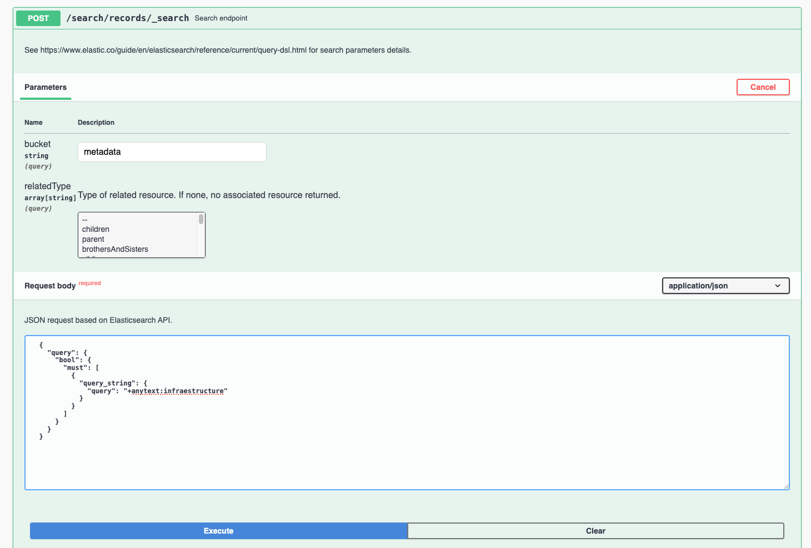

# Служба пошуку

GeoNetwork прадастаўляе доступ да канцавых кропак ***Elasticsearch*** `/srv/api/search/records/_search` і `/srv/api/search/records/_msearch`. Гэтыя канцавыя кропкі прымаюць `POST`-запыты, цела якіх змяшчае JSON-запыт Elasticsearch.

**Даведачныя матэрыялы:**

-   [Search API](https://www.elastic.co/guide/en/elasticsearch/reference/current/search-search.html) (Кіраўніцтва Elasticsearch)
-   [Multi search API](https://www.elastic.co/guide/en/elasticsearch/reference/current/search-multi-search.html) (Кіраўніцтва Elasticsearch)

## Прыклады пошукавых API-запытаў

Гэты раздзел змяшчае некалькі прыкладаў `POST`-запытаў да канцавой кропкі `/srv/api/search/records/_search`:

1.  Для тэсціравання прыкладаў перайдзіце да дакументацыі Swagger API па адрасе `/srv/api/index.html`.

2.  Знайдзіце загаловак *search* і канцавую кропку `POST` `/search/records/_search`.

3.  Выкарыстоўвайце кнопку *Try it out* з наступнымі параметрамі:
     
     * **bucket**: `metadata`
     * **relatedType**: (пакіньце пустым)
     * **Request body**: абярыце адзін з прыкладаў ніжэй.

4.  Націсніце **Execute**, каб выканаць прыклад.

     

### Запыт тэкставага пошуку

Запыт па любым полі для метаданых, якія змяшчаюць радок `infrastructure`, з выкарыстаннем сінтаксісу Lucene і з выключэннем шаблонаў метаданых:

```json
{
  "query": {
    "bool": {
      "must": [
        {
          "query_string": {
            "query": "+anytext:infrastructure "
          }
        }
      ],
      "filter": [
        {
          "term": {
            "isTemplate": {
              "value": "n"
            }
          }
        }
      ]
    }
  }
}
```

### Выбарка вынікаў

Запыт па любым полі для метаданых, якія змяшчаюць радок `infrastructure`, з выкарыстаннем сінтаксісу Lucene і з выключэннем шаблонаў метаданых, які вяртае толькі частку інфармацыі:

```json
{
  "query": {
    "bool": {
      "must": [
        {
          "query_string": {
            "query": "+anytext:infrastructure "
          }
        }
      ],
      "filter": [
        {
          "term": {
            "isTemplate": {
              "value": "n"
            }
          }
        }
      ]
    }
  },
  "_source": {
    "includes": [
      "uuid",
      "id",
      "resourceType",
      "resourceTitle*",
      "resourceAbstract*"
    ]
  }
}
```

### Запыт па наборах даных

Запыт па наборах даных, загаловак якіх змяшчае радок `infrastructure`, з выкарыстаннем сінтаксісу Lucene і з выключэннем шаблонаў метаданых:

```json
{
  "query": {
    "bool": {
      "must": [
        {
          "query_string": {
            "query": "+anytext:infrastructure +resourceType:dataset"
          }
        }
      ],
      "filter": [
        {
          "term": {
            "isTemplate": {
              "value": "n"
            }
          }
        }
      ]
    }
  }
}
```

### Запыт па даце рэвізіі

Запыт па наборах даных з датай рэвізіі ў чэрвені 2019 года і з выключэннем шаблонаў метаданых:

```json
{
  "query": {
    "bool": {
      "must": [
        {
          "term": {
            "resourceType": {
              "value": "dataset"
            }
          }
        },
        {
          "range": {
            "resourceTemporalDateRange": {
              "gte": "2019-06-01",
              "lte": "2019-06-30",
              "relation": "intersects"
            }
          }
        }
      ],
      "filter": [
        {
          "term": {
            "isTemplate": {
              "value": "n"
            }
          }
        }
      ]
    }
  }
}
```