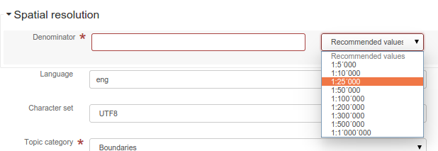
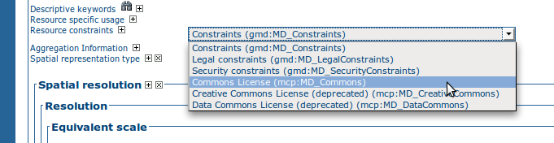

# Рэалізацыя плагінаў схем {#implementing-a-schema-plugin}

## Схемы і профілі метаданых

Схема метаданых апісвае:

1.  імёны, апісанні і любыя кодавыя спісы (codelists) элементаў у схеме метаданых
2.  размяшчэнне элементаў схемы метаданых у дакуменце метаданых (структура)
3.  абмежаванні для элементаў і кантэнту ў дакуменце метаданых
4.  дакументацыю па выкарыстанні элементаў схемы метаданых
5.  прыклады дакументаў метаданых і шаблоны метаданых
6.  скрыпты для пераўтварэння дакументаў метаданых у іншыя схемы і з іх

Схема метаданых звычайна з'яўляецца рэалізацыяй стандарту метаданых.

Профіль метаданых — гэта адаптацыя схемы метаданых пад патрэбы канкрэтнай супольнасці. Профіль метаданых утрымлівае ўсе кампаненты схемы метаданых, але можа пашыраць, абмяжоўваць або перавызначаць гэтыя кампаненты.

## Рэалізацыя схемы або профілю метаданых

Існуе мноства спосабаў рэалізацыі схемы або профілю метаданых. У гэтым раздзеле апісваецца спосаб рэалізацыі схем метаданых, які выкарыстоўваецца ў [geonetwork/schema-plugins](https://github.com/geonetwork/schema-plugins) або [metadata101](https://github.com/metadata101).

Кожная схема метаданых уяўляе сабой Maven-модуль, рэалізаваны ў выглядзе дрэва файлавай сістэмы. Коранем дрэва з'яўляецца скарочанае імя схемы метаданых. Асноўныя кампаненты схемы метаданых знаходзяцца ў тэчцы `src/main/plugin/<schema_id>` і размешчаны наступным чынам:

1.  Каталог **loc** з падкаталогамі для кожнага трохлітарнага кода мовы, на якую лакалізавана гэтая інфармацыя, з кантэнтам у XML-файлах (labels.xml, codelists.xml). Напрыклад: `loc/eng/codelists.xml` апісвае англійскія кодавыя спісы для элементаў метаданых
2.  Каталог **schema** і файл з імем **schema.xsd**, які забяспечвае адзіны пункт ўваходу ў іерархію XSD. Напрыклад: `schema/gmd/gmd.xsd`
3.  Каталог **schematron** утрымлівае абмежаванні на элементы і кантэнт у дакуменце метаданых, рэалізаваныя з выкарыстаннем мовы ISO Schematron
4.  Каталог **docs** утрымлівае дакументацыю аб тым, як варта выкарыстоўваць элементы схемы метаданых.
5.  Каталог **sample-data** утрымлівае прыклады дакументаў метаданых
6.  Каталог **convert** утрымлівае XSLT, якія пераўтвараюць дакументы метаданых у іншыя схемы і з іх

Дадатковая інфармацыя пра змесціва гэтых каталогаў і файлаў будзе прыведзена ў наступным раздзеле.

!!! info "Гл. таксама"

    Некаторыя схемы на <https://github.com/geonetwork/schema-plugins> або <https://github.com/metadata101> ўтрымліваюць больш інфармацыі, чым апісана вышэй, паколькі яны былі рэалізаваны як плагіны схем GeoNetwork.

## Плагіны схем

Плагін схемы, які можна выкарыстоўваць у GeoNetwork, уяўляе сабой каталог табліц стыляў, апісанняў XML-схем (XSD) і іншай інфармацыі, неабходнай GeoNetwork для індэксацыі, прагляду і (магчыма) рэдагавання кантэнту з XML-запісаў метаданых.

Для выкарыстання ў GeoNetwork каталог схемы можна ўручную змясціць у падкаталог `schema_plugins` каталога даных GeoNetwork. Для некаторых схем неабходна дадаць дадатковы JAR-файл у папку WEB-INF/lib. Размяшчэнне каталога даных GeoNetwork па змаўчанні: `INSTALL_DIR/web/geonetwork/WEB-INF/data`.

Змесціва гэтых схем аналізуецца падчас ініцыялізацыі GeoNetwork. Калі яны карэктныя, яны будуць даступныя для выкарыстання пасля запуску GeoNetwork.

Схемы таксама могуць быць дададзены ў GeoNetwork дынамічна, калі створаны ZIP-архіў каталога схемы, які затым загружаецца ў GeoNetwork адным з наступных спосабаў з выкарыстаннем функцый меню «Адміністраванне»:

1.  Шлях да файла на серверы (указваецца з дапамогай выбару файла)
2.  HTTP URL (напрыклад, `http://somehost/somedirectory/iso19139.mcp.zip`)
3.  Як анлайн-рэсурс, прымацаваны да запісу метаданых ISO19115/19139

Загружаныя схемы таксама захоўваюцца ў падкаталогу `schema_plugins` каталога даных GeoNetwork.

!!! info "Гл. таксама"

    Шаблон модуля даступны на [geonetwork/schema-plugins](https://github.com/geonetwork/schema-plugins/tree/develop/iso19139.xyz) і з'яўляецца добрым прыкладам для пачатку працы.

### Змесціва схемы GeoNetwork

Пасля ўстаноўкі схема GeoNetwork уяўляе сабой каталог.

У `src/main/plugin/<schema_id>` могуць прысутнічаць наступныя падкаталогі:

-   **schema**: (*Неабавязкова*) Каталог, які змяшчае афіцыйныя XSD-файлы схемы метаданых. Калі схема апісана DTD, гэты каталог неабавязковы. Звярніце ўвагу, што схемы, апісаныя DTD, не могуць рэдагавацца ў GeoNetwork.
-   **schematron**: (*Неабавязкова*) Каталог, які змяшчае Schematron-файлы, што выкарыстоўваюцца для праверкі ўмоў кантэнту.
-   **docs**: (*Неабавязкова*) Дакументацыя па схеме.
-   **index-fields**: (*Абавязкова*) Каталог XSLT, неабходных для індэксацыі запісаў метаданых.
-   **loc**: (*Абавязкова*) Каталог лакалізаванай інфармацыі: пазнакі, кодавыя спісы або спецыфічныя для схемы радкі. Напрыклад, `loc/eng/codelists.xml`.
-   **convert**: (*Абавязкова*) Каталог XSLT для пераўтварэння метаданых з гэтай схемы або ў гэтую схему. Гэта можа быць пераўтварэнне метаданых у іншыя схемы або з іншых схем і фарматаў у гэтую схему. Напрыклад, `convert/oai_dc.xsl`.
-   **layout**: (*Абавязкова для версіі 3.x*) змяшчае канфігурацыю для прадстаўлення метаданых у рэдактары.
-   **formatter**: (*Неабавязкова для версіі 3.x*) змяшчае канфігурацыю для прадстаўлення метаданых з выкарыстаннем фарматара Groovy або XSLT.
-   **present**: (*Абавязкова для версіі 2.x*) змяшчае XSLT для прадстаўлення метаданых у сродку прагляду/рэдактары.
-   **present/csw**: (*Абавязкова*) змяшчае XSLT для адказаў на запыты CSW для кароткіх, зводных і поўных запісаў.
-   **process**: (*Неабавязкова*) змяшчае XSLT для апрацоўкі элементаў метаданых механізмам прапаноў (гл. **suggest.xsl** ніжэй).
-   **sample-data**: (*Неабавязкова*) Прыклады метаданых для гэтай схемы. Прыклады метаданых прадстаўлены ў фармаце MEF, што дазваляе ім мець мініяцюры або выявы для прагляду, а таксама анлайн-рэсурсы.
-   **templates**: (*Неабавязкова*) Каталог, які змяшчае запісы-шаблоны і падшаблоны метаданых для гэтай схемы. Запісы-шаблоны метаданых — гэта звычайна запісы з наборам элементаў (і кантэнтам), якія будуць выкарыстоўвацца для пэўных мэт. Напрыклад, схема iso19139.mcp мае шаблон «Мінімальны элемент» (Minimum Element), які змяшчае абавязковыя элементы для схемы і прыклад чаканага кантэнту.

Могуць прысутнічаць наступныя табліцы стыляў:

-   **extract-date-modified.xsl**: (*Абавязкова*) Выманне даты змянення з запісу метаданых.
-   **extract-gml.xsl**: (*Абавязкова*) Выманне прасторавага ахопу з запісу метаданых у выглядзе элемента GML GeometryCollection.
-   **extract-thumbnails.xsl**: (*Неабавязкова*) Выманне выявы для прагляду/мініяцюры з запісу метаданых.
-   **extract-uuid.xsl**: (*Абавязкова*) Выманне UUID запісу метаданых.
-   **extract-relations.xsl**: (*Неабавязкова*) Выманне асацыіраваных рэсурсаў запісу метаданых (напрыклад, анлайн-крыніца, мініяцюры).
-   **set-thumbnail.xsl**: (*Неабавязкова*) Устаноўка выявы для прагляду/мініяцюры ў запісе метаданых.
-   **set-uuid.xsl**: (*Неабавязкова*) Устаноўка UUID запісу метаданых.
-   **suggest.xsl**: (*Неабавязкова*) XSLT, які запускаецца службай прапаноў метаданых. XSLT змяшчае працэсы, якія могуць быць зарэгістраваны і запушчаны для розных элементаў запісу метаданых. Напрыклад, разгортванне поля ключавых слоў з кантэнтам, падзеленым коскамі, у некалькі палёў ключавых слоў. Гл. [Прапановы па паляпшэнні кантэнту метаданых](../user-guide/workflow/suggestion.md) для атрымання дадатковай інфармацыі.
-   **unset-thumbnail.xsl**: (*Неабавязкова*) Выдаленне выявы для прагляду/мініяцюры з запісу метаданых.
-   **update-child-from-parent-info.xsl**: (*Неабавязкова*) XSLT для ўказання таго, якія элементы ў даччыным запісе абнаўляюцца з бацькоўскага. Выкарыстоўваецца для кіравання іерархічнымі сувязямі паміж запісамі метаданых.
-   **update-fixed-info.xsl**: (*Неабавязкова*) XSLT для абнаўлення «фіксаванага» кантэнту ў запісах метаданых.

Могуць прысутнічаць наступныя канфігурацыйныя файлы:

-   **oasis-catalog.xml**: (*Неабавязкова*) Каталог OASIS, які апісвае любыя супастаўленні, якія варта выкарыстоўваць для гэтай схемы, напрыклад, супастаўленне URL-адрасоў з лакальнымі копіямі, такімі як schemaLocations. Напрыклад, `http://www.isotc211.org/2005/gmd/gmd.xsd` супастаўляецца з `schema/gmd/gmd.xsd`. Імёны шляхоў у каталогу oasis пазначаны адносна размяшчэння гэтага файла, то есць адносна каталога схемы.
-   **schema.xsd**: (*Неабавязкова*) Файл XML-схемы, які ўключае XSD, што выкарыстоўваюцца дадзенай схемай метаданых. Калі схема выкарыстоўвае DTD, гэты файл не павінен прысутнічаць. Запісы метаданых са схем, якія выкарыстоўваюць DTD, нельга рэдагаваць у GeoNetwork.
-   **schema-conversions.xml**: (*Неабавязкова*) XML-файл, які апісвае канвертары, якія могуць быць прыменены да запісаў, што належаць гэтай схеме. Гэтая інфармацыя выкарыстоўваецца для адлюстравання гэтых пераўтварэнняў у якасці варыянтаў выбару для карыстальніка, калі запіс метаданых гэтай схемы адлюстроўваецца ў выніках пошуку.
-   **schema-ident.xml**: (*Абавязкова*) XML-файл, які змяшчае імя схемы, ідэнтыфікатар, нумар версіі і падрабязную інфармацыю аб тым, як распазнаць запісы метаданых, што належаць гэтай схеме. Гэты файл мае вызначэнне XML-схемы ў `INSTALL_DIR/web/geonetwork/xml/validation/schemaPlugins/schema-ident.xsd`, якое выкарыстоўваецца для яго праверкі пры загрузцы схемы.
-   **schema-substitutes.xml**: (*Неабавязкова*) XML-файл, які перавызначае набор элементаў, што могуць выкарыстоўвацца ў якасці заменнікаў для канкрэтнага элемента.
-   **schema-suggestions.xml**: (*Неабавязкова*) XML-файл, які паведамляе рэдактару, якія даччыныя элементы складанага элемента варта аўтаматычна разгортваць у рэдактары.

У тэчцы `index-fields` патрабуюцца наступныя файлы:

-   **index.xsl**: (*Абавязкова*) Індэксацыя кантэнту запісу метаданых. Вынікам з'яўляецца спіс палёў і значэнняў для індэксацыі.

Каб дапамагчы ў разуменні таго, што ўяўляе сабой кожны з гэтых кампанентаў і што патрабуецца, мы прывядзем пакрокавы прыклад таго, як стварыць schemaPlugin для GeoNetwork.

### Падрыхтоўка

Для стварэння плагіна схемы для GeoNetwork неабходна выгрузіць зыходны код:

``` shell
git clone --recursive https://github.com/geonetwork/core-geonetwork
```

Затым вы можаце выгрузіць рэпазіторый плагінаў схем, які змяшчае прыклады:

``` shell
git clone --recursive https://github.com/geonetwork/schema-plugins
```

Каб працаваць з паказаным тут прыкладам, стварыце свой новы плагін схемы ў падкаталогу модуля Maven `schemas` (гл. `schemas`). Плагін `iso19139.xyz` з рэпазіторыя плагінаў схем можа стаць добрым стартам.

Пасля стварэння неабходна зарэгістраваць новы плагін у зборцы прыкладання. Для гэтага:

-   Дадайце плагін як модуль модуля schemas (гл. `schemas/pom.xml`):

    ``` xml
    <module>iso19139.xyz</module>
    ```

-   Зарэгіструйце плагін у вэб-прыкладанні ў выкананні `copy-schemas` (гл. `web/pom.xml`):

    ``` xml
    <resource>
       <directory>${project.basedir}/../schemas/iso19139.xyz/src/main/plugin</directory>
       <targetPath>${basedir}/src/main/webapp/WEB-INF/data/config/schema_plugins</targetPath>
     </resource>
    ```

-   Апцыянальна зарэгіструйце залежнасць, калі ваш плагін рэалізуе карыстальніцкі Java-код (гл. `web/pom.xml`):

    ``` xml
    <dependency>
      <groupId>${project.groupId}</groupId>
      <artifactId>schema-iso19139.xyz</artifactId>
      <version>${project.version}</version>
    </dependency>
    ```

### Прыклад — Марскі профіль супольнасці (MCP) ISO19115/19139

Марскі профіль супольнасці (MCP) — гэта профіль ISO19115/19139, распрацаваны для марской супольнасці і сумесна з ёй. Профіль пашырае стандарт метаданых ISO19115 і рэалізаваны з выкарыстаннем пашырэння XML-рэалізацыі ISO19115, апісанай у ISO19139. Як стандарт метаданых ISO19115, так і яго XML-рэалізацыя, ISO19139, даступныя праз каналы распаўсюджвання ISO.

Дакументацыю па Марскім профілі супольнасці можна знайсці ў [дакуменце Marine Community Profile](http://www.aodc.gov.au/files/MarineCommunityProfilev1.4.pdf). Рэалізацыя ў выглядзе апісанняў XML-схем заснавана на падыходзе, апісаным у [AppSchemas/MetadataProfiles](https://www.seegrid.csiro.au/wiki/AppSchemas/MetadataProfiles). Апісанні XML-схем (XSD) даступныя па адрасе `http://bluenet3.antcrc.utas.edu.au/mcp-1.4`.

Гледзячы на апісанні XML-схем, профіль дадае некалькі новых элементаў да базавага стандарту ISO19139. Такім чынам, асноўная ідэя вызначэння схемы плагіна Марскога профілю супольнасці для GeoNetwork заключаецца ў тым, каб максімальна выкарыстоўваць базавую схему ISO19139, якая пастаўляецца з GeoNetwork.

Цяпер мы апішам асноўныя крокі па стварэнні кожнага з кампанентаў схемы плагіна для GeoNetwork, якая рэалізуе MCP.

#### Стварэнне файла schema-ident.xml

Цяпер нам трэба падаць інфармацыю, неабходную для ідэнтыфікацыі схемы і запісаў метаданых, што належаць гэтай схеме. Файл schema-ident.xml для MCP выглядае наступным чынам:

``` xml
<?xml version="1.0" encoding="UTF-8"?>
<schema xmlns="http://geonetwork-opensource.org/schemas/schema-ident"
        xmlns:xsi="http://www.w3.org/2001/XMLSchema-instance">
  <name>iso19139.mcp</name>
  <id>19c9a2b2-dddb-11df-9df4-001c2346de4c</id>
  <version>1.5</version>
  <schemaLocation>
    http://bluenet3.antcrc.utas.edu.au/mcp
    http://bluenet3.antcrc.utas.edu.au/mcp-1.5-experimental/schema.xsd
    http://www.isotc211.org/2005/gmd
    http://www.isotc211.org/2005/gmd/gmd.xsd
    http://www.isotc211.org/2005/srv
    http://schemas.opengis.net/iso/19139/20060504/srv/srv.xsd
  </schemaLocation>
  <autodetect xmlns:mcp="http://bluenet3.antcrc.utas.edu.au/mcp"
              xmlns:gmd="http://www.isotc211.org/2005/gmd"
              xmlns:gco="http://www.isotc211.org/2005/gco">
    <elements>
      <gmd:metadataStandardName>
        <gco:CharacterString>
          Australian Marine Community Profile of ISO 19115:2005/19139|
          Marine Community Profile of ISO 19115:2005/19139
        </gco:CharacterString>
      </gmd:metadataStandardName>
      <gmd:metadataStandardVersion>
        <gco:CharacterString>
          1.5-experimental|
          MCP:BlueNet V1.5-experimental|
          MCP:BlueNet V1.5
        </gco:CharacterString>
      </gmd:metadataStandardVersion>
    </elements>
  </autodetect>
</schema>
```

Кожны элемент азначае наступнае:

-   **name** — імя, пад якім схема будзе вядомая ў GeoNetwork. Калі схема з'яўляецца профілем базавай схемы, ужо дададзенай у GeoNetwork, прынята называць схему <base_schema_name>.<namespace_of_profile>.
-   **id** — унікальны ідэнтыфікатар схемы.
-   **version** — нумар версіі схемы. У GeoNetwork можа прысутнічаць некалькі версій схемы.
-   **schemaLocation** — набор пар, дзе першы элемент пары — гэта URI прасторы імёнаў, а другі — афіцыйны URL XSD. Змесціва гэтага элемента будзе дададзена да каранёвага элемента любога запісу метаданых, які адлюстроўваецца GeoNetwork, у выглядзе атрыбута schemaLocation/noNamespaceSchemaLocation, калі такі атрыбут яшчэ не існуе. Ён таксама будзе выкарыстоўвацца ўсякі раз, калі патрабуецца афіцыйны schemaLocation/noNamespaceSchemaLocation (напрыклад, у адказе на запыт OAI ListMetadataFormats).
-   **autodetect** — утрымлівае элементы або атрыбуты (з кантэнтам), якія павінны прысутнічаць у любым запісе метаданых, што належыць гэтай схеме. Гэта выкарыстоўваецца падчас выяўлення схемы ўсякі раз, калі GeoNetwork атрымлівае запіс метаданых невядомай схемы.
-   **filters** — (*Неабавязкова*) утрымлівае карыстальніцкі фільтр, які прымяняецца на аснове правоў доступу карыстальніка.

Пасля стварэння гэтага файла вы можаце праверыць яго ўручную, выкарыстоўваючы вызначэнне XML-схемы (XSD) у `INSTALL_DIR/web/geonetwork/xml/validation/schemaPlugins/schema-ident.xsd`. Гэты XSD таксама выкарыстоўваецца для праверкі дадзенага файла пры загрузцы схемы. Калі schema-ident.xml не праходзіць праверку, схема не будзе загружана.

#### Падрабязней пра аўтавызначэнне (autodetect)

Раздзел autodetect файла schema-ident.xml выкарыстоўваецца, калі GeoNetwork неабходна ідэнтыфікаваць, да якой схемы метаданых належыць запіс.

Пяць правілаў, якія можна выкарыстоўваць у гэтым раздзеле ў парадку ацэнкі:

1.  **Атрыбуты** — пошук аднаго або некалькіх атрыбутаў і/або прастор імёнаў у дакуменце. Прыклад варыянту выкарыстання — профіль ISO19115/19139, які дадае неабавязковыя элементы ў новай прасторы імёнаў у gmd:identificationInfo/gmd:MD_DataIdentification. Каб выявіць запісы, якія належаць гэтаму профілю, раздзел autodetect у файле schema-ident.xml можа выглядаць наступным чынам:

    ``` xml
    <autodetect xmlns:cmar="http://www.marine.csiro.au/schemas/cmar.xsd">
      <!-- захапіць усе запісы cmar, якія маюць элемент cmar vocab -->
      <attributes cmar:vocab="http://www.marine.csiro.au/vocabs/projectCodes.xml"/>
    </autodetect>
    ```

    Іншыя моманты наконт аўтавызначэння па атрыбутах:

    -   можна ўказаць некалькі атрыбутаў — усе яны павінны адпавядаць, каб запіс быў распазнаны як прыналежны да гэтай схемы.
    -   калі атрыбуты маюць прастору імёнаў, то прастора імёнаў павінна быць указана ў элеменце autodetect або дзе-небудзь у дакуменце schema-ident.xml.

2.  **Элементы** — пошук аднаго або некалькіх элементаў у дакуменце. Прыклад варыянту выкарыстання — той, што быў паказаны ў прыкладзе файла schema-ident.xml раней:

    ``` xml
    <autodetect xmlns:mcp="http://bluenet3.antcrc.utas.edu.au/mcp"
                xmlns:gmd="http://www.isotc211.org/2005/gmd"
                xmlns:gco="http://www.isotc211.org/2005/gco">
      <elements>
        <gmd:metadataStandardName>
          <gco:CharacterString>
            Australian Marine Community Profile of ISO 19115:2005/19139|
            Marine Community Profile of ISO 19115:2005/19139
          </gco:CharacterString>
        </gmd:metadataStandardName>
        <gmd:metadataStandardVersion>
          <gco:CharacterString>
            1.5-experimental|
            MCP:BlueNet V1.5-experimental|
            MCP:BlueNet V1.5
          </gco:CharacterString>
        </gmd:metadataStandardVersion>
      </elements>
    </autodetect>
    ```

    Іншыя моманты наконт аўтавызначэння па элементах:

    -   можна ўказаць некалькі элементаў — напрыклад, як паказана вышэй, былі ўказаны і metadataStandardName, і metadataStandardVersion — усе яны павінны адпавядаць, каб запіс быў распазнаны як прыналежны да гэтай схемы.
    -   можна ўказаць некалькі значэнняў для элементаў. напрыклад, як вышэй, адпаведнасць для gmd:metadataStandardVersion будзе знойдзена для `1.5-experimental` АБО `MCP:BlueNet V1.5-experimental` АБО `MCP:BlueNet V1.5` — сімвал вертыкальнай рысы '|' выкарыстоўваецца тут для падзелу варыянтаў. Таксама можна выкарыстоўваць рэгулярныя выразы.
    -   калі элементы маюць прастору імёнаў, то прастора(ы) імёнаў павінны быць указаны ў элеменце autodetect або дзе-небудзь у дакуменце schema-ident.xml перад элементам, у якім яны выкарыстоўваюцца — напрыклад, вышэй ёсць абвяшчэнні прасторы імёнаў у элеменце autodetect, каб не загрувашчваць кантэнт.

3.  **Каранёвы элемент** — каранёвы элемент дакумента павінен супадаць. Прыклад выкарыстання — той, што прымяняецца для схемы eml-gbif. Дакументы, якія належаць гэтай схеме, заўсёды маюць каранёвы элемент eml:eml, таму раздзел autodetect для гэтай схемы выглядае так:

    ``` xml
    <autodetect xmlns:eml="eml://ecoinformatics.org/eml-2.1.1">
      <elements type="root">
        <eml:eml/>
      </elements>
    </autodetect>
    ```

    Іншыя моманты наконт аўтавызначэння па каранёвым элеменце:

    -   можна ўказаць некалькі элементаў — любы элемент з набору, які супадае з каранёвым элементам запісу, выкліча супадзенне.
    -   калі элементы маюць прастору імёнаў, то прастора(ы) імёнаў павінны быць указаны ў элеменце autodetect або дзе-небудзь у дакуменце schema-ident.xml перад элементам, які іх выкарыстоўвае — напрыклад, як вышэй, у элеменце autodetect ёсць абвяшчэнне прасторы імёнаў для яснасці.

4.  **Прасторы імёнаў** — пошук адной або некалькіх прастор імёнаў у дакуменце. Прыклад выкарыстання — той, што прымяняецца для схемы csw:Record. Запісы, якія належаць схеме csw:Record, могуць мець тры магчымыя каранёвыя элементы: csw:Record, csw:SummaryRecord і csw:BriefRecord, але замест выкарыстання аўтавызначэння па некалькіх каранёвых элементах, мы маглі б выкарыстоўваць агульную прастору імёнаў csw для аўтавызначэння наступным чынам:

    ``` xml
    <autodetect>
      <namespaces xmlns:csw="http://www.opengis.net/cat/csw/2.0.2"/>
    </autodetect>
    ```

    Іншыя моманты наконт аўтавызначэння па прасторах імёнаў:

    -   можна ўказаць некалькі прастор імёнаў — усе яны павінны прысутнічаць, каб запіс быў распазнаны як прыналежны да гэтай схемы.
    -   прэфікс ігнаруецца. Супадзенне прасторы імёнаў адбываецца, калі URI прасторы імёнаў, знойдзены ў запісе, супадае з URI прасторы імёнаў, указаным у элеменце аўтавызначэння прастор імёнаў.

5.  **Схема па змаўчанні** — гэта засцерагальны механізм для запісаў, якія не супадаюць ні з адной з устаноўленых схем. Значэнне для схемы па змаўчанні ўказваецца ў канфігурацыі appHandler файла `INSTALL_DIR/web/geonetwork/WEB-INF/config.xml` або гэта можа быць значэнне па змаўчанні, указанае аперацыяй, якая выклікае autodetect (напрыклад, значэнне, атрыманае пры пакетнай загрузцы карыстальнікам некаторых запісаў метаданых). З меркаванняў гнуткасці і дакладнасці пераважней, каб запісы выяўляліся з выкарыстаннем інфармацыі аўтавызначэння ўсталяванай схемы. Схема па змаўчанні — гэта проста «ўсёахопны» метад прызначэння запісаў пэўнай схеме. Элемент config у `INSTALL_DIR/web/geonetwork/WEB-INF/config.xml` выглядае наступным чынам:

    ``` xml
    <appHandler class="org.fao.geonet.Geonetwork">
      .....
      <param name="preferredSchema" value="iso19139" />
      .....
    </appHandler>
    ```

#### Падрабязней пра ацэнку аўтавызначэння

Правілы аўтавызначэння ацэньваюцца наступным чынам:

``` shell
для кожнага тыпу правіла autodetect у ( 'attributes/namespaces', 'elements',
                                   'namespaces', 'root element' )
  для кожнай схемы
    калі ў схемы ёсць дадзены тып правіла autodetect то
      праверыць правіла на супадзенне
      калі супадзенне знойдзена, дадаць да спісу папярэдніх супадзенняў
    канец калі
  конец для кожнай

  калі супадзенняў больш за адно, выклікаць 'SCHEMA RULE CONFLICT EXCEPTION'
  калі супадзенне адно, усталяваць супадзенне = першаму супадзенню і перарваць цыкл
конец для кожнай

калі супадзення няма то
  калі прасторы імёнаў запісу і схемы па змаўчанні перасякаюцца то
    усталяваць супадзенне = схема па змаўчанні
  інакш выклікаць 'NO SCHEMA MATCHES EXCEPTION'
конец калі

вярнуць супаўшую схему
```

У якасці прыкладу выкажам здагадку, што ў нас ёсць тры схемы iso19139.mcp, iso19139.mcp-1.4 і iso19139.mcp-cmar з наступнымі элементамі autodetect:

##### iso19139.mcp-1.4

``` xml
<autodetect xmlns:mcp="http://bluenet3.antcrc.utas.edu.au/mcp"
            xmlns:gmd="http://www.isotc211.org/2005/gmd"
            xmlns:gco="http://www.isotc211.org/2005/gco">
  <elements>
    <gmd:metadataStandardName>
      <gco:CharacterString>
        Australian Marine Community Profile of ISO 19115:2005/19139
      </gco:CharacterString>
    </gmd:metadataStandardName>
    <gmd:metadataStandardVersion>
      <gco:CharacterString>MCP:BlueNet V1.4</gco:CharacterString>
    </gmd:metadataStandardVersion>
  </elements>
</autodetect>
```

##### iso19139.mcp-cmar

``` xml
<autodetect>
    <attributes xmlns:mcp-cmar="http://www.marine.csiro.au/schemas/mcp-cmar">
</autodetect>
```

##### iso19139.mcp

``` xml
<autodetect xmlns:mcp="http://bluenet3.antcrc.utas.edu.au/mcp">
  <elements type="root">
    <mcp:MD_Metadata/>
  </elements>
</autodetect>
```

Запіс, які праходзіць апрацоўку autodetect (напрыклад, пры імпарце), будзе правярацца:

-   спачатку iso19139.mcp-cmar, бо ў яе ёсць правіла 'attributes'
-   затым iso19139.mcp-1.4, бо ў яе ёсць правілы 'elements'
-   і нарэшце, у параўнанні з iso19139.mcp, бо ў яе ёсць правіла 'root element'.

Ідэя гэтага алгарытму апрацоўкі заключаецца ў тым, што базавыя схемы будуць выкарыстоўваць правіла 'root element' (або больш складана кантраляванае правіла 'namespaces'), а профілі будуць выкарыстоўваць больш дакладнае або спецыфічнае правіла, такое як 'attributes' або 'elements'.

#### Падрабязней пра фільтры

Мэта складаецца ў тым, каб дадаць магчымасць канфігурацыі загрузкі і дынамічных аперацый на аснове кантэнту каталога, дзе яны могуць мець розныя значэнні ў залежнасці ад:

-   схемы (напрыклад, URL для загрузкі файла знаходзіцца не ў тым жа месцы для Dublin Core і ISO19139)
-   правілаў кадавання запісу (напрыклад, загрузкай могуць быць спасылкі WFS, а не толькі загружаны файл).

Канфігурацыя фільтра для кожнага тыпу аперацый вызначаецца ў schema-ident.xml у раздзеле filters.

Фільтр вызначае:

-   аперацыю (якая супастаўляецца з метадамі canEdit, canDownload, canDynamic у AccessManager)
-   XPath для выбару элементаў для фільтрацыі
-   неабавязковае вызначэнне элемента для замены замененага элемента (калі знойдзена супадзенне, атрыбуты або даччыныя элементы гэтага элемента ўстаўляюцца). Гэта выкарыстоўваецца для вылучэння выдаленага элемента.

``` xml
<filters>
  <!-- Фільтраваць элемент, які мае nilReason='withheld', для карыстальніка, які не можа рэдагаваць -->
  <filter xpath="*//*[@gco:nilReason='withheld']"
          ifNotOperation="editing">
    <keepMarkedElement gco:nilReason="withheld"/>
  </filter>
  <!-- Фільтраваць элемент, які мае пратакол download для карыстальніка, які не можа загружаць -->
  <filter xpath="*//gmd:onLine[*/gmd:protocol/gco:CharacterString = 'WWW:DOWNLOAD-1.0-http--download']"
          ifNotOperation="download"/>
  <!-- Фільтраваць элемент, які мае пратакол WMS для карыстальніка, які не можа дынамічна выкарыстоўваць -->
  <filter xpath="*//gmd:onLine[starts-with(*/gmd:protocol/gco:CharacterString, 'OGC:WMS')]"
          ifNotOperation="dynamic"/>
</filters>
```

Фільтры прымяняюцца ў XMLSerializer у адпаведнасці з правамі карыстальніка.

Пасля налады schema-ident.xml, наша новая схема плагіна GeoNetwork для MCP утрымлівае:

    schema-ident.xml

#### Стварэнне файла schema-conversions.xml {#schema_conversions}

Гэты файл апісвае канвертары, якія могуць быць прыменены да запісаў метаданых, што належаць гэтай схеме. Кожны канвертар павінен быць уручную вызначаны як служба GeoNetwork (Jeeves), якую можна выклікаць для пераўтварэння канкрэтнага запісу метаданых у іншую схему. Файл schema-conversions.xml для MCP выглядае наступным чынам:

``` xml
<conversions>
   <converter name="xml_iso19139.mcp"
              nsUri="http://bluenet3.antcrc.utas.edu.au/mcp"
              schemaLocation="http://bluenet3.antcrc.utas.edu.au/mcp-1.5-experimental/schema.xsd"
              xslt="xml_iso19139.mcp.xsl"/>
   <converter name="xml_iso19139.mcp-1.4"
              nsUri="http://bluenet3.antcrc.utas.edu.au/mcp"
              schemaLocation="http://bluenet3.antcrc.utas.edu.au/mcp/schema.xsd"
              xslt="xml_iso19139.mcp-1.4.xsl"/>
   <converter name="xml_iso19139.mcpTooai_dc"
              nsUri="http://www.openarchives.org/OAI/2.0/"
              schemaLocation="http://www.openarchives.org/OAI/2.0/oai_dc.xsd"
              xslt="oai_dc.xsl"/>
   <converter name="xml_iso19139.mcpTorifcs"
              nsUri="http://ands.org.au/standards/rif-cs/registryObjects"
              schemaLocation="http://services.ands.org.au/home/orca/schemata/registryObjects.xsd"
              xslt="rif.xsl"/>
</conversions>
```

Кожны канвертар мае наступныя атрыбуты:

-   **name** — імя канвертара. Гэта імя службы GeoNetwork (Jeeves), і яно павінна быць унікальным (прэфікс імя службы `xml_<schema_name>` — добры спосаб зрабіць гэта імя ўнікальным).
-   **nsUri** — асноўная прастора імёнаў схемы, створанай канвертарам. напрыклад, xml_iso19139.mcpTorifcs пераўтварае запісы метаданых з iso19139.mcp у схему RIFCS. Запісы метаданых у схеме метаданых RIFCS маюць асноўны URI прасторы імёнаў `http://ands.org.au/standards/rif-cs/registryObjects`.
-   **schemaLocation** — размяшчэнне (URL) вызначэння XML-схемы (XSD), якое адпавядае nsURI.
-   **xslt** — імя XSLT, які фактычна выконвае пераўтварэнне. Гэты XSLT павінен знаходзіцца ў падкаталогу convert плагіна схемы.

Пасля налады schema-conversions.xml, наша новая схема плагіна GeoNetwork для MCP утрымлівае:

    schema-conversions.xml schema-ident.xml

#### Стварэнне каталога schema і файла schema.xsd {#schema_and_schema_xsd}

Кампаненты schema і schema.xsd выкарыстоўваюцца рэдактарам GeoNetwork і функцыямі праверкі.

Рэдактар GeoNetwork выкарыстоўвае XSD для пабудовы формы, якая не толькі правільна ўпарадкуе элементы ў дакуменце метаданых, але і прапануе варыянты стварэння любых элементаў, якіх няма ў дакуменце метаданых. Ідэя гэтага падыходу дваякая. Па-першае, рэдактар можа выкарыстоўваць правілы вызначэння XML-схемы, каб дапамагчы карыстальніку пазбегнуць стварэння структурна некарэктнага дакумента, напрыклад, пры адсутнасці абавязковых элементаў або няправільным парадку элементаў. Па-другое, адзін і той жа код рэдактара можна выкарыстоўваць для любога XML-дакумента метаданых з вызначаным XSD.

Калі вы вызначаеце сваю ўласную схему метаданых, вы можаце стварыць дакумент XML-схемы, выкарыстоўваючы мову XSD. Элементы гэтай мовы можна знайсці ў Інтэрнэце на [w3schools.com/schema](http://www.w3schools.com/schema/) або звярнуцца да падручніка, такога як Priscilla Walmsley "Definitive XML Schema" (Prentice Hall, 2002). Код разбору XML-схем GeoNetwork разумее амаль усю мову XSD, за выключэннем redefine, any і anyAttribute (хаця апошнія два могуць апрацоўвацца пры асаблівых абставінах).

У выпадку Марскога профілю супольнасці мы па сутнасці вызначаем шэраг пашырэнняў для базавага стандарту ISO19115/19139. Гэтыя пашырэнні вызначаны з выкарыстаннем механізму пашырэння XSD для тыпаў, вызначаных у ISO19139. Наступны фрагмент паказвае, як Марскі профіль супольнасці пашырае элемент gmd:MD_Metadata для дадання новага элемента пад назвай revisionDate:

``` xml
<xs:schema targetNamespace="http://bluenet3.antcrc.utas.edu.au/mcp"
           xmlns:mcp="http://bluenet3.antcrc.utas.edu.au/mcp">

  <xs:element name="MD_Metadata" substitutionGroup="gmd:MD_Metadata"
                                 type="mcp:MD_Metadata_Type"/>

  <xs:complexType name="MD_Metadata_Type">
    <xs:annotation>
      <xs:documentation>
       Пашырае элемент метаданых для ўключэння revisionDate
      </xs:documentation>
    </xs:annotation>
    <xs:complexContent>
      <xs:extension base="gmd:MD_Metadata_Type">
        <xs:sequence>
          <xs:element name="revisionDate" type="gco:Date_PropertyType"
                      minOccurs="0"/>
        </xs:sequence>
        <xs:attribute ref="gco:isoType" use="required"
                      fixed="gmd:MD_Metadata"/>
      </xs:extension>
    </xs:complexContent>
  </xs:complexType>

</xs:schema>
```

Карацей кажучы, мы вызначылі новы элемент mcp:MD_Metadata з тыпам mcp:MD_Metadata_Type, які з'яўляецца пашырэннем gmd:MD_Metadata_Type. Пад пашырэннем мы разумеем, што новы тып уключае ў сябе ўсе элементы старога тыпу плюс адзін новы элемент, mcp:revisionDate. Абавязковы атрыбут (gco:isoType) таксама прымацаваны да mcp:MD_Metadata з фіксаваным значэннем, устаноўленым на імя элемента, які мы пашырылі (gmd:MD_Metadata).

Вызначаючы профіль такім чынам, няма неабходнасці мадыфікаваць базавыя схемы ISO19139. Такім чынам, каталог схемы для MCP па сутнасці складаецца з пашырэнняў плюс базавыя схемы ISO19139. Адна з магчымых структур каталогаў выглядае наступным чынам:

    extensions gco gmd gml gmx gsr gss gts resources srv xlink

Каталог extensions змяшчае адзін файл mcpExtensions.xsd, які імпартуе прастору імёнаў gmd. Астатнія каталогі — гэта базавыя схемы ISO19139.

Файл schema.xsd, які шукае GeoNetwork, будзе імпартаваць файл mcpExtensions.xsd і любыя іншыя прасторы імёнаў, не імпартаваныя як частка базавай схемы ISO19139. Ён выглядае наступным чынам:

``` xml
<xs:schema targetNamespace="http://bluenet3.antcrc.utas.edu.au/mcp"
           elementFormDefault="qualified"
        xmlns:xs="http://www.w3.org/2001/XMLSchema"
        xmlns:mcp="http://bluenet3.antcrc.utas.edu.au/mcp"
        xmlns:gmd="http://www.isotc211.org/2005/gmd"
        xmlns:gmx="http://www.isotc211.org/2005/gmx"
        xmlns:srv="http://www.isotc211.org/2005/srv">
  <xs:include schemaLocation="schema/extensions/mcpExtensions.xsd"/>
  <!-- гэта лагічнае месца для ўключэння любых дадатковых схем, якія
       адносяцца да ISO19139, уключаючы ISO19119 -->
  <xs:import namespace="http://www.isotc211.org/2005/srv"
             schemaLocation="schema/srv/srv.xsd"/>
  <xs:import namespace="http://www.isotc211.org/2005/gmx"
             schemaLocation="schema/gmx/gmx.xsd"/>
</xs:schema>
```

На дадзеным этапе наша новая схема плагіна GeoNetwork для MCP утрымлівае:

``` shell
schema-conversions.xml  schema-ident.xml  schema.xsd  schema
```

#### Стварэнне XSLT extract-\...

GeoNetwork павінен вымаць пэўную інфармацыю з запісу метаданых і перакладаць яе ў агульную спрошчаную структуру XML, якая не залежыць ад схемы метаданых. Замест таго, каб рабіць гэта з дапамогай XPath, закадаваных у Java, выкарыстоўваюцца XSLT для апрацоўкі XML і вяртання агульнай спрошчанай структуры XML.

Мы створым тры XSLT:

-   **extract-date-modified.xsl** — гэты XSLT апрацоўвае запіс метаданых і вымае дату апошняга змянення запісу метаданых. Для MCP гэтая інфармацыя захоўваецца ў элеменце mcp:revisionDate, які з'яўляецца даччыным элементам mcp:MD_Metadata. Самы просты спосаб стварыць яго для MCP — скапіяваць extract-date-modified.xsl са схемы iso19139 і мадыфікаваць яго пад прастору імёнаў MCP, а таксама выкарыстаць mcp:revisionDate замест gmd:dateStamp.
-   **extract-gml.xsl** — гэты XSLT апрацоўвае запіс метаданых і вымае прасторавы ахоп як элемент gml GeometryCollection. GML перадаецца ў geotools для ўстаўкі ў прасторавы індэкс (лібо shape-файл, лібо прасторавая база даных). Для ISO19115/19139 і профіляў гэтая задача даволі простая, таму што прасторавыя ахопы (акрамя абмяжоўваючай рамкі) закадаваны як GML у запісе метаданых. Зноў жа, самы просты спосаб стварыць яго для MCP — скапіяваць extract-gml.xsd са схемы iso19139 і мадыфікаваць пад прастору імёнаў MCP.

Прыклад фрагмента абмяжоўваючай рамкі з запісу метаданых MCP:

``` xml
<gmd:extent>
  <gmd:EX_Extent>
    <gmd:geographicElement>
      <gmd:EX_GeographicBoundingBox>
        <gmd:westBoundLongitude>
          <gco:Decimal>112.9</gco:Decimal>
        </gmd:westBoundLongitude>
        <gmd:eastBoundLongitude>
          <gco:Decimal>153.64</gco:Decimal>
        </gmd:eastBoundLongitude>
        <gmd:southBoundLatitude>
          <gco:Decimal>-43.8</gco:Decimal>
        </gmd:southBoundLatitude>
        <gmd:northBoundLatitude>
          <gco:Decimal>-9.0</gco:Decimal>
        </gmd:northBoundLatitude>
      </gmd:EX_GeographicBoundingBox>
    </gmd:geographicElement>
  </gmd:EX_Extent>
</gmd:extent>
```

Запуск extract-gml.xsl на запісе метаданых, які змяшчае гэты XML, дасць:

``` xml
<gml:GeometryCollection xmlns:gml="http://www.opengis.net/gml">
  <gml:Polygon>
    <gml:exterior>
      <gml:LinearRing>
        <gml:coordinates>
          112.9,-9.0, 153.64,-9.0, 153.64,-43.8, 112.9,-43.8, 112.9,-9.0
        </gml:coordinates>
      </gml:LinearRing>
    </gml:exterior>
  </gml:Polygon>
</gml:GeometryCollection>
```

Калі ў запісе метаданых некалькі ахопаў, то яны таксама павінны з'явіцца ў гэтым элеменце gml:GeometryCollection.

Каб даведацца больш пра GML, гл. Lake, Burggraf, Trninic and Rae, "GML Geography Mark-Up Language, Foundation for the Geo-Web", Wiley, 2004.

Нарэшце, заўвага пра праекцыі. Магчыма наяўнасць абмяжоўваючых палігонаў у запісе MCP у праекцыі, выдатнай ад EPSG:4326. GeoNetwork пераўтварае ўсе праекцыі, вядомыя GeoTools (і закадаваныя ў форме, зразумелай GeoTools), у EPSG:4326 пры запісе прасторавых ахопаў у shape-файл або прасторавую базу даных.

-   **extract-uuid.xsl** — гэты XSLT апрацоўвае запіс метаданых і вымае ідэнтыфікатар запісу. Для MCP і базавага стандарту ISO гэтая інфармацыя захоўваецца ў элеменце gmd:fileIdentifier, які з'яўляецца даччыным элементам mcp:MD_Metadata.

Гэтыя XSLT можна пратэставаць, запусціўшы іх на запісе метаданых са схемы. Вам варта выкарыстоўваць працэсар XSLT saxon. Напрыклад:

``` shell
java -jar INSTALL_DIR/web/geonetwork/WEB-INF/lib/saxon-9.1.0.8b-patch.jar
     -s testmcp.xml -o output.xml extract-gml.xsl
```

На дадзеным этапе наша новая схема плагіна GeoNetwork для MCP утрымлівае:

    extract-date-modified.xsl  extract-gml.xsd   extract-uuid.xsl
    schema-conversions.xml  schema-ident.xml  schema.xsd  schema

#### Стварэнне лакалізаваных радкоў у каталогу loc

Каталог loc змяшчае лакалізаваныя радкі, спецыфічныя для гэтай схемы, арганізаваныя па абрэвіятуры мовы ў падкаталогах.

Вы павінны падаць лакалізаваныя радкі на ўсіх мовах, на якіх, як вы чакаеце, будзе выкарыстоўвацца ваша схема.

Лакалізаваныя радкі для гэтай схемы могуць выкарыстоўвацца ў XSLT прадстаўлення і паведамленнях пра памылкі schematron. Для XSLT прадстаўлення:

-   кодавыя спісы для кантраляванага слоўніка павінны знаходзіцца ў loc/<language_abbreviation>/codelists.xml, напрыклад `loc/eng/codelists.xml`
-   радкі пазнак, якія замяняюць імёны XML-элементаў на больш зразумелыя/альтэрнатыўныя фразы, і радкі дапамогі пры навядзенні курсора павінны знаходзіцца ў loc/<language_abbreviation>/labels.xml, напрыклад `loc/eng/labels.xml`.
-   усе астатнія лакалізаваныя радкі павінны знаходзіцца ў loc/<language_abbreviation>/strings.xml, напрыклад `loc/eng/strings.xml`

Звярніце ўвагу, што паколькі MCP з'яўляецца профілем ISO19115/19139 і мы прытрымліваліся пагаднення GeoNetwork аб найменні для профіляў, нам трэба ўключыць толькі тыя пазнакі і кодавыя спісы, якія спецыфічныя для MCP або якія мы хочам перавызначыць. Астатнія пазнакі і кодавыя спісы будуць атрыманы з базавай схемы iso19139.

#### Падрабязней пра codelists.xml

Звычайна кодавыя спісы генеруюцца з пералічальных спісаў у XSD схемы метаданых, такіх як наступны з `http://www.isotc211.org/2005/gmd/identification.xsd` для gmd:MD_TopicCategoryCode у схеме iso19139:

``` xml
<xs:element name="MD_TopicCategoryCode" type="gmd:MD_TopicCategoryCode_Type"/>

<xs:simpleType name="MD_TopicCategoryCode_Type">
   <xs:restriction base="xs:string">
     <xs:enumeration value="farming"/>
     <xs:enumeration value="biota"/>
     <xs:enumeration value="boundaries"/>
     <xs:enumeration value="climatologyMeteorologyAtmosphere"/>
     <xs:enumeration value="economy"/>
     <xs:enumeration value="elevation"/>
     <xs:enumeration value="environment"/>
     <xs:enumeration value="geoscientificInformation"/>
     <xs:enumeration value="health"/>
     <xs:enumeration value="imageryBaseMapsEarthCover"/>
     <xs:enumeration value="intelligenceMilitary"/>
     <xs:enumeration value="inlandWaters"/>
     <xs:enumeration value="location"/>
     <xs:enumeration value="oceans"/>
     <xs:enumeration value="planningCadastre"/>
     <xs:enumeration value="society"/>
     <xs:enumeration value="structure"/>
     <xs:enumeration value="transportation"/>
     <xs:enumeration value="utilitiesCommunication"/>
   </xs:restriction>
 </xs:simpleType>
```

Ніжэй прыведзена частка запісу codelists.xml, створанай уручную для гэтага элемента:

``` xml
<codelist name="gmd:MD_TopicCategoryCode">
  <entry>
    <code>farming</code>
    <label>Farming</label>
    <description>Развядзенне жывёл і/або вырошчванне раслін. Прыклады: сельская гаспадарка,
      арашэнне, аквакультура, плантацыі, жывёлагадоўля, шкоднікі і хваробы, якія паражаюць сельскагаспадарчыя культуры і
      жывёлу</description>
  </entry>
  <!-- - - - - - - - - - - - - - - - - - - - - - - - - -->
  <entry>
    <code>biota</code>
    <label>Biota</label>
    <description>Флора і/або фаўна ў натуральным асяроддзі. Прыклады: дзікая прырода, расліннасць,
      біялагічныя навукі, экалогія, дзікая прырода, марское жыццё, балотныя ўгоддзі, асяроддзе пражывання</description>
  </entry>
  <!-- - - - - - - - - - - - - - - - - - - - - - - - - -->
  <entry>
    <code>boundaries</code>
    <label>Boundaries</label>
    <description>Юрыдычныя апісанні зямель. Прыклады: палітычныя і адміністрацыйныя
    межы</description>
  </entry>

  .....

</codelist>
```

Файл codelists.xml супастаўляе пералічальныя значэнні з XSD з лакалізаванай пазнакай і апісаннем праз элемент code.

Лакалізаваная копія codelists.xml прадастаўляецца праз XPath для XSLT прадстаўлення, напрыклад /root/gui/schemas/iso19139/codelist для схемы iso19139.

XSLT metadata.xsl, які змяшчае шаблоны, што выкарыстоўваюцца ўсімі XSLT прадстаўлення схем метаданых, апрацоўвае стварэнне спісу выбару/выпадальнага меню ў рэдактары і адлюстраванне кода і апісання ў сродку прагляду метаданых.

Схема iso19139 мае дадатковыя кодавыя спісы, якія кіруюцца па-за XSD у файлах каталогаў/слоўнікаў, такіх як `http://www.isotc211.org/2005/resources/Codelist/gmxCodelists.xml`. Яны таксама былі дададзены ў файл codelists.xml, каб іх можна было лакалізаваць, перавызначаць у профілях і ўключаць пашыранае апісанне для прадастаўлення больш карыснай інфармацыі пры праглядзе запісу метаданых.

Каб выкарыстоўваць кодавы спіс ISO19139 у профілі, вы можаце дадаць шаблон, які ўказвае на выкарыстоўваны кодавы спіс:

``` xml
<xsl:template mode="mode-iso19139.xyz" match="*[*/@codeList]">
  <xsl:param name="schema" select="$schema" required="no"/>
  <xsl:param name="labels" select="$labels" required="no"/>

  <xsl:apply-templates mode="mode-iso19139" select=".">
    <xsl:with-param name="schema" select="$schema"/>
    <xsl:with-param name="labels" select="$labels"/>
    <xsl:with-param name="codelists" select="$codelists"/><!-- Будзе кодавым спісам профілю -->
  </xsl:apply-templates>
</xsl:template>
```

Каб перавызначыць некаторыя з кодавых спісаў ISO19139, вы можаце праверыць, ці вызначаны кодавы спіс у профілі xyz, і калі не, выкарыстаць спіс ISO19139:

``` xml
<!-- спачатку праверце iso19139.xyz, затым вярніцеся да iso19139 -->
<xsl:variable name="listOfValues" as="node()">
  <xsl:variable name="profileCodeList" as="node()" select="gn-fn-metadata:getCodeListValues($schema, name(*[@codeListValue]), $codelists, .)"/>
  <xsl:choose>
    <xsl:when test="count($profileCodeList/*) = 0"> <!-- зрабіць iso19139 -->
      <xsl:copy-of select="gn-fn-metadata:getCodeListValues('iso19139', name(*[@codeListValue]), $iso19139codelists, .)"/>
    </xsl:when>
    <xsl:otherwise>
      <xsl:copy-of select="$profileCodeList"/>
    </xsl:otherwise>
  </xsl:choose>
</xsl:variable>
```

Схема iso19139 мае дадатковыя шаблоны ў сваіх XSLT прадстаўлення для апрацоўкі гэтых кодавых спісаў, паколькі яны спецыфічныя для гэтай схемы. Яны абмяркоўваюцца ў раздзеле пра XSLT прадстаўлення пазней у гэтым дапаможніку.

#### Падрабязней пра labels.xml

Лакалізаваная копія labels.xml прадастаўляецца праз XPath для XSLT прадстаўлення, напрыклад /root/gui/schemas/iso19139/labels для схемы iso19139.

Файл `labels.xml` таксама можна выкарыстоўваць для прадастаўлення дапаможных значэнняў у выглядзе выпадальнага спісу/спісу выбару для палёў свабоднага тэксту. Напрыклад:

``` xml
<element name="gmd:credit" id="27.0">
  <label>Credit</label>
  <description>Прызнанне тых, хто ўнёс уклад у рэсурс(ы)</description>
  <helper>
    <option value="University of Tasmania">UTAS</option>
    <option value="University of Queensland">UQ</option>
  </helper>
</element>
```

Гэта прывядзе да таго, што рэдактар (праз XSLT metadata.xsl) адлюструе поле credit з гэтымі дапаможнымі опцыямі, пералічанымі побач з ім у выпадальным меню/спісе выбару, прыкладна так:



#### Падрабязней пра strings.xml

Лакалізаваная копія `strings.xml` прадастаўляецца праз XPath для XSLT прадстаўлення, напрыклад /root/gui/schemas/iso19139/strings для схемы iso19139.

Пасля дадання лакалізаваных радкоў наша новая схема плагіна GeoNetwork для MCP утрымлівае:

    extract-date-modified.xsl  extract-gml.xsd  extract-uuid.xsl
    loc  present  schema-conversions.xml  schema-ident.xml  schema.xsd
    schema

#### Стварэнне прэзентацый з выкарыстаннем фарматара

!!! info "Дададзена ў версіі"

    3.0

!!! info "Гл. таксама"

    Гл. раздзел formatter TODO для версіі 3.x

#### Налада рэдактара

!!! info "Дададзена ў версіі"

    3.0

!!! info "Гл. таксама"

    Гл. раздзел канфігурацыі рэдактара TODO для версіі 3.x

#### Стварэнне XSLT прэзентацый у каталогу present

!!! warning "Састарэла"

    3.0.0

Кожная схема метаданых павінна ўтрымліваць XSLT, якія адлюстроўваюць і, магчыма, рэдагуюць запісы метаданых, якія належаць гэтай схеме. Гэтыя XSLT захоўваюцца ў каталогу `present`.

Для выкарыстання ў іерархіі include/import XSLT гэтыя XSLT павінны прытрымлівацца пагаднення аб найменні: metadata-<schema-name>.xsl. Так, напрыклад, XSLT прэзентацыі для схемы iso19139 — гэта `metadata-iso19139.xsl`. Для MCP, паколькі імя нашай схемы — iso19139.mcp, XSLT прэзентацыі будзе называцца `metadata-iso19193.mcp.xsl`.

Любыя XSLT, уключаныя XSLT прэзентацыі, таксама павінны знаходзіцца ў каталогу present (гэта пагадненне для яснасці — яно не з'яўляецца абавязковым, паколькі URL-адрасы include/import могуць быць супастаўлены ў oasis-catalog.xml для схемы з іншымі размяшчэннямі).

Існуюць пэўныя шаблоны XSLT, якія павінен мець XSLT прэзентацыі:

-   **асноўны (main)** шаблон, які павінен называцца: metadata-<schema-name>. Для профілю MCP схемы iso19139 асноўны шаблон будзе выглядаць наступным чынам (узята з metadata-iso19139.mcp.xsl):

```{=html}
<!-- -->
```
    <xsl:template name="metadata-iso19139.mcp">
      <xsl:param name="schema"/>
      <xsl:param name="edit" select="false()"/>
      <xsl:param name="embedded"/>

      <xsl:apply-templates mode="iso19139" select="." >
        <xsl:with-param name="schema" select="$schema"/>
        <xsl:with-param name="edit"   select="$edit"/>
        <xsl:with-param name="embedded" select="$embedded" />
      </xsl:apply-templates>
    </xsl:template>

Аналіз гэтага шаблона:

1.  Імя="metadata-iso19139.mcp" выкарыстоўваецца шаблонам апрацоўкі асноўнага элемента ў metadata.xsl: elementEP. Асноўныя службы метаданых, show і edit, у канчатковым выніку выклікаюць metadata-show.xsl і metadata-edit.xsl адпаведна з запісам метаданых, перададзеным са службы Java. Абодва гэтыя XSLT апрацоўваюць запіс метаданых, ужываючы шаблон elementEP з metadata.xsl да каранёвага элемента. Шаблон elementEP выклікае гэты асноўны шаблон схемы, выкарыстоўваючы імя схемы iso19139.mcp.
2.  Задача гэтага асноўнага шаблона — наладзіць апрацоўку ўсіх элементаў запісу метаданых з выкарыстаннем шаблонаў, абвешчаных з імем рэжыму, якое адпавядае імя схемы або імя базавай схемы (у дадзеным выпадку iso19139). Гэтая мадальная апрацоўка гарантуе, што прымяняюцца толькі тыя шаблоны, якія прызначаны для апрацоўкі элементаў метаданых з гэтай схемы або базавай схемы. Прычына гэтага ў тым, што амаль усе профілі змяняюць або дадаюць невялікую колькасць элементаў да тых, што ёсць у базавай схеме. Таму большасць элементаў метаданых у профілі могуць быць апрацаваны ў рэжыме базавай схемы. Далей у гэтым раздзеле мы ўбачым, як перавызначыць апрацоўку элемента ў базавай схеме.

-   шаблон **completeTab**, які павінен называцца: <schema-name>CompleteTab. Гэты шаблон будзе адлюстроўваць усе ўкладкі, акрамя ўкладак «па змаўчанні» (або простага рэжыму) і «XML View», у левай рамцы экрана рэдактара/прагляду. Вось прыклад для MCP:

``` xml
<xsl:template name="iso19139.mcpCompleteTab">
  <xsl:param name="tabLink"/>

  <xsl:call-template name="displayTab"> <!-- несуіснуючая ўкладка - па профілі -->
    <xsl:with-param name="tab"     select="''"/>
    <xsl:with-param name="text"    select="/root/gui/strings/byGroup"/>
    <xsl:with-param name="tabLink" select="''"/>
  </xsl:call-template>

  <xsl:call-template name="displayTab">
    <xsl:with-param name="tab"     select="'mcpMinimum'"/>
    <xsl:with-param name="text"    select="/root/gui/strings/iso19139.mcp/mcpMinimum"/>
    <xsl:with-param name="indent"  select="'&#xA0;&#xA0;&#xA0;'"/>
    <xsl:with-param name="tabLink" select="$tabLink"/>
  </xsl:call-template>

  <xsl:call-template name="displayTab">
    <xsl:with-param name="tab"     select="'mcpCore'"/>
    <xsl:with-param name="text"    select="/root/gui/strings/iso19139.mcp/mcpCore"/>
    <xsl:with-param name="indent"  select="'&#xA0;&#xA0;&#xA0;'"/>
    <xsl:with-param name="tabLink" select="$tabLink"/>
  </xsl:call-template>

  <xsl:call-template name="displayTab">
    <xsl:with-param name="tab"     select="'complete'"/>
    <xsl:with-param name="text"    select="/root/gui/strings/iso19139.mcp/mcpAll"/>
    <xsl:with-param name="indent"  select="'&#xA0;&#xA0;&#xA0;'"/>
    <xsl:with-param name="tabLink" select="$tabLink"/>
  </xsl:call-template>

  ...... (тое ж самае, што і для iso19139CompleteTab у
 GEONETWORK_DATA_DIR/schema_plugins/iso19139/present/
 metadata-iso19139.xsl) ......

</xsl:template>
```

Гэты шаблон выклікаецца шаблонам з імем «tab» (які таксама дадае ўкладкі «default» і «XML View») у `INSTALL_DIR/web/geonetwork/xsl/metadata-tab-utils.xsl` з выкарыстаннем імя схемы. Гэты XSLT таксама змяшчае код для шаблона "displayTab".

'mcpMinimum', 'mcpCore', 'complete' і г.д. — гэта імёны ўкладак. Імя бягучай або актыўнай укладкі захоўваецца ў глабальнай пераменнай "currTab", даступнай для ўсіх XSLT прэзентацыі. Логіка прыняцця рашэння аб тым, што адлюстроўваць, калі актыўная канкрэтная ўкладка, павінна ўтрымлівацца ў шаблоне апрацоўкі каранёвага элемента.

-   шаблон апрацоўкі **каранёвага элемента**. Гэты шаблон павінен адпавядаць каранёваму элементу запісу метаданых. Напрыклад, для схемы iso19139:

``` xml
<xsl:template mode="iso19139" match="gmd:MD_Metadata">
  <xsl:param name="schema"/>
  <xsl:param name="edit"/>
  <xsl:param name="embedded"/>

  <xsl:choose>

  <!-- укладка метаданых -->
  <xsl:when test="$currTab='metadata'">
    <xsl:call-template name="iso19139Metadata">
      <xsl:with-param name="schema" select="$schema"/>
      <xsl:with-param name="edit"   select="$edit"/>
    </xsl:call-template>
  </xsl:when>

  <!-- укладка ідэнтыфікацыі -->
  <xsl:when test="$currTab='identification'">
    <xsl:apply-templates mode="elementEP" select="gmd:identificationInfo|geonet:child[string(@name)='identificationInfo']">
      <xsl:with-param name="schema" select="$schema"/>
      <xsl:with-param name="edit"   select="$edit"/>
    </xsl:apply-templates>
  </xsl:when>

  .........

</xsl:template>
```

Гэты шаблон па сутнасці з'яўляецца вельмі доўгім аператарам "choose" з прапановамі "when", якія правяраюць значэнне бягучай вызначанай укладкі (у глабальнай пераменнай currTab). Кожная прапанова "when" адлюструе набор элементаў метаданых, якія адпавядаюць вызначэнню ўкладкі, выкарыстоўваючы "elementEP" напрамую (як у прапанове "when" для ўкладкі 'identification' вышэй) або праз іменаваны шаблон (як ва ўкладцы 'metadata' вышэй). Для MCP наш шаблон падобны на шаблон вышэй для iso19139, за выключэннем таго, што супадзенне было б на "mcp:MD_Metadata" (і рэжым апрацоўкі можа адрознівацца — гл. раздзел 'Альтэрнатыўны дызайн XSLT для профіляў' ніжэй для атрымання больш падрабязнай інфармацыі).

-   шаблон **brief**, які павінен называцца: <schema-name>Brief. Гэты шаблон апрацоўвае запіс метаданых і вымае з яе нейтральную па фармаце зводку метаданых для такіх мэтаў, як адлюстраванне вынікаў пошуку. Вось прыклад для схемы eml-gbif (таму што ён даволі кароткі!):

``` xml
<xsl:template match="eml-gbifBrief">
 <xsl:for-each select="/metadata/*[1]">
  <metadata>
    <title><xsl:value-of select="normalize-space(dataset/title[1])"/></title>
    <abstract><xsl:value-of select="dataset/abstract"/></abstract>

    <xsl:for-each select="dataset/keywordSet/keyword">
      <xsl:copy-of select="."/>
    </xsl:for-each>

    <geoBox>
        <westBL><xsl:value-of select="dataset/coverage/geographicCoverage/boundingCoordinates/westBoundingCoordinate"/></westBL>
        <eastBL><xsl:value-of select="dataset/coverage/geographicCoverage/boundingCoordinates/eastBoundingCoordinate"/></eastBL>
        <southBL><xsl:value-of select="dataset/coverage/geographicCoverage/boundingCoordinates/southBoundingCoordinate"/></southBL>
        <northBL><xsl:value-of select="dataset/coverage/geographicCoverage/boundingCoordinates/northBoundingCoordinate"/></northBL>
    </geoBox>
    <xsl:copy-of select="geonet:info"/>
  </metadata>
 </xsl:for-each>
</xsl:template>
```

Аналіз гэтага шаблона:

1.  Шаблон адпавядае элементу eml-gbifBrief, створанаму шаблонам mode="brief" у metadata-utils.xsl. Запіс метаданых будзе першым даччыным элементам у /metadata XPath.
2.  Затым апрацоўваюцца элементы метаданых для стварэння плоскай структуры XML, якая выкарыстоўваецца search-results-xhtml.xsl для адлюстравання зводкі запісу метаданых, знойдзенай пошукам.

Зноў жа, для профіляў існуючай схемы мае сэнс выкарыстоўваць крыху іншы падыход, каб профілю не трэба было дубляваць шаблоны. Вось прыклад з metadata-iso19139.mcp.xsl:

``` xml
<xsl:template match="iso19139.mcpBrief">
  <metadata>
    <xsl:for-each select="/metadata/*[1]">
      <!-- выклікаць кароткі агляд iso19139 -->
      <xsl:call-template name="iso19139-brief"/>
      <!-- зараз кароткія элементы для спецыфічных элементаў mcp -->
      <xsl:call-template name="iso19139.mcp-brief"/>
    </xsl:for-each>
  </metadata>
</xsl:template>
```

Гэты шаблон падзяляе апрацоўку паміж базавай схемай iso19139 і шаблонам brief, які апрацоўвае элементы, спецыфічныя для профілю. Гэта мяркуе, што:

1.  Базавая схема аддзяліла элемент <metadata> ад астатняй часткі сваёй апрацоўкі brief, каб яе маглі выклікаць профілі
2.  Профіль уключае спасылкі на эквівалентныя элементы, якія могуць выкарыстоўвацца базавай схемай для апрацоўкі агульных элементаў, напрыклад, для ISO19139, элементы ў профілі маюць атрыбуты gco:isoType, якія даюць імя базавага элемента і могуць выкарыстоўвацца ў супадзеннях XPath, такіх як "gmd:MD_DataIdentification|*[@gco:isoType='gmd:MD_DataIdentification']".

-   шаблоны, якія адпавядаюць элементам, спецыфічным для схемы. Вось прыклад са схемы eml-gbif:

``` xml
<!-- ключавыя словы апрацоўваюцца для дадання імя тэзауруса ў дужках пасля гэтага
     ў рэжыме прагляду -->

<xsl:template mode="eml-gbif" match="keywordSet">
  <xsl:param name="schema"/>
  <xsl:param name="edit"/>

  <xsl:choose>
    <xsl:when test="$edit=false()">
      <xsl:variable name="keyword">
        <xsl:for-each select="keyword">
          <xsl:if test="position() &gt; 1">,  </xsl:if>
          <xsl:value-of select="."/>
        </xsl:for-each>
        <xsl:if test="keywordThesaurus">
          <xsl:text> (</xsl:text>
          <xsl:value-of select="keywordThesaurus"/>
          <xsl:text>)</xsl:text>
        </xsl:if>
      </xsl:variable>
      <xsl:apply-templates mode="simpleElement" select=".">
        <xsl:with-param name="schema" select="$schema"/>
        <xsl:with-param name="edit"   select="$edit"/>
        <xsl:with-param name="text"    select="$keyword"/>
      </xsl:apply-templates>
    </xsl:when>
    <xsl:otherwise>
      <xsl:apply-templates mode="complexElement" select=".">
        <xsl:with-param name="schema" select="$schema"/>
        <xsl:with-param name="edit"   select="$edit"/>
      </xsl:apply-templates>
    </xsl:otherwise>
  </xsl:choose>
</xsl:template>
```

Аналіз гэтага шаблона:

1.  У рэжыме прагляду асобныя ключавыя словы з набору аб'ядноўваюцца ў радок, падзелены коскамі, з імем тэзауруса ў дужках у канцы.
2.  У рэжыме рэдагавання keywordSet апрацоўваецца як складаны элемент, т.е. карыстальнік можа дадаваць асобныя элементы ключавых слоў з кантэнтам і адным імем тэзауруса.
3.  Гэта прыклад тыпу апрацоўкі, які можна выканаць для элемента ў запісе метаданых.

Для профіляў шаблоны для элементаў могуць быць вызначаны такім жа чынам, за выключэннем таго, што шаблон будзе апрацоўвацца ў рэжыме базавай схемы. Вось прыклад, які паказвае першыя некалькі радкоў шаблона для апрацоўкі элемента mcp:revisionDate:

``` xml
<xsl:template mode="iso19139" match="mcp:revisionDate">
   <xsl:param name="schema"/>
   <xsl:param name="edit"/>

   <xsl:choose>
     <xsl:when test="$edit=true()">
       <xsl:apply-templates mode="simpleElement" select=".">
         <xsl:with-param name="schema"  select="$schema"/>
         <xsl:with-param name="edit"   select="$edit"/>

   ......
```

Калі шаблон для профілю прызначаны для перавызначэння шаблона ў базавай схеме, то шаблон можа быць вызначаны ў XSLT прэзентацыі для профілю з атрыбутам priority, усталяваным на вялікі лік, і ўмовай XPath, якая гарантуе, што шаблон апрацоўваецца толькі для профілю. Напрыклад, у MCP мы можам перавызначыць апрацоўку gmd:EX_GeographicBoundingBox у metadata-iso19139.xsl, вызначыўшы шаблон у metadata-iso19139.mcp.xsl наступным чынам:

``` xml
<xsl:template mode="iso19139" match="gmd:EX_GeographicBoundingBox[starts-with(//geonet:info/schema,'iso19139.mcp')]" priority="3">

......
```

Нарэшце, профіль можа таксама пашыраць некаторыя існуючыя кодавыя спісы ў базавай схеме. Гэтыя пашыраныя кодавыя спісы павінны захоўвацца ў лакалізаваным codelists.xml. Напрыклад, у iso19139 гэтыя кодавыя спісы часта прымацоўваюцца да элементаў, падобных да наступнага:

``` xml
<gmd:role>
  <gmd:CI_RoleCode codeList="http://www.isotc211.org/2005/resources/Codelist/gmxCodelists.xml#CI_RoleCode" codeListValue="custodian">custodian</gmd:CI_RoleCode>
</gmd:role>
```

Шаблоны для апрацоўкі гэтых элементаў знаходзяцца ў XSLT прэзентацыі iso19139 `GEONETWORK_DATA_DIR/schema_plugins/iso19139/present/metadata-iso19139.xsl`. Гэтыя шаблоны выкарыстоўваюць імя элемента (напрыклад, gmd:CI_RoleCode) і XPath кодавых спісаў (напрыклад, /root/gui/schemas/iso19139/codelists) для стварэння спісаў выбару/выпадальных меню пры рэдагаванні і для адлюстравання поўнага апісання пры праглядзе. Гл. шаблоны побач з шаблонам 'iso19139Codelist'. Гэтыя шаблоны могуць апрацоўваць пашыраныя кодавыя спісы для любога профілю, таму што яны:

-   адпавядаюць любому элементу, які мае даччыны элемент з атрыбутам codeList
-   выкарыстоўваюць імя схемы ў XPath кодавых спісаў
-   вяртаюцца да базавай схемы iso19139, калі кодавы спіс профілю не мае неабходнага кодавога спісу

Аднак, калі вам не патрэбныя лакалізаваныя кодавыя спісы, часта прасцей і хутчэй здабываць кодавыя спісы непасрэдна з файла `gmxCodelists.xml`. Гэта, па сутнасці, і ёсць рашэнне, прынятае для MCP. Файл `gmxCodelists.xml` уключаецца ў XSLT прэзентацыі для MCP з дапамогай аператара, падобнага да гэтага:

``` xml
<xsl:variable name="codelistsmcp"
              select="document('../schema/resources/Codelist/gmxCodelists.xml')"/>
```

Праверце шаблоны апрацоўкі кодавых спісаў у `metadata-iso19139.mcp.xsl`, каб убачыць, як гэта працуе.

#### Альтэрнатыўны дызайн XSLT для профіляў

Ва ўсіх магутных мовах будзе больш за адзін спосаб дасягнення канкрэтнай мэты. Гэты альтэрнатыўны дызайн XSLT прызначаны для апрацоўкі профіляў. Ідэя альтэрнатывы заснавана на наступных назіраннях за XSLT GeoNetwork:

1.  Усе элементы першапачаткова апрацоўваюцца apply-templates у рэжыме "elementEP".
2.  Шаблон "elementEP" (гл. `INSTALL_DIR/web/geonetwork/xsl/metadata.xsl`) у канчатковым выніку выклікае **асноўны** шаблон схемы/профілю.
3.  Асноўны шаблон можа першапачаткова апрацаваць элемент у рэжыме, спецыфічным для профілю, і калі гэта не ўдалося (т.е. няма супадзення шаблону і, такім чынам, не вернуты HTML-элементы), апрацаваць элемент у рэжыме базавай схемы.

Перавага гэтага дызайну ў тым, што перавызначэнне шаблону для элемента ў базавай схеме не патрабуе атрыбуту priority або праверкі ўмовы XPath па імя схемы.

Вось прыклад для MCP (iso19139.mcp) з базавай схемай iso19139:

-   **асноўны** шаблон, які павінен называцца: metadata-iso19139.mcp.xsl:

``` xml
<!-- асноўны шаблон - шлях да апрацоўкі iso19139.mcp -->
<xsl:template name="metadata-iso19139.mcp">
  <xsl:param name="schema"/>
  <xsl:param name="edit" select="false()"/>
  <xsl:param name="embedded"/>

    <!-- апрацаваць у рэжыме профілю спачатку -->
    <xsl:variable name="mcpElements">
      <xsl:apply-templates mode="iso19139.mcp" select="." >
        <xsl:with-param name="schema" select="$schema"/>
        <xsl:with-param name="edit"   select="$edit"/>
        <xsl:with-param name="embedded" select="$embedded" />
      </xsl:apply-templates>
    </xsl:variable>

    <xsl:choose>

      <!-- калі мы атрымалі супадзенне ў рэжыме профілю, паказаць яго -->
      <xsl:when test="count($mcpElements/*)>0">
        <xsl:copy-of select="$mcpElements"/>
      </xsl:when>

      <!-- у адваротным выпадку апрацаваць у рэжыме базавага iso19139 -->
      <xsl:otherwise>
        <xsl:apply-templates mode="iso19139" select="." >
          <xsl:with-param name="schema" select="$schema"/>
          <xsl:with-param name="edit"   select="$edit"/>
          <xsl:with-param name="embedded" select="$embedded" />
        </xsl:apply-templates>
      </xsl:otherwise>
    </xsl:choose>
</xsl:template>
```

Аналіз гэтага шаблона:

1.  Імя="metadata-iso19139.mcp" выкарыстоўваецца шаблонам апрацоўкі асноўнага элемента ў metadata.xsl: elementEP. Асноўныя службы метаданых, show і edit, у канчатковым выніку выклікаюць metadata-show.xsl і metadata-edit.xsl адпаведна з запісам метаданых, перададзеным са службы Java. Абодва гэтыя XSLT апрацоўваюць запіс метаданых, ужываючы шаблон elementEP з metadata.xsl да каранёвага элемента. elementEP выклікае адпаведны асноўны шаблон схемы, выкарыстоўваючы імя схемы.
2.  Задача гэтага асноўнага шаблона — наладзіць апрацоўку ўсіх элементаў профілю метаданых. Апрацоўка адбываецца ў адным з двух рэжымаў. Па-першае, элемент апрацоўваецца ў рэжыме профілю (iso19139.mcp). Калі супадзенне знойдзена, HTML-элементы будуць вернуты і скапіяваны ў вывадны дакумент. Калі HTML-элементы не вернуты, элемент апрацоўваецца ў рэжыме базавай схемы, iso19139.

-   шаблоны, якія адпавядаюць элементам, спецыфічным для профілю, маюць рэжым iso19139.mcp:

``` xml
<xsl:template mode="iso19139.mcp" match="mcp:taxonomicElement">
  <xsl:param name="schema"/>
  <xsl:param name="edit"/>

  .....
</xsl:template>
```

-   шаблоны, якія перавызначаюць элементы ў базавай схеме, апрацоўваюцца ў рэжыме профілю iso19139.mcp

``` xml
<xsl:template mode="iso19139.mcp" match="gmd:keyword">
  <xsl:param name="schema"/>
  <xsl:param name="edit"/>

  .....
</xsl:template>
```

Заўважце, што загаловак шаблона профілю мае больш просты дызайн, чым той, які выкарыстоўваецца для зыходнага дызайну? Ні атрыбут priority, ні ўмова XPath схемы не патрэбныя, таму што мы выкарыстоўваем іншы рэжым, чым рэжым базавай схемы.

-   Для падтрымкі апрацоўкі ў двух рэжымах нам трэба дадаць пусты шаблон у рэжым профілю iso19139.mcp наступным чынам:

``` xml
<xsl:template mode="iso19139.mcp" match="*|@*"/>
```

Гэты шаблон будзе адпавядаць усім элементам, для якіх у нас няма спецыяльнага шаблону ў рэжыме профілю iso19139.mcp. Гэтыя элементы будуць апрацоўвацца ў рэжыме базавай схемы iso19139 замест гэтага, таму што пусты шаблон нічога не вяртае (гл. абмеркаванне асноўнага шаблона вышэй).

Астатняя частка абмеркавання ў зыходным дызайне, якая тычыцца ўкладак і г.д., адносіцца да альтэрнатыўнага дызайну і тут не паўтараецца.

#### XSLT прэзентацый CSW

Сервер CSW можна папрасіць прадаставіць запісы ў шэрагу вывадных схем. Дзве, якія падтрымліваюцца GeoNetwork, гэта:

-   **ogc** - <http://www.opengis.net/cat/csw/2.0.2> - вытворная ад Dublin Core
-   **iso** - <http://www.isotc211.org/2005/gmd> - ISO19115/19139

З кожнай з гэтых вывадных схем можна запытаць **brief** (кароткі), **summary** (зводны) або **full** (поўны) набор элементаў.

Гэтыя вывадныя схемы і наборы элементаў рэалізаваны ў GeoNetwork як XSLT, і яны захоўваюцца ў падкаталогу 'csw' каталога 'present'. XSLT вывадной схемы ogc рэалізаваны як ogc-brief.xsl, ogc-summary.xsl і ogc-full.xsl. XSLT вывадной схемы iso рэалізаваны як iso-brief.xsl, iso-summary.xsl і iso-full.xsl.

Каб стварыць гэтыя XSLT для MCP, лепшы варыянт — скапіяваць і мадыфікаваць XSLT прэзентацыі csw з базавай схемы iso19139.

Пасля стварэння XSLT прэзентацый наша новая схема плагіна GeoNetwork для MCP утрымлівае:

    extract-date-modified.xsl  extract-gml.xsd  extract-uuid.xsl
    loc  present  schema-conversions.xml  schema-ident.xml  schema.xsd
    schema

#### Стварэнне index.xsl для індэксацыі кантэнту з запісу метаданых

Гэты XSLT індэксуе кантэнт элементаў у запісе метаданых. Сутнасць гэтага XSLT заключаецца ў выбары элементаў з запісу метаданых і супастаўленні іх з імёнамі палёў індэкса. Выкарыстоўваючы Kibana, карыстальнік можа праглядаць індэкс і правяраць усе даступныя палі. Колькасць палёў залежыць ад каталога, паколькі некаторыя палі з'яўляюцца дынамічнымі, напрыклад, кодавы спіс, тэзаурус.

У Kibana перайдзіце ў ``Stack Management --> Index pattern``


Выберыце ``gn-records`` для атрымання спісу палёў:


Калі асобнік Elasticsearch даступны, карыстальнікі могуць атрымаць падрабязную інфармацыю пра запіс, выкарыстоўваючы `http://localhost:9200/gn-records/_doc/7c7923b1-c387-49ac-b6c7-391ca187b7fa` (таксама можна выкарыстоўваць **Dev Tools** у Kibana для атрымання падрабязнасцей дакумента):


Напрыклад, вось супастаўленне, створанае паміж элементам метаданых mcp:revisionDate і полем індэкса changeDate:

``` xml
<xsl:for-each select="mcp:revisionDate/*">
  <changeDate><xsl:value-of select="string(.)"/></changeDate>
</xsl:for-each>
```

Звярніце ўвагу, што мы ствараем новы дакумент XML. Элементы Field у гэтым дакуменце счытваюцца GeoNetwork для стварэння аб'екта дакумента для індэксацыі (гл. клас SearchManager у зыходным кодзе GeoNetwork).

Зноў жа, паколькі MCP з'яўляецца профілем ISO19115/19139, верагодна, лепш мадыфікаваць `index.xsl` са схемы iso19139 для апрацоўкі прастор імёнаў і дадатковых элементаў MCP.

На дадзеным этапе наша новая схема плагіна GeoNetwork для MCP утрымлівае:

    extract-date-modified.xsl  extract-gml.xsd  extract-uuid.xsl
    index.xsl  loc  present  schema-conversions.xml  schema-ident.xml
    schema.xsd  schema

#### Стварэнне каталога sample-data

Гэта просты каталог. Памесціце ў гэты каталог XML-файлы метаданых, якія будуць выкарыстоўвацца як шаблоны. Пераканайцеся, што яны маюць суффікс `.xml`. Шаблоны ў гэтым каталогу могуць быць дададзены ў каталог з дапамогай меню «Адміністраванне».

#### Стварэнне Schematron для апісання ўмоў MCP

Schematron — гэта правілы, якія выкарыстоўваюцца для праверкі ўмоў і кантэнту ў запісе метаданых як частка двухэтапнага працэсу праверкі, які выкарыстоўвае GeoNetwork.

Правілы Schematron ствараюцца ў каталогу schematrons, які вы выгрузілі раней — гл. [Падрыхтоўка](implementing-a-schema-plugin.md#preparation) вышэй.

Прыклад правіла:

``` xml
<!-- anzlic/trunk/gml/3.2.0/gmd/spatialRepresentation.xsd-->
<!-- ТЭСТ 12 -->
<sch:pattern>
  <sch:title>$loc/strings/M30</sch:title>
  <sch:rule context="//gmd:MD_Georectified">
    <sch:let name="cpd" value="(gmd:checkPointAvailability/gco:Boolean='1' or gmd:checkPointAvailability/gco:Boolean='true') and
      (not(gmd:checkPointDescription) or count(gmd:checkPointDescription[@gco:nilReason='missing'])>0)"/>
    <sch:assert
      test="$cpd = false()"
      >$loc/strings/alert.M30</sch:assert>
    <sch:report
      test="$cpd = false()"
      >$loc/strings/report.M30</sch:report>
  </sch:rule>
</sch:pattern>
```

Як і для большай часткі GeoNetwork, вывад гэтага правіла можа быць лакалізаваны на розныя мовы. Адпаведныя лакалізаваныя радкі:

``` xml
<strings>

  .....

  <M30>[ISOFTDS19139:2005-TableA1-Row15] - Апісанне кантрольнай кропкі патрабуецца, калі яно даступна</M30>

  .....

  <alert.M30><div>'checkPointDescription' з'яўляецца абавязковым, калі 'checkPointAvailability' = 1 або true.</div></alert.M30>

  .....

  <report.M30>Апісанне кантрольнай кропкі задакументавана.</report.M30>

  .....

</strings>
```

Працэдура дадання правілаў Schematron, працуючы ўнутры каталога schematrons:

1.  Змесціце вашы правілы Schematron у 'rules'. Пагадненне аб найменні — 'schematron-rules-<suffix>.sch', напрыклад `schematron-rules-iso-mcp.sch`. Змесціце лакалізаваныя радкі для сцвярджэнняў правіла ў 'rules/loc/<language_prefix>'.

Правілы Schematron кампілююцца пры загрузцы схемы пры запуску. Схему таксама можна перазагрузіць з дапамогай API-аперацыі http://localhost:8080/geonetwork/srv/api/standards/reload для абнаўлення schematron.

На дадзеным этапе наша новая схема плагіна GeoNetwork для MCP утрымлівае:

    extract-date-modified.xsl  extract-gml.xsd  extract-uuid.xsl
    index-fields.xsl  loc  present  sample-data  schema-conversions.xml
    schema-ident.xml  schema.xsd  schema  schematron/schematron-rules-iso-mcp.sch

#### Даданне кампанентаў, неабходных для стварэння і рэдагавання метаданых MCP

Да гэтага часу мы дадалі ўсе кампаненты, неабходныя GeoNetwork для ідэнтыфікацыі, прагляду і праверкі запісаў метаданых MCP. Цяпер мы дададзім астатнія кампаненты, неабходныя для стварэння і рэдагавання запісаў метаданых MCP.

Мы пачнем з XSLT, якія ўсталёўваюць змесціва розных элементаў у запісах метаданых MCP.

#### Стварэнне set-uuid.xsl

-   **set-uuid.xsl** — гэты XSLT прымае ў якасці параметра UUID запісу метаданых і запісвае яго ў адпаведны элемент запісу метаданых. Для MCP гэты элемент такі ж, як у базавай схеме ISO (якая называецца iso19139 у GeoNetwork), а менавіта gmd:fileIdentifier. Аднак, паколькі MCP выкарыстоўвае іншую прастору імёнаў для каранёвага элемента, гэты XSLT неабходна мадыфікаваць.

#### Стварэнне XSLT update-\...

-   **update-fixed-info.xsl** — гэты XSLT запускаецца пасля рэдагавання для выпраўлення пэўных элементаў і змесціва ў запісе метаданых. Для MCP ёсць шэраг дзеянняў, якія мы хацелі б распачаць, каб «жорстка прапісаць» пэўныя элементы і змесціва. Для гэтага XSLT выкарыстоўвае наступную логіку апрацоўкі:

```{=html}
<!-- -->
```
    калі элемент — той, які мы хочам апрацаваць то
      дадаць шаблон з умовай адпаведнасці для гэтага элемента і апрацаваць яго
    інакш скапіяваць элемент у вывад

Паколькі MCP з'яўляецца профілем ISO19115/19139, самы просты шлях да стварэння гэтага XSLT — скапіяваць update-fixed-info.xsl са схемы iso19139 і мадыфікаваць яго для змяненняў у прасторы імёнаў, патрабаваных MCP, а затым уключыць патрэбную нам апрацоўку.

Просты прыклад апрацоўкі MCP — пераканацца, што элементы gmd:metadataStandardName і gmd:metadataStandardVersion маюць змесціва, неабходнае для таго, каб запіс быў распазнаны як MCP. Для гэтага мы можам дадаць два шаблоны:

``` xml
<xsl:template match="gmd:metadataStandardName" priority="10">
  <xsl:copy>
    <gco:CharacterString>Australian Marine Community Profile of ISO 19115:2005/19139</gco:CharacterString>
  </xsl:copy>
</xsl:template>

<xsl:template match="gmd:metadataStandardVersion" priority="10">
  <xsl:copy>
    <gco:CharacterString>MCP:BlueNet V1.5</gco:CharacterString>
  </xsl:copy>
</xsl:template>
```

Апрацоўка з дапамогай `update-fixed-info.xsl` можа быць уключана/адключана з дапамогай сцяжка *Аўтаматычныя выпраўленні* у меню Канфігурацыя сістэмы. Па змаўчанні яна ўключана.

Некаторыя важныя задачы, якія вырашаюцца ў `upgrade-fixed-info.xsl`:

-   стварэнне URL-адрасоў для метаданых з прымацаванымі файламі (напрыклад, onlineResources з 'File for download' у iso19139)
-   устаноўка штампа даты/даты рэвізіі
-   устаноўка URL-адрасоў кодавых спісаў, якія ўказваюць на анлайн-каталогі кодавых спісаў ISO
-   даданне атрыбутаў сістэмы прасторавых каардынат па змаўчанні да прасторавых ахопаў

Канкрэтная задача, неабходная для MCP `update-fixed-info.xsl`, заключалася ў аўтаматычным стварэнні анлайн-рэсурсу з URL-адрасам, які ўказвае на службу metadata.show з параметрам, усталяваным на uuid метаданых. Гэта запатрабавала некаторых змяненняў у update-fixed-info.xsl, які пастаўляецца з iso19139. У прыватнасці:

-   бацькоўскія элементы могуць адсутнічаць у запісе метаданых
-   апрацоўка элементаў анлайн-рэсурсу для URL-адрасу ісціны метаданых не павінна перашкаджаць іншай апрацоўцы элементаў анлайн-рэсурсу

Замест таго, каб апісваць асобныя крокі, неабходныя для рэалізацыі гэтага, і рашэнні, патрабаваныя на мове XSLT, зірніце на `update-fixed-info.xsl`, ужо прысутны для схемы MCP у каталогу iso19139.mcp, і звярніцеся да пунктаў вышэй.

#### Стварэнне каталога templates

Гэта просты каталог. Памесціце ў гэты каталог XML-файлы метаданых, якія будуць выкарыстоўвацца як шаблоны. Пераканайцеся, што яны маюць суффікс `.xml`. Шаблоны ў гэтым каталогу могуць быць дададзены ў каталог з дапамогай меню «Адміністраванне».

#### Паводзіны рэдактара: Даданне schema-suggestions.xml і schema-substitutes.xml

-   **schema-suggestions.xml** — Паводзіны па змаўчанні пашыранага рэдактара GeoNetwork пры пабудове форм рэдактара заключаюцца ў адлюстраванні элементаў, якіх няма ў запісе метаданых, як неразгорнутых элементаў. Каб дадаць гэтыя элементы ў запіс, карыстальніку прыйдзецца націснуць на значок '+' побач з імем элемента. Гэта можа быць стомна, асабліва таму, што некаторыя стандарты метаданых маюць элементы, укладзеныя ў іншыя (т.е. складаныя элементы). Файл schema-suggestions.xml дазваляе ўказаць элементы, якія павінны аўтаматычна разгортвацца рэдактарам. Прыклад гэтага — інфармацыя пра анлайн-рэсурс у стандарце ISO19115/19139. Калі наступны XML быў дададзены ў файл `schema-suggestions.xml`:

``` xml
<field name="gmd:CI_OnlineResource">
  <suggest name="gmd:protocol"/>
  <suggest name="gmd:name"/>
  <suggest name="gmd:description"/>
</field>
```

Эфект гэтага будзе заключацца ў тым, што калі элемент анлайн-рэсурсу разгортваецца, то палі ўводу для пратаколу (выпадальны спіс/спіс выбару), імя і апісання аўтаматычна з'явяцца ў рэдактары.

Зноў жа, добрым месцам для пачатку пры стварэнні файла `schema-suggestions.xml` для MCP з'яўляецца файл `schema-suggestions.xml` для схемы iso19139.

-   **schema-substitutes.xml** — Успомніце з раздзела [Стварэнне каталога schema і файла schema.xsd](implementing-a-schema-plugin.md#schema_and_schema_xsd), што метад, які мы выкарыстоўвалі для пашырэння базавых схем ISO19115/19139, заключаецца ў пашырэнні базавага тыпу, вызначэнні новага элемента з пашыраным базавым тыпам і дазволе новаму элементу замяшчаць базавы элемент. Такім чынам, напрыклад, у MCP мы хочам дадаць новы элемент абмежавання рэсурсу, які ўтрымлівае Creative Commons і іншую інфармацыю аб ліцэнзаванні агульнага тыпу. Гэта патрабуе, каб тып MD_Constraints быў пашыраны і быў вызначаны новы элемент mcp:MD_Commons, які можа замяшчаць gmd:MD_Constraints. Гэта паказана ў наступным фрагменце XSD:

``` xml
<xs:complexType name="MD_CommonsConstraints_Type">
  <xs:annotation>
    <xs:documentation>
      Дадаць MD_Commons як пашырэнне gmd:MD_Constraints_Type
    </xs:documentation>
  </xs:annotation>
  <xs:complexContent>
    <xs:extension base="gmd:MD_Constraints_Type">
      <xs:sequence minOccurs="0">
        <xs:element name="jurisdictionLink" type="gmd:URL_PropertyType" minOccurs="1"/>
        <xs:element name="licenseLink" type="gmd:URL_PropertyType" minOccurs="1"/>
        <xs:element name="imageLink" type="gmd:URL_PropertyType" minOccurs="1"/>
        <xs:element name="licenseName" type="gco:CharacterString_PropertyType" minOccurs="1"/>
        <xs:element name="attributionConstraints" type="gco:CharacterString_PropertyType" minOccurs="0" maxOccurs="unbounded"/>
        <xs:element name="derivativeConstraints" type="gco:CharacterString_PropertyType" minOccurs="0" maxOccurs="unbounded"/>
        <xs:element name="commercialUseConstraints" type="gco:CharacterString_PropertyType" minOccurs="0" maxOccurs="unbounded"/>
        <xs:element name="collectiveWorksConstraints" type="gco:CharacterString_PropertyType" minOccurs="0" maxOccurs="unbounded"/>
        <xs:element name="otherConstraints" type="gco:CharacterString_PropertyType" minOccurs="0" maxOccurs="unbounded"/>
      </xs:sequence>
      <xs:attribute ref="mcp:commonsType" use="required"/>
      <xs:attribute ref="gco:isoType" use="required" fixed="gmd:MD_Constraints"/>
    </xs:extension>
  </xs:complexContent>
</xs:complexType>

<xs:element name="MD_Commons" substitutionGroup="gmd:MD_Constraints" type="mcp:MD_CommonsConstraints_Type"/>
```

Для запісаў MCP рэдактар GeoNetwork пакажа выбар элементаў з групы падстаноўкі для gmd:MD_Constraints пры даданні «Абмежаванняў рэсурсаў» у дакумент метаданых. Цяпер гэта будзе ўключаць mcp:MD_Commons.



Звярніце ўвагу, што аналагічным працэсам два іншыя элементы, цяпер састарэлыя на карысць MD_Commons, таксама былі дададзены як заменнікі для MD_Constraints. Калі неабходна было абмежаваць варыянты выбару, паказаныя ў гэтым меню, напрыклад, каб выдаліць састарэлыя элементы і абмежаваць выбар толькі юрыдычнымі, бяспекай і агульнымі, то гэта можна зрабіць з дапамогай наступнага фрагмента XML у файле schema-substitutes.xml:

``` xml
<field name="gmd:MD_Constraints">
  <substitute name="gmd:MD_LegalConstraints"/>
  <substitute name="gmd:MD_SecurityConstraints"/>
  <substitute name="mcp:MD_Commons"/>
</field>
```

Вынік гэтага змянення паказаны ніжэй.


Зноў жа, добрым месцам для пачатку пры стварэнні файла schema-substitutes.xml для MCP з'яўляецца файл schema-substitutes.xml для схемы iso19139.

#### Даданне кампанентаў для падтрымкі пераўтварэння запісаў метаданых у іншыя схемы

#### Стварэнне каталога convert

Калі новая схема плагіна GeoNetwork павінна падтрымліваць аператыўны пераклад запісаў метаданых у іншыя схемы, то каталог convert павінен быць створаны і запоўнены адпаведнымі XSLT.

#### Падтрымка пераўтварэнняў OAIPMH

Сервер OAIPMH у GeoNetwork можа дастаўляць запісы метаданых з любой схемы, вядомай GeoNetwork. Ён таксама можа быць настроены на дастаўку схем, не вядомых GeoNetwork, калі існуе XSLT для пераўтварэння запісу метаданых у гэтую схему. Файл `INSTALL_DIR/web/geonetwork/WEB-INF/config-oai-prefixes.xml` апісвае схемы (вядомыя як прэфіксы ў тэрміналогіі OAI), якія могуць быць створаны з дапамогай XSLT. Просты прыклад змесціва гэтага файла паказаны ніжэй:

``` xml
<schemas>
  <schema prefix="oai_dc" nsUrl="http://www.openarchives.org/OAI/2.0/"
          schemaLocation="http://www.openarchives.org/OAI/2.0/oai_dc.xsd"/>
</schemas>
```

У выпадку прэфікса oai_dc, паказанага вышэй, калі канвертар схемы з прэфіксам *oai_dc* існуе ў файле `schema-conversions.xml` схемы GeoNetwork, то запісы, якія належаць гэтай схеме, будуць пераўтвораны і ўключаны ў запыты OAIPMH для прэфікса *oai_dc*. Гл. [Стварэнне файла schema-conversions.xml](implementing-a-schema-plugin.md#schema_conversions) для атрымання дадатковай інфармацыі.

Каб дадаць падтрымку oai_dc для MCP, самы просты метад — скапіяваць oai_dc.xsl з каталога convert схемы iso19139, мадыфікаваць яго для апрацоўкі розных прастор імёнаў і дадатковых элементаў MCP і дадаць яго ў файл `schema-conversions.xml` для MCP.