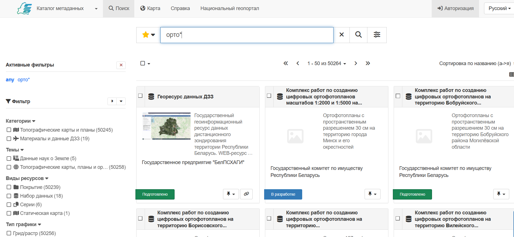
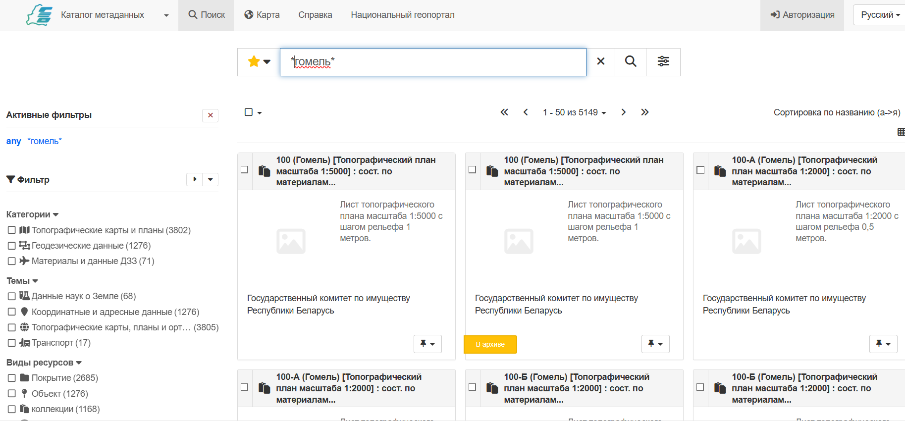
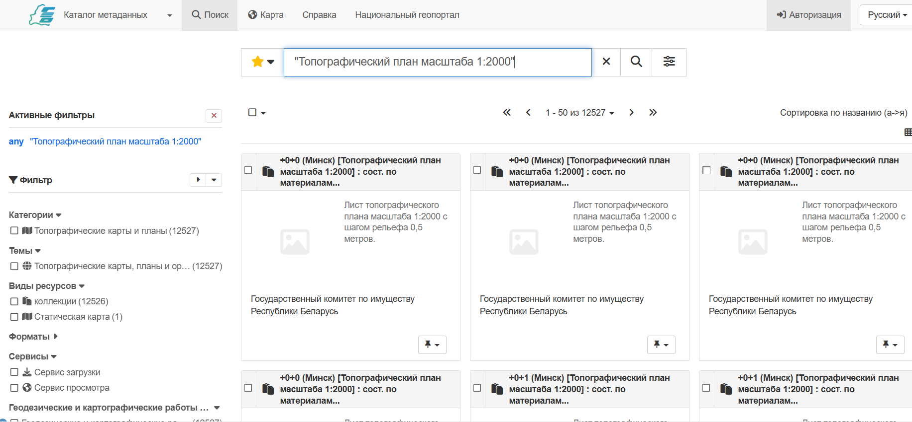
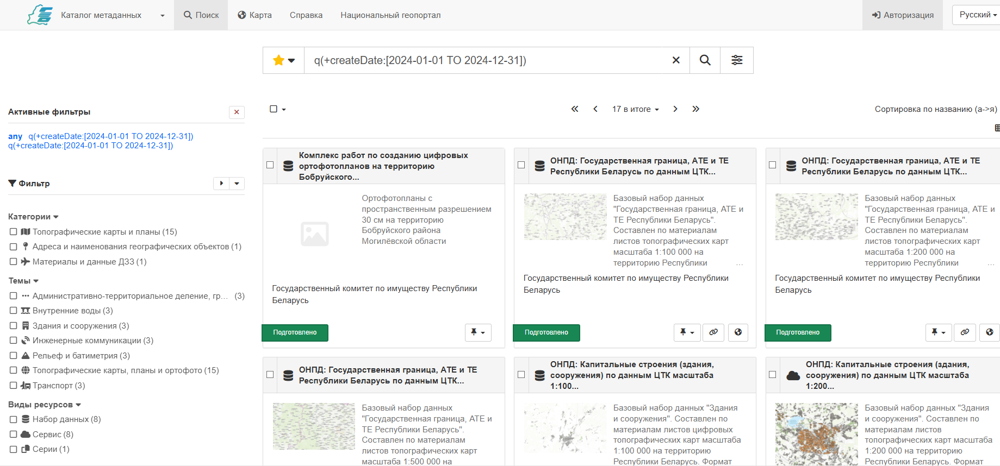
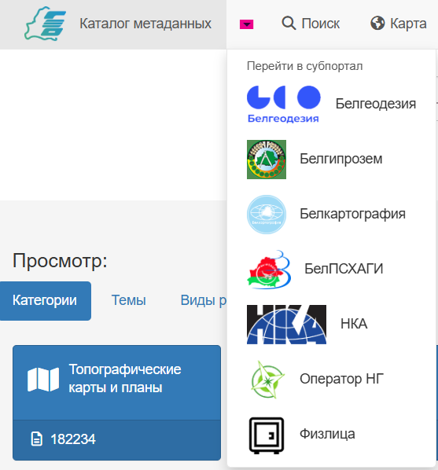
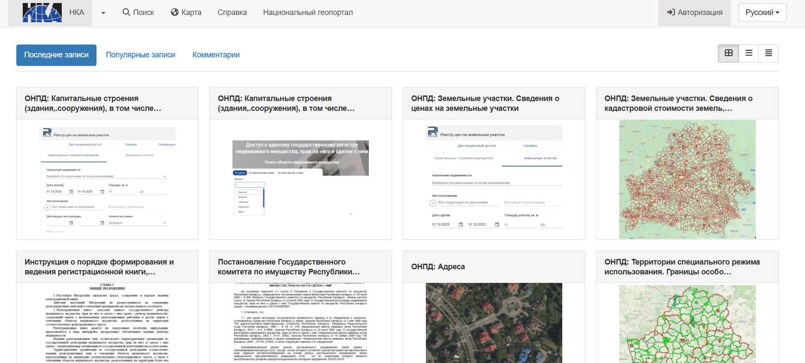
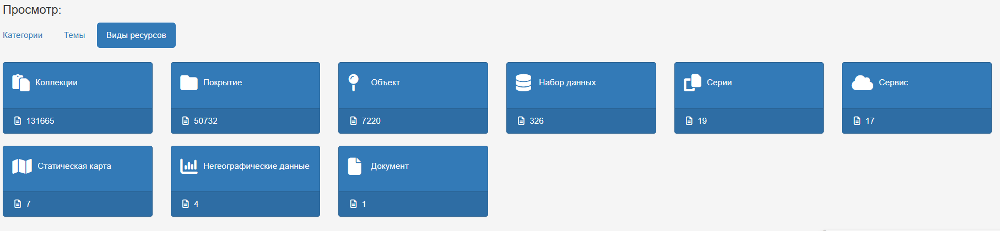

---
tags:
  - Пошук
  - Каталог
  - Тэмы
  - Сетка
  - Спіс
  - Галоўная
hide:
  - tags
---

# Галоўная старонка каталога

Галоўная старонка каталога метададзеных выкарыстоўваецца для пошуку сярод існуючых запісаў метададзеных і хуткага іх папярэдняга прагляду.

## Пошук па каталогу

1.  Увядзіце патрэбныя ключавыя словы і пошукавыя тэрміны ў поле **Пошук**
    у верхняй частцы старонкі і націсніце кнопку **:fontawesome-solid-magnifying-glass: Пошук**
    (або выкарыстоўвайце клавішу _enter_), каб вывесці вынікі пошуку.

    

    
    

    *Поле пошуку*

2.  Пошук па цэлых словах.

    Напрыклад, у поле **Пошук** увядзіце пошукавы запыт: `Минск`
    
    Вынікі адлюстроўваюцца на ўкладцы **Пошук**.

    

    
    

    *Вынікі пошуку для запыту Минск*

3.  Выкарыстоўвайце падстановачны знак `*` для пошуку супадзенняў з пачаткам ці канцом слова.
    Майце на ўвазе, што пошук выконваецца па ўсім змесціве запісу, а не толькі
    па загалоўках і апісанні.
    
    Выкарыстоўвайце поле **Пошук** для ўводу запыту: `орто*`

    

    
    

    *Пошук па пачатку слова орто-*

4.  Падстановачны знак `*` таксама можна выкарыстоўваць некалькі разоў для пошуку часткі слова.

    Выкарыстоўвайце поле **Пошук** для ўводу: `*гомель*`

    

    
    

    *Пошук па частцы слова*

5.  Для пошуку цэлых фраз і дакладных супадзенняў, запыт трэба ўвесці ў двукоссі.

    Увядзіце ў поле **Пошук** запыт: `"Топографический план масштаба 1:2000"`

    

    
    

    *Пошук цэлай фразы ці дакладнага супадзення*

6.  Пошукавы радок дазваляе выкарыстоўваць пашыраныя магчымасці пошукавага рухавіка з дапамогай q-запытаў, якія выкарыстоўваюць спецыяльны сінтаксіс запытаў.

    Напрыклад, для пошуку запісаў пра наборы прасторавых дадзеных, створаных у 2024 годзе, складаецца запыт: `q(+createDate:[2024-01-01 TO 2024-12-31])`

    

    
    

    *Пашыраны пошук запісаў метададзеных*

    !!! **Заўвага** 
    
        Падрабязнае апісанне магчымасцей пашыранага пошуку (апісанне аператараў, падстановачных знакаў і дыяпазонаў) рухавіка Нацыянальнага геапартала можна знайсці ў афіцыйнай дакументацыі **[Elasticsearch - Query String Syntax](https://www.elastic.co/guide/en/elasticsearch/reference/current/query-dsl-query-string-query.html#query-string-syntax)**

7. Вынікі пошуку адлюстроўваюцца на ўкладцы **Пошук**, якая дазваляе фільтраваць і вывучаць запісы.

## Прагляд каталога метададзеных

1.  Прагляд запісаў ажыццяўляецца ў **Каталогу метададзеных** Нацыянальнага геапартала. Пераход да Каталога метададзеных даступны па спасылцы ў левым верхнім вугле старонкі.

    

    
    

    *Спасылка на каталог метададзеных*

    Кожны пастаўшчык дадзеных мае ўласны субпартал (групу), у якім публікуюцца толькі запісы гэтага пастаўшчыка. Назва **каталога** і лагатып пастаўшчыка адпавядае назве і лагатыпу арганізацыі-пастаўшчыка. Адкрыць спіс субпарталаў можна, націснуўшы на значок **:fontawesome-solid-caret-down:**.

    

    
    

    *Спасылкі на субпарталы пастаўшчыкоў*

2.  Старонку любога **каталога** можна вывучаць з дапамогай хуткіх спісаў:

    -   **Апошнія запісы**: нядаўна абноўленыя запісы
    -   **Папулярныя запісы**: часта выкарыстоўваемыя запісы
    -   **Каментарыі**: запісы з новымі каментарыямі і абмеркаваннямі

    

    
    

    *Апошнія запісы ў каталогу субпартала НКА*

3.  Запісы могуць быць адлюстраваны ў выглядзе
    -    :fontawesome-solid-table-cells-large: блокавага спісу
    -    :fontawesome-solid-bars: вялікага спісу
    -    :fontawesome-solid-align-justify: кампактнага спісу
    
    выкарыстоўваючы пераключальнік справа.

    Націсніце на любы з пералічаных запісаў для прагляду.

    

    
    

    *Адлюстраванне спісу апошніх запісаў у субпартале Белгеадэзіі ў выглядзе вялікага спісу*

4.  Старонка каталога прадастаўляе шэраг хуткіх пошукаў для прагляду
    змесціва каталога:

    -   **Катэгорыі** адлюстроўваюць размеркаванне запісаў на аснове катэгарызацыі.
        
        
        *Прагляд каталога метададзеных*

    -   **Тэмы** размяркоўваюць запісы па тэматыках.

        
        *Прагляд каталога метададзеных*

    -   **Віды рэсурсаў** дазваляюць знайсці наборы прасторавых дадзеных або сэрвісы патрэбнай катэгорыі.

        
        *Прагляд каталога метададзеных*