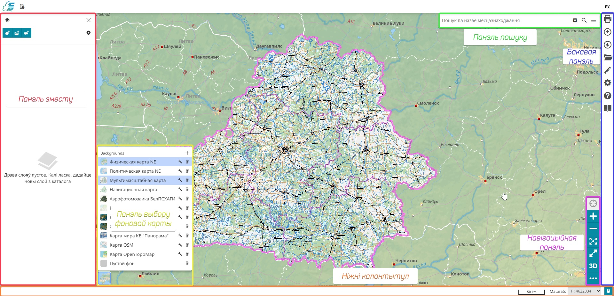

# Карта

Каталог змяшчае інтэрактыўную карту, якая выкарыстоўваецца для папярэдняга прагляду набораў даных. Для пераходу да інтэрактыўнай карты, націсніце кнопку `Карта` на верхняй панэлі ў Каталогу метаданых.

# Інтэрфейс карты

Інтэрфейс старонкі `Карта` складаецца з наступных асноўных блокаў:

{: .ms-docimage }

* [Панэль зместу (Table of Contents)](../../user-guide/map/toc.md#table-of-contents) - спіс загружаных на карту слаёў і груп слаёў. Яго функцыянал дазваляе як выдаліць або адрэдагаваць слаі і групы слаёў, так і дадаць на карту новыя.

* [Панэль пошуку](../../user-guide/map/mapstore-toolbars.md#search-bar) для пошуку месцаў па назвах.

* [Бакавая панэль](../../user-guide/map/mapstore-toolbars.md#side-toolbar), якая ўключае шэраг важных функцый для прагляду, рэдагавання або друку карты.

* [Панэль навігацыі](../../user-guide/map/navigation-toolbar.md), якая дазваляе арыентавацца на карце, а таксама перайсці ў рэжым 3D-адлюстравання карты.

* [Панэль выбару фонавай карты](../../user-guide/map/background.md#background-selector), на якой Карыстальнік можа дадаць, прыбраць або адрэдагаваць фон сваёй карты.

* [Ніжні калантытул](../../user-guide/map/footer.md#footer), у якім Карыстальнік можа: [выбраць патрэбную для адлюстравання сістэму каардынат](../../user-guide/map/footer.md#crs-selector) для сваёй карты; візуалізаваць каардынаты на карце ў выбранай сістэме каардынат, якія адпавядаюць паказальніку мышы; візуалізаваць маштабную лінейку, а таксама змяняць яе, павялічваючы або змяншаючы маштаб карты.

* *Вобласць прагляду змесціва*, у якой Карыстальнік можа бачыць карту, а таксама здзяйсняць аперацыі над ёй.