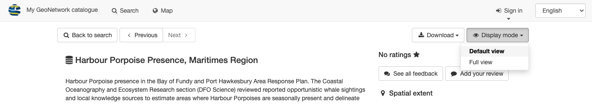
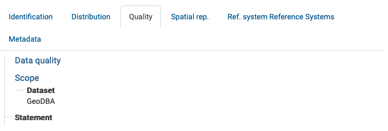
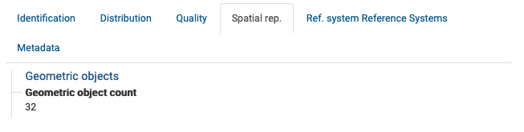
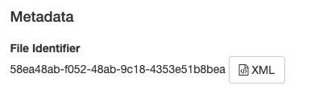

---
tags:
  - Запіс
  - Метададзеныя
  - XML
  - PDF
  - RDF
  - ZIP
  - Прагляд
  - Экспарт
hide:
  - tags
---

# Прагляд запісу

Прагледзьце змест запісу, каб даведацца больш падрабязную інфармацыю пра запіс і апісаны набор даных.

1.  Знайдзіце запіс для прагляду, выкарыстоўваючы пошукавыя механізмы Каталога метададзеных.

2.  Выберыце для прагляду любы знойдзены запіс, які ўключае ў загалоўку зададзеную Вамі пошукавую ўмову.
    Фон запісу стане шэрым, калі вы навядзеце курсор мышы на яго назву:
    
    

    
    

    *Вылучэнне запісу пры навядзенні на яго курсора мышы*

    Націсніце на запіс левай кнопкай мышы для яго падрабязнага прагляду.

3.  Змест запісу адлюстроўваецца ў пачатковым
    рэжыме адлюстравання **Выгляд па змаўчанні**.

    

    
    

    *Выгляд па змаўчанні*

4.  Дзеянні з запісам для прагляду і спампоўвання:

    -   Кнопкі **Наперад** і **Назад** выкарыстоўваюцца для прагляду вынікаў пошуку.
    -   **Спампаваць** выкарыстоўваецца для [экспарту запісу](#спампоўванне-з-рэжыму-прагляду-запісу)
        як `ZIP`, `XML` або `PDF`.
    -   Выпадаючы спіс **Рэжым адлюстравання** дазваляе пераключацца паміж **Выглядам па змаўчанні** 
        і **Поўным выглядам**, разглядаемым у наступным раздзеле.

    

    
    

    *Дзеянні з запісам*

## Выгляд па змаўчанні

**Выгляд па змаўчанні** прадастаўляе кароткую зводку зместу запісу:

1.  Выкарыстоўвайце выпадаючае меню **Рэжым адлюстравання** для выбару **Выгляду па змаўчанні**.

    

    
    

    *Змяненне рэжыму адлюстравання на выгляд па змаўчанні*

2.  Загаловак і апісанне запісу адлюстроўваюцца ў верхняй частцы старонкі.

    
    *Апісанне запісу*

3.  Раздзел **Аб гэтым рэсурсе** змяшчае інфармацыю пра змесціва, напрыклад, тэматычную катэгорыю.

    
    *Аб гэтым рэсурсе*

4.  Раздзел **Тэхнічная інфармацыя** змяшчае дэталі, такія як фармат даных.

    
    *Тэхнічная інфармацыя*

5.  Раздзел **Інфармацыя пра метададзеныя** прадастаўляе кнопку для спампоўвання запісу XML, кантактную інфармацыю і
    ўнікальны ідэнтыфікатар.

    
    *Інфармацыя пра метададзеныя*

6.  З правага боку:

    -   **Прасторавы ахоп** візуальна паказаны на карце
    -   Інфармацыя пра абнаўленні і зваротную сувязь.

    

    
    

    *Выгляд па змаўчанні*

## Поўны выгляд

**Поўны выгляд** выкарыстоўваецца для адлюстравання поўнага зместу запісу.

1.  Выкарыстоўвайце выпадаючае меню **Рэжым адлюстравання** для выбару **Поўнага выгляду**.

2.  Пашыраны выгляд падзяляе запіс на некалькі ўкладак:

    -   Ідэнтыфікацыя
    -   Распаўсюджванне
    -   Якасць
    -   Прасторавае прадстаўленне
    -   Сістэмы каардынат
    -   Метададзеныя

3.  Укладка **Ідэнтыфікацыя** прадастаўляе:

    -   Інфармацыю пра цытаванне:
        
        
        *Дэталі цытавання*
        
    -   Статус і прававыя абмежаванні (такія як Палітыка распаўсюджвання даных).
        
        
        *Анатацыя і ключавыя словы*
        
    -   Дадатковую інфармацыю, уключаючы часавы і прасторавы ахоп
        
        
        *Дадатковая інфармацыя пра ідэнтыфікацыю*
    
4.  Укладка **Распаўсюджванне** змяшчае дэталі пра тое, як атрымаць доступ да кантэнту.

    
    *Дэталі распаўсюджвання даных*

5.  Укладка **Якасць** пералічвае інфармацыю пра якасць даных.

    
    *Дэталі якасці даных*

6.  Укладка **Прасторавае прадстаўленне** прадастаўляе зводку прасторавага прадстаўлення.

    
    *Дэталі прасторавага прадстаўлення*

7.  Укладка **Сістэма каардынат** ахоплівае інфармацыю пра выкарыстоўваемую сістэму прасторавых каардынат.

    Гэта прадастаўляецца ў выглядзе машыначытаемага кода сістэмы каардынат.
    
    У прыкладзе выкарыстоўваецца код `http://www.opengis.net/def/crs/EPSG/0/26917` для сістэмы каардынат
    `NAD83 / UTM zone 17N`.

8.  Укладка **Метададзеныя** ахоплівае ўнікальны ідэнтыфікатар файла, прадастаўляючы спасылку для прагляду XML-дакумента,
    а таксама інфармацыю пра кантактную асобу запісу.

    
    *Дэталі метададзеных запісу*

## Запіс XML

1.  Запіс XML можна паказаць з:

    -   Загалоўка метададзеных **Выгляду па змаўчанні**, які прадастаўляе кнопку **Спампаваць метададзеныя**.
        
        
        *Спампоўванне метададзеных з выгляду па змаўчанні*
    
    - Укладкі метададзеных **Поўнага выгляду**, якая прадастаўляе спасылку на **XML**.

       
       *Спампоўванне метададзеных з поўнага выгляду*
    
2.  Файл XML спампоўваецца або адлюстроўваецца прама ў вашым браўзеры.

    

    
    

    *Спампоўванне XML, паказанае ў FireFox*

3.  Майце на ўвазе, што запіс XML не ўключае прымацаваныя дакументы або мініяцюры.

    Інфармацыю пра тое, як спампаваць поўную інфармацыю пра запіс метададзеных Вы знойдзеце ў наступным раздзеле - Спампоўванне з рэжыму прагляду запісу.
    
## Спампоўванне з рэжыму прагляду запісу

Спампуйце змест аднаго запісу.

1.  У рэжыме прагляду запісу, раскрыйце спіс опцый **:fontawesome-solid-download: спампоўвання**:

    

    
    

    *Опцыі спампоўвання запісу*

2.  **Пастаянная спасылка** прадастаўляе URL, якім
    можна падзяліцца па электроннай пошце або ў паведамленні.

    
    *Пастаянная спасылка на запіс*

    Выкарыстоўвайце _control+c_ (або _command+c_ на macOS), каб скапіраваць тэкст у буфер абмену:

    
    *Пастаянная спасылка скапіравана*

3.  Архіў, даступны для спампоўвання пры выбары варыянту **Экспарт (ZIP)**, уключае:

    -   Папку, якая змяшчае поўны запіс **`metadata.xml`** і спрошчаны
        запіс ***`metadata-iso19139.xml`***.
    -   Зводку ***`index.html`** і **`index.csv`**, апісаную ў
        [папярэднім раздзеле](../search/index.md#спампоўванне-запісаў-метададзеных-з-акна-пошуку).

    
    *Зводка index.html экспарту (ZIP)*

    Гэты файл карысны для абмену інфармацыяй паміж сістэмамі. Змесціва
    архіва прытрымліваецца канвенцыі «Metadata Exchange Format», якая выкарыстоўваецца
    для абмену запісамі паміж каталогамі.

4.  Дакумент **Экспарт (PDF)**.

    

    
    

    *Дакумент экспарту (PDF)*

5.  Машыначытаемы дакумент **Экспарт (XML)**.

    

    
    

    *Спампоўванне XML, паказанае ў вэб-браўзеры*

6.  Машыначытаемае вызначэнне выкарыстоўваемага слоўніка **Экспарт (RDF)** (Export (RDF)).

    Гэты файл карысны для абмену інфармацыяй паміж сістэмамі.