---
tags:
  - Запіс
  - Метададзеныя
  - XML
  - PDF
  - RDF
  - ZIP
  - Прагляд
  - Экспарт
hide:
  - tags
---

# Прагляд запісу

Каб даведацца больш падрабязную інфармацыю пра запіс і апісаны набор даных, Вы можаце прагледзець змесціва запісу.

1.  Знайдзіце запіс для прагляду, выкарыстоўваючы пошукавыя механізмы Каталога метададзеных.

2.  Выберыце для прагляду любы знойдзены запіс, які ўключае ў загалоўку зададзеную Вамі пошукавую ўмову.
    Фон запісу стане шэрым, калі вы навядзеце курсор мышы на яго назву на старонцы вынікаў пошуку:
    
    

    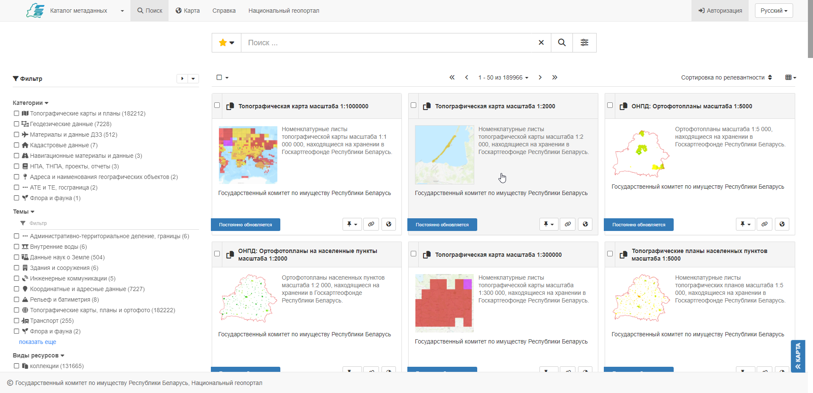
    

    *Вылучэнне запісу пры навядзенні на яго курсора мышы*

    Націсніце на запіс левай кнопкай мышы для яго падрабязнага прагляду.

3.  Змесціва запісу адлюстроўваецца ў пачатковым
    рэжыме адлюстравання **Выгляд па змаўчанні**.

    

    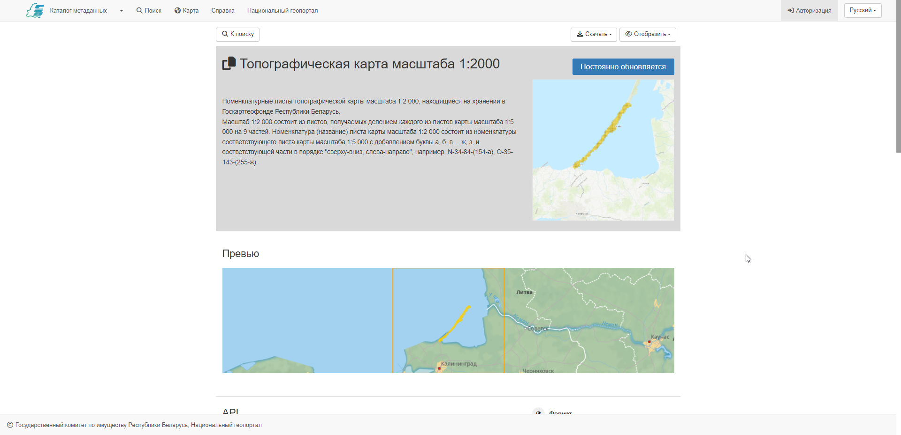
    

    *Выгляд па змаўчанні*

4.  Дзеянні з запісам для прагляду і спампоўвання:

    -   Кнопка **Да пошуку** выкарыстоўваецца для вяртання на старонку вынікаў пошуку.
    -   **Спампаваць** выкарыстоўваецца для [экспарту запісу](#спампоўванне-з-рэжыму-прагляду-запісу)
        як `ZIP`, `XML` або `PDF`.
    -   Выпадаючы спіс **Адлюстраваць** дазваляе пераключацца паміж выглядам **Па змаўчанні** 
        і **Дэталёвым** выглядам, які будзе разгледжаны ў гэтым артыкуле [далей](#дэталёвы-выгляд).

    

    
    

    *Дзеянні з запісам*

## Выгляд па змаўчанні

Выгляд **па змаўчанні** прадастаўляе кароткую зводку змесціва запісу:

1.  **Загаловак** і **апісанне** запісу адлюстроўваюцца ў верхняй частцы старонкі.

    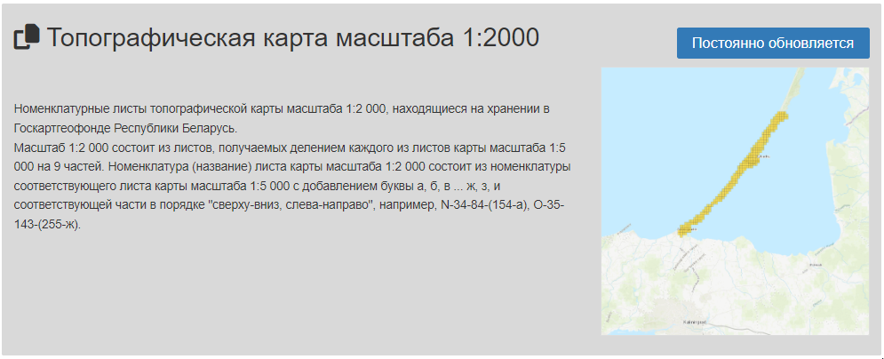
    *Апісанне запісу*

2.  Раздзел **Прэв'ю** змяшчае малюнак прасторавага ахопу на міні-карце, які апісвае сапраўднае размяшчэнне даных, якія адносяцца да выбранага запісу.

    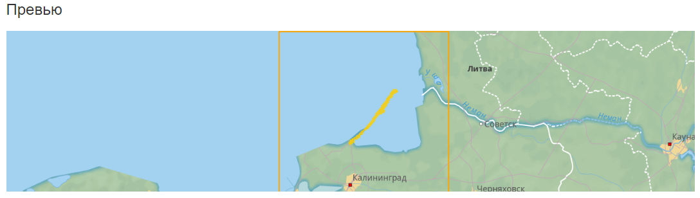
    *Прэв'ю*

3. Раздзел спасылак і фармату - змяшчае спасылкі:
    - на пласты прасторавых даных, даступныя на Нацыянальным геапартале для прагляду ў сродку картаграфічнага прагляду Каталога метададзеных, 
    - на даныя рэсурсу, даступныя для прагляду ў Каталогу карт Нацыянальнага геапартала,
    - фармат даных, якія распаўсюджваюцца дадзеным запісам

    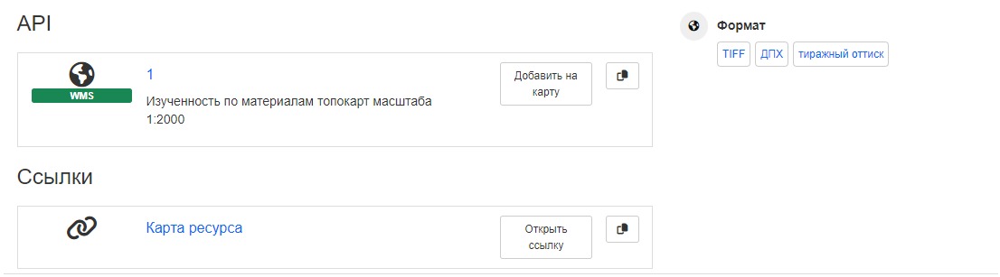
    *Прэв'ю*

4. Раздзел **Тэхнічная інфармацыя** змяшчае дэталі пра запіс, такія як дата публікацыі, катэгорыя і тэматыка запісу, маштаб і сістэма каардынат.

    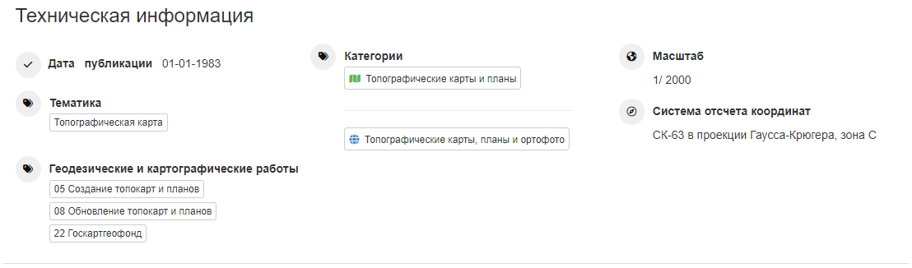
    *Тэхнічная інфармацыя*

5. Раздзел **Кантактныя даныя** ўключае звесткі пра ўладальніка, аўтара і пастаўшчыка даных, якія прадстаўляюцца ў выбраным запісе.
    
    
    *Кантактная інфармацыя*

6. Раздзел **Інфармацыя пра метададзеныя** прадастаўляе спасылку на запіс метададзеных у Каталогу, інфармацыю пра аўтара метададзеных і
    унікальны ідэнтыфікатар.

    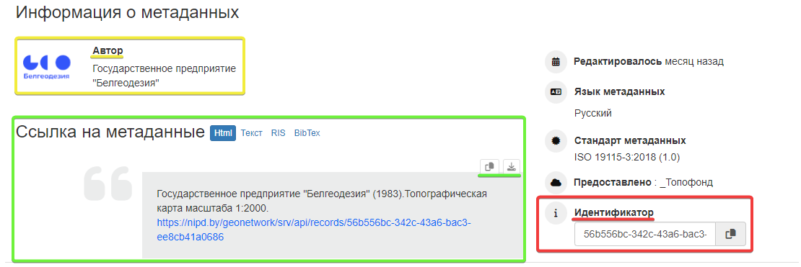
    *Інфармацыя пра метададзеныя*

7.  Раздзел **Ацэнкі** будзе ўключаць інфармацыю пра ацэнкі запісу метададзеных, пакінутых іншымі карыстальнікамі.

    
    *Ацэнкі*

8. Раздзел **Падобныя запісы** прапануе некалькі спасылак для хуткага пераходу на запісы метададзеных, размешчаныя ў Каталогу метададзеных, якія супадаюць па тэматыцы/катэгорыі з адкрытым запісам.

    
    *Падобныя запісы*

## Дэталёвы выгляд

**Дэталёвы выгляд** выкарыстоўваецца для адлюстравання поўнага змесціва запісу.

1.  Выкарыстоўвайце выпадаючае меню **Адлюстраваць** для выбару **Дэталёвага выгляду**.

    
    *Выбар дэталёвага выгляду*

2.  Дэталёвы выгляд падзяляе запіс на некалькі ўкладак:

    -   Ідэнтыфікацыя
    -   Распаўсюджванне
    -   Сістэмы каардынат
    -   Метададзеныя

3.  Укладка **Ідэнтыфікацыя** прадастаўляе:

    -   Апісанне запісу:
        
        
        *Апісанне запісу*
        
    -   Статус і прававыя абмежаванні:
        
        
        *Статус*

        
        *Абмежаванні*
        
    -   Падрабязную кантактную інфармацыю пра ўладальніка, пастаўшчыка і аўтара даных:

         
        *Падрабязная кантактная інфармацыя*

    -   Дадатковую інфармацыю, уключаючы часавы, прасторавы ахоп, тэматыку, прадметную вобласць і катэгорыі
        
        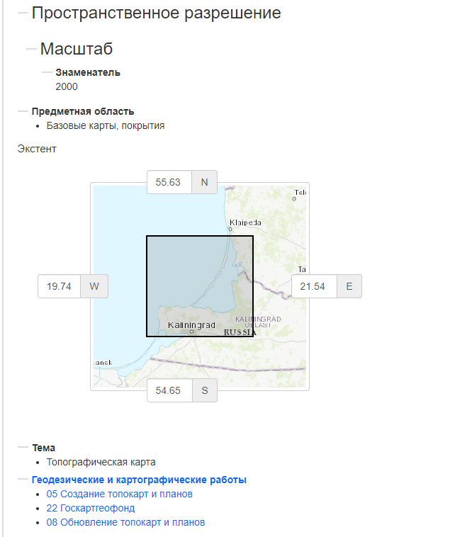
        *Дадатковая інфармацыя пра ідэнтыфікацыю*
    
4.  Укладка **Распаўсюджванне** змяшчае дэталі пра тое, які фармат маюць даныя, а таксама наяўныя спасылкі для доступу да даных, апісваемых у запісе.

    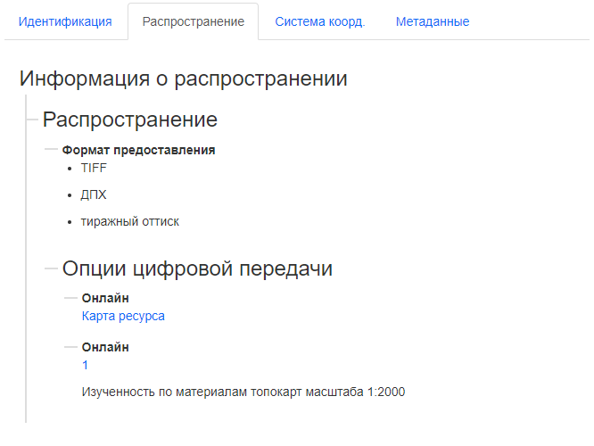
    *Дэталі распаўсюджвання даных*

5.  Укладка **Сістэма каардынат** ахоплівае інфармацыю пра выкарыстоўваемую сістэму прасторавых каардынат.

    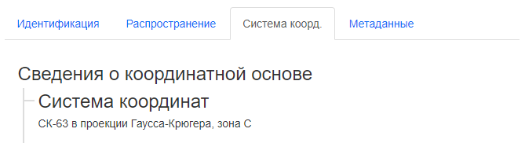
    *Сістэма каардынат*

6.  Укладка **Метададзеныя** прадастаўляе Карыстальніку:
    
    - унікальны ідэнтыфікатар запісу метададзеных, інфармацыю пра кантактную асобу запісу:

        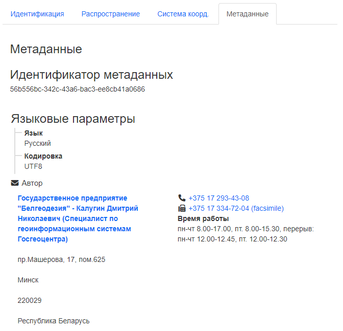
        *Дэталі метададзеных запісу*

    - інфармацыю пра тып рэсурсу, уключаючы спасылку на метададзеныя (прагляд старонкі ў вэб-браўзеры), дату стварэння/рэдакцыі даных, стандарт метададзеных:

        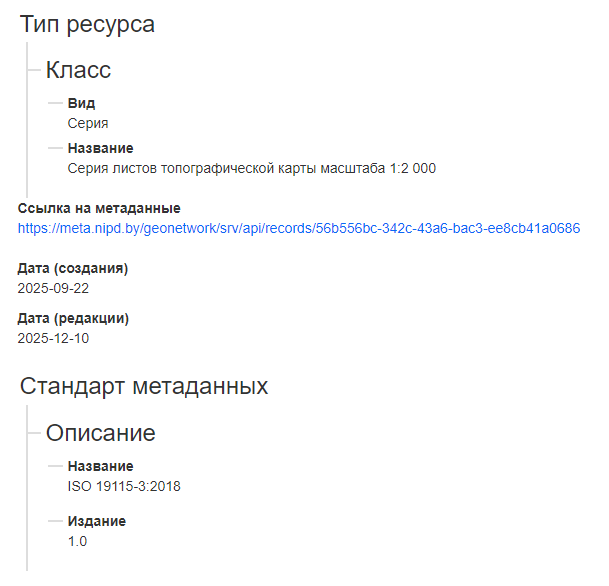
        *Дэталі метададзеных запісу*

7. У правай частцы інтэрфейсу старонкі запісу метададзеных, адкрытай у дэталёвым выглядзе, знаходзяцца:
    
    - вокны **Перадпрагляды** і **Прасторавы экстэнт**, якія дазваляюць Карыстальніку даведацца прасторавы ахоп для выбранага запісу.

        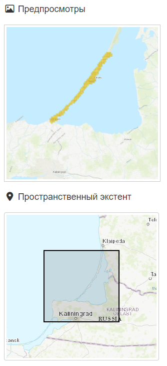
        *Перадпрагляд і прасторавы экстэнт*

    - пералік ключавых слоў і катэгорый запісаў, якія дазваляюць класіфікаваць і апісаць запіс метададзеных для яго больш аптымальнага пошуку ў Каталогу.

        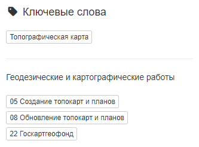
        *Ключавыя словы і катэгорыі*
    
    - раздзел **Прадастаўлена**, які змяшчае спасылку на запіс метададзеных у Каталогу метададзеных.

    - раздзел **Звязаныя запісы**, які ўключае спасылкі на запісы, якія звязаны з выбраным запісам метададзеных, у Каталогу метададзеных.

        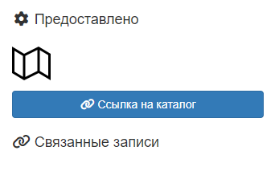
        *Прадастаўлена і звязаныя запісы*

## Запіс у фармаце XML

1.  Атрымаць доступ да запісу метададзеных у фармаце XML можна, выбраўшы на старонцы запісу (як у выглядзе прагляду па змаўчанні, так і з дэталёвага выгляду) у выпадаючым акне **:fontawesome-solid-download: Спампаваць** варыянт *Экспарт (XML)*:
        
    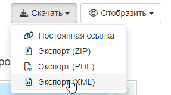
    *Экспарт (XML)"*
    
2.  Па націсканні левай кнопкі мышы па варыянце *Экспарт (XML)* альбо адкрыецца новая ўкладка браўзера з кодам XML, альбо будзе пачата спампоўванне файла ў фармаце XML.

    

    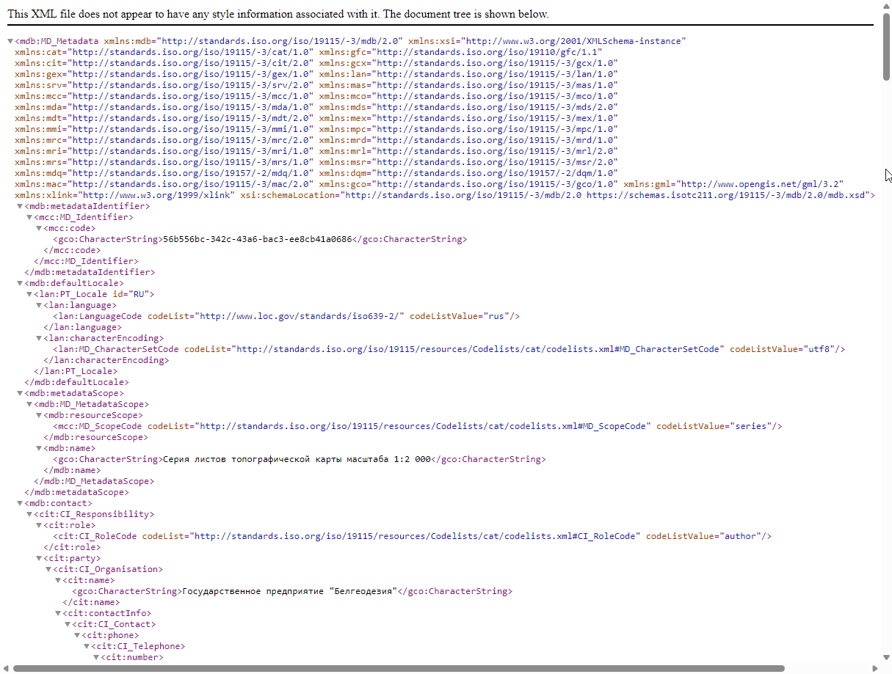
    

    *Запіс у фармаце XML, паказаная ў вэб-браўзеры*

3.  Майце на ўвазе, што запіс метададзеных у фармаце XML не ўключае дададзеныя ў яе дакументы або мініяцюры.

    Інфармацыю пра тое, як спампаваць поўную інфармацыю пра запіс метададзеных Вы знойдзеце [далей](#спампоўванне-з-рэжыму-прагляду-запісу).
    
## Спампоўванне з рэжыму прагляду запісу

1.  У любым рэжыме прагляду запісу, раскрыйце спіс опцый **:fontawesome-solid-download: Спампаваць**:

    

    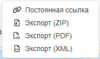
    

    *Опцыі спампоўвання запісу*

2.  Варыянт **Пастаянная спасылка** прадастаўляе URL, якім
    можна падзяліцца па электроннай пошце або ў паведамленні.

    
    *Пастаянная спасылка на запіс*

    Вы можаце вылучыць тэкст спасылкі ў буфер абмену, вылучыўшы яго цалкам з дапамогай заціснутай левай кнопкі мышы альбо націснуўшы кнопку ў правай частцы акна, якое з'явілася, для капіравання тэксту спасылкі ў буфер абмену:

    
    *Кнопка капіравання пастаяннай спасылкі*

3.  Архіў, даступны для спампоўвання пры выбары варыянту **Экспарт (ZIP)**, уключае:

    -   Папку, якая змяшчае поўны запіс ***`metadata.xml`*** і спрошчаны
        запіс у фармаце XML ***`metadata-iso19139.xml`***.
    -   Зводкі ***`index.html`*** і ***`index.csv`***, апісаную ў
        [папярэднім раздзеле](../search/index.md#спампоўванне-запісаў-метададзеных-з-акна-пошуку).

    
    *Зводка index.html экспарту (ZIP)*

    Гэты файл карысны для абмену інфармацыяй паміж сістэмамі. Змесціва
    архіва прытрымліваецца канвенцыі «Metadata Exchange Format», якая выкарыстоўваецца
    для абмену запісамі паміж каталогамі.

4.  Пры выбары варыянту **Экспарт (PDF)** Карыстальнік спампуе на камп'ютар файл у фармаце PDF, у якім будзе тэкставае і візуальнае змесціва метададзеных.

    

    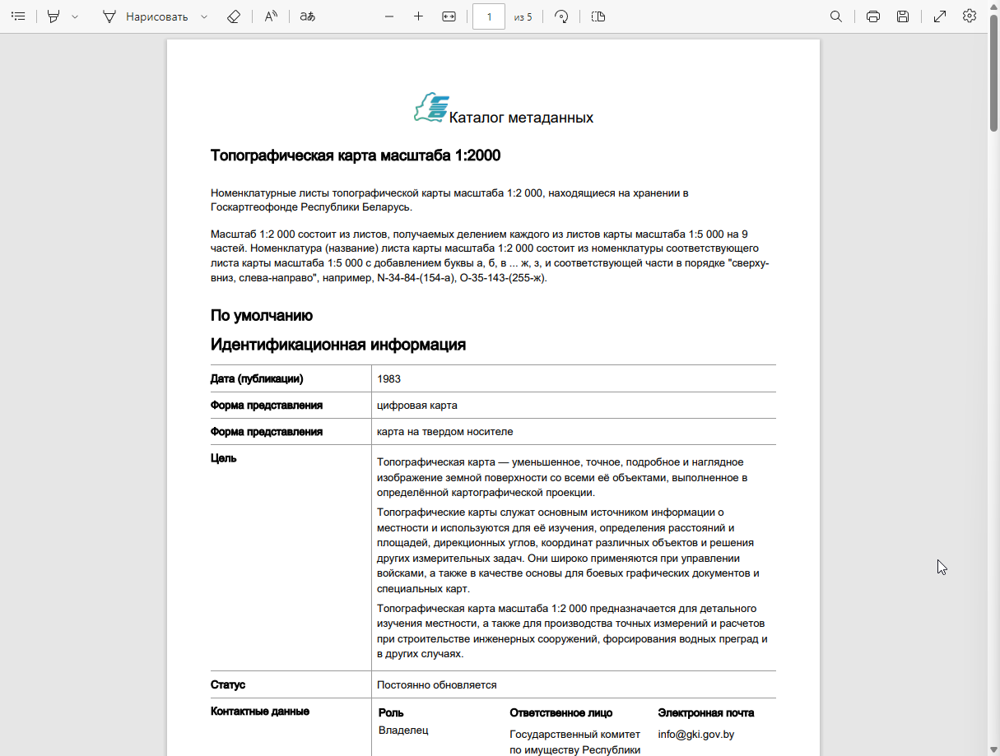
    

    *Дакумент экспарту (PDF)*