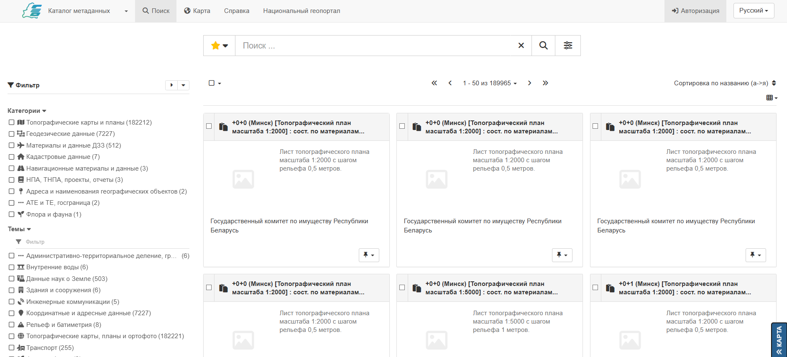
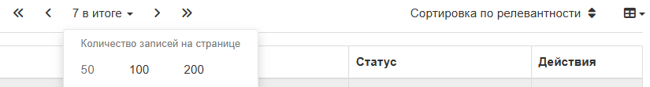
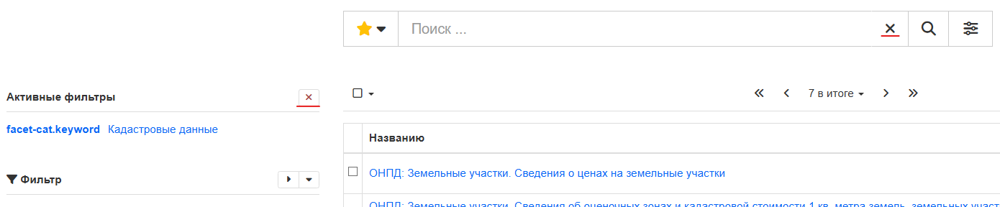
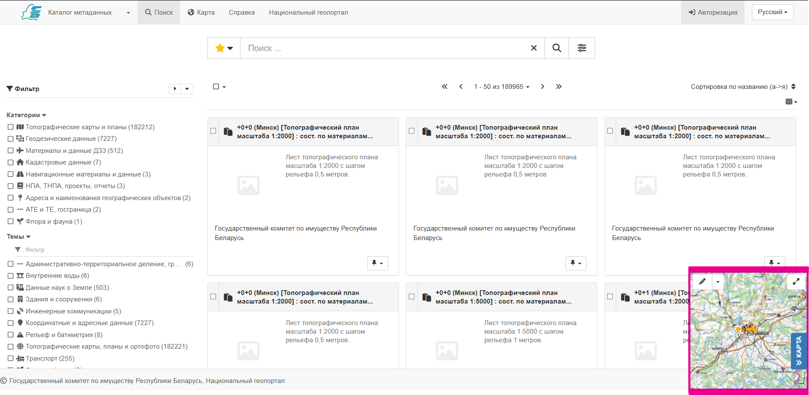
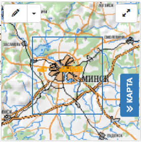
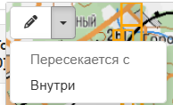
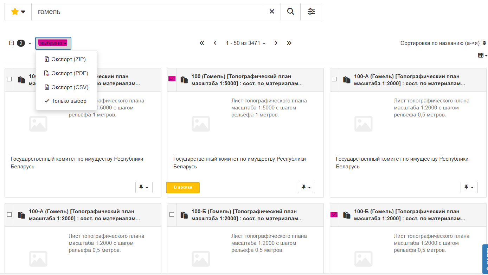
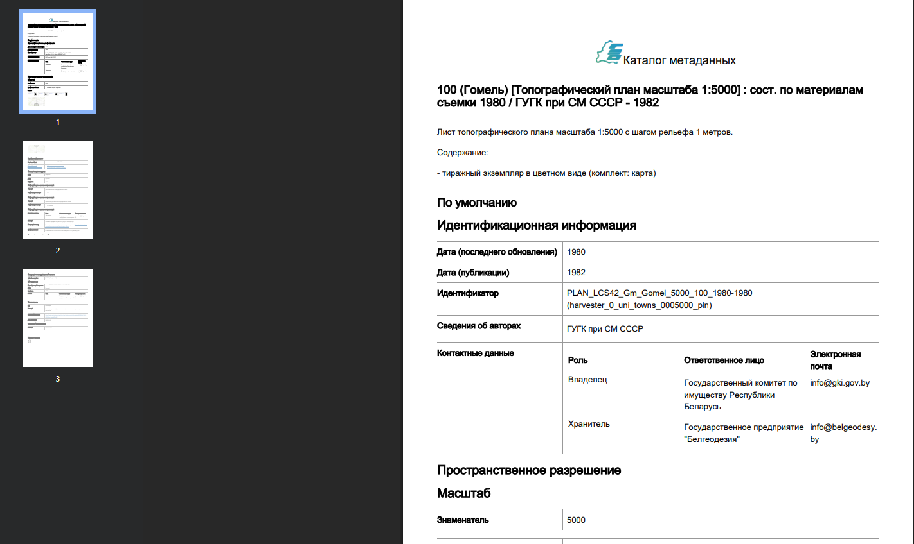

---
tags:
  - Пошук
  - Каталог
  - Фільтр
  - Сетка
  - Спіс
hide:
  - tags
---

# Старонка пошуку

Старонка **Пошук** адлюстроўвае вынікі пошуку для фільтрацыі і сартавання.

## Вынікі пошуку

Каталог метададзеных дазваляе больш дэталёва вывучыць вынікі пошуку:

1.  Перайдзіце на старонку **:fontawesome-solid-magnifying-glass: Пошук** (праглядзіце запісы або выканайце [пошук па каталогу](../home/index.md#пошук-па-каталогу), каб
    вывесці вынікі пошуку).

    

    
    

    *Старонка пошуку*
    
2.  Выкарыстоўвайце раздзел **:fontawesome-solid-magnifying-glass: Фільтр** з правага боку для ўдакладнення вынікаў пошуку,
    выкарыстоўваючы дадатковыя пошукавыя фасеты, ключавыя словы і дэталі, такія як фармат спампоўвання.
    
    Для прыкладу, адзначце «пошукавы фасет» `Кадастровые данные`, каб адфільтраваць вынікі пошуку да
    супадаючых запісаў.

    

    
    

    *Фільтрацыя вынікаў*

3.  Опцыі, даступныя ў верхняй частцы вынікаў пошуку:
    
    * Прадстаўленне знойдзеных запісаў (як **:fontawesome-solid-table-cells-large: Сетка**
    або **:fontawesome-solid-bars: Спіс**)
    * Сартаванне вынікаў
    * Кіраванне колькасцю адлюстраваных вынікаў на старонцы
    * Пераход да дадатковых старонак вынікаў
    * Хуткі выбар запісаў

    

    
    

    *Прагляд вынікаў*

4.  Каб ачысціць вынікі пошуку, выкарыстоўвайце кнопку **:fontawesome-solid-xmark: Ачысціць бягучы пошукавы запыт, фільтры і сартаванні**
    у любы час. Гэтая кнопка знаходзіцца ў полі **Пошук** у верхняй частцы старонкі, а таксама ў левай частцы інтэрфейсу побач з пералікам **Актыўных фільтраў**.
	
	

    
    

    *Скід пошукавага запыту, фільтрацыі, сартавання*

5.  **:fontawesome-solid-sliders: Параметры пошуку** па Каталогу метададзеных знаходзяцца ў 
    полі **Пошук** у верхняй частцы старонкі.
    
    Гэтыя параметры можна выкарыстоўваць для задання ўмовы пошуку (дакладнае супадзенне пошукавага запыту або пошук толькі па назве запісу), выбару мовы матэрыялаў Каталога метададзеных для адлюстравання шуканых запісаў, а таксама выбар часавага прамежку стварэння шуканых запісаў метададзеных.

    

    
    

    *Панэль параметраў пошуку*

6.  Адкрыйце панэль **:fontawesome-solid-sliders: параметраў пошуку**.
    
    Выкарыстоўваючы выпадаючае меню **Часавы прамежак рэсурсу** выберыце `на этой неделе`.
    Гэта дзеянне запоўніць палі календара **Ад** і **Да**.
    
    Націсніце кнопку **:fontawesome-solid-magnifying-glass: Пошук** для фільтрацыі з выкарыстаннем гэтага дыяпазону дат.

    

    
    

    *Пошук запісаў, абноўленых за мінулы тыдзень*
	
	Таксама ў гэтай панэлі можна выбраць спосаб кіравання вынікамі пошуку па часавым прамежку. У акенцы, лявей поля **Ад**, Вы можаце выбраць: даты абнаўлення шуканых запісаў будуць перасякаць зададзены часавы прамежак, трапляць унутр яго або перакрываць.
	
	

    
    

    *Пошук запісаў, абноўленых за мінулы тыдзень*

7.  У ніжняй частцы старонкі пошуку прадстаўлена **высоўная карта**, якая забяспечвае візуальную зваротную сувязь па ахопе кожнага запісу.

    

    
    

    *Карта пошуку*

    Высоўнай картай можна кіраваць, пераключаючыся паміж двума рэжымамі:

    -   Панарамаванне: Націсніце і перацягніце месцазнаходжанне карты, выкарыстоўваючы кольца мышы для
        рэгулявання ўзроўню маштабавання.

    -   Абмежавальны прамавугольнік: Утрымлівайце _shift_ і, заціснуўшы левую кнопку мышы, правядзіце прамавугольнік (сіняга колеру), які адмаштабуе экстэнт высоўнай карты ў адпаведнасці з межамі гэтага прамавугольніка.
	
	
	*Выбар зоны маштабавання*
	
	Каб вызначыць ахоп, які выкарыстоўваецца для фільтрацыі запісаў, перавядзіце высоўную карту ў рэжым малявання, націснуўшы на іконку **:fontawesome-solid-pencil-alt: Алоўка**. Пасля гэтага, заціснуўшы левую кнопку мышы, правядзіце прамавугольнік (чырвонага колеру), які вызначыць экстэнт для фільтрацыі запісаў у Каталогу метададзеных. Пасля гэтага, у пошуку застануцца толькі тыя запісы, якія або перасякаюцца, або знаходзяцца ўнутры размечаннага прамавугольніка.
	
	
	*Выбар ахопу тэрыторыі для фільтрацыі запісаў*
	
	> Выбар варыянту адлюстравання запісаў па выніках накладання прасторавага экстэнта ў высоўнай карце, ажыццяўляецца ў выпадаючым меню **:fontawesome-solid-caret-down:**, побач з іконкай **:fontawesome-solid-pencil-alt: Алоўка**:
	
	>
	
	
	> Скінуць выбраны прасторавы экстэнт магчыма, націснуўшы на **:fontawesome-solid-eraser: гумку**, якая з'явіцца замест **алоўка**, у момант яго актывацыі:
	
	>
    
## Спампоўванне запісаў метададзеных з акна пошуку
	
Для хуткай загрузкі (у фармаце ZIP або CSW) або генерацыі PDF аднаго ці некалькіх запісаў з Каталога метададзеных:
	
- гэтыя запісы спачатку трэба вылучыць з выкарыстаннем сцяжка, размешчанага побач з кожным з іх у пошукавым акне, 

- вярнуцца да радка пошуку, націснуць на выпадаючы спіс **выбрана** для выбару варыянту спампоўвання запісаў.

*Выбраныя запісы*

Архіў, сфарміраваны пры націсканні на варыянт **Экспарт (ZIP)**, уключае ў сябе выбраныя запісы метададзеных: для кожнага экспартаванага запісу будзе створана папка, якая змяшчае захаваны ў фармаце `xml` запіс метададзеных разам з адпаведнымі ўкладаннямі і мініяцюрамі. 
Таксама ў архіў змешчаны зводкі змесціва спампаванага файла ў двух фарматах: **html** (`index.html`) і **csv** (`index.csv`).

Пры выбары варыянту **Экспарт (PDF)** на Ваш камп'ютар будзе спампаваны PDF-файл са зместам выбраных запісаў метададзеных.

*Экспарт PDF*

Загрузка з выкарыстаннем варыянту **Экспарт (CSV)**, прадаставіць Вам
таблічную зводку экспартаваных запісаў у фармаце `csv`.

*Экспарт CSV*