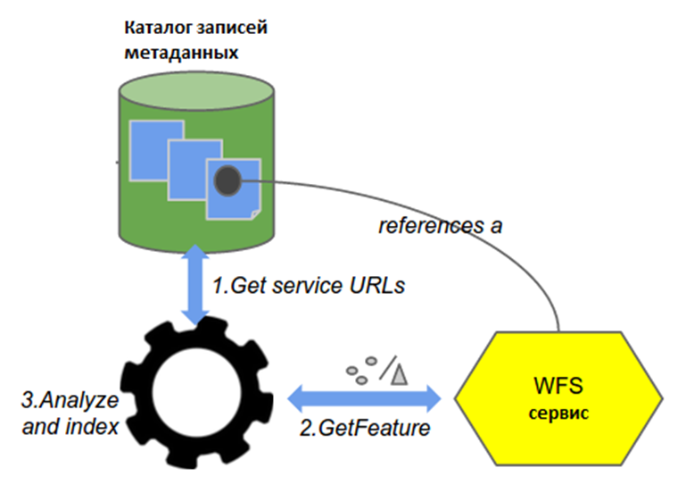
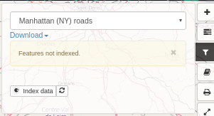
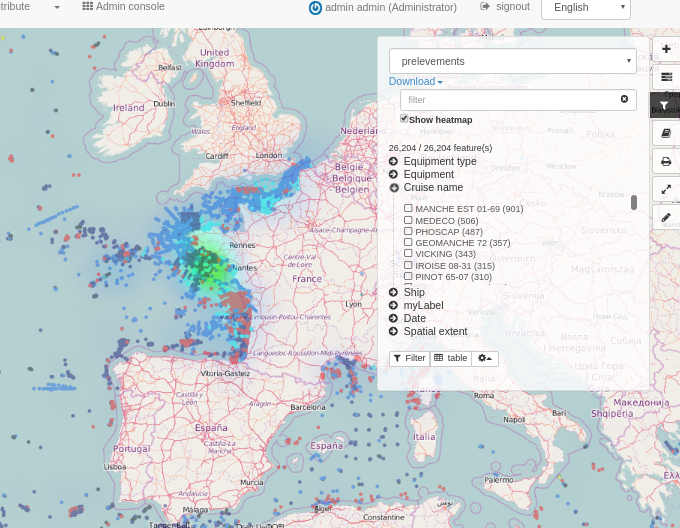
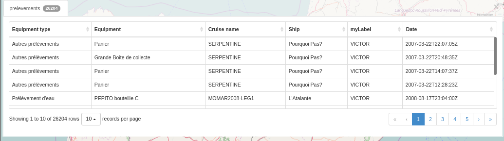
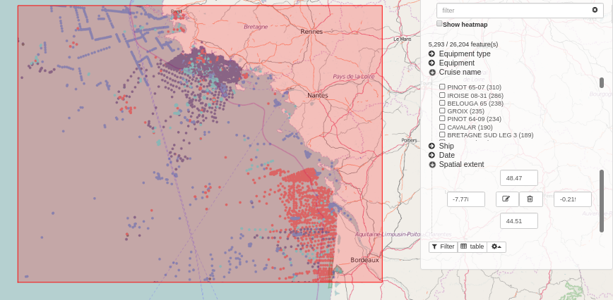

# Аналіз і візуалізацыя дадзеных{#analyzing_data}

## Даныя з WFS 

Усе дадзеныя, апісаныя ў запісах метададзеных і даступныя праз [WFS](https://live.osgeo.org/archive/8.0/ru/standards/wfs_overview.html), могуць быць прааналізаваны для паляпшэння пошуку дадзеных і іх візуалізацыі на карце.
Каталог аналізуе WFS-аб'екты і **індэксуе** іх.



!!! Заўвага:

  У якасці пошукавай сістэмы ў Каталогу метададзеных выкарыстоўваецца Elasticsearch - адна з самых папулярных пошукавых сістэм у галіне Big Data, маштабуемае нерэляцыйнае сховішча дадзеных з адкрытым зыходным кодам, аналітычная NoSQL-СУБД з шырокім наборам функцый паўнатэкставага пошуку.

Калі інфармацыя пра дадзеныя будзе атрымана з WFS-сервера, становіцца даступнай фільтрацыя. 
Інтэрфейс фільтрацыі дае магчымасць разбіцця набору дадзеных на групы (фасетавання), а таксама магчымасць экспарту. 
Праглядчык карт спрабуе падключыцца да службы WFS, замяняючы ў URL службы WMS на WFS. Калі такі запыт на WFS-сэрвіс паспяховы, 
панэль фільтрацыі дае магчымасць індэксаваць аб'екты ў разгляданага набору дадзеных. Карыстальнік павінен быць аўтарызаваны, 
каб запусціць працэс індэксавання.



Пасля індэксацыі ўсе карыстальнікі могуць атрымаць доступ да меню фільтрацыі, якое забяспечвае:

- тэкставы пошук па ўсіх палях набору дадзеных
- элемент кіравання для адлюстравання цеплавой карты (heatmap)
- разбіцця набору дадзеных па ўсіх палях (аўтаматычнае вылічэнне межаў дыяпазону для лікаў)
- адлюстравання ўсіх значэнняў у табліцы
- прымяняць фільтры да слаёў WMS, выкарыстоўваючы SLD



Націсніце на меню табліцы, каб адлюстраваць атрыбуты. Двойчы пстрыкніце радок у табліцы, каб змяніць маштаб атрыбута.



Таксама можна прымяняць прасторавыя фільтры.



## Наладка тыпаў аб'ектаў

Па змаўчанні панэль фільтраў фарміруецца на аснове індэкса Elasticsearch. Але яе можна наладзіць для пэўнага WFS-аб'екта з набору дадзеных.

Наладка ажыццяўляецца з дапамогай канфігурацыйнага JSON-файла, устаўленага ў раздзел gmd:applicationProfile анлайн-рэсурсу ў метададзеных.

Вось параметры:

```json
{
  «fields": [{
    «name": «PNT_PROF»,
    // non disponible actuellement
    «type": «double»,
    «fq» : {
      «facet.interval": «PNT_PROF_d»,
      «facet.interval.set": [«[0,10]», «(10,10000]»],
     або
      «facet.range": «PNT_PROF_d»,
      «facet.range.start": «0»,
      «facet.range.end": «10000»,
      «facet.range.gap": «300»
     або
      «facet.range": «PNT_PROF_d»,
      «facet.range.classes": «5» // Атрымліваем min, max і вылічваем разрыў па 5 класах
    }
  }, {
    «name": «GRIDCODE»
  }, {
    «name": «LABEL»,
    «label» : { „fr“: «monLabel», „en“: «myLabel"}
  }],
  «tokenize": { «GRIDCODE»: »,», „PARCELLE“: «/"},
  «heatmap": true
}
```

Карыстальнік можа:
- абмежаваць палі, якія выкарыстоўваюцца для фільтра
- указваць уласныя дыяпазоны для лікавых значэнняў
- задаць сваю метку
- кіраваць такенізаванымі палямі
- уключыць цеплавую карту