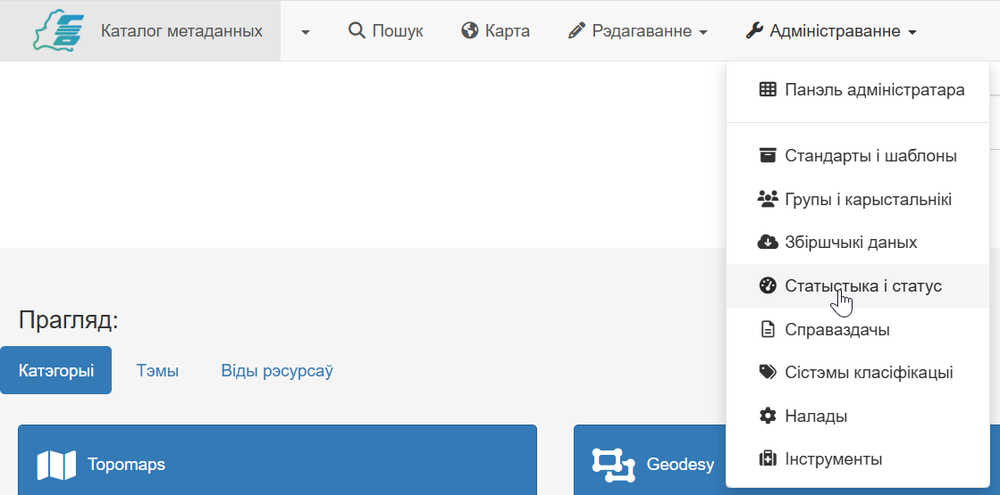
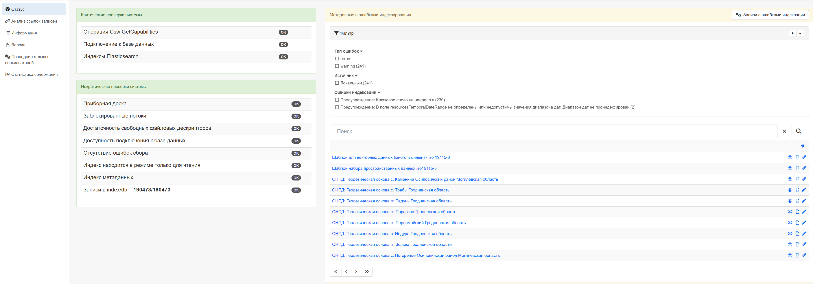
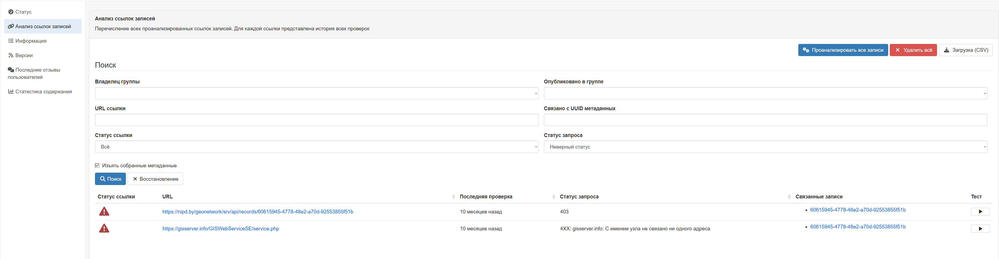

# Статыстыка па рэсурсах у каталогу

Панэль адміністратара прадастаўляе шырокі набор інструментаў для аналізу стану каталога і паводзін карыстальнікаў. Гэта дадзеныя дапамагаюць адміністратарам груп разумець, якія дадзеныя найбольш запатрабаваныя, якія пошукавыя запыты не даюць вынікаў, і які агульны стан метададзеных, якія змяшчаюцца ў запісах у іх групе.

Доступ да статыстыкі прадастаўляецца праз `Панэль адміністратара`, ва ўкладцы `Статыстыка і статус`.

Пасля пераходу адкрыецца старонка з выбарам адпаведнага функцыяналу:

- [Статус](#статус)
- [Аналіз спасылак](#аналіз-спасылак)
- [Інфармацыя](#інфармацыя)
- [Версіі](#версіі)
- [Апошнія водгукі карыстальнікаў](#апошнія-водгукі-карыстальнікаў)
- [Статыстыка зместу](#статыстыка-зместу)

## Статус

Тут прыведзена тэхнічная інфармацыя, важная для дыягностыкі прадукцыйнасці.

## Аналіз спасылак

Гэта крытычна важны інструмент для кантролю якасці сувязяў паміж рэсурсамі. Ён правярае валіднасць URL-адрасоў унутры метададзеных у запісах групы.

Адміністратар можа атрымаць справаздачу аб рэсурсах (анлайн-рэсурсы, спасылкі на запампоўку), якія вяртаюць памылкі (404 Not Found, 500 Server Error), а таксама сфармаваць статыстыку па выкарыстоўваных пратаколах (WWW:DOWNLOAD, OGC: WMS і г.д.).

Аналіз гэтых дадзеных дапамагае выправіць непрацоўныя спасылкі для карэктнасці прадастаўлення рэсурсаў у групе.

## Інфармацыя

У гэтай укладцы адміністратар можа пазнаць інфармацыю аб канфігурацыі праграмнага прадукта ў цэлым:

- размяшчэнне ключавых дырэкторый у файлавым сховішчы аперацыйнай сістэмы,
- звесткі аб прымяняецца базе даных,
- звесткі аб пошукавай сістэме,
- звесткі аб версіі і зборцы праграмнага прадукта,
- інфармацыя аб аперацыйнай сістэме.

Аналіз гэтых дадзеных дазваляе адміністратару ўнесці карэкціроўкі ў выпадку няправільнага адлюстравання звестак з запісаў метададзеных, некарэктна працуючых функцый праграмнага забеспячэння, у тым ліку індэксацыі.

## Версіі

У дадзенай укладцы адміністратару даступныя звесткі сістэмы кіравання версіямі запісаў метададзеных. Карыстальнік можа адсартаваць запісы, паказаўшы шуканага аўтара ці ўладальніка запісу, даты да і пасля канкрэтнай даты, а таксама прама пазначыць UUID-ідэнтыфікатар запісу.

## Апошнія водгукі карыстальнікаў

Дадзеная прылада збірае ў адным месцы ўсе каментары і водгукі, якія іншыя карыстачы пакінулі да запісаў метададзеных, апублікаваным у групе адміністратара.

!!! note "Увага" 
  Водгукі падлягаюць своечасовай мадэрацыі, адказнасць за якую нясуць адміністратары груп Каталога метададзеных.

## Статыстыка зместу 

У гэтым раздзеле можна атрымаць колькасны агляд напаўнення кантэнту групы.

- Агульная колькасць запісаў метададзеных.

- Размеркаванне запісаў па статусе (чарнавік, зацверджана, архіў), па стандартах і па карыстальнікам.

- Выбарка найбольш папулярных запісаў у каталогу групы.

