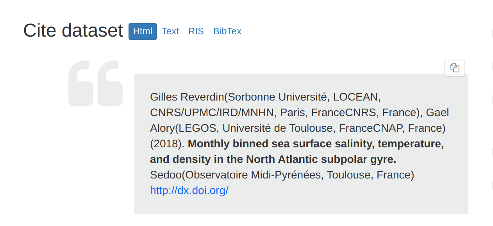
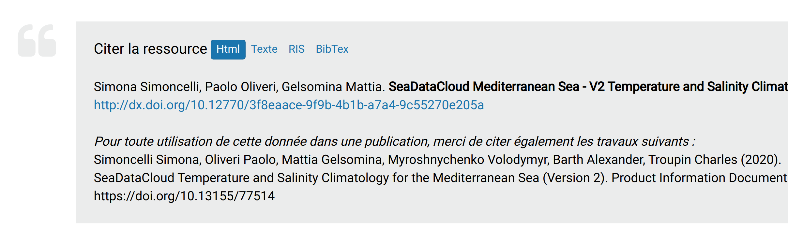
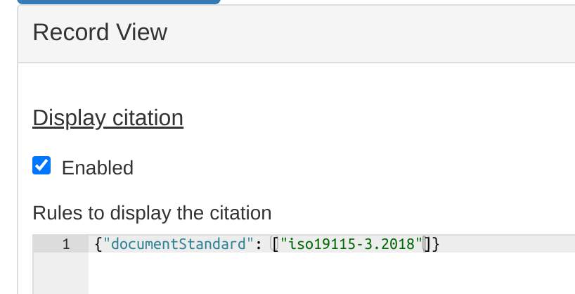

# Апісанне спасылкі на іншы рэсурс {#cite}

Каталог можа ствараць апісанне спасылкі на іншы рэсурс на аснове інфармацыі, прадстаўленай у запісе метададзеных.

Апісанне спасылкі можна выкарыстоўваць для апісання дадзеных у публікацыях.

## Тэкст апісання спасылкі

Па змаўчанні Апісанне спасылкі генеруецца ў адпаведнасці з агульнымі правіламі апісання набораў дадзеных, але яно можа быць наладжана:

- спіс аўтараў (і арганізацыі)
- год публікацыі
- назва 
- спіс выдавецтва 
- URL DOI або URL мэтавай старонкі.

Гэта дадзеныя, неабходныя для стварэння DOI (Digital Object Identifier - Ідэнтыфікатар лічбавага аб'екта) (гл. [Ідэнтыфікатар лічбавага аб'екта (DOI)](doi.md)).

Наладзіць апісанне спасылкі можна ў `schemas/iso19115-3.2018/src/main/plugin/iso19115-3.2018/formatter/citation/common.xsl`.

Дадатковае апісанне можа захоўвацца ў апісанні анлайн-рэсурсу з пратаколам `WWW:LINK-1.0-http--publication-URL`.

Прыклад: <https://doi.org/10.12770/ad07a55f-5de7-4abc-ba89-8899b16c4b59>

## Канфігурацыя

Апісанне спасылкі можа адлюстроўвацца ці не адлюстроўвацца ў прадстаўленні запісу. Гэта можа быць наладжана ў канфігурацыі карыстальніцкага інтэрфейсу:

## Фармат

Апісанне спасылкі могуць быць прадстаўлены ў розных фарматах:

- HTML
- просты тэкст
- RIS
- BibTex

## API

Апісанне спасылкі можна адлюстраваць у стандартным XSL-фарматары, 
які выкарыстоўваецца для поўнага прадстаўлення, выкарыстоўваючы: <http://localhost:8080/geonetwork/srv/api/records/a46af25c-f949-48a2-9b7e-ac472230cda8?language=all&citation=true>

Доступ да фарматара, які стварае цытату, можна атрымаць напрамую, выкарыстоўваючы: <http://localhost:8080/geonetwork/srv/api/records/31255efc-c5c1-7787-2ae6-b8fc4bcd6e55/formatters/citation?format=ris>

Для атрымання спіса даступных фарматаў выкарыстоўвайце: <http://localhost:8080/geonetwork/srv/api/records/31255efc-c5c1-7787-2ae6-b8fc4bcd6e55/formatters/citation?format=>?