# Ідэнтыфікатар лічбавага аб'екта (DOI) {#doi}

## Наладка

Ідэнтыфікатар лічбавага аб'екта (DOI) - гэта літарава-лічбавы радок, які прысвойваецца для ўнікальнай ідэнтыфікацыі аб'екта.
Каталог падтрымлівае стварэнне DOI (Digital Object Identifier) з дапамогай:

- [DataCite API](https://support.datacite.org/docs/mds-api-guide).
- API выдавецкага офіса ЕС <https://ra.publications.europa.eu/servlet/ws/doidata?api=medra.org>.

Кропку доступу да API можна наладзіць у `Панэлі адміністратара` - `Наладкі` - `Публікацыя`:

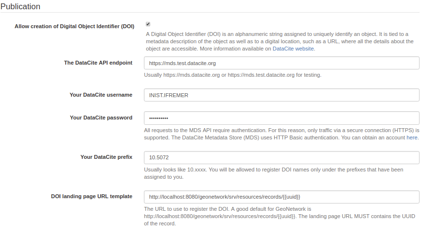

Запіс у фармаце DataCite можна загрузіць праз API, выкарыстоўваючы: <http://localhost:8080/geonetwork/srv/api/records/da165110-88fd-11da-a88f-000d939bc5d8/formatters/datacite?output=xml>

## Стварэнне DOI

Пасля наладкі, DOI можа быць створаны з дапамогай інтэрфейсу. DOI ствараецца па запыце. Гэта азначае, што карыстальнік павінен запытаць стварэнне DOI. Ён можа быць створаны:
- Карыстальнікам, які стварыў метаданыя.
- Карыстальнікам з профілем Reviewer (рэцэнзент) у групе ўладальнікаў метаданых.
- Адміністратарам

Пры стварэнні задачы (запыту на стварэнне DOI) рэцэнзент групы атрымлівае апавяшчэнне па электроннай пошце 
(па змаўчанні, можа быць наладжаны толькі для адміністратара з дапамогай узроўню апавяшчэння задачы).

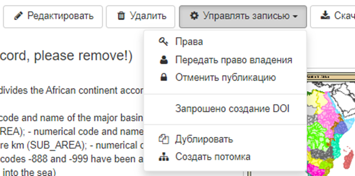

Задача прызначаецца канкрэтнаму карыстальніку. Дадаткова можна пазначыць дату выканання і каментарый:

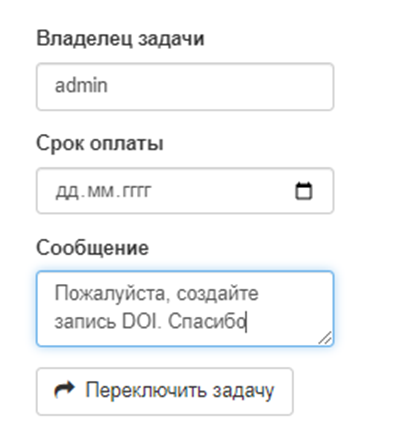

Пасля адпраўкі задання ўладальнік задачы атрымлівае апавяшчэнне па электроннай пошце (калі наладжаны паштовы сервер). 
Затым заданне можна дазволіць у кансолі адміністратара --> інфармацыя --> версіянаванне.

Калі канфігурацыя адсутнічае або няправільная, паведамляецца пра памылку:

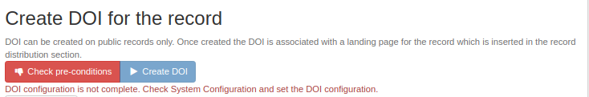

Для стварэння DOI задача складаецца з двух крокаў:

- Праверка, ці ўсе папярэднія ўмовы выкананы ([DataCite](https://datacite.org/create-dois/)).

Фармат DataCite патрабуе наяўнасці некаторых абавязковых палёў:

- Ідэнтыфікатар (з абавязковай падуласцівасцю Тып)
- Стваральнік (з неабавязковымі падуласцівасцямі "імя", "прозвішча", "ідэнтыфікатар імя" і "прыналежнасць")
- Назва (з неабавязковымі падуласцівасцямі тыпу)
- Выдавец
- Год публікацыі
- Тып рэсурсу (з абавязковай падуласцівасцю агульнага апісання тыпу)

Супастаўленне са стандартамі ISO выглядае наступным чынам:

| Property | ISO 19139 | ISO 19115-3 |
|-----------------|-----------------------------------------------------------------------------------------------------------------------|-----------------------------------------------------------------------------------------------------------------------|
| Ідэнтыфікатар | ``gmd:MD_Metadata/gmd:fileIdentifier/*/text()`` | ``mdb:MD_Metadata/mdb:metadataIdentifier/*/mcc:code/*/text()`` |
| Стваральнік | ``gmd:identificationInfo/*/gmd:pointOfContact`` з роляй 'pointOfContact' або 'custodian' | ``mdb:identificationInfo/*/mri:pointOfContact`` з роляй 'pointOfContact' або 'custodian' |
| Назва | ``gmd:identificationInfo/*/gmd:citation/*/gmd:title`` | ``mdb:identificationInfo/*/mri:citation/*/cit:title`` |
| Выдавец | ``gmd:distributorContact[1]/*/gmd:organisationName/gco:CharacterString`` | ``mrd:distributorContact[1]/*/cit:party/*/cit:organisationName/gco:CharacterString`` |
| PublicationYear | ``gmd:identificationInfo/*/gmd:citation/*/gmd:date/*[gmd:dateType/*/@codeListValue = 'publication'`` | ``mdb:identificationInfo/*/mri:citation/*/cit:date/*[cit:dateType/*/@codeListValue = 'publication'`` |
| ResourceType | ``gmd:hierarchyLevel/*/@codeListValue`` | mdb:metadataScope/*/mdb:resourceScope/*/@codeListValue`` |

Супастаўленне можа быць наладжана ў:

- ISO19139 `schemas/iso19139/src/main/plugin/iso19139/formatter/datacite/view.xsl`.
- ISO19115-3.2018 `schemas/iso19139/src/main/plugin/iso19139/formatter/datacite/view.xsl`.

Больш падрабязную інфармацыю пра фармат гл. па адрасе <http://schema.datacite.org/meta/kernel-4.1/doc/DataCite-MetadataKernel_v4.1.pdf>.

DataCite API вяртае памылку праверкі XSD.

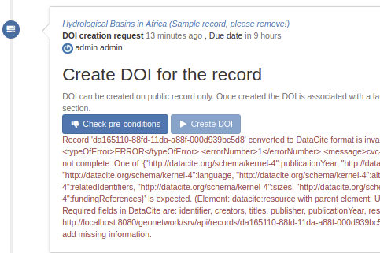

Каталог таксама дазваляе прымяняць валідацыю DataCite ў рэдактары:

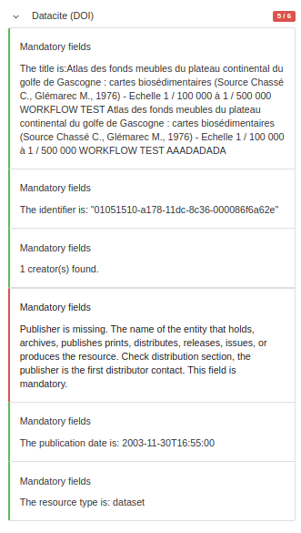

DOI можа быць ужо прысвоены запісу:

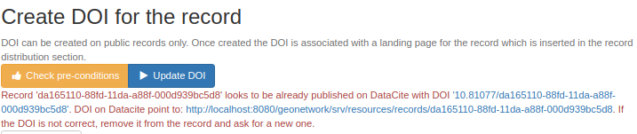

У гэтым выпадку DOI можа быць абноўлены. Калі DOI ўжо прысвоены запісу метаданых, рэдактары таксама могуць абнавіць DOI з рэдактара:

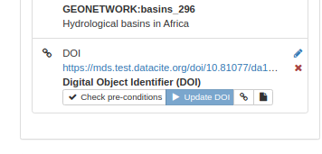

Пасля праверкі стварыце DOI

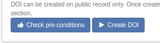

Пасля стварэння будзе даступная спасылка на DOI і на дакумент DataCite:

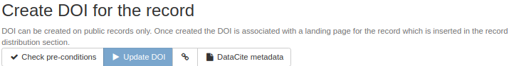

Затым DOI дадаецца ў запіс метаданых:

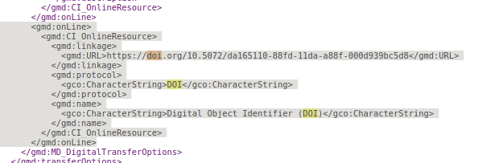