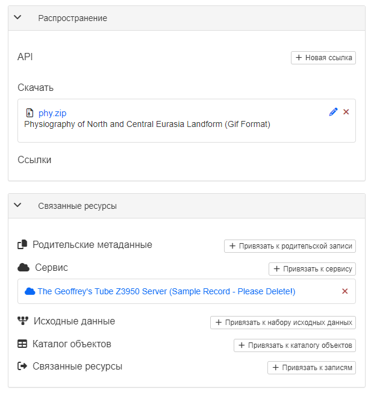
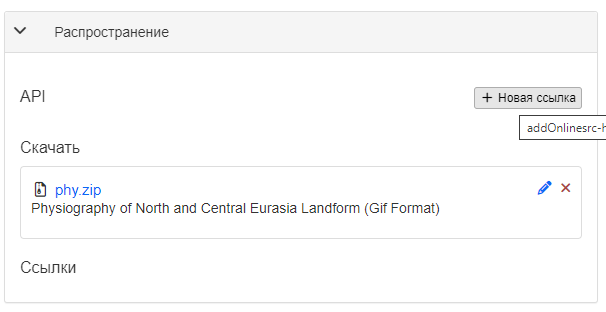

# Звязванне са знешнімі рэсурсамі {#associating_resources}

Запісы метаданых можна звязваць са знешнімі рэсурсамі з дапамогай панэляў `Распаўсюджванне` і `Звязаныя рэсурсы` ў рэжыме рэдагавання. 

З дапамогай гэтых панэляў можна ствараць, рэдагаваць і выдаляць звязаныя рэсурсы розных тыпаў. 
Тут жа знаходзіцца спіс бягучых звязаных рэсурсаў, згрупаваных па тыпах.

- Каб дадаць новы анлайн-рэсурс, у панэлі `Распаўсюджванне` трэба націснуць `Новая спасылка`.

Да запісу метаданых можна звязваць і іншыя тыпы рэсурсаў:

- [Дакументаў](linking-documents.md)
- [Іншыя запісы](linking-records.md)
- [Ідэнтыфікатар лічбавага аб'екта (DOI)](doi.md)
- [Цытаваць рэсурс](cite.md)