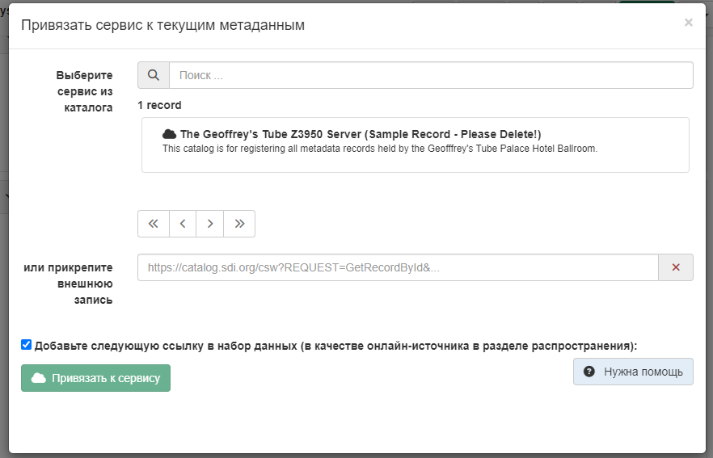

# Звязванне запісу з сэрвісам {#linking-dataset-or-service}

Метаданыя набору даных могуць быць звязаны з метаданымі сэрвісаў.

``` xml
<srv:operatesOn uuidref="b795de68-726c-4bdf-a62a-a42686aa5b6f"
                      xlink:href="http://metawal.wallonie.be/geonetwork/srv/fre/csw?service=CSW&amp;request=GetRecordById&amp;version=2.0.2&amp;outputSchema=http://www.isotc211.org/2005/gmd&amp;elementSetName=full&amp;id=b795de68-726c-4bdf-a62a-a42686aa5b6f"/>
```

Выберыце `Звязаныя рэсурсы` - `Прывязаць да сэрвісу`, каб адкрыць спіс даступных сэрвісаў у каталогу.

