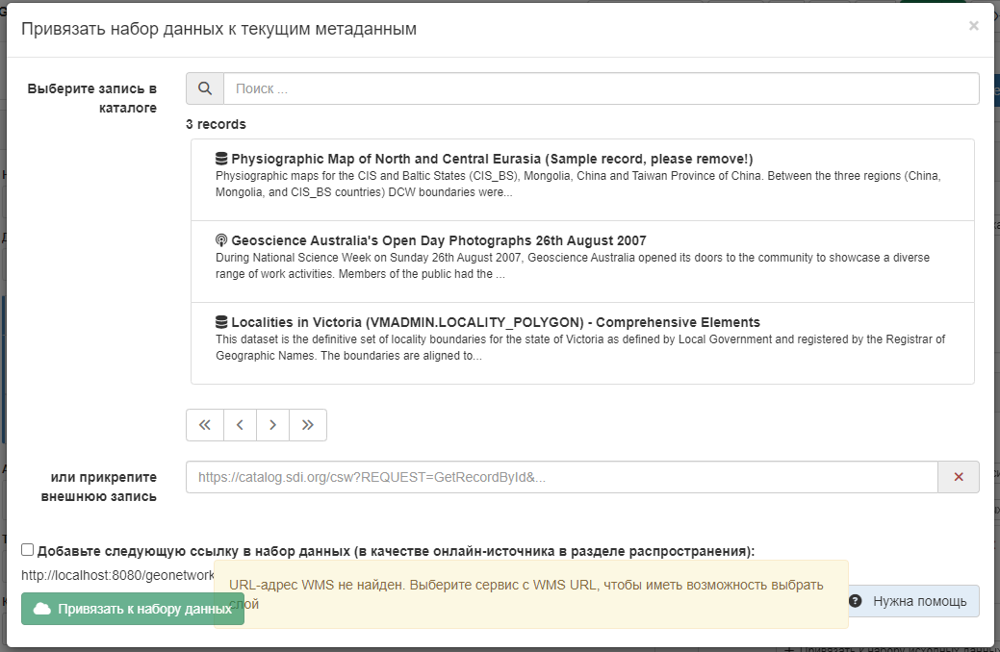

# Каталог аб'ектаў {#linking-feature-catalog}

Каталог аб'ектаў апісвае мадэль даных набору даных са спісам табліц, атрыбутаў, вызначэнняў, спісам значэнняў і г. д. Каталогі аб'ектаў могуць быць апісаны:

- як дакумент (напрыклад, PDF) і звязаны з запісам метаданых (гл. [Звязванне дакументаў](linking-online-resources.md#linking-online-resources-doc))
- у выглядзе запісу і апісаны з выкарыстаннем стандартаў ISO19110.

Націсніце на `Прывязаць да каталога аб'ектаў`, каб адкрыць спіс запісаў, у якім пералічаны ўсе каталогі аб'ектаў. 
Каб звязаць 2 дакументы, трэба націснуць `Прывязаць да каталога аб'екту`.

