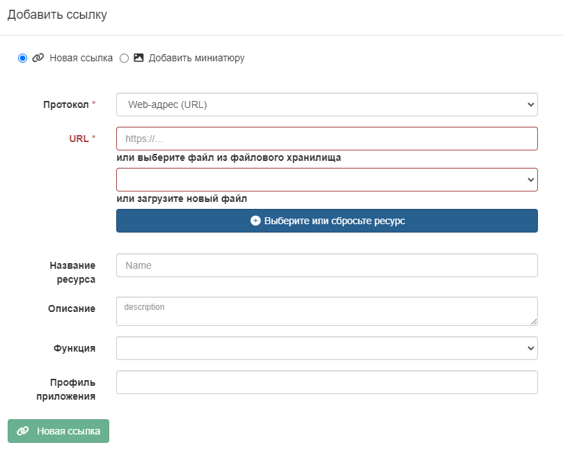
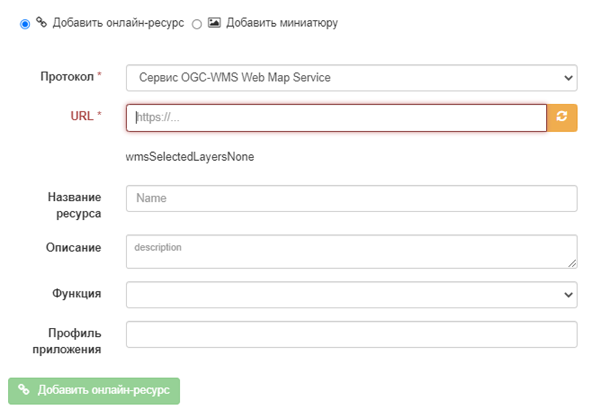
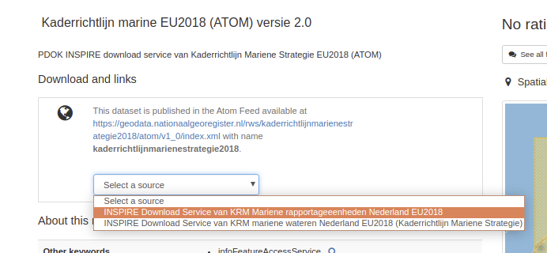
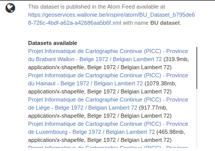

# Звязванне вэб-сайтаў, вэб-сэрвісаў, \... з дапамогай URL {#linking-online-resources}

Гэты раздзел адносіцца ў асноўным да запісаў ISO19139 і часткова да стандартаў Dublin Core (толькі дакументы могуць быць звязаны ў стандарце Dublin Core).

## Звязванне дакумента {#linking-online-resources-doc}

Для звязвання дакументаў можна выкарыстоўваць 2 падыходы:

- шляхам прадастаўлення URL-адраса
- шляхам загрузкі дакумента.

Каб стварыць новую спасылку, націсніце на кнопку `Распаўсюджванне` - `Новая спасылка`.



Каб звязаць з анлайн-рэсурсам, усталюйце наступныя ўласцівасці:

- `Пратакол` для апісання тыпу прымацаванага дакумента і спосабу перадачы даных (па змаўчанні `Вэб-адрас (URL)`)
- `URL` шлях да мэтавага дакумента. Гэта можа быць любы тып спасылак, напрыклад <http://>, <ftp://>, <file:///>, \...
- `Назва рэсурсу` з'яўляецца неабавязковым і прадастаўляе метку для стварэння гіперспасылкі
- `Апісанне` з'яўляецца неабавязковым і прадастаўляе больш падрабязную інфармацыю пра спасылку.

Каб загрузіць файл з камп'ютара, націсніце на кнопку `Выберыце ці скіньце рэсурс` і выберыце дакумент, 
альбо перацягніце яго ва ўсплывальнае акно. У гэтым выпадку пратакол схаваны і мае значэнне `WWW:DOWNLOAD`.

У залежнасці ад патрэб, можна дадаць больш спецыфічныя спасылкі, якія будуць звязаныя з рознымі дзеяннямі і адлюстроўвацца ў дадатках.

## Звязванне слоя WMS {#linking-wms-layer}

Для прагляду запісу ў праграме прагляду карт можа спатрэбіцца дадаць спасылку на адзін або некалькі WMS-сэрвісаў, якія публікуюць набор даных. Анлайн-рэсурс кадыруецца наступным чынам у стандарце ISO19139:

``` xml
<gmd:onLine xmlns:gmd="http://www.isotc211.org/2005/gmd"
            xmlns:gco="http://www.isotc211.org/2005/gco">
   <gmd:CI_OnlineResource>
      <gmd:linkage>
         <gmd:URL>https://download.data.grandlyon.com/wms/grandlyon</gmd:URL>
      </gmd:linkage>
      <gmd:protocol>
         <gco:CharacterString>OGC:WMS</gco:CharacterString>
      </gmd:protocol>
      <gmd:name>
         <gco:CharacterString>cad_cadastre.cadsubdivisionsection</gco:CharacterString>
      </gmd:name>
      <gmd:description>
         <gco:CharacterString>Subdivision de section cadastrale (Plan cadastral informatisé du Grand Lyon)(OGC:WMS)</gco:CharacterString>
      </gmd:description>
   </gmd:CI_OnlineResource>
</gmd:onLine>
```

Каб дадаць слой WMS:

- выберыце пратакол `Сэрвіс OGC-WMS Web Map Service`,
- задайце URL-адрас сэрвісу,
- затым майстар запытае сэрвіс для атрымання спіса слаёў
- выберыце адзін або некалькі слаёў са спіса або задайце іх уручную.



## Звязванне табліцы базы даных або файла ГІС у сетцы {#linking-online-resources-georesource}

Каб спаслацца на ГІС-файл або табліцу базы даных, карыстальнік можа загрузіць або спаслацца на гэты рэсурс (гл. [Звязванне дакументаў](linking-online-resources.md#linking-online-resources-doc)). Тып пратакола залежыць ад тыпу звязанага рэсурсу:

| Тып рэсурсу | Загружаемы вектарны файл (напрыклад, заархіваваны Shapefile) |
|------------------|-------------------------------------------------------------------------------------------------------------------------------------------------|
URL | URL | URL файла, створаны пасля загрузкі ў каталог. напрыклад <http://localhost:8080/geonetwork/srv/eng/resources.get?id=1631&fname=CCM.zip&access=private> |
| Пратакол | WWW:DOWNLOAD |
| Імя | Імя файла (толькі для чытання) |

| Тып рэсурсу | Вектарны файл у сетцы |
|------------------|--------------------------------------------------------------------|
| URL | Шлях да файла. напрыклад, <file:///shared/geodata/world/hydrology/rivers.shp> |
| Пратакол | <FILE:GEO> або <FILE:RASTER> |
| Імя | Апісанне файла |

| Тып рэсурсу | Вектар (табліца PostGIS)|
|------------------|------------------------------------------------------|
| URL | jdbc:postgresql://localhost:5432/login:<password@db> |
| Пратакол | DB:POSTGIS |
| Імя | Імя табліцы |

Пры наяўнасці інфармацыі пра базу даных або файл у лакальнай сетцы можа быць дарэчы схаваць гэту інфармацыю для публічных карыстальнікаў (гл. [Абмежаванне інфармацыі да раздзелаў метаданых](../publishing/restricting-information-to-metadata-sections.md)).

## Звязванне даных з дапамогай ATOM-каналаў {#linking-data-using-atom-feed}

Калі арганізацыя прадастаўляе каналы ATOM для палягчэння доступу да даных, запісы метаданых могуць спасылацца на гэтыя каналы. Карыстальнікі могуць спасылацца на сэрвісны фід службы і на фід набору даных у запісе набору даных.

``` xml
<gmd:MD_DigitalTransferOptions>
 <gmd:onLine>
  <gmd:CI_OnlineResource>
   <gmd:linkage>
    <gmd:URL>http://www.broinspireservices.nl/atom/awp.atom</gmd:URL>
   </gmd:linkage>
   <gmd:protocol>
    <gco:CharacterString>INSPIRE Atom</gco:CharacterString>
   </gmd:protocol>
   <gmd:name>
    <gco:CharacterString>gdn.Aardwarmtepotentie</gco:CharacterString>
   </gmd:name>
  </gmd:CI_OnlineResource>
 </gmd:onLine>
</gmd:MD_DigitalTransferOptions>
```

Пасля рэгістрацыі ў метаданых стужка ATOM будзе адлюстроўвацца ў прадстаўленні запісу:



Карыстальнікі могуць выбраць сэрвіс, спіс даступных набораў даных будзе выняты, а спасылкі на спампоўку адлюстраваны карыстальніку. Фід набору даных можа ўтрымліваць адну або некалькі загрузак:



Прыклады:

- [NGR National Georegister](https://www.nationaalgeoregister.nl/geonetwork/srv/dut/catalog.search#/search?any=atom&fast=index), [Statistics Netherlands Land Use 2015 ATOM](https://www.nationaalgeoregister.nl/geonetwork/srv/dut/catalog.search#/metadata/a657f732-e1b3-4638-9933-67cab10d9081).

Каталог таксама прадастаўляе магчымасць ствараць ATOM-каналы для сэрвісаў і набораў даных на аснове запісаў метаданых. Набор даных GML можа быць прадстаўлены ў наступнай кадзіроўцы, каб быць апублікаваным у стужцы даных ATOM:

``` xml
<gmd:transferOptions>
   <gmd:MD_DigitalTransferOptions>
      <gmd:unitsOfDistribution>
         <gco:CharacterString>B</gco:CharacterString>
      </gmd:unitsOfDistribution>
      <gmd:transferSize>
         <gco:Real>428973180</gco:Real>
      </gmd:transferSize>
      <gmd:onLine>
         <gmd:CI_OnlineResource>
            <gmd:linkage>
               <gmd:URL>https://download.data.public.lu/resources/inspire-annex-i-theme-addresses-addresses/20191118-115245/ad.address.gml</gmd:URL>
            </gmd:linkage>
            <gmd:protocol>
               <gco:CharacterString>WWW:DOWNLOAD-1.0-http--download</gco:CharacterString>
            </gmd:protocol>
            <gmd:applicationProfile>
               <gco:CharacterString>INSPIRE-Download-Atom</gco:CharacterString>
            </gmd:applicationProfile>
            <gmd:name>
               <gmx:MimeFileType type="application/octet-stream">AD.Address.gml</gmx:MimeFileType>
            </gmd:name>
            <gmd:description>
               <gco:CharacterString></gco:CharacterString>
            </gmd:description>
            <gmd:function>
               <gmd:CI_OnLineFunctionCode codeList="http://standards.iso.org/ittf/PubliclyAvailableStandards/ISO_19139_Schemas/resources/codelist/ML_gmxCodelists.xml#CI_OnLineFunctionCode"
                                          codeListValue="download">download</gmd:CI_OnLineFunctionCode>
            </gmd:function>
         </gmd:CI_OnlineResource>
      </gmd:onLine>
   </gmd:MD_DigitalTransferOptions>
</gmd:transferOptions>
```

Прыклады:

- Партал INSPIRE Вялікага Герцагства Люксембург / [INSPIRE - Дадатак I Тэматычныя адрасы - Адрасы](https://catalog.inspire.geoportail.lu/geonetwork/srv/fre/catalog.search#/metadata/F22B07FC-E961-4985-BB75-6A1548319C8A)

Даведачныя дакументы:

- [Тэхнічнае кіраўніцтва INSPIRE для службаў загрузкі](https://inspire.ec.europa.eu/documents/technical-guidance-implementation-inspire-download-services).