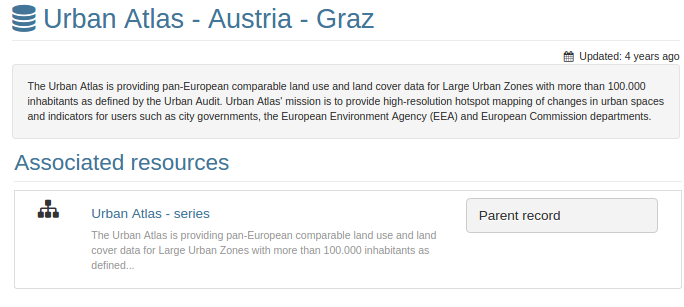
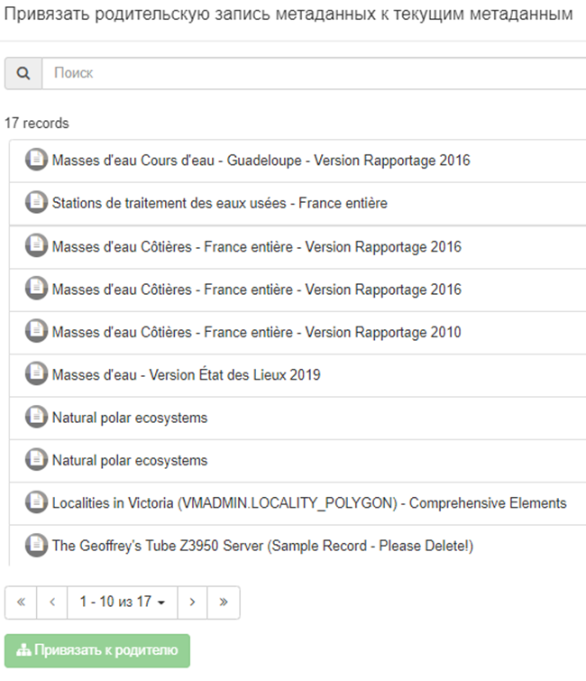

# Групоўка запісаў метаданых (сувязь бацька/дзіця) {#linking-parent}

У некаторых сітуацыях апісваемыя даныя могуць мець адну і тую ж спецыфікацыю (напрыклад, глебава-расліннае покрыва за розныя гады) 
і ў сукупнасці ўтвараць калекцыю. Каб згрупаваць такі набор запісаў, агульнае апісанне калекцыі можа быць зроблена ў бацькоўскіх метаданых. 
Апісанне бацькоўскіх метаданых затым можа быць прымацавана да ўсіх даччыных запісаў метаданых. 
Для гэтага трэба выбраць `Звязаныя рэсурсы` - `Прывязаць да бацькоўскага запісу`.

- Глебава-расліннае покрыва
    - Глебава-расліннае покрыва 2002
    - Глебава-расліннае покрыва 2012
    - \...

Адносіны "бацька/дзіця" могуць быць устаноўлены ў запісах ISO19139 і Dublin Core. 
У ISO19139 спасылка на бацькоўскі запіс кадыруецца ў даччыным запісе наступным чынам:

``` xml
<gmd:parentIdentifier>
   <gco:CharacterString>78f93047-74f8-4419-ac3d-fc62e4b0477b</gco:CharacterString>
</gmd:parentIdentifier>
```

Адносіны "бацька/дзіця" ў ISO19139 таксама могуць быць закадзіраваны з дапамогай агрэгацый (глядзець [Іншыя тыпы рэсурсаў](linking-others.md)).

Пры стварэнні такой сувязі карыстальнікі змогуць перамяшчацца па іерархіі запісаў.



Націсніце на `Звязаць з бацькам`, каб атрымаць доступ да панэлі, якая прадастаўляе просты пошук для выбару мэтавых бацькоўскіх метаданых

