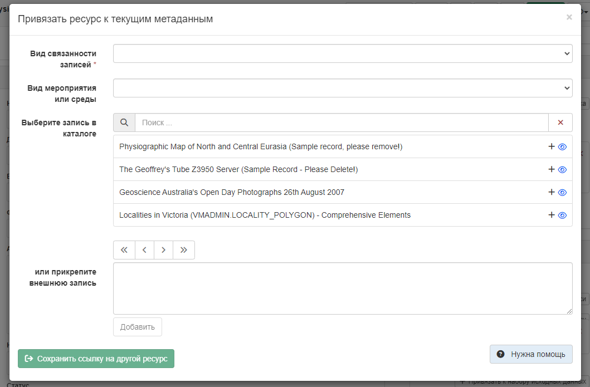
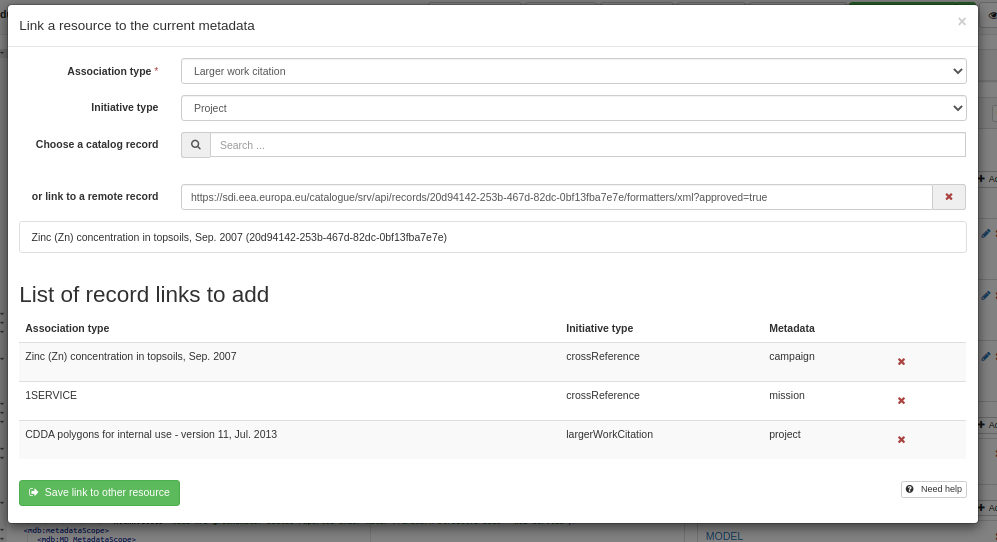
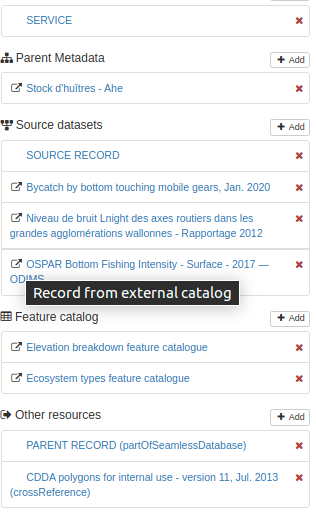
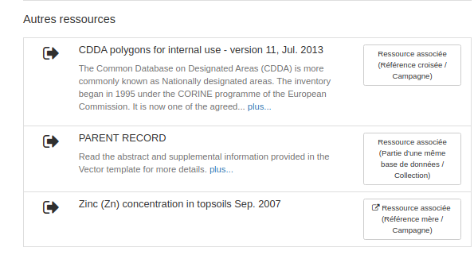

# Звязванне з аддаленым запісам {#linking-remote-record}

## Даданне спасылкі

У карыстальніка ёсць магчымасць паказаць старонку, якая апісвае аддалены запіс. 
Для гэтага трэба выбраць `Звязаныя рэсурсы` - `Прывязаць да запісаў`.



Каб звязаць аддалены запіс, трэба паказаць яе URL-адрас. 
Калі аддалены запіс знаходзіцца ў каталогу GeoNetwork, таксама рэкамендуецца выкарыстоўваць яго фактычны URL (напрыклад <https://catalog/geonetwork/srv/api/records/%7Buuid%7D>), 
які вяртае XML, калі для загалоўка Accept усталявана значэнне application/xml. Для GeoNode можа працаваць HTML-старонка, але UUID не будзе ідэнтыфікаваны. 
Загаловак будзе HTML-загалоўкам старонкі. Для астатніх можа выкарыстоўвацца XML-дакумент (напрыклад, выклік API або запыт CSW GetRecordById).

Для запісу-сястры (даччынага запісу ад аднолькавага бацькоўскага запісу), якая дазваляе дадаваць некалькі спасылак за адзін выклік, 
панэль мадыфікавана для адлюстравання спасылак у выглядзе табліцы.



\... замест простага спіса

Пасля дадання аддаленыя запісы ідэнтыфікуюцца з дапамогай спецыяльнага значка:



Той жа значок выкарыстоўваецца ў рэжыме прагляду:



## Кадзіроўка XML

Старая рэалізацыя кадыруе спасылку на іншы запіс як

- uuidref

```xml
<gmd:source uuidref="704c6337-aaad-47a9-b300-08f28c0e48e9"/>
```

- або gco:CharacterString

``` xml
<gmd:parentIdentifier><gco:CharacterString>704c6337-aaad-47a9-b300-08f28c0e48e9<...
```

- або з дапамогай атрыбутаў uuidref, xlink:href, як для спасылак на сэрвіс/набор даных.

Пры спасылцы на аддалены запіс рэдактар спрабуе сабраць інфармацыю аб аддаленым запісе:

- назву
- UUID

У цяперашні час падтрымліваюцца:

- ISO19139
- ISO19119
- ISO19110
- ISO19115-3
- Фармат GeoNode HTML

У нейкі момант можа апынуцца актуальнай падтрымка тэгаў [schema.org](https://schema.org/) у HTML-старонцы або JSON+LD. Пасля вымання ўласцівасцей аддаленага запісу спасылка будзе дададзена звычайным спосабам (тыя ж працэсы, але з 2 дадатковымі неабавязковымі параметрамі) наступным чынам:

``` xml
<gmd:source uuidref="fff43204-793a-4a44-96f7-918672a2047d"
            xlink:href="https://sdi.eea.europa.eu/catalogue/srv/api/records/fff43204-793a-4a44-96f7-918672a2047d"
            xlink:title="Прылоў доннымі кранальнымі мабільнымі прыладамі лову, студзень 2020 г." />
```

## Падтрымліваемыя стандарты

Зыходны дакумент

- ISO19139
- Рэалізацыя ISO19115-3 выканана ў metadata101/iso19115-3.2018#81

Мэтавы дакумент

- унутраны запіс: Любыя стандарты, якія падтрымліваюцца GeoNetwork
- аддалены запіс: Стандарты ISO або HTML-старонка (напрыклад, GeoNode)