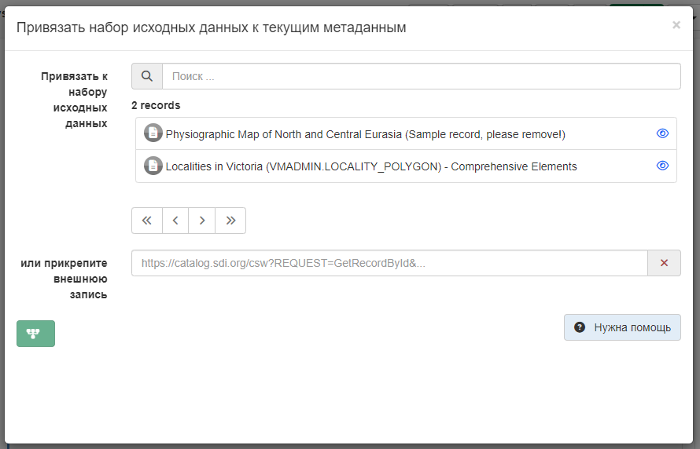

# Спасылкі на крыніцы набору дадзеных{#linking-source}

Калі набор дадзеных ствараецца на аснове іншага набору або калі карта складаецца з набораў дадзеных, 
рэдактары могуць паказаць гэтую сувязь у раздзеле запісу (выкарыстоўваючы стандарт ISO19139 або ISO19115-3), дадаўшы крыніцы.
Для гэтага трэба выбраць `Звязаныя рэсурсы` - `Прывязаць да набору зыходных дадзеных`.

