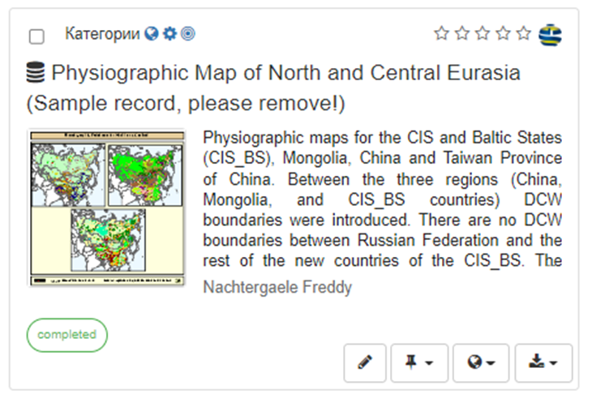
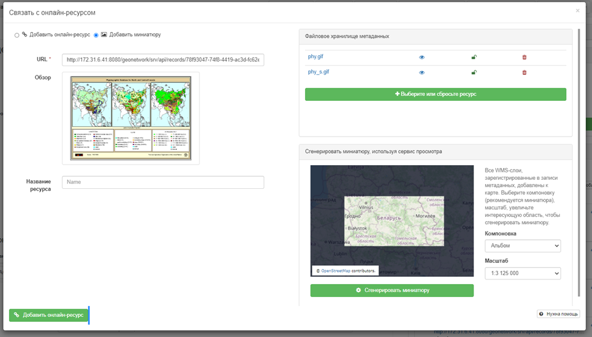
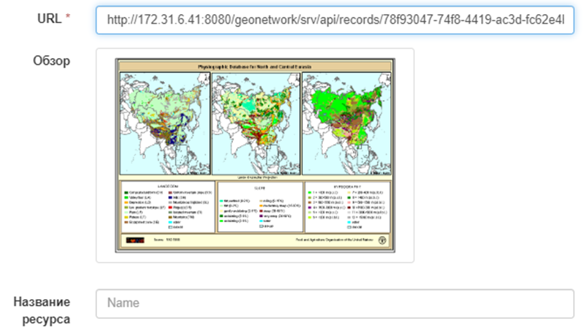
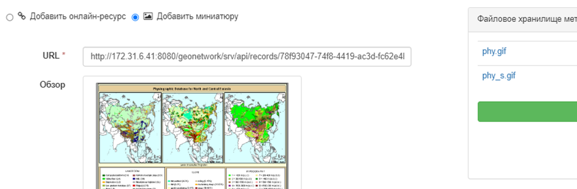
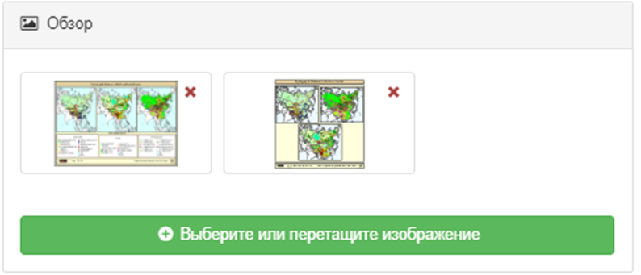
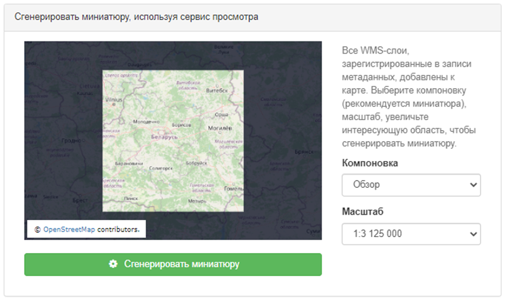

# Ілюстрацыя звязаных рэсурсаў {#linking-thumbnail}

Каб дапамагчы карыстальніку вызначыць запіс, які цікавіць, сярод усіх звязаных рэсурсаў, можна стварыць ілюстрацыю (мініяцюру, аватар-выяву) звязанага рэсурсу. 
Напрыклад, калі запіс метададзеных апісвае некаторы набор геаграфічных дадзеных, аватар-выява можа ўяўляць сабой выяву карты.

Да звязанага рэсурсу можна прывязаць некалькі ілюстрацый.

Ілюстрацыі адлюстроўваюцца ў выніках пошуку і ў прадстаўленні метададзеных:

Каб стварыць дадаць ілюстрацыю (мініяцюру), трэба выбраць `Новая спасылка` - `Дадаць мініяцюру`. Ілюстрацыю можна дадаваць з трох крыніц:

- з URL-адраса ў Інтэрнэце
- З файла, прымацаванага да метададзеных
- З файла, створанага з выкарыстаннем слаёў WMS

## Спасылка на агляд з дапамогай URL-адраса

Калі рэсурс даступны ў выглядзе выявы ў Інтэрнэце, яго можна напрамую звязаць з запісам метададзеных. 
Да звязанага рэсурсу таксама можна дадаць неабавязковае апісанне:

Калі рэсурс з інтэрнэту не падцягвае з сабой выяву, з дапамогай кнопкі `Дадаць мініяцюру` трэба прымацаваць выяву (png, gif, jpeg):

Можна звязаць столькі выяў, колькі неабходна.

## Стварэнне мініяцюры з выкарыстаннем слаёў WMS {#linking-thumbnail-from-wms}

Калі слой WMS зарэгістраваны ў бягучым запісе метададзеных (гл. [Звязванне WMS слоя](linking-online-resources.md#linking-wms-layer)), можна стварыць мініяцюру, выкарыстоўваючы яе па-над картай базавага слоя. 
Выберыце ўкладку `Дадаць мініяцюру` і выберыце вобласць, якая будзе надрукавана на мініяцюры. Створаная выява дадаецца ў сховішча файлаў.

