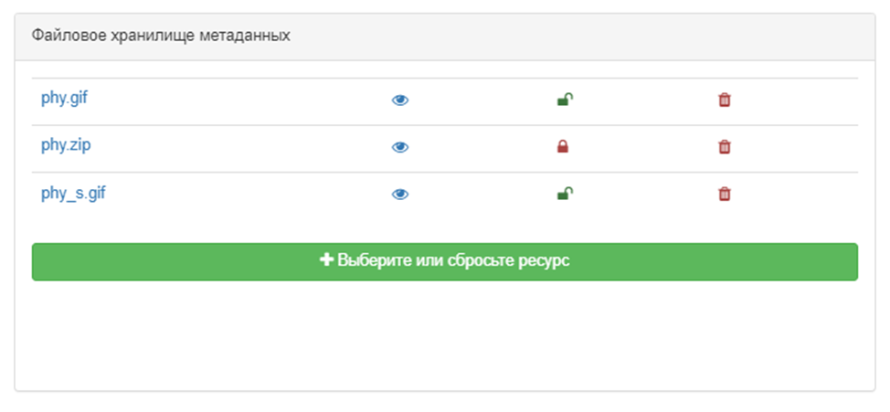

# Загрузка дакументаў з камп'ютара {#associating_resources_filestore}

Карыстальнік можа прымацаваць укладанне (дакумент, фатаграфію і інш.) да запісу метададзеных. 
Укладанні захоўваюцца ў сховішчы файлаў праграмы, якое можа змяшчаць любыя тыпы файлаў.

Каб прымацаваць файл, націсніце `Звязаныя рэсурсы` - `Новая спасылка` і абярыце файл або перацягніце файл. 
Файлы захоўваюцца ў воблачнай папцы ў Каталогу метададзеных. На метададзеныя прыпадае адна папка, якая змяшчае:

- папку `public` з файламі, даступнымі ўсім карыстальнікам
- папку `private` з файламі, даступнымі толькі ідэнтыфікаванаму карыстальніку з прывілеем запампоўвання (гл. [Кіраванне прывілеямі](../publishing/managing-privileges.md)).

Са сховішча файлаў можна:

- націснуць на імя файла, каб пазначыць URL-адрас бягучага дакумента для прымацавання
- націснуць на значок вока, каб прагледзець дакумент
- націснуць на шафку, каб змяніць бачнасць дакумента
- націснуць на крыжык, каб выдаліць файл.

Файл, загружаны такім чынам, будзе экспартаваны ў файл экспарту метададзеных (MEF). 
Таму яго URL-адрас не будзе аўтаматычна дададзены ў метададзеныя. 
URL дадаецца пры прымацаванні дакумента да пэўнага элемента метададзеных (напрыклад агляд, справаздача, легенда).

## Канфігурацыя сховішча файлаў

Па змаўчанні максімальны памер файла ўсталяваны на 100 Мб. 
Гэта абмежаванне задаецца ў файле `/services/src/main/resources/config-spring-geonetwork.xml` з дапамогай параметра `maxUploadSize`.