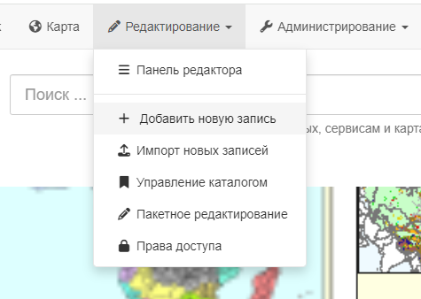
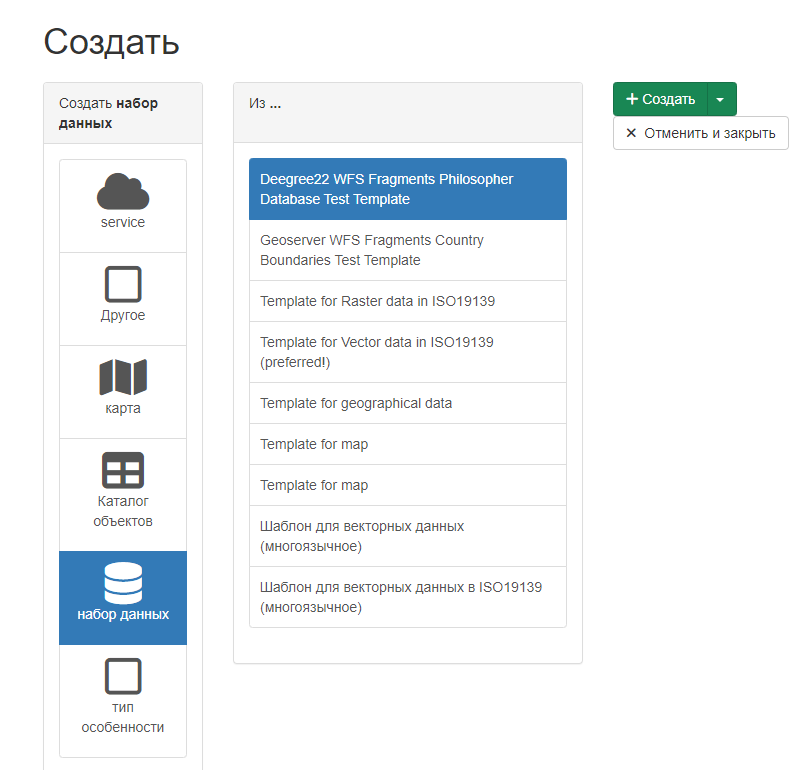

# Стварэнне запісу метададзеных {#creating-metadata}

У гэтым раздзеле апісаны працэс дадання ў каталог новых запісаў метададзеных і звязаных з імі дадзеных або сэрвісамі.

## Перш чым пачаць

Каб дадаць або адрэдагаваць метададзеныя, карыстальнік:

- Павінен мець профіль `Рэдактар` або вышэй.
- Павінен быць членам групы, для якой будзе дададзена інфармацыя.

Патрэбны профіль можа прызначыць адміністратар каталога.

1.  У галоўным меню выберыце `Рэдагаванне` - `Дадаць новы запіс`.

    

2.  Адкрыецца акно выбару шаблона. Злева трэба выбраць тып рэсурсу, які будзе апісваць метададзеныя (Карта, Каталог прасторавых аб'ектаў, Набор дадзеных, Сэрвіс, Тып аб'екта).
3.  У спісе шаблонаў метададзеных, які з'явіўся для абранага тыпу рэсурсу, выберыце прыдатны шаблон (гл. [Кіраванне шаблонамі](managing-templates.md)).
4.  Апошнім крокам трэба выбраць групу з выпадальнага спіса і націснуць `Стварыць`, каб адкрыць акно стварэння запісу метададзеных.
    

!!! Заўвага

    Калі ў каталогу вызначана толькі адна група, яна будзе выбрана па змаўчанні.

У акне, якое адкрылася, трэба:

- Запоўніць палі, прадугледжаныя па змаўчанні ў шаблоне.
- Стварыць лагатып (выяву-аватар) створанага запісу метададзеных, каб праілюстраваць іх у выніках пошуку.
- Націснуць `Захаваць` у правым верхнім куце.