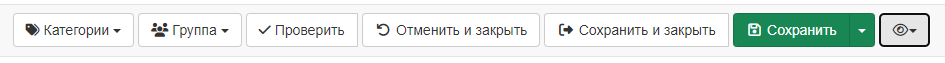
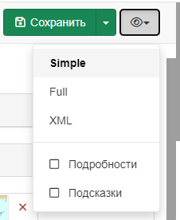
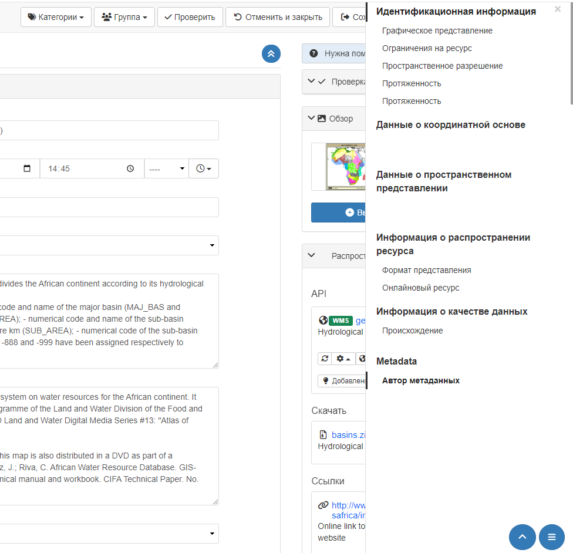
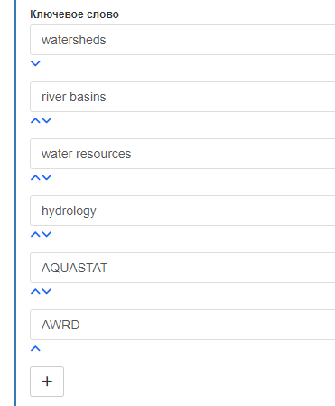

# Рэдагаванне метаданых

У гэтым раздзеле апісваецца, як выкарыстоўваць рэдактар метаданых.

## Выкарыстанне панэлі інструментаў рэдактара

Праз `Рэдагаванне` - `Панэль рэдактара` (або праз `Пошук`) знайдзіце запіс метаданых, які трэба змяніць, і адкрыйце яго. Клікніце на кнопку `Рэдагаваць`, каб адкрыць старонку рэдагавання запісу. Верхняя панэль інструментаў прадастаўляе найбольш важныя функцыі, даступныя рэдактару:

Злева направа:

- `Катэгорыі` для выбару катэгорыі ў метаданых;
- `Група` для выбару групы метаданых;
- `Праверыць` для запуску праверкі запісу метаданых на адпаведнасць стандарту;
- `Адмяніць і закрыць` для адмены ўсіх змяненняў, зробленых з пачатку сеансу рэдагавання;
- `Захаваць і закрыць` для захавання і закрыцця рэдактара;
- `Захаваць` для захавання метаданых або шаблона. Выпадальны спіс таксама дазваляе пазначыць, ці з'яўляюцца праўкі нязначнымі (г.зн. дата змянення метаданых не будзе абнаўляцца ў выпадку нязначных правак);
- `Рэжым прагляду` для:
  -  змены рэжыму прагляду рэдактара запісу (Просты, Падрабязны, XML);
  -  уключэння так званых "Падрабязнасцей" у акне рэдагавання. Пад "Падрабязнасцямі" разумеюцца назвы XML-тэгаў каля адпаведных палёў формы запісу;
  -  уключэння ўсплывальнай падказкі-анатацыі ў адпаведнага поля формы пры працы з ім.

## Навігацыя па форме
Для апісання рэсурсу карыстальнік-рэдактар можа форму абранага шаблона. Ёсць 3 рэжымы прагляду і ўзаемадзеяння з формай:

- `Па змаўчанні` адлюстроўвае ўсе абавязковыя палі для выкарыстоўванага стандарту метаданых;
- `Падрабязны выгляд` адлюстроўвае ўсе абавязковыя і **ўсе апцыянальныя** палі для выкарыстоўванага стандарту метаданых;
- `XML` адлюстроўвае запіс у выглядзе XML-дакумента.

Пераключацца паміж рэжымамі прагляду формы рэдагавання можна ў меню `Рэжым прагляду`:

Пасля выбару рэжыму прагляду карыстальнік можа прагледзець і пачаць рэдагаваць палі формы. Для хуткай навігацыі можна выкарыстоўваць кнопку `Навігацыя` ў правым ніжнім куце.

Кнопку `Навігацыя` вылучае бачныя раздзелы, дапамагае карыстальніку вярнуцца ў верхнюю частку формы і можа быць згорнуты пры неабходнасці.

## Запаўненне палёў

!!! info "Трэба дадаць"

    - Падрабязнасці пра дырэкторыі
    - Падрабязнасці пра тэзаўрус

Карыстальнікам даступная канфігурацыя прадстаўлення - маецца магчымасць змяняць парадак палёў формы з дапамогай элементаў кіравання ўверх і ўніз.

