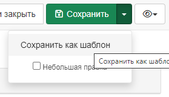

# Кіраванне шаблонамі {#creating-templates}

Для спрашчэння працэсу стварэння новых запісаў метаданых на Нацыянальным геапартале прадугледжаны шаблоны. 
Шаблон уяўляе сабой форму, якая змяшчае абавязковыя для запаўнення палі і палі, рэкамендаваныя, але неабавязковыя да запаўнення. 
Астатнія палі ў форме схаваныя, але пры неабходнасці яны таксама могуць быць выкарыстаны. 
Палі з часта паўтаральным зместам, напрыклад, кантактнай інфармацыяй, папярэдне запоўненыя значэннямі па змаўчанні.

## Стварэнне і кіраванне шаблонамі

Парадак стварэння шаблона не адрозніваецца ад парадку стварэння запісу метаданых, які падрабязна апісаны ў [адпаведным артыкуле](creating-metadata.md).

Асобна варта згадаць пра тое, што Карыстальнік можа:

- Кіраваць шаблонамі ў каталогу гэтак жа, як і запісамі метаданых, выкарыстоўваючы спецыяльны тэг `template`.

- Ствараць, абнаўляць і выдаляць шаблоны з дапамогай раздзела `Рэдагаванне`.

- Пераўтвараць запісы метаданых у шаблоны і наадварот з рэдактара метаданых з дапамогай кнопкі `Захаваць як шаблон`.

    
    *Кнопка `Захаваць як шаблон`*

Карыстальнік можа прызначыць доступ да выкарыстання сваіх шаблонаў абмежаванаму пераліку груп, каб толькі гэтыя групы маглі выкарыстоўваць шаблон у сваім працоўным працэсе (гл. раздзел [Кіраванне прывілеямі](../publishing/managing-privileges.md)).

## Загрузка шаблонаў па змаўчанні

Старонка стандартаў і шаблонаў (`Адміністраванне` - `Стандарты і шаблоны`) адлюстроўвае стандартныя шаблоны, усталяваныя ў Каталогу метаданых па змаўчанні.

*Старонка `Стандарты і шаблоны`*

Калі Адміністратар субпартала (групы) адкрыў доступ да шаблонаў па змаўчанні, то на гэтай старонцы Карыстальнікі могуць:

- загружаць шаблоны па змаўчанні,
- загрузіць узоры (прыклады) метаданых, створаныя па гэтых шаблонах

> "Заўвага"
    
    Для доступу да гэтай старонкі і функцый неабходна ўвайсці ў сістэму як адміністратар.

    

## Імпарт шаблонаў

Альтэрнатыўным спосабам загрузкі шаблонаў з'яўляецца выкарыстанне старонкі імпарту метаданых, дзе можна імпартаваць XML-файлы, выбраўшы тып запісу: `Шаблон`.

## Стварэнне ўласных шаблонаў

Кожны стандарт метаданых прадастаўляе ўзоры па змаўчанні, але Карыстальнік можа стварыць свой уласны шаблон, 
каб максімальна спрасціць задачу рэдагавання ў залежнасці ад:

- тыпу рэсурсаў, якія неабходна апісаць (напрыклад, шаблон для папяровых карт);
- структуры арганізацыі (напрыклад, вызначэнне шаблонаў для службаў);
- тыпу выкарыстання метаданых (напрыклад, публічнае выкарыстанне, унутранае выкарыстанне, якасць даных);
- тыпу карыстальнікаў.

У шаблоне варта:

- усталяваць як мага больш значэнняў па змаўчанні (напрыклад, вызначыць кантакт па змаўчанні),
- ствараць элементы, рэкамендаваныя кіраўніцтвам па кадзіраванні (каб не марнаваць час на пошук элементаў у пашыраным прадстаўленні),
- прадастаўляць інструкцыі.

Асноўная задача шаблонаў - накіраваць і паскорыць працу карыстальніка-рэдактара, не патрабуючы вялікіх ведаў пра дэталі розных стандартаў метаданых.