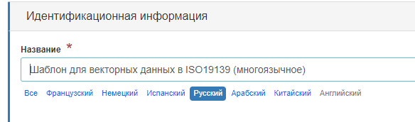

# Шматмоўнае рэдагаванне

Некалькі стандартаў падтрымліваюць шматмоўныя метаданыя (напрыклад, ISO19139, ISO19115-1). Для ISO19139 прадугледжаны шаблон па змаўчанні, але карыстальнік можа дадаць пераклад да існуючага запісу.

Каб аб'явіць новую мову ў запісе метаданых, трэба:

-  Праверыць асноўную мову, вызначаную ў раздзеле метаданых.
-  Дадаць адну або некалькі моў у `іншая мова` ў раздзеле метаданых. 
-  Пасля гэтага ў форме рэдактара з'явіцца адно поле для кожнай заяўленай мовы. Існуе 2 тыпы макетаў:

    - Адно поле для кожнай мовы, якое адлюстроўваецца адно пад адным (напрыклад, рэжым па змаўчанні для загалоўка) для прагляду ўсіх даступных перакладаў
    - Адно поле для кожнай мовы са спісам моў для пераключэння паміж імі.

## Пераключэнне рэжымаў макета

Каб пераключыцца з аднаго рэжыму ў іншы, выкарыстоўвайце спасылку `Усе`.

- Пры загрузцы акна рэдагавання выбранай мовай з'яўляецца мова карыстальніцкага інтэрфейсу, калі гэта мова вызначана ў бягучым запісе.
- Пры праглядзе запісу, калі існуе пераклад на мову карыстальніцкага інтэрфейсу, выкарыстоўваецца гэты пераклад; калі не, выкарыстоўваецца асноўная мова метаданых.

!!! Заўвага

    Гэта паводзіны таксама прымяняецца да шматмоўных запісаў ISO19139, запытваемых у dublin core са службаў CSW.