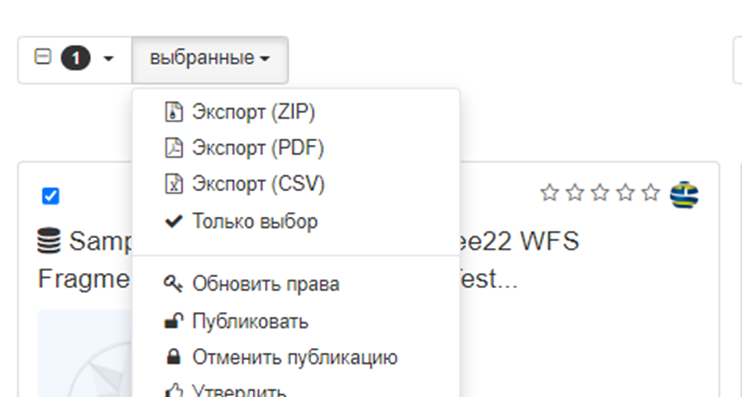

# Экспарт запісаў метададзеных {#export}

У GeoNetwork ёсць 3 асноўныя варыянты экспарту метададзеных: 
- У выглядзе ZIP-архіва 
- У выглядзе файла CSV
- У выглядзе PDF-файла

Экспартаваць метададзеныя можна з вынікаў пошуку або кансолі рэдактара з меню "дзеянні пры выбары", як паказана ў наступным прыкладзе:



## Экспарт у выглядзе ZIP-архіва

Калі выбраны набор запісаў метададзеных экспартуецца ў выглядзе ZIP-архіва, кожны запіс метададзеных устаўляецца ў ZIP-архіў у выглядзе дырэкторыі. 
У дырэкторыі ўтрымліваюцца метададзеныя, залежнасці метададзеных і іх лагатыпы (мініяцюры). 
Гэты тып ZIP-архіва ўяўляе сабой фармат MEF (Metadata Exchange Format) версіі 2.0. 
Больш падрабязную інфармацыю пра MEF V2 вы можаце знайсці ў кіраўніцтве для распрацоўшчыкаў GeoNetwork.

## Экспарт у выглядзе файла CSV

Калі выбраны набор запісаў метададзеных экспартуецца ў выглядзе файла CSV/TXT, для кожнага запісу метададзеных выконваецца наступны працэс:

- ствараецца кароткае апісанне элементаў з кожнага выбранага запісу метададзеных генеруецца шляхам прымянення шаблона са схемы метададзеных. Папкай па змаўчанні для любой схемы з'яўляецца "GEONETWORK_DATA_DIR/config/schema_plugins/`. У прыватнасці, для iso19115-3.2018 ён знаходзіцца тут: "GEONETWORK_DATA_DIR/config/schema_plugins/iso19115-3.2018/layout/tpl-csv.xsl".
- здабываюцца элементы, агульныя для ўсіх элементаў у кароткім апісанні для ўсіх запісаў метададзеных (паколькі яны могуць адрознівацца ў залежнасці ад схемы метададзеных)
- ствараецца запіс загалоўка з імёнамі элементаў, падзеленымі коскамі
- змесціва кожнага элемента адлюстроўваецца ў выглядзе, падзеленым коскамі. Калі ў кароткім элеменце змяшчаецца больш за адзін даччыны элемент (напрыклад, для geoBox) змесціва кожнага даччынага элемента падзяляецца з дапамогай '###'.

Ніжэй паказаны прыклад запісу метададзеных ISO у фармаце CSV:

``` csv
"schema","uuid","id","title","metadatacreationdate","geoBox"
"iso19115-3.2018","27b5f8b8-053a-11ea-aa46-02000a08f492","1312","S2A_MSIL1C_20161218T102432_N0204_R065_T32TMS_20161218T102606","2019-11-12T10:49:52,"7.691141905380134###9.128266945124432###45.958258688896564###46.95363733424615"
```

Можна перавызначыць кароткае апісанне элементаў метададзеных, стварыўшы спецыяльны шаблон у XSLT-фармаце для схемы метададзеных. У якасці прыкладу, можна перавызначыць кароткае апісанне схемы iso 19115-3.2018 і замяніць яго іншай карыснай інфармацыяй.

У выпадку стандарту iso 19115-3.2018 неабходна змяніць два файлы:

1. geonetwork/WEB-INF/data/config/schema_plugins/iso 19115-3.2018/макет/tpl-csv.xsl
2. geonetwork/xslt/services/csv/csv-search.xsl

Напрыклад, для экспарту наступных элементаў:

``` csv
"uuid","title","cloud_coverage_percentage","category","date-creation"
```

У першым файле трэба зрабіць наступнае:

-   закаментаваць ідэнтыфікатар элемента (id), загаловак (title), анатацыю (abstract), акрамя

    ``` xml
    <uuid>
          <xsl:value-of select="gn:info/uuid"/>
    </uuid>
    ```

-   каб дадаць аналагічны радок паміж элементамі анатацыі і катэгорыі:

    ``` xml
    <myfield>myfieldvalue</myfield>
    ```

    Напрыклад:

    ``` xml
    <title>
       <xsl:copy-of select="mdb:identificationInfo/*/mri:citation/*/cit:title"/>
    </title>
    <cloud_coverage_percentage>
       <xsl:copy-of select="mdb:contentInfo/mrc:MD_ImageDescription/mrc:cloudCoverPercentage/gco:Real"/>
    </cloud_coverage_percentage>
    <category>
      <xsl:value-of select="mdb:metadataScope/*/mdb:resourceScope/*/@codeListValue"/>
    </category>
    ```

Што тычыцца працэнта воблачнага пакрыцця (cloud_coverage_percentage), неабходна дадаць прастору імёнаў, калі яна адсутнічае:

``` xml
xmlns:mrc="http://standards.iso.org/iso/19115/-3/mrc/2.0"
```

Трэба пракаментаваць усе астатнія радкі, калі не цікавіць іншая інфармацыя, акрамя:

``` xml
<xsl:copy-of select="gn:info"/>
```

так як яна выкарыстоўваецца для сартавання вынікаў па схеме.

У другім файле, *csv-search.xsl*, каб пазбегнуць аўтаматычнага друку трох слупкоў:

``` csv
"schema","uuid","id",
```

варта закаментаваць наступныя радкі:

``` xml
<xsl:text>"schema"</xsl:text>
<xsl:value-of select="$sep"/>
<xsl:text>"uuid"</xsl:text>
<xsl:value-of select="$sep"/>
<xsl:text>"id"</xsl:text>
<xsl:value-of select="$sep"/>
```

і

``` xml
<xsl:value-of select="concat('&quot;', $metadata/geonet:info/schema, '&quot;', $sep,
'&quot;', $metadata/geonet:info/uuid, '&quot;', $sep,
'&quot;', $metadata/geonet:info/id, '&quot;', $sep)"/>
```

Гэтыя змены прывядуць да жаданага выніку:

``` csv
"uuid","title","cloud_coverage_percentage","category","date-creation"
"c94da70e-066e-11ea-aa22-02000a08f492","S2A_MSIL1C_20180320T101021_N0206_R022_T33TUM_20180320T122057","36.0368","dataset","2018-03-20T12:20:57",
```