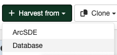

# Збор метаданых з базы даных

Гэты тып збору выкарыстоўвае падключэнне да базы даных для збору метаданых, якія захоўваюцца ў табліцы базы даных.

## Стварэнне зборшчыка 

Пераход да стварэння зборшчыка метаданых з базы даных ажыццяўляецца праз варыянт `Збор даных` панэлі `Адміністраванне`. У акне, якое адкрылася, у крыніцы `Сабраць з` варта выбраць опцыю `База даных`:

Далей Карыстальнік у акне выконвае наступныя дзеянні.

### Ідэнтыфікацыя зборшчыка даных

Карыстальнік ідэнтыфікуе зборшчыка даных:

- Прызначае ўнікальныя *Імя* і *лагатып* зборшчыка.
Варта ўказваць кароткае, апісальнае імя для аддаленага сервера GeoNetwork, з якога плануецца збор метаданых. Гэта імя будзе адлюстроўвацца на галоўнай старонцы, як імя для гэтага зборшчыка.
	
!!! Заўвага:
	
	Прызначэнне лагатыпа з'яўляецца апцыянальным дзеяннем.
	
- Указвае *Групу*, якой будуць належаць сабраныя запісы метаданых. Толькі адміністратар карыстальнікаў гэтай групы можа кіраваць зборшчыкам даных.
	
- Выбірае *Карыстальніка*, якому будуць належаць сабраныя запісы.

### Планаванне раскладу збору даных 

Калі расклад адключаны, то зборшчык даных павінен запускацца са старонкі зборшчыкаў каталога метаданых уручную. Калі расклад уключаны, то яго неабходна наладзіць, выкарыстоўваючы ўбудаваны планіроўшчык або выразы сінтаксісу cron (прыклады можна знайсці [тут](https://quartz-scheduler.org/documentation/quartz-2.1.7/tutorials/crontrigger)). 

### Наладка падключэння да базы даных

Указваюцца наступныя даныя:
	
- *Сервер*: IP-адрас або імя хоста сервера базы даных.
- *Порт* базы даных (напрыклад, для Postgres звычайна 5432).
- *Імя базы даных* для падключэння.
- *Імя табліцы* з метаданымі.  
- *Імя поля метаданых* - імя поля табліцы, якое змяшчае XML-тэкст метаданых. Імя поля павінна пачынацца з літары (a-z) або знака падкрэслівання (_). Наступныя сімвалы ў імені могуць быць літарамі, лічбамі або знакамі падкрэслівання.
	
!!! Заўвага:

	Імёны табліц і палёў павінны пачынацца з літары (a-z) або знака падкрэслівання (_). Наступныя сімвалы ў імені могуць быць літарамі, лічбамі або знакамі падкрэслівання.
	
	Для поля метаданых падтрымліваюцца агульныя тыпы SQL: BLOB, LONGVARBINARY, LONGNVARCHAR, LONGVARCHAR, VARCHAR, SQLXML. Карыстальніку варта праверыць дакументацыю канкрэтнай базы даных для ўдакладнення канкрэтных рэалізацый гэтых агульных тыпаў.
	
- *Тып базы даных*
	
!!! Заўвага:
	
	У цяперашні час падтрымліваюцца Postgres і Oracle.
	
- *Аддаленая аўтэнтыфікацыя* - уліковыя даныя для падключэння да базы даных.
	
### Фільтр пошуку

Яго наладка дазваляе вызначыць простую ўмову поля для фільтрацыі вынікаў.
	
- *Поле фільтра*: імя поля табліцы, якое выкарыстоўваецца для фільтрацыі вынікаў.
	
!!! Заўвага:
	
	Імёны палёў павінны пачынацца з літары (a-z) або знака падкрэслівання (_). Наступныя сімвалы ў імені могуць быць літарамі, лічбамі або знакамі падкрэслівання.

- *Значэнне фільтра*
	
!!! Заўвага:

	Значэнне фільтра можа змяшчаць сімвал %.
	
- *Аператар фільтра*
	
!!! Заўвага:

	У якасці аператара фільтра падтрымліваюцца значэнні `LIKE` і `NOT LIKE`.

### Апрацоўка адказу ад базы даных

Дазваляе наладзіць некаторыя дзеянні над метаданымі, якія збіраюцца: 

- *Дзеянне пры інцыдэнтах з UUID*: маецца на ўвазе заданне дзеяння ў выпадку, калі зборшчык знаходзіць аналагічны UUID (унікальны ідэнтыфікатар) запісу, сабранага іншым спосабам - іншым зборшчыкам, пры дапамозе імпарту запісу, праз панэль рэдактара і інш.
	
	* *Прапусціць запіс*, г.зн. пакінуць дублікаты без змяненняў.
	* *Перазапісаць запіс*, г.зн. замяніць новым запісам.
	* *Стварыць новы UUID*, г.зн. прысвоіць новы UUID і захаваць як новы, так і стары запісы.
	
!!! Заўвага:

	Па змаўчанні ў зборшчыкаў абраны варыянт пропуску запісу з ідэнтычным UUID.
	
- *Праверка запісу перад імпартам*. Пры ўключэнні дадзенай функцыі, метаданыя будуць правераны (валідаваны) на адпаведнасць чаканай схеме метаданых перад імпартам і, калі праверка не пройдзена, то збор запісу метаданых будзе прапушчаны.
	
- Заданне *Імя XSL-фільтра для прымянення* да кожнага запісу метаданых: указваюцца карыстальніцкія XSL-пераўтварэнні, калі гэта неабходна. XSL-фільтр - гэта працэс, які залежыць ад схемы метаданых (гл. папку `process` у схемах метаданых). XSL-фільтр можа складацца з параметраў, якія будуць адпраўлены ў XSL-пераўтварэнне з выкарыстаннем наступнага сінтаксісу:
	
`anonymizer?protocol=MYLOCALNETWORK:FILEPATH&email=gis@organization.org&thesaurus=MYORGONLYTHESAURUS`
	
- *Пакетныя выпраўленні*. Дадзеная функцыя дазваляе абнаўляць сабраныя запісы, выкарыстоўваючы сінтаксіс XPATH. Можа выкарыстоўвацца для дадання, замены або выдалення элементаў метаданых.
	
- *Пераклад змесціва метаданых* дазваляе перакладаць элементы метаданых.
	
!!! Заўвага:

	Заданне імя XSL-фільтра, пакетныя выпраўленні і пераклад змесціва метаданых з'яўляюцца неабавязковымі опцыямі пры наладцы апрацоўкі адказу.
	
	Функцыя перакладу змесціва патрабуе папярэдне наладжанага пастаўшчыка паслуг перакладу ў наладах каталога групы.

### Прывілеі

Задаюцца прывілеі для прагляду, рэдагавання або публікацыі сабраных запісаў метаданых у Каталогу метаданых.