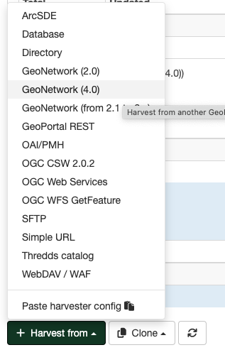

# Збор метададзеных з каталогаў GeoNetwork версій 4.X

Каталог метададзеных Нацыянальнага геапартала выкарыстоўвае тэхналогію [Elasticsearch](https://elastic.co) у якасці пошукавай сістэмы, што абумоўлівае неабходнасць выкарыстання спецыяльнага тыпу зборшчыка для каталогаў на базе GeoNetwork версій 4.x.

# Стварэнне зборшчыка 

Пераход да стварэння зборшчыка метададзеных з базы дадзеных ажыццяўляецца праз варыянт `Збор дадзеных` панэлі `Адміністраванне`. У акне, якое адкрылася, у крыніцы `Сабраць з` варта выбраць опцыю `GeoNetwork (from 4.x)`.
Неабходна запоўніць панэлі канфігурацыі, як апісана ніжэй:

Далей Карыстальнік у акне выконвае наступныя дзеянні.

### Ідэнтыфікацыя зборшчыка дадзеных

Карыстальнік ідэнтыфікуе зборшчыка дадзеных:
	
- Прызначае ўнікальнае *Імя* зборшчыка. 
Варта ўказваць кароткае, апісальнае імя для аддаленага сервера GeoNetwork, з якога плануецца збор метададзеных. Гэта імя будзе адлюстроўвацца на галоўнай старонцы, як імя для гэтага зборшчыка.
	
- Указвае *Групу*, якой будуць належаць сабраныя запісы метададзеных. Толькі адміністратар карыстальнікаў гэтай групы можа кіраваць зборшчыкам дадзеных.
	
- Выбірае *Карыстальніка*, якому будуць належаць сабраныя запісы.
	
### Планаванне раскладу збору дадзеных

Калі расклад адключаны, то зборшчык дадзеных павінен запускацца са старонкі зборшчыкаў каталога метададзеных уручную. Калі расклад уключаны, то яго неабходна наладзіць, выкарыстоўваючы ўбудаваны планіроўшчык або выразы сінтаксісу cron (прыклады можна знайсці [тут](https://quartz-scheduler.org/documentation/quartz-2.1.7/tutorials/crontrigger)). 

### Наладка падключэння да каталога GeoNetwork

Указваюцца наступныя дадзеныя:

- *Поўны URL-адрас* аддаленага сервера GeoNetwork 4.x. Адрас сервера павінен уключаць імя каталога (напрыклад, http://fao.org/geonetwork).
- *Імя вузла* каталога для збору метададзеных (звычайна ўказваецца srv).
- *Фільтр пошуку* для абмежавання сабраных метададзеных з дапамогай наступных крытэрыяў:
	* *Поўны тэкст*: метададзеныя павінны адпавядаць усім тэкставым палям.
	* *Загаловак*: збор метададзеных з указаным загалоўкам.
	* *Анатацыя*: фільтрацыя па анатацыях запісаў метададзеных.
	* *Ключавое слова*: збор запісаў з указаным ключавым словам.
	* *Катэгорыі*: фільтр па катэгорыях метададзеных.
	* *Стандарт метададзеных*: фільтр па стандартах метададзеных.
	
	!!! note "Заўвага"
	
		Карыстальнік можа паказаць фільтрацыю па некалькіх катэгорыях або стандартах метададзеных з дапамогай аператараў `AND` або `OR`. Напрыклад, для аб'яднання фільтраў па катэгорыях cat1 і cat2 трэба ўказаць `cat1 AND cat2`. Або ў выпадку выбару аднаго з двух стандартаў варта задаць `iso19139 OR iso19115-3.2018`.
	
	* *Групы*: фільтрацыя па групах каталога.
	
	!!! note "Заўвага"
		
		Карыстальнік можа паказаць адну або некалькі груп (уладальнікаў метададзеных) лікавымі ідэнтыфікатарамі, падзеленымі коскамі.
	
- *Каталог* для вызначэння зыходнага падкакаталога, калі гэта неабходна.

### Апрацоўка адказу 

Дазваляе наладзіць некаторыя дзеянні над метададзенымі, якія збіраюцца:

- *Дзеянне пры інцыдэнтах з UUID*: маецца на ўвазе заданне дзеяння ў выпадку, калі зборшчык знаходзіць аналагічны UUID (унікальны ідэнтыфікатар) запісу, сабранага іншым спосабам - іншым зборшчыкам, пры дапамозе імпарту запісу, праз панэль рэдактара і інш.
	
	* *Прапусціць запіс*, г.зн. пакінуць дублікаты без змяненняў.
	* *Перазапісаць запіс*, г.зн. замяніць новым запісам.
	* *Стварыць новы UUID*, г.зн. прысвоіць новы UUID і захаваць як новы, так і стары запісы.
	
!!! note "Заўвага"

	Па змаўчанні ў зборшчыкаў абраны варыянт пропуску запісу з ідэнтычным UUID

- *Аддаленая аўтэнтыфікацыя* - наладжваецца, калі патрабуюцца ўліковыя дадзеныя для зыходнага каталога GeoNetwork.

- *Выкарыстанне поўнага фармату MEF*: актывуе перадачу ўсіх палёў метададзеных і рэсурсаў.

- *Выкарыстанне даты змен для параўнання*: збор запісу будзе ажыццяўляцца толькі ў выпадку, калі дата змянення адрозніваецца.

- *Усталяваць катэгорыю метададзеных, калі яна існуе лакальна*: сабраным метададзеным прысвойваецца катэгорыя, калі такая ж катэгорыя была створана ў групе, куды дадзеныя збіраюцца.

- *Катэгорыя сабраных метададзеных*: усталёўваецца катэгорыя "па змаўчанні" для метададзеных, якія збіраюцца.

- *Праверка запісу перад імпартам*. Пры ўключэнні дадзенай функцыі, метададзеныя будуць правераны (валідаваны) на адпаведнасць чаканай схеме метададзеных перад імпартам з каталога GeoNetwork і, калі праверка не пройдзена, то збор запісу метададзеных будзе прапушчаны.

- Заданне *Імя XSL-фільтра для прымянення* да кожнага запісу метададзеных: указваюцца карыстальніцкія XSL-пераўтварэнні, калі гэта неабходна. XSL-фільтр - гэта працэс, які залежыць ад схемы метададзеных (гл. папку `process` у схемах метададзеных). XSL-фільтр можа складацца з параметраў, якія будуць адпраўлены ў XSL-пераўтварэнне з выкарыстаннем наступнага сінтаксісу:
	
`anonymizer?protocol=MYLOCALNETWORK:FILEPATH&email=gis@organization.org&thesaurus=MYORGONLYTHESAURUS`

### Прывілеі

Задаюцца прывілеі для прагляду, рэдагавання або публікацыі сабраных запісаў метададзеных у Каталогу метададзеных.