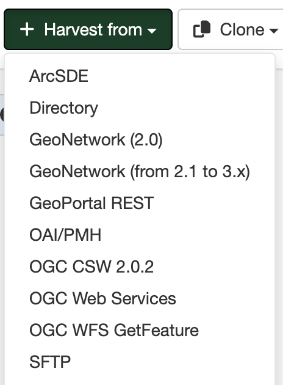

# Збор метададзеных з сервераў SFTP

Для збору запісаў метададзеных з сервераў SFTP у выглядзе XML-файлаў выкарыстоўваецца асобны зборшчык.

# Стварэнне зборшчыка

Пераход да стварэння зборшчыка метададзеных з базы дадзеных ажыццяўляецца праз варыянт `Збор дадзеных` панэлі `Адміністраванне`. У акне, якое адкрыецца, у крыніцы `Збор з` варта выбраць опцыю `SFTP server`.
Неабходна запоўніць панэлі канфігурацыі, як апісана ніжэй:

Далей Карыстальнік у акне выконвае наступныя дзеянні.

### Ідэнтыфікацыя зборшчыка дадзеных

Карыстальнік ідэнтыфікуе зборшчык дадзеных:
	
- Прызначае ўнікальныя *Імя* і *лагатып* зборшчыка.
Варта ўказваць кароткую, апісальную назву для аддаленага сервера GeoNetwork, з якога плануецца збор метададзеных. Гэта назва будзе адлюстроўвацца на галоўнай старонцы, як імя для гэтага зборшчыка.
	
!!! Заўвага:

	Прызначэнне лагатыпа з'яўляецца апцыянальным дзеяннем.
	
- Паказвае *Групу*, якой будуць належаць сабраныя запісы метададзеных. Толькі адміністратар карыстальнікаў гэтай групы можа кіраваць зборшчыкам дадзеных.
	
- Выбірае *Карыстальніка*, якому будуць належаць сабраныя запісы.
	
### Планаванне раскладу збору дадзеных

Калі расклад адключаны, то зборшчык дадзеных павінен запускацца са старонкі зборшчыкаў каталога метададзеных уручную. Калі расклад уключаны, то яго неабходна наладзіць, выкарыстоўваючы ўбудаваны планавальнік або выразы сінтаксісу cron (прыклады можна знайсці [тут](https://quartz-scheduler.org/documentation/quartz-2.1.7/tutorials/crontrigger)). 

### Налада падключэння SFTP

Указваюцца наступныя дадзеныя:

- *Адрас хоста SFTP*: уводзіцца імя хоста SFTP або IP-адрас (варта апусціць прэфікс sftp://).
- *Порт SFTP*: порт для падключэння (звычайна 22).
- *Хатні каталог SFTP*: паказваецца шлях да каталога на серверы SFTP, які змяшчае метададзеныя (XML-файлы), якія неабходна сабраць. Для пачатку з каранёвага каталога падключэння шлях да каталога павінен пачынацца з сімвала "/".
- *Рэкурсіўны пошук ва ўкладзеных папках*
Калі функцыя актывавана, зборшчык будзе рэкурсіўна апрацоўваць метададзеныя ва ўсіх папках у пазначаным хатнім каталогу, уключаючы ўкладзеныя папкі. У адваротным выпадку будуць сабраны толькі элементы ў пазначаным каталогу.
- *Імя карыстальніка* для падключэння да сервера SFTP.
- У залежнасці ад налад сервера SFTP прапануецца два варыянты на выбар:

	* *Пароль* для падключэння да сервера SFTP.
	* *Выкарыстоўваць ключ SSH*
	
	!!! Заўвага:
	
		Выкарыстанне ключа SSH з'яўляецца больш бяспечным метадам аўтэнтыфікацыі, чым пароль, і рэкамендуецца да выкарыстання.
	
		Пры выкарыстанні ключа SSH павінен быць выбраны тып ключа - алгарытм для стварэння ключа SSH: RSA (4096 біт) або ECDSA.

### Апрацоўка адказу 

Дазваляе наладзіць некаторыя дзеянні над метададзенымі, якія збіраюцца:

- *Дзеянне пры інцыдэнтах з UUID*: маецца на ўвазе заданне дзеяння ў выпадку, калі зборшчык знаходзіць аналагічны UUID (унікальны ідэнтыфікатар) запісу, сабранага іншым спосабам - іншым зборшчыкам, пры дапамозе імпарту запісу, праз панэль рэдактара і інш.
	
	* *Прапусціць запіс*, г.зн. пакінуць дублікаты без зменаў.
	* *Перазапісаць запіс*, г.зн. замяніць новым запісам.
	* *Стварыць новы UUID*, г.зн. прысвоіць новы UUID і захаваць як новы, так і стары запісы.
	
!!! Заўвага:
	
	Па змаўчанні ў зборшчыкаў выбраны варыянт пропуску запісу з ідэнтычным UUID

* *Абнаўляць запіс каталога толькі калі файл быў абноўлены*
Запіс метададзеных будзе імпартаваны толькі ў выпадку, калі быў зменены зыходны XML-файл на серверы SFTP.

- *Захоўваць запіс, нават калі ён выдалены ў крыніцы*
Выбар гэтай функцыі дазваляе захоўваць ужо сабраныя раней запісы, нават калі яны будуць выдалены з пазначанага каталога на серверы SFTP.

- *Праверка запісу перад імпартам*. 
Усталёўваюцца крытэрыі для адхілення несапраўдных метададзеных на аснове структуры XML (XSD) і правіл валідацыі (schematron):

	* Прымаць усе метададзеныя без валідацыі.
	* Прымаць метададзеныя, якія валідныя па XSD.
	* Прымаць метададзеныя, якія валідныя як па XSD, так і па schematron.

- Заданне *Імя XSL-фільтра для прымянення* да кожнага запісу метададзеных: паказваюцца карыстальніцкія XSL-пераўтварэнні, калі гэта неабходна. XSL-фільтр - гэта працэс, які залежыць ад схемы метададзеных (гл. папку `process` у схемах метададзеных). XSL-фільтр можа складацца з параметраў, якія будуць адпраўлены ў XSL-пераўтварэнне з выкарыстаннем наступнага сінтаксісу:
	
`anonymizer?protocol=MYLOCALNETWORK:FILEPATH&email=gis@organization.org&thesaurus=MYORGONLYTHESAURUS`

- *Катэгорыя сабраных метададзеных*: усталёўваецца катэгорыя "па змаўчанні" для метададзеных, якія збіраюцца.

!!! Заўвага:
	
	Заданне імя XSL-фільтра, пакетныя выпраўленні і прызначэнне катэгорыі метададзеных з'яўляюцца неабавязковымі опцыямі пры наладзе апрацоўкі адказу.

### Прывілеі

Задаюцца прывілеі для прагляду, рэдагавання або публікацыі сабраных запісаў метададзеных у Каталогу метададзеных.
