# Даданне віджэтаў

****************

Пры націску на кнопку  на [бакавой панэлі інструментаў](exploring-dashboards.md#side-toolbar) адкрываецца панэль *Віджэт*, якая паказвае спіс даступных тыпаў віджэтаў, якія можна дадаць на інфармацыйную панэль:

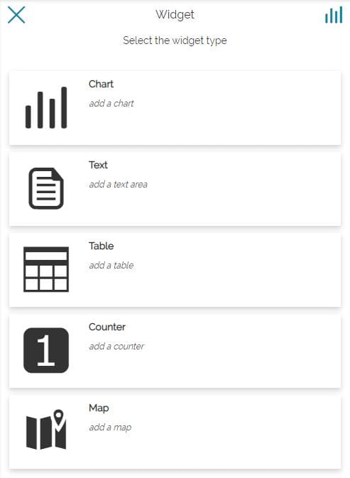

У прыватнасці, можна выбраць:

* **Дыяграма**

* **Тэкст**

* **Табліца**

* **Лічыльнік**

* **Карта**

Працэдура стварэння віджэтаў *Дыяграма*, *Тэкст*, *Табліца* і *Лічыльнік* амаль такая ж, як апісана для [стварэння віджэтаў на картах](widgets.md#widgets). Адзіныя нязначныя адрозненні наступныя:

* У інфармацыйных панэлях, як толькі карыстальнік выбірае тып віджэта, з'яўляецца панэль для выбару слоя, з якога будзе створаны віджэт. Можна выбраць паміж службамі CSW, WMS і WMTS ад GeoSolutions, якія прысутнічаюць па змаўчанні, або атрымаць доступ да аддаленых службаў WMS, WFS, CSW, WMTS і TMS, як тлумачыцца ў раздзеле [Кіраванне аддаленымі службамі](catalog.md#managing-remote-services).

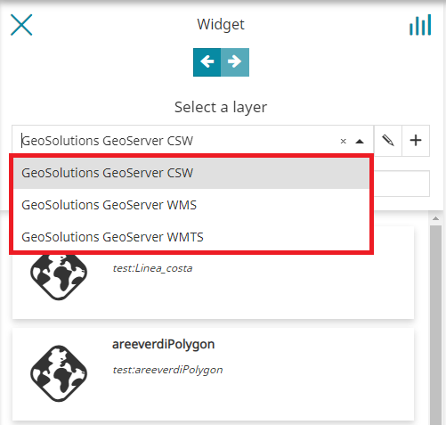

* У інфармацыйных панэлях магчымасць падключэння/адключэння віджэтаў ад карты заменена магчымасцю падключаць/адключаць віджэты "Карта" паміж сабой або з іншымі тыпамі віджэтаў (гэты момант будзе больш падрабязна растлумачаны ў раздзеле [Злучэнне віджэтаў](connecting-widgets.md#connecting-widgets)).

Стварэнне віджэтаў тыпу "Карта", у сваю чаргу, з'яўляецца функцыянальнасцю, якая прысутнічае толькі ў інфармацыйных панэлях.

## Віджэт "Карта"

У інфармацыйных панэлях, пры выбары віджэта тыпу "Карта", з'яўляецца наступная панэль:

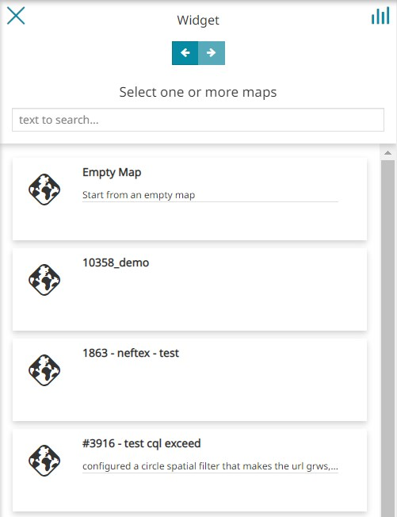

Тут карыстальнік можа:

* Вярнуцца да выбару тыпу віджэта з дапамогай кнопкі 

* Шукаць карту па яе назве

* Выбраць адну або некалькі карт са спіса (абавязкова для пераходу да наступнага кроку)

* Перайсці да наступнага кроку з дапамогай кнопкі 

Пасля выбару карты панэль адлюстроўвае слаі, якія прысутнічаюць на карце ў папярэднім праглядзе, і пералічвае слаі, звязаныя з картай.

!!!заўвага
    Калі карыстальнік выбраў больш за адну карту, майстар карт адлюстроўвае выпадальны спіс *пераключальніка карт*, які дазваляе карыстальніку выбіраць і наладжваць карту.

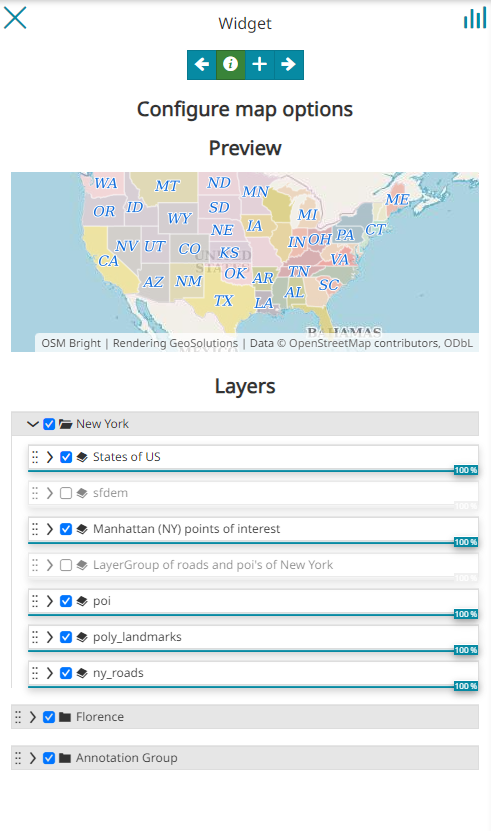

!!!заўвага
    Калі абрана **Пустая карта**, карыстальнік можа:

    * Стварыць віджэт карты, выкарыстоўваючы пустую карту.

    * Калі ў выбары карты ёсць пустая карта, карыстальніку прапануецца ўвесці назву карты.

    * Пасля дадання назвы, майстар карт адлюстроўвае пераключальнік карт, які дазваляе карыстальніку выбіраць і наладжваць карту.

    * Дадаваць слаі на карту з дапамогай кнопкі , як паказана ніжэй: <video controls class="ms-docimage"  style="max-width:400px;"><source src="../../../ru/user-guide/map/img/adding-widgets/wid-add-layer.mp4"> /></video>

На панэлі **Наладзіць параметры карты** карыстальнік можа пераключаць бачнасць слоя і ўсталёўваць празрыстасць слаёў, як тлумачыцца ў раздзеле [Опцыі адлюстравання](toc.md#display-options-in-panel). Акрамя таго, карыстальнік можа кіраваць слоем з дапамогай новых кнопак на панэлі інструментаў слоя, выбраўшы слой у спісе слаёў.

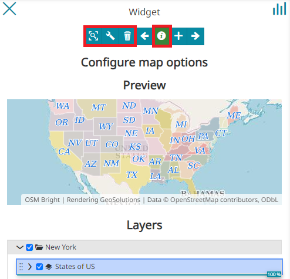

Тут карыстальніку дазволена:

* **Наблізіць** да слаёў з дапамогай кнопкі 

* Атрымаць доступ да [наладак слоя](layer-settings.md#layer-settings) з дапамогай кнопкі 

* **Выдаліць** слаі з дапамогай кнопкі 

* Адключыць/уключыць [плаваючы інструмент "Ідэнтыфікацыя"](navigation-toolbar.md#floating-identify-tool) для атрымання інфармацыі пра аб'екты слаёў, даступных на карце, з дапамогай кнопкі 

!!!увага
    Інструмент *Плаваючая ідэнтыфікацыя* актыўны па змаўчанні (кнопка зялёная).

Пасля націску кнопкі , апошні крок працэсу адлюстроўваецца наступным чынам:

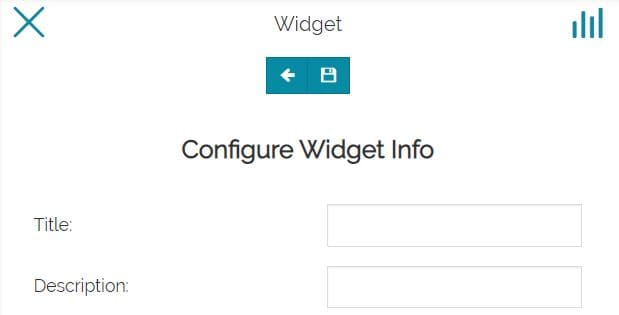

Тут у карыстальніка ёсць магчымасць увесці **Загаловак** і **Апісанне** для віджэта (неабавязковыя палі) і завяршыць яго стварэнне, націснуўшы на кнопку . Пасля гэтага віджэт дадаецца ў прастору прагляду:

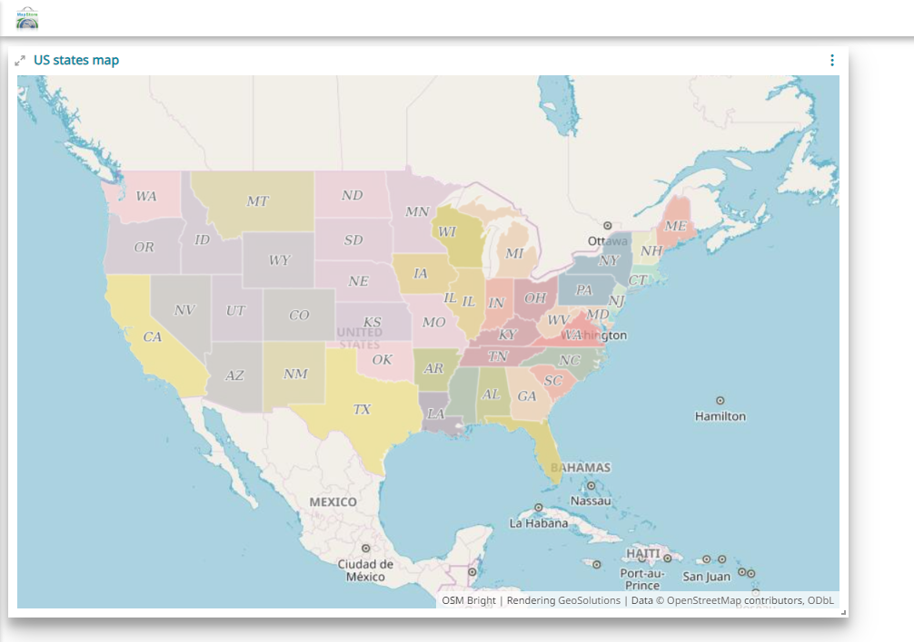

## Віджэт "Легенда"

Калі створаны і дададзены на інфармацыйную панэль хаця б адзін віджэт "Карта", з'яўляецца магчымасць дадаць таксама віджэт **Легенда**, даступны ў спісе тыпаў віджэтаў:

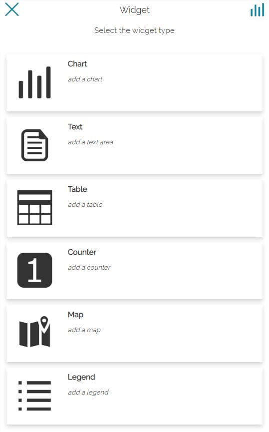

Выбіраючы віджэт "Легенда", карыстальнік можа выбраць віджэт "Карта", з якім будзе звязана легенда (калі на інфармацыйнай панэлі прысутнічае толькі адзін віджэт "Карта", гэты крок прапускаецца):

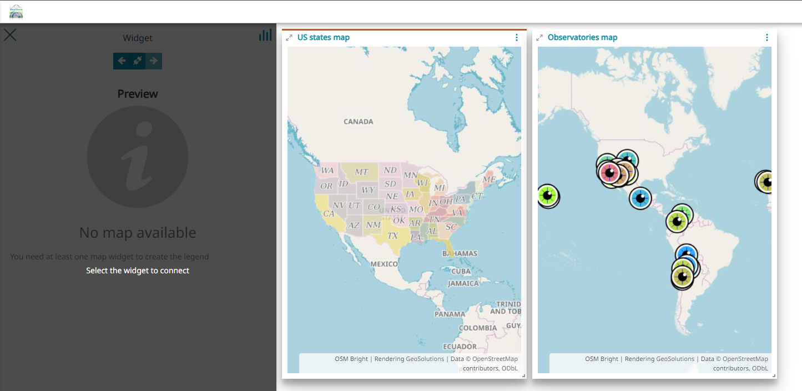

Пасля падключэння віджэта "Карта" панэль папярэдняга прагляду выглядае наступным чынам:

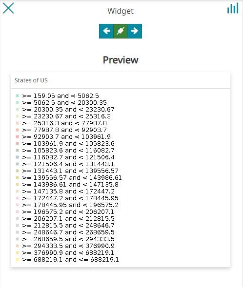

Тут карыстальнік можа вярнуцца  да раздзела тыпаў віджэтаў, падключыць  або адключыць  легенду ад карты і перайсці  да параметраў віджэта. 
Калі абрана апошняя опцыя, панэль канфігурацыі, аналагічная панэлі [віджэтаў "Карта"](#map-widget), дае магчымасць перад захаваннем усталяваць *Загаловак* і *Апісанне* для віджэта "Легенда". 

Прыкладам віджэта "Карта" і віджэта "Легенда" з'яўляецца наступны:

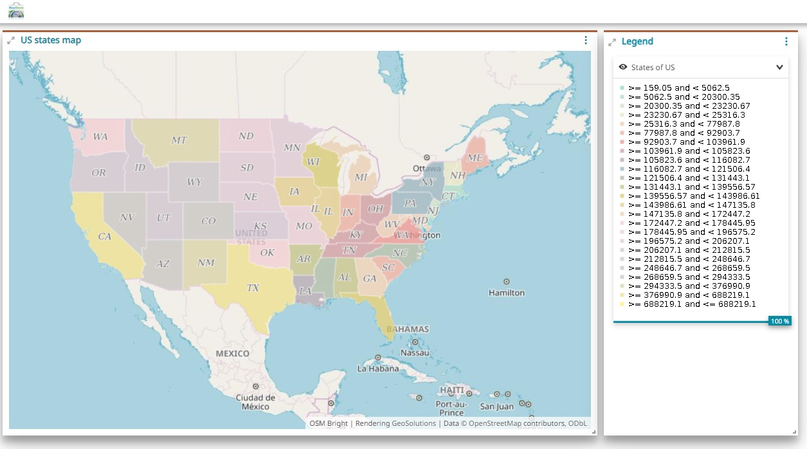