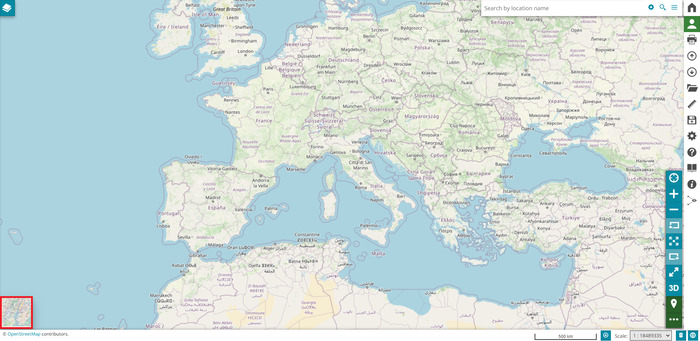
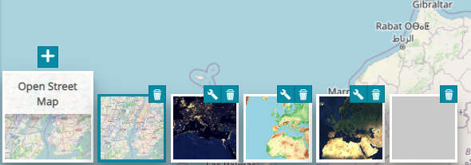
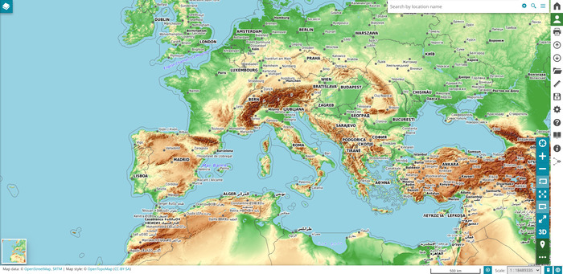
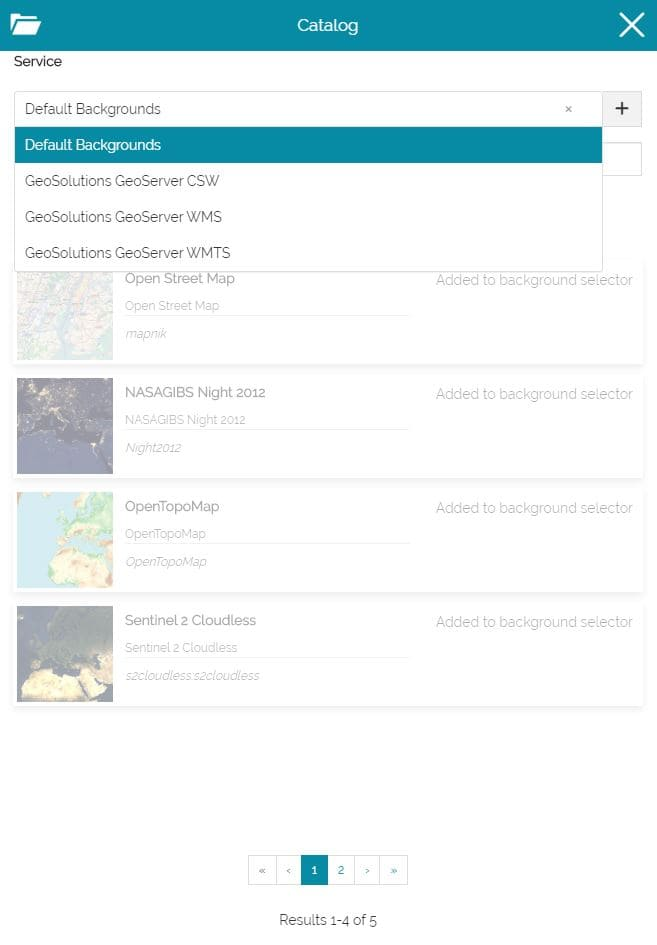
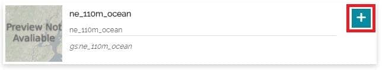
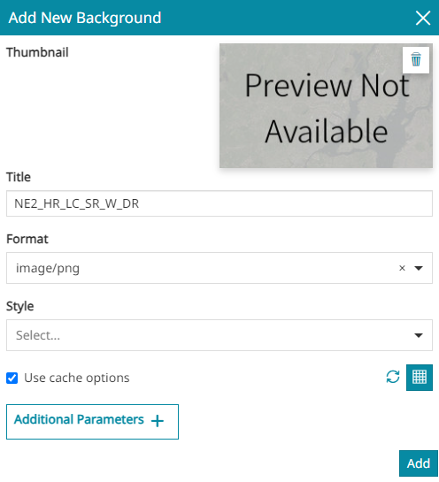
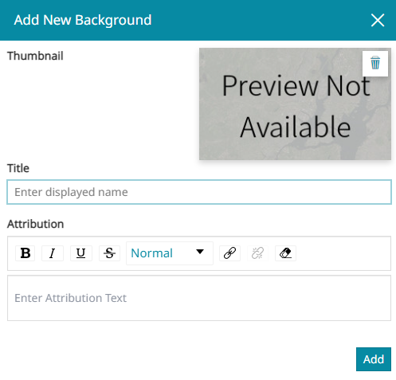
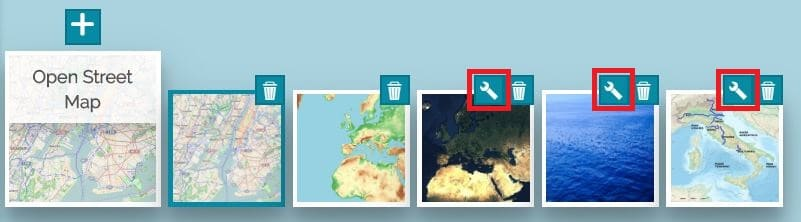
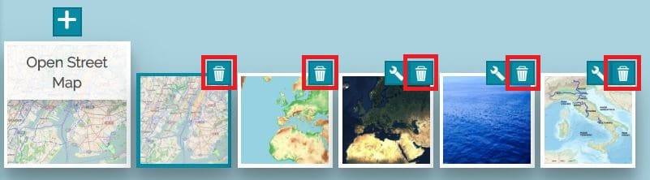
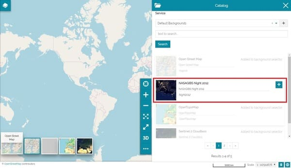

# Селектар фонавых карт

*********************

Селектар фонавых карт, размешчаны ў левым ніжнім куце *Акна прагляду*, дазваляе карыстальніку дадаваць, кіраваць і выдаляць фонавыя карты.

Пры націску на селектар фонавых карт адлюструецца некалькі мініяцюр. Гэтыя мініяцюры можна выбіраць, каб пераключацца з адной фонавай карты на іншую (па змаўчанні ў MapStore ўсталяваны наступныя фонавыя карты: *Open Street Map*, *NASAGIBS*, *OpenTopoMap*, *Sentinel 2* і *Пустая фонавая карта*).

Напрыклад, пры выбары *OpenTopoMap* фонавая карта зменіцца, як на малюнку ніжэй:

## Даданне фонавай карты

Новую фонавую карту можна дадаць з дапамогай кнопкі  у верхняй частцы галоўнай карткі селектара. Пры выкананні гэтага дзеяння адкрываецца панэль [Каталога](catalog.md#catalog-services) з магчымасцю доступу да *Аддаленых службаў*:

!!! Папярэджанне
    Служба *Фонавыя карты па змаўчанні* даступная толькі пры доступе да [Каталога](catalog.md) з селектара фонавых карт, але калі вы дадасце адтуль новую Аддаленую службу, яна таксама будзе даступная пры доступе да [Каталога](catalog.md) з [Бакавой панэлі інструментаў](mapstore-toolbars.md#side-toolbar) або са [Панэлі зместу](toc.md).

З [Каталога](catalog.md#catalog-services) карыстальнік можа выбраць слаі для дадання ў спіс фонавых карт:

Як толькі будзе абраны слой WMS, адкрыецца акно **Дадаць новую фонавую карту**:

У гэтым акне карыстальнік можа выканаць наступныя аперацыі:

* Дадаць **Эскіз**, выбраўшы патрэбны лакальны файл, націснуўшы на вобласць папярэдняга прагляду выявы або проста перацягнуўшы яго.

* Усталяваць **Загаловак**

* Усталяваць **Фармат** (паміж `png`, `png8`, `jpeg`, `vnd.jpeg-png` або `gif`)

* Выбраць **Стыль** з даступных для гэтага слоя

* Уключыць/выключыць выкарыстанне кэшаваных тайлаў слоя. Калі сцяжок усталяваны, да WMS-запыту будзе дададзены URL-параметр *Tiled=true* для [выкарыстання тайлаў, кэшаваных з дапамогай GeoWebCache](https://docs.geoserver.org/latest/en/user/geowebcache/using.html#direct-integration-with-geoserver-wms).
Калі опцыя *Выкарыстоўваць кэш* уключана, становяцца даступнымі дадатковыя элементы кіравання, якія дазваляюць карыстальніку праверыць, ці адпавядаюць бягучыя наладкі карты якой-небудзь ***стандартнай*** Сетцы тайлаў GWC, вызначанай на баку сервера для дадзенага слоя WMS (**Праверыць даступную інфармацыю аб сетках тайлаў** ). У той жа час можна змяніць стратэгію наладкі (на аснове адказу службы WMTS), каб строга адаптаваць наладкі слоя на баку кліента да тых, якія адпавядаюць любой аддаленай ***карыстальніцкай*** Сетцы тайлаў, вызначанай для бягучых наладак карты (кнопка **Выкарыстоўваць аддаленыя карыстальніцкія сеткі тайлаў** ). (Падрабязней у раздзеле [Наладкі слоя](layer-settings.md#display)).

* Дадаць **Дадатковыя параметры** трох розных тыпаў: *Радок*, *Лік* або *Лагічны* (гэтыя параметры будуць дададзены да WMS-запыту).

!!! Папярэджанне
    Памер выявы эскіза павінен быць квадратным 98x98px або 128x128px, максімальны памер 500kb, падтрымліваюцца фарматы: `jpg` (або `jpeg`) і `png`.

Пасля выбару опцый, з дапамогай кнопкі  новы фонавы слой будзе канчаткова дададзены ў селектар фонавых карт у выглядзе карткі і аўтаматычна ўсталяваны як бягучы.

### Даданне фонавай карты WMTS

У выпадку дадання слоя WMTS у якасці фонавай карты, акно **Дадаць новую фонавую карту** будзе крыху адрознівацца:

Карыстальнік можа выканаць наступныя аперацыі:

* Дадаць **Эскіз**, выбраўшы патрэбны лакальны файл, націснуўшы на вобласць папярэдняга прагляду выявы або проста перацягнуўшы яго.

* Усталяваць **Загаловак**

* Усталяваць **Атрыбуцыю**, бачную ў левай ніжняй частцы ніжняга калантытула ў акне прагляду карты.

<video class="ms-docimage" controls><source src="../../../ru/user-guide/map/img/background/wmts-attribution.mp4" /></video>

## Рэдагаванне фонавай карты

Рэдагаваць фонавыя карты можна, націснуўшы на значок наладак у верхняй частцы кожнай карткі фонавай карты:

!!! Папярэджанне
    Слаі з *Фонавых карт па змаўчанні* нельга рэдагаваць, за выключэннем *Sentinel 2: толькі слаі WMS можна рэдагаваць і/або наладжваць праз Селектар фонавых карт*.

Адкрыецца акно **Рэдагаваць бягучую фонавую карту**, якое дазваляе карыстальніку наладзіць той жа набор інфармацыі, што і пры даданні новай фонавай карты (гл. [папярэдні раздзел](#add-background)).

## Выдаленне фонавай карты

Выдаліць фонавую карту з селектара можна, націснуўшы на значок выдалення ў правым верхнім куце кожнай карткі.

!!! Увага
    Па змаўчанні для новых карт усе фонавыя карты са службы *Фонавыя карты па змаўчанні* дадаюцца ў селектар, і ў [Каталогу](catalog.md#catalog-services) яны адлюстроўваюцца шэрым колерам (нельга дадаць адну і тую ж фонавую карту па змаўчанні двойчы): як толькі вы выдаляеце адну з іх з селектара фонавых карт, яна становіцца даступнай для выбару ў [Каталогу](catalog.md#catalog-services).

    