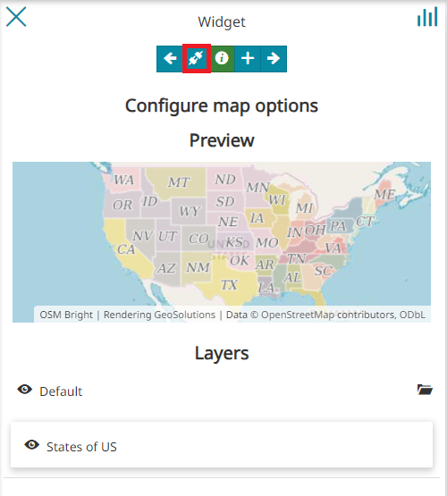
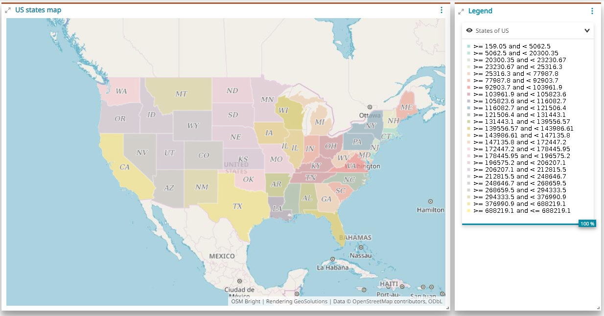
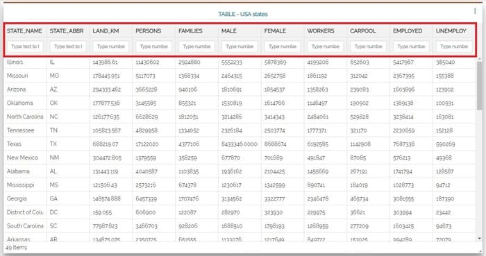
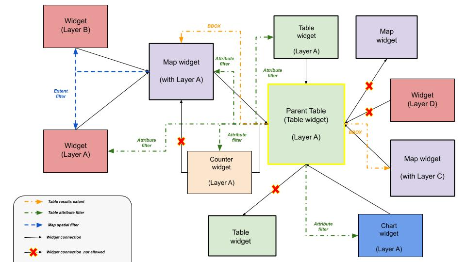

# Злучэнне віджэтаў

********************
На інфармацыйных панэлях можна злучаць дададзеныя віджэты, што дазваляе карыстальніку праглядаць і ўзаемадзейнічаць з некалькімі з іх адначасова.

<video class="ms-docimage" style="max-width:700px;" controls><source src="../../../ru/user-guide/map/img/connecting-widgets/widgets_interaction.mp4"/></video>

Калі паміж віджэтамі ўстаноўлена хаця б адна сувязь, можна вызначыць злучаныя віджэты, уключыўшы кнопку злучэнняў на [бакавой панэлі інструментаў](exploring-dashboards.md#side-toolbar) інфармацыйнай панэлі, якая стане зялёнай . Гэта падсвеціць злучаныя элементы каляровай паласой у іх верхняй частцы.

<video class="ms-docimage" style="max-width:700px;" controls><source src="../../../ru/user-guide/map/img/connecting-widgets/connections_widgets.mp4"/></video>

Увогуле, вы можаце злучаць:

* Віджэты "Карта" з іншымі віджэтамі

* Віджэты "Табліца" з іншымі віджэтамі

## Злучэнне віджэтаў "Карта" з іншымі віджэтамі

На інфармацыйных панэлях можна злучаць віджэты "Карта" з:

* Іншымі віджэтамі "Карта"

* Віджэтамі "Дыяграма"

* Віджэтамі "Табліца"

* Віджэтамі "Лічыльнік"

* Віджэтамі "Легенда"

### Карты з іншымі картамі

Як толькі на інфармацыйную панэль дададзена больш за адзін віджэт "Карта", кнопка злучэння/раз'яднання з'яўляецца на панэлі *Наладзіць параметры карты* (даступная пры даданні новага або рэдагаванні існуючага віджэта "Карта").

Пры націску на яе, калі прысутнічае толькі адзін іншы віджэт "Карта", па змаўчанні будзе ўстаноўлена злучэнне з гэтым віджэтам. Калі ж на інфармацыйнай панэлі прысутнічае больш за адзін віджэт "Карта", можна выбраць адзін з іх на старонцы, падобнай на наступную:

<video class="ms-docimage" style="max-width:700px;" controls><source src="../../../ru/user-guide/map/img/connecting-widgets/map-to-connect.mp4"/></video>

### Карты з дыяграмамі, табліцамі і лічыльнікамі

Каб злучыць віджэты "Дыяграма", "Табліца" або "Лічыльнік" з віджэтам "Карта", працэдура аналагічная той, што была разгледжана ў [папярэднім раздзеле](#connecting-widgets). У выніку інфармацыя, якая адлюстроўваецца ў віджэтах "Дыяграма", "Табліца" або "Лічыльнік", змяняецца ў адпаведнасці з адлюстраваным участкам карты ў падключаным віджэце "Карта". Напрыклад, вынік можа быць такім:

* Злучэнне дыяграм з картамі:

<video class="ms-docimage" style="max-width:700px;" controls><source src="../../../ru/user-guide/map/img/connecting-widgets/chart-map.mp4"/></video>

* Злучэнне табліц з картамі:

<video class="ms-docimage" style="max-width:700px;" controls><source src="../../../ru/user-guide/map/img/connecting-widgets/table-map.mp4"/></video>

* Злучэнне лічыльнікаў з картамі:

<video class="ms-docimage" style="max-width:700px;" controls><source src="../../../ru/user-guide/map/img/connecting-widgets/counter-map.mp4"/></video>

Калі ў віджэце "Карта" выконваецца аперацыя панарамавання або маштабавання, іншыя падключаныя віджэты прасторава фільтруюцца ў адпаведнасці з бачным экстэнтам карты.

### Карты з легендамі

У гэтым выпадку працэдура злучэння аналагічная разгледжаным раней, але цяпер інфармацыя, якая змяшчаецца ў віджэце "Легенда", не змяняецца ў залежнасці ад экстэнта карты. Прыкладам можа быць наступны:

## Злучэнне віджэтаў "Табліца" з іншымі віджэтамі

З дапамогай той жа працэдуры, што і для карт (гл. [папярэдні раздзел](#карты-з-іншымі-картамі)), карыстальнік можа злучаць віджэты "Табліца" з:

* Віджэтамі "Карта"

* Іншымі віджэтамі "Табліца", толькі калі яны адносяцца да таго ж слоя

* Віджэтамі "Дыяграма", толькі калі яны адносяцца да таго ж слоя

* Віджэтамі "Лічыльнік", толькі калі яны адносяцца да таго ж слоя

Калі табліца злучана з іншымі віджэтамі, яна становіцца *бацькоўскай табліцай*, і ўверсе з'яўляецца фільтр.

Прымяніць фільтр у *бацькоўскай табліцы* можна, проста ўвёўшы тэкст у поле ўводу, размешчанае ўверсе кожнага слупка:

<video class="ms-docimage" style="max-width:700px;" controls><source src="../../../ru/user-guide/map/img/connecting-widgets/filter_on_table.mp4"/></video>

Віджэт "Карта", злучаны з бацькоўскай табліцай, атрымлівае атрыбутыўны фільтр з табліцы і:

* Выконвае маштабаванне да экстэнта, які змяшчае ўсе запісы віджэта "Табліца" (вынік фільтрацыі ў табліцы)

* Калі віджэт "Карта" змяшчае той жа набор даных (слой), што і бацькоўская табліца, то слой на карце таксама фільтруецца адпаведным чынам

Калі віджэт злучаны з віджэтам "Карта", які, у сваю чаргу, злучаны з бацькоўскай табліцай:

* Калі віджэт быў створаны на тым жа наборы даных (слоі), што і бацькоўская табліца, то да самога віджэта будуць прыменены два фільтры па ўмове "І": прасторавы фільтр ад віджэта "Карта" і атрыбутыўны фільтр, вызначаны ў бацькоўскай табліцы.

<video class="ms-docimage" style="max-width:700px;" controls><source src="../../../ru/user-guide/map/img/connecting-widgets/interaction_a.mp4"/></video>

* Калі набор даных не супадае, будзе прыменены толькі прасторавы фільтр ад віджэта "Карта", як звычайна: у наступным прыкладзе лічыльнік адносіцца да іншага слоя, адрознага ад таго, што наладжаны для бацькоўскай табліцы.

<video class="ms-docimage" style="max-width:700px;" controls><source src="../../../ru/user-guide/map/img/connecting-widgets/interaction_ab.mp4"/></video>

Існуюць розныя камбінацыі злучэнняў; малюнак ніжэй ілюструе дапушчальныя з іх, а таксама паказвае тыпы фільтраў, якія прымяняюцца ў кожным выпадку.

