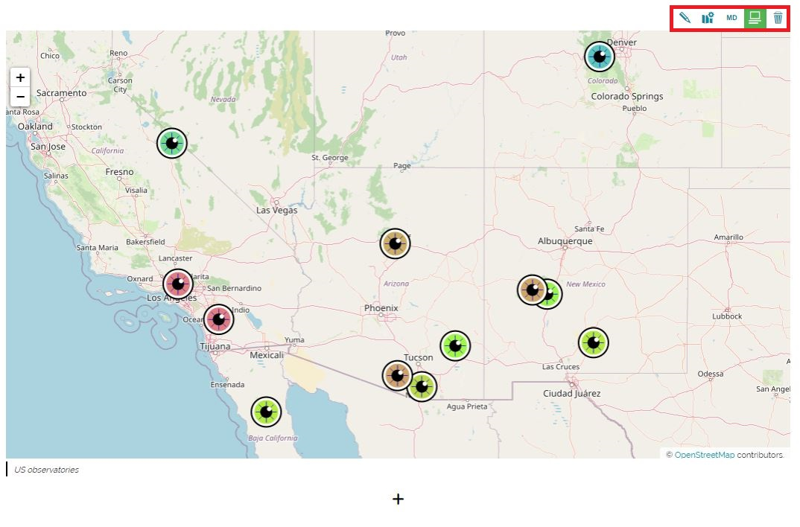

# Панэль інструментаў зместу карты

**********************

Як толькі змест карты дададзены, над кампанентам карты з'яўляецца панэль інструментаў зместу карты:

У прыватнасці, з дапамогай гэтай панэлі інструментаў рэдактар гісторыі можа выконваць наступныя аперацыі:

* **Змяніць крыніцу медыя** , атрымаўшы доступ да [рэдактара медыя](media-editor-window.md#media-editor-window).

* **Рэдагаваць канфігурацыю карты** , з дапамогай якой можна [наладзіць карту](configure-map.md#configure-the-map).

* **Змяніць памер** , выбраўшы паміж *маленькім*, *сярэднім*, *вялікім*.

* Кнопка **Схаваць подпіс**  для адлюстравання/схавання апісання пад картай: гэтая кнопка прысутнічае толькі ў тым выпадку, калі для рэсурсу карты было прадастаўлена апісанне (гл. напрыклад, інструмент [Рэдактар медыя](media-editor-window.md#media-editor-window)).

* **Выдаліць**  змест карты.