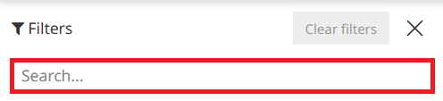
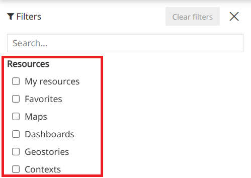

# Фільтрацыя рэсурсаў

***********

На хатняй старонцы карыстальнікі могуць шукаць даступныя рэсурсы з дапамогай **панэлі фільтрацыі**, якая адкрываецца злева на хатняй старонцы па пстрычцы на значок , размешчаны справа ад *інструмента пошуку*.

Панэль фільтрацыі прадастаўляе розныя опцыі для ўдакладнення пошуку, якія можна камбінаваць для атрымання больш дакладных вынікаў. У прыватнасці, карыстальнікі могуць фільтраваць рэсурсы на аснове наступных опцый:

* **Поле пошуку** ўверсе панэлі: калі карыстальнік ініцыюе пошук, ён перанакіроўваецца на старонку пошуку, якая паказвае вынікі пошуку па ўсіх тыпах рэсурсаў.

* Тып **рэсурсаў**: калі карыстальнік уключае/выключае тып рэсурсу, ён перанакіроўваецца на старонку пошуку, якая паказвае абраны тып рэсурсу. Розныя тыпы рэсурсаў могуць быць: *Мае рэсурсы*, *Абранае*, *Карты*, *Інфармацыйныя панэлі*, *Геа-гісторыі* і *Кантэксты*.

!!! Увага
    Опцыі *Мае рэсурсы* і *Абранае* даступныя толькі для аўтэнтыфікаваных карыстальнікаў.

* Фільтр па **групах**: калі карыстальнік выбірае групу з выпадальнага меню, ён перанакіроўваецца на старонку пошуку, якая адлюстроўвае рэсурсы, дададзеныя ў выбраную групу, як апісана ў раздзеле [Правілы доступу](resources-properties.md#permission-rules).

<video class="ms-docimage"  style="max-width:700px;" controls><source src="../../../ru/user-guide/map/img/filter-resources/filter-by-groups.mp4"/></video>

!!! Увага
    Опцыя *Групы* даступная толькі для аўтэнтыфікаваных карыстальнікаў.

* Фільтр па **тэгах**: калі карыстальнік выбірае [тэг](tags.md) з выпадальнага меню, ён перанакіроўваецца на старонку пошуку, якая адлюстроўвае рэсурсы, дададзеныя да абранага тэга, як апісана ў раздзеле [Уласцівасці рэсурсу](resources-properties.md).

<video class="ms-docimage"  style="max-width:700px;" controls><source src="../../../ru/user-guide/map/img/filter-resources/filter-by-tags.mp4"/></video>

* Фільтр **Карты па кантэксце**: калі карыстальнік выбірае кантэкст з выпадальнага меню, ён перанакіроўваецца на старонку пошуку, якая адлюстроўвае карты, створаныя з абранага кантэксту.

<video class="ms-docimage"  style="max-width:700px;" controls><source src="../../../ru/user-guide/map/img/filter-resources/filter-by-context.mp4"/></video>

* Фільтры **Дата стварэння з** і **Дата стварэння па**: калі карыстальнік выбірае дату з календара, на старонцы пошуку адлюстроўваюцца рэсурсы, створаныя ў паказаным дыяпазоне дат.

<video class="ms-docimage"  style="max-width:700px;" controls><source src="../../../ru/user-guide/map/img/filter-resources/filter-by-date.mp4"/></video>