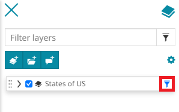
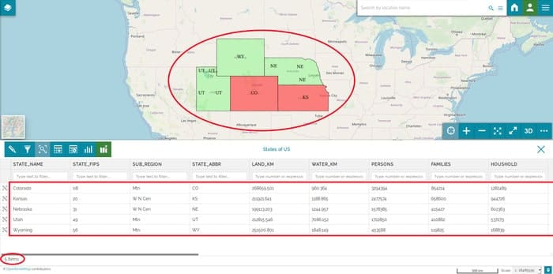
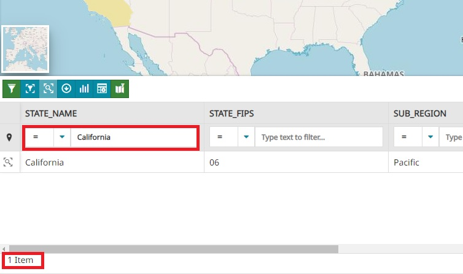
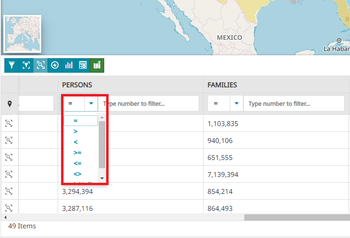
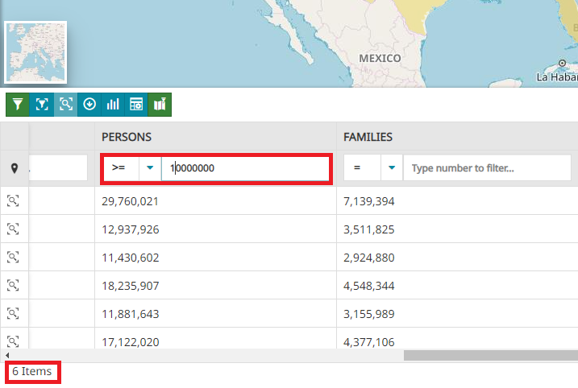
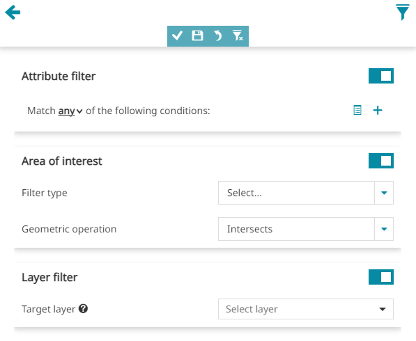
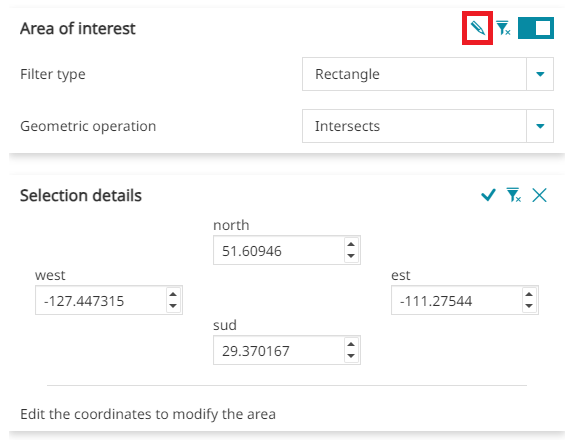
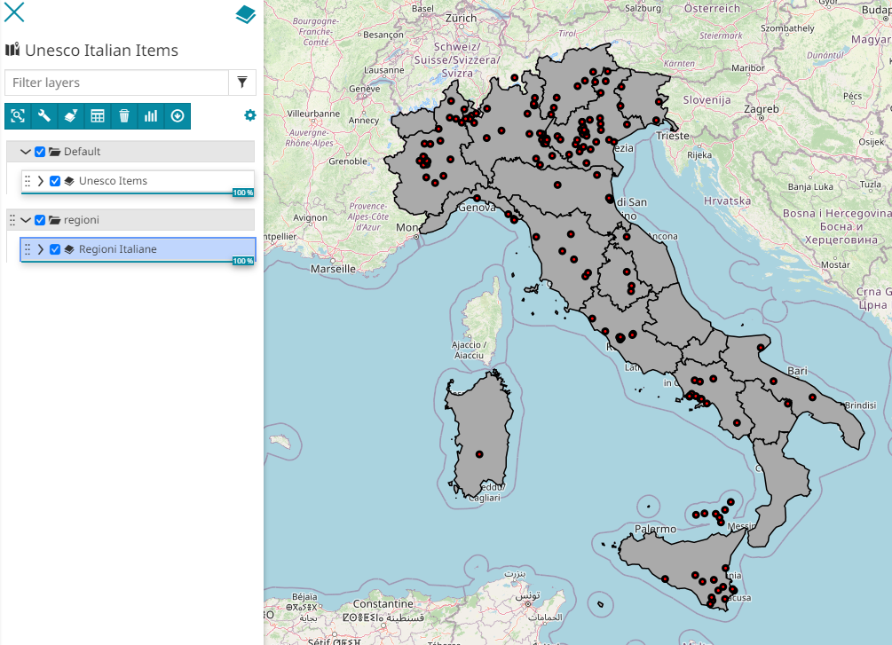

# Фільтрацыя слаёў

******************

Пры працы з вектарнымі слаямі можа быць карысна працаваць з падмноствам аб'ектаў. У сувязі з гэтым, прыкладанне дазваляе карыстальніку наладзіць **Фільтр слоя**, які дзейнічае непасрэдна на слой з даступным WFS і папярэдне фільтруе яго змесціва.
Карта неадкладна абнаўляецца пасля прымянення фільтра.

!!!Папярэджанне
    Магчымасці фільтрацыі працуюць паверх спецыфікацый WFS, таму гэтая служба павінна быць уключана, калі вы хочаце фільтраваць слой з дапамогай інструментаў, апісаных у гэтым раздзеле.

## Тыпы фільтраў

Фільтры да слаёў можна прымяняць трыма рознымі спосабамі:

* З дапамогай інструмента *Фільтр слоя*, даступнага ў [Панэлі зместу](toc.md#table-of-contents)

* З дапамогай інструмента *Пашыраны пошук*, даступнага з [Табліцы атрыбутаў](attributes-table.md#attribute-table)

* З дапамогай *Хуткага фільтра*, даступнага ў [Табліцы атрыбутаў](attributes-table.md#attribute-table)

### Фільтр слоя

Гэты фільтр прымяняецца з дапамогай кнопкі **Фільтр слоя**  на [Панэлі інструментаў слаёў](toc.md#toolbar-options) у Панэлі зместу і будзе захоўвацца ў наступных сітуацыях:

* Пры выкарыстанні іншых інструментаў, такіх як [Інструмент "Ідэнтыфікацыя"](navigation-toolbar.md#identify-tool):

<video class="ms-docimage" controls><source src="../../../ru/user-guide/map/img/filtering-layers/get_filtered_features_info.mp4"/></video>

* Пры прымяненні іншага тыпу фільтра

<video class="ms-docimage" controls><source src="../../../ru/user-guide/map/img/filtering-layers/filtered_advanced_filtering.mp4"/></video>

* Пры наступным адкрыцці карты (неабходна Захаваць карту з [Бакавой панэлі інструментаў](mapstore-toolbars.md#side-toolbar) пасля прымянення фільтра)

Пасля ўстаноўкі *Фільтра слоя* яго можна ўключыць/выключыць, проста націснуўшы на кнопку, якая з'явіцца побач з назвай слоя ў [Панэлі зместу](toc.md#table-of-contents):

Гэты фільтр прымяняецца праз [Панэль запытаў](#панэль-запытаў). Пасля выбару наладак іх можна **Прымяніць** . Пасля гэтага карыстальнік можа:

* **Адмяніць**  апошнія змены

* **Скінуць**  фільтр да зыходнага стану

* **Захаваць**  фільтр, каб зрабіць яго пастаянным

### Пашыраны пошук

Гэты фільтр, які прымяняецца з дапамогай кнопкі **Пашыраны пошук**  у [Табліцы атрыбутаў](attributes-table.md#attribute-table), паводзіць сябе наступным чынам:

* Яго можна выкарыстоўваць для прымянення фільтра да слоя для пошуку ў [Табліцы атрыбутаў](attributes-table.md#attribute-table): гэты фільтр прымяняецца па ўмове `AND` да *Фільтра слоя*, калі ён ужо ўсталяваны.

* Гэты фільтр можна сінхранізаваць з картай з дапамогай значка :

<video class="ms-docimage" style="max-width:500px;" controls><source src="../../../ru/user-guide/map/img/filtering-layers/ar_sync.mp4"/></video>

* Ён будзе аўтаматычна выдаляцца/прымяняцца зноў пры закрыцці/адкрыцці [Табліцы атрыбутаў](attributes-table.md#attribute-table)

Гэты фільтр таксама прымяняецца праз [Панэль запытаў](#панэль-запытаў), але ў гэтым выпадку яго нельга Захаваць і зрабіць пастаянным пры паўторным адкрыцці карты. Карыстальнік можа толькі прымяніць яго, націснуўшы **Пошук** , або, пры неабходнасці, **Скінуць**  яго.

### Хуткі фільтр

Карыстальнік можа выконваць тры тыпы хуткіх фільтраў:

* Фільтр па **атрыбутах**

* Фільтр па **кропцы на карце**

* Фільтр па **бачным экстэнце**

#### Хуткі фільтр па атрыбутах

Гэты фільтр даступны для кожнага слупка ў [Табліцы атрыбутаў](attributes-table.md#attribute-table) прама пад назвамі палёў і можа выкарыстоўвацца ў спалучэнні з іншымі прымененымі фільтрамі:

<video class="ms-docimage" controls><source src="../../../ru/user-guide/map/img/filtering-layers/filtered_quick_filter.mp4"/></video>

Карыстальнік мае магчымасць прымяняць простыя фільтры па атрыбутах, уводзячы значэнне фільтра ў даступныя палі ўводу (у залежнасці ад тыпу даных атрыбутаў даступныя віджэты выбару даты або часу). Пры фільтрацыі па адным або некалькіх атрыбутах запісы слоя ў [Табліцы атрыбутаў](attributes-table.md#attribute-table) аўтаматычна фільтруюцца адпаведным чынам.

Калі карыстальнік хоча адфільтраваць па атрыбуце, ён можа проста ўвесці жаданае значэнне фільтра ў поле ўводу, і спіс запісаў у табліцы будзе аўтаматычна адфільтраваны па супадзенні з уведзеным тэкстам.

Карыстальнік таксама можа адфільтраваць атрыбут, выкарыстоўваючы поле выбару аперацыі. З выпадальнага меню можна выбраць аперацыю для выканання (для атрыбута тыпу *String* гэта могуць быць `=`, `like`, `ilike` або `isNull`, для атрыбута тыпу *Integer*, *Date* або *Time* — `=`, `>`, `<`, `>=`, `<=`, `<>` або `isNull`)

Прыкладам фільтрацыі лікавага поля па супадзенні запісаў, якія *большыя або роўныя* пэўнаму парогаваму значэнню, можа быць:

Карыстальнік таксама можа фільтраваць запісы атрыбутаў тыпу *Date*, *Time* і *DateTime* з дапамогай опцыі *Выбар даты/часу*, націснуўшы на кнопку  для атрыбутаў *Date*, кнопку  для атрыбутаў *Time* і кнопку  для атрыбутаў *DateTime*. Прыкладам фільтрацыі атрыбута *DateTime* з выкарыстаннем опцыі *Выбар даты/часу* можа быць наступны:

<video class="ms-docimage" style="max-width:700px;" controls><source src="../../../ru/user-guide/map/img/filtering-layers/data_time_picker_example.mp4"/></video>

#### Хуткі фільтр па ўзаемадзеянні з картай

Можна фільтраваць запісы ў [Табліцы атрыбутаў](attributes-table.md#attribute-table), пстрыкаючы па карце або робячы выбарку некалькіх аб'ектаў непасрэдна на карце. Карыстальнік можа актываваць кнопку **Фільтр на карце**  (пасля націску кнопка становіцца сіняй), а затым:

* Пстрыкнуць на карце па аб'ектах, якія ён хоча выбраць

* Дадаць некалькі аб'ектаў у выбарку, націснуўшы Ctrl і зноў пстрыкнуўшы па іншых аб'ектах на карце

<video class="ms-docimage" controls><source src="../../../ru/user-guide/map/img/filtering-layers/filter_geometry.mp4"/></video>

* Дадаць некалькі аб'ектаў у выбарку, націснуўшы Ctrl + Alt і намаляваўшы на карце рамку выбару

 <video class="ms-docimage" controls><source src="../../../ru/user-guide/map/img/filtering-layers/filter_geometries.mp4"/></video>

Спіс запісаў у *Табліцы атрыбутаў* будзе аўтаматычна адфільтраваны ў адпаведнасці з выбарам карыстальніка, пасля чаго карыстальнік можа адключыць геаметрычны фільтр з дапамогай кнопкі **Выдаліць фільтр** .

#### Хуткі фільтр па бачным экстэнце

З [Табліцы атрыбутаў](attributes-table.md#attribute-table) карыстальнік можа фільтраваць даныя па бачным экстэнце карты з дапамогай кнопкі **Фільтр па экстэнце** . Пасля націску кнопка-пераключальнік становіцца зялёнай, і спіс запісаў у *Табліцы атрыбутаў* фільтруецца, паказваючы толькі запісы, якія адпавядаюць аб'ектам слоя, што прысутнічаюць у бягучым бачным экстэнце карты.

<video class="ms-docimage" style="max-width:500px;" controls><source src="../../../ru/user-guide/map/img/filtering-layers/filter_viewport.mp4"/></video>

Спіс запісаў у *Табліцы атрыбутаў* аўтаматычна абнаўляецца, калі карыстальнік перамяшчае/маштабуе выгляд карты. Можна дэактываваць **Фільтр па экстэнце** , зноў націснуўшы тую ж кнопку-пераключальнік.

!!! Увага
    *Хуткі фільтр* застаецца актыўным, пакуль адкрыта [Табліца атрыбутаў](attributes-table.md#attribute-table), але, у адрозненне ад *Пашыранага пошуку*, пасля закрыцця [Табліцы атрыбутаў](attributes-table.md#attribute-table) ён больш не з'явіцца, калі [Табліца атрыбутаў](attributes-table.md#attribute-table) будзе адкрыта паўторна.

## Панэль запытаў

Гэты інструмент выкарыстоўваецца для вызначэння пашыраных фільтраў. Ён уключае тры асноўныя раздзелы:

* **Фільтр па атрыбутах**

* **Вобласць інтарэсаў**

* **Фільтр па слоі**

### Фільтр па атрыбутах

Гэты фільтр дазваляе ўсталяваць адну або некалькі ўмоў, якія адносяцца да палёў [Табліцы атрыбутаў](attributes-table.md#attribute-table).
Перш за ўсё, можна выбраць, ці будзе фільтр адпавядаць:

* **Любой** з умоў

* **Усім** умовам

* **Ніводнай** з умоў

Пасля гэтага карыстальнік можа ўставіць адну або некалькі ўмоў, якія таксама могуць быць згрупаваны ў адну або некалькі груп умоў (выкарыстоўвайце кнопку  для стварэння групы).
Умову можна ўсталяваць, выбраўшы значэнне для кожнага з трох палёў уводу:

* Першае поле ўводу дазваляе выбраць поле слоя

* У другім полі ўводу можна выбраць аперацыю для выканання (пры выбары тэкставага поля гэта могуць быць **=**, **like**, **ilike** або **isNull**, пры выбары лікавага поля — **=**, **>**, **<**, **>=**, **<=**, **<>** або **><**)

* Трэцяе поле ўводу (у выпадку палёў тыпу String) прадастаўляе пастаронкавы спіс даступных значэнняў поля, якія ўжо прысутнічаюць у наборы даных слоя (для гэтага выкарыстоўваецца працэс WPS GeoServer). У выпадку лікавых палёў карыстальнік можа проста ўвесці значэнне для выкарыстання ў фільтры.

!!! Увага
    "Пастаронкавы спіс даступных значэнняў поля", згаданы вышэй, даступны толькі ў тым выпадку, калі сервер прадастаўляе працэс WPS `gs:PagedUnique`.

Просты *Фільтр па атрыбутах*, прыменены для лікавага поля, можа быць, напрыклад, такім:

<video class="ms-docimage" style="max-width:600px;" controls><source src="../../../ru/user-guide/map/img/filtering-layers/att_filter.mp4"/></video>

### Вобласць інтарэсаў

Для ўстаноўкі гэтага фільтра карыстальнік можа:

* Выбраць *Тып фільтра*, выбраўшы з **Бачны экстэнт**, **Прамавугольнік**, **Круг**, **Палігон** (пры выбары Прамавугольніка, Круга або Палігона неабходна намаляваць геаметрыю фільтра на карце)

* Выбраць *Геаметрычную аперацыю*, выбраўшы з **Перасякае**, **Утрымліваецца ў**, **Утрымлівае**

Прымяняючы, напрыклад, фільтр *Прамавугольнік* з аперацыяй *Перасякае*, працэс можа выглядаць наступным чынам:

<video class="ms-docimage" style="max-width:600px;" controls><source src="../../../ru/user-guide/map/img/filtering-layers/geom_filter.mp4"/></video>

Пасля ўстаноўкі гэтага фільтра заўсёды можна адрэдагаваць каардынаты і памеры намаляванай геаметрыі фільтра, націснуўшы на кнопку **Дэталі** . Рэдагуючы, напрыклад, круг, можна змяніць каардынаты цэнтра (*x*, *y*) і памер радыуса (*м*):

### Фільтр па слоі

Гэты інструмент дазваляе ўсталёўваць [міжслаёвыя фільтры](https://docs.geoserver.org/stable/en/user/extensions/querylayer/index.html) для слоя, выкарыстоўваючы іншы слой або нават той жа самы.

!!!Папярэджанне
    Гэты інструмент фільтрацыі патрабуе ўстаноўкі плагіна [Query Layer](https://docs.geoserver.org/stable/en/user/extensions/querylayer/index.html#installing-the-querylayer-module) у GeoServer.

Для наладкі міжслаёвага фільтра патрабуюцца наступныя опцыі:

* *Мэтавы слой* (з ліку прысутных у [Панэлі зместу](toc.md#table-of-contents))

* *Аперацыя*, якую трэба выбраць з **Перасякае**, **Утрымліваецца ў** або **Утрымлівае**

* Апцыянальна некаторыя *Умовы* (гл. [Фільтр па атрыбутах](#фільтр-па-атрыбутах))

Каб лепш зразумець гэты тып фільтра, прывядзём прыклад. Выкажам здагадку, карыстальнік хоча адфільтраваць рэгіёны Італіі па аб'ектах ЮНЕСКА:

У прыватнасці, калі наша мэта — паглядзець на рэгіёны Італіі, якія ўтрымліваюць аб'екты ЮНЕСКА з *серыйным кодам = 1*, аперацыі могуць быць наступнымі:

<video class="ms-docimage" controls><source src="../../../ru/user-guide/map/img/filtering-layers/layer_filter.mp4"/></video>